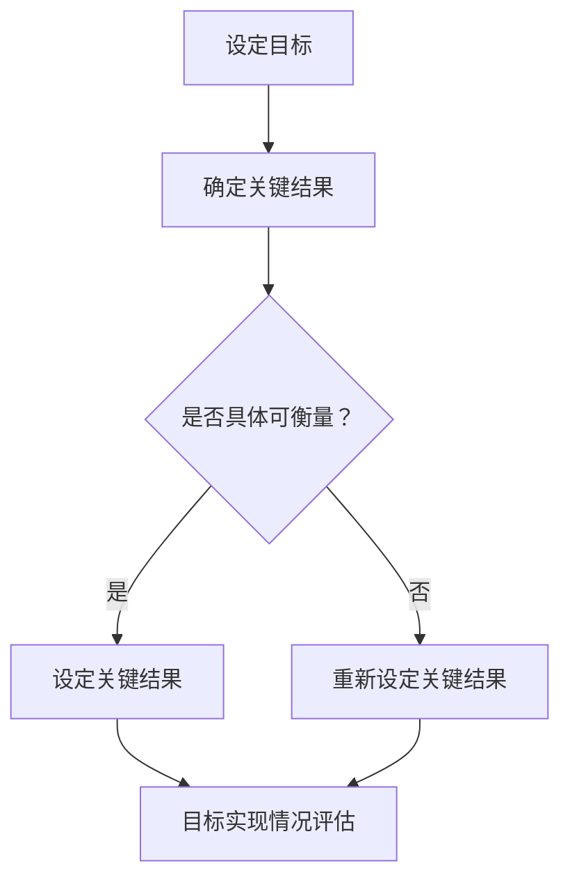

                 

### 概述

在现代企业管理中，目标管理是一个至关重要的环节。它能帮助团队明确方向，提高工作效率，最终实现组织目标。而OKR（目标与关键结果）作为一种系统化的目标管理方法论，已经成为许多成功企业的标准实践。OKR不仅仅是一种目标设定工具，更是一种组织文化，一种激发团队潜能的方法论。

本文旨在详细探讨目标管理OKR的核心理念、实施方法以及其在不同规模团队中的应用。我们将从以下几个方面进行讨论：

1. **OKR的基本概念和原理**：介绍OKR的定义、起源和发展，以及OKR的核心原则。
2. **OKR的架构与流程**：讲解OKR的构成要素，设定和实现OKR的步骤，以及实施OKR的流程。
3. **OKR在不同规模团队中的应用**：探讨OKR在企业、团队和个人层面的应用。
4. **设定和实现OKR的技巧**：分享设定SMART目标、关键结果的方法，以及如何跟踪和评估OKR。
5. **OKR的优势与挑战**：分析OKR的优势以及实施过程中可能遇到的挑战和解决方案。
6. **OKR方法论**：介绍OKR方法论的核心要素，如何构建OKR文化，以及最佳实践。
7. **项目实战**：通过实际案例，展示如何在不同环境中实施OKR，并分析其效果。

通过本文的详细探讨，希望能够为读者提供一套完整、实用的目标管理OKR方法论，帮助团队聚焦于核心目标，实现高效能。

---

#### 关键词

- 目标管理
- OKR
- 团队聚焦
- 企业战略
- 绩效评估

---

#### 摘要

本文详细探讨了目标管理OKR（目标与关键结果）的核心理念、实施方法和应用场景。首先，介绍了OKR的基本概念、起源和发展，以及其核心原则。接着，讲解了OKR的架构与流程，包括设定和实现OKR的步骤。随后，探讨了OKR在不同规模团队中的应用，以及设定和实现OKR的技巧。最后，分析了OKR的优势与挑战，并分享了OKR方法论的实施策略和最佳实践。通过实际案例，展示了OKR在不同环境中的成功应用。

### OKR的基本概念与起源

OKR，即目标与关键结果（Objectives and Key Results），起源于英特尔公司。在20世纪70年代末，英特尔的首席执行官安迪·格鲁夫（Andy Grove）引入了OKR系统，以帮助公司实现快速迭代和持续创新。他希望通过一种结构化的方法，使每个团队成员都能清晰地了解公司的目标，并为之努力。

#### 什么是OKR

OKR由两部分组成：目标（Objective）和关键结果（Key Results）。目标是对团队或个人希望达成的结果的描述，它应该是具有挑战性且可衡量的。关键结果则是达成目标的具体指标，它们量化了目标并提供了衡量进度和成效的标准。

- **目标（Objective）**：目标应明确、具体且具有挑战性。它描述了团队或个人想要达成的成果，例如“提高用户满意度”或“开发新产品线”。目标应该是可衡量的，以便能够明确是否达成。
- **关键结果（Key Results）**：关键结果则是实现目标的具体指标，它们应该是具体、可量化的，例如“用户满意度评分达到4.5分以上”或“新产品发布率达到90%”。

#### OKR的核心原则

OKR的核心原则包括以下几个方面：

1. **挑战性**：OKR应具有挑战性，激励团队不断追求卓越。目标不应该过于简单或过于困难，而应处于一个平衡点。
2. **透明性**：OKR应该对整个组织透明，所有团队成员都能看到团队的目标和关键结果。这有助于确保团队的协同合作，并使每个人都能了解自己的贡献。
3. **反馈循环**：定期检查和反馈是实现OKR的关键。团队应定期评估关键结果的完成情况，并根据反馈调整目标和关键结果。

#### OKR的起源与发展

OKR的起源可以追溯到英特尔，但其真正的流行始于20世纪90年代末和21世纪初。当时，谷歌的首席执行官拉里·佩奇（Larry Page）和谢尔盖·布林（Sergey Brin）将OKR引入谷歌，并将其作为公司的一项核心管理工具。谷歌的成功案例激发了其他科技公司的兴趣，OKR开始在业界广泛传播。

随着时间的推移，许多企业开始采用OKR作为目标管理工具，包括亚马逊、LinkedIn、Twitter等。OKR的流行不仅仅是因为其有效性，还因为它能够促进组织的透明性和协作性。

#### OKR在组织中的重要性

在组织中，OKR的重要性体现在以下几个方面：

1. **明确方向**：OKR帮助团队明确方向，确保每个人都致力于实现共同的目标。
2. **激励员工**：挑战性的目标和关键结果可以激发员工的潜能，提高工作动力。
3. **促进协作**：透明的OKR使团队成员能够了解彼此的目标和进展，促进跨部门协作。
4. **提升绩效**：通过定期的评估和反馈，OKR帮助团队持续改进，提升整体绩效。

总之，OKR不仅仅是一种目标管理工具，它更是一种促进组织发展和员工成长的系统化方法。通过OKR，企业能够实现高效的目标管理，推动组织的持续进步。

#### OKR的核心概念及其关系

为了深入理解OKR的运作机制，我们需要详细探讨其核心概念，并揭示它们之间的关系。OKR由两部分组成：目标（Objective）和关键结果（Key Results），这两者之间有着密切的关联和相互作用。

首先，目标（Objective）是OKR系统中的第一个组成部分。目标是对团队或个人希望达成的结果的描述，它应该明确、具体且具有挑战性。目标设定时，需要考虑以下几个方面：

- **明确性**：目标应清晰明确，避免模糊不清。例如，“提高用户满意度”是一个好的目标，而“提高用户满意度，但不知如何实现”则不够明确。
- **具体性**：目标应具体可衡量，以便能够明确是否达成。例如，“用户满意度评分达到4.5分以上”是一个具体的目标。
- **挑战性**：目标应具有挑战性，激励团队不断追求卓越。目标过于简单或过于困难都不利于团队的成长和激励。

关键结果（Key Results）是目标的量化指标，用于衡量目标的完成情况。关键结果应具体、可量化，并且与目标密切相关。通常，一个目标会包含2到5个关键结果。关键结果的设定应遵循以下原则：

- **具体性**：关键结果应具体可衡量，例如，“用户满意度评分达到4.5分以上”中的“4.5分以上”就是一个具体的关键结果。
- **相关性**：关键结果应与目标密切相关，确保衡量的是目标达成的具体指标。
- **多样性**：关键结果应涵盖多个维度，以便全面评估目标的实现情况。例如，除了用户满意度评分，还可以包括其他关键结果，如新用户注册量、用户活跃度等。

目标与关键结果之间的关系可以理解为“目标是什么，关键结果是如何衡量目标的”。目标提供了方向和框架，而关键结果则是实现目标的量化指标。它们之间的关系可以用Mermaid流程图来表示：

这个流程图清晰地展示了目标与关键结果之间的逻辑关系。首先，团队设定一个明确、具体且具有挑战性的目标。然后，确定几个具体、可量化的关键结果来衡量目标的完成情况。最后，通过定期的评估，团队可以了解目标实现的情况，并根据评估结果进行调整。

在实际应用中，目标与关键结果之间的关系至关重要。它们不仅帮助团队明确目标，还提供了量化的评估标准，使团队能够持续改进，实现持续增长。通过合理设定和跟踪关键结果，团队可以确保目标得以实现，从而推动组织的整体发展。

#### OKR的架构与流程

为了确保OKR的有效实施，我们需要详细了解其架构与流程。OKR的架构包括目标（Objective）和关键结果（Key Results）两个核心部分，而其流程则涵盖了从目标设定到实现、评估和反馈的整个周期。

##### 设定目标的步骤

1. **确定战略目标**：首先，组织需要明确其整体战略目标。这些目标通常是高层决策者设定的，涵盖组织在一段时间内希望实现的主要方向和成果。

2. **分解战略目标**：将战略目标分解为更具体的业务或项目目标。这些目标应与组织战略紧密相关，并能够推动组织向战略目标迈进。

3. **设定团队目标**：各个团队根据业务或项目目标，设定自己的目标。这些目标应具体、可衡量，并与团队职责密切相关。

4. **确定个人目标**：团队成员根据团队目标，设定个人目标。个人目标应与团队目标一致，并能够推动团队目标的实现。

##### 确定关键结果的步骤

1. **识别关键成功因素**：分析目标，确定实现目标所需的关键成功因素。这些因素将直接影响目标的实现，是关键结果的来源。

2. **设定关键结果**：根据关键成功因素，设定具体、可量化的关键结果。关键结果应与目标密切相关，并能够衡量目标的完成情况。

3. **确保关键结果的多样性**：为了全面评估目标的实现情况，关键结果应涵盖多个维度。例如，除了业务指标，还可以包括团队协作、员工满意度等。

##### 实施OKR的流程

1. **发布OKR**：在设定好目标和关键结果后，将这些信息发布给整个组织。透明性是OKR成功的关键，确保所有团队成员都能看到团队的目标和关键结果。

2. **跟踪进度**：定期检查关键结果的完成情况。这通常在每周或每月的会议中进行，通过数据和分析工具来评估进展。

3. **调整OKR**：根据进展情况，适时调整目标和关键结果。如果目标无法按计划实现，团队需要重新评估和调整。

4. **评估和反馈**：在OKR周期结束时，进行全面的评估和反馈。这包括评估关键结果的完成情况，以及分析原因和改进措施。

##### OKR的周期

OKR的周期通常是季度或半年，但也可以根据组织的具体情况灵活调整。通常，OKR周期包括以下几个阶段：

1. **设定周期**：在周期开始时，团队设定目标和关键结果。

2. **执行周期**：在周期内，团队努力实现目标和关键结果。

3. **评估周期**：在周期结束时，进行评估和反馈。

4. **回顾与规划**：总结经验和教训，为下一个周期制定新的目标和关键结果。

##### 实施OKR的注意事项

1. **确保透明性**：确保所有团队成员都能看到目标和关键结果，促进透明和协作。

2. **挑战性**：目标应具有挑战性，激励团队不断追求卓越。

3. **反馈机制**：建立有效的反馈机制，确保团队能够及时了解进度和问题，并采取相应的措施。

4. **灵活调整**：根据实际情况，适时调整目标和关键结果，确保团队能够灵活应对变化。

通过以上架构与流程的详细讲解，我们可以更好地理解如何设定和实施OKR，从而实现团队的目标。接下来，我们将探讨OKR在不同规模团队中的应用，进一步揭示其灵活性和实用性。

#### OKR在不同规模团队中的应用

OKR作为一种灵活且高效的目标管理工具，可以适应不同规模团队的需求。从企业级到团队级，再到个人级，OKR都能发挥其独特的优势，帮助团队实现目标。

##### 企业级OKR

在企业级应用中，OKR被用于确保整个组织在战略方向上一致，并推动整体业务增长。企业级OKR通常由高层管理团队制定，涵盖公司的长期愿景和年度目标。

1. **目标设定**：企业级目标通常由CEO和高层管理者设定，这些目标与公司的战略方向和愿景紧密相关。例如，“实现全球市场份额增长20%”或“提高客户满意度至90%”。

2. **关键结果**：关键结果应具体、可量化，并与企业目标紧密相关。例如，“增加新客户数量至50,000人”，“推出10个新市场”。

3. **透明性**：企业级OKR的透明性至关重要，确保所有员工都能看到公司的目标和进展。这可以通过内部通讯工具、公司会议等方式实现。

##### 团队级OKR

在团队级应用中，OKR帮助团队专注于特定的业务领域或项目，确保团队能够高效协作，实现共同目标。

1. **目标设定**：团队级目标由团队负责人或项目经理制定，这些目标应与公司目标一致，并具体到团队的职责范围。例如，“提高项目交付速度30%”或“开发并上线新的功能模块”。

2. **关键结果**：关键结果应具体、可量化，与团队目标紧密相关。例如，“项目交付提前两周”，“新功能模块用户满意度达到90%”。

3. **协作与沟通**：团队级OKR需要确保团队成员了解自己的目标和责任，并通过定期的团队会议和协作工具，促进团队成员之间的沟通和协作。

##### 个人级OKR

在个人级应用中，OKR帮助个人明确自己的工作目标，提高工作效率和职业发展。

1. **目标设定**：个人级目标由个人自行设定，这些目标应与团队目标和个人职业发展目标相一致。例如，“提升技术能力，掌握新的编程语言”或“提高工作效率，减少任务处理时间”。

2. **关键结果**：关键结果应具体、可量化，反映个人目标的完成情况。例如，“通过X证书”，“完成任务A的响应时间缩短20%”。

3. **自我评估**：个人级OKR需要个人定期自我评估，检查关键结果的完成情况，并根据评估结果进行调整。

##### 不同级别OKR的关系与协调

在企业、团队和个人级别，OKR之间存在密切的关联和协调关系。企业级OKR为团队和个人的目标设定提供方向和框架，团队级OKR细化并实现企业级目标，而个人级OKR确保团队级目标的实现。

1. **目标一致性**：不同级别的OKR应保持目标的一致性，确保各级目标相互支持，共同推动组织的发展。

2. **结果共享**：企业级和团队级的关键结果可以共享给个人级，使个人能够了解自己在组织中的贡献，并激励个人为实现团队和企业的目标而努力。

3. **反馈与调整**：不同级别的OKR需要定期评估和反馈，通过自上而下的反馈和自下而上的调整，确保各级目标都能得到有效实现。

通过在不同规模团队中的应用，OKR展示了其灵活性和实用性，帮助组织实现高效的目标管理。接下来，我们将探讨如何设定和实现OKR，并分享一些实用的技巧。

#### 如何设定和实现OKR

设定和实现OKR是一个系统化的过程，需要遵循一系列步骤和技巧，以确保目标和关键结果（Key Results）能够有效地引导团队的工作。以下是具体的步骤和实用的技巧：

##### 第一步：明确目标

设定OKR的第一步是明确目标。目标（Objective）应该具体、可衡量，并且具有挑战性。以下是一些设定目标时的注意事项：

1. **明确性**：目标应清晰明确，避免模糊不清。例如，“提高用户满意度”不如“将用户满意度评分提高至4.5分以上”具体。

2. **具体性**：目标应具体可量化，以便能够明确是否达成。例如，“提高销售额”不如“将季度销售额提高10%”具体。

3. **挑战性**：目标应具有挑战性，激励团队不断追求卓越。目标过于简单可能无法激发团队的潜力，过于困难则可能导致士气低落。

##### 第二步：确定关键结果

关键结果（Key Results）是衡量目标实现情况的指标，每个目标应包含2到5个关键结果。以下是确定关键结果时需要注意的几个方面：

1. **具体性**：关键结果应具体、可量化，例如，“用户满意度评分提高至4.5分以上”中的“4.5分以上”是一个具体的关键结果。

2. **相关性**：关键结果应与目标密切相关，确保衡量的是目标达成的具体指标。例如，如果目标是“提高用户参与度”，关键结果可以是“日活跃用户数增加20%”。

3. **多样性**：关键结果应涵盖多个维度，以便全面评估目标的实现情况。例如，除了业务指标，还可以包括团队协作、员工满意度等。

##### 第三步：设定SMART目标

SMART目标是一种常用的目标设定方法，它确保目标具有以下五个特征：

1. **具体（Specific）**：目标应明确具体，避免模糊不清。

2. **可衡量（Measurable）**：目标应具有具体的衡量标准，以便能够评估是否达成。

3. **可达到（Achievable）**：目标应具有挑战性，但不应过于困难，确保团队能够实现。

4. **相关（Relevant）**：目标应与组织的整体目标和团队职责密切相关。

5. **有时限（Time-bound）**：目标应设定明确的完成时限，以便团队能够按时推进。

以下是一个SMART目标的例子：“在2023年第三季度，将产品A的销售额提高20%”。

##### 第四步：实现OKR

设定目标只是第一步，实现目标同样重要。以下是一些实现OKR的实用技巧：

1. **分解任务**：将大目标分解为小任务，确保每个任务都有明确的负责人和时间节点。

2. **定期跟踪**：定期检查关键结果的完成情况，确保团队能够及时调整计划和策略。

3. **沟通与协作**：确保团队成员了解自己的任务和目标，并通过定期的沟通和协作，促进团队的协同工作。

4. **灵活调整**：在实现目标的过程中，根据实际情况灵活调整目标和关键结果，确保团队能够应对变化。

##### 第五步：评估和反馈

在OKR周期结束时，进行全面的评估和反馈。以下是一些评估和反馈的注意事项：

1. **全面评估**：评估所有关键结果，了解目标实现的总体情况。

2. **分享经验**：分享成功的经验和失败的教训，帮助团队总结经验，为下一个周期做好准备。

3. **持续改进**：根据评估结果，持续改进目标和关键结果的设定和实现方法。

通过以上步骤和技巧，团队可以更有效地设定和实现OKR，推动团队和组织的持续进步。接下来，我们将探讨OKR的优势和挑战，并分析如何克服这些挑战。

#### OKR的优势与挑战

OKR作为一种目标管理工具，具有许多显著的优势，但也面临着一定的挑战。在本节中，我们将详细探讨OKR的优势以及实施过程中可能遇到的挑战，并提出相应的解决方案。

##### OKR的优势

1. **明确性**：OKR通过具体、可量化的目标和关键结果，使团队和员工能够清楚地了解自己的任务和责任。这有助于提高工作效率，减少模糊和误解。

2. **激励性**：挑战性的目标和关键结果可以激励团队成员不断追求卓越，提高工作动力。这种激励性有助于激发团队潜能，实现更高的绩效。

3. **透明性**：OKR的透明性使得整个组织能够看到团队和个人的目标和进展，促进内部沟通和协作。这有助于建立一种开放和协作的文化氛围。

4. **灵活性**：OKR允许团队在实现目标的过程中灵活调整目标和关键结果，以应对外部环境的变化。这种灵活性有助于团队保持敏捷性，迅速适应新的挑战。

5. **持续改进**：通过定期的评估和反馈，OKR可以帮助团队识别问题，及时调整策略，实现持续改进。这种持续改进的文化有助于团队不断成长和进步。

##### 实施OKR的挑战

1. **设定不切实际的目标**：如果目标设定过于困难，可能会导致团队成员感到沮丧和无力。这需要团队在设定目标时保持平衡，确保目标的挑战性，但不应过于难以实现。

2. **关键结果不足或不当**：关键结果不足或设定不当会影响目标的实现。团队需要在设定关键结果时确保它们与目标密切相关，并且具体、可量化。

3. **缺乏有效的跟踪和评估**：如果没有有效的跟踪和评估机制，团队可能无法及时发现并解决问题。这需要团队建立定期的检查和反馈机制，确保关键结果的完成情况得到及时监控。

4. **文化适应**：对于一些传统组织，实施OKR可能需要改变现有的文化和工作方式。这需要时间和努力，确保团队成员能够适应新的管理方法。

##### 克服挑战的解决方案

1. **合理设定目标**：在设定目标时，团队应进行充分的需求分析和资源评估，确保目标具有挑战性，但能够实现。同时，管理层应提供必要的支持和资源，以帮助团队实现目标。

2. **优化关键结果**：在设定关键结果时，团队应确保关键结果与目标密切相关，并且具体、可量化。可以借助数据分析和工具，帮助团队确定合适的关键结果。

3. **建立跟踪和评估机制**：团队应建立定期的跟踪和评估机制，确保关键结果的完成情况得到及时监控。可以使用项目管理工具和KPI（关键绩效指标）来辅助跟踪和评估。

4. **培养适应文化**：为了顺利实施OKR，组织需要培养一种适应和接受变革的文化。可以通过培训、内部沟通和领导层的示范作用，促进团队成员理解并接受OKR的方法。

通过以上解决方案，团队可以更好地应对实施OKR过程中遇到的挑战，充分利用OKR的优势，实现高效的目标管理。接下来，我们将介绍OKR方法论的核心要素，帮助读者深入了解OKR的实施策略。

#### OKR方法论的核心要素

OKR方法论的核心要素包括目标设定、关键结果设定、反馈循环和文化建设。这些要素相互作用，共同确保OKR的有效实施和持续改进。

##### 目标设定

目标设定是OKR方法论的第一步，也是最为关键的一步。一个明确、具体且具有挑战性的目标能够帮助团队和员工集中精力，确保资源得到合理分配。

1. **明确性**：目标应清晰明确，避免模糊不清。例如，一个具体的例子是“将产品A的销售额提高20%”，而不是“提高销售额”。

2. **具体性**：目标应具体可衡量，以便能够明确是否达成。例如，“销售额提高20%”比“提高销售额”更具可操作性。

3. **挑战性**：目标应具有挑战性，激励团队不断追求卓越。但挑战性不应过高，以至于无法实现。

4. **相关性**：目标应与组织的整体战略和团队的职责密切相关，确保团队的工作与组织的长期目标保持一致。

##### 关键结果设定

关键结果（Key Results）是衡量目标实现情况的指标，一个目标通常包含2到5个关键结果。以下是设定关键结果时需要考虑的几个方面：

1. **具体性**：关键结果应具体、可量化，以便能够准确衡量目标的完成情况。例如，“销售额提高20%”比“销售额提高一些”更具具体性。

2. **相关性**：关键结果应与目标密切相关，确保衡量的是目标达成的具体指标。例如，如果目标是“提高客户满意度”，关键结果可以是“客户满意度评分提高10%”。

3. **多样性**：关键结果应涵盖多个维度，以便全面评估目标的实现情况。例如，除了业务指标，还可以包括团队协作、员工满意度等。

4. **挑战性**：关键结果应具有挑战性，但不应过于困难。这有助于激发团队的积极性，同时确保目标的实现具有实际意义。

##### 反馈循环

反馈循环是OKR方法论的重要组成部分，它确保团队能够及时了解目标的完成情况，并根据反馈进行调整。

1. **定期反馈**：团队应定期（通常为每周或每月）检查关键结果的完成情况，并根据反馈进行调整。这有助于及时发现和解决问题，确保目标得以实现。

2. **透明反馈**：反馈应透明，所有团队成员都能看到关键结果的完成情况，促进团队成员之间的沟通和协作。

3. **自下而上的反馈**：团队应鼓励成员自下而上提供反馈，确保团队成员能够分享他们的意见和建议。这种开放和透明的反馈机制有助于团队不断改进和优化。

##### 文化建设

OKR的成功实施离不开组织文化的支持。一个积极、开放和协作的文化有助于OKR的落地和持续发展。

1. **鼓励透明性**：组织应鼓励透明性，确保所有团队成员都能看到团队的目标和关键结果。这有助于建立信任和协作，促进团队的工作效率。

2. **鼓励挑战**：组织应鼓励团队成员设定具有挑战性的目标，并为他们提供必要的支持。这种挑战性的文化能够激发团队的潜力，提高工作绩效。

3. **持续反馈**：组织应建立定期的反馈机制，鼓励团队成员提供反馈和建议。这种持续反馈的文化有助于团队不断改进和优化，实现长期发展。

通过以上核心要素的实施，团队可以确保OKR的有效实施和持续改进。接下来，我们将探讨如何构建OKR文化，并分享一些最佳实践。

#### 构建OKR文化：最佳实践与挑战

构建OKR文化是确保OKR有效实施的关键。一个健康的OKR文化能够激发团队的潜能，提高工作效率，实现组织目标。以下是构建OKR文化的最佳实践和可能面临的挑战。

##### 最佳实践

1. **高层领导的支持**：高层领导对OKR的推广和实施至关重要。他们应明确表示对OKR的支持，并通过行动和沟通树立榜样。例如，CEO可以定期分享公司的OKR进展，向团队展示OKR的实际效果。

2. **透明的沟通**：透明性是OKR文化的重要组成部分。组织应建立透明的沟通机制，确保所有团队成员都能看到团队和个人的OKR。这可以通过定期的OKR会议、内部通讯平台等方式实现。

3. **定期的反馈与评估**：建立定期的反馈和评估机制，确保团队成员能够及时了解自己的OKR完成情况。这有助于团队及时调整策略，解决潜在问题，确保目标得以实现。

4. **鼓励挑战和创新**：鼓励团队成员设定具有挑战性的目标，并为他们提供必要的资源和支持。这种挑战性的文化能够激发团队的潜能，推动创新和持续改进。

5. **跨部门协作**：OKR强调跨部门协作，组织应促进不同部门之间的沟通和协作。这可以通过跨部门项目、定期的团队会议等方式实现，确保团队和部门之间的目标和关键结果相互支持。

##### 挑战

1. **文化适应**：对于一些传统组织，实施OKR可能需要改变现有的文化和工作方式。这需要时间和努力，确保团队成员能够适应新的管理方法。

2. **缺乏培训**：团队成员可能对OKR不够了解，缺乏必要的培训和支持。组织应提供定期的培训和工作坊，帮助团队成员掌握OKR的方法和技巧。

3. **实施难度**：OKR的实施需要一系列的工具和流程，组织可能面临实施难度。例如，如何有效地设定关键结果，如何确保关键结果的跟踪和评估等。

##### 解决方案

1. **逐步引入**：对于文化适应问题，组织可以逐步引入OKR，从部分团队或项目开始试点，然后逐步推广到整个组织。这种逐步引入的方法有助于降低文化适应的难度。

2. **提供培训**：组织应提供定期的培训和工作坊，帮助团队成员掌握OKR的方法和技巧。这可以包括线上培训、内部讲座、实践工作坊等。

3. **引入OKR工具**：使用OKR工具可以简化关键结果的设定和跟踪过程，提高实施效率。这些工具可以提供数据分析和可视化功能，帮助团队更好地了解OKR的进展。

通过以上最佳实践和解决方案，组织可以构建一个健康的OKR文化，推动团队和组织的持续进步。接下来，我们将分享一些OKR实施的最佳实践，帮助团队更好地运用OKR。

#### OKR实施的最佳实践

实施OKR是一个系统化的过程，需要遵循一系列最佳实践，以确保OKR能够有效地推动团队和组织的发展。以下是OKR实施过程中的一些最佳实践：

##### 第一步：明确组织战略目标

在实施OKR之前，组织需要明确其战略目标。这些目标应与组织的愿景和使命一致，并能够为团队提供明确的指导方向。高层领导应负责制定组织战略目标，并将其分解为更具体的业务或项目目标。

##### 第二步：制定团队和个人的OKR

根据组织战略目标，各个团队和员工应制定自己的OKR。团队OKR应与业务目标紧密相关，并具体到团队的职责范围。个人OKR则应与团队目标一致，并反映个人的职业发展目标。

1. **目标设定**：目标应具体、可衡量，并具有挑战性。例如，“提高项目交付速度20%”或“开发并上线新的功能模块”。

2. **关键结果设定**：关键结果应具体、可量化，并与目标密切相关。例如，“项目交付提前一周”或“新功能模块用户满意度达到90%”。

##### 第三步：发布和沟通OKR

在制定好OKR后，应将其发布给整个组织，确保所有团队成员都能看到团队和个人的目标以及关键结果。发布可以通过内部通讯平台、团队会议等方式进行。透明性是OKR成功的关键，确保团队成员了解彼此的目标和进展，促进协作和沟通。

##### 第四步：定期跟踪和评估

为了确保OKR的有效实施，团队需要定期跟踪关键结果的完成情况。这通常在每周或每月的OKR会议中进行，通过数据和分析工具来评估进展。评估结果应透明，所有团队成员都能了解自己的OKR完成情况。

1. **周度或月度跟踪**：定期检查关键结果的完成情况，确保团队能够及时发现问题并调整计划。

2. **季度或半年评估**：在OKR周期结束时，进行全面的评估和反馈，总结经验和教训，为下一个周期做好准备。

##### 第五步：灵活调整OKR

在实施OKR的过程中，团队可能需要根据实际情况灵活调整目标和关键结果。例如，如果某个关键结果无法按计划实现，团队可以重新评估和调整OKR，以确保目标仍然具有挑战性，但能够实现。

##### 第六步：持续改进和反馈

OKR的实施是一个持续的过程，团队需要不断改进和优化。通过定期的评估和反馈，团队可以识别问题和改进机会，确保OKR能够持续推动团队和组织的发展。

1. **持续改进**：根据评估结果，持续优化目标和关键结果的设定和实现方法。

2. **反馈机制**：建立有效的反馈机制，鼓励团队成员提供反馈和建议，促进团队之间的沟通和协作。

##### 第七步：文化建设

构建一个支持OKR的文化至关重要。组织应鼓励透明性、挑战性和持续反馈，确保团队成员能够适应和接受OKR的方法。

1. **透明性**：确保所有团队成员都能看到团队和个人的OKR，促进协作和沟通。

2. **挑战性**：鼓励团队成员设定具有挑战性的目标，并为他们提供必要的资源和支持。

3. **持续反馈**：建立定期的反馈机制，鼓励团队成员提供反馈和建议，促进团队之间的沟通和协作。

通过以上最佳实践，团队可以更有效地实施OKR，实现高效的目标管理，推动团队和组织的持续进步。接下来，我们将通过实际案例来展示如何在不同环境中实施OKR。

### 项目实战：实施OKR的详细过程

在本节中，我们将通过一个实际案例，详细展示如何在不同环境中实施OKR，从项目规划到实施、评估和反馈，以及项目总结。这个案例将帮助我们更好地理解OKR的实际应用和操作过程。

#### 项目背景

一家初创科技公司（XYZ公司）正在开发一款新的移动应用程序，旨在为用户提供高效的日程管理工具。公司希望在接下来的三个月内完成产品开发，并进行初步的市场测试。为了确保项目顺利进行，公司决定采用OKR方法进行目标管理。

#### 设定目标和关键结果

**团队OKR：**
- **目标**：在三个月内完成移动应用程序的初步开发，并准备进行市场测试。
- **关键结果**：
  - **KR1**：在第一个月内完成用户界面设计和技术架构搭建。
  - **KR2**：在第二个月内实现核心功能的开发，并通过内部测试。
  - **KR3**：在第三个月内完成所有功能的开发，并进行初步的用户测试。

**个人OKR：**
- **团队成员A（UI设计师）**：
  - **目标**：确保用户界面设计符合用户体验标准，并在第一个月内完成。
  - **关键结果**：
    - **KR1**：在第一个月内完成90%的用户界面设计稿。
    - **KR2**：在第一个月内完成用户界面设计评审，并收集反馈。

- **团队成员B（后端开发者）**：
  - **目标**：确保技术架构稳定，并实现核心功能。
  - **关键结果**：
    - **KR1**：在第二个月内完成技术架构的设计和搭建。
    - **KR2**：在第二个月内完成核心功能的开发，并通过内部测试。

#### 实施过程

**第一步：项目规划**

在项目开始前，团队召开了一次会议，讨论了项目的目标和关键结果，并明确了每个人的职责和任务。团队制定了详细的项目计划，包括时间表、里程碑和关键任务的分配。

**第二步：每周跟踪和评估**

团队每周举行一次会议，检查关键结果的进展情况，并根据实际进展调整计划。以下是一个典型的会议流程：

1. **回顾上周的工作**：每个成员分享上周完成的任务和遇到的挑战。
2. **检查关键结果**：团队讨论每个关键结果的完成情况，识别问题和改进点。
3. **调整计划**：根据关键结果的完成情况，团队调整下周的计划，确保项目能够按计划推进。

**第三步：实施关键结果**

在实施过程中，团队成员根据关键结果的具体任务，努力工作，确保项目进度。例如，UI设计师在第一周内完成了90%的设计稿，并在第二周内进行了用户界面设计评审，收集了用户的反馈。

**第四步：月度评估和反馈**

在每个月底，团队进行一次月度评估，检查关键结果的完成情况，并根据评估结果调整下一月的目标和关键结果。以下是一个典型的月度评估流程：

1. **总结关键结果的完成情况**：团队总结每个关键结果的完成情况，识别成功和失败的原因。
2. **讨论改进措施**：团队讨论如何改进下一月的目标和关键结果，确保项目能够顺利进行。
3. **调整目标和关键结果**：根据评估结果，团队调整下一月的目标和关键结果，确保项目能够按计划推进。

#### 项目评估和反馈

在项目结束时，团队进行了一次全面的项目评估，检查所有关键结果的完成情况，并总结了项目过程中的经验和教训。以下是一个典型的项目评估流程：

1. **总结项目成果**：团队总结项目的主要成果，包括完成的任务、达成的关键结果和项目的整体效果。
2. **讨论经验和教训**：团队讨论项目过程中的成功经验和失败教训，总结可复制的最佳实践和需要改进的方面。
3. **制定改进计划**：团队根据评估结果，制定改进计划，为下一个项目做好准备。

#### 项目总结

通过实施OKR，XYZ公司成功地完成了移动应用程序的初步开发，并在三个月内进行了初步的市场测试。以下是一些项目总结：

- **成功经验**：OKR方法帮助团队明确了目标，并确保关键任务的按时完成。通过定期的跟踪和评估，团队能够及时发现并解决问题，确保项目进度。
- **失败教训**：在项目初期，团队成员对OKR的设定和跟踪不够熟练，导致部分关键结果未能按时完成。未来，团队需要加强对OKR方法的培训，提高团队成员的熟练度。
- **改进建议**：为了进一步提高项目的效率，团队计划在下一个项目中引入更多的自动化工具和流程，以简化关键结果的跟踪和评估过程。

通过这个实际案例，我们可以看到，OKR方法在项目实施过程中的具体应用和操作过程。通过明确的目标和关键结果，团队能够更好地管理项目进度，提高工作效率，实现项目的成功。接下来，我们将分享一些OKR最佳实践的技巧和注意事项。

### OKR最佳实践：技巧与注意事项

在实际应用OKR的过程中，掌握一些最佳实践技巧和注意事项至关重要，以确保OKR能够有效地推动团队和组织的发展。以下是一些实用的技巧和注意事项：

#### 技巧

1. **合理设定目标**：
   - **挑战性**：目标应具有挑战性，但不应过于困难，确保团队能够实现。
   - **具体性**：目标应具体、可量化，以便能够明确是否达成。
   - **相关性**：目标应与组织的整体战略和团队的职责密切相关。

2. **关键结果设定**：
   - **多样性**：关键结果应涵盖多个维度，如业务指标、团队协作、员工满意度等。
   - **相关性**：关键结果应与目标密切相关，确保衡量的是目标达成的具体指标。
   - **具体性**：关键结果应具体、可量化，例如，“用户满意度评分提高10%”比“提高满意度”更具操作性。

3. **定期跟踪与评估**：
   - **透明性**：确保所有团队成员都能看到关键结果的完成情况，促进内部沟通和协作。
   - **及时反馈**：定期检查关键结果的完成情况，并根据反馈进行调整。

4. **灵活调整**：
   - **根据实际情况**：如果关键结果无法按计划实现，团队应适时调整目标和关键结果，确保目标仍然具有挑战性，但能够实现。

5. **跨部门协作**：
   - **明确职责**：确保不同部门之间的目标和关键结果相互支持，明确各部门的职责和协作方式。
   - **定期沟通**：通过跨部门会议和沟通工具，促进不同部门之间的协作和协调。

#### 注意事项

1. **避免目标过多**：
   - **集中精力**：确保团队专注于关键的目标，避免分散精力。通常，一个团队在一个周期内应设定3-5个主要目标。

2. **明确责任与任务**：
   - **分工明确**：确保每个团队成员都清楚自己的目标和任务，避免职责不明导致的工作低效。

3. **持续培训与支持**：
   - **提升技能**：为团队成员提供定期的培训和支持，确保他们能够熟练掌握OKR的设定和跟踪技巧。

4. **保持透明与开放**：
   - **促进沟通**：建立透明的沟通机制，确保团队成员了解彼此的目标和进展，促进团队内部的协作和信任。

5. **避免形式主义**：
   - **务实执行**：确保OKR的实施务实有效，避免陷入形式主义的困境。关键在于目标和关键结果的实现，而不仅仅是填写和提交文档。

通过以上最佳实践和注意事项，团队可以更有效地实施OKR，推动团队和组织的持续进步。最后，我们将总结本文的主要内容，并强调目标管理OKR的重要性和应用价值。

### 总结

本文详细探讨了目标管理OKR的核心理念、实施方法以及在不同规模团队中的应用。通过逐步分析和实际案例展示，我们了解了OKR如何帮助团队明确目标、提高工作效率、实现组织目标。

首先，OKR由目标（Objective）和关键结果（Key Results）两部分组成，具有明确性、具体性和挑战性的特点。通过SMART目标设定技巧，团队能够确保目标的可衡量性和可实现性。

其次，OKR的实施过程包括目标设定、关键结果设定、跟踪评估和反馈循环。这一过程帮助团队保持透明、激励员工、促进协作和持续改进。

第三，OKR在不同规模团队中的应用，如企业级、团队级和个人级，展示了其灵活性和适应性。通过明确的职责划分和定期的沟通与评估，团队能够确保目标的实现。

此外，本文还分析了OKR的优势和挑战，并提出了相应的解决方案。通过合理设定目标、优化关键结果、建立有效的跟踪和评估机制，团队可以克服挑战，充分发挥OKR的优势。

总之，目标管理OKR是一种系统化、高效的目标管理方法，有助于团队和组织实现高效能。通过本文的探讨，我们希望读者能够更好地理解OKR的方法论，并在实际工作中运用，推动团队和组织的发展。

### 作者信息

作者：AI天才研究院/AI Genius Institute & 禅与计算机程序设计艺术 /Zen And The Art of Computer Programming

AI天才研究院（AI Genius Institute）是一家专注于人工智能和计算机科学研究的国际顶尖机构。研究院致力于推动人工智能技术的创新和应用，培养下一代计算机科学家。同时，研究院还致力于将人工智能与哲学相结合，探索计算机编程的艺术性和深度。

禅与计算机程序设计艺术（Zen And The Art of Computer Programming）是一本经典的计算机科学书籍，由埃德加·戴克斯特拉（Edsger W. Dijkstra）所著。本书深入探讨了计算机程序设计的哲学和艺术，对计算机科学领域产生了深远的影响。

作为AI天才研究院的研究员，我致力于将前沿的人工智能技术应用于实际场景，推动计算机科学的发展。同时，我也热衷于将哲学思维引入计算机编程，探索计算机编程的深层次意义。希望我的研究成果能够为读者带来启示，助力他们在目标管理和技术探索的道路上取得更大的成就。

