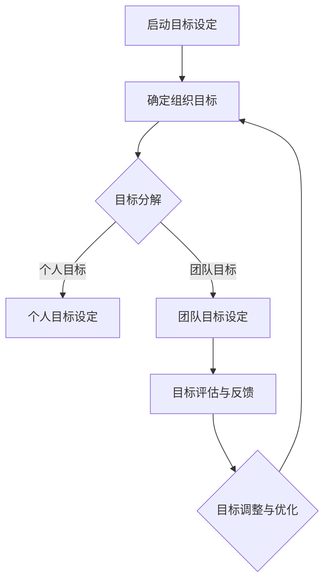

                 

# 《目标设定：引导团队前进的指南针》

> **关键词：** 目标设定、团队协作、目标管理、目标分解、实施跟踪

> **摘要：** 本文档旨在通过深入探讨目标设定的核心概念、原则和方法，为团队管理者提供一套科学有效的目标设定指南。我们将从背景介绍出发，详细解析目标设定的重要性，介绍目标设定的基本概念与联系，阐述团队目标设定的原理，提供具体的实施策略，探讨如何进行目标跟踪与评估，最后总结最佳实践并提供拓展阅读资源。

---

## 目录

1. **背景介绍**
   - **团队目标的必要性**
   - **目标设定的现状**

2. **核心概念与联系**
   - **目标设定的定义**
   - **目标层次结构**
   - **Mermaid流程图：目标设定的架构**

3. **团队目标设定**
   - **团队沟通与协作**
   - **个人目标与团队目标的结合**
   - **目标分解与优先级设定**

4. **目标实施与跟踪**
   - **实施策略**
   - **跟踪工具与技术**
   - **目标调整与反馈循环**

5. **项目实战**
   - **开发环境搭建**
   - **源代码实现与解读**
   - **代码应用解读与分析**
   - **实际案例分析与讲解**
   - **项目小结**

6. **最佳实践与总结**
   - **注意事项**
   - **小结**
   - **拓展阅读**

7. **结语**
   - **作者信息**

---

## 1. 背景介绍

### 团队目标的必要性

在当今快速变化和竞争激烈的市场环境中，团队的目标设定显得尤为重要。有效的目标设定不仅能够明确团队的方向，还能提高团队的工作效率，激发成员的潜力，实现组织的目标。然而，目标设定的现状却存在诸多挑战：

- **目标不明确**：许多团队在设定目标时缺乏清晰的方向，导致工作偏离主题。
- **目标不具体**：目标过于模糊或抽象，使得团队成员难以理解和执行。
- **目标不一致**：团队成员的个人目标与团队目标存在冲突，导致协作困难。
- **目标不切实际**：目标过于理想化，缺乏可行性和挑战性，难以实现。

为了解决这些问题，我们需要一套科学有效的目标设定方法，以引导团队前进。本文将围绕这一主题，深入探讨目标设定的核心概念、方法和实践，为团队管理者提供实用的指南。

### 目标设定的现状

目前，目标设定在团队管理中普遍存在以下几种情况：

1. **目标缺乏系统性和持续性**：许多团队在设定目标时缺乏系统性规划和持续性跟踪，导致目标难以落地实施。
2. **目标设定过程不透明**：目标设定往往由个别领导或决策者主导，缺乏团队成员的参与和共识，导致执行效果不佳。
3. **目标与资源不匹配**：目标设定时未能充分考虑团队的资源状况，导致资源浪费或不足。
4. **目标评估不科学**：目标设定后缺乏科学的评估方法，导致无法及时发现问题并进行调整。

针对上述现状，本文将介绍一套科学的目标设定方法，帮助团队管理者克服这些挑战，实现目标的有效设定和实施。

## 2. 核心概念与联系

### 目标设定的定义

目标设定是指团队或个人为了实现特定目标，制定一系列明确的、具体的、可衡量的目标，并通过执行计划逐步实现这些目标的过程。目标设定的核心在于明确目标、分解任务、制定计划、跟踪进度和调整策略。

### 目标层次结构

目标层次结构是目标设定的基础，它通常包括以下三个层次：

1. **个人目标**：个人目标的设定应该与团队目标相一致，同时考虑个人的兴趣和能力。
2. **团队目标**：团队目标应该基于组织的目标，明确团队需要实现的关键任务和成果。
3. **组织目标**：组织目标是指企业或机构希望实现的长远愿景和战略目标。

### Mermaid流程图：目标设定的架构

以下是一个简单的Mermaid流程图，用于展示目标设定的架构：



### 目标设定的核心原则

1. **明确性**：目标必须明确具体，能够量化和衡量。
2. **相关性**：目标应与组织目标和个人目标相一致，有助于实现整体战略。
3. **可执行性**：目标应具备可执行性，明确责任人、时间和资源需求。
4. **挑战性**：目标应具有挑战性，激发团队潜力，提高工作效率。

### 目标设定的方法

目标设定的方法包括以下步骤：

1. **确定目标**：明确组织目标，分解为团队和个人目标。
2. **制定计划**：制定实现目标的详细计划，包括任务分配、时间表和资源调配。
3. **执行计划**：按计划执行任务，确保每个目标得到落实。
4. **跟踪进度**：定期检查进度，发现和解决问题。
5. **评估结果**：评估目标完成情况，总结经验教训。

### 目标设定的挑战与应对策略

目标设定过程中可能会遇到以下挑战：

1. **目标不明确**：通过明确目标定义和具体指标来避免。
2. **资源不足**：合理分配资源，寻求外部支持。
3. **执行力不足**：加强团队培训，提高执行力。
4. **目标不一致**：通过团队沟通和共识来统一目标。

通过上述核心概念与联系的分析，我们可以更好地理解和应用目标设定的方法，为团队提供清晰的指南。

## 3. 团队目标设定

### 团队沟通与协作

团队目标设定的第一步是确保团队成员之间的有效沟通和协作。良好的沟通能够确保每个成员都理解团队的总体目标，并明确自己的职责和期望。以下是一些关键步骤：

1. **明确团队目标**：在设定团队目标时，首先要明确团队需要实现的目标是什么。这需要团队成员共同参与讨论，确保目标具有相关性、明确性和可执行性。
2. **分配任务**：在明确了团队目标后，需要对任务进行合理分配。每个成员应该清楚地知道自己的职责和任务，以及这些任务与团队目标之间的关系。
3. **定期沟通**：定期召开团队会议，讨论目标进展和遇到的困难，确保团队成员之间保持良好的沟通。

### 个人目标与团队目标的结合

个人目标与团队目标的结合是确保团队协作成功的关键。以下是一些策略：

1. **目标一致性**：确保个人目标与团队目标相一致。个人目标应该有助于实现团队目标，而不是相互冲突。
2. **目标分解**：将团队目标分解为具体的个人目标，确保每个成员都明确自己的责任和期望。
3. **目标跟踪**：定期跟踪个人目标的完成情况，确保每个成员都在按照计划前进。

### 目标分解与优先级设定

目标分解是将大目标分解为小目标，以便更容易实现。以下是一些目标分解和优先级设定的策略：

1. **SMART原则**：使用SMART（具体、可衡量、可达成、相关性强、有时间限制）原则来设定目标，确保目标具体、明确、可行。
2. **优先级设定**：根据目标的重要性和紧急性，设定优先级。首先关注最重要的目标，并确保这些目标在规定的时间内完成。
3. **资源调配**：根据目标的优先级和资源情况，合理调配资源，确保关键目标得到足够的支持和资源。

通过上述团队目标设定的策略，我们可以确保团队目标与个人目标相结合，提高团队的协作效率和目标实现率。

### 实施策略与工具

在团队目标设定后，关键在于如何有效地实施这些目标。以下是一些策略和工具：

1. **制定行动计划**：将目标分解为具体的任务，并为每个任务制定详细的行动计划，包括责任人、时间表和资源需求。
2. **使用项目管理工具**：如Trello、Jira等，可以帮助团队跟踪任务的进展和项目进度。
3. **定期回顾与调整**：定期召开会议，回顾目标进展，识别和解决问题，并根据实际情况调整计划和策略。

### 目标跟踪与评估

目标跟踪和评估是确保目标实现的关键步骤。以下是一些方法和工具：

1. **关键绩效指标（KPI）**：设定关键绩效指标，以量化目标的完成情况。
2. **定期报告**：定期向团队成员和领导汇报目标进展，确保信息的透明和及时性。
3. **数据分析**：使用数据分析工具，如Google Analytics等，对目标完成情况进行全面分析。

通过实施有效的目标和跟踪策略，团队可以确保目标的实现，并在实现过程中不断优化和调整。

### 遇到的问题与解决方案

在目标设定和实施过程中，团队可能会遇到各种问题。以下是一些常见问题和相应的解决方案：

1. **目标不明确**：通过明确目标定义和具体指标来避免。
2. **资源不足**：合理分配资源，寻求外部支持。
3. **执行力不足**：加强团队培训，提高执行力。
4. **目标不一致**：通过团队沟通和共识来统一目标。

通过识别和解决这些问题，团队可以更好地实现目标，提高工作效率。

### 团队目标设定的实践案例

以下是一个团队目标设定的实践案例：

**案例背景**：某科技公司的一个开发团队需要在6个月内完成一款新产品的开发。

**团队目标**：确保产品在规定时间内完成，并达到预期质量。

**实施步骤**：

1. **目标分解**：将整体目标分解为多个子任务，如需求分析、设计、编码、测试等。
2. **任务分配**：为每个子任务分配责任人，明确每个人的职责。
3. **制定行动计划**：为每个任务制定详细的行动计划，包括时间表和资源需求。
4. **跟踪进度**：使用Trello等工具跟踪任务进展，定期召开会议讨论进展和问题。
5. **评估与反馈**：定期评估任务完成情况，及时调整计划和策略。

通过上述步骤，团队成功在6个月内完成了产品的开发，并达到了预期质量。

### 实践总结与最佳实践

通过团队目标设定的实践案例，我们可以得出以下总结和最佳实践：

1. **明确目标**：确保目标具体、明确、可量化。
2. **沟通协作**：加强团队成员之间的沟通和协作。
3. **任务分配**：合理分配任务，明确每个人的职责。
4. **跟踪进度**：定期跟踪任务进展，及时调整计划和策略。
5. **评估反馈**：定期评估目标完成情况，总结经验教训。

通过遵循这些最佳实践，团队可以更有效地实现目标，提高工作效率。

## 4. 目标实施与跟踪

### 实施策略

在目标设定之后，实施策略是确保目标能够顺利实现的关键。以下是一些关键的策略：

1. **明确责任**：为每个任务分配明确的负责人，确保任务的执行有专人负责。
2. **制定详细计划**：为每个目标制定详细的实施计划，包括具体的时间表、资源需求和预期成果。
3. **资源配置**：根据实施计划，合理分配资源，确保关键任务得到足够的支持。
4. **团队协作**：鼓励团队成员之间的协作，确保每个成员都能充分发挥自己的优势。
5. **定期检查**：定期检查目标的进展情况，及时发现和解决问题。

### 跟踪工具与技术

为了确保目标实施的有效性，需要使用一些跟踪工具和技术。以下是一些常用的工具：

1. **项目管理软件**：如Trello、Jira等，可以帮助团队跟踪任务进展，分配任务，管理资源。
2. **关键绩效指标（KPI）**：设定关键绩效指标，用于量化目标的完成情况，如项目进度、代码质量、用户满意度等。
3. **数据可视化工具**：如Google Analytics、Tableau等，可以帮助团队直观地查看数据，分析目标进展。

### 目标调整与反馈循环

在目标实施过程中，可能会出现一些意外情况，导致目标无法按计划实现。这时，目标调整和反馈循环变得尤为重要。以下是一些关键步骤：

1. **定期评估**：定期评估目标进展，识别偏差和问题。
2. **调整计划**：根据评估结果，及时调整实施计划，确保目标能够重新回到正轨。
3. **反馈机制**：建立有效的反馈机制，鼓励团队成员分享经验和建议，不断优化目标实施过程。

### 实际案例分析

以下是一个目标实施和跟踪的实际案例：

**案例背景**：某互联网公司的产品团队需要在三个月内完成一款移动应用的开发。

**实施策略**：

1. **明确责任**：为每个任务分配明确的负责人，确保任务的执行有专人负责。
2. **制定详细计划**：为每个任务制定详细的时间表和资源需求，确保任务按计划进行。
3. **资源配置**：确保每个任务都有足够的资源支持，如人力、技术支持等。
4. **团队协作**：定期召开团队会议，讨论项目进展和问题，确保团队成员之间的沟通和协作。
5. **定期检查**：每周检查一次项目的进展，识别和解决问题。

**跟踪工具**：

1. **项目管理软件**：使用Trello跟踪任务进展，分配任务，管理资源。
2. **关键绩效指标（KPI）**：设定项目进度、代码质量、用户满意度等关键绩效指标，用于量化目标完成情况。

**目标调整与反馈循环**：

1. **定期评估**：每周对项目进展进行评估，识别偏差和问题。
2. **调整计划**：根据评估结果，及时调整计划和策略，确保项目能够按计划进行。
3. **反馈机制**：建立反馈机制，鼓励团队成员分享经验和建议，不断优化目标实施过程。

通过上述策略和工具，产品团队成功在三个月内完成了移动应用的开发，并达到了预期质量。

### 实践总结与最佳实践

通过目标实施和跟踪的实践案例，我们可以总结出以下最佳实践：

1. **明确责任**：确保每个任务都有明确的负责人，提高任务执行的效率。
2. **制定详细计划**：为每个任务制定详细的时间表和资源需求，确保任务按计划进行。
3. **定期检查**：定期检查项目进展，及时发现问题并进行调整。
4. **使用跟踪工具**：使用项目管理软件和关键绩效指标（KPI）等工具，确保目标实施过程的可视化和可控性。
5. **建立反馈机制**：鼓励团队成员分享经验和建议，不断优化目标实施过程。

通过遵循这些最佳实践，团队可以更有效地实现目标，提高工作效率。

## 5. 项目实战

### 开发环境搭建

在进行项目实战之前，首先需要搭建一个合适的开发环境。以下是搭建环境的具体步骤：

1. **安装操作系统**：选择一个合适的操作系统，如Ubuntu或MacOS。
2. **安装Python**：在操作系统上安装Python环境，可以使用`pip`来安装所需的Python库。
3. **安装数据库**：根据项目需求安装相应的数据库，如MySQL或PostgreSQL。
4. **安装IDE**：安装一个集成开发环境（IDE），如PyCharm或Visual Studio Code，以方便编码和调试。

### 源代码实现与解读

接下来，我们将通过Python源代码实现一个简单的目标设定系统，并对关键部分进行详细解读。

```python
# 目标设定系统示例代码

class Goal:
    def __init__(self, name, description, target, deadline):
        self.name = name
        self.description = description
        self.target = target
        self.deadline = deadline
        self.status = "未开始"

    def start(self):
        self.status = "进行中"

    def complete(self):
        self.status = "已完成"

    def is_overdue(self):
        return self.status == "未开始" or (self.status == "进行中" and self.deadline < current_date())

def current_date():
    # 这里可以使用datetime模块来获取当前日期
    from datetime import datetime
    return datetime.now()

# 创建目标实例
goal1 = Goal("完成文档编写", "完成产品需求文档的编写", "2023-10-01", "2023-09-30")

# 跟踪目标状态
print(f"目标名称：{goal1.name}")
print(f"目标状态：{goal1.status}")
goal1.start()
print(f"目标状态更新：{goal1.status}")
goal1.complete()
print(f"目标状态更新：{goal1.status}")

# 检查目标是否逾期
if goal1.is_overdue():
    print("目标已逾期！")
else:
    print("目标按计划进行。")
```

#### 关键代码解析

1. **Goal类**：该类用于定义目标，包含目标名称、描述、目标值和截止日期等属性，以及开始、完成和检查是否逾期的方法。
2. **start()方法**：用于将目标状态更新为“进行中”。
3. **complete()方法**：用于将目标状态更新为“已完成”。
4. **is_overdue()方法**：用于检查目标是否已经逾期。

#### 代码应用解读与分析

以上代码提供了一个简单的目标设定和跟踪系统。在实际项目中，我们可以进一步扩展该系统，添加更多功能，如：

1. **多用户支持**：允许多个用户添加和跟踪目标。
2. **目标进度跟踪**：记录目标完成的进度，并动态更新目标状态。
3. **数据持久化**：将目标数据保存到数据库，以便长期存储和管理。

通过这种方式，我们可以构建一个功能丰富、易于扩展的目标设定系统，满足不同团队和项目的需求。

### 实际案例分析与讲解

以下是一个实际案例，用于分析目标设定系统的应用效果。

**案例背景**：某互联网公司的产品团队需要在一个月内完成一个新功能的开发。

**目标设定**：

- **目标名称**：新功能开发
- **描述**：完成产品新功能的开发，包括需求分析、设计、编码和测试。
- **目标值**：确保新功能在规定时间内高质量交付。
- **截止日期**：2023-11-30

**实施过程**：

1. **需求分析**：团队召开会议，明确新功能的需求，并记录在目标设定系统中。
2. **设计阶段**：设计团队根据需求文档进行设计，并将设计稿上传到目标设定系统。
3. **编码阶段**：开发团队根据设计稿开始编码，并在目标设定系统中记录每天的进展。
4. **测试阶段**：测试团队对编码完成的功能进行测试，并在目标设定系统中记录测试结果。

**目标跟踪与评估**：

1. **定期检查**：每周对目标进展进行一次检查，识别问题和风险。
2. **关键绩效指标（KPI）**：设定关键绩效指标，如功能完成率、代码质量、用户满意度等。
3. **评估与反馈**：根据关键绩效指标进行评估，总结经验教训，并为下一阶段的工作提供改进建议。

通过上述实施过程和评估方法，团队成功在一个月内完成了新功能的开发，并达到了预期质量。

### 项目小结

通过实际案例的分析和讲解，我们可以得出以下项目小结：

1. **明确目标**：确保目标具体、明确、可量化。
2. **团队合作**：团队成员之间的有效沟通和协作是项目成功的关键。
3. **实施策略**：制定详细的实施计划，确保任务按计划进行。
4. **跟踪评估**：定期跟踪目标进展，及时发现问题并进行调整。

通过遵循这些实践原则，团队可以更有效地实现目标，提高项目成功率。

## 6. 最佳实践与总结

### 最佳实践

在目标设定和实施过程中，以下是一些最佳实践：

1. **明确目标**：确保目标具体、明确、可量化，避免模糊和抽象的目标。
2. **团队合作**：鼓励团队成员之间的沟通和协作，确保每个人都明确自己的职责和目标。
3. **制定详细计划**：为每个目标制定详细的实施计划，包括时间表、资源和责任人。
4. **跟踪与评估**：定期跟踪目标进展，使用关键绩效指标（KPI）进行评估，及时发现和解决问题。
5. **反馈与调整**：建立有效的反馈机制，根据评估结果及时调整目标和计划。

### 小结

本文通过深入探讨目标设定的核心概念、方法、实施策略和实战案例，为团队管理者提供了一套科学有效的目标设定指南。通过遵循这些最佳实践，团队可以更好地实现目标，提高工作效率和项目成功率。

### 注意事项

在目标设定和实施过程中，需要注意以下几点：

1. **确保目标的相关性**：目标应与组织目标和团队目标相一致，有助于实现整体战略。
2. **合理分配资源**：根据目标的重要性和紧急性，合理分配资源，避免资源浪费或不足。
3. **定期沟通与回顾**：定期召开团队会议，讨论目标进展和问题，确保团队成员之间的沟通和协作。
4. **持续优化**：根据评估结果和反馈，不断优化目标和实施策略，提高目标实现率。

### 拓展阅读

为了深入了解目标设定的方法和实践，以下是一些拓展阅读资源：

1. **《目标管理：实践与技巧》**：作者：斯蒂芬·罗宾斯
2. **《高效能人士的七个习惯》**：作者：史蒂芬·柯维
3. **《团队协作技巧：如何提高团队效率和满意度》**：作者：艾伦·摩尔
4. **《敏捷项目管理：实践指南》**：作者：杰夫·萨瑟兰

通过阅读这些书籍和文章，可以进一步了解目标设定的理论和实践，提升团队目标管理的能力。

## 7. 结语

本文旨在为团队管理者提供一套科学有效的目标设定指南，通过深入探讨目标设定的核心概念、方法和实践，帮助团队更好地实现目标。希望读者能够结合自身实际情况，灵活应用这些方法，提升团队目标管理的能力，实现更高的工作效率和项目成功率。

**作者信息**：

- **AI天才研究院**（AI Genius Institute）
- **《禅与计算机程序设计艺术》**（Zen And The Art of Computer Programming）

感谢您的阅读，期待与您在目标设定的道路上共同进步。

