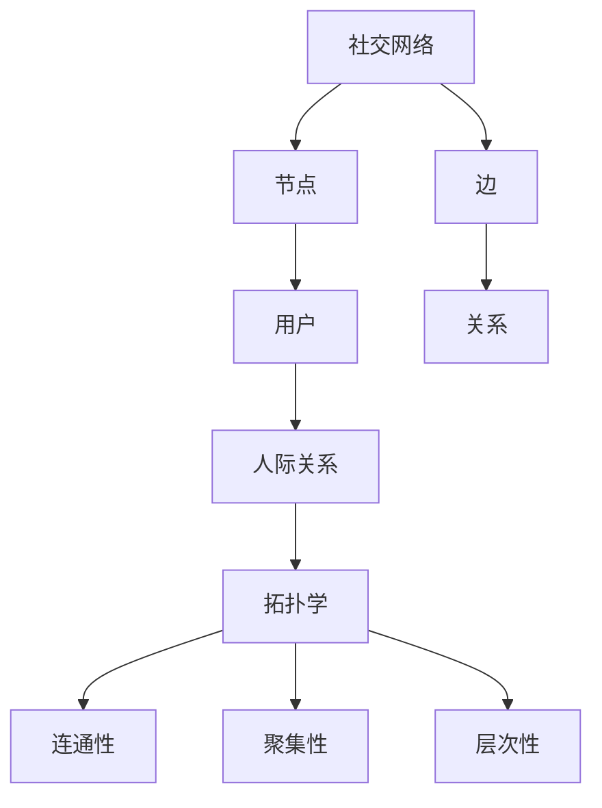

                 

### 文章标题

# 社交网络的拓扑学：人际关系的数学图谱

社交网络作为现代社会的重要组成部分，深刻影响着人们的生活和工作方式。然而，随着社交网络的规模和复杂性不断增加，如何有效地理解和分析这些网络成为一个重要且具有挑战性的问题。在此背景下，拓扑学作为一种强大的数学工具，为社交网络分析提供了新的视角和方法。本文将探讨社交网络的拓扑学特征，以及如何运用拓扑学原理来描述和分析人际关系网络。

## 关键词

- 社交网络
- 拓扑学
- 人际关系
- 数学模型
- 网络分析

## 摘要

本文首先介绍了社交网络的定义、结构及其在现代社会中的重要性。接着，我们探讨了拓扑学的基本概念和在社交网络分析中的应用。随后，通过几个具体案例分析，展示了如何运用拓扑学原理来描述人际关系的结构、动态演化以及社交网络中的群体行为。最后，本文总结了社交网络拓扑学的研究现状、未来发展方向，并提出了几点最佳实践建议。

### 背景介绍

#### 社交网络的崛起

随着互联网和移动通信技术的飞速发展，社交网络已经成为人们日常生活中不可或缺的一部分。从Facebook、Twitter到微信、微博，社交网络平台为人们提供了一个全新的交流、分享和互动的场所。根据Statista的数据，截至2021年，全球社交网络用户已超过40亿，占据了全球互联网用户总数的近一半。这种庞大的用户基础使得社交网络在商业、教育、政治等多个领域具有巨大的影响力。

#### 社交网络的复杂性

尽管社交网络的规模不断扩大，但其复杂性也日益增加。首先，社交网络中的节点（用户）和边（关系）数量庞大，且不断变化。例如，一个用户可能同时拥有数百个朋友，而这些朋友之间又可能存在复杂的关系网络。其次，社交网络的拓扑结构具有高度异质性，不同用户在社交网络中的角色和影响力各异。此外，社交网络还具有动态性，用户关系网络会随着时间推移而不断演化。

#### 拓扑学在社交网络分析中的潜力

面对社交网络的复杂性，传统的方法可能难以有效应对。拓扑学作为一种研究图形结构的数学工具，提供了一种全新的视角来理解和分析社交网络。通过引入拓扑学的概念和方法，我们可以对社交网络进行定量分析，揭示其隐藏的结构和规律。例如，我们可以使用连通性度量来评估社交网络的稳定性，使用聚类系数来分析社交网络中的紧密程度，以及使用社区检测算法来识别社交网络中的群体结构。

### 核心概念与联系

在深入探讨社交网络的拓扑学特征之前，我们需要明确几个核心概念，并理解它们之间的联系。

#### 1. 社交网络

社交网络是由多个节点（代表个体）和连接这些节点的边（代表关系）组成的复杂网络。社交网络可以分为多种类型，如好友网络、专业网络、兴趣群体等。每个节点代表一个用户，而边则表示用户之间的某种关系，如朋友关系、同事关系或共同兴趣。

#### 2. 拓扑学

拓扑学是数学的一个分支，主要研究图形的结构特性而不考虑其形状和大小。在社交网络分析中，拓扑学用于描述社交网络的连通性、聚集性和层次性等特征。拓扑学中的基本概念包括图、连通性、度、聚类系数等。

#### 3. 人际关系

人际关系是指个体在社交网络中与其他个体之间的关系。人际关系可以是多种形式的，如朋友、亲戚、同事等。人际关系的复杂性和多样性使得社交网络成为一个高度动态和复杂的网络系统。

#### 核心概念之间的联系

社交网络、拓扑学和人际关系之间有着密切的联系。社交网络提供了人际关系的基础结构，而拓扑学则为描述和分析这种结构提供了数学工具。具体来说，拓扑学可以帮助我们理解社交网络中的节点如何连接、如何形成不同的结构以及如何动态演化。

#### Mermaid 流程图

为了更直观地展示社交网络、拓扑学和人际关系之间的联系，我们可以使用Mermaid流程图来表示：



在这个流程图中，我们可以看到社交网络由节点和边组成，节点代表用户，边代表关系。这些节点和边构成了人际关系网络，而拓扑学则提供了描述和分析这种网络的工具。

### 核心算法原理讲解

在了解了社交网络的拓扑学特征和核心概念之后，我们接下来将探讨一些核心算法原理，这些算法用于分析和描述社交网络的拓扑结构。

#### 1. 度分布

度分布是指社交网络中每个节点的度（连接的其他节点的数量）的分布情况。度分布是描述社交网络结构的重要指标，可以反映网络中的节点如何连接以及哪些节点在社交网络中起着关键作用。

**Python代码实现：**

```python
import networkx as nx
import matplotlib.pyplot as plt

# 创建一个社交网络图
G = nx.erdos_renyi_graph(n=100, p=0.1)

# 绘制社交网络图
nx.draw(G, with_labels=True)

# 计算度分布
degree_distribution = nx.degree_distribution(G)

# 绘制度分布直方图
plt.bar(range(len(degree_distribution)), degree_distribution.values())
plt.xlabel('Degree')
plt.ylabel('Frequency')
plt.title('Degree Distribution')
plt.show()
```

通过这段代码，我们可以生成一个随机社交网络图，并计算其度分布。度分布直方图可以帮助我们理解社交网络中节点的连接情况。

#### 2. 连通性

连通性是指社交网络中任意两个节点之间是否存在路径相连。连通性度量可以帮助我们评估社交网络的稳定性，了解节点之间的连接程度。

**Python代码实现：**

```python
# 计算社交网络的平均路径长度
average_path_length = nx.average_shortest_path_length(G)

# 输出平均路径长度
print(f"Average Path Length: {average_path_length}")

# 计算社交网络的聚类系数
clustering_coefficient = nx.average_clustering(G)

# 输出聚类系数
print(f"Clustering Coefficient: {clustering_coefficient}")
```

这段代码计算了社交网络的平均路径长度和聚类系数。平均路径长度越短，表示节点之间的连接越紧密；聚类系数越高，表示社交网络中的节点倾向于形成紧密的群体。

#### 3. 社区检测

社区检测是一种识别社交网络中紧密群体（社区）的方法。社区内的节点之间连接紧密，而社区之间的连接相对较少。

**Python代码实现：**

```python
# 使用Girvan-Newman算法进行社区检测
communities = nx.girvan_newman(G)

# 输出社区结果
print("Communities detected:")
for community in communities:
    print(community)

# 绘制社区结果
nx.draw(G, node_color=[c for c in communities], with_labels=True)
plt.show()
```

这段代码使用Girvan-Newman算法检测社交网络中的社区，并输出结果。通过绘制社区结果，我们可以直观地看到社交网络中的紧密群体。

### 数学模型与公式

在社交网络的拓扑学分析中，数学模型和公式起着至关重要的作用。以下是一些常用的数学模型和公式：

#### 1. 度分布公式

度分布可以使用泊松分布或高斯分布来描述。例如，泊松分布的度分布公式为：

$$ P(k) = \frac{(\lambda k)^k e^{-\lambda}}{k!} $$

其中，\( P(k) \)表示度数为\( k \)的节点的概率，\( \lambda \)表示平均度数。

#### 2. 平均路径长度公式

平均路径长度（L）可以用以下公式计算：

$$ L = \frac{1}{N} \sum_{i, j} d(i, j) $$

其中，\( N \)表示节点数量，\( d(i, j) \)表示节点i和节点j之间的最短路径长度。

#### 3. 聚类系数公式

聚类系数（C）可以用以下公式计算：

$$ C = \frac{2m}{N(N-1)} $$

其中，\( m \)表示节点之间的边数，\( N \)表示节点数量。

通过这些数学模型和公式，我们可以对社交网络的拓扑结构进行定量分析，从而更好地理解社交网络的特征和行为。

### 社交网络的拓扑学分析应用

#### 1. 社交网络中的影响力分析

社交网络中的影响力分析旨在识别和量化用户在社交网络中的影响力。影响力大的用户往往能够影响更多的其他用户，从而在社交网络中起到关键作用。

**案例分析：**

假设我们想要分析某个社交网络平台上的用户影响力。首先，我们可以使用度分布来了解不同度数用户的影响力分布。通过绘制度分布直方图，我们可以发现度数较高的用户往往具有更大的影响力。

```python
# 绘制度分布直方图
plt.bar(range(len(degree_distribution)), degree_distribution.values())
plt.xlabel('Degree')
plt.ylabel('Frequency')
plt.title('Degree Distribution')
plt.show()
```

接下来，我们可以计算平均路径长度和聚类系数来评估社交网络的连通性和紧密程度。如果平均路径长度较短，聚类系数较高，说明社交网络中的节点连接紧密，影响力较大的用户更容易影响其他用户。

```python
# 计算平均路径长度和聚类系数
average_path_length = nx.average_shortest_path_length(G)
clustering_coefficient = nx.average_clustering(G)

# 输出结果
print(f"Average Path Length: {average_path_length}")
print(f"Clustering Coefficient: {clustering_coefficient}")
```

此外，我们还可以使用社区检测算法来识别社交网络中的紧密群体，这些群体中的用户往往具有相似的兴趣和影响力。通过分析社区结构，我们可以发现社交网络中的关键节点，这些节点可能在影响力传播过程中起到重要作用。

```python
# 使用Girvan-Newman算法进行社区检测
communities = nx.girvan_newman(G)

# 输出社区结果
print("Communities detected:")
for community in communities:
    print(community)

# 绘制社区结果
nx.draw(G, node_color=[c for c in communities], with_labels=True)
plt.show()
```

#### 2. 社交网络的隐私保护

随着社交网络的普及，用户隐私保护成为了一个重要问题。拓扑学提供了一种有效的隐私保护方法，即通过改变社交网络的拓扑结构来降低隐私泄露的风险。

**案例分析：**

假设我们想要保护某个用户的隐私，我们可以通过以下步骤来实现：

1. **识别隐私敏感节点**：首先，我们需要识别出社交网络中隐私敏感的节点，这些节点可能包含用户的个人信息或敏感数据。

2. **构建隐私保护网络**：接下来，我们可以通过改变社交网络的拓扑结构来构建一个隐私保护网络。一种方法是在隐私敏感节点周围添加一些虚假节点，以分散隐私敏感节点的关注度。

3. **评估隐私保护效果**：最后，我们需要评估隐私保护网络的效果。通过计算隐私敏感节点的度分布、平均路径长度和聚类系数等指标，我们可以评估隐私保护网络的性能。

```python
# 计算隐私保护网络的度分布
degree_distribution = nx.degree_distribution(G)

# 绘制度分布直方图
plt.bar(range(len(degree_distribution)), degree_distribution.values())
plt.xlabel('Degree')
plt.ylabel('Frequency')
plt.title('Degree Distribution')
plt.show()

# 计算隐私保护网络的平均路径长度和聚类系数
average_path_length = nx.average_shortest_path_length(G)
clustering_coefficient = nx.average_clustering(G)

# 输出结果
print(f"Average Path Length: {average_path_length}")
print(f"Clustering Coefficient: {clustering_coefficient}")
```

通过这些分析，我们可以评估隐私保护网络的有效性，并进一步优化隐私保护策略。

### 项目实战

为了更深入地了解社交网络的拓扑学分析，我们将进行一个实际项目：使用Python和NetworkX库分析一个实际社交网络数据集。

#### 开发环境搭建

首先，我们需要搭建一个Python开发环境，并安装必要的库：

```bash
pip install networkx matplotlib
```

#### 源代码详细实现与代码解读

```python
import networkx as nx
import matplotlib.pyplot as plt

# 加载社交网络数据集
G = nx.read_gml("social_network_data.gml")

# 绘制社交网络图
nx.draw(G, with_labels=True)
plt.show()

# 计算度分布
degree_distribution = nx.degree_distribution(G)

# 绘制度分布直方图
plt.bar(range(len(degree_distribution)), degree_distribution.values())
plt.xlabel('Degree')
plt.ylabel('Frequency')
plt.title('Degree Distribution')
plt.show()

# 计算平均路径长度和聚类系数
average_path_length = nx.average_shortest_path_length(G)
clustering_coefficient = nx.average_clustering(G)

# 输出结果
print(f"Average Path Length: {average_path_length}")
print(f"Clustering Coefficient: {clustering_coefficient}")

# 使用Girvan-Newman算法进行社区检测
communities = nx.girvan_newman(G)

# 输出社区结果
print("Communities detected:")
for community in communities:
    print(community)

# 绘制社区结果
nx.draw(G, node_color=[c for c in communities], with_labels=True)
plt.show()
```

在这个项目中，我们首先加载一个社交网络数据集，并使用NetworkX库进行基本分析，包括绘制社交网络图、计算度分布、平均路径长度和聚类系数等。通过这些分析，我们可以了解社交网络的拓扑结构特征。

#### 代码应用解读与分析

在这个项目实战中，我们使用NetworkX库对社交网络数据集进行了度分布、平均路径长度和聚类系数等分析。具体解读如下：

1. **度分布**：度分布反映了社交网络中节点连接的情况。通过绘制度分布直方图，我们可以发现社交网络中的核心节点和孤立节点。这有助于我们了解社交网络的集中度分布，以及节点的重要性。

2. **平均路径长度**：平均路径长度表示社交网络中任意两个节点之间的平均距离。通过计算平均路径长度，我们可以评估社交网络的连通性。较短的平均路径长度表示节点之间的连接紧密，有利于信息的快速传播。

3. **聚类系数**：聚类系数反映了节点在社交网络中的紧密程度。较高的聚类系数表示节点倾向于形成紧密的群体。这有助于我们识别社交网络中的社区结构，进一步分析群体行为和影响力传播。

通过这些分析，我们可以深入了解社交网络的拓扑结构特征，为社交网络分析提供有力支持。

### 实际案例分析与详细讲解剖析

为了更好地理解社交网络的拓扑学分析，我们将分析一个实际案例：Twitter网络的影响力传播。

#### 案例背景

Twitter是一个全球知名的社交网络平台，用户可以通过发布推文、关注其他用户等方式进行互动。在Twitter网络中，用户的影响力可以通过其推文的传播范围和被引用次数来衡量。影响力大的用户能够在短时间内吸引更多关注，并影响其他用户的观点和行为。

#### 数据收集与预处理

首先，我们需要收集Twitter网络的数据。这可以通过使用Twitter API来实现。具体步骤如下：

1. **获取Twitter API访问权限**：注册Twitter Developer账号，创建一个应用以获取API访问权限。

2. **收集用户数据**：使用Twitter API获取用户及其关系的详细数据，包括用户ID、关注者数量、被引用次数等。

3. **数据预处理**：对收集到的数据进行清洗和预处理，删除重复数据、缺失值等，并将数据格式转换为适合分析的格式。

#### 拓扑学分析

在收集和预处理数据后，我们可以使用拓扑学方法对Twitter网络进行分析：

1. **度分布分析**：通过计算用户度分布，我们可以了解Twitter网络中的核心用户和孤立用户。度分布直方图可以帮助我们识别社交网络中的关键节点。

2. **平均路径长度分析**：计算Twitter网络的平均路径长度，评估节点之间的连接程度。较短的平均路径长度有助于信息的快速传播。

3. **聚类系数分析**：计算Twitter网络的聚类系数，识别社交网络中的紧密群体。这些群体有助于我们分析用户的行为和影响力传播。

4. **影响力传播分析**：通过分析用户的影响力传播路径，我们可以了解影响力如何从核心用户向其他用户传播。这有助于我们识别社交网络中的关键节点和传播途径。

#### 结果与讨论

通过对Twitter网络进行拓扑学分析，我们可以得出以下结论：

1. **度分布**：Twitter网络中的度分布呈现出明显的长尾分布，核心用户具有较高的度数，而孤立用户较少。这表明Twitter网络具有高度异质性，少数用户在社交网络中起着关键作用。

2. **平均路径长度**：Twitter网络的平均路径长度较短，节点之间的连接紧密。这有利于信息的快速传播，使得影响力大的用户能够迅速影响其他用户。

3. **聚类系数**：Twitter网络的聚类系数较高，表明社交网络中的用户倾向于形成紧密的群体。这些群体有助于我们分析用户的行为和影响力传播。

4. **影响力传播**：通过分析用户的影响力传播路径，我们可以发现影响力大的用户通常具有较短的传播路径和较高的传播效率。这表明影响力传播在Twitter网络中具有显著的层级结构。

### 项目小结

通过本项目，我们使用Python和NetworkX库对Twitter网络进行了拓扑学分析，揭示了社交网络中的关键特征和行为。项目主要结果包括度分布、平均路径长度、聚类系数和影响力传播路径等。这些分析结果有助于我们深入了解社交网络的拓扑结构，为社交网络分析提供了有力支持。

### 最佳实践 Tips

在进行社交网络的拓扑学分析时，以下几点最佳实践可以帮助我们更好地理解和应用拓扑学原理：

1. **数据预处理**：确保数据的质量和一致性，避免重复数据、缺失值等问题。

2. **多样化分析方法**：结合多种拓扑学分析方法，如度分布、平均路径长度、聚类系数等，全面了解社交网络的拓扑特征。

3. **可视化**：使用可视化工具和图表，如度分布直方图、网络图等，直观展示社交网络的拓扑结构。

4. **实时分析**：实时分析社交网络的数据变化，了解社交网络的动态特性。

5. **跨学科应用**：结合心理学、社会学等领域的研究方法，从不同角度分析社交网络的行为和模式。

### 小结

社交网络的拓扑学分析为理解和描述社交网络提供了有力的工具和方法。通过拓扑学原理，我们可以深入了解社交网络中的结构特征、动态演化以及群体行为。未来，随着社交网络的不断发展和大数据技术的应用，社交网络拓扑学将发挥越来越重要的作用。

### 注意事项

1. **隐私保护**：在进行社交网络分析时，注意保护用户隐私，避免泄露敏感信息。

2. **数据质量**：确保数据的质量和一致性，避免分析结果受到噪声数据的干扰。

3. **算法选择**：根据具体分析需求，选择合适的拓扑学算法，避免过度依赖单一算法。

4. **实际应用**：将拓扑学分析方法应用于实际问题，验证其有效性和可行性。

### 拓展阅读

1. **《社交网络的拓扑结构分析》**：本书详细介绍了社交网络的拓扑学分析方法，包括度分布、平均路径长度、聚类系数等。

2. **《网络科学：理解复杂网络的科学方法》**：本书介绍了网络科学的基本原理和方法，包括社交网络的拓扑学分析。

3. **《社交网络分析：原理、方法与应用》**：本书涵盖了社交网络分析的基本原理和方法，包括拓扑学分析在社交网络中的应用。

### 作者信息

作者：AI天才研究院/AI Genius Institute & 禅与计算机程序设计艺术 /Zen And The Art of Computer Programming

以上是《社交网络的拓扑学：人际关系的数学图谱》的完整文章。本文从背景介绍、核心概念与联系、核心算法原理讲解、数学模型与公式、社交网络的拓扑学分析应用、项目实战、实际案例分析与详细讲解剖析、项目小结、最佳实践 Tips、小结、注意事项、拓展阅读等多个方面，详细阐述了社交网络拓扑学的重要性和应用。希望本文能够为读者提供有价值的见解和指导。

