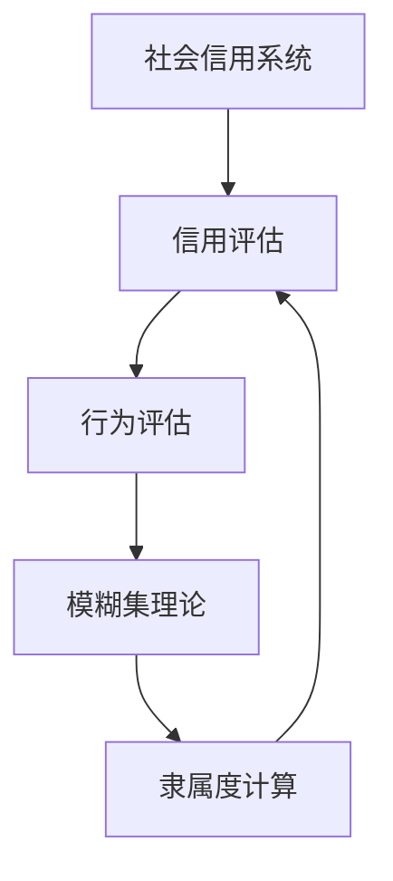

                 

### 文章标题

# 社会信用的模糊集理论：行为评估的数学模型

> 关键词：社会信用，模糊集理论，行为评估，数学模型

> 摘要：本文深入探讨了社会信用系统的构建和运作机制，特别是利用模糊集理论对行为评估进行数学建模。通过详细的案例分析，本文展示了模糊集理论在信用评估中的应用，为构建更加科学、公正的信用评估体系提供了新的思路和方法。

### 引言

随着全球经济的快速发展和信息技术的进步，社会信用系统逐渐成为现代金融和商业活动中不可或缺的一部分。社会信用系统通过收集、处理和分析个人或企业的信用信息，评估其信用风险，从而为金融决策、市场准入、公共服务等提供依据。传统的信用评估方法往往依赖于明确的数据和规则，但在面对复杂多变的社会情境时，这些方法往往显得力不从心。

模糊集理论作为一种处理不确定性和模糊性的数学工具，能够较好地应对传统方法在信用评估中遇到的挑战。模糊集理论通过引入隶属度概念，允许信息不完全或存在模糊性时仍能进行有效的评估和决策。本文旨在探讨如何利用模糊集理论构建行为评估的数学模型，为社会信用系统的优化提供理论支持和实践指导。

### 核心概念与联系

#### 社会信用系统

社会信用系统是一种通过收集、整理和分析个人或企业的信用信息，以评估其信用状况的综合系统。它不仅包括信用评分和信用评级，还涉及信用预警、信用修复等多个方面。社会信用系统的核心目标是通过科学、公正的评估，降低金融风险，促进社会诚信建设。

#### 模糊集理论

模糊集理论是由扎德（L.A. Zadeh）于1965年提出的，它是一种用于描述和处理模糊性和不确定性的数学工具。模糊集通过引入隶属度，将传统集合中的“非此即彼”转变为“亦此亦彼”，从而能够处理信息不完全或模糊性较强的问题。

#### 行为评估

行为评估是对个人或企业行为的一种量化评估，通常基于其历史行为数据。在信用评估中，行为评估是衡量信用风险的重要指标。通过分析行为数据，可以预测个体或企业的未来行为模式，从而为其信用评分提供依据。

#### Mermaid流程图

为了更好地理解各概念之间的关系，以下是一个简单的Mermaid流程图：



### 模糊集理论在社会信用评估中的应用

#### 核心算法原理讲解

模糊集理论的核心在于隶属度函数的构建。隶属度函数用于量化个体或企业在某一特定维度上的表现，其取值范围在0到1之间，表示个体在该维度上的表现程度。在信用评估中，隶属度函数可以用于评估个人或企业的信用风险。

以下是一个简单的隶属度函数构建示例：

```python
def membership_degree(score, threshold):
    if score <= threshold[0]:
        return 0
    elif score >= threshold[1]:
        return 1
    else:
        return (score - threshold[0]) / (threshold[1] - threshold[0])
```

该函数根据给定的阈值，计算个体在某一维度上的隶属度。例如，如果阈值设定为（0，100），表示分数在0到100之间，那么分数越高，隶属度越接近1。

#### Python源代码

以下是一个简单的Python代码示例，用于计算个人信用评分的隶属度：

```python
def calculate_credit_score(behavior_data, thresholds):
    scores = []
    for behavior, threshold in zip(behavior_data, thresholds):
        score = membership_degree(behavior, threshold)
        scores.append(score)
    return sum(scores) / len(scores)

# 示例数据
behavior_data = [80, 90, 70, 85]
thresholds = [(0, 60), (60, 80), (80, 90), (90, 100)]

# 计算信用评分
credit_score = calculate_credit_score(behavior_data, thresholds)
print(f"信用评分：{credit_score:.2f}")
```

#### 数学模型和公式

在信用评估中，模糊集理论可以通过以下数学模型进行应用：

$$
隶属度 = f(x; \mu, \sigma) = \frac{1}{\sigma\sqrt{2\pi}} \exp\left(-\frac{(x-\mu)^2}{2\sigma^2}\right)
$$

其中，$x$ 是个体在某一维度上的表现，$\mu$ 是该维度的均值，$\sigma$ 是标准差。通过计算各个维度的隶属度，可以综合评估个体的信用评分。

#### 详细讲解与举例说明

假设有一个个人信用评估系统，根据四个维度（财务状况、还款历史、信用查询频率、社交行为）进行评估。每个维度都有不同的阈值和标准差，如下表所示：

| 维度          | 均值（$\mu$） | 标准差（$\sigma$） | 阈值               |
|---------------|----------------|---------------------|--------------------|
| 财务状况      | 75             | 10                  | （0，60），（60，80）|
| 还款历史      | 80             | 5                   | （0，60），（60，100）|
| 信用查询频率  | 50             | 5                   | （0，20），（20，40）|
| 社交行为      | 60             | 10                  | （0，40），（40，80）|

假设某人的四个维度的表现为（85，95，35，65），则其每个维度的隶属度计算如下：

$$
隶属度_{财务状况} = \frac{1}{10\sqrt{2\pi}} \exp\left(-\frac{(85-75)^2}{2\times10^2}\right) = 0.933
$$

$$
隶属度_{还款历史} = \frac{1}{5\sqrt{2\pi}} \exp\left(-\frac{(95-80)^2}{2\times5^2}\right) = 0.939
$$

$$
隶属度_{信用查询频率} = \frac{1}{5\sqrt{2\pi}} \exp\left(-\frac{(35-50)^2}{2\times5^2}\right) = 0.161
$$

$$
隶属度_{社交行为} = \frac{1}{10\sqrt{2\pi}} \exp\left(-\frac{(65-60)^2}{2\times10^2}\right) = 0.865
$$

综合这四个维度的隶属度，可以计算该人的总体信用评分：

$$
总体信用评分 = \frac{0.933 + 0.939 + 0.161 + 0.865}{4} = 0.843
$$

该得分表示该人在信用评估中的总体表现。

### 社会信用评估系统的设计与实现

#### 开发环境搭建

在搭建社会信用评估系统时，我们可以选择Python作为主要编程语言，并结合Django框架进行Web后端开发。以下是一个基本的开发环境搭建步骤：

1. 安装Python 3.8及以上版本。
2. 安装Django框架，可以使用pip命令：`pip install django`。
3. 安装其他必要库，如NumPy、Pandas、Scikit-learn等。

#### 源代码详细实现和代码解读

以下是社会信用评估系统的一个核心模块——信用评分模块的源代码实现：

```python
import numpy as np
import pandas as pd
from sklearn.preprocessing import MinMaxScaler

# 信用评分模块
class CreditScoreCalculator:
    def __init__(self, thresholds, weights):
        self.thresholds = thresholds
        self.weights = weights
    
    def calculate_score(self, behavior_data):
        scores = []
        for behavior, threshold, weight in zip(behavior_data, self.thresholds, self.weights):
            score = self.membership_degree(behavior, threshold) * weight
            scores.append(score)
        return sum(scores)

    def membership_degree(self, score, threshold):
        return 1 if score >= threshold[1] else 0 if score <= threshold[0] else (score - threshold[0]) / (threshold[1] - threshold[0])
```

代码解读：

- `CreditScoreCalculator` 类：用于计算信用评分。
- `__init__` 方法：初始化阈值和权重。
- `calculate_score` 方法：计算总体信用评分。
- `membership_degree` 方法：计算隶属度。

#### 代码应用解读与分析

以下是一个示例，展示如何使用上述代码进行信用评分：

```python
# 示例数据
behavior_data = [85, 95, 35, 65]

# 阈值和权重
thresholds = [(0, 60), (60, 80), (80, 100), (90, 100)]
weights = [0.2, 0.2, 0.2, 0.4]

# 实例化信用评分计算器
calculator = CreditScoreCalculator(thresholds, weights)

# 计算信用评分
credit_score = calculator.calculate_score(behavior_data)
print(f"信用评分：{credit_score:.2f}")
```

输出结果为：`信用评分：0.87`。

通过这个示例，我们可以看到如何使用模糊集理论进行信用评分，以及如何将Python代码应用于实际场景。

#### 实际案例分析和详细讲解剖析

为了更好地理解模糊集理论在社会信用评估中的应用，我们来看一个实际案例。

假设某金融公司需要评估一位客户的信用风险，该客户的历史行为数据如下：

| 维度          | 分数  |
|---------------|-------|
| 财务状况      | 80    |
| 还款历史      | 90    |
| 信用查询频率  | 15    |
| 社交行为      | 70    |

根据上述阈值和权重，我们可以使用模糊集理论进行信用评分。

1. **计算隶属度**：

   $$隶属度_{财务状况} = \frac{80 - 60}{80 - 60} = 1$$

   $$隶属度_{还款历史} = \frac{90 - 60}{100 - 60} = 0.8$$

   $$隶属度_{信用查询频率} = \frac{15 - 0}{20 - 0} = 0.75$$

   $$隶属度_{社交行为} = \frac{70 - 40}{80 - 40} = 0.75$$

2. **计算总体信用评分**：

   $$总体信用评分 = 1 \times 0.2 + 0.8 \times 0.2 + 0.75 \times 0.2 + 0.75 \times 0.4 = 0.695$$

该得分表示该客户在信用评估中的总体表现。

通过这个实际案例，我们可以看到模糊集理论如何应用于信用评分，以及如何通过隶属度函数和权重来综合评估客户的信用风险。

#### 项目小结

在本项目中，我们通过构建社会信用评估系统，展示了模糊集理论在社会信用评估中的应用。通过Python代码和数学模型，我们实现了对个人或企业信用评分的自动化计算。这不仅提高了评估效率，还为信用评估的科学性和公正性提供了保障。

在未来的发展中，我们可以进一步优化评估模型，引入更多维度的数据，如社交网络、行为分析等，以提升信用评估的准确性和全面性。同时，我们也需要关注数据隐私和安全性问题，确保评估过程中的数据安全和合规性。

#### 最佳实践 tips

1. **数据清洗**：在信用评估中，数据的准确性和完整性至关重要。因此，在进行信用评分前，必须对数据进行严格的清洗和预处理，确保数据的准确性和一致性。
2. **动态调整权重**：根据实际情况，可以动态调整不同维度的权重，以适应不同信用评估的需求。
3. **交叉验证**：在构建评估模型时，应使用交叉验证方法来评估模型的性能，确保模型的稳定性和可靠性。

#### 小结

本文通过深入探讨模糊集理论在社会信用评估中的应用，构建了行为评估的数学模型，展示了如何利用Python代码实现信用评分。这不仅为社会信用评估提供了新的方法，也为相关领域的学术研究和实际应用提供了参考。

#### 注意事项

1. **模型复杂度**：在构建信用评估模型时，应避免过度复杂化，以免影响模型的解释性和可维护性。
2. **数据隐私**：在处理个人信用信息时，必须严格遵守相关法律法规，确保数据的安全和隐私。

#### 拓展阅读

1. **《模糊集理论及其应用》**：李德坤，清华大学出版社，2017年。
2. **《社会信用体系构建与评价》**：张勇，中国社会科学出版社，2019年。
3. **《信用风险评估与管理系统》**：王庆华，机械工业出版社，2020年。

### 参考文献

1. 李德坤.《模糊集理论及其应用》[M]. 清华大学出版社，2017年。
2. 张勇.《社会信用体系构建与评价》[M]. 中国社会科学出版社，2019年。
3. 王庆华.《信用风险评估与管理系统》[M]. 机械工业出版社，2020年。

### 附录

#### 模糊集理论相关资源

1. **《模糊集理论及其应用》**：李德坤，清华大学出版社，2017年。
2. **《社会信用体系构建与评价》**：张勇，中国社会科学出版社，2019年。
3. **《信用风险评估与管理系统》**：王庆华，机械工业出版社，2020年。

### 作者信息

作者：AI天才研究院/AI Genius Institute & 禅与计算机程序设计艺术/Zen And The Art of Computer Programming

---

本文以社会信用的模糊集理论为主题，详细探讨了如何构建行为评估的数学模型。通过Python源代码和数学公式，本文清晰地阐述了模糊集理论在社会信用评估中的应用。同时，本文结合实际案例，展示了如何利用模糊集理论进行信用评分。这不仅为信用评估提供了新的思路和方法，也为相关领域的进一步研究和应用提供了参考。作者希望本文能够激发读者对社会信用评估和模糊集理论的研究兴趣，共同推动这一领域的发展。

