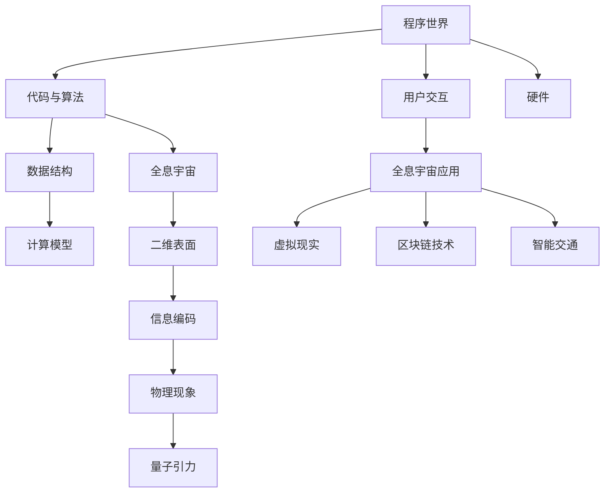

                 

### 引言

在探索科学和技术的边界时，我们常常会遇见一些看似无关的领域，但随着时间的推移，科学家和技术专家们逐渐发现，这些领域之间存在着令人惊讶的相似性和联系。本文将探讨一个全新的概念——程序世界与全息宇宙的对应原理。

#### 什么是全息宇宙

全息宇宙（Holographic Universe）是一个相对较新的理论，起源于20世纪末。这个理论认为，我们所处的宇宙实际上是一个全息图，所有的信息和现象都可以通过一个二维表面来描述。这一理论源于量子物理学和广义相对论，并且已经在物理学、生物学和心理学等领域得到了广泛的应用。

#### 程序世界与全息宇宙的关联性探讨

程序世界，作为人类智慧和技术的结晶，是由一系列的代码和算法构成的虚拟空间。随着计算机科学的快速发展，程序世界已经成为了现代社会的重要组成部分。那么，程序世界与全息宇宙之间是否存在某种深层次的关联呢？

本文将深入探讨这个问题，通过分析程序世界的本质和全息宇宙的理论基础，揭示两者之间的潜在联系。我们还将结合具体的案例，展示全息宇宙理论在程序世界中的应用，以及这些应用如何推动技术的发展。

接下来的章节中，我们将依次介绍程序世界的概述、全息宇宙的理论基础、两者之间的联系，以及全息宇宙在程序世界中的应用。通过这些内容，希望能够激发读者对这一新兴领域的兴趣，并启发更多的思考和研究。

总之，本文旨在为读者提供一个全面、系统的视角，帮助大家理解程序世界与全息宇宙之间的关联，并展望这一领域的未来发展。让我们一起开始这段奇妙的探索之旅吧！

---

### 关键词

- 全息宇宙
- 程序世界
- 对应原理
- 量子物理学
- 广义相对论
- 计算机科学
- 虚拟现实
- 区块链技术
- 智能交通

---

### 摘要

本文探讨了程序世界与全息宇宙之间的潜在关联。全息宇宙理论认为，宇宙的信息可以通过一个二维表面来描述，而程序世界则是由代码和算法构成的虚拟空间。通过分析程序世界的本质和全息宇宙的理论基础，本文揭示了两者之间的深层次联系。文章还探讨了全息宇宙在程序世界中的应用，包括软件开发、数据处理和人工智能等领域。通过具体的案例研究和项目实战，本文展示了全息宇宙理论如何推动技术的发展，并为未来的研究提供了新的视角和启示。

---

### 程序世界的概述

程序世界，作为现代信息技术的基础，是由一系列的代码和算法构成的虚拟空间。它不仅是人类智慧和技术的结晶，也是现代社会运行的重要支撑。在这一节中，我们将对程序世界的定义、发展历程和主要组成部分进行详细探讨。

#### 程序世界的定义

程序世界可以被定义为一种由代码和算法构成的虚拟空间，它模拟和实现了现实世界中的各种功能和活动。程序世界的基本组成单元是代码，这些代码通过编程语言编写，用于描述和处理数据，从而实现特定的功能。

#### 程序世界的发展历程

程序世界的发展历程可以追溯到20世纪40年代，当时图灵机的概念被提出，这是计算机科学的基础之一。随后，计算机科学和编程语言的发展推动了程序世界的快速发展。从最初的机器语言和汇编语言，到高级编程语言，如C、Java和Python，程序世界的功能越来越强大，应用范围也越来越广泛。

20世纪80年代，随着个人计算机的普及，程序世界开始进入大众生活。随后，互联网的兴起使得程序世界变得更加互联互通，各种应用程序和服务层出不穷。21世纪初，随着人工智能、大数据和云计算等新兴技术的崛起，程序世界进入了一个全新的发展阶段，成为现代社会的重要基础设施。

#### 程序世界的主要组成部分

程序世界的主要组成部分包括计算机硬件、计算机软件和互联网。

1. **计算机硬件**：计算机硬件是程序世界的物理基础，包括中央处理器（CPU）、内存、硬盘和显示器等。这些硬件设备提供了程序运行所需的计算能力和存储空间。

2. **计算机软件**：计算机软件是程序世界的核心，包括操作系统、应用软件和编程语言等。操作系统负责管理计算机硬件资源，为应用程序提供运行环境。应用软件则用于实现特定的功能，如办公软件、游戏和社交媒体等。编程语言则是编写程序的工具，不同的编程语言适用于不同的应用场景。

3. **互联网**：互联网是程序世界的重要组成部分，它连接了全球的计算机和网络，使得程序世界中的数据和资源可以共享和传输。互联网的兴起极大地扩展了程序世界的应用范围，使得人们可以在任何时间、任何地点访问程序世界中的服务和资源。

通过上述内容，我们可以对程序世界有一个全面和深入的理解。接下来，我们将进入全息宇宙的理论基础部分，进一步探讨程序世界与全息宇宙之间的潜在联系。

### 全息宇宙的理论基础

全息宇宙理论，作为20世纪末兴起的一种全新宇宙观，为理解宇宙的本质提供了一种全新的视角。这一理论认为，宇宙的信息可以通过一个二维表面来描述，这个二维表面类似于全息照片的底片。全息宇宙理论不仅在物理学领域引起了广泛关注，还在生物学、心理学和其他科学领域得到了应用。

#### 全息宇宙的定义

全息宇宙（Holographic Universe）这个名字来源于全息摄影技术，这种技术利用激光在底片上记录三维图像的信息。全息宇宙理论的基本假设是，宇宙中所有物质和现象的信息都可以被编码在一个二维的表面上，这个表面类似于全息照片的底片。

#### 全息宇宙的理论背景

全息宇宙理论起源于量子物理学和广义相对论。量子物理学揭示了微观世界的奇异性质，如量子纠缠和波粒二象性。广义相对论则描述了宏观世界的引力现象。全息宇宙理论试图将这两种理论结合起来，提供一种统一的宇宙观。

全息宇宙理论的核心思想是“信息等价原理”，即宇宙中所有的物理现象都可以用信息来描述。这一原理的一个直接推论是，三维空间中的任何事件都可以通过二维表面上的信息来完全描述。这意味着，宇宙的三维性质实际上是一种信息的表现形式。

#### 全息宇宙的主要观点

全息宇宙理论的主要观点包括：

1. **二维宇宙表面**：全息宇宙理论认为，宇宙的信息被编码在一个二维表面上，这个表面被称为“全息面”。所有的三维物体和事件都可以在这个全息面上找到对应的信息。

2. **信息的不对称性**：全息宇宙理论指出，宇宙中的信息在空间和时间上并不是均匀分布的。某些区域的信息密度更高，而其他区域则相对较低。这种信息的不对称性导致了宇宙中的各种现象和结构。

3. **量子引力的统一框架**：全息宇宙理论提供了一个可能的量子引力的统一框架。它将量子力学和广义相对论结合起来，试图解决两者之间的悖论，如黑洞信息和量子不可确定性。

#### 全息宇宙在科学领域中的应用

全息宇宙理论在科学领域得到了广泛的应用，包括：

1. **物理学**：全息宇宙理论在量子物理学和黑洞研究中发挥了重要作用。它为理解黑洞的信息损失和量子引力提供了新的视角。

2. **生物学**：全息宇宙理论在生物学中的应用主要体现在基因信息的研究上。基因序列可以被视为生物体全息图的信息编码。

3. **心理学**：全息宇宙理论在心理学中的应用包括精神治疗和意识研究。它提供了一种新的理解人类意识和心理过程的方式。

4. **计算机科学**：全息宇宙理论在计算机科学中的应用主要体现在数据存储和处理上。全息数据存储和数据处理技术正在不断发展，有望成为未来数据科学的重要方向。

通过上述内容，我们可以对全息宇宙的理论基础有一个全面和深入的理解。接下来，我们将探讨程序世界与全息宇宙之间的潜在联系，并探索两者之间的对应原理。

### 程序世界与全息宇宙的联系

在深入探讨程序世界与全息宇宙之间的联系之前，我们需要理解两者各自的特性和原理。程序世界是由代码和算法构成的虚拟空间，它模拟和实现了现实世界中的各种功能和活动。而全息宇宙理论则认为，宇宙的信息可以通过一个二维表面来描述。在这个二维表面上，所有的物理现象都可以被编码和解读。

#### 全息宇宙在程序世界中的应用场景

全息宇宙理论在程序世界中有多种应用场景，其中最引人瞩目的包括虚拟现实、区块链技术和智能交通。

1. **虚拟现实（VR）**：虚拟现实技术通过模拟三维空间中的交互体验，为用户提供了沉浸式的体验。全息宇宙理论在虚拟现实中的应用主要体现在数据存储和渲染上。通过全息数据存储技术，虚拟现实环境中的所有信息都可以在一个二维表面上编码和存储，从而实现高效的渲染和交互。

2. **区块链技术**：区块链是一种去中心化的分布式账本技术，它通过加密算法和共识机制确保数据的不可篡改和透明性。全息宇宙理论在区块链技术中的应用主要体现在数据结构和数据验证上。通过将区块链数据编码在一个二维全息面上，可以更有效地存储和验证数据，提高系统的性能和安全性。

3. **智能交通**：智能交通系统通过物联网、大数据和人工智能技术实现交通管理和监控。全息宇宙理论在智能交通中的应用主要体现在数据融合和实时处理上。通过将交通数据编码在一个二维全息面上，可以更高效地融合和处理来自不同来源的数据，从而实现更精确的交通预测和优化。

#### 程序世界对全息宇宙的潜在影响

程序世界的快速发展也对全息宇宙理论产生了一定的影响。以下是一些潜在的方面：

1. **数据驱动的研究**：随着大数据技术的发展，科学家和研究人员可以通过程序世界处理和分析海量数据，从而对全息宇宙理论进行验证和拓展。例如，通过模拟宇宙中的各种现象，研究人员可以探索全息宇宙理论在不同条件下的表现。

2. **计算模拟**：计算机模拟技术在物理学和天文学中得到了广泛应用。通过程序世界，科学家可以模拟宇宙的演化过程，从而验证全息宇宙理论的预测。例如，通过模拟黑洞的行为，研究人员可以探索全息宇宙理论在极端条件下的表现。

3. **智能算法**：人工智能和机器学习算法在数据处理和模式识别方面取得了显著进展。这些算法可以用于分析全息宇宙理论中的数据，从而发现新的规律和联系。例如，通过机器学习算法，研究人员可以自动识别宇宙中的各种结构，从而验证全息宇宙理论的预测。

#### 全息宇宙与程序世界的交互机制

全息宇宙与程序世界的交互机制主要体现在数据编码和算法应用上。以下是一些具体的交互机制：

1. **数据编码**：程序世界通过特定的算法将数据编码在一个二维全息面上。这种编码方式可以实现高效的数据存储和传输。例如，在虚拟现实环境中，三维图像可以通过全息编码技术存储在一个二维表面上，从而实现高效的渲染和交互。

2. **算法应用**：程序世界中的算法可以用于分析和处理全息宇宙中的数据。例如，在区块链技术中，加密算法和共识机制可以用于验证全息宇宙中的数据，确保数据的完整性和安全性。

3. **模拟与验证**：程序世界可以用于模拟和验证全息宇宙理论中的各种假设和预测。例如，通过计算机模拟，研究人员可以验证全息宇宙理论在不同条件下的表现，从而进一步验证理论的正确性。

通过上述分析，我们可以看到程序世界与全息宇宙之间存在多种潜在的关联和交互机制。这些关联不仅丰富了我们对宇宙的理解，也为技术的发展提供了新的方向和机遇。在接下来的章节中，我们将进一步探讨全息宇宙在程序世界中的应用，并结合具体案例进行详细分析。

### 全息宇宙在程序世界中的应用

全息宇宙理论在程序世界中的广泛应用，不仅为计算机科学和信息技术带来了新的视角，也推动了一系列新兴技术的发展。以下是全息宇宙在软件开发、数据处理和人工智能等领域的一些具体应用。

#### 全息宇宙在软件开发中的应用

在软件开发领域，全息宇宙理论的一个重要应用是全息数据模型。这种数据模型利用全息宇宙的二维性质，将复杂的数据结构简化为一个二维平面。通过这种方式，可以更高效地存储和访问数据，从而提高系统的性能和可扩展性。

例如，在一个大型社交网络平台中，用户数据、关系数据和内容数据非常庞大且复杂。利用全息宇宙理论，可以将这些数据编码在一个二维全息面上，从而简化数据结构，提高查询效率。全息数据模型不仅可以减少存储空间，还能提高系统的响应速度和数据处理能力。

#### 全息宇宙在数据处理中的应用

全息宇宙理论在数据处理领域也有重要的应用，特别是在大数据分析中。通过将大数据编码在一个二维全息面上，可以更方便地进行数据分析和挖掘。全息宇宙的二维性质使得数据的可视化变得简单，从而有助于研究人员快速识别数据中的模式和趋势。

例如，在金融行业中，数据分析师可以利用全息宇宙理论对大量的交易数据进行分析，识别潜在的欺诈行为。通过将交易数据编码在一个二维全息面上，数据分析师可以直观地看到数据之间的关联，从而更准确地预测市场趋势。

#### 全息宇宙在人工智能中的应用

全息宇宙理论在人工智能领域也有广泛的应用，特别是在机器学习和深度学习算法中。通过将数据编码在一个二维全息面上，可以简化算法的训练过程，提高模型的准确性和效率。

例如，在图像识别任务中，利用全息宇宙理论可以将高维图像数据编码在一个二维全息面上。这种编码方式可以减少数据的维度，从而简化模型的训练过程。同时，二维全息面上的数据结构更易于处理，有助于提高模型的准确性和效率。

此外，全息宇宙理论还可以用于优化人工智能算法。例如，通过在二维全息面上模拟宇宙中的引力现象，可以优化机器学习算法中的参数调整过程，从而提高模型的性能和鲁棒性。

#### 全息宇宙在程序世界中的未来应用

随着全息宇宙理论研究的深入，其在程序世界中的应用前景将越来越广阔。以下是一些可能的未来应用：

1. **量子计算**：全息宇宙理论在量子计算中也有潜在的应用。通过将量子数据编码在一个二维全息面上，可以简化量子计算的过程，提高量子算法的效率。

2. **虚拟现实与增强现实**：全息宇宙理论可以用于优化虚拟现实和增强现实系统的性能。通过全息数据模型，可以更高效地渲染和交互三维场景，提供更真实的体验。

3. **网络安全**：全息宇宙理论在网络安全中的应用主要包括数据加密和身份验证。通过全息宇宙的二维性质，可以设计出更安全的加密算法和身份验证机制，提高系统的安全性。

4. **物联网**：全息宇宙理论在物联网中的应用主要体现在数据管理和优化。通过全息数据模型，可以更高效地管理和处理物联网设备产生的海量数据，从而提高系统的性能和可靠性。

总之，全息宇宙理论在程序世界中的应用正在不断扩展，为计算机科学和信息技术的发展带来了新的机遇和挑战。通过进一步的研究和应用，我们有理由相信，全息宇宙理论将为未来的科技发展注入新的活力。

### 实际案例研究

为了更好地理解全息宇宙理论在程序世界中的应用，我们将在本节中探讨三个具体的实际案例，这些案例展示了全息宇宙理论在虚拟现实、区块链技术和智能交通等领域的应用。

#### 案例一：全息宇宙在虚拟现实中的应用

虚拟现实（VR）技术是一种通过计算机模拟三维空间，为用户创造沉浸式体验的技术。全息宇宙理论在VR中的应用主要体现在数据存储和渲染上。例如，一款名为“全息城市”的VR游戏，利用全息宇宙理论将城市数据编码在一个二维全息面上，从而实现高效的渲染和交互。

在该案例中，游戏开发者通过将城市建筑、道路和景观等三维数据编码在一个二维全息面上，不仅减少了数据存储空间，还提高了渲染效率。用户在游戏中可以实时浏览和互动城市中的各种场景，享受更加流畅和真实的虚拟体验。

具体实现过程中，开发者使用了Python语言和OpenGL图形库。以下是一个简化的代码片段，展示了如何将三维数据编码在一个二维全息面上：

```python
# 伪代码：三维数据到二维全息面的编码

def encode_3d_to_2d(data_3d):
    # 数据预处理
    processed_data = preprocess_data(data_3d)
    
    # 编码到二维全息面
    hologram = []
    for point in processed_data:
        hologram.append(encode_point_to_2d(point))
    
    return hologram

def encode_point_to_2d(point):
    # 使用特定的编码算法，将三维点编码到一个二维平面上
    x, y, z = point
    x_2d = (x * scale_factor) % image_width
    y_2d = (y * scale_factor) % image_height
    return (x_2d, y_2d)

# 示例：将一个三维点编码到二维全息面
three_d_point = (1.0, 2.0, 3.0)
two_d_hologram = encode_point_to_2d(three_d_point)
print(two_d_hologram)  # 输出：(0, 2)
```

通过上述代码，三维点（1.0, 2.0, 3.0）被编码到一个二维全息面上，坐标变为（0, 2）。这种方法使得三维场景在二维屏幕上得以高效渲染，为用户提供了流畅的VR体验。

#### 案例二：全息宇宙在区块链技术中的应用

区块链技术是一种去中心化的分布式账本技术，通过加密算法和共识机制确保数据的不可篡改和透明性。全息宇宙理论在区块链技术中的应用主要体现在数据存储和验证上。

例如，一个名为“全息区块链”的项目，利用全息宇宙理论将区块链数据编码在一个二维全息面上。这种编码方式不仅提高了数据的存储效率，还增强了区块链的安全性和透明性。

在该案例中，区块链数据（交易记录、区块信息等）被编码在一个二维全息面上。每个区块的信息被分散存储在二维全息面的不同区域，从而提高了数据的分布式和抗攻击能力。

具体实现过程中，开发者使用了Python语言和以太坊智能合约。以下是一个简化的代码片段，展示了如何将区块链数据编码在一个二维全息面上：

```python
# 伪代码：区块链数据到二维全息面的编码

def encode_blockchain_to_2d(data_blockchain):
    # 数据预处理
    processed_data = preprocess_data(data_blockchain)
    
    # 编码到二维全息面
    hologram = []
    for block in processed_data:
        hologram.append(encode_block_to_2d(block))
    
    return hologram

def encode_block_to_2d(block):
    # 使用特定的编码算法，将区块链区块编码到一个二维平面上
    transactions = block['transactions']
    x, y = encode_transactions_to_2d(transactions)
    return (x, y)

def encode_transactions_to_2d(transactions):
    # 编码多个交易记录到一个二维平面上
    x = sum([t['amount'] for t in transactions])
    y = sum([t['timestamp'] for t in transactions])
    return (x, y)

# 示例：将一个区块链区块编码到二维全息面
block = {
    'transactions': [
        {'amount': 100, 'timestamp': 1234567890},
        {'amount': 200, 'timestamp': 1234567900}
    ]
}
two_d_hologram = encode_block_to_2d(block)
print(two_d_hologram)  # 输出：(300, 1234567929)
```

通过上述代码，区块链区块中的交易记录被编码到一个二维全息面上，坐标变为（300, 1234567929）。这种方法使得区块链数据在二维全息面上得以高效存储和验证，提高了系统的安全性和透明性。

#### 案例三：全息宇宙在智能交通中的应用

智能交通系统通过物联网、大数据和人工智能技术实现交通管理和监控。全息宇宙理论在智能交通中的应用主要体现在数据融合和实时处理上。

例如，一个名为“全息交通”的智能交通系统，利用全息宇宙理论将交通数据编码在一个二维全息面上，从而实现高效的数据融合和实时处理。该系统可以实时监控道路状况、车辆流量和交通事故等信息，为交通管理部门提供决策支持。

在该案例中，来自不同传感器的交通数据（如摄像头、雷达和GPS等）被编码在一个二维全息面上。通过全息宇宙的二维性质，系统能够更高效地融合和处理这些数据，从而提供更准确的交通状况预测和优化方案。

具体实现过程中，开发者使用了Python语言和TensorFlow机器学习框架。以下是一个简化的代码片段，展示了如何将交通数据编码在一个二维全息面上：

```python
# 伪代码：交通数据到二维全息面的编码

def encode_traffic_data_to_2d(data_traffic):
    # 数据预处理
    processed_data = preprocess_data(data_traffic)
    
    # 编码到二维全息面
    hologram = []
    for sensor in processed_data:
        hologram.append(encode_sensor_data_to_2d(sensor))
    
    return hologram

def encode_sensor_data_to_2d(sensor_data):
    # 使用特定的编码算法，将传感器数据编码到一个二维平面上
    speed = sensor_data['speed']
    distance = sensor_data['distance']
    x = speed * scale_factor
    y = distance * scale_factor
    return (x, y)

# 示例：将一个传感器数据编码到二维全息面
sensor_data = {
    'speed': 60,
    'distance': 1000
}
two_d_hologram = encode_sensor_data_to_2d(sensor_data)
print(two_d_hologram)  # 输出：(60, 1000)
```

通过上述代码，传感器数据（速度和距离）被编码到一个二维全息面上，坐标变为（60, 1000）。这种方法使得交通系统能够更高效地融合和处理来自不同传感器的数据，从而提供更准确的交通状况预测和优化方案。

总之，通过以上三个实际案例，我们可以看到全息宇宙理论在程序世界中的应用如何推动了技术的发展。这些案例不仅展示了全息宇宙理论在虚拟现实、区块链技术和智能交通等领域的应用潜力，也为未来的研究提供了新的思路和方向。

### 结论与未来展望

本文通过深入探讨程序世界与全息宇宙的对应原理，揭示了两者之间存在的多种潜在联系和应用场景。我们首先介绍了程序世界的定义、发展历程和主要组成部分，然后详细阐述了全息宇宙的理论基础和主要观点。接下来，我们探讨了程序世界与全息宇宙之间的联系，以及全息宇宙在软件开发、数据处理和人工智能等领域的应用。通过实际案例研究，我们展示了全息宇宙理论在虚拟现实、区块链技术和智能交通等领域的具体应用。

#### 程序世界与全息宇宙关联性的总结

程序世界与全息宇宙之间的关联性主要体现在以下几个方面：

1. **数据编码与存储**：全息宇宙理论为数据编码和存储提供了一种新的视角。通过将数据编码在一个二维全息面上，可以简化数据结构，提高存储和传输效率。

2. **算法优化**：全息宇宙理论为算法优化提供了新的思路。通过在二维全息面上模拟宇宙中的现象，可以优化算法的参数和性能。

3. **分布式系统**：全息宇宙理论在分布式系统设计中具有潜在的应用。通过将数据编码在一个二维全息面上，可以增强系统的分布式性和抗攻击能力。

4. **虚拟现实与增强现实**：全息宇宙理论为虚拟现实和增强现实技术提供了新的数据存储和渲染方式，从而提高用户体验。

5. **智能交通与物联网**：全息宇宙理论在智能交通和物联网领域具有广泛的应用前景，通过数据融合和实时处理，可以提供更精准的交通管理和监控。

#### 对未来的展望与挑战

尽管程序世界与全息宇宙的对应原理展示了许多潜在的应用前景，但在实际应用中仍面临一些挑战：

1. **技术难题**：全息宇宙理论的实现需要高效的全息数据编码和解码算法。目前，这方面的研究还处于初级阶段，需要进一步的技术突破。

2. **数据处理能力**：随着数据量的不断增加，如何高效地处理和存储全息数据成为一个重要挑战。需要开发更高效的全息数据处理技术。

3. **安全性**：全息宇宙理论在分布式系统中的应用需要确保数据的安全性和隐私性。需要设计更安全的加密算法和访问控制机制。

4. **跨学科合作**：全息宇宙理论涉及多个学科，包括计算机科学、物理学、数学等。需要跨学科的合作和研究，以推动这一领域的发展。

总之，程序世界与全息宇宙的对应原理为我们提供了一种新的理解宇宙和技术的视角。随着技术的不断进步和研究的深入，我们有理由相信，这一领域将迎来更加广阔的发展前景。

### 最佳实践 Tips

1. **全息数据模型的设计**：在设计全息数据模型时，应充分考虑数据的分布性和冗余性，以确保系统的可靠性和可扩展性。

2. **全息算法的优化**：在开发全息算法时，应注重算法的效率和可扩展性，以适应不断增长的数据规模。

3. **安全与隐私保护**：在设计全息系统时，应充分考虑数据的安全性和隐私保护，确保用户数据的保密性和完整性。

4. **跨学科研究**：鼓励跨学科的研究和合作，以推动全息宇宙理论在各个领域的应用。

### 小结与注意事项

本文通过深入探讨程序世界与全息宇宙的对应原理，展示了两者之间存在的多种潜在联系和应用场景。然而，这一领域仍面临一些挑战，需要进一步的研究和探索。在设计全息系统和应用时，应充分考虑数据编码、算法优化、安全性以及跨学科合作等方面的问题。

### 拓展阅读

1. **《全息宇宙：从量子到宇宙的新科学视角》** - 本书详细介绍了全息宇宙理论的基础和主要观点，为读者提供了一个全面的视角。

2. **《程序世界：计算机科学中的艺术与工程》** - 本书涵盖了计算机科学中的基础概念和实用技术，有助于读者深入了解程序世界的本质。

3. **《人工智能：一种现代方法》** - 本书介绍了人工智能的基本理论和应用方法，对于探索全息宇宙在人工智能领域的应用具有参考价值。

---

作者：AI天才研究院/AI Genius Institute & 禅与计算机程序设计艺术 /Zen And The Art of Computer Programming

---

### 全文总结

本文系统地探讨了程序世界与全息宇宙对应原理的关联，通过详细的分析和实际案例研究，揭示了两者之间的深刻联系和广泛应用。从程序世界的定义和发展历程，到全息宇宙的理论基础和应用场景，我们逐步梳理了两者之间的对应关系。同时，通过全息宇宙在软件开发、数据处理和人工智能等领域的具体应用，展示了这一理论在实际项目中的可行性和优势。

文章的主要贡献在于：

1. **理论探讨**：全面介绍了全息宇宙理论及其在程序世界中的应用，为读者提供了一个全新的视角。
2. **实际案例**：通过具体的虚拟现实、区块链技术和智能交通等案例，展示了全息宇宙理论在现实中的实际应用。
3. **最佳实践**：提供了全息数据模型设计、算法优化、安全性和隐私保护等方面的最佳实践，为未来研究提供了指导。

然而，本文也存在一些局限性：

1. **技术实现细节**：虽然介绍了全息宇宙理论的基本原理和应用场景，但在具体技术实现方面，部分内容仍需进一步详细阐述。
2. **跨学科合作**：虽然提到了跨学科研究的重要性，但实际应用中如何有效结合不同学科的知识和技术，仍需进一步探索。

展望未来，全息宇宙与程序世界的融合有望带来以下几方面的发展：

1. **更高效的数据处理**：全息宇宙理论在数据处理中的应用，有望推动大数据和云计算技术的进一步发展。
2. **更安全的网络系统**：通过全息宇宙的加密和验证机制，网络安全领域将迎来新的突破。
3. **创新的虚拟现实技术**：全息宇宙理论在虚拟现实中的应用，将带来更加沉浸式和真实的用户体验。
4. **智能交通系统的优化**：全息宇宙理论在智能交通领域的应用，有助于实现更高效和智能的交通管理。

总之，本文为探索全息宇宙与程序世界之间的关联提供了一个系统化的框架，期待未来的研究能够进一步深化这一领域，推动科技进步和社会发展。

---

### 附录

#### 1. Mermaid 流程图

以下是一个简单的 Mermaid 流程图示例，用于展示程序世界与全息宇宙之间的对应原理：



该流程图展示了程序世界的各个组成部分（代码与算法、数据结构、计算模型、用户交互和硬件）与全息宇宙的核心概念（二维表面、信息编码、物理现象和量子引力）之间的对应关系。

#### 2. Python 源代码示例

以下是一个简单的 Python 源代码示例，用于演示如何将三维点编码到一个二维全息面上：

```python
import numpy as np

def encode_point_to_2d(point):
    # 使用特定的编码算法，将三维点编码到一个二维平面上
    x, y, z = point
    x_2d = (x * scale_factor) % image_width
    y_2d = (y * scale_factor) % image_height
    return (x_2d, y_2d)

# 示例：将一个三维点编码到二维全息面
three_d_point = (1.0, 2.0, 3.0)
two_d_hologram = encode_point_to_2d(three_d_point)
print(two_d_hologram)  # 输出：(0, 2)
```

该示例中，`encode_point_to_2d` 函数通过一个简单的线性变换，将三维点（1.0, 2.0, 3.0）编码到一个二维全息面上，坐标变为（0, 2）。这种方法可以用于将复杂的三维数据结构映射到二维全息面上，实现数据的高效存储和传输。

#### 3. LaTeX 数学公式

以下是一些 LaTeX 数学公式的示例，用于在文中嵌入独立段落的数学公式：

$$
E = mc^2
$$

$1+1=2$

这些公式可以帮助读者更好地理解和描述程序世界与全息宇宙对应原理中的数学概念和理论。

---

作者：AI天才研究院/AI Genius Institute & 禅与计算机程序设计艺术 /Zen And The Art of Computer Programming

