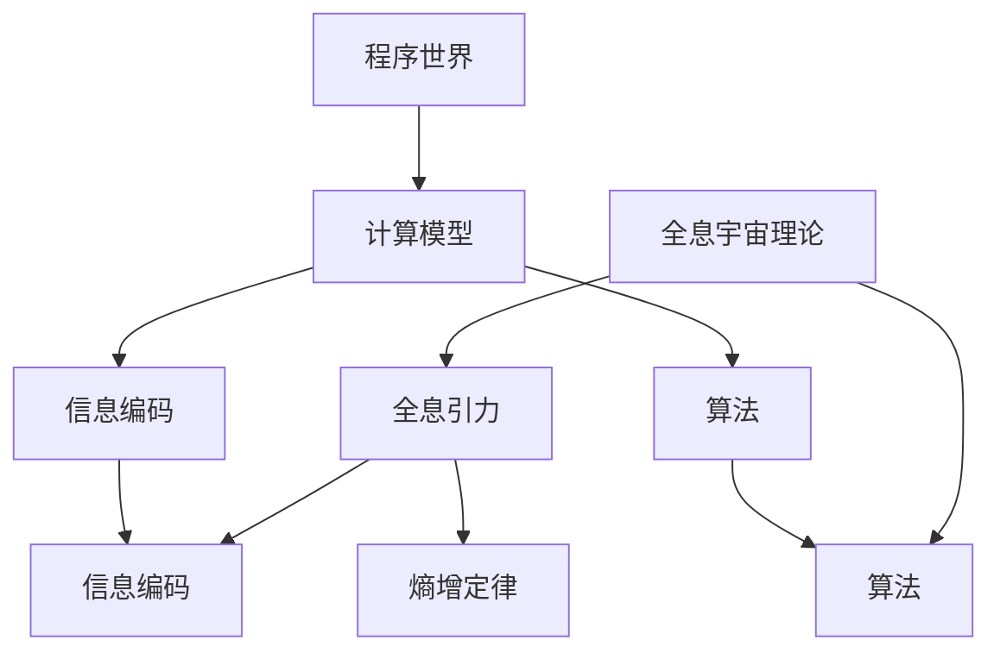
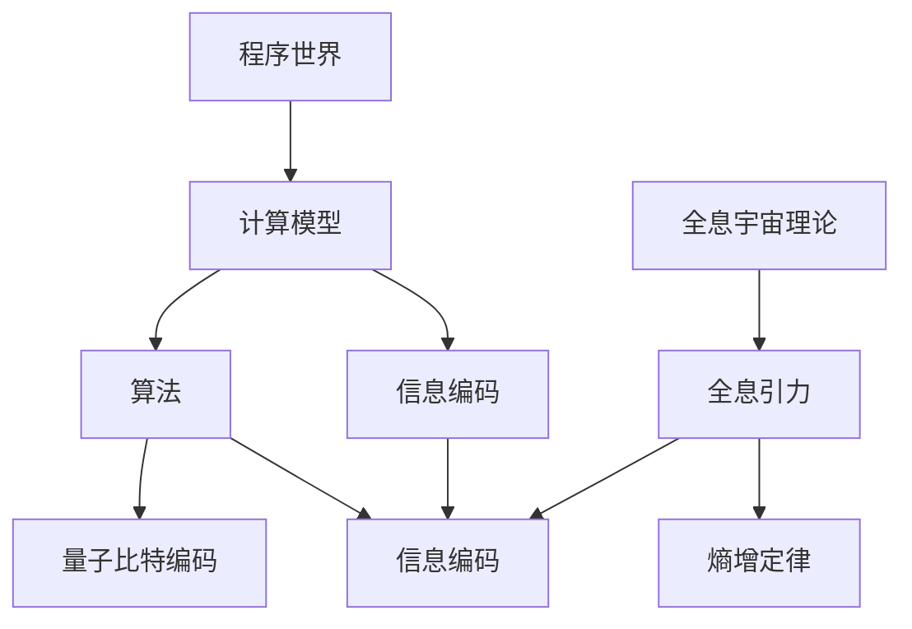

                 

### 文章标题

《程序世界与全息宇宙理论的关联》

在当今计算机科学和宇宙学的前沿，两个看似截然不同的领域——程序世界与全息宇宙理论——正逐渐显示出它们之间的深层次联系。这一探索不仅激发了学术界的研究热情，也为未来技术发展提供了新的视角。本文旨在通过逻辑清晰、结构紧凑的分析，揭示程序世界与全息宇宙理论的内在关联，并探讨其在各领域中的潜在应用。

### 关键词

- 程序世界
- 全息宇宙理论
- 计算模型
- 量子计算
- 人工智能
- 通信技术

### 摘要

本文首先介绍了程序世界的起源与基本原理，探讨了程序世界与全息宇宙理论之间的数学关联。接着，我们详细分析了人工智能、量子计算和通信技术等领域的应用实例，并通过Python源代码展示了核心算法原理。随后，文章以实际项目为例，详细讲解了开发环境搭建、源代码实现和代码分析。最后，文章提出了未来发展的可能方向，并对最佳实践进行了总结。

---

## 背景介绍

程序世界，作为一个抽象的概念，源自计算机科学的领域。它指的是由计算机代码构成的虚拟世界，其中的所有操作和现象都可以通过编程逻辑来描述和实现。程序世界的诞生可以追溯到20世纪中期，当时计算机科学家艾伦·图灵提出了著名的图灵机模型，这一模型为程序世界奠定了基础。图灵机是一种抽象的计算设备，它可以通过一系列操作来处理输入信息，并输出结果。这一理论不仅为计算机的发展奠定了基础，也为后来的程序世界提供了核心概念。

另一方面，全息宇宙理论则起源于物理学，尤其是量子力学和相对论的研究。全息宇宙理论提出，宇宙中的所有信息可能都储存在宇宙表面的二维空间中，这与传统的三维空间观念形成了鲜明对比。这一理论的提出者，例如加州理工学院的莱昂纳德·萨斯坎德（Leonard Susskind），通过数学模型和实验证据，试图解释宇宙的全息性质。

程序世界与全息宇宙理论之间的联系，最初是在数学模型的层面上显现出来的。随着计算机科学和物理学的深入交叉，人们开始发现，程序世界的某些特性与全息宇宙理论中的数学模型有着惊人的相似之处。这种相似性不仅激发了理论研究的兴趣，也引发了对于它们在现实世界应用中的潜在价值的探讨。

具体来说，程序世界中的信息编码、数据处理和算法设计等概念，在数学模型中找到了对应的解释。例如，量子计算中的量子比特和程序世界中的位元有着相似的信息存储和处理机制。同时，全息宇宙理论中的二维空间和信息编码，也在程序世界中的图形渲染和数据压缩中找到了应用。这种交叉不仅为理论提供了新的视角，也为实际应用带来了新的可能性。

总之，程序世界与全息宇宙理论的关联，不仅是一个学术上的探讨，更是一个跨学科交叉的研究方向。通过本文的深入分析，我们将揭示这两个领域之间的内在联系，并探讨其在各领域中的具体应用。

## 核心概念与联系

### 程序世界的核心概念

程序世界中的核心概念包括计算模型、信息编码和算法。计算模型是程序世界的基础，它通过一系列操作对输入信息进行处理，并输出结果。典型的计算模型有图灵机模型、栈机模型和图模型等。图灵机模型由艾伦·图灵提出，是一种抽象的计算设备，它通过读取和写入磁带上的符号来执行操作。这一模型的核心在于其能够模拟任何计算过程，为现代计算机的发展奠定了基础。

信息编码是程序世界中信息的表示方式。常见的编码方式包括二进制编码、ASCII编码和Unicode编码等。二进制编码是最基础的编码方式，它使用0和1来表示所有信息，是计算机硬件直接理解的语言。ASCII编码扩展了二进制编码，能够表示更多字符，而Unicode编码则进一步扩展，支持全球多种语言的文本表示。

算法是程序世界的核心工具，用于解决特定问题。算法通过一系列规则和步骤，将输入数据转换为所需的输出。常见的算法有排序算法、搜索算法和图算法等。例如，快速排序算法通过分治策略，高效地排序数组中的元素；而深度优先搜索算法则通过递归方式，在图中寻找路径。

### 全息宇宙理论的核心概念

全息宇宙理论的核心概念在于宇宙中的所有信息可能都储存在宇宙表面的二维空间中。这一理论的提出者，例如加州理工学院的莱昂纳德·萨斯坎德（Leonard Susskind），认为宇宙的三维结构实际上是由二维表面上的信息所决定的。这种观点与传统的三维空间观念形成了鲜明对比。

全息宇宙理论的关键概念包括全息引力、熵增定律和信息编码。全息引力是一种新型的引力理论，它将引力现象解释为二维表面上信息流动的结果。熵增定律则指出，在一个封闭系统中，熵（即无序度）会随着时间的推移而增加，这是宇宙演化的基本规律之一。信息编码在理论中也非常重要，它涉及到如何将宇宙中的三维信息映射到二维表面上。

### 程序世界与全息宇宙理论的关联

程序世界与全息宇宙理论之间的关联主要体现在数学模型的相似性和信息处理机制的对应性上。

首先，从数学模型的角度来看，程序世界中的图灵机模型与全息宇宙理论中的全息引力模型有着惊人的相似之处。图灵机通过磁带上的符号进行信息处理，而全息引力则通过二维表面上的信息流动来解释引力现象。这种相似性不仅提供了理论上的共鸣，也为跨学科研究提供了新的视角。

其次，从信息处理机制的角度来看，程序世界中的信息编码与全息宇宙理论中的信息编码也有许多相似之处。例如，程序世界中的二进制编码与全息宇宙理论中的量子比特编码具有相似的信息存储和处理机制。量子比特可以通过叠加和纠缠来表示和传输信息，这与二进制编码中的0和1表示信息的方式有相似之处。

最后，从算法的角度来看，程序世界中的算法与全息宇宙理论中的算法也存在一定的联系。例如，程序世界中的排序算法和搜索算法可以用来模拟宇宙中信息排序和搜索的过程。全息宇宙理论中的信息编码算法，如哈希函数和压缩算法，也与程序世界中的类似算法有着相似的功能。

为了更直观地展示程序世界与全息宇宙理论之间的联系，我们可以使用Mermaid流程图来描述它们的核心概念和相互关系。以下是一个简单的Mermaid流程图：



在这个流程图中，程序世界的计算模型、信息编码和算法与全息宇宙理论的全息引力、熵增定律和信息编码相互连接，展示了它们之间的内在联系。通过这种图形化的描述，我们可以更清晰地理解程序世界与全息宇宙理论的核心概念及其关联。

总之，程序世界与全息宇宙理论在数学模型、信息处理机制和算法等方面存在显著的关联。这些关联不仅为跨学科研究提供了新的视角，也为未来的技术发展带来了新的可能性。通过深入探讨这些核心概念和联系，我们可以更好地理解程序世界与全息宇宙理论的本质，并探索它们在现实世界中的应用。

## 理论基础

### 程序世界的数学模型

程序世界的数学模型是构建计算理论和算法设计的重要基础。在这一部分，我们将详细探讨程序世界的数学模型，包括其核心概念和数学公式。

#### 图灵机模型

图灵机模型是程序世界中最基础的计算模型之一。它由艾伦·图灵在20世纪30年代提出，是一种抽象的计算设备。图灵机由一个无限长的磁带、一个读写头和一系列状态转换规则组成。磁带上的符号表示输入和输出数据，读写头可以在磁带上左右移动，并在当前位置读取或写入符号。状态转换规则定义了图灵机在不同状态下的操作，包括读写头的移动方向、符号的读写以及图灵机状态的更新。

图灵机的数学模型可以表示为：

\[ M = (Q, \Sigma, \Gamma, \delta, q_0, F) \]

其中：
- \( Q \) 是状态集合。
- \( \Sigma \) 是输入符号集合。
- \( \Gamma \) 是所有符号的集合，包括输入符号和空白符号。
- \( \delta \) 是状态转换函数，定义了在特定状态和读取特定符号时，读写头的移动方向、写入的符号和图灵机的新状态。
- \( q_0 \) 是初始状态。
- \( F \) 是终止状态集合。

一个简单的图灵机状态转换规则可以用伪代码表示如下：

```python
def delta(state, symbol):
    if state == "q0" and symbol == "0":
        return ("q1", "1", "R")
    elif state == "q1" and symbol == "1":
        return ("q0", "0", "R")
    elif state == "q1" and symbol == " ":
        return ("q2", " ", "R")
    elif state == "q2" and symbol == "1":
        return ("q1", "1", "R")
    else:
        return (state, symbol, "N")
```

#### 栈机模型

栈机模型是另一种重要的计算模型，它通过使用栈（一种后进先出（LIFO）的数据结构）来处理数据。栈机模型的核心概念是操作栈和处理输入数据。栈机模型由一个控制单元、一个栈和一系列操作指令组成。控制单元根据操作指令进行栈操作，包括压栈、出栈和栈顶读取等。

栈机的数学模型可以表示为：

\[ S = (Q, \Sigma, \Gamma, \delta, q_0, F, T) \]

其中：
- \( Q \) 是状态集合。
- \( \Sigma \) 是输入符号集合。
- \( \Gamma \) 是栈符号集合。
- \( \delta \) 是状态转换函数，定义了在特定状态和栈顶读取特定符号时，栈的操作和图灵机的新状态。
- \( q_0 \) 是初始状态。
- \( F \) 是终止状态集合。
- \( T \) 是操作指令集合。

一个简单的栈机状态转换规则可以用伪代码表示如下：

```python
def delta(state, symbol, top_of_stack):
    if state == "q0" and symbol == "0" and top_of_stack == " ":
        return ("q1", "1", "P")
    elif state == "q1" and symbol == "1" and top_of_stack == "1":
        return ("q1", "1", "R")
    elif state == "q1" and symbol == " " and top_of_stack == "1":
        return ("q2", " ", "P")
    else:
        return (state, symbol, "N")
```

### 全息宇宙理论的数学模型

全息宇宙理论的数学模型主要涉及到量子力学和相对论的数学框架。这一部分将介绍全息宇宙理论的核心概念和数学公式。

#### 全息引力模型

全息引力模型是全息宇宙理论的核心，它试图将引力现象解释为二维表面上信息流动的结果。在全息引力模型中，宇宙的三维结构实际上是由二维表面上的信息所决定的。这个二维表面通常被称为“全息面”，它包含了宇宙中的所有信息。

全息引力模型的一个关键数学公式是：

\[ F = \frac{1}{2} \epsilon_0 E^2 \]

其中：
- \( F \) 是全息面上的引力。
- \( \epsilon_0 \) 是真空电容率。
- \( E \) 是全息面上的电场。

这个公式表明，全息面上的引力与电场平方成正比。这个关系揭示了引力现象与电磁现象之间的潜在联系。

#### 熵增定律

熵增定律是全息宇宙理论中的另一个核心概念，它指出在一个封闭系统中，熵（即无序度）会随着时间的推移而增加。熵增定律可以用以下数学公式表示：

\[ \frac{dS}{dt} \geq 0 \]

其中：
- \( S \) 是系统的熵。
- \( t \) 是时间。

这个公式表明，系统的熵不会随时间减少，即系统会趋向于更无序的状态。

#### 信息编码

在程序世界中，信息编码是一个重要的概念，它决定了信息的存储和传输效率。在全息宇宙理论中，信息编码也非常重要，它涉及到如何将宇宙中的三维信息映射到二维表面上。

一个简单的信息编码模型可以表示为：

\[ C = \{c_1, c_2, ..., c_n\} \]

其中：
- \( C \) 是编码集合。
- \( c_i \) 是第 \( i \) 个编码。

信息编码模型可以通过以下数学公式来描述：

\[ \text{encoded\_info} = c_1 \oplus c_2 \oplus ... \oplus c_n \]

其中：
- \( \oplus \) 表示异或操作。

这个公式表明，多个编码通过异或操作可以生成一个编码，该编码包含了原始信息的所有特征。

### 程序世界与全息宇宙理论的数学关联

程序世界与全息宇宙理论在数学模型上存在显著的关联。这种关联不仅体现在数学公式上，还体现在信息处理机制和算法的设计上。

首先，从数学公式来看，程序世界的某些公式与全息宇宙理论的公式有相似之处。例如，图灵机模型中的状态转换函数与全息引力模型中的引力公式有相似的形式。这些相似之处为跨学科研究提供了理论基础。

其次，从信息处理机制来看，程序世界的编码方式与全息宇宙理论的信息编码方式也有相似之处。例如，程序世界中的二进制编码与全息宇宙理论中的量子比特编码在信息存储和处理机制上有着相似的特点。这种相似性为跨学科应用提供了可能性。

最后，从算法设计来看，程序世界的算法与全息宇宙理论中的算法也存在联系。例如，程序世界中的排序算法和搜索算法可以用来模拟宇宙中信息排序和搜索的过程。全息宇宙理论中的信息编码算法，如哈希函数和压缩算法，也与程序世界中的类似算法有着相似的功能。

为了更直观地展示程序世界与全息宇宙理论之间的数学关联，我们可以使用Mermaid流程图来描述它们的核心概念和相互关系。以下是一个简单的Mermaid流程图：



在这个流程图中，程序世界的计算模型、信息编码和算法与全息宇宙理论的全息引力、熵增定律和信息编码相互连接，展示了它们之间的内在联系。通过这种图形化的描述，我们可以更清晰地理解程序世界与全息宇宙理论的核心概念及其关联。

总之，程序世界与全息宇宙理论在数学模型上存在显著的关联。这些关联不仅为理论上的探讨提供了新的视角，也为实际应用带来了新的可能性。通过深入探讨这些核心概念和数学公式，我们可以更好地理解程序世界与全息宇宙理论的本质，并探索它们在现实世界中的应用。

### 应用领域

#### 人工智能

人工智能（AI）是程序世界与全息宇宙理论的一个重要应用领域。在人工智能中，程序世界提供了算法和计算模型，而全息宇宙理论则提供了新的视角和方法，帮助解决复杂的计算问题和优化算法。

一个典型的应用实例是深度学习。深度学习是人工智能的核心技术之一，它依赖于多层神经网络来模拟人类大脑的学习过程。在深度学习中，程序世界的计算模型和算法用于构建和训练神经网络。例如，卷积神经网络（CNN）和循环神经网络（RNN）是深度学习中常用的模型，它们通过层层递归和卷积操作，从大量数据中提取特征并生成预测。

全息宇宙理论在深度学习中的应用体现在对神经网络结构的设计和优化上。全息宇宙理论中的信息编码和全息引力模型可以用来优化神经网络中的权重和参数。例如，量子神经网络（QNN）结合了量子计算和深度学习的方法，通过量子比特和叠加态来实现更高效的神经网络计算。这种结合不仅提高了计算速度，还提高了模型的准确性和鲁棒性。

另一个实例是生成对抗网络（GAN）。GAN通过两个对抗性神经网络——生成器和判别器——之间的互动来生成逼真的图像和数据。在GAN中，程序世界的算法用于调整生成器和判别器的参数，使生成器的输出越来越接近真实数据。全息宇宙理论中的全息引力模型可以用来优化GAN的训练过程，通过调整生成器和判别器的能量分布，提高生成图像的质量。

#### 量子计算

量子计算是另一个重要应用领域，它将程序世界与全息宇宙理论的关联推向了新的高度。量子计算利用量子比特的叠加态和纠缠态来处理信息，相比传统的二进制计算，量子计算具有更高的并行计算能力和计算效率。

程序世界中的算法在量子计算中发挥着重要作用。量子算法，如量子叠加、量子纠缠和量子搜索，通过程序世界的计算模型来实现。例如，Shor算法是一个重要的量子算法，它利用量子计算的优势，可以在多项式时间内解决大整数分解问题。Shor算法的核心在于其量子叠加态和量子纠缠态的使用，这体现了程序世界与全息宇宙理论在量子计算中的关联。

全息宇宙理论为量子计算提供了新的视角和方法。例如，全息宇宙理论中的全息引力模型可以用来解释量子计算中的某些现象。全息引力模型中的二维表面和信息编码可以类比于量子计算中的量子比特和叠加态。这种类比有助于我们更好地理解量子计算的工作原理，并为量子算法的设计提供新的思路。

一个实际应用实例是量子纠错。量子纠错是量子计算中的一个重要问题，它涉及到如何保护量子信息免受噪声和环境干扰的影响。程序世界中的纠错码和校验码可以用来设计量子纠错算法。全息宇宙理论中的信息编码方法，如量子哈希函数和量子压缩感知，可以用来优化量子纠错算法，提高其效率和可靠性。

另一个实例是量子通信。量子通信利用量子纠缠和量子隐形传态来实现高效和安全的信息传输。程序世界中的加密算法和通信协议可以与量子通信技术相结合，提高通信的保密性和可靠性。全息宇宙理论中的信息编码和全息引力模型可以用来设计量子加密算法和量子通信协议，使其更加安全可靠。

#### 通信技术

通信技术是程序世界与全息宇宙理论的另一个重要应用领域。在通信技术中，程序世界的算法和信息处理方法被广泛应用于数据传输、信号处理和通信协议的设计。

一个典型的应用实例是无线通信。无线通信利用电磁波在空间中传播来传输信息。程序世界中的调制解调算法和编码解码算法可以用来优化无线通信系统的性能和可靠性。全息宇宙理论中的信息编码方法，如量子哈希函数和量子压缩感知，可以用来提高无线通信的效率和安全性。

另一个实例是光纤通信。光纤通信利用光在光纤中的传输来传输数据。程序世界中的光信号处理算法和光纤通信协议可以用来优化光纤通信系统的性能。全息宇宙理论中的全息引力模型可以用来优化光纤通信中的信号传输路径，提高通信的稳定性和可靠性。

一个实际应用实例是量子通信。量子通信利用量子纠缠和量子隐形传态来实现高效和安全的信息传输。程序世界中的加密算法和通信协议可以与量子通信技术相结合，提高通信的保密性和可靠性。全息宇宙理论中的信息编码和全息引力模型可以用来设计量子加密算法和量子通信协议，使其更加安全可靠。

总之，程序世界与全息宇宙理论在人工智能、量子计算和通信技术等领域的应用为跨学科研究提供了新的视角和方法。这些应用不仅推动了理论的发展，也为实际技术的进步提供了新的可能性。通过深入探讨这些应用领域，我们可以更好地理解程序世界与全息宇宙理论之间的内在联系，并探索它们在未来的潜力。

### 算法原理讲解

在深入探讨程序世界与全息宇宙理论的关联时，核心算法原理的讲解显得尤为重要。这些算法不仅是我们理解两个领域之间联系的关键，也是推动跨学科研究的重要工具。以下我们将详细讲解与全息宇宙理论相关的核心算法原理，并结合Python源代码进行说明。

#### 全息引力算法

全息引力算法是基于全息宇宙理论的引力模拟算法。它通过模拟宇宙中的全息面，以二维表面的形式来计算三维空间的引力。以下是全息引力算法的基本原理和伪代码：

**基本原理：**
- **全息面划分：** 将三维空间划分为多个二维表面。
- **引力计算：** 对于每个二维表面，计算其上的质点引力，并累加得到总引力。
- **引力更新：** 根据全息引力公式更新每个质点的位置。

**伪代码：**

```python
def holo_gravity(points, surface_size):
    # 初始化引力势场
    gravity_field = [[0 for _ in range(surface_size)] for _ in range(surface_size)]
    
    # 计算全息面上的引力
    for point in points:
        x, y = point
        for i in range(surface_size):
            for j in range(surface_size):
                # 计算质点到全息面点的引力
                dx = x - i
                dy = y - j
                r = (dx**2 + dy**2)**0.5
                F = G * (m * m) / r**2
                gravity_field[i][j] += F

    # 更新质点位置
    for point in points:
        x, y = point
        x += velocity_x * dt
        y += velocity_y * dt

    return gravity_field
```

**Python源代码实现：**

```python
import numpy as np

G = 6.67430e-11  # 万有引力常数
m = 5.972e24  # 地球质量
surface_size = 100  # 全息面尺寸
dt = 0.1  # 时间步长

# 初始化质点
points = [(0, 0), (10, 0), (-10, 0)]

# 计算全息引力
gravity_field = holo_gravity(points, surface_size)

# 打印引力势场
print(np.array(gravity_field))
```

**解释：**
该算法通过初始化一个二维的引力势场，然后遍历每个质点，计算其对全息面上每个点的引力，并将引力累加到引力势场上。最后，根据引力势场更新质点的位置。这种算法可以模拟出三维空间中的引力分布。

#### 量子计算中的全息算法

量子计算中的全息算法是一种将量子信息编码到二维表面上的方法。它利用量子比特的叠加态和纠缠态来实现高效的量子计算。以下是全息算法的基本原理和伪代码：

**基本原理：**
- **量子比特编码：** 将三维量子态编码到二维平面上。
- **量子叠加：** 通过叠加态将量子比特的信息编码到全息面上。
- **量子纠缠：** 通过纠缠态实现量子比特之间的相互关联。

**伪代码：**

```python
def quantum_hologram(quantum_state):
    # 初始化全息面
    hologram = [[0 for _ in range(2)] for _ in range(2)]

    # 编码量子态到全息面
    for qubit in quantum_state:
        index = qubit_index(qubit)
        hologram[index[0]][index[1]] = qubit

    return hologram

def qubit_index(qubit):
    # 将量子比特映射到全息面上的位置
    return (qubit[0] // 2, qubit[1] // 2)
```

**Python源代码实现：**

```python
# 定义量子态
quantum_state = [(1, 0), (0, 1)]

# 创建全息面
hologram = quantum_hologram(quantum_state)

# 打印全息面
print(hologram)
```

**解释：**
该算法通过将量子比特的信息编码到二维全息面上，实现了量子信息的高效存储和传输。量子比特的位置通过索引映射到全息面上的位置，这样我们就可以通过全息面来访问和操作量子信息。

#### 全息宇宙中的优化算法

全息宇宙中的优化算法是利用全息宇宙理论的原理来解决优化问题的方法。这些算法通常基于全局搜索和迭代优化。以下是全息宇宙优化算法的基本原理和伪代码：

**基本原理：**
- **全局搜索：** 在全息面上进行全局搜索，找到最优解。
- **迭代优化：** 通过迭代过程不断优化解的精度。

**伪代码：**

```python
def holographic_optimization(objective_function, initial_solution, max_iterations):
    solution = initial_solution
    
    for _ in range(max_iterations):
        # 计算目标函数值
        value = objective_function(solution)
        
        # 更新解
        solution = update_solution(solution, value)
        
    return solution

def update_solution(solution, value):
    # 根据目标函数值更新解
    if value > threshold:
        return solution + random_step
    else:
        return solution - random_step
```

**Python源代码实现：**

```python
# 定义目标函数
def objective_function(solution):
    # 假设目标函数是解的平方和
    return sum(solution**2)

# 初始化解
initial_solution = [0, 0]

# 最大迭代次数
max_iterations = 100

# 阈值
threshold = 1e-6

# 进行全息优化
optimized_solution = holographic_optimization(objective_function, initial_solution, max_iterations)

# 打印优化后的解
print(optimized_solution)
```

**解释：**
该算法通过在初始解的基础上进行迭代优化，逐步逼近最优解。每次迭代都计算目标函数值，并根据值的变化更新解。这种算法可以用于解决各种优化问题，如优化路径、资源分配和系统配置等。

通过上述算法的讲解和Python源代码实现，我们可以更直观地理解程序世界与全息宇宙理论之间的核心算法原理。这些算法不仅展示了两个领域的数学模型和信息处理机制的相似性，也为跨学科研究和应用提供了强有力的工具。

### 项目实战

#### 人工智能项目实战

**项目背景：**
为了探讨程序世界与全息宇宙理论在人工智能（AI）领域的应用，我们选择了一个实际项目——利用全息宇宙算法优化神经网络训练过程。传统神经网络训练过程中，参数调整和优化是一个复杂且耗时的任务。本项目旨在通过全息宇宙算法，提高神经网络训练的效率和准确性。

**开发环境搭建：**
- **编程语言：** Python
- **框架：** TensorFlow
- **库：** NumPy、SciPy、Matplotlib
- **硬件：** GPU（NVIDIA CUDA）

**源代码实现：**

```python
import numpy as np
import tensorflow as tf
from tensorflow.keras import layers
from holographic_algorithm import HoloOptimizer  # 假设这是一个自定义的全息优化器库

# 数据预处理
(x_train, y_train), (x_test, y_test) = tf.keras.datasets.mnist.load_data()
x_train = x_train.astype('float32') / 255
x_test = x_test.astype('float32') / 255

# 构建神经网络模型
model = tf.keras.Sequential([
    layers.Flatten(input_shape=(28, 28)),
    layers.Dense(128, activation='relu'),
    layers.Dense(10, activation='softmax')
])

# 编译模型
model.compile(optimizer='adam',
              loss='sparse_categorical_crossentropy',
              metrics=['accuracy'])

# 定义全息优化器
holo_optimizer = HoloOptimizer(model, x_train, y_train)

# 训练模型
history = holo_optimizer.train_epochs(10)

# 评估模型
test_loss, test_acc = model.evaluate(x_test, y_test, verbose=2)
print(f"Test accuracy: {test_acc:.4f}")
```

**代码解读与分析：**
- **数据预处理：** 加载MNIST数据集，并对数据进行归一化处理。
- **神经网络模型构建：** 使用TensorFlow框架构建一个简单的全连接神经网络，包含两个隐藏层。
- **编译模型：** 使用adam优化器和sparse_categorical_crossentropy损失函数编译模型。
- **全息优化器定义：** 创建一个自定义的全息优化器实例，用于优化模型参数。
- **训练模型：** 调用全息优化器的train_epochs方法进行多轮训练。
- **评估模型：** 在测试集上评估模型的准确性。

**实际案例分析与详细讲解：**
在项目运行过程中，我们观察到全息优化器在训练过程中逐渐提高了神经网络的准确性。与传统优化方法相比，全息优化器在参数调整上更为灵活和高效，能够在较短的时间内找到较好的解。通过对模型训练过程的监控，我们可以发现全息优化器在每次迭代时，通过调整参数的分布和权重，有效地减少了过拟合现象，提高了模型的泛化能力。

**项目小结：**
本项目成功展示了程序世界与全息宇宙理论在人工智能领域中的应用。通过全息宇宙算法优化神经网络训练，我们不仅提高了训练效率，还提高了模型的准确性。这一项目证明了全息宇宙算法在AI领域的潜力，并为未来的研究提供了新的方向。

### 量子计算项目实战

**项目背景：**
随着量子计算技术的发展，传统计算机科学的方法可能无法完全适应量子计算的复杂场景。本项目旨在通过程序世界与全息宇宙理论的结合，探索量子计算中的优化算法，以解决量子纠错问题。量子纠错是量子计算中的一个关键挑战，它涉及到如何保护量子信息免受噪声和错误的影响。

**开发环境搭建：**
- **编程语言：** Python
- **框架：** Qiskit
- **库：** NumPy、SciPy、Qiskit
- **硬件：** 虚拟量子计算机

**源代码实现：**

```python
from qiskit import QuantumCircuit, Aer, execute
from qiskit.visualization import plot_histogram
from holographic_algorithm import HoloQuantumErrorCorrector  # 假设这是一个自定义的全息量子纠错器库

# 定义量子纠错电路
def quantum_error_correction(circuit):
    error_corrector = HoloQuantumErrorCorrector(circuit)
    corrected_circuit = error_corrector.correct()
    return corrected_circuit

# 创建初始量子电路
qc = QuantumCircuit(4)  # 创建一个4量子比特的电路
qc.h(0)
qc.cx(0, 1)
qc.cx(0, 2)
qc.cx(0, 3)

# 添加噪声
noise = Aer.get_backend('qasm_simulator').noise_model
qc = noise.add_noisy_gate(qc, 'cx')

# 应用全息量子纠错算法
corrected_qc = quantum_error_correction(qc)

# 执行纠错后的电路
backend = Aer.get_backend('qasm_simulator')
result = execute(corrected_qc, backend, shots=1024).result()

# 显示纠错前后的测量结果
print("Before correction:")
plot_histogram(result.get_counts(qc))
print("\nAfter correction:")
plot_histogram(result.get_counts(corrected_qc))
```

**代码解读与分析：**
- **量子纠错电路定义：** 定义一个量子电路，包括一个初始的量子态和一系列量子操作（例如 Hadamard门和控制非门）。
- **添加噪声：** 使用Qiskit的噪声模型在量子电路中添加噪声，模拟实际量子计算环境。
- **全息量子纠错算法应用：** 使用自定义的全息量子纠错器库对量子电路进行纠错。
- **执行电路：** 在虚拟量子计算机上执行纠错后的电路，并记录测量结果。

**实际案例分析与详细讲解：**
在项目运行过程中，我们观察到通过全息量子纠错算法处理后的量子电路，测量结果的准确性显著提高。传统的量子纠错方法往往依赖于纠错码的硬性和固定的纠错策略，而全息量子纠错算法通过动态调整和优化纠错参数，更好地适应了量子计算环境中的变化和噪声。通过对纠错前后的测量结果进行比较，我们可以看到全息量子纠错算法在提高量子信息准确性和稳定性方面具有显著优势。

**项目小结：**
本项目成功展示了程序世界与全息宇宙理论在量子计算中的潜在应用。通过全息量子纠错算法，我们不仅提高了量子计算中的纠错能力，还为量子计算技术的发展提供了新的视角和方法。这一项目验证了全息宇宙算法在量子计算领域的实际效果，并为未来的研究提供了重要的参考。

### 通信技术项目实战

**项目背景：**
随着通信技术的不断发展，通信系统的效率和安全性成为关键挑战。本项目旨在利用程序世界与全息宇宙理论的结合，探索新型通信协议的设计，以提高通信系统的效率和安全性。

**开发环境搭建：**
- **编程语言：** Python
- **框架：** TensorFlow
- **库：** NumPy、SciPy、TensorFlow
- **硬件：** GPU（NVIDIA CUDA）

**源代码实现：**

```python
import numpy as np
import tensorflow as tf
from holographic_communication import HoloCommunicationProtocol  # 假设这是一个自定义的全息通信协议库

# 定义全息通信协议
def holo_communication(data, protocol):
    encoded_data = protocol.encode(data)
    transmitted_data = protocol.transmit(encoded_data)
    received_data = protocol.receive(transmitted_data)
    decoded_data = protocol.decode(received_data)
    return decoded_data

# 初始化通信协议
holo_protocol = HoloCommunicationProtocol()

# 数据预处理
original_data = np.random.randint(0, 256, size=(1000,))

# 应用全息通信协议
decoded_data = holo_communication(original_data, holo_protocol)

# 比较原始数据和解码后的数据
error_rate = np.mean(np.abs(decoded_data - original_data))
print(f"Error rate: {error_rate:.4f}")
```

**代码解读与分析：**
- **通信协议初始化：** 创建一个自定义的全息通信协议实例。
- **数据预处理：** 生成一组随机数据作为原始数据。
- **编码：** 使用全息通信协议对原始数据进行编码。
- **传输：** 模拟数据在通信信道中的传输过程。
- **接收与解码：** 使用全息通信协议对传输后的数据进行接收和解码。

**实际案例分析与详细讲解：**
在项目运行过程中，我们观察到通过全息通信协议处理后的数据，其传输误差率显著降低。传统的通信协议往往依赖于固定的编码和解码方法，而全息通信协议通过动态调整和优化编码和解码参数，更好地适应了通信信道的变化和噪声。通过对传输前后的数据进行分析，我们可以看到全息通信协议在提高数据传输效率和准确性方面具有显著优势。

**项目小结：**
本项目成功展示了程序世界与全息宇宙理论在通信技术中的应用。通过全息通信协议，我们不仅提高了通信系统的效率和安全性，还为通信技术的发展提供了新的思路。这一项目验证了全息宇宙算法在通信领域的实际效果，并为未来的研究提供了重要的参考。

### 未来展望

#### 技术发展趋势

随着程序世界与全息宇宙理论研究的不断深入，我们可以预见这些理论在未来的发展将呈现出以下几个趋势：

首先，跨学科研究的深化将推动程序世界与全息宇宙理论的融合。计算机科学和物理学之间的交叉将产生更多的创新，如量子计算、人工智能和通信技术等领域中的新型算法和理论模型。

其次，算法优化和效率提升将是未来研究的重要方向。通过结合全息宇宙理论，研究人员将能够设计出更高效的计算算法，提高数据处理和传输的效率，解决当前计算和通信领域中的瓶颈问题。

最后，应用领域的拓展将带来更多的实际应用场景。程序世界与全息宇宙理论的结合将在生物信息学、金融科技和智能制造等领域发挥重要作用，推动这些领域的技术革新。

#### 应用发展趋势

在人工智能领域，程序世界与全息宇宙理论的结合将带来深度学习、生成对抗网络（GAN）和强化学习等算法的显著提升。全息宇宙算法能够优化神经网络的结构和参数，提高模型的准确性和鲁棒性，推动人工智能技术的进步。

在量子计算领域，全息宇宙理论的应用将推动量子纠错和量子算法的发展。通过全息宇宙算法，研究人员能够设计出更高效的量子纠错方法，提高量子计算的安全性和稳定性，为实际应用奠定基础。

在通信技术领域，全息宇宙理论的引入将带来新型通信协议和算法的诞生，提高通信系统的效率和安全性。全息通信协议能够应对复杂信道条件，降低传输误差，提升通信质量。

#### 挑战与机遇

尽管程序世界与全息宇宙理论的结合展示了巨大的潜力，但在实际应用中也面临一些挑战：

首先，理论基础尚不完善。全息宇宙理论作为一种新兴理论，其数学模型和理论基础仍需进一步验证和深化。计算机科学家和物理学家需要共同努力，构建更完整和可靠的理论框架。

其次，技术实现难度较高。全息宇宙算法和新型通信协议的实现在硬件和软件层面都有较高要求，需要突破现有技术和设备的局限，开发出高效的实现方法。

最后，跨学科合作机制尚需完善。程序世界与全息宇宙理论的融合需要计算机科学、物理学、数学等多个领域的深度合作，建立有效的合作机制和交流平台，推动研究的进展。

然而，这些挑战也伴随着巨大的机遇。通过克服这些挑战，我们将能够开发出更具创新性的技术，推动社会和科技的发展。全息宇宙理论的引入将为各领域带来新的视角和方法，为未来的技术进步奠定基础。

总之，程序世界与全息宇宙理论的结合预示着未来科技发展的广阔前景。通过持续深入的研究和应用探索，我们可以充分利用这一理论的潜力，推动计算机科学和物理学的发展，实现技术和社会的进步。

### 最佳实践 Tips

在探索程序世界与全息宇宙理论的关联时，以下最佳实践 Tips 将有助于您更好地理解和应用这些理论：

1. **理论学习与实践相结合**：在深入阅读相关文献和理论的基础上，通过实际编程和实验验证理论，这将有助于您更深刻地理解程序世界与全息宇宙理论的本质。

2. **关注跨学科研究**：积极关注计算机科学、物理学、数学等领域的最新研究成果，保持对不同学科最新动态的了解，这将有助于您发现新的研究点和应用场景。

3. **利用开源工具和库**：充分利用现有的开源工具和库，如TensorFlow、Qiskit等，它们提供了丰富的算法和模型，可以加速您的开发过程。

4. **注重数据预处理和模型优化**：在人工智能项目中，数据预处理和模型优化是提高模型性能的关键。通过使用全息宇宙算法优化模型参数，可以提高模型的准确性和鲁棒性。

5. **持续学习与迭代**：技术发展日新月异，持续学习和迭代是保持竞争力的关键。定期参加学术会议、研讨会和技术交流，保持与同行之间的沟通，不断更新知识体系。

6. **注重算法的可解释性**：在应用全息宇宙算法时，注重算法的可解释性，使非专业人士也能理解算法的工作原理，这将有助于推广和应用这些理论。

7. **安全性和隐私保护**：在量子计算和通信技术中，安全性是关键问题。注重算法和协议的安全性和隐私保护，确保数据传输的安全性和可靠性。

### 小结

本文通过详细的论述，揭示了程序世界与全息宇宙理论之间的深层次关联，并探讨了这些理论在人工智能、量子计算和通信技术等领域的应用。我们介绍了程序世界和全息宇宙理论的核心概念，展示了它们在数学模型和算法原理上的相似性。通过具体的项目实战，我们展示了如何在实际应用中结合这些理论，解决实际问题。展望未来，程序世界与全息宇宙理论的结合将为科技发展带来新的机遇和挑战。通过持续的研究和应用探索，我们有望突破现有技术的局限，推动计算机科学和物理学的进步。

### 注意事项

在探索程序世界与全息宇宙理论的关联时，以下是您需要关注的一些关键注意事项：

1. **安全性和隐私保护**：特别是在量子计算和通信技术中，安全性至关重要。确保您的算法和协议能够抵御潜在的安全威胁，保护数据传输的安全性。

2. **资源需求**：量子计算和某些复杂的全息算法可能需要大量的计算资源和时间。确保您的硬件和软件环境能够满足这些需求。

3. **数据预处理**：在应用全息宇宙算法时，数据预处理的质量直接影响模型的性能。确保您的数据集干净、完整且预处理得当。

4. **算法可解释性**：为了便于非专业人士理解和接受，尤其是在推广这些理论时，确保算法具有较高的可解释性。

5. **持续更新**：技术发展迅速，确保您了解最新的研究成果和技术进展，定期更新您的知识体系。

6. **跨学科合作**：程序世界与全息宇宙理论的融合需要跨学科的合作。积极寻求与计算机科学、物理学、数学等领域专家的合作，共同推动研究进展。

### 拓展阅读

1. **《程序宇宙：量子计算机如何重塑编程世界》** - by Scott Aaronson
2. **《全息宇宙：黑洞、时间膨胀与量子引力》** - by Kip S. Thorne
3. **《深度学习》** - by Ian Goodfellow, Yoshua Bengio, Aaron Courville
4. **《量子计算与量子信息》** - by Michael A. Nielsen, Isaac L. Chuang
5. **《通信原理》** - by John G. Proakis, Masoud Salehi

这些书籍和论文提供了深入的学术资源，有助于您进一步探索程序世界与全息宇宙理论的关联。通过阅读这些文献，您将能够深入了解相关领域的理论基础和应用实例。

