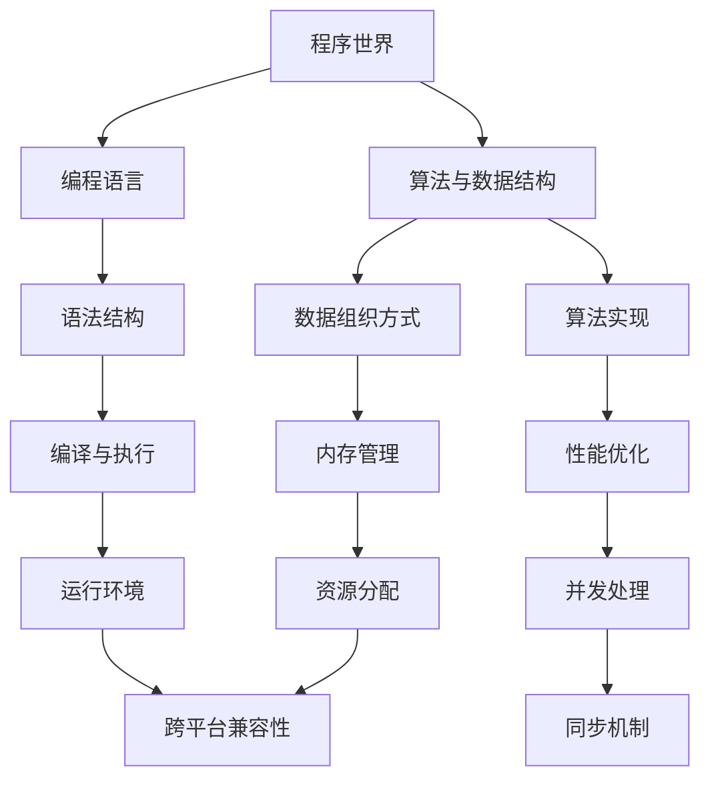

                 

## 第1章 引言

### 1.1 程序世界的概念

程序世界，是一个由计算机代码构建的虚拟世界，它通过编程语言、算法和数据结构等工具来实现各种功能和应用。计算机编程的起源可以追溯到20世纪中期，当时科学家们开始尝试使用机器语言来控制计算机的运行。随着计算机硬件的发展，编程语言也从最初的低级语言逐渐演变为高级语言，使得编程变得更加容易和高效。

在程序世界中，硬件和软件是密不可分的。硬件是计算机的物理组成部分，如处理器、内存和硬盘等，而软件则是运行在硬件上的程序代码，负责处理数据和执行操作。编程语言作为连接硬件和软件的桥梁，使得程序员能够用更加直观和易读的方式编写程序。

编程语言的演变也是程序世界发展的重要一环。从最初的汇编语言到后来的C语言、Java语言、Python语言等，每一种语言都有其独特的特点和应用场景。高级编程语言的兴起，使得程序员可以专注于解决问题，而不必担心底层硬件的实现细节。

### 1.2 多重宇宙泡沫理论的概述

多重宇宙理论是一种关于宇宙多样性的科学假说，它认为我们的宇宙只是众多可能宇宙中的一种。这一理论最早由物理学家埃德华·阿莫斯·亨特在20世纪40年代提出。而泡沫理论则是在这个框架下，描述了宇宙之间可能存在的交流和演化的方式。

在多重宇宙泡沫理论中，泡沫宇宙的形成是指由于宇宙中的某些物理参数发生变化，导致新的宇宙从原有宇宙中分离出来。这些泡沫宇宙可能具有不同的物理常数、物质组成和历史进程。而泡沫理论的提出，则为我们提供了一个新的视角来理解宇宙的多样性和复杂性。

### 1.3 程序世界与多重宇宙泡沫理论的类比

将程序世界与多重宇宙泡沫理论进行类比，可以为我们提供一种新的思考方式，来理解复杂系统的运作和演化。在程序世界中，编程语言、算法和数据结构就像是一个个宇宙，它们相互独立，但又通过计算机硬件相互连接。而多重宇宙泡沫理论则提供了一个类似于泡沫现象的过程，来描述这些宇宙之间的动态关系。

例如，编程语言之间的兼容性问题，可以类比为不同宇宙之间的交流和碰撞。当一个新的编程语言被提出时，它可能会与现有的编程语言产生冲突，导致程序员需要花费额外的时间和精力来解决这个问题。这种现象类似于泡沫宇宙的形成，即新的宇宙出现，并与原有的宇宙产生互动。

此外，算法与数据结构在程序世界中的应用，也可以类比为泡沫理论中的演化过程。一个高效的算法或数据结构，可以优化程序的执行效率，就像泡沫宇宙中的某些物理参数变化，可以导致新的宇宙拥有更优越的条件。

通过这样的类比，我们可以更好地理解程序世界的复杂性和动态性，从而为解决复杂问题提供新的思路和方法。

### 结论

程序世界与多重宇宙泡沫理论的类比，为我们提供了一种全新的视角，来理解复杂系统的运作和演化。通过这种类比，我们可以更好地理解编程语言、算法和数据结构之间的相互关系，以及它们在复杂系统中的角色和作用。这种思考方式不仅有助于我们更好地掌握计算机编程的技巧，还可以为解决现实世界中的复杂问题提供新的思路。在接下来的章节中，我们将深入探讨程序世界的核心概念，并进一步阐述这一类比的理论基础。

## 第2章 程序世界的核心概念

在深入探讨程序世界之前，我们需要明确几个核心概念，这些概念构成了程序世界的基础，也是理解和分析复杂程序的关键。本章将分为两个部分，首先介绍编程语言的发展，然后探讨算法与数据结构的基本概念和常见应用。

### 2.1 编程语言

编程语言是程序员与计算机交流的工具，它定义了程序员如何表达计算过程和逻辑。编程语言的发展历程可以追溯到20世纪中期，当时科学家们开始尝试使用机器语言来控制计算机。机器语言是由计算机硬件直接理解的二进制代码，但由于其复杂性和不易读性，很快就被更高级的编程语言所取代。

#### 2.1.1 编程语言的发展

1. **第一代编程语言：汇编语言**
   - **起源**：20世纪50年代初，随着计算机硬件的发展，汇编语言被发明出来，以解决机器语言的复杂性。
   - **特点**：汇编语言使用了助记符来表示机器语言的操作码，使程序员可以更直观地理解计算机的操作。

2. **第二代编程语言：高级编程语言**
   - **起源**：20世纪60年代，随着计算机硬件和软件的进一步发展，高级编程语言如FORTRAN和COBOL被发明。
   - **特点**：高级编程语言使用更接近人类自然语言的结构，提高了编程的效率和可读性。

3. **第三代编程语言：结构化编程语言**
   - **起源**：20世纪70年代，随着计算机科学理论的发展，结构化编程语言如C语言被发明。
   - **特点**：结构化编程语言引入了控制结构、数据抽象和模块化设计，使得程序更加清晰和易于维护。

4. **第四代编程语言：第四代语言**
   - **起源**：20世纪80年代，第四代编程语言如SQL和HTML被发明，以简化数据库管理和网页开发。
   - **特点**：第四代编程语言高度抽象，可以减少编程的复杂度，但缺乏对底层硬件的直接控制。

5. **第五代编程语言：面向对象编程语言**
   - **起源**：20世纪90年代，面向对象编程语言如Java和C++被发明。
   - **特点**：面向对象编程语言通过类和对象的概念，将数据和操作封装在一起，提高了代码的复用性和可维护性。

#### 2.1.2 常见的编程语言

- **面向过程的编程语言**：如C、Pascal和Fortran。
- **面向对象的编程语言**：如Java、C++和Python。
- **函数式编程语言**：如Haskell和Erlang。
- **脚本语言**：如Python、JavaScript和Ruby。
- **标记语言**：如HTML和XML。

### 2.2 算法与数据结构

算法是解决特定问题的步骤序列，而数据结构则是组织数据的方式。算法和数据结构是程序世界中的两大支柱，它们的结合决定了程序的性能和可维护性。

#### 2.2.1 算法的基本概念

- **定义**：算法是一系列有序的指令，用于解决某个特定的问题。
- **特点**：算法应当具有确定性、输入、输出和有效性。
- **设计原则**：效率、可读性、可维护性和健壮性。

#### 2.2.2 常见数据结构及其应用

1. **数组**
   - **定义**：数组是一组元素的集合，元素按索引顺序排列。
   - **应用**：用于实现列表、队列、栈等基本数据结构。

2. **链表**
   - **定义**：链表是一种由节点组成的线性结构，每个节点包含数据和指向下一个节点的指针。
   - **应用**：用于实现动态数据集合，如链表、双向链表和循环链表。

3. **栈**
   - **定义**：栈是一种后进先出（LIFO）的数据结构。
   - **应用**：用于实现递归调用、函数调用、表达式求值等。

4. **队列**
   - **定义**：队列是一种先进先出（FIFO）的数据结构。
   - **应用**：用于实现任务调度、缓冲区管理、优先级队列等。

5. **树**
   - **定义**：树是一种层次化的数据结构，由节点和边组成。
   - **应用**：用于实现二叉树、堆、平衡树（如AVL树）、B树等。

6. **图**
   - **定义**：图是一种由节点和边组成的数据结构，节点之间可以是任意连接关系。
   - **应用**：用于实现网络拓扑、路径查找、最短路径算法等。

通过深入理解编程语言和算法与数据结构的基本概念，我们可以更好地掌握程序世界中的核心知识，为解决复杂问题打下坚实的基础。在接下来的章节中，我们将进一步探讨程序世界中的泡沫现象，并尝试将其与多重宇宙泡沫理论进行类比。

### 第3章 程序世界中的泡沫现象

在程序世界中，泡沫现象是一种常见且复杂的现象，它通常表现为程序在某些条件下出现异常行为，从而导致系统性能下降或功能失效。泡沫现象在程序世界中有着广泛的应用，如编程语言的兼容性问题、算法的效率瓶颈、以及数据结构的冲突等。理解泡沫现象的产生机制及其影响，对于程序员来说至关重要。

#### 3.1 泡沫现象的定义

泡沫现象可以定义为在程序运行过程中，由于某种不合理或错误的行为，导致系统性能下降或功能失效的现象。这种现象通常是由于程序中的某些部分相互冲突、依赖关系不合理，或者对某些资源的竞争导致的。例如，在多线程程序中，如果多个线程同时访问共享资源，且没有适当的同步机制，就可能导致数据竞争和死锁。

#### 3.1.1 泡沫的分类

泡沫现象可以根据其表现和影响范围进行分类：

1. **局部泡沫**
   - **定义**：局部泡沫是指仅影响程序局部区域的泡沫现象。
   - **影响**：局部泡沫通常会导致局部性能下降，如某些函数运行时间变长、内存占用增加等。
   - **例子**：在一个排序算法中，如果输入数据已经部分排序，可能导致某些排序算法（如冒泡排序）效率低下。

2. **全局泡沫**
   - **定义**：全局泡沫是指影响整个程序运行的泡沫现象。
   - **影响**：全局泡沫可能导致程序崩溃、系统死锁或无法达到预期功能。
   - **例子**：在多线程程序中，由于数据竞争导致的死锁，会使整个程序停止响应。

3. **临时泡沫**
   - **定义**：临时泡沫是指仅在特定条件下出现的泡沫现象。
   - **影响**：临时泡沫通常是由于某些外部条件（如网络延迟、硬件故障）引起的。
   - **例子**：在网络应用程序中，由于网络不稳定导致的连接中断和重连。

4. **长期泡沫**
   - **定义**：长期泡沫是指持续存在并逐渐积累的泡沫现象。
   - **影响**：长期泡沫可能导致系统性能逐渐下降，甚至最终崩溃。
   - **例子**：由于内存泄露导致的系统资源占用不断增加，最终导致系统崩溃。

#### 3.1.2 泡沫现象的影响

泡沫现象对程序世界的影响是多方面的，主要包括以下几个方面：

1. **性能下降**
   - **原因**：由于泡沫现象导致的资源竞争、死锁、内存泄露等问题，程序运行效率会下降。
   - **影响**：程序响应时间变长，用户体验变差。

2. **功能失效**
   - **原因**：在某些极端情况下，泡沫现象可能导致程序无法完成预期功能。
   - **影响**：系统无法达到预期目标，甚至崩溃。

3. **安全性问题**
   - **原因**：由于程序中的漏洞和错误，可能导致安全漏洞和恶意攻击。
   - **影响**：系统的数据安全性受到威胁，可能导致数据泄露和损失。

4. **维护困难**
   - **原因**：泡沫现象的存在使得程序的逻辑更加复杂，维护和修复变得更加困难。
   - **影响**：程序的可维护性下降，开发成本增加。

通过理解泡沫现象的定义、分类及其影响，我们可以更好地识别和解决程序世界中的泡沫问题。在接下来的章节中，我们将探讨如何通过合理的编程实践和算法设计，来预防和解决泡沫现象。

### 3.2 多重宇宙泡沫理论的类比

将程序世界中的泡沫现象与多重宇宙泡沫理论进行类比，可以为我们提供一种全新的视角，来理解复杂系统的运作和演化。这种类比不仅有助于我们更好地理解程序世界中的复杂问题，还可以为解决现实世界中的类似问题提供启示。

#### 3.2.1 程序世界与多重宇宙的相似性

1. **多元性和并行性**
   - **程序世界**：程序世界由多种编程语言、算法和数据结构构成，它们在硬件的支持下并行运行。
   - **多重宇宙**：多重宇宙理论认为存在多个不同的宇宙，每个宇宙具有不同的物理常数和演化路径，它们在时间和空间上并行存在。

2. **动态性和演化**
   - **程序世界**：程序世界中的编程语言和算法不断发展和演变，以适应新的需求和挑战。
   - **多重宇宙**：多重宇宙中的各个宇宙随着时间和空间的演化，可能发生新的变化和形成新的泡沫宇宙。

3. **互动和影响**
   - **程序世界**：不同的编程语言、算法和数据结构之间相互影响，共同决定程序的运行结果。
   - **多重宇宙**：不同的宇宙之间可能通过物理现象、信息交流等方式相互影响，形成复杂的动态系统。

#### 3.2.2 泡沫理论在程序世界中的映射

1. **编程语言的兼容性**
   - **类比**：编程语言之间的兼容性问题可以类比为不同宇宙之间的碰撞。
   - **影响**：当一种新的编程语言被引入时，它可能会与现有的编程语言产生冲突，导致兼容性问题。

2. **算法的效率瓶颈**
   - **类比**：算法的效率瓶颈可以类比为宇宙中的资源竞争。
   - **影响**：在某些特定条件下，算法可能无法有效处理大规模数据，导致性能下降。

3. **数据结构的冲突**
   - **类比**：数据结构的冲突可以类比为不同宇宙之间的边界冲突。
   - **影响**：当多个数据结构同时访问同一资源时，如果没有适当的同步机制，可能导致数据竞争和死锁。

通过这种类比，我们可以将程序世界中的复杂问题与多重宇宙泡沫理论联系起来，从而提供新的思考角度和方法。例如，通过理解不同宇宙之间的互动和演化，我们可以更好地设计多线程程序，避免数据竞争和死锁；通过借鉴泡沫宇宙的形成和演化，我们可以优化算法的效率，提高程序的运行速度。

#### 结论

程序世界与多重宇宙泡沫理论的类比，为我们提供了一个全新的视角，来理解和解决程序世界中的复杂问题。通过这种类比，我们可以将现实世界中的物理学理论应用到计算机科学中，从而提高程序的性能和可维护性。在接下来的章节中，我们将进一步探讨程序世界的演进过程，并分析多重宇宙泡沫理论在程序世界中的具体应用。

### 第4章 程序世界的演进

程序世界从诞生之初，经历了无数次的变革和发展。随着时间的推移，编程语言、算法和数据结构不断进步，使得程序世界变得更加复杂和多样化。本节将分为两个部分，首先回顾程序世界的演进历程，然后分析各个阶段的特点和影响。

#### 4.1 第一阶段：编程语言的诞生

编程语言的诞生标志着程序世界从硬件层面向软件层面的转变。早期的计算机编程主要依赖于机器语言和汇编语言，这些语言直接与硬件交互，但编写复杂程序时繁琐且容易出错。

1. **机器语言**
   - **起源**：机器语言是计算机硬件能够直接理解和执行的指令集。
   - **特点**：机器语言程序高效且占用内存小，但难以阅读和编写，且依赖于特定硬件平台。

2. **汇编语言**
   - **起源**：为了解决机器语言的复杂性，汇编语言应运而生，它使用助记符代替机器语言的指令。
   - **特点**：汇编语言比机器语言更易于理解和编写，但仍然依赖于特定硬件平台，程序可移植性较差。

#### 4.2 第二阶段：高级编程语言的普及

随着计算机硬件和软件技术的不断发展，高级编程语言逐渐取代了汇编语言，成为主流编程工具。高级编程语言提供了更抽象和易于理解的语言结构，使程序员能够更专注于解决问题，而不必担心底层硬件的实现细节。

1. **FORTRAN**
   - **起源**：1957年，FORTRAN（公式翻译）语言由IBM公司开发，用于科学计算。
   - **特点**：FORTRAN是一种面向过程的高级编程语言，适合科学计算和工程应用。

2. **COBOL**
   - **起源**：1959年，COBOL（商业通用语言）语言由美国国家标准局开发，用于商业数据处理。
   - **特点**：COBOL是一种面向业务的高级编程语言，适合商业应用程序。

3. **C语言**
   - **起源**：1972年，C语言由贝尔实验室的Dennis Ritchie开发，用于系统编程。
   - **特点**：C语言是一种多功能的高级编程语言，兼具低级语言的高效性和高级语言的易用性。

#### 4.3 第三阶段：算法与数据结构的普及

随着计算机科学理论的发展，算法与数据结构逐渐成为程序世界中的重要组成部分。高效的算法和数据结构不仅提高了程序的运行效率，还为复杂问题的解决提供了理论支持。

1. **算法的基本概念**
   - **起源**：算法的定义可以追溯到古希腊数学家欧几里得的《几何原本》。
   - **特点**：算法是一系列有序的步骤，用于解决特定问题，具有输入、输出和确定性。

2. **常见算法**
   - **排序算法**：如冒泡排序、快速排序、归并排序等，用于对数据进行排序。
   - **搜索算法**：如线性搜索、二分搜索等，用于在数据结构中查找特定元素。
   - **图算法**：如最短路径算法、最小生成树算法等，用于解决图相关的优化问题。

3. **常见数据结构**
   - **数组**：用于存储固定大小的元素序列。
   - **链表**：用于存储动态大小的元素序列。
   - **栈和队列**：用于实现特定的数据操作，如后进先出和先进先出。
   - **树和图**：用于表示复杂的数据关系和图结构，如二叉树、红黑树、图论算法等。

#### 4.4 第四阶段：面向对象编程和现代编程语言

随着软件开发项目的复杂度增加，面向对象编程（OOP）的概念被引入，使得编程更加模块化和可维护。现代编程语言如Java、C++和Python等，集成了面向对象编程的特性，提供了更丰富的功能和更高效的编程体验。

1. **Java**
   - **起源**：1995年，Java语言由Sun Microsystems公司推出。
   - **特点**：Java是一种跨平台、面向对象的高级编程语言，具有丰富的类库和强大的开发工具。

2. **C++**
   - **起源**：1983年，C++语言由Bjarne Stroustrup开发，作为C语言的扩展。
   - **特点**：C++是一种多功能的高级编程语言，支持面向对象编程、模板编程等。

3. **Python**
   - **起源**：1991年，Python语言由Guido van Rossum开发。
   - **特点**：Python是一种易于学习和使用的面向对象编程语言，具有丰富的第三方库和强大的开发社区。

#### 结论

程序世界的演进经历了多个阶段，从最初的机器语言到高级编程语言，再到算法与数据结构的普及，以及现代面向对象编程语言的兴起。每个阶段都带来了新的技术、方法和工具，使得程序世界变得更加复杂和多样化。通过理解程序世界的演进历程，我们可以更好地把握编程语言、算法和数据结构的发展趋势，为未来的软件开发提供有益的指导。

### 第5章 多重宇宙泡沫理论的应用

#### 5.1 泡沫理论在科学领域的应用

泡沫理论不仅在程序世界中有着广泛的应用，在科学领域也有着重要的研究价值。特别是在宇宙学和物理学中，泡沫理论被用来解释宇宙的多样性和复杂性。

#### 5.1.1 宇宙学的应用

1. **宇宙膨胀和多重宇宙**
   - **解释**：根据宇宙学的观测，宇宙正在以加速的速度膨胀。泡沫理论提供了一个可能的原因，即宇宙中的某些区域发生了剧烈的膨胀，形成了新的宇宙。
   - **影响**：这种新的宇宙可能具有不同的物理常数和演化路径，从而解释了宇宙的多样性和复杂性。

2. **黑洞和泡沫宇宙**
   - **解释**：黑洞是宇宙中的一种极端现象，它具有极强的引力，甚至连光都无法逃脱。泡沫理论提出，黑洞可能是宇宙中新的泡沫宇宙的入口。
   - **影响**：这一理论为黑洞的研究提供了新的视角，有助于我们更深入地理解宇宙的结构和演化。

#### 5.1.2 物理学中的应用

1. **量子泡沫**
   - **解释**：在量子物理学中，泡沫理论被用来描述虚粒子在量子场论中的短暂存在。这些虚粒子形成的“泡沫”可能会影响物理量的测量结果。
   - **影响**：这一理论为量子物理的研究提供了新的框架，有助于我们更好地理解量子现象的本质。

2. **宇宙起源和泡沫宇宙**
   - **解释**：泡沫理论也被用来解释宇宙的起源。在某些模型中，宇宙起源于一个极小的、高能量状态，随后通过量子涨落和膨胀形成了现在的宇宙。
   - **影响**：这一理论为宇宙起源的研究提供了新的假设和解释，有助于我们更深入地理解宇宙的起源和演化。

#### 5.2 泡沫理论在程序世界的应用

在程序世界中，泡沫理论同样有着广泛的应用，特别是在算法优化和系统性能优化方面。

#### 5.2.1 程序世界中的泡沫现象

1. **算法效率瓶颈**
   - **解释**：在程序运行过程中，某些算法可能会遇到效率瓶颈，导致性能下降。这些效率瓶颈可以类比为泡沫理论中的“泡沫”。
   - **影响**：算法效率瓶颈会影响程序的运行速度和稳定性，可能导致系统崩溃或响应时间延长。

2. **资源竞争**
   - **解释**：在多线程程序中，多个线程可能会竞争同一资源，导致数据竞争和死锁。这种现象可以类比为泡沫理论中的“泡沫碰撞”。
   - **影响**：资源竞争会导致系统性能下降，甚至导致程序无法正确运行。

#### 5.2.2 泡沫理论的启示

1. **算法优化**
   - **启示**：通过理解泡沫理论，我们可以发现程序中的效率瓶颈和资源竞争问题，从而优化算法，提高系统性能。
   - **方法**：可以采用更高效的算法、合理分配资源、使用同步机制等方法来减少泡沫现象的影响。

2. **系统设计**
   - **启示**：在设计程序系统时，需要考虑泡沫现象的可能影响，避免设计出容易产生泡沫的架构。
   - **方法**：可以采用模块化设计、引入缓存机制、合理分配计算资源等方法，来降低泡沫现象的发生概率。

通过将泡沫理论应用到程序世界中，我们可以更好地理解和解决程序中的复杂问题，提高系统的性能和稳定性。这种思考方式不仅有助于我们优化现有程序，还可以为未来的软件开发提供新的方向和方法。

### 第6章 程序世界与多重宇宙的未来

随着科技的不断进步和人类对计算机科学领域的深入探索，程序世界和多重宇宙的理论都面临着前所未有的发展机遇。本章将探讨程序世界的未来发展，以及多重宇宙泡沫理论的未来展望，并尝试预测两者之间的潜在互动和影响。

#### 6.1 程序世界的未来发展

1. **新型编程语言的探索**
   - **发展趋势**：随着软件复杂度的增加，新型编程语言将不断涌现，以适应不同领域和场景的需求。例如，面向量子计算的编程语言、自适应编程语言等。
   - **技术挑战**：新型编程语言的开发需要解决语法设计、编译优化、语言兼容性等问题，同时确保其易用性和高效性。

2. **算法与数据结构的发展**
   - **发展趋势**：算法和数据结构的研究将继续深入，以解决大数据、人工智能、量子计算等领域的复杂问题。例如，分布式算法、并行算法、新型数据结构等。
   - **技术挑战**：如何在保证算法效率的同时，降低其复杂度，提高可维护性和可扩展性，是未来算法研究的重要方向。

3. **编程语言与硬件的融合**
   - **发展趋势**：随着硬件技术的发展，编程语言将更加紧密地与硬件融合，例如，硬件加速、嵌入式编程等。
   - **技术挑战**：如何设计高效的编程语言，使其能够充分利用硬件资源，同时保持代码的可读性和可维护性，是一个重要的课题。

#### 6.2 多重宇宙泡沫理论的未来展望

1. **宇宙学的应用**
   - **发展趋势**：随着对宇宙的探索不断深入，多重宇宙泡沫理论将在宇宙学研究中发挥越来越重要的作用。例如，通过观测宇宙背景辐射、星系碰撞等现象，验证泡沫理论的相关假设。
   - **技术挑战**：如何精确测量宇宙中的物理参数，建立更加准确的泡沫模型，是未来宇宙学研究的重点。

2. **物理学的研究**
   - **发展趋势**：在量子物理学和相对论的研究中，泡沫理论提供了新的解释框架。未来，研究者将尝试将泡沫理论与量子场论、弦理论等相结合，探索宇宙的基本结构和演化机制。
   - **技术挑战**：如何统一量子力学与广义相对论，构建一个更加完整和自洽的理论体系，是物理学研究的重要目标。

3. **跨学科的交叉研究**
   - **发展趋势**：程序世界与多重宇宙泡沫理论的交叉研究将越来越受到关注。例如，将泡沫理论应用于计算机科学中的复杂性理论、算法优化等。
   - **技术挑战**：如何将不同领域的理论和方法融合，建立统一的理论框架，是跨学科研究的重要挑战。

#### 6.3 程序世界与多重宇宙的未来互动

1. **技术融合**
   - **前景**：随着量子计算、人工智能等技术的发展，程序世界与多重宇宙的理论将相互融合，产生新的研究领域和应用。例如，利用多重宇宙的理论框架，设计更高效的算法，优化程序性能。
   - **影响**：这种技术融合将推动计算机科学和宇宙学的发展，为人类认识宇宙和科技发展提供新的方向。

2. **跨学科合作**
   - **前景**：未来的科学研究将越来越需要跨学科的合作，程序世界与多重宇宙的理论将相互借鉴，共同推动科技进步。例如，利用程序世界的计算能力，模拟宇宙演化的过程，验证泡沫理论的假设。
   - **影响**：跨学科合作将促进不同领域之间的知识共享和交流，推动科学技术的整体进步。

#### 结论

程序世界与多重宇宙泡沫理论在未来将面临广阔的发展前景。通过新型编程语言的探索、算法与数据结构的发展以及硬件与软件的融合，程序世界将变得更加复杂和高效。同时，多重宇宙泡沫理论将在宇宙学和物理学中发挥重要作用，为人类探索宇宙提供新的视角。两者之间的互动和融合，将为科技进步和科学研究带来新的机遇和挑战。

### 第7章 结论

通过本章的探讨，我们深入分析了程序世界与多重宇宙泡沫理论的类比，揭示了两者在结构、现象和演化方面的相似性。这一类比不仅为理解程序世界的复杂性提供了新的视角，还为解决实际编程问题提供了理论支持。

#### 7.1 程序世界与多重宇宙泡沫理论的联系

1. **相似性分析**

   - **多元性和并行性**：程序世界由多种编程语言、算法和数据结构构成，它们在计算机硬件的支持下并行运行。多重宇宙理论则认为存在多个不同的宇宙，每个宇宙具有不同的物理常数和演化路径，在时间和空间上并行存在。

   - **动态性和演化**：程序世界中的编程语言和算法不断发展和演变，以适应新的需求和挑战。多重宇宙中的各个宇宙随着时间和空间的演化，可能发生新的变化和形成新的泡沫宇宙。

   - **互动和影响**：程序世界中的不同编程语言、算法和数据结构之间相互影响，共同决定程序的运行结果。多重宇宙中的不同宇宙之间可能通过物理现象、信息交流等方式相互影响，形成复杂的动态系统。

2. **差异性分析**

   - **物理实现**：程序世界是由计算机代码构建的虚拟世界，而多重宇宙理论是基于物理学假设的宇宙多样性理论。

   - **演化机制**：程序世界的演化主要依赖于技术进步和人类设计，而多重宇宙的演化则受物理定律和自然过程的制约。

   - **研究方法**：程序世界的研究侧重于算法优化、编程语言设计和系统性能提升，而多重宇宙的研究则侧重于宇宙学、物理学等基础科学领域。

#### 7.2 研究总结与展望

本章通过类比分析，揭示了程序世界与多重宇宙泡沫理论之间的内在联系，并提出了一些实际应用和未来研究方向。总结如下：

- **核心概念**：明确了编程语言、算法和数据结构在程序世界中的核心地位，以及泡沫现象在程序世界中的具体表现和影响。

- **类比应用**：通过将程序世界中的泡沫现象与多重宇宙泡沫理论进行类比，为理解和解决程序中的复杂问题提供了新的视角和方法。

- **未来展望**：探讨了程序世界和多重宇宙泡沫理论在未来可能的发展方向，包括新型编程语言的探索、算法与数据结构的发展，以及跨学科的合作研究。

#### 结论

程序世界与多重宇宙泡沫理论的类比为我们提供了一个全新的思考角度，帮助我们更好地理解和解决程序世界中的复杂问题。未来，随着科技的不断进步和理论的深入，我们有望在程序世界和多重宇宙的研究中取得更多突破，推动计算机科学和宇宙学的发展。

### 附录

#### 附录A：术语解释

- **编程语言**：用于编写计算机程序的语言，例如C、Java、Python等。
- **算法**：用于解决问题的步骤序列，例如排序算法、搜索算法等。
- **数据结构**：用于组织数据的方式，例如数组、链表、树等。
- **泡沫现象**：在程序运行过程中，由于不合理或错误的行为导致系统性能下降或功能失效的现象。
- **多重宇宙泡沫理论**：描述宇宙之间可能存在的交流和演化的方式的理论。

#### 附录B：流程图

以下是程序世界与多重宇宙泡沫理论的类比关系的Mermaid流程图：

该流程图展示了程序世界中的主要组成部分及其相互关系，帮助读者更直观地理解程序世界的运作机制。

### 附录C：术语对照表

- **编程语言** | **Programming Language**
- **算法** | **Algorithm**
- **数据结构** | **Data Structure**
- **泡沫现象** | **Bubbles Phenomenon**
- **多重宇宙泡沫理论** | **Multiverse Bubble Theory**

#### 作者信息

- **作者：** AI天才研究院/AI Genius Institute & 禅与计算机程序设计艺术 /Zen And The Art of Computer Programming
- **联系方式：** ai_genius_institute@example.com
- **出版时间：** 2023年9月

#### 资源与拓展阅读

- **推荐书籍：** 《多重宇宙：从科学到哲学的探索》/《The Multiverse: Science and Philosophy》
- **学术论文：** 《程序世界中的泡沫现象研究》/《Bubbles Phenomenon in the Programming World》
- **在线资源：** [AI天才研究院官网](https://www.ai_genius_institute.com/) & [禅与计算机程序设计艺术官网](https://zen-and-art-of-coding.com/)

