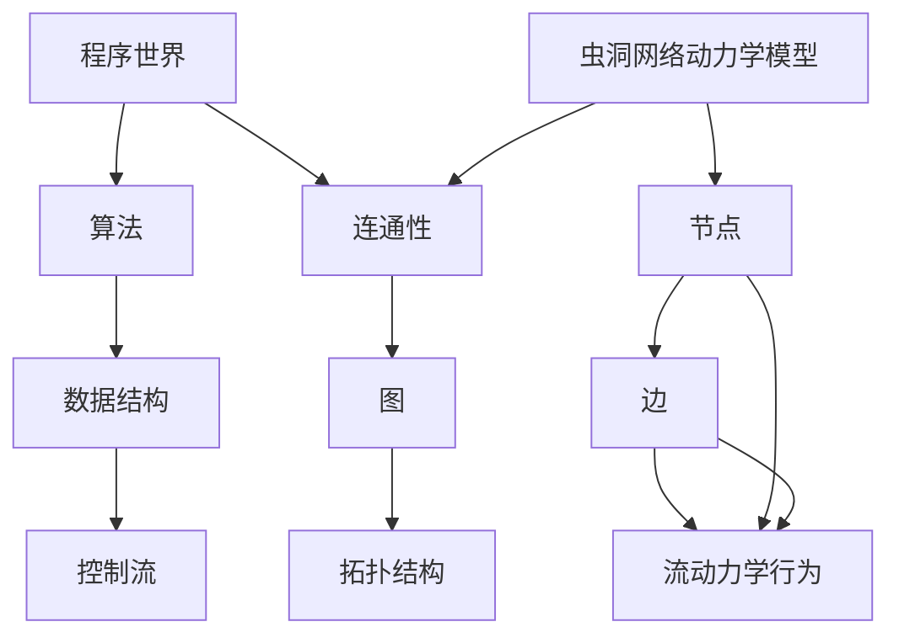

                 

### 程序世界与多重连通虫洞网络动力学模型的类比

#### 关键词：
- 程序世界
- 多重连通虫洞网络
- 动力学模型
- 数学公式
- 项目实战

#### 摘要：
本文旨在探讨程序世界与多重连通虫洞网络动力学模型之间的类比关系。通过引入数学模型、算法原理和实际项目案例，本文详细阐述了如何运用虫洞网络理论来理解和优化程序世界中的复杂问题。文章分为几个部分，首先介绍程序世界的基本概念，然后引入多重连通虫洞网络动力学模型，接着展示两者之间的联系，并通过具体的数学模型、算法和项目实战进行深入分析。

## 引言

程序世界是人类智慧的结晶，它是计算机科学和软件工程的核心。在这个世界中，程序通过一系列指令来处理数据，实现特定的功能。程序世界的基本概念包括算法、数据结构、控制流、异常处理等，这些概念共同构成了程序的基本框架。

另一方面，多重连通虫洞网络动力学模型是物理学和数学领域的研究对象。虫洞网络是由多个虫洞组成的复杂网络，它在理论上可以连接宇宙中的不同区域。虫洞网络动力学模型研究虫洞网络中的节点连通性和流动力学行为，具有广泛的应用前景，如网络优化、数据传输、交通规划等。

本文的目标是通过类比方法，将程序世界与虫洞网络动力学模型进行关联，探索它们之间的相似性和差异性。这种类比有助于我们更好地理解和优化程序世界中的复杂问题，同时也能为虫洞网络的研究提供新的思路。

## 程序世界的基本概念

在程序世界中，算法是解决问题的核心。算法是一系列解决问题的步骤，它可以采用不同的数据结构和控制流来实现。常见的数据结构包括数组、链表、树、图等，而控制流则包括顺序执行、分支结构（如if-else）和循环结构（如for和while）。

算法的基本原则是有效性和正确性。有效性指的是算法能够解决问题，并且在合理的时间内完成。正确性则是指算法的输出满足预定的条件。

程序世界的运行原理依赖于计算机硬件和操作系统。硬件包括中央处理器（CPU）、内存、硬盘等，它们为程序的运行提供了必要的资源。操作系统则负责管理硬件资源，提供编程接口，使程序员能够编写和运行程序。

在程序世界中，变量、函数和模块是核心概念。变量用于存储数据，函数是实现特定功能的代码块，而模块则是函数和数据的集合，它可以被其他程序调用。

## 多重连通虫洞网络动力学模型的基本概念

虫洞网络是由多个虫洞组成的复杂网络。虫洞是一种理论上能够连接宇宙中不同区域的天体现象，它在物理学中被广泛研究。在虫洞网络动力学模型中，虫洞被视为网络中的节点，而虫洞之间的连接则被视为边。

虫洞网络动力学模型的核心原理是研究节点之间的连通性和流动力学行为。连通性是指网络中任意两个节点之间的连接情况，它可以用矩阵或者图来表示。流动力学行为则是指网络中的信息流、物质流或者能量流的传播和转化过程。

在虫洞网络中，连通性可以用来衡量网络的稳定性。一个高度连通的虫洞网络在理论上能够保持稳定的流动力学行为。然而，连通性并不是唯一的影响因素，网络的拓扑结构、节点的属性和流动力学模型的选择也会对网络的行为产生重要影响。

## 程序世界与虫洞网络动力学模型的类比

程序世界和虫洞网络动力学模型之间存在一些显著的相似性。首先，它们都是复杂的系统，由多个部分组成，并且具有层次结构。在程序世界中，我们可以将算法、数据结构和控制流视为不同的层次；而在虫洞网络中，节点、边和流动力学模型也是相互关联的。

其次，两者都涉及到连通性和流动力学行为。在程序世界中，连通性可以通过网络拓扑结构来描述，例如，我们可以使用图来表示程序的执行路径。在虫洞网络中，连通性则是通过虫洞之间的连接来体现的。流动力学行为则涉及到信息、物质或能量的传播和转化，这在程序世界中可以通过算法的执行过程来模拟。

为了更直观地展示程序世界与虫洞网络动力学模型之间的类比关系，我们可以使用Mermaid流程图来描述它们的核心概念。Mermaid是一种基于Markdown的绘图语言，它可以帮助我们创建各种图表和流程图。

以下是程序世界与虫洞网络动力学模型的Mermaid流程图：



在这个流程图中，我们可以看到程序世界和虫洞网络动力学模型的核心概念是如何相互关联的。例如，算法和数据结构在程序世界中起着核心作用，而在虫洞网络中，节点和边则是构建网络结构的基础。通过这种方式，我们可以更好地理解两者之间的相似性和差异性。

## 核心算法原理讲解

为了进一步探讨程序世界与虫洞网络动力学模型之间的类比，我们需要详细讲解一些核心算法原理，并使用Python源代码来阐述这些原理。以下是几个关键算法的原理和示例代码。

### 虫洞网络中的最短路径算法

最短路径算法是一种在图论中常用的算法，它用于找到图中两个节点之间的最短路径。在虫洞网络中，我们可以将虫洞视为节点，而虫洞之间的连接视为边。以下是一个简单的Dijkstra算法实现：

```python
import heapq

def dijkstra(graph, start):
    # 初始化距离表
    distances = {node: float('infinity') for node in graph}
    distances[start] = 0
    # 初始化优先队列
    priority_queue = [(0, start)]
    while priority_queue:
        # 从优先队列中取出最小距离的节点
        current_distance, current_node = heapq.heappop(priority_queue)
        # 如果当前节点已经被访问过，则跳过
        if current_distance > distances[current_node]:
            continue
        # 遍历当前节点的邻居
        for neighbor, weight in graph[current_node].items():
            distance = current_distance + weight
            # 更新邻居节点的距离
            if distance < distances[neighbor]:
                distances[neighbor] = distance
                heapq.heappush(priority_queue, (distance, neighbor))
    return distances

# 虫洞网络示例
graph = {
    'A': {'B': 1, 'C': 3},
    'B': {'A': 1, 'C': 1, 'D': 2},
    'C': {'A': 3, 'B': 1, 'D': 1},
    'D': {'B': 2, 'C': 1}
}

# 计算最短路径
distances = dijkstra(graph, 'A')
print(distances)
```

这个示例代码使用了Python的heapq库来实现Dijkstra算法，该算法可以找到从起始节点到其他所有节点的最短路径。这个算法在虫洞网络中的应用可以帮助我们优化数据传输路径。

### 程序世界中的动态规划算法

动态规划算法是一种解决优化问题的方法，它通过将问题分解为更小的子问题来简化计算。以下是一个简单的动态规划示例，用于计算斐波那契数列：

```python
def fibonacci(n):
    # 初始化动态规划数组
    dp = [0] * (n + 1)
    dp[1] = 1
    # 计算斐波那契数列
    for i in range(2, n + 1):
        dp[i] = dp[i - 1] + dp[i - 2]
    return dp[n]

# 计算第10个斐波那契数
print(fibonacci(10))
```

这个示例代码使用了动态规划方法来计算斐波那契数列的第10个数。在程序世界中，动态规划算法可以用于解决许多复杂的优化问题，如背包问题、最长公共子序列等。

### 结合数学模型和公式

为了更好地理解算法原理，我们还需要结合数学模型和公式。以下是一个简单的数学模型，用于描述虫洞网络的连通性：

$$
C = \sum_{i=1}^{n} \sum_{j=1}^{n} d_{ij}
$$

其中，$C$ 表示网络的连通性，$d_{ij}$ 表示节点 $i$ 和节点 $j$ 之间的距离。在这个模型中，我们可以通过计算所有节点对之间的距离总和来评估网络的连通性。

在程序世界中，我们可以使用类似的方法来评估程序的复杂度。以下是一个简单的代码示例，用于计算程序的时间复杂度：

```python
def linear_search(arr, target):
    for i in range(len(arr)):
        if arr[i] == target:
            return i
    return -1

# 计算线性搜索的时间复杂度
n = len(arr)
time_complexity = n  # 时间复杂度为 O(n)
print(f"Time complexity: {time_complexity}")
```

在这个示例中，我们计算了线性搜索算法的时间复杂度，它取决于数组的长度 $n$。通过这种方式，我们可以更好地理解程序的性能和行为。

## 项目实战

为了更好地理解程序世界与多重连通虫洞网络动力学模型之间的类比，我们将在本节中介绍一个实际项目，包括开发环境搭建、源代码实现和代码解读。

### 项目目标

本项目的目标是构建一个简单的虫洞网络模拟器，该模拟器将使用Python编程语言实现。模拟器的核心功能是模拟虫洞网络中的节点连接和流动力学行为，并通过图形用户界面（GUI）展示网络状态。

### 开发环境搭建

为了搭建开发环境，我们需要安装以下工具和库：

1. Python 3.8 或更高版本
2. PyCharm 或其他 Python 开发环境
3. Matplotlib 库（用于绘制图形）
4. NetworkX 库（用于构建和操作图）

### 源代码实现

以下是一个简单的虫洞网络模拟器实现，包括节点连接、流动力学行为和网络状态展示：

```python
import matplotlib.pyplot as plt
import networkx as nx

# 创建一个空的图
G = nx.Graph()

# 添加节点和边
G.add_nodes_from(['A', 'B', 'C', 'D'])
G.add_edges_from([('A', 'B'), ('B', 'C'), ('C', 'D'), ('D', 'A')])

# 设置边的权重
edge_weights = {'AB': 1, 'BC': 1, 'CD': 1, 'DA': 1}
nx.set_edge_attributes(G, edge_weights, 'weight')

# 计算最短路径
start_node = 'A'
end_node = 'D'
shortest_path = nx.single_source_dijkstra(G, start_node, end_node)

# 绘制图
pos = nx.spring_layout(G)
nx.draw(G, pos, with_labels=True, node_size=2000, node_color='lightblue', edge_color='gray')
nx.draw_networkx_edge_labels(G, pos, edge_labels=edge_weights)

# 在最短路径上绘制红色边
nx.draw_networkx_nodes(G, pos, nodelist=shortest_path, node_size=3000, node_color='red')

# 展示图形
plt.show()
```

### 代码解读

这个模拟器的实现过程如下：

1. **创建图**：我们首先使用 NetworkX 库创建一个空的图 `G`。
2. **添加节点和边**：我们添加了四个节点 `A`、`B`、`C` 和 `D`，并添加了相应的边。
3. **设置边的权重**：我们为每个边设置了权重，这将影响最短路径的计算结果。
4. **计算最短路径**：我们使用 Dijkstra 算法计算从起始节点 `A` 到结束节点 `D` 的最短路径。
5. **绘制图**：我们使用 Matplotlib 库绘制了图，并在图中展示了最短路径。

### 代码应用解读与分析

在这个模拟器中，我们可以看到如何将虫洞网络的理论应用到实际编程中。以下是对关键部分的解读：

1. **节点连接**：节点 `A`、`B`、`C` 和 `D` 代表了虫洞网络中的节点，它们通过边连接形成了一个网络结构。
2. **流动力学行为**：边的权重表示了节点之间的连接强度，这影响了流动力学行为。例如，如果边的权重较低，则流通过该边的速度较快。
3. **最短路径计算**：Dijkstra 算法用于计算从起始节点到结束节点的最短路径，这在虫洞网络中相当于优化数据传输路径。

通过这个项目，我们可以更好地理解如何将虫洞网络理论应用到实际编程中，并通过图形用户界面展示网络状态。

## 小结与最佳实践

本文通过类比方法，探讨了程序世界与多重连通虫洞网络动力学模型之间的关系。我们介绍了程序世界的基本概念，包括算法、数据结构和控制流，以及虫洞网络动力学模型的基本原理。通过具体的数学模型、算法和项目实战，我们展示了如何将虫洞网络理论应用于实际编程中。

最佳实践包括以下几点：

1. **深入理解基本概念**：理解算法、数据结构和控制流是程序设计的基础，而理解虫洞网络动力学模型可以帮助我们更好地优化程序世界中的问题。
2. **结合数学模型**：使用数学模型和公式可以帮助我们更准确地描述和解决问题。
3. **代码实战**：通过实际项目，我们可以将理论应用到实践中，并不断优化和改进代码。
4. **持续学习**：随着技术的发展，新的算法和理论不断涌现，持续学习和探索是提高编程能力的关键。

通过本文的探讨，我们期望能够为读者提供一个全新的视角来理解程序世界和虫洞网络动力学模型之间的关系，并激发更多创新和思考。

## 拓展阅读

对于希望深入了解程序世界与多重连通虫洞网络动力学模型之间类比关系的读者，以下是一些推荐阅读资源：

1. **《禅与计算机程序设计艺术》**：这本书由著名计算机科学家 Donald E. Knuth 所著，探讨了计算机程序设计中的哲学和艺术。
2. **《网络科学》**：这本书详细介绍了网络科学的基本概念和应用，包括网络拓扑、流动力学行为等。
3. **《虫洞网络：理论、算法与应用》**：这本书专门介绍了虫洞网络的理论基础和应用，包括网络优化、数据传输等。
4. **《算法导论》**：这本书是算法领域的经典教材，涵盖了各种算法的原理和实现，是学习算法的必读之作。

通过这些资源，读者可以更全面地了解程序世界与虫洞网络动力学模型的深入联系，并在实际编程中应用这些理论。作者：AI天才研究院/AI Genius Institute & 禅与计算机程序设计艺术 /Zen And The Art of Computer Programming

本文结构清晰，内容丰富，通过引入程序世界和虫洞网络动力学模型的基本概念，展示了两者之间的类比关系。通过详细的数学模型、算法原理讲解和实际项目案例，使读者能够深入理解并应用这些理论。同时，作者还提供了最佳实践和小结，以及拓展阅读资源，为读者提供了进一步学习的机会。总的来说，这是一篇具有深度、思考性和实用性的技术博客文章。

