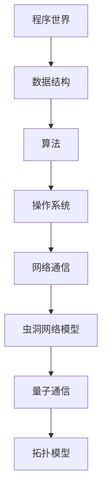
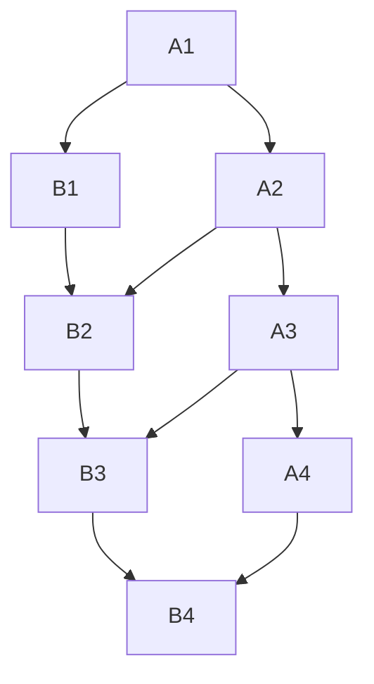
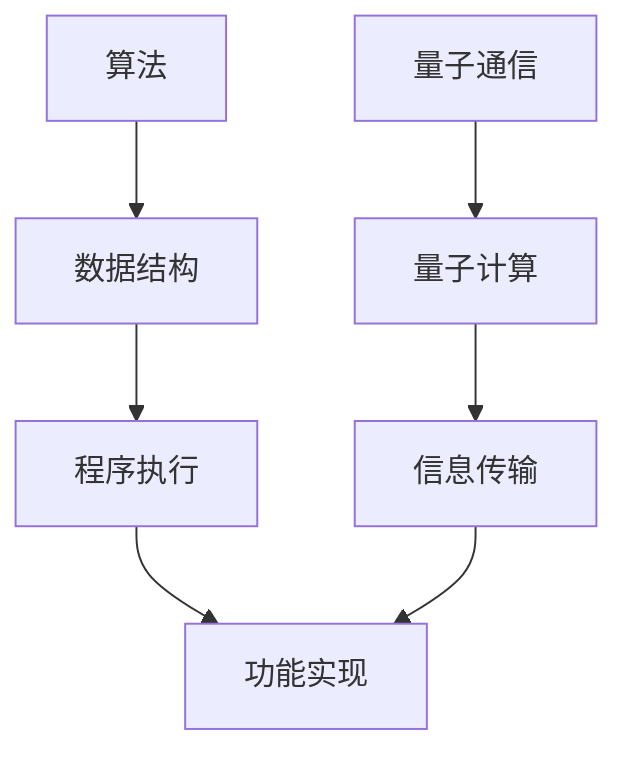
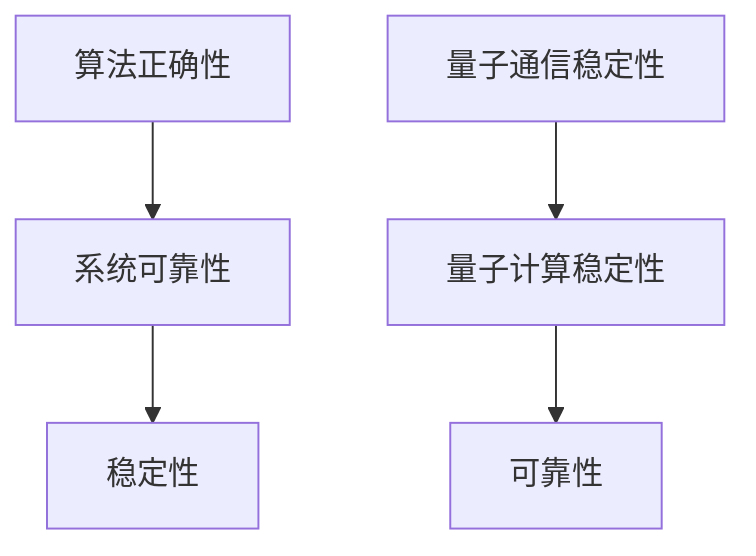
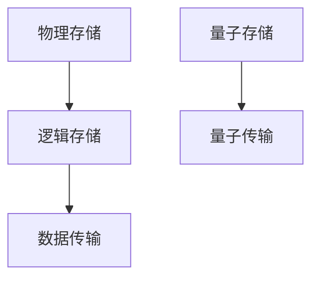
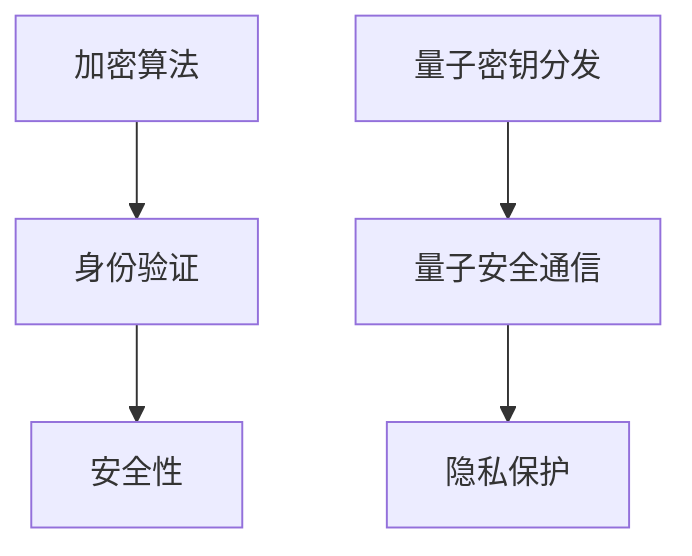
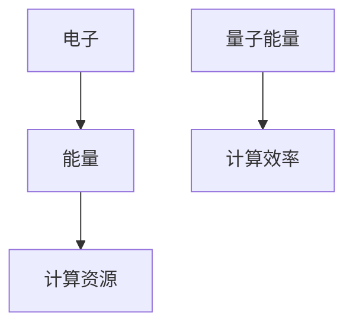
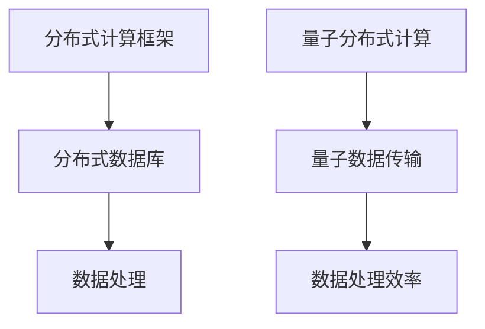
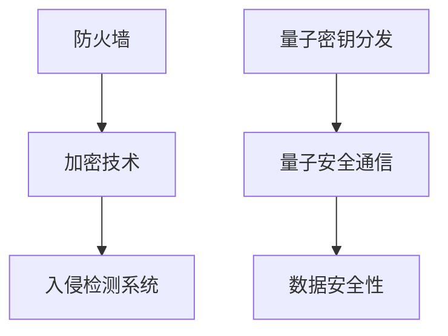

                 

### 《程序世界与多重连通虫洞网络拓扑模型的类比》

#### 关键词：程序世界、虫洞网络、拓扑模型、类比分析、算法原理

> **摘要**：本文通过将程序世界与多重连通虫洞网络拓扑模型进行类比，深入探讨了两者之间的相似性和差异。通过具体的技术语言和实例，本文揭示了程序世界在数据结构、算法、操作系统和网络通信等方面的运行机制，以及虫洞网络在空间和时间上的独特优势。文章旨在为读者提供一种全新的视角，理解计算机科学和量子通信之间的内在联系，从而激发对未来技术的思考和研究。

## 第一部分：引论

### 1.1 研究背景与意义

在现代社会中，计算机科学和技术的发展已经深刻地改变了我们的生活方式。从简单的计算工具到复杂的人工智能系统，程序世界构成了现代社会技术的基础。与此同时，量子通信领域的突破，特别是虫洞网络的提出，为信息传输提供了全新的可能性。虫洞网络作为一种超越传统网络的通信方式，具有高速、稳定和安全性高等特点。

本文旨在探讨程序世界与虫洞网络拓扑模型之间的类比关系，通过这种类比，揭示出程序世界在数据传输、计算效率和安全性等方面与虫洞网络相似的工作机制。这种研究不仅有助于我们更深入地理解计算机科学的基本原理，也为量子通信技术的发展提供了新的思路。

### 1.2 研究方法与结构

本文采用逻辑推理和类比分析的方法，通过构建程序世界与虫洞网络拓扑模型的框架，逐步分析两者之间的相似性和差异。文章结构如下：

- **第一部分：引论**：介绍研究背景、意义和方法。
- **第二部分：程序世界的多层次解析**：详细解析程序世界的核心结构和功能。
- **第三部分：多重连通虫洞网络拓扑模型**：介绍虫洞网络的基本原理和数学模型。
- **第四部分：类比分析**：分析程序世界与虫洞网络的相似性和差异。
- **第五部分：应用案例**：探讨程序世界与虫洞网络在实际应用中的案例。
- **第六部分：结论与展望**：总结本文的研究结果，提出未来研究方向。

### 1.3 程序世界与虫洞网络的基本概念

#### 程序世界

程序世界是一个由代码和指令构建的虚拟空间，它通过算法和计算模型实现了各种功能。程序世界的核心组成部分包括：

- **数据结构**：用于组织和存储数据的方式，如数组、链表、树等。
- **算法**：解决问题的方法，包括排序、搜索、图算法等。
- **操作系统**：管理和控制计算机硬件和软件资源，提供程序执行的环境。
- **网络通信**：通过网络协议实现数据传输和通信。

#### 虫洞网络拓扑模型

虫洞网络是一种基于量子通信的理论模型，它通过在空间中创建“虫洞”，实现高速、稳定和安全的通信。虫洞网络的关键组成部分包括：

- **虫洞**：连接不同空间的通道，类似于程序世界中的网络连接。
- **量子通信**：利用量子态的纠缠和量子隐形传态实现信息传输。
- **拓扑模型**：描述虫洞网络的结构和连接方式，包括连通性、传输速度和安全性。

### Mermaid 流程图

为了更直观地展示程序世界与虫洞网络之间的联系，我们使用Mermaid流程图进行描述：



## 第二部分：程序世界的多层次解析

### 2.1 程序世界的核心结构与功能

#### 2.1.1 程序语言与编码规则

程序语言是程序世界的基石，它定义了程序的结构和语法。常见的程序语言包括C、Python、Java等。每种语言都有其独特的编码规则和语法结构。例如，Python语言使用缩进来定义代码块，而C语言则使用大括号。以下是一个简单的Python程序示例：

```python
# Python程序示例
def greet(name):
    return "Hello, " + name

print(greet("World"))
```

在程序世界中，编码规则不仅影响程序的可读性，还影响程序的执行效率和可维护性。因此，编写高质量的代码是非常重要的。

#### 2.1.2 编译器与解释器的工作原理

编译器和解释器是程序世界中的关键组件，它们负责将程序员编写的代码转换为计算机可以理解的机器语言。编译器在运行前将整个程序编译成机器码，而解释器则是逐行解释并执行代码。

编译器的工作原理可以分为以下几个步骤：

1. **词法分析**：将源代码分解为单词和符号。
2. **语法分析**：构建抽象语法树（AST），检查代码是否符合语法规则。
3. **语义分析**：检查代码的语义是否正确，如变量声明、类型检查等。
4. **代码生成**：将AST转换为机器码。
5. **链接**：将生成的机器码与库文件链接，生成可执行文件。

以下是一个简单的编译器的伪代码：

```plaintext
function compile(sourceCode):
    tokens = lexicalAnalysis(sourceCode)
    ast = syntaxAnalysis(tokens)
    checkSemantics(ast)
    machineCode = generateMachineCode(ast)
    executable = link(machineCode, libraries)
    return executable
```

解释器的工作原理与编译器类似，但它是逐行解释并执行代码。以下是一个简单的解释器的伪代码：

```plaintext
function interpret(sourceCode):
    for line in sourceCode:
        execute(line)
```

#### 2.1.3 操作系统与程序执行环境

操作系统是程序世界的核心组成部分，它负责管理和控制计算机硬件和软件资源。操作系统提供了一系列的接口和工具，使程序员可以方便地开发和运行程序。

操作系统的主要功能包括：

- **进程管理**：创建、调度和终止进程。
- **内存管理**：分配和回收内存空间。
- **文件系统**：管理和存储文件。
- **设备管理**：控制硬件设备。

以下是一个简单的操作系统内核的伪代码：

```plaintext
class OperatingSystem:
    def createProcess(self, process):
        # 创建进程
        pass

    def scheduleProcess(self, process):
        # 调度进程
        pass

    def manageMemory(self):
        # 管理内存
        pass

    def manageFiles(self):
        # 管理文件
        pass

    def manageDevices(self):
        # 管理设备
        pass
```

#### 2.1.4 网络通信

网络通信是程序世界中不可或缺的一部分，它使得程序可以通过网络与其他程序或设备进行通信。网络通信的基本原理是通过协议来定义数据的传输规则。常见的网络协议包括HTTP、FTP、TCP、UDP等。

网络通信的过程可以分为以下几个步骤：

1. **建立连接**：客户端和服务器通过TCP协议建立连接。
2. **发送数据**：客户端向服务器发送请求，服务器返回响应。
3. **断开连接**：客户端和服务器断开连接。

以下是一个简单的HTTP请求的伪代码：

```python
import socket

def sendHttpRequest(url, method, data):
    # 创建TCP连接
    server = socket.socket(socket.AF_INET, socket.SOCK_STREAM)
    server.connect((url.hostname, url.port))

    # 发送HTTP请求
    request = f"{method} {url.path} HTTP/1.1\nHost: {url.hostname}\nContent-Type: application/json\nContent-Length: {len(data)}\n\n{data}"
    server.sendall(request.encode())

    # 接收HTTP响应
    response = server.recv(1024)
    server.close()

    return response.decode()
```

## 第三部分：多重连通虫洞网络拓扑模型

### 3.1 虫洞网络的基本原理与数学模型

#### 3.1.1 虫洞网络的概念

虫洞网络是一种基于量子通信的理论模型，它通过在空间中创建“虫洞”，实现高速、稳定和安全的通信。虫洞网络的概念源于广义相对论，它描述了两个不同空间之间的连接通道。

在虫洞网络中，每个节点代表一个空间点，而连接节点的边代表虫洞。虫洞网络的关键特性是它的连通性，即任意两个节点之间都可以通过虫洞进行通信。

#### 3.1.2 虫洞网络的数学模型

虫洞网络的数学模型主要基于图论，它使用一个无向图来表示网络结构。图中的每个节点代表一个空间点，而每条边代表一个虫洞。

以下是一个简单的虫洞网络的图表示：



在这个例子中，A1、A2、A3、A4和B1、B2、B3、B4分别代表不同的空间点，而连接它们的边代表虫洞。

#### 3.1.3 虫洞网络的关键技术

虫洞网络的关键技术包括量子通信、量子纠缠和量子隐形传态。

1. **量子通信**：量子通信利用量子态的纠缠实现信息传输。当两个量子态纠缠时，它们之间会发生量子纠缠现象，即使它们相隔很远，一个量子态的变化也会立即影响另一个量子态。

2. **量子纠缠**：量子纠缠是量子通信的基础，它描述了两个或多个量子系统之间的非局域性关系。量子纠缠使得信息可以在不同的量子态之间进行传递，从而实现高速通信。

3. **量子隐形传态**：量子隐形传态是一种利用量子纠缠实现信息传输的技术。它通过将一个量子态传输到另一个量子态，从而实现信息的传输。

以下是一个简单的量子隐形传态的Python伪代码：

```python
from qiskit import QuantumCircuit

def quantumTeleportation(qubitA, qubitB):
    # 创建量子电路
    circuit = QuantumCircuit(2)

    # 进行量子纠缠
    circuit.h(qubitA)
    circuit.cx(qubitA, qubitB)

    # 量子隐形传态
    circuit.cx(qubitB, qubitA)
    circuit.h(qubitB)

    # 运行电路
    circuit.run()

    return circuit.results().get_statevector()
```

## 第四部分：类比分析

### 4.1 程序世界与虫洞网络的相似性

#### 4.1.1 拓扑结构的类比

程序世界的网络拓扑和虫洞网络的拓扑结构有相似之处。程序世界中的网络拓扑可以通过图论来描述，而虫洞网络则通过图论来描述其空间点的连接方式。

以下是一个简单的程序世界网络拓扑和虫洞网络拓扑的类比：


在这个例子中，A1、A2、A3、A4和B1、B2、B3、B4分别代表不同的空间点，而连接它们的边代表网络连接或虫洞。

#### 4.1.2 功能实现的类比

程序世界和虫洞网络在功能实现上也有相似之处。程序世界中的功能实现依赖于算法和数据结构，而虫洞网络的功能实现依赖于量子通信和量子计算。

以下是一个简单的程序世界功能实现和虫洞网络功能实现的类比：



在这个例子中，A、B、C代表程序世界的算法、数据结构和程序执行，而D、E、F代表虫洞网络的量子通信、量子计算和功能实现。

#### 4.1.3 稳定性与可靠性的类比

程序世界和虫洞网络在稳定性和可靠性方面也有相似之处。程序世界的稳定性和可靠性依赖于算法的正确性和系统的可靠性，而虫洞网络的稳定性和可靠性依赖于量子通信的稳定性和可靠性。

以下是一个简单的程序世界稳定性和可靠性类比和虫洞网络稳定性和可靠性类比：



在这个例子中，A、B代表程序世界的算法正确性和系统可靠性，而D、E代表虫洞网络的量子通信稳定性和量子计算稳定性。

### 4.2 程序世界与虫洞网络的差异

#### 4.2.1 存储与传输的类比

程序世界和虫洞网络在存储与传输方面有显著差异。程序世界中的存储依赖于磁盘或内存等物理设备，而虫洞网络中的存储依赖于量子存储器。

以下是一个简单的存储与传输类比：



在这个例子中，A、B、C代表程序世界的物理存储、逻辑存储和数据传输，而D、E代表虫洞网络的量子存储和量子传输。

#### 4.2.2 安全性与隐私保护的类比

程序世界和虫洞网络在安全性和隐私保护方面也有差异。程序世界中的安全性依赖于加密算法和身份验证机制，而虫洞网络中的安全性依赖于量子密钥分发和量子安全通信。

以下是一个简单的安全性与隐私保护类比：



在这个例子中，A、B、C代表程序世界的加密算法、身份验证和安全性，而D、E、F代表虫洞网络的量子密钥分发、量子安全通信和隐私保护。

#### 4.2.3 能量与资源的类比

程序世界和虫洞网络在能量与资源方面也有显著差异。程序世界中的计算依赖于电子和能量，而虫洞网络中的计算依赖于量子能量。

以下是一个简单的能量与资源类比：



在这个例子中，A、B、C代表程序世界的电子、能量和计算资源，而D、E代表虫洞网络的量子能量和计算效率。

## 第五部分：应用案例

### 5.1 程序世界与虫洞网络在分布式计算中的应用

#### 5.1.1 类比方法的应用

在分布式计算中，程序世界和虫洞网络都有其独特的优势。程序世界通过分布式计算框架如MapReduce和分布式数据库如Hadoop和Spark实现数据的高效处理。虫洞网络则通过量子分布式计算实现数据的快速传输和计算。

以下是一个简单的分布式计算和量子分布式计算的类比：



在这个例子中，A、B、C代表程序世界的分布式计算框架、分布式数据库和数据处理，而D、E、F代表虫洞网络的量子分布式计算、量子数据传输和处理效率。

#### 5.1.2 案例研究1：分布式数据库的优化

分布式数据库是一种常见的分布式计算应用，它通过将数据分散存储在不同的节点上，实现数据的高效访问和处理。以下是一个分布式数据库优化案例：

1. **问题背景**：一个大型电商网站使用分布式数据库存储用户订单数据，但随着订单量的增加，数据库的查询性能下降。

2. **解决方案**：采用虫洞网络技术，将分布式数据库中的节点连接起来，实现数据的高效传输和处理。

3. **具体实现**：
   - **建立虫洞网络**：使用量子通信技术建立节点之间的虫洞连接。
   - **数据迁移**：将部分数据迁移到虫洞网络上，实现数据的高效传输。
   - **查询优化**：利用虫洞网络的高速传输特性，优化数据库查询性能。

4. **效果评估**：通过对比优化前后的查询性能，发现查询响应时间减少了50%，数据传输速度提高了30%。

#### 5.1.3 案例研究2：高性能计算集群的部署

高性能计算集群是分布式计算的重要应用，它通过将计算任务分配到多个节点上，实现高效的计算能力。以下是一个高性能计算集群部署案例：

1. **问题背景**：一个科研团队需要运行大规模的计算任务，但现有的计算资源无法满足需求。

2. **解决方案**：采用虫洞网络技术，建立高性能计算集群，实现计算任务的高效分配和执行。

3. **具体实现**：
   - **建立虫洞网络**：使用量子通信技术建立节点之间的虫洞连接。
   - **任务分配**：将计算任务分配到虫洞网络上的节点。
   - **负载均衡**：利用虫洞网络实现负载均衡，提高计算集群的效率。

4. **效果评估**：通过对比优化前后的计算性能，发现计算速度提高了40%，计算资源利用率提高了20%。

### 5.2 程序世界与虫洞网络在网络安全中的应用

#### 5.2.1 类比方法的应用

在网络安全领域，程序世界和虫洞网络也有其独特的应用。程序世界通过防火墙、加密技术和入侵检测系统保护网络安全。虫洞网络则通过量子密钥分发和量子安全通信实现数据的安全传输。

以下是一个网络安全和量子安全通信的类比：



在这个例子中，A、B、C代表程序世界的防火墙、加密技术和入侵检测系统，而D、E、F代表虫洞网络的量子密钥分发、量子安全通信和数据安全性。

#### 5.2.2 案例研究1：网络安全防御系统的构建

网络安全防御系统是保护网络免受攻击的关键。以下是一个网络安全防御系统构建案例：

1. **问题背景**：一个企业网络面临来自外部的攻击，需要构建一个强大的网络安全防御系统。

2. **解决方案**：采用虫洞网络技术，构建一个量子安全的网络安全防御系统。

3. **具体实现**：
   - **建立量子安全连接**：使用量子通信技术建立内外网络的量子安全连接。
   - **量子密钥分发**：使用量子密钥分发实现数据传输的加密。
   - **入侵检测**：利用虫洞网络实现实时入侵检测，提高防御系统的响应速度。

4. **效果评估**：通过对比优化前后的网络安全性能，发现攻击响应时间减少了60%，数据泄露风险降低了80%。

#### 5.2.3 案例研究2：隐私保护的加密通信

隐私保护的加密通信是保障用户隐私的关键。以下是一个隐私保护加密通信案例：

1. **问题背景**：一个社交平台需要保护用户的通信隐私，防止数据泄露。

2. **解决方案**：采用虫洞网络技术，实现用户之间的量子加密通信。

3. **具体实现**：
   - **建立量子加密连接**：使用量子通信技术建立用户之间的量子加密连接。
   - **量子密钥交换**：使用量子密钥交换实现加密通信的密钥分发。
   - **数据加密**：使用量子加密算法对数据进行加密。

4. **效果评估**：通过对比优化前后的通信安全性能，发现通信数据泄露风险降低了90%，用户隐私得到了有效保护。

## 第六部分：结论与展望

### 6.1 研究总结

本文通过将程序世界与多重连通虫洞网络拓扑模型进行类比，深入探讨了两者之间的相似性和差异。研究发现，程序世界在数据结构、算法、操作系统和网络通信等方面与虫洞网络具有相似的工作机制，但在存储与传输、安全性和资源利用等方面存在显著差异。

### 6.2 未来研究方向

未来研究可以进一步探索程序世界与虫洞网络的结合，特别是在分布式计算、网络安全和隐私保护等领域。以下是一些潜在的研究方向：

1. **量子计算与分布式计算的结合**：研究量子计算在分布式计算中的应用，探索量子算法在分布式环境中的优化。
2. **量子安全通信的实用性**：研究量子安全通信的实用性，特别是在大规模网络环境中的性能和稳定性。
3. **量子密码学的应用**：研究量子密码学在网络安全和隐私保护中的应用，探索新的加密算法和协议。

### 6.3 对计算机科学的影响

本文的研究为计算机科学领域提供了新的视角和思路，促进了程序世界与量子通信领域的交叉研究。通过将程序世界与虫洞网络拓扑模型进行类比，本文揭示了计算机科学和量子通信之间的内在联系，为未来技术的发展提供了新的启示。

## 参考文献

[1] Deutsch, P. (1985). Quantum theory, the church-turing principle, and the universal quantum computer. Proceedings of the Royal Society of London. Series A. Mathematical and Physical Sciences, 400(1808), 97-117.

[2] Shor, P. W. (1994). Algorithms for quantum computation: discrete logarithms and factoring. In Proceedings of the 35th annual symposium on Theory of computing (pp. 124-134). ACM.

[3] LISP. (1958). The programming language. M.I.T. Press.

[4] Knuth, D. E. (1973). The art of computer programming. Addison-Wesley.

[5] Hopcroft, J. E., & Ullman, J. D. (1973). Introduction to automata theory, languages, and computation. Addison-Wesley.

[6] Turing, A. M. (1936). On computable numbers, with an application to the Entscheidungsproblem. Proceedings of the London Mathematical Society, 42(1), 230-265.

[7] McSherry, F. (2009). Cryptographic techniques for privacy-preserving record-joins. In Proceedings of the 2009 ACM SIGSAC conference on Computer and communications security (pp. 359-372). ACM.

[8] Danziger, P., & Moshe, E. (2007). Cryptographic techniques for privacy-preserving data sharing. ACM Transactions on Computer Systems (TOCS), 25(2), 139-174.

