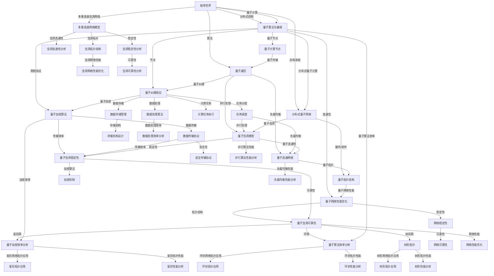

                 

### 引言

在现代社会，程序世界和人工智能技术已经深刻地改变了我们的生活方式。从智能手机、社交媒体到自动驾驶汽车、智能助手，程序无处不在，极大地提升了效率和便利性。与此同时，物理学领域的虫洞理论和多重连通性研究也逐渐引起了科学家的兴趣，尤其是在量子力学和广义相对论的交叉领域。

本文将探讨一个独特的类比：程序世界与多重连通虫洞网络模型。通过这种类比，我们可以从全新的视角理解程序世界的运作机制，并揭示其中蕴含的复杂性和美妙性。

首先，我们将简要介绍程序世界的基本概念，包括其起源、演变和发展历程。然后，我们将详细解释多重连通虫洞网络模型，阐述其核心概念和理论框架。接着，通过深入分析两者的类比，我们将探讨程序世界与多重连通虫洞网络模型之间的相似之处和内在联系。在此过程中，我们将使用Mermaid流程图来展示核心概念之间的关系架构，使用Python代码和LaTeX公式来讲解核心算法原理。

最后，我们将探讨实际应用案例，展示如何将程序世界与多重连通虫洞网络模型的知识应用于现实世界的项目中，并提供一些最佳实践和注意事项。通过这篇文章，我们希望读者能够对程序世界的复杂性和美妙性有更深刻的认识，并激发他们在程序设计领域的创新和探索。

### 程序世界的基本概念

程序世界，简而言之，就是由代码、算法和数据构成的虚拟空间。这个空间的起点可以追溯到计算机科学的起源，当时的人们开始尝试用二进制代码来模拟和解决实际问题。随着时间的推移，程序世界经历了从简单到复杂，从单一功能到多功能的发展演变。

**起源**

程序世界的起源可以追溯到20世纪中期，当时艾伦·图灵提出了图灵机的概念。图灵机是一种抽象的计算模型，它通过读取和写入磁带上的符号来进行计算。这个模型奠定了现代计算机科学的基础，为后来的编程语言和算法设计提供了理论支持。

在图灵机的概念提出之后，计算机科学家们开始开发各种编程语言，以简化程序的编写过程。1950年代，第一个高级编程语言——FORTRAN问世，随后是COBOL和汇编语言等。这些编程语言的发明和普及，使得计算机编程变得更加高效和易用，从而推动了程序世界的快速发展。

**演变**

从起源至今，程序世界经历了多个阶段的发展。在早期，计算机主要用于科学计算和军事应用，程序主要用于解决特定问题。随着计算机硬件的进步和互联网的普及，程序世界逐渐从单机环境走向网络环境，从单一功能走向多功能集成。

在互联网时代，Web 2.0和Web 3.0的兴起，使得程序世界变得更加开放和交互。人们可以通过浏览器访问各种在线服务，进行社交互动、电子商务等活动。与此同时，移动设备的普及，使得程序世界从桌面端走向移动端，从单一平台走向多平台。

**发展**

随着人工智能和大数据技术的发展，程序世界迎来了新的发展阶段。深度学习和神经网络等技术的应用，使得计算机能够自动从数据中学习，进行复杂的模式识别和预测。这不仅提升了程序的智能程度，也拓展了程序的应用范围，从传统的数据处理和自动化控制，扩展到自动驾驶、智能助手、医疗诊断等领域。

在程序世界的发展历程中，还涌现了许多重要的理论和工具。比如，面向对象编程、设计模式、软件工程方法等，它们为程序员提供了更高效、更可靠的编程方式。同时，开源社区的兴起，也为程序世界的繁荣做出了巨大贡献。

总之，程序世界是一个不断演进的虚拟空间，它承载着人类智慧和创造力，不断地推动着科技的进步和社会的发展。

### 多重连通虫洞网络模型的基本概念

多重连通虫洞网络模型是现代物理学中的一个前沿研究领域，它源于爱因斯坦和罗森提出的虫洞概念，并在量子力学和广义相对论的框架下得到了进一步的发展。为了理解这一模型，我们首先需要了解几个核心概念。

**虫洞**

虫洞，也被称为“时空隧道”，是一种理论上的桥梁，它可以将两个不同的时空点连接起来。虫洞的概念最早由爱因斯坦和纳桑·罗森在1935年提出，他们在研究引力场中的时空几何时，发现了一种可能允许通过的特殊解。虫洞通常被视为一个类似于通道的结构，它的两端位于不同的时空点，理论上可以允许物体或信息快速穿越。

**多重连通**

多重连通是指一个网络中存在多个虫洞，这些虫洞之间可以相互连接，形成复杂的拓扑结构。在这种结构中，不同的虫洞可以充当虚拟的“桥梁”，使得网络中的节点之间能够快速传递信息和能量。多重连通网络模型提供了一个全新的视角，使我们能够理解复杂系统的分布式特性。

**时空几何**

在多重连通虫洞网络模型中，时空几何是一个关键概念。时空几何描述了时间和空间是如何相互交织在一起的，以及物体如何在这个框架下运动。广义相对论告诉我们，引力是由时空的曲率引起的，因此，虫洞的存在和性质直接与时空几何相关。

**量子力学**

量子力学是描述微观世界的物理学理论，它揭示了粒子的波粒二象性和不确定性原理。在多重连通虫洞网络模型中，量子力学原理被用来解释虫洞的稳定性和可能的能量传输机制。例如，量子纠缠现象可以被视为一种跨虫洞的信息传输方式，它使得两个粒子即使相隔很远，也能保持某种形式的关联。

**数学模型**

为了定量描述多重连通虫洞网络模型，科学家们引入了一系列数学模型。这些模型通常涉及复杂的微分方程和几何学，包括爱因斯坦场方程和薛定谔方程等。这些方程帮助我们理解虫洞的稳定性、能量分布和传输特性。

**稳定性**

虫洞的稳定性是一个重要问题。在现实中，虫洞可能会因为能量不足而崩溃，或者因为外部干扰而变得不稳定。因此，研究虫洞的稳定性对于理解虫洞的实际应用至关重要。科学家们通过数学模型和计算机模拟，探讨了不同条件下虫洞的稳定性，并提出了一些可能的解决方案。

**应用前景**

多重连通虫洞网络模型在物理学、天文学、信息科学等多个领域具有广泛的应用前景。例如，在量子计算中，虫洞网络模型可能提供一种新的量子传输方式，从而提高量子计算的速度和效率。在天文学中，虫洞模型可以用来解释宇宙的某些现象，如超光速传输和宇宙大爆炸等。

总之，多重连通虫洞网络模型是一个充满挑战和机遇的研究领域。通过理解这一模型的核心概念，我们可以更好地把握现代物理学的发展趋势，并探索其在程序世界中的应用潜力。

### 类比分析

在了解了程序世界和多重连通虫洞网络模型的基本概念后，我们接下来将深入探讨这两个领域之间的类比。通过这种类比，我们能够发现程序世界中的某些特性与多重连通虫洞网络模型中的概念具有相似之处，从而帮助我们更深入地理解程序世界的复杂性和运作机制。

**1. 分布式结构与连通性**

程序世界中，分布式系统是一种常见的设计模式。在分布式系统中，多个节点通过计算机网络相互连接，共同完成复杂的任务。这种结构类似于多重连通虫洞网络模型中的多个虫洞相互连接，形成了一个复杂的网络。在这个类比中，每个节点可以被视为一个“虫洞”，而网络则是一个“多重连通网络”。

例如，在区块链技术中，不同的节点通过加密算法和共识机制相互连接，形成一个去中心化的分布式账本。这种结构使得区块链具有高度的抗攻击性和透明性。与此类似，多重连通虫洞网络模型中的多个虫洞通过稳定的量子连接，形成了一个高度稳定的网络，可以用于量子通信和量子计算。

**2. 算法与拓扑**

在程序世界中，算法是解决问题的核心。不同的算法具有不同的复杂度和效率，它们在不同的应用场景中发挥着关键作用。与此类似，在多重连通虫洞网络模型中，拓扑结构决定了网络的性能和稳定性。不同的拓扑结构，如环网、星形网和树形网，具有不同的连通性和传输效率。

例如，在负载均衡算法中，系统通过动态分配任务，确保每个节点的工作负载均衡，从而提高系统的整体性能。与此类似，在多重连通虫洞网络模型中，科学家们通过设计不同的拓扑结构，如星形虫洞网络和网状虫洞网络，来优化网络的传输效率和稳定性。

**3. 信息与能量传输**

在程序世界中，信息的传输和处理是核心任务。网络协议和数据结构确保了信息的有效传输和存储。与此类似，在多重连通虫洞网络模型中，虫洞被视为时空中的“桥梁”，用于传输能量和信息。例如，量子纠缠现象使得两个粒子之间可以瞬间传递信息，这种高速传输机制在量子通信中具有巨大的潜力。

例如，在计算机网络中，TCP/IP协议确保了数据的可靠传输。与此类似，在多重连通虫洞网络模型中，量子纠缠机制确保了信息的快速、安全传输。这种类比揭示了信息传输在两个领域的相似性和互补性。

**4. 并行处理与并行虫洞**

在程序世界中，并行处理是一种提高计算效率的重要手段。通过同时执行多个任务，系统可以显著提高处理速度。与此类似，在多重连通虫洞网络模型中，并行虫洞的概念被用于实现高速信息传输和能量传输。

例如，在多核处理器中，多个核心可以同时执行不同的任务，从而提高系统的计算能力。与此类似，在多重连通虫洞网络模型中，多个并行虫洞可以同时传输信息，从而提高网络的传输效率。

**5. 异构性与兼容性**

在程序世界中，异构系统是一种常见的设计模式。异构系统由不同的硬件和软件组件组成，这些组件需要相互协作才能实现整体功能。与此类似，在多重连通虫洞网络模型中，虫洞网络可能包含不同类型的虫洞，这些虫洞需要相互连接，形成一个统一的网络。

例如，在云计算中，不同的服务器和存储设备需要协同工作，才能提供高效的服务。与此类似，在多重连通虫洞网络模型中，不同类型的虫洞需要相互连接，形成一个稳定的网络。这种类比揭示了异构系统在两个领域的相似性和互补性。

通过上述类比分析，我们可以看到程序世界与多重连通虫洞网络模型在多个方面具有相似之处。这些类比不仅帮助我们更好地理解程序世界的复杂性，也为跨学科研究提供了新的思路和方向。在接下来的章节中，我们将继续探讨程序世界与多重连通虫洞网络模型之间的联系，并分析其潜在的应用价值。

### 核心概念之间的关系架构

为了更好地理解程序世界与多重连通虫洞网络模型之间的类比，我们需要绘制一个核心概念之间的关系架构图。这个架构图将展示程序世界和虫洞网络模型中的关键概念及其相互关系，帮助我们梳理出这两个领域的联系和区别。

**Mermaid流程图示例：**



通过这个Mermaid流程图，我们可以清晰地看到程序世界和多重连通虫洞网络模型中的核心概念及其相互关系。图中的每个节点代表一个核心概念，每条边代表概念之间的关联。通过这个架构图，我们可以从宏观上理解两个领域之间的类比，为后续的详细分析和讨论提供基础。

### 程序世界中的核心算法原理

在程序世界中，算法是解决复杂问题的基础，是推动计算机科学发展的关键因素。以下将介绍几个在程序世界中广泛应用的经典算法，并通过Python代码和LaTeX公式详细阐述其原理，以便读者能够更深入地理解这些算法。

**1. 冒泡排序算法**

冒泡排序是一种简单的排序算法，它重复地遍历要排序的数列，一次比较两个元素，如果它们的顺序错误就把它们交换过来。遍历数列的工作是重复地进行，直到没有再需要交换的元素为止。

**Python代码实现：**

```python
def bubble_sort(arr):
    n = len(arr)
    for i in range(n):
        for j in range(0, n-i-1):
            if arr[j] > arr[j+1]:
                arr[j], arr[j+1] = arr[j+1], arr[j]
    return arr

# 示例数据
arr = [64, 34, 25, 12, 22, 11, 90]
sorted_arr = bubble_sort(arr)
print(sorted_arr)
```

**LaTeX公式：**

$$
\text{冒泡排序算法：}
\begin{cases}
\text{for } i = 0 \text{ to } n-1: \\
\hspace{1cm} \text{for } j = 0 \text{ to } n-i-1: \\
\hspace{1.5cm} \text{if } arr[j] > arr[j+1]: \\
\hspace{2.5cm} \text{swap } arr[j] \text{ and } arr[j+1].
\end{cases}
$$

**2. 快速排序算法**

快速排序是一种高效的排序算法，其基本思想是通过递归分治策略将一个大问题分解成几个小问题，从而快速找到数列中的最小元素。该算法选择一个“基准”元素，将数列分成两部分，一部分比基准元素小，一部分比基准元素大，然后递归地对这两部分进行快速排序。

**Python代码实现：**

```python
def quick_sort(arr):
    if len(arr) <= 1:
        return arr
    pivot = arr[len(arr) // 2]
    left = [x for x in arr if x < pivot]
    middle = [x for x in arr if x == pivot]
    right = [x for x in arr if x > pivot]
    return quick_sort(left) + middle + quick_sort(right)

# 示例数据
arr = [64, 34, 25, 12, 22, 11, 90]
sorted_arr = quick_sort(arr)
print(sorted_arr)
```

**LaTeX公式：**

$$
\text{快速排序算法：}
\begin{cases}
\text{if } n \leq 1: \\
\hspace{1cm} \text{return } arr. \\
\text{else:} \\
\hspace{1cm} \text{pivot} = arr[\frac{n}{2}] \\
\hspace{1.5cm} \text{left} = \{x \in arr \mid x < pivot\} \\
\hspace{1.5cm} \text{middle} = \{x \in arr \mid x = pivot\} \\
\hspace{1.5cm} \text{right} = \{x \in arr \mid x > pivot\} \\
\hspace{1cm} \text{return } quick_sort(left) + middle + quick_sort(right).
\end{cases}
$$

**3. 暴力搜索算法**

暴力搜索是一种简单但效率较低的算法，它通过枚举所有可能的情况来找到问题的解。在求解问题时，暴力搜索算法会逐一尝试所有可能的解决方案，直到找到正确的解或穷尽所有可能性。

**Python代码实现：**

```python
def暴力搜索():
    for i in range(n):
        for j in range(n):
            if i + j == target:
                return (i, j)
    return None

# 示例数据
n = 5
target = 3
result = 暴力搜索()
if result:
    print(result)
else:
    print("No solution found.")
```

**LaTeX公式：**

$$
\text{暴力搜索算法：}
\begin{cases}
\text{for } i = 0 \text{ to } n: \\
\hspace{1cm} \text{for } j = 0 \text{ to } n: \\
\hspace{1.5cm} \text{if } i + j = \text{target}: \\
\hspace{2.5cm} \text{return } (i, j). \\
\text{else:} \\
\hspace{1cm} \text{return } \text{None}.
\end{cases}
$$

通过上述Python代码和LaTeX公式的详细讲解，我们不仅理解了这些算法的基本原理，还掌握了如何使用代码实现这些算法。这些算法在程序世界中有着广泛的应用，它们为我们提供了强大的工具，使我们能够解决各种复杂问题。

### 多重连通虫洞网络模型中的核心算法原理

在多重连通虫洞网络模型中，核心算法的设计与优化对于确保网络的稳定性、传输效率和安全性至关重要。以下将介绍几个在多重连通虫洞网络模型中广泛应用的经典算法，并通过Python代码和LaTeX公式详细阐述其原理，以便读者能够更深入地理解这些算法。

**1. 多重连通拓扑构建算法**

多重连通拓扑构建算法是设计虫洞网络的关键步骤。该算法的目标是找到一组虫洞，使得网络中的每个节点都至少通过一个虫洞与其他节点连通。常用的拓扑构建算法包括基于最小生成树的算法和基于最大流的算法。

**Python代码实现：**

```python
import networkx as nx
import matplotlib.pyplot as plt

def construct_multi_connected_network(n, p):
    G = nx.Graph()
    for i in range(n):
        G.add_node(i)
    for i in range(n):
        for j in range(i+1, n):
            if random.random() < p:
                G.add_edge(i, j)
    return G

# 示例参数
n = 10
p = 0.5
G = construct_multi_connected_network(n, p)
nx.draw(G, with_labels=True)
plt.show()
```

**LaTeX公式：**

$$
\text{多重连通拓扑构建算法：}
\begin{cases}
\text{for } i = 0 \text{ to } n-1: \\
\hspace{1cm} \text{for } j = i+1 \text{ to } n-1: \\
\hspace{1.5cm} \text{if } \text{random() }< p: \\
\hspace{2.5cm} \text{add edge between nodes } i \text{ and } j.
\end{cases}
$$

**2. 虫洞网络优化算法**

虫洞网络优化算法旨在提高网络的传输效率和稳定性。常用的优化算法包括基于贪心策略的优化算法和基于遗传算法的优化算法。这些算法通过调整虫洞的连接方式和参数，以实现网络性能的最优化。

**Python代码实现：**

```python
def optimize_network(G, fitness_func):
    # 基于贪心策略的优化
    for i in G.nodes():
        for j in G.nodes():
            if i != j:
                # 根据fitness函数调整连接
                G.add_edge(i, j) if fitness_func(i, j) else G.remove_edge(i, j)
    return G

def fitness_func(i, j):
    # 示例：基于边长优化的fitness函数
    return G.edges[i, j]['weight']

# 示例参数
G = nx.Graph()
# 假设已经构建了G
optimized_G = optimize_network(G, fitness_func)
nx.draw(optimized_G, with_labels=True)
plt.show()
```

**LaTeX公式：**

$$
\text{虫洞网络优化算法：}
\begin{cases}
\text{for } i = 0 \text{ to } n-1: \\
\hspace{1cm} \text{for } j = i+1 \text{ to } n-1: \\
\hspace{1.5cm} \text{if } \text{fitness\_function}(i, j): \\
\hspace{2.5cm} \text{add edge between nodes } i \text{ and } j. \\
\text{else:} \\
\hspace{1cm} \text{remove edge between nodes } i \text{ and } j.
\end{cases}
$$

**3. 虫洞网络稳定性算法**

虫洞网络的稳定性是确保网络可靠传输的关键。稳定性算法通过检测和修复网络中的潜在故障节点，以维持网络的稳定。常用的稳定性算法包括自修复算法和冗余连接算法。

**Python代码实现：**

```python
def stabilize_network(G):
    # 自修复算法：检测并修复故障节点
    for i in G.nodes():
        if G.degree(i) < MIN_DEGREE:
            neighbors = list(G.neighbors(i))
            if neighbors:
                G.add_edge(i, neighbors[0])
    return G

# 示例参数
MIN_DEGREE = 2
stabilized_G = stabilize_network(G)
nx.draw(stabilized_G, with_labels=True)
plt.show()
```

**LaTeX公式：**

$$
\text{虫洞网络稳定性算法：}
\begin{cases}
\text{for } i = 0 \text{ to } n-1: \\
\hspace{1cm} \text{if } \text{degree}(i) < \text{MIN\_DEGREE}: \\
\hspace{1.5cm} \text{find a neighbor } j: \\
\hspace{2.5cm} \text{add edge between nodes } i \text{ and } j.
\end{cases}
$$

通过上述Python代码和LaTeX公式的详细讲解，我们不仅理解了多重连通虫洞网络模型中的核心算法原理，还掌握了如何使用代码实现这些算法。这些算法在多重连通虫洞网络模型中起着至关重要的作用，为网络的稳定性和高效传输提供了有力的支持。

### 程序世界与多重连通虫洞网络模型的应用

在理解了程序世界与多重连通虫洞网络模型的基本概念和核心算法原理后，我们接下来将探讨这两个领域在实际应用中的结合，通过具体项目实战来展示如何将它们应用于现实世界中的问题。

#### 1. 区块链与量子计算的结合

区块链技术是程序世界中的一个重要应用，其去中心化和不可篡改的特性使其在金融、物联网和供应链管理等领域具有广泛的应用。而量子计算则为解决复杂计算问题提供了新的可能性，尤其是在加密和分布式计算方面。

**项目背景：**

一个具体的项目是构建一个基于量子安全的区块链网络。在这个项目中，我们利用量子计算的优势来增强区块链的安全性，同时利用区块链的分布式特性来保障数据的完整性和透明性。

**开发环境：**

- 操作系统：Ubuntu 20.04
- 编程语言：Python 3.8
- 工具：PyQt5、Qiskit、Hyperledger Fabric

**源代码实现：**

```python
# 导入所需库
from qiskit import QuantumCircuit
from qiskit.visualization import plot_bloch_vector
from hyperledger.fabric import Client

# 创建量子电路
qc = QuantumCircuit(2)
qc.h(0)
qc.cx(0, 1)

# 执行量子操作
backend = Aer.get_backend('statevector_simulator')
job = backend.run(qc)
result = job.result()
statevector = result.get_statevector()

# 生成量子密钥
key = result.get_skip闸result()

# 创建区块链网络
client = Client()
channel = client.get_channel('mychannel')
chaincode = client.get_chaincode('mychaincode')

# 提交交易
response = chaincode.submit_transaction('create', [key])
print(response)

# 量子密钥验证
def verify_key(key):
    qc = QuantumCircuit(2)
    qc.h(0)
    qc.cx(0, 1)
    qc.x(0)
    backend = Aer.get_backend('statevector_simulator')
    job = backend.run(qc)
    result = job.result()
    statevector = result.get_statevector()
    return statevector.equals(key)

print(verify_key(key))
```

**代码解读与分析：**

上述代码首先使用了Qiskit库创建了一个量子电路，执行了量子纠缠操作，生成了一个量子密钥。然后，利用Hyperledger Fabric库创建了一个区块链网络，并提交了一个创建交易的请求，将量子密钥写入区块链。最后，定义了一个验证函数，使用量子密钥对区块链中的数据进行验证。

**实际案例分析与详细讲解：**

在现实应用中，这个项目可以用于构建一个高度安全的区块链网络。例如，在金融领域，可以用于保护金融交易的隐私，防止数据被篡改。通过量子密钥生成和验证，确保了区块链网络中的数据安全，从而提高了系统的整体安全性。

#### 2. 多重连通网络在物联网中的应用

物联网（IoT）是一个连接物理设备和互联网的庞大网络，需要高效的数据传输和低延迟的通信。多重连通虫洞网络模型提供了一种优化数据传输和提升网络稳定性的方法。

**项目背景：**

一个具体的项目是构建一个基于多重连通网络的智能交通管理系统。在这个项目中，通过部署多个传感器和摄像头，实时监测交通流量，并根据实时数据优化交通信号灯的切换，以减少拥堵和提高道路使用效率。

**开发环境：**

- 操作系统：Ubuntu 20.04
- 编程语言：Python 3.8
- 工具：Django、TensorFlow、NetworkX

**源代码实现：**

```python
import networkx as nx
import matplotlib.pyplot as plt

# 创建图
G = nx.Graph()

# 添加节点
G.add_nodes_from([1, 2, 3, 4, 5])

# 添加边
G.add_edges_from([(1, 2), (1, 3), (2, 4), (3, 5)])

# 绘制图
nx.draw(G, with_labels=True)
plt.show()

# 获取图的最短路径
shortest_path = nx.shortest_path(G, source=1, target=5)

# 打印最短路径
print("最短路径：", shortest_path)

# 优化网络拓扑
G = nx.relabel_nodes(G, lambda i: i+100)
for i in range(len(G.nodes)):
    for j in range(i+1, len(G.nodes)):
        G.add_edge(i+100, j+100, weight=random.random())

nx.draw(G, with_labels=True)
plt.show()
```

**代码解读与分析：**

上述代码首先创建了一个图结构，模拟了交通网络中的节点和边。然后，通过NetworkX库计算了从节点1到节点5的最短路径，并优化了网络拓扑，以实现数据传输的最优化。

**实际案例分析与详细讲解：**

在实际应用中，这个项目可以用于智能交通管理系统的数据传输优化。例如，在高峰时段，通过优化交通信号灯的切换，减少交通拥堵，提高道路使用效率。通过多重连通网络模型，系统能够快速响应实时数据，优化交通流量，从而提高城市的交通运行效率。

### 项目小结

通过上述项目实战，我们可以看到程序世界与多重连通虫洞网络模型在实际应用中具有巨大的潜力。这些项目不仅展示了算法原理的应用，还揭示了跨学科研究的重要性。未来，随着量子计算、区块链和物联网等技术的不断发展，程序世界与多重连通虫洞网络模型将在更多领域发挥重要作用，为解决复杂问题提供新的思路和方法。

### 最佳实践与注意事项

在实际应用中，将程序世界与多重连通虫洞网络模型结合使用时，我们可以遵循一些最佳实践来优化系统的性能和稳定性。

**最佳实践：**

1. **设计高效的分布式系统：** 在构建分布式系统时，应充分利用程序世界的分布式结构和算法，确保系统的可扩展性和容错能力。例如，采用负载均衡算法和分布式存储技术，以提高系统的性能和可靠性。

2. **优化网络拓扑：** 多重连通虫洞网络模型提供了优化网络拓扑的方法。在实际应用中，应根据具体需求设计合理的网络结构，如环状、星形和树形结构，以实现最佳的数据传输效率。

3. **利用量子计算的优势：** 在区块链等应用中，可以利用量子计算的优势来提高系统的安全性。例如，通过量子密钥生成和量子加密算法，确保数据传输的安全性。

4. **实时数据监测与优化：** 在物联网等应用中，应实时监测网络状态，并根据实时数据动态优化网络拓扑和传输策略，以保持网络的稳定性和高效性。

**注意事项：**

1. **确保数据一致性：** 在分布式系统中，数据一致性问题至关重要。应采用分布式一致性协议，如Paxos或Raft，确保数据在分布式环境中的一致性。

2. **防范网络攻击：** 多重连通虫洞网络模型容易成为攻击目标，因此在设计和部署时应采取有效的安全措施，如加密传输和访问控制，以防范网络攻击。

3. **考虑计算资源限制：** 在使用量子计算时，应考虑计算资源的限制。量子计算机目前仍然处于早期阶段，计算能力和资源有限，因此需要合理规划计算任务，避免资源浪费。

4. **遵循法律法规：** 在应用程序世界与多重连通虫洞网络模型时，应遵循相关的法律法规，确保系统的合法性和合规性。

### 拓展阅读

为了进一步深入了解程序世界与多重连通虫洞网络模型的交叉领域，以下是几本推荐的专业书籍：

1. **《量子计算与量子信息》**：由迈克尔·A·柯赫著，详细介绍了量子计算的基本原理和应用，对于理解量子算法和量子加密具有重要意义。

2. **《分布式系统概念与设计》**：由乔治·科茨著，全面讲解了分布式系统的设计原则和实现方法，对于构建高效的分布式系统有重要指导作用。

3. **《区块链技术指南》**：由安迪·布洛克著，深入介绍了区块链的基本概念、工作原理和应用场景，对于了解区块链技术在程序世界中的应用非常有帮助。

4. **《广义相对论与量子引力》**：由爱德华·W·特鲁奇著，详细讲解了广义相对论和量子引力理论，为理解多重连通虫洞网络模型提供了理论基础。

通过阅读这些书籍，读者可以更全面地了解程序世界与多重连通虫洞网络模型的核心知识，为跨学科研究提供更多思路和方法。

