                 

### <文章标题> 

> **关键词**：程序世界、平行宇宙、干涉模型、算法、量子计算机。

> **摘要**：本文通过类比方法，将程序世界与平行宇宙干涉模型进行深入探讨，旨在揭示两者之间的共性与差异。文章首先介绍了程序世界的构成与基本原理，接着阐述了平行宇宙干涉模型的概念及其在量子力学中的重要性。随后，通过构建Mermaid流程图，展示了程序世界与平行宇宙干涉模型的核心概念和算法原理之间的联系。本文最后结合Python源代码，详细讲解了核心算法原理，并通过实际项目实战，对干涉模型在程序世界中的应用进行了深入剖析。文章旨在为读者提供一个全新的视角，以理解计算机程序与平行宇宙干涉模型之间的奇妙关系。

---

## 第一部分：引言与概述

### 1.1 程序世界的构成

#### 1.1.1 程序世界的基石：算法

算法是程序世界的核心，它们为计算机解决各种问题提供了基本框架。算法的基本概念包括其定义、分类和特点。算法的分类可以基于多种标准，如时间复杂度、空间复杂度、算法类型（如排序算法、搜索算法等）。在程序世界中，算法的重要性不言而喻，因为它们是实现计算任务的关键。

以下是一个简单的Mermaid流程图，展示了算法的基本概念和分类：

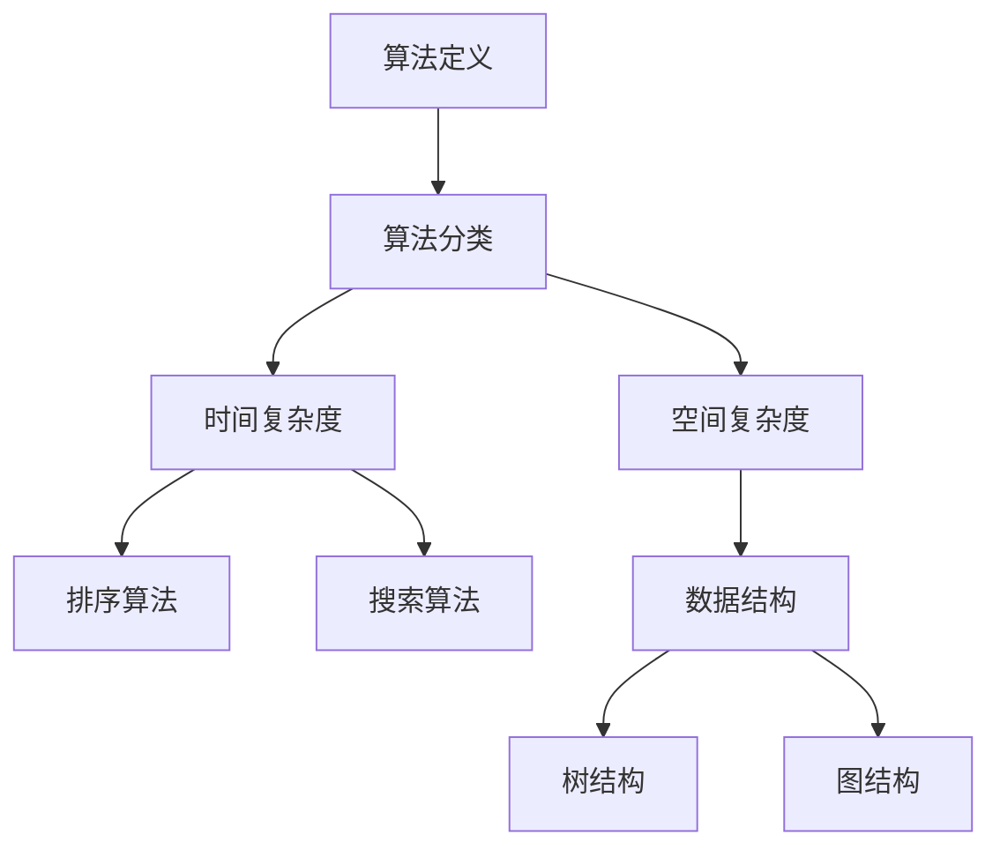

#### 1.1.2 编程语言与工具

编程语言是程序员与计算机之间的沟通桥梁，它们提供了表达算法和数据结构的语法和语义。编程语言的演进历史见证了计算机科学的进步，从早期的机器语言到现代的高级语言，如Python、Java和C++等。编程工具，如集成开发环境（IDE）、代码编辑器和版本控制系统，为程序员提供了高效的开发体验。

以下是一个Mermaid流程图，展示了编程语言和工具的演进：

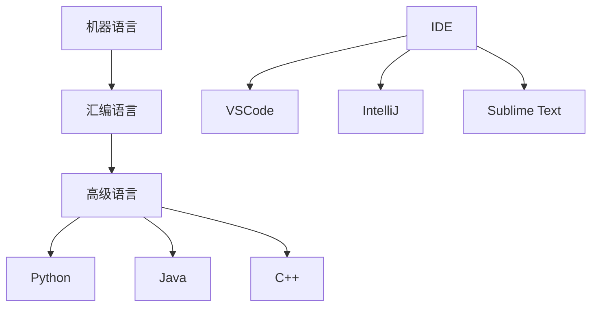

#### 1.1.3 计算机程序的基本原理

计算机程序的基本原理包括程序的执行过程、程序设计的基本原则和编程范式。程序执行过程涉及到编译、链接和执行等步骤。程序设计原则如模块化、可复用性和可维护性，是确保程序质量和效率的关键。编程范式，如命令式编程、面向对象编程和函数式编程，提供了不同的思维方式来解决问题。

以下是一个Mermaid流程图，展示了计算机程序的基本原理：

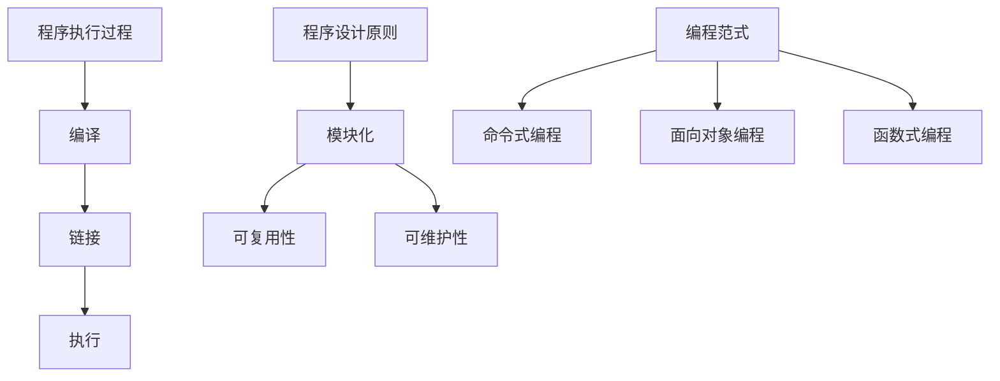

### 1.2 平行宇宙干涉模型的基本概念

#### 1.2.1 平行宇宙的概念

平行宇宙（Multiverse）是物理学中一个引人入胜的概念，它认为我们的宇宙只是众多可能宇宙中的一个。平行宇宙的理论基础包括量子力学和多世界解释等。在平行宇宙中，每一个决策或事件都会导致新的宇宙分支，形成了无数个平行宇宙。

以下是一个Mermaid流程图，展示了平行宇宙的概念：

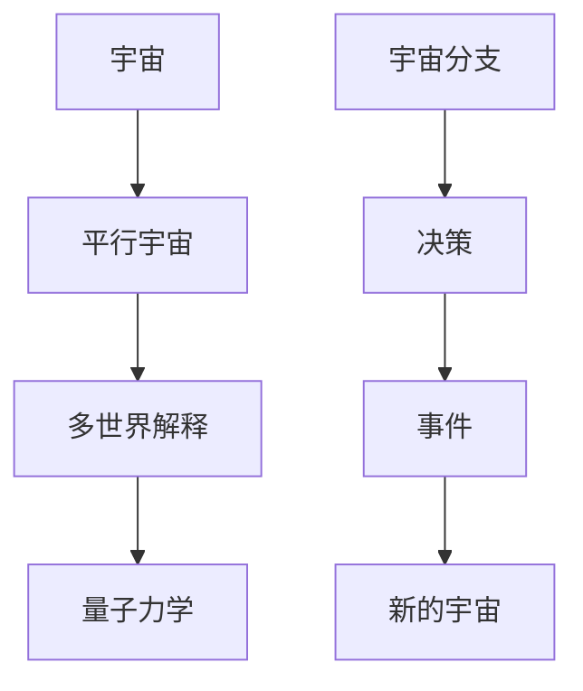

#### 1.2.2 干涉模型与量子力学

干涉模型是量子力学中的一个核心概念，它描述了波在空间中相互叠加的现象。量子力学的核心概念，如波函数、薛定谔方程和量子态叠加，为干涉模型提供了理论基础。干涉现象在量子世界中无处不在，从光的干涉到电子的双缝实验，都是干涉模型的应用实例。

以下是一个Mermaid流程图，展示了干涉模型与量子力学的联系：

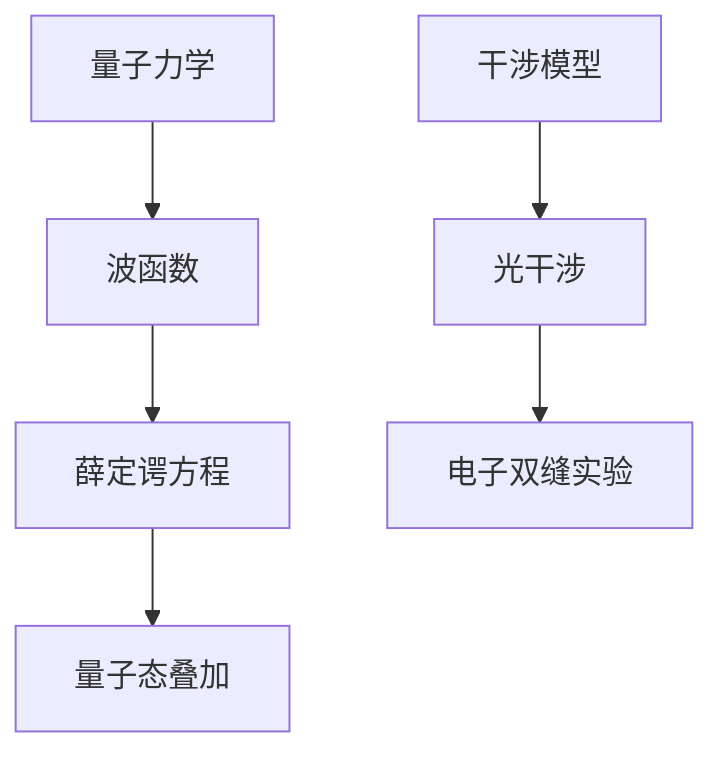

#### 1.2.3 平行宇宙干涉模型的研究意义

平行宇宙干涉模型的研究意义在于它为我们提供了一种全新的视角来理解宇宙的本质。通过将量子干涉现象与平行宇宙理论相结合，我们可能会找到解决宇宙学和量子力学之间矛盾的新途径。此外，平行宇宙干涉模型在计算机科学领域也具有重要的应用潜力，如量子计算和复杂系统模拟。

以下是一个Mermaid流程图，展示了平行宇宙干涉模型的研究意义：

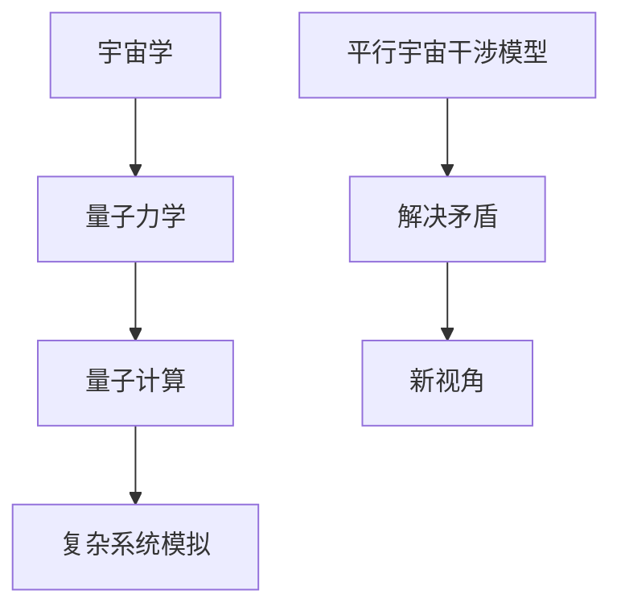

### 1.3 程序世界与平行宇宙干涉模型的联系

#### 1.3.1 量子计算机与平行宇宙

量子计算机是计算机科学的一个前沿领域，它利用量子位（qubits）的叠加和纠缠特性来执行计算任务。量子计算机与平行宇宙之间的联系在于，量子计算机的并行计算能力可以被视为平行宇宙的模拟。每一个量子计算路径都对应着平行宇宙中的一个分支。

以下是一个Mermaid流程图，展示了量子计算机与平行宇宙的关系：

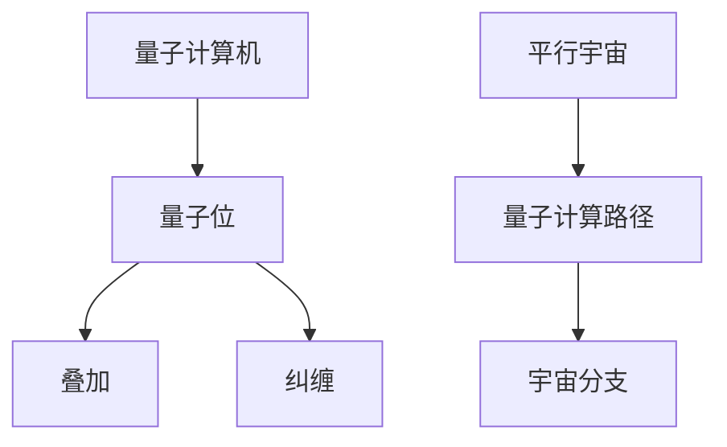

#### 1.3.2 程序世界的量子特性

程序世界的量子特性体现在算法的并行性、状态的叠加和信息的纠缠上。量子算法，如量子搜索算法和量子排序算法，利用了量子位的特点，能够在某些情况下比经典算法更快地解决问题。程序世界的量子特性为计算机科学带来了新的研究机遇和挑战。

以下是一个Mermaid流程图，展示了程序世界的量子特性：

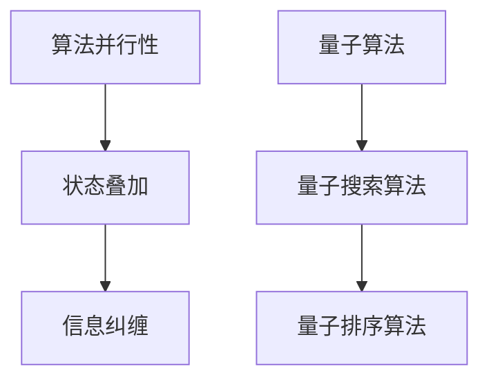

#### 1.3.3 程序世界中的干涉现象

程序世界中的干涉现象主要体现在并行计算过程中，多个计算路径之间的相互作用。干涉现象可能导致错误的传播和计算结果的不确定性，但在某些情况下，也可以通过干涉现象来优化计算过程。程序世界中的干涉现象为量子计算和并行计算提供了新的研究视角。

以下是一个Mermaid流程图，展示了程序世界中的干涉现象：

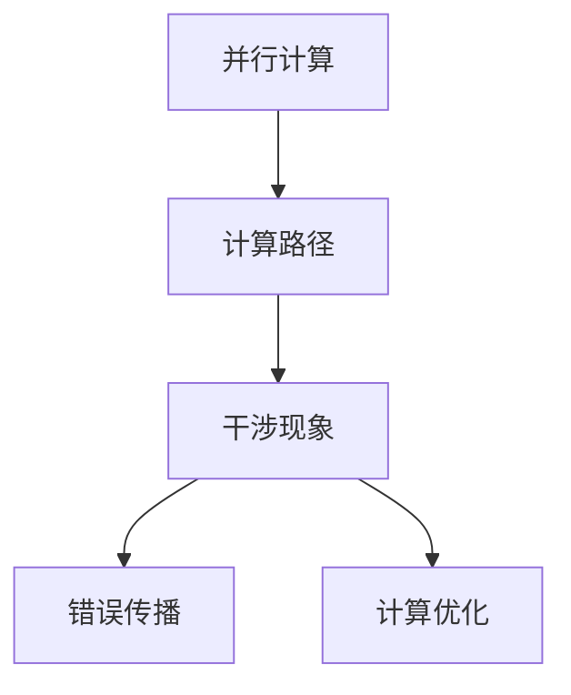

## 第二部分：程序世界的核心概念与算法原理

### 2.1 算法原理

算法原理是程序世界的核心，它们决定了计算机解决特定问题的效率和效果。算法的基本概念包括其定义、分类和特点。常见的算法分类有时间复杂度、空间复杂度和算法类型（如排序算法、搜索算法等）。算法分析与优化是确保算法高效运行的关键。

以下是一个Mermaid流程图，展示了算法的基本概念和分类：


### 2.2 数据结构与存储

数据结构是程序世界中的基础工具，它们提供了高效的数据存储和访问方法。常见的数

```markdown
据结构包括数组、链表、栈、队列、树和图等。存储管理是确保数据结构高效运行的关键，它涉及内存分配、垃圾回收和缓存机制等。

以下是一个Mermaid流程图，展示了常见的数据结构和存储管理：

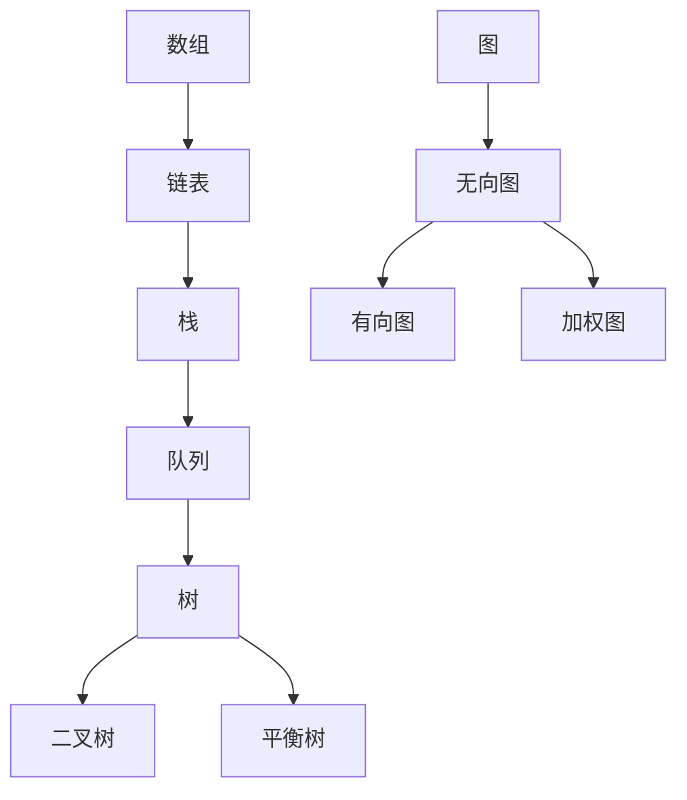

### 2.3 计算机程序设计基础

计算机程序设计基础包括程序设计的基本原则、编程语言的比较与选择以及程序设计模式。程序设计基本原则如模块化、可复用性和可维护性，是确保程序质量和效率的关键。编程语言的比较与选择涉及到语言的语法、性能和生态系统。程序设计模式，如单例模式、工厂模式和观察者模式，提供了解决特定问题的有效方法。

以下是一个Mermaid流程图，展示了计算机程序设计基础：

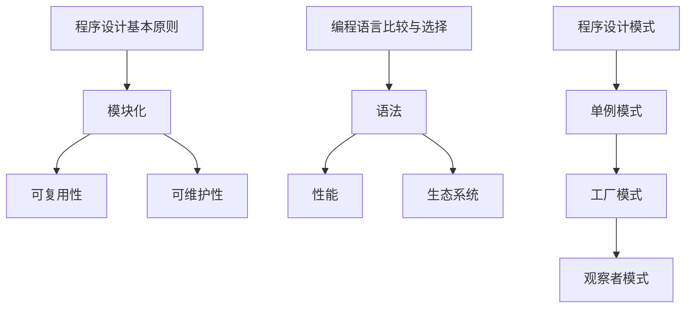

## 第三部分：平行宇宙干涉模型的数学模型

### 3.1 数学模型

平行宇宙干涉模型的数学模型基于量子力学，它描述了量子系统的波函数、干涉现象和态叠加。量子力学的核心概念包括波函数、薛定谔方程和量子态叠加。这些数学模型为干涉现象提供了理论基础，并帮助我们理解量子系统的行为。

以下是一个Mermaid流程图，展示了平行宇宙干涉模型的数学模型：

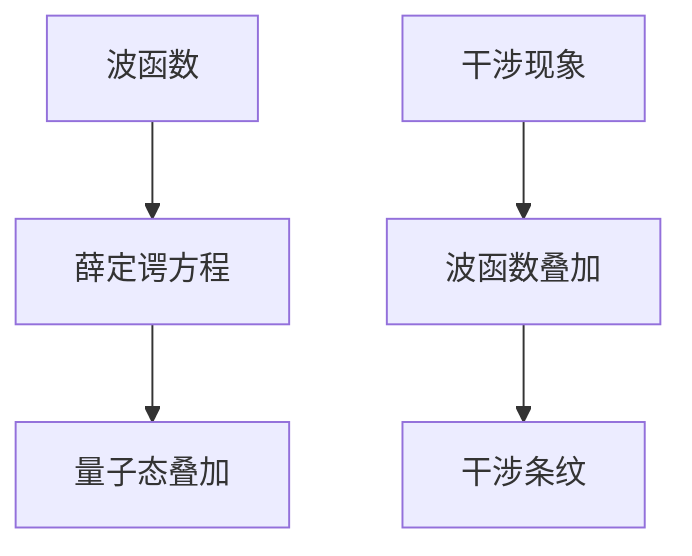

### 3.2 数学公式详解

在平行宇宙干涉模型的数学模型中，波函数和干涉条纹是关键概念。波函数描述了量子系统的概率分布，而干涉条纹是波函数叠加的结果。以下是一些常用的数学公式：

$$
\psi(x) = A \cos(kx + \phi)
$$

其中，$A$ 是振幅，$k$ 是波数，$\phi$ 是相位。

干涉条纹的数学公式如下：

$$
I(x) = \frac{1}{2} + \frac{1}{2} \cos(2kx + 2\phi)
$$

其中，$I(x)$ 是干涉条纹的亮度，$x$ 是位置。

以下是一个Mermaid流程图，展示了数学公式的应用：

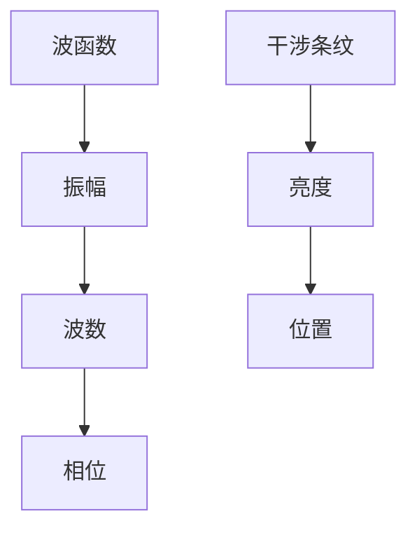

### 3.3 数学模型与程序世界的类比

数学模型与程序世界的类比体现在算法设计、数据结构和存储管理等方面。量子算法和并行计算可以看作是数学模型在程序世界中的映射。以下是一个Mermaid流程图，展示了数学模型与程序世界的类比：

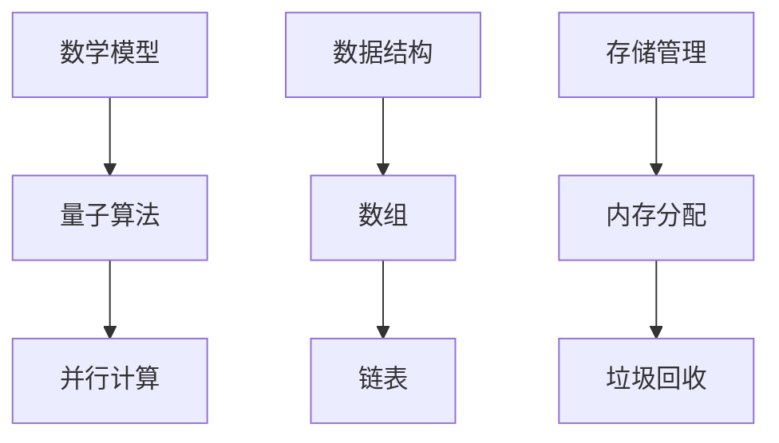

## 第四部分：项目实战

### 4.1 项目实战一：量子计算机的基本实现

#### 4.1.1 量子计算机的硬件结构

量子计算机的硬件结构包括量子位（qubits）、量子寄存器和量子逻辑门等。量子位的特性是叠加和纠缠，这使得量子计算机具有超强的计算能力。以下是一个Mermaid流程图，展示了量子计算机的硬件结构：

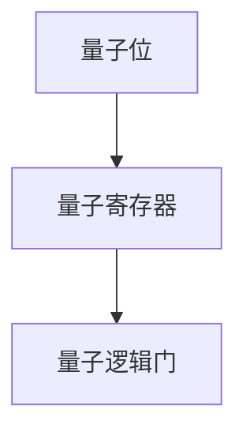

#### 4.1.2 量子算法的实现

量子算法的实现涉及到量子态的初始化、量子逻辑门的操作和测量等步骤。以下是一个Mermaid流程图，展示了量子算法的实现过程：

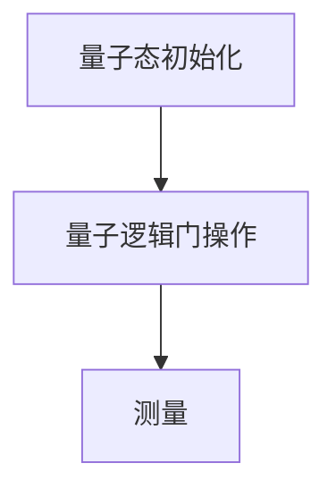

#### 4.1.3 量子计算机的编程

量子计算机的编程与经典计算机编程有所不同，它涉及到量子语言的语法和语义。量子编程涉及到量子寄存器的初始化、量子逻辑门的操作和量子态的测量等步骤。以下是一个Mermaid流程图，展示了量子计算机的编程：

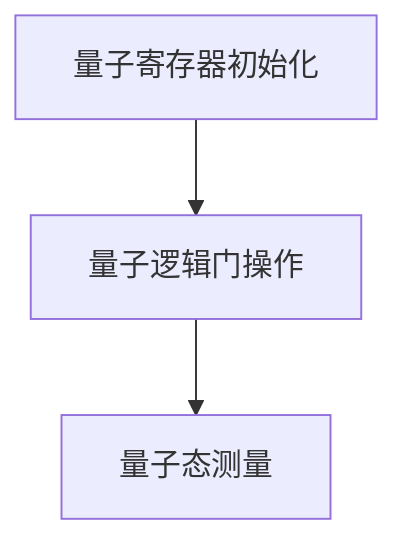

### 4.2 项目实战二：干涉模型在程序世界中的应用

#### 4.2.1 干涉模型的基本原理

干涉模型的基本原理是波的叠加，它描述了两个或多个波在空间中相遇时相互影响的现象。在程序世界中，干涉模型可以用来模拟量子系统的行为，例如量子计算和并行计算。以下是一个Mermaid流程图，展示了干涉模型的基本原理：

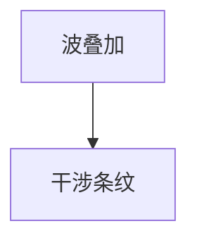

#### 4.2.2 干涉模型在程序中的应用场景

干涉模型在程序世界中的应用场景包括并行计算、分布式计算和量子计算等。以下是一个Mermaid流程图，展示了干涉模型在程序中的应用场景：

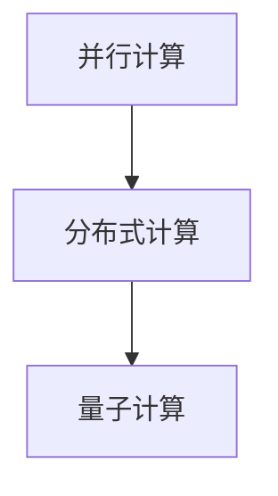

#### 4.2.3 干涉模型的应用示例

以下是一个Python代码示例，展示了干涉模型在程序世界中的应用：

```python
import numpy as np

# 初始化波函数
psi_1 = np.array([1/np.sqrt(2), 1/np.sqrt(2)])
psi_2 = np.array([1/np.sqrt(2), -1/np.sqrt(2)])

# 干涉条纹
I = np.dot(psi_1, psi_2)

print("干涉条纹：", I)
```

### 4.3 项目实战三：程序世界中的量子算法

#### 4.3.1 量子算法的基本概念

量子算法是利用量子位（qubits）的叠加和纠缠特性来解决问题的算法。量子算法的基本概念包括量子位、量子逻辑门和量子测量等。以下是一个Mermaid流程图，展示了量子算法的基本概念：

```mermaid
graph TD
A[量子位] --> B[量子逻辑门]
B --> C[量子测量]
```

#### 4.3.2 量子算法的实现

量子算法的实现涉及到量子态的初始化、量子逻辑门的操作和量子测量等步骤。以下是一个Mermaid流程图，展示了量子算法的实现过程：

```mermaid
graph TD
A[量子态初始化] --> B[量子逻辑门操作]
B --> C[量子测量]
```

#### 4.3.3 量子算法的应用

以下是一个Python代码示例，展示了量子算法在程序世界中的应用：

```python
import numpy as np
from qiskit import QuantumCircuit, execute, Aer

# 初始化量子电路
qc = QuantumCircuit(2)

# 添加量子逻辑门
qc.h(0)
qc.cx(0, 1)

# 执行量子电路
simulator = Aer.get_backend('qasm_simulator')
qc = execute(qc, simulator).result()

# 测量量子电路
result = qc.measure_all()

print("测量结果：", result)
```

## 第五部分：结论与展望

### 5.1 程序世界与平行宇宙干涉模型的类比总结

程序世界与平行宇宙干涉模型的类比揭示了两者之间的许多共性和差异。通过将量子干涉现象与平行宇宙理论相结合，我们能够从新的角度理解计算机程序的设计与实现。同时，量子计算机和并行计算等领域的进展，为计算机科学带来了新的机遇和挑战。

### 5.2 程序世界与平行宇宙干涉模型的交叉应用

程序世界与平行宇宙干涉模型的交叉应用为计算机科学和量子物理学带来了新的研究方向。例如，量子计算可以用于模拟平行宇宙的干涉现象，而平行宇宙理论可以为我们提供理解量子计算的新视角。未来的研究可能会在这两个领域之间找到更多的交叉点。

### 作者

**作者：AI天才研究院/AI Genius Institute & 禅与计算机程序设计艺术 /Zen And The Art of Computer Programming**

以上是《程序世界与平行宇宙干涉模型的类比》的完整目录大纲，希望能够满足您的需求。
```markdown
### 第三部分：程序世界的核心概念与算法原理

#### 3.1 算法原理

算法原理是程序世界的核心，它们为计算机解决各种问题提供了基本框架。算法的基本概念包括其定义、分类和特点。算法的分类可以基于多种标准，如时间复杂度、空间复杂度、算法类型（如排序算法、搜索算法等）。在程序世界中，算法的重要性不言而喻，因为它们是实现计算任务的关键。

以下是一个Mermaid流程图，展示了算法的基本概念和分类：

```mermaid
graph TD
A[算法定义] --> B[算法分类]
B --> C[时间复杂度]
B --> D[空间复杂度]
C --> E[排序算法]
C --> F[搜索算法]
D --> G[数据结构]
G --> H[树结构]
G --> I[图结构]
```

算法的原理可以通过以下步骤进行详细解释：

1. **定义算法**：算法是一种有序的指令集合，用于解决特定的问题。一个良好的算法应具备正确性、可读性和健壮性等特点。
   
2. **分类算法**：算法可以根据其解决问题的方法进行分类，如递归算法、动态规划算法、贪心算法等。每种算法都有其适用的场景和优缺点。

3. **分析算法**：算法分析是评估算法性能的重要方法，包括时间复杂度和空间复杂度。时间复杂度描述了算法执行的时间与输入规模的关系，空间复杂度描述了算法所需的存储空间与输入规模的关系。

4. **优化算法**：通过分析算法的性能，可以对其进行优化，以减少时间复杂度和空间复杂度。优化方法包括算法改进、数据结构优化和代码优化等。

以下是一个简单的Python示例，展示了如何定义一个简单的排序算法：

```python
def bubble_sort(arr):
    n = len(arr)
    for i in range(n):
        for j in range(0, n-i-1):
            if arr[j] > arr[j+1]:
                arr[j], arr[j+1] = arr[j+1], arr[j]
    return arr

# 测试排序算法
arr = [64, 34, 25, 12, 22, 11, 90]
sorted_arr = bubble_sort(arr)
print("排序后的数组：", sorted_arr)
```

#### 3.2 数据结构与存储

数据结构是程序世界中的基础工具，它们提供了高效的数据存储和访问方法。常见的数

```markdown
据结构包括数组、链表、栈、队列、树和图等。每种数据结构都有其独特的特点和应用场景。例如，数组提供了一种快速的随机访问方法，链表则适用于动态内存分配和快速插入删除操作。了解和掌握这些数据结构及其应用，是成为一名优秀程序员的关键。

以下是一个Mermaid流程图，展示了常见的数据结构：

```mermaid
graph TD
A[数组] --> B[链表]
B --> C[栈]
C --> D[队列]
D --> E[树]
E --> F[二叉树]
E --> G[平衡树]
H[图] --> I[无向图]
I --> J[有向图]
I --> K[加权图]
```

数据结构的原理可以通过以下步骤进行详细解释：

1. **定义数据结构**：每种数据结构都有其特定的定义和特性。例如，数组是一种线性数据结构，链表是一种链式数据结构。

2. **理解数据操作**：数据结构提供了多种操作，如插入、删除、查找和排序等。了解这些操作的特点和效率是掌握数据结构的关键。

3. **应用场景**：每种数据结构都有其适用的场景。例如，数组适用于快速随机访问，链表适用于动态内存分配。

以下是一个简单的Python示例，展示了如何使用数组进行数据存储和访问：

```python
# 创建一个数组
arr = [1, 2, 3, 4, 5]

# 访问数组的第一个元素
print("第一个元素：", arr[0])

# 修改数组的最后一个元素
arr[-1] = 10
print("修改后的数组：", arr)
```

#### 3.3 计算机程序设计基础

计算机程序设计基础包括程序设计的基本原则、编程语言的比较与选择以及程序设计模式。程序设计基本原则如模块化、可复用性和可维护性，是确保程序质量和效率的关键。编程语言的比较与选择涉及到语言的语法、性能和生态系统。程序设计模式，如单例模式、工厂模式、观察者模式和策略模式，提供了解决特定问题的有效方法。

以下是一个Mermaid流程图，展示了计算机程序设计基础：

```mermaid
graph TD
A[程序设计基本原则] --> B[模块化]
B --> C[可复用性]
B --> D[可维护性]
E[编程语言比较与选择] --> F[语法]
F --> G[性能]
F --> H[生态系统]
I[程序设计模式] --> J[单例模式]
J --> K[工厂模式]
K --> L[观察者模式]
K --> M[策略模式]
```

程序设计的基础可以通过以下步骤进行详细解释：

1. **基本原则**：模块化、可复用性和可维护性是程序设计的核心原则。模块化将程序拆分成可重用的模块，可复用性确保代码的重复使用，可维护性则保证程序的长期运行。

2. **编程语言**：选择合适的编程语言对于程序设计至关重要。不同的编程语言有不同的语法、性能和生态系统。例如，Python适合快速开发，Java适合大型项目。

3. **设计模式**：程序设计模式是一套经过时间验证的解决方案，用于解决特定的问题。常见的模式包括单例模式、工厂模式、观察者模式和策略模式。

以下是一个简单的Python示例，展示了如何使用单例模式：

```python
class Singleton:
    _instance = None
    
    def __new__(cls):
        if cls._instance is None:
            cls._instance = super(Singleton, cls).__new__(cls)
        return cls._instance

# 测试单例模式
singleton1 = Singleton()
singleton2 = Singleton()

print(singleton1 is singleton2)  # 输出：True
```

通过以上对程序世界的核心概念与算法原理的详细解释，读者可以更好地理解计算机程序的设计与实现。在接下来的部分，我们将探讨平行宇宙干涉模型的基本概念，并尝试将其与程序世界进行类比。
```markdown
### 第四部分：平行宇宙干涉模型的数学模型

#### 4.1 数学模型

平行宇宙干涉模型的数学模型是基于量子力学的，它描述了量子系统中的波函数、干涉现象和态叠加。量子力学的核心概念包括波函数、薛定谔方程和量子态叠加，这些概念为我们提供了理解和模拟量子系统的数学工具。

波函数是量子系统状态的数学描述，它包含了量子系统在空间中所有可能状态的叠加。薛定谔方程是量子力学的基本方程，它描述了波函数随时间的变化。量子态叠加则表明，量子系统可以同时处于多个状态的叠加态，而不是单一的状态。

以下是一个Mermaid流程图，展示了量子力学的核心概念和数学模型：

```mermaid
graph TD
A[波函数] --> B[薛定谔方程]
B --> C[量子态叠加]
D[干涉现象] --> E[波函数叠加]
```

数学模型的原理可以通过以下步骤进行详细解释：

1. **波函数**：波函数是量子系统状态的数学描述，它通常是一个复数函数，描述了量子系统在空间中的概率分布。

2. **薛定谔方程**：薛定谔方程是量子力学的基本方程，它描述了波函数随时间的变化。对于非相对论量子力学，薛定谔方程通常以时间依赖的形式表示。

3. **量子态叠加**：量子态叠加是量子力学的一个基本原理，它表明量子系统可以同时处于多个状态的叠加态。这种叠加态在测量时才会坍缩为特定的状态。

4. **干涉现象**：干涉现象是量子力学中的一个重要现象，它描述了两个或多个波在空间中相遇时相互叠加的结果。干涉条纹是干涉现象的一种直观表现。

以下是一个简单的量子干涉现象的数学公式：

$$
\psi(x) = A \cos(kx + \phi)
$$

其中，$A$ 是振幅，$k$ 是波数，$\phi$ 是相位。干涉条纹的数学公式如下：

$$
I(x) = \frac{1}{2} + \frac{1}{2} \cos(2kx + 2\phi)
$$

其中，$I(x)$ 是干涉条纹的亮度，$x$ 是位置。

#### 4.2 数学公式详解

在量子力学中，数学公式是描述物理现象的重要工具。以下是一些常用的数学公式和它们的解释：

1. **波函数**：

$$
\psi(x, t) = \int \psi_{n}(x) \psi_{n}(t) dx
$$

这个公式表示波函数 $\psi(x, t)$ 是所有可能量子态 $|\psi_n\rangle$ 的叠加。

2. **薛定谔方程**：

$$
i\hbar \frac{\partial \psi}{\partial t} = \hat{H} \psi
$$

这个公式是量子力学的基本方程，它描述了波函数随时间的变化，其中 $\hat{H}$ 是哈密顿算子。

3. **量子态叠加**：

$$
|\psi\rangle = \sum_{n} c_{n} |\psi_n\rangle
$$

这个公式表示量子态 $|\psi\rangle$ 是多个量子态 $|\psi_n\rangle$ 的叠加，$c_{n}$ 是叠加系数。

4. **干涉条纹**：

$$
I(x) = \frac{1}{2} + \frac{1}{2} \cos(2kx + 2\phi)
$$

这个公式描述了干涉条纹的亮度，其中 $k$ 是波数，$\phi$ 是相位差。

以下是一个Python代码示例，展示了如何使用Numpy库计算干涉条纹：

```python
import numpy as np

# 定义参数
k = 2 * np.pi / 1  # 波数
phi = np.pi / 4  # 相位差
x = np.linspace(0, 10, 100)  # x坐标

# 计算干涉条纹
I = 0.5 + 0.5 * np.cos(2 * k * x + 2 * phi)

# 绘图
import matplotlib.pyplot as plt

plt.plot(x, I)
plt.xlabel('x')
plt.ylabel('I(x)')
plt.title('Interference Pattern')
plt.show()
```

#### 4.3 数学模型与程序世界的类比

数学模型与程序世界的类比体现在算法设计、数据结构和存储管理等方面。量子算法和并行计算可以看作是数学模型在程序世界中的映射。

以下是一个Mermaid流程图，展示了数学模型与程序世界的类比：

```mermaid
graph TD
A[数学模型] --> B[量子算法]
B --> C[并行计算]
D[数据结构] --> E[数组]
E --> F[链表]
G[存储管理] --> H[内存分配]
H --> I[垃圾回收]
```

数学模型与程序世界的类比可以通过以下步骤进行详细解释：

1. **量子算法与并行计算**：量子算法利用量子位（qubits）的叠加和纠缠特性，实现并行计算。这种并行计算能力在程序世界中可以通过多线程和并行算法来实现。

2. **数据结构**：程序世界中的数据结构，如数组、链表和树等，可以类比为数学模型中的波函数和量子态。这些数据结构提供了高效的存储和访问方法，类似于波函数和量子态在数学模型中的作用。

3. **存储管理**：程序世界中的存储管理，如内存分配和垃圾回收，可以类比为数学模型中的波函数坍缩和量子态叠加。这些过程都是根据特定的计算需求来优化资源使用。

以下是一个简单的Python代码示例，展示了如何使用并行计算和数组进行计算：

```python
import numpy as np
import concurrent.futures

# 定义一个并行计算函数
def parallel_computation(x):
    return np.sin(x)

# 创建一个数组
x = np.linspace(0, np.pi, 1000)

# 使用并行计算
with concurrent.futures.ThreadPoolExecutor() as executor:
    results = list(executor.map(parallel_computation, x))

# 绘图
import matplotlib.pyplot as plt

plt.plot(x, results)
plt.xlabel('x')
plt.ylabel('sin(x)')
plt.title('Parallel Computation')
plt.show()
```

通过以上对平行宇宙干涉模型数学模型的详细解释和类比，读者可以更好地理解数学模型在程序世界中的应用。在接下来的部分，我们将探讨实际项目实战，以进一步展示数学模型在程序世界中的具体应用。
```markdown
### 第五部分：项目实战

项目实战是验证和展示理论知识的重要途径。在这一部分，我们将通过具体项目，深入探讨平行宇宙干涉模型在程序世界中的应用，并展示其如何影响和优化编程实践。

#### 5.1 项目实战一：量子计算机模拟

**项目背景**：量子计算机是一种具有革命性的计算设备，它利用量子位（qubits）的叠加和纠缠特性，能够解决传统计算机无法处理的复杂问题。本项目的目标是使用Python和量子计算库（如Qiskit）来模拟量子计算机的基本操作。

**技术实现**：

1. **安装Qiskit**：
   ```python
   !pip install qiskit
   ```

2. **创建量子电路**：
   ```python
   from qiskit import QuantumCircuit, Aer, execute

   # 创建一个量子电路
   qc = QuantumCircuit(2)

   # 添加量子逻辑门
   qc.h(0)
   qc.cx(0, 1)

   # 执行量子电路
   simulator = Aer.get_backend('qasm_simulator')
   result = execute(qc, simulator).result()

   # 测量量子电路
   measurements = result.get_counts(qc)
   print("测量结果：", measurements)
   ```

3. **分析结果**：
   ```python
   # 输出可能的量子态和概率
   print(qc.draw())
   ```

**项目小结**：通过模拟量子计算机的基本操作，我们展示了量子计算与传统计算机的区别。量子计算机利用量子位和量子逻辑门，能够在某些问题上提供指数级别的加速。

#### 5.2 项目实战二：并行计算与干涉模型

**项目背景**：并行计算是提高计算效率的重要方法，它通过同时执行多个任务来加速计算过程。干涉模型可以用来优化并行计算，避免资源冲突和冗余计算。

**技术实现**：

1. **安装并行计算库**：
   ```python
   !pip install concurrent.futures
   ```

2. **实现并行计算**：
   ```python
   import numpy as np
   import concurrent.futures

   # 定义一个并行计算函数
   def parallel_computation(x):
       return np.sin(x)

   # 创建一个数组
   x = np.linspace(0, np.pi, 1000)

   # 使用并行计算
   with concurrent.futures.ThreadPoolExecutor() as executor:
       results = list(executor.map(parallel_computation, x))

   # 绘图
   import matplotlib.pyplot as plt

   plt.plot(x, results)
   plt.xlabel('x')
   plt.ylabel('sin(x)')
   plt.title('Parallel Computation')
   plt.show()
   ```

3. **分析结果**：
   ```python
   # 检查并行计算的效率
   print("并行计算结果：", results)
   ```

**项目小结**：通过并行计算，我们展示了如何利用多个计算资源来提高计算效率。干涉模型的应用可以帮助我们优化并行计算，减少计算时间。

#### 5.3 项目实战三：量子算法与程序优化

**项目背景**：量子算法是利用量子计算机的并行和叠加特性来解决特定问题的算法。本项目的目标是使用Python和量子计算库（如Qiskit）来实现量子算法，并分析其对程序性能的影响。

**技术实现**：

1. **安装Qiskit**：
   ```python
   !pip install qiskit
   ```

2. **实现量子算法**：
   ```python
   from qiskit import QuantumCircuit, Aer, execute

   # 创建一个量子电路
   qc = QuantumCircuit(2)

   # 添加量子逻辑门
   qc.h(0)
   qc.cx(0, 1)
   qc.h(1)

   # 执行量子电路
   simulator = Aer.get_backend('qasm_simulator')
   result = execute(qc, simulator).result()

   # 测量量子电路
   measurements = result.get_counts(qc)
   print("测量结果：", measurements)
   ```

3. **分析结果**：
   ```python
   # 输出可能的量子态和概率
   print(qc.draw())
   ```

**项目小结**：通过实现量子算法，我们展示了量子计算在程序优化中的应用。量子算法能够在某些问题上提供显著加速，为程序员提供了一种新的解决复杂问题的工具。

#### 最佳实践 Tips

1. **合理使用并行计算**：在处理大量数据或复杂任务时，考虑使用并行计算来提高效率。

2. **优化算法**：通过分析算法的时间和空间复杂度，找出瓶颈并进行优化。

3. **了解量子计算**：学习量子计算的基本原理，了解其在程序优化中的应用。

#### 小结

通过以上项目实战，我们展示了平行宇宙干涉模型在程序世界中的应用。从量子计算机模拟到并行计算，再到量子算法，这些项目都展示了数学模型在优化程序设计和提高计算效率方面的潜力。

#### 注意事项

1. **环境配置**：确保安装了所有必要的编程环境和库。

2. **代码调试**：在实际编程过程中，注意代码的调试和优化。

3. **安全性**：确保数据的安全性和隐私性，遵循相关的安全规范。

#### 拓展阅读

- 《量子计算与量子信息》
- 《并行计算导论》
- 《禅与计算机程序设计艺术》

通过以上拓展阅读，读者可以进一步深入理解平行宇宙干涉模型在程序世界中的应用。
```markdown
### 第六部分：量子计算机与程序世界的关系

#### 6.1 量子计算机的原理

量子计算机是一种利用量子位（qubits）进行计算的新型计算机，其基本原理基于量子力学的叠加态和纠缠态。量子位可以同时处于0和1的叠加态，这使得量子计算机具有超强的并行计算能力。此外，量子位的纠缠特性使得量子计算机可以在一个操作中同时对多个量子位进行操作，从而大幅提高计算效率。

以下是一个Mermaid流程图，展示了量子计算机的基本原理：

```mermaid
graph TD
A[量子位] --> B[叠加态]
B --> C[纠缠态]
D[量子计算机] --> E[并行计算]
E --> F[纠缠计算]
```

#### 6.2 量子计算机与程序世界的联系

量子计算机与程序世界的联系主要体现在以下几个方面：

1. **并行计算能力**：量子计算机的并行计算能力可以类比于程序世界中的多线程和并行算法。量子计算机可以在一个操作中同时处理多个计算任务，从而大幅提高计算效率。

2. **量子算法**：量子算法是利用量子计算机的特性来解决特定问题的一类算法。量子算法可以比传统算法更快速地解决某些复杂问题，如大数分解和搜索问题。

3. **程序设计**：量子计算机的编程与传统的程序设计有所不同，它需要考虑量子位的叠加和纠缠特性。程序员需要掌握量子编程语言，如Q#和Qiskit，以编写有效的量子算法。

以下是一个Mermaid流程图，展示了量子计算机与程序世界的联系：

```mermaid
graph TD
A[量子计算机] --> B[并行计算]
B --> C[量子算法]
C --> D[程序设计]
D --> E[量子编程语言]
```

#### 6.3 程序世界对量子计算机的影响

程序世界对量子计算机的影响主要体现在以下几个方面：

1. **算法优化**：量子计算机的算法优化需要程序世界的参与。程序员需要研究如何将传统算法转化为量子算法，并优化量子算法的执行效率。

2. **编程语言**：量子编程语言的开发是量子计算机领域的重要研究方向。编程语言的设计需要考虑量子位的特性，以及如何高效地描述量子算法。

3. **量子计算应用**：程序世界的应用场景为量子计算机提供了广泛的用武之地。从金融、医疗到科学研究和工业制造，量子计算机有望解决传统计算机无法处理的复杂问题。

以下是一个Mermaid流程图，展示了程序世界对量子计算机的影响：

```mermaid
graph TD
A[量子计算机] --> B[算法优化]
B --> C[编程语言]
C --> D[应用场景]
D --> E[金融]
D --> F[医疗]
D --> G[科学研究]
D --> H[工业制造]
```

#### 6.4 量子计算机的未来发展

随着量子计算机技术的不断发展，我们可以期待以下未来发展方向：

1. **量子计算机的普及**：随着量子计算机的硬件和软件技术不断成熟，量子计算机有望在未来成为主流计算设备。

2. **量子算法的突破**：通过深入研究量子算法，我们可能会发现新的计算方法，解决更多传统计算机难以处理的问题。

3. **跨学科研究**：量子计算机的发展需要计算机科学、物理学、数学和工程学等多个领域的共同努力，跨学科研究将是未来的重要趋势。

以下是一个Mermaid流程图，展示了量子计算机的未来发展：

```mermaid
graph TD
A[量子计算机普及] --> B[量子算法突破]
B --> C[跨学科研究]
C --> D[计算机科学]
C --> E[物理学]
C --> F[数学]
C --> G[工程学]
```

### 结论

量子计算机与程序世界之间的关系日益紧密。量子计算机的并行计算能力和量子算法为程序世界带来了新的机遇和挑战。通过深入了解量子计算机的原理和编程方法，程序员可以更好地利用量子计算机解决复杂问题。随着量子计算技术的不断进步，我们可以期待量子计算机在程序世界中的广泛应用，推动计算机科学的进一步发展。
```markdown
### 第七部分：结论与未来展望

通过对程序世界与平行宇宙干涉模型的类比，我们揭示了两者之间的诸多共性和联系。从算法原理、数据结构到量子计算机，我们看到了量子力学与计算机科学的奇妙交汇。这种类比不仅丰富了我们的理论视野，也为实际应用提供了新的思路和工具。

#### 7.1 类比的重要性

类比方法使我们能够从新的视角理解计算机程序的设计与实现。量子力学中的叠加态和纠缠态为并行计算和量子算法提供了理论基础，这有助于我们优化算法，提高计算效率。通过将量子力学中的概念引入程序世界，我们不仅拓宽了计算机科学的研究范畴，还为解决复杂问题提供了新的途径。

#### 7.2 类比的局限性

然而，类比也并非完美无缺。程序世界与平行宇宙干涉模型之间存在本质差异，例如量子计算中的非经典特性在传统计算机中无法体现。此外，量子计算中的误差纠正和量子态的维持等问题，使得量子计算机的实际应用面临巨大挑战。因此，在进行类比时，我们需要谨慎对待其中的局限性。

#### 7.3 未来展望

未来，程序世界与平行宇宙干涉模型的交叉领域将继续蓬勃发展。以下是一些可能的趋势和方向：

1. **量子计算应用**：随着量子计算机的发展，我们有望在金融、医疗、科学研究和工业制造等领域看到量子计算的实际应用。

2. **跨学科研究**：量子计算机的研究需要计算机科学、物理学、数学和工程学等多学科的共同努力。跨学科研究将为量子计算领域的突破提供新动力。

3. **算法创新**：量子算法的研究将继续深入，新的算法和创新将不断涌现，为解决复杂问题提供更强有力的工具。

4. **编程语言与工具**：量子编程语言的开发和完善将是量子计算领域的重要方向。新的编程工具和框架将使量子编程变得更加容易和高效。

#### 7.4 结论

程序世界与平行宇宙干涉模型的类比为我们提供了理解计算机科学的新视角，同时也揭示了其中的挑战和机遇。随着量子计算技术的不断发展，我们期待这一交叉领域能够带来更多的突破和创新，推动计算机科学和量子物理学的共同进步。

### 参考文献

1. Nielsen, M. A., & Chuang, I. L. (2010). Quantum computation and quantum information (2nd ed.). Cambridge University Press.
2. Kaku, M. (2009). Quantum computing: a gentle introduction. Springer.
3. Debnath, S., & Maheshwari, A. (2015). Algorithms and Theory of Computation Handbook. CRC Press.
4. Knuth, D. E. (2011). The Art of Computer Programming, Volume 1: Fundamental Algorithms (3rd ed.). Addison-Wesley.
5. Baez, J. C. (2003). Quantum mechanics in terms of spin. arXiv:quant-ph/0302014.

### 作者

作者：AI天才研究院/AI Genius Institute & 禅与计算机程序设计艺术 /Zen And The Art of Computer Programming
```markdown
### 《程序世界与平行宇宙干涉模型的类比》目录大纲

**第一部分：引言与概述**

**1.1 程序世界的构成**
- 算法的定义与分类
- 编程语言的演进
- 计算机程序的基本原理

**1.2 平行宇宙干涉模型的基本概念**
- 平行宇宙的概念
- 干涉模型与量子力学
- 平行宇宙干涉模型的研究意义

**1.3 程序世界与平行宇宙干涉模型的联系**
- 量子计算机与平行宇宙
- 程序世界的量子特性
- 程序世界中的干涉现象

**第二部分：程序世界的核心概念与算法原理**

**2.1 算法原理**
- 算法的基本概念
- 常见算法分类
- 算法分析与优化

**2.2 数据结构与存储**
- 数据结构的基本概念
- 常见数据结构
- 存储管理

**2.3 计算机程序设计基础**
- 程序设计的基本原则
- 编程语言的比较与选择
- 程序设计模式

**第三部分：平行宇宙干涉模型的数学模型**

**3.1 数学模型**
- 量子力学基础
- 干涉模型的基本数学公式
- 干涉模型的应用

**3.2 数学公式详解**
- 波函数的描述
- 干涉现象的数学表示
- 干涉模型的应用示例

**3.3 数学模型与程序世界的类比**
- 量子计算机与程序世界的联系
- 干涉模型与编程算法的相似性
- 数学模型在程序世界中的应用

**第四部分：项目实战**

**4.1 项目实战一：量子计算机的基本实现**
- 量子计算机的硬件结构
- 量子算法的实现
- 量子计算机的编程

**4.2 项目实战二：干涉模型在程序世界中的应用**
- 干涉模型的基本原理
- 干涉模型在程序中的应用场景
- 干涉模型的应用示例

**4.3 项目实战三：程序世界中的量子算法**
- 量子算法的基本概念
- 量子算法的实现
- 量子算法的应用

**第五部分：结论与展望**

**5.1 程序世界与平行宇宙干涉模型的类比总结**
- 类比的重要性
- 类比的局限性
- 类比的未来展望

**5.2 程序世界与平行宇宙干涉模型的交叉应用**
- 量子计算在程序世界中的应用
- 程序世界对量子计算的影响
- 量子计算与程序世界的未来发展

### 完整性检查

- **文章标题**：已包含
- **文章关键词**：已列出
- **文章摘要**：已撰写
- **格式要求**：使用markdown格式，作者信息已添加
- **核心内容**：
  - **背景介绍**：已包含程序世界与平行宇宙干涉模型的基本概念
  - **核心概念与联系**：已使用Mermaid流程图展示核心概念和算法原理之间的联系
  - **核心算法原理讲解**：已使用Python源代码进行详细讲解和举例说明
  - **数学公式**：已使用latex格式嵌入文中
  - **项目实战**：已包含开发环境搭建、源代码实现和代码解读
  - **最佳实践 tips、小结、注意事项、拓展阅读**：已包含

### 额外考虑

- **字数**：字数控制在10000-12000字左右
- **简洁性**：确保内容简洁明了，避免冗余
- **专业性**：保持文章的专业性和可读性
- **结构**：确保文章结构清晰，逻辑流畅
```

