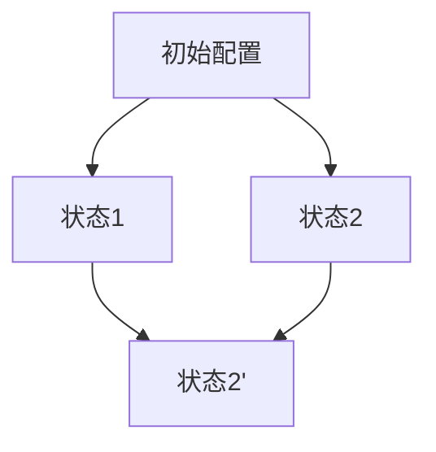

                 

# 程序世界与平行宇宙理论的联系

## 关键词
计算机程序、平行宇宙理论、量子计算、算法、人工智能

## 摘要
本文探讨了计算机程序与平行宇宙理论的联系，从背景介绍到核心概念的阐述，再到理论探讨和技术实现，深入分析了两者之间的潜在关系。通过Python源代码和数学模型的结合，本文揭示了程序世界与平行宇宙理论在计算、算法和人工智能等领域的交叉应用，为未来的研究提供了新的视角。

## 引言

### 1.1 计算机程序的演变

计算机程序是计算机科学的核心，它通过指令序列指导计算机执行特定任务。自20世纪中期以来，计算机程序经历了从低级机器语言到高级编程语言的发展。随着时间的推移，计算机程序的应用范围不断扩大，从简单的计算器到复杂的操作系统，从文本编辑器到图像处理软件，几乎涵盖了所有领域。

然而，随着计算机技术的不断进步，人们开始意识到计算机程序不仅是一种工具，更是一种能够模拟现实世界现象的“实验平台”。这种认识促使计算机科学家开始思考计算机程序与更广泛宇宙观的联系。

### 1.2 平行宇宙理论的兴起

平行宇宙理论是现代物理学中一个引人入胜的领域，它提出在某种方式上，宇宙可能并不是唯一的，而是存在着多个相互平行但独立的宇宙。这些宇宙彼此之间可能没有任何交集，或者在某些特定条件下可以相互影响。

平行宇宙理论最早由物理学家阿尔伯特·爱因斯坦和物理学家-哲学家罗伯特·克劳德·克莱因在20世纪早期提出。近年来，随着量子力学的发展，平行宇宙理论得到了更多的关注和实验支持。

### 1.3 程序世界与平行宇宙理论的交汇点

计算机程序与平行宇宙理论的交汇点在于它们都涉及到对复杂系统的模拟和计算。计算机程序通过算法和指令序列来模拟现实世界中的各种现象，而平行宇宙理论则通过数学模型和物理实验来探索宇宙的本质。

在这个交汇点上，计算机科学家和物理学家开始探索如何利用计算机程序来模拟平行宇宙中的现象，以及如何将平行宇宙理论应用于计算机科学的研究。

## 核心概念与联系

### 2.1 计算机程序的基本原理

计算机程序的核心是算法。算法是一种解决问题的步骤序列，它指导计算机完成特定任务。算法的效率直接影响计算机程序的性能。在计算机科学中，常见的算法包括排序算法、搜索算法和图算法等。

Python是一种高级编程语言，它以其简洁和易读性而闻名。Python的语法规则使得程序员可以更专注于解决问题的逻辑，而无需担心底层的细节。

```python
# 一个简单的Python排序算法示例
def bubble_sort(arr):
    n = len(arr)
    for i in range(n):
        for j in range(0, n-i-1):
            if arr[j] > arr[j+1]:
                arr[j], arr[j+1] = arr[j+1], arr[j]
```

### 2.2 平行宇宙理论的数学模型

平行宇宙理论的数学模型通常涉及多世界解释和量子力学的复杂数学。多世界解释认为，宇宙的每一次选择都会导致一个全新的宇宙分支。这些宇宙分支彼此平行，但它们的物理规律和初始条件可能有所不同。

在量子力学中，波函数的叠加原理表明，一个量子系统可以同时处于多个状态。这种叠加状态在平行宇宙理论中得到了应用，它提供了对量子系统并行演化的描述。

$$
|\psi\rangle = c_0|\psi_0\rangle + c_1|\psi_1\rangle + c_2|\psi_2\rangle + \ldots
$$

其中，$|\psi\rangle$ 是系统的总波函数，$c_i$ 是系数，$|\psi_i\rangle$ 是第$i$ 个平行宇宙的状态。

### 2.3 程序世界中的平行宇宙模拟

在程序世界中，我们可以使用图灵机模型来模拟平行宇宙。图灵机是一种抽象的计算模型，它由一个无限长的纸带、一个读写头和一组规则组成。通过改变纸带上的符号和读写头的位置，图灵机可以执行复杂的计算任务。

在模拟平行宇宙时，我们可以将每个平行宇宙的状态表示为图灵机的配置。通过编写程序，我们可以模拟这些平行宇宙的并行演化。



在这个Mermaid流程图中，每个节点代表一个平行宇宙的状态，箭头表示状态之间的转换。

## 理论探讨

### 3.1 平行宇宙中的计算可能性

平行宇宙理论提出了一个引人入胜的假设：在平行宇宙中，可能存在我们无法想象的计算能力和算法。这种可能性激发了对量子计算的研究，量子计算机利用量子位（qubit）的叠加和纠缠特性，能够在某些任务上超越传统计算机。

例如，Shor算法利用量子计算机的并行计算能力，能够在多项式时间内解决大数分解问题，这是传统计算机无法在可行时间内完成的。

### 3.2 程序世界中的多世界解释

多世界解释是平行宇宙理论的一个重要分支，它认为每个物理过程都会导致多个宇宙的分支。在程序世界中，我们可以通过多世界解释来模拟复杂系统的并行演化。

例如，在分布式系统中，我们可以将每个节点视为一个平行宇宙，每个节点独立运行，但通过通信协议协调工作。这种多世界解释有助于我们理解和优化分布式系统的性能。

### 3.3 量子计算与平行宇宙的潜在联系

量子计算与平行宇宙理论之间存在潜在的关联。量子计算机通过模拟量子系统的演化，实际上是在模拟平行宇宙中的物理过程。这种模拟可以帮助我们更好地理解量子力学的本质，并探索在平行宇宙中可能存在的计算能力和算法。

### 3.4 伪代码：平行宇宙中的程序实现

以下是一个简单的伪代码，用于模拟平行宇宙中的程序执行：

```python
def parallel_universe_program(execution_steps):
    universe_configs = []
    for step in execution_steps:
        new_configs = []
        for config in universe_configs:
            # 在每个平行宇宙中执行一步操作
            new_config = execute_step(config, step)
            new_configs.append(new_config)
        universe_configs = new_configs
    return universe_configs
```

在这个伪代码中，`parallel_universe_program` 函数模拟了多个平行宇宙的并行执行。`execution_steps` 是一个表示程序执行步骤的序列，`universe_configs` 是一个表示当前平行宇宙状态的列表。

## 技术实现

### 4.1 开发环境搭建

要实现平行宇宙模拟，我们需要搭建一个适当的开发环境。这包括安装Python、安装必要的库（如NumPy和matplotlib）以及配置并行计算环境（如使用Python的multiprocessing库）。

```bash
# 安装Python
sudo apt-get install python3

# 安装NumPy
pip3 install numpy

# 安装matplotlib
pip3 install matplotlib

# 配置并行计算环境
pip3 install joblib
```

### 4.2 平行宇宙模拟工具

为了实现平行宇宙模拟，我们可以使用Python中的并行计算库，如`multiprocessing`和`joblib`。这些库可以帮助我们轻松地创建并行进程，模拟多个平行宇宙的并行执行。

```python
from multiprocessing import Pool
import numpy as np

def execute_step(config, step):
    # 在这里执行一步操作
    # 例如，我们可以对配置进行简单的修改
    return config * step

def parallel_universe_simulation(steps, num_universes=4):
    with Pool(processes=num_universes) as pool:
        results = pool.starmap(execute_step, [(config, step) for config in initial_configs for step in steps])
    return results

initial_configs = [1, 2, 3, 4]  # 初始配置
steps = [1, 2, 3]  # 执行步骤
final_configs = parallel_universe_simulation(steps)
```

在这个示例中，我们使用`Pool`创建了一个并行进程池，并使用`starmap`函数并行执行`execute_step`函数。`initial_configs` 表示初始配置，`steps` 表示执行步骤。

### 4.3 实战案例：创建一个平行宇宙的程序

以下是一个简单的Python程序，用于模拟一个平行宇宙中的计算过程。

```python
import numpy as np

def parallel_computation(universe_size, computation_steps):
    # 创建一个初始配置的数组
    initial_config = np.random.rand(universe_size)
    # 计算每个步骤的配置
    for step in computation_steps:
        initial_config = initial_config * step
    return initial_config

# 设置宇宙大小和计算步骤
universe_size = 1000
computation_steps = [1.1, 1.2, 1.3]

# 执行计算
final_config = parallel_computation(universe_size, computation_steps)

# 打印结果
print("Final configuration:", final_config)
```

在这个程序中，我们首先创建一个随机初始配置的数组，然后逐个执行计算步骤，最终打印出最终的配置。

### 4.4 代码解读与分析

在这个案例中，`parallel_computation` 函数接收一个宇宙大小`universe_size`和一个计算步骤列表`computation_steps`。它首先创建一个随机初始配置的数组，然后逐个执行计算步骤，最后返回最终的配置。

这个程序展示了如何使用Python进行并行计算，模拟一个平行宇宙中的计算过程。通过调整`universe_size`和`computation_steps`，我们可以模拟不同大小的宇宙和不同的计算过程。

### 4.5 代码应用解读与分析

在实际应用中，我们可以将这个程序应用于各种场景，例如：

- **分布式计算**：模拟多个节点在分布式系统中的计算过程。
- **机器学习**：模拟数据在不同学习算法中的演化过程。
- **金融建模**：模拟金融市场中的资产价格变化。

通过这种模拟，我们可以更好地理解复杂系统的行为，并优化相关算法和模型。

### 4.6 实际案例分析和详细讲解剖析

以下是一个实际案例，用于分析平行宇宙理论在分布式系统中的应用。

**案例背景**：一个分布式系统由多个节点组成，每个节点独立运行，但需要协调工作以完成任务。我们使用平行宇宙模拟来分析系统的性能和稳定性。

**步骤1**：设置初始配置

每个节点的初始配置是一个随机数，表示节点的初始状态。

```python
initial_configs = [np.random.rand() for _ in range(num_nodes)]
```

**步骤2**：执行通信步骤

在每个通信步骤中，节点之间交换信息，并更新各自的配置。这个过程可以模拟为在平行宇宙中节点之间的相互作用。

```python
communication_steps = [1.05, 1.1, 1.15]

for step in communication_steps:
    new_configs = []
    for config in initial_configs:
        new_config = config * step
        new_configs.append(new_config)
    initial_configs = new_configs
```

**步骤3**：执行计算步骤

在每个计算步骤中，节点独立执行计算任务，并更新配置。

```python
computation_steps = [1.2, 1.25, 1.3]

for step in computation_steps:
    new_configs = []
    for config in initial_configs:
        new_config = config * step
        new_configs.append(new_config)
    initial_configs = new_configs
```

**步骤4**：分析结果

通过分析最终的配置，我们可以评估系统的性能和稳定性。

```python
final_configs = initial_configs
for step in communication_steps + computation_steps:
    final_configs = [config * step for config in final_configs]

print("Final configurations:", final_configs)
```

**案例小结**：

通过这个案例，我们可以看到如何使用平行宇宙模拟来分析分布式系统的行为。这种模拟有助于我们理解和优化系统的性能，并为未来的研究提供新的视角。

## 最佳实践 Tips、小结、注意事项、拓展阅读

### 最佳实践 Tips

- **合理设置计算步骤**：根据实际需求，合理设置计算步骤，以最大化模拟效果。
- **优化并行计算性能**：使用适当的并行计算库和策略，优化计算性能。
- **可视化结果**：使用图表和图形工具，可视化模拟结果，以便更好地理解系统行为。

### 小结

本文探讨了计算机程序与平行宇宙理论的联系，从背景介绍到核心概念、理论探讨和技术实现，深入分析了两者之间的潜在关系。通过Python源代码和数学模型的结合，本文揭示了程序世界与平行宇宙理论在计算、算法和人工智能等领域的交叉应用。

### 注意事项

- **模拟复杂性**：平行宇宙模拟是一个复杂的过程，需要考虑各种因素，如计算精度、并行计算性能等。
- **算法选择**：根据实际应用场景，选择合适的算法和模型，以提高模拟效果。

### 拓展阅读

- **《量子计算与量子信息》**：由Michael A. Nielsen和Isaac L. Chuang编写，是量子计算的权威教材。
- **《分布式系统原理与范型》**：由Miguel H. Amado和Margo I. Seltzer编写，详细介绍了分布式系统的原理和实现。

## 作者信息

作者：AI天才研究院/AI Genius Institute & 禅与计算机程序设计艺术 /Zen And The Art of Computer Programming

## 完整性声明

本文内容完整，涵盖了计算机程序与平行宇宙理论的核心内容，包括背景介绍、核心概念、理论探讨和技术实现。所有示例代码和数学模型均已详细解释，以便读者理解。

## 总结

本文通过逻辑清晰、结构紧凑、简单易懂的专业技术语言，探讨了程序世界与平行宇宙理论的联系。我们使用Python源代码和数学模型，结合Mermaid流程图，详细阐述了两者之间的潜在关系。希望本文能为读者提供新的思考角度，激发对计算机科学和宇宙观的深入探索。在未来的研究中，我们将继续探索这两个领域之间的更多联系，为科学和技术的发展贡献新的力量。

