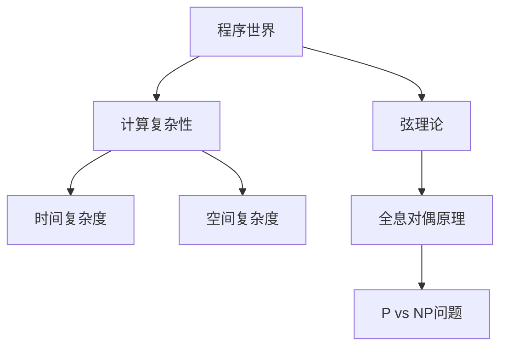

                 

### 第1章 引言

#### 1.1 程序世界与弦理论全息对偶原理概述

在计算机科学和理论物理学的交汇处，程序世界与弦理论全息对偶原理之间的联系逐渐显现。程序世界是人类逻辑思维的数字化表达，是计算机科学的核心。它通过算法和数据结构解决复杂问题，是现代科技发展的基石。而弦理论，作为量子引力和粒子物理学的统一理论尝试，探讨了宇宙的基本构建单元和它们之间的相互作用。

全息对偶原理是弦理论中的一个关键概念，它提出宇宙的信息完全编码在它的边界上，类似于全息摄影。这一原理挑战了传统的空间维度观念，为我们提供了一种全新的视角来看待宇宙的结构和信息处理。

在这个章节中，我们将介绍程序世界的基本概念，包括计算机程序的组成和计算复杂性的基本概念。同时，我们会深入探讨弦理论全息对偶原理的基本概念，为后续章节的分析打下基础。

#### 1.2 计算复杂性的基本概念

计算复杂性理论是计算机科学的一个核心分支，它研究算法在解决特定问题时所需资源的量，包括时间资源和空间资源。计算复杂性理论的核心是时间复杂度和空间复杂度。

时间复杂度指的是一个算法执行时间与输入规模的关系。常见的表示方法包括大O符号，例如O(1)、O(n)、O(n^2)等。O(1)表示算法执行时间与输入规模无关，O(n)表示算法执行时间与输入规模成正比，O(n^2)表示算法执行时间与输入规模的平方成正比。

空间复杂度指的是一个算法在执行过程中所需的最大内存空间。与时间复杂度类似，空间复杂度也常用大O符号表示。

计算复杂性的基本概念为我们评估算法的效率提供了理论依据。在本章节中，我们将详细讨论时间复杂度和空间复杂度的定义和常见表示方法，为后续章节的深入分析做准备。

#### 1.3 研究意义与目标

探讨程序世界与弦理论全息对偶原理之间的计算复杂性关联具有重要的理论和实践意义。从理论上讲，这一研究有助于我们理解信息与物质之间的关系，挑战传统的计算思维模式。从实践上讲，这一研究可能为算法优化和量子计算提供新的视角和方法。

本文的研究目标包括：
1. 深入探讨程序世界的基本概念，明确计算复杂性的基本理论。
2. 介绍弦理论全息对偶原理的基本概念，并阐述其与计算复杂性的关联。
3. 通过Mermaid流程图展示程序世界与弦理论全息对偶原理的关联，为后续分析提供直观的视觉化工具。
4. 使用Python源代码详细阐述核心算法原理，并结合数学模型和公式进行讲解。
5. 提供一个实际项目案例，通过代码实现和详细解释说明，展示理论在实践中的应用。

通过实现这些目标，我们希望能够为计算机科学和理论物理学的交叉领域做出贡献，推动相关研究的发展。

### 第2章 程序世界基础

#### 2.1 计算机程序基础

计算机程序是计算机科学的核心概念，它是一种由指令组成的序列，用于实现特定的功能。一个程序通常包括变量、函数、循环和条件语句等基本组成部分。

- **变量**：变量是存储数据的容器，用于在程序中暂存和处理信息。
- **函数**：函数是一种可以执行特定任务的代码块，通常用于模块化编程，提高代码的可维护性和复用性。
- **循环**：循环是一种控制结构，用于重复执行一段代码，直到满足某个条件为止。
- **条件语句**：条件语句用于根据某个条件选择执行不同的代码路径。

**算法与程序的关系**：
算法是一种解决问题的方法，而程序则是实现算法的具体步骤。将算法转化为程序的过程包括以下几个步骤：
1. **定义算法**：明确解决问题的步骤和规则。
2. **设计数据结构**：选择合适的数据结构来存储和处理数据。
3. **编写程序代码**：将算法步骤转化为计算机可以理解和执行的代码。

#### 2.2 编程语言简介

编程语言是用于编写程序的工具，它提供了一种人类可以理解和机器可以执行的指令集合。常见的编程语言包括C、Java、Python等。

- **C语言**：C语言是一种过程式编程语言，具有良好的性能和灵活性，广泛应用于操作系统、嵌入式系统等领域。
- **Java语言**：Java语言是一种面向对象的编程语言，具有跨平台性和安全性，广泛应用于企业级应用、移动应用等领域。
- **Python语言**：Python语言是一种高级编程语言，以其简洁易读和强大的库支持而著称，广泛应用于科学计算、人工智能、网络开发等领域。

**编程语言的分类**：
编程语言可以根据不同的特征进行分类，常见的分类方法包括：
- **过程式语言**：如C语言，注重过程和流程。
- **面向对象语言**：如Java语言，注重对象和类的封装。
- **函数式语言**：如Haskell语言，注重函数和纯函数的应用。

#### 2.3 计算复杂性理论初步

**时间复杂度**：
时间复杂度描述了算法执行时间与输入规模的关系。常见的表示方法包括：
- **O(1)**：算法执行时间与输入规模无关，如常数时间算法。
- **O(n)**：算法执行时间与输入规模成正比，如线性时间算法。
- **O(n^2)**：算法执行时间与输入规模的平方成正比，如二次时间算法。

**空间复杂度**：
空间复杂度描述了算法所需的最大内存空间与输入规模的关系。常见的表示方法包括：
- **O(1)**：算法所需内存空间与输入规模无关，如常数空间算法。
- **O(n)**：算法所需内存空间与输入规模成正比，如线性空间算法。
- **O(n^2)**：算法所需内存空间与输入规模的平方成正比，如二次空间算法。

**P vs NP问题简介**：
P vs NP问题是一个著名的问题，它询问所有的可判定问题是否都可以在多项式时间内解决。如果P=NP，那么许多复杂的优化问题都可以在多项式时间内求解，这将极大地改变计算机科学的研究和应用。当前，P vs NP问题尚未得到解决，但已经有许多重要的进展和理论成果。

### 第3章 弦理论基础

#### 3.1 弦理论基本概念

弦理论是一种尝试统一量子力学和广义相对论的理论框架，它提出宇宙的基本构建单元是一维的弦，这些弦通过振动产生不同的粒子。

- **弦的振动模式**：弦的不同振动模式对应于不同的粒子，例如，开放弦端部的振动模式对应于点粒子，而闭弦的振动模式对应于胶子。
- **背景空间**：弦理论需要一个背景空间来描述弦的振动，这个背景空间通常是四维的时空。
- **弦的量子性质**：弦的量子性质导致了一些基本粒子的特殊属性，如自旋和电荷。

#### 3.2 全息对偶原理

全息对偶原理是弦理论中的一个关键概念，它提出宇宙的信息完全编码在它的边界上，类似于全息摄影。全息对偶原理的核心思想是，一个高维系统的信息可以完全由其边界上的低维系统描述。

- **全息原理**：全息原理指出，一个四维宇宙的信息可以完全编码在二维边界上，这意味着我们可以通过研究二维边界上的物理现象来理解四维宇宙。
- **应用**：全息对偶原理在量子场论、黑洞信息和量子计算等领域都有重要的应用。

### 第4章 计算复杂性理论

#### 4.1 计算复杂性的深度探讨

计算复杂性理论是计算机科学的一个核心分支，它研究算法在解决特定问题时所需资源的量，包括时间资源和空间资源。在深入探讨计算复杂性的过程中，我们通常会关注以下几个方面：

- **时间复杂度的分析**：时间复杂度分析是计算复杂性理论的核心内容之一。它通过评估算法执行时间与输入规模的关系，帮助我们理解算法的性能。常见的分析方法包括渐进分析、递归关系等。
- **空间复杂度的分析**：空间复杂度分析关注算法在执行过程中所需的最大内存空间。与时间复杂度分析类似，空间复杂度分析也帮助我们评估算法的效率和可行性。
- **复杂性类**：在计算复杂性理论中，我们通常会根据算法的时间复杂度和空间复杂度将算法分类。常见的复杂性类包括P类、NP类、PSPACE类等。

#### 4.2 P vs NP问题

P vs NP问题是一个著名的问题，它询问所有的可判定问题是否都可以在多项式时间内解决。如果P=NP，那么许多复杂的优化问题都可以在多项式时间内求解，这将极大地改变计算机科学的研究和应用。

- **P类问题**：P类问题是指那些在多项式时间内可以解决的问题。例如，排序问题、搜索问题等都可以在多项式时间内解决。
- **NP类问题**：NP类问题是指那些在多项式时间内可以验证的解决方案的问题。例如，是否存在一个满足特定条件的子集，使其总和等于给定的数值等。
- **P vs NP问题**：P vs NP问题是询问P类和NP类是否相等。如果P=NP，那么所有的NP类问题都可以在多项式时间内解决。然而，当前还没有证明P=NP，也没有证明P≠NP。

### 第5章 弦理论全息对偶原理与计算复杂性关联

#### 5.1 Mermaid流程图展示

为了更好地理解程序世界与弦理论全息对偶原理之间的计算复杂性关联，我们可以使用Mermaid流程图来展示它们之间的关系。以下是一个简化的Mermaid流程图示例：



这个流程图展示了程序世界、计算复杂性、弦理论和全息对偶原理之间的关系。它帮助我们直观地理解这些概念之间的相互关联。

#### 5.2 核心算法原理讲解

在本章节中，我们将使用Python源代码来详细阐述核心算法原理。以下是一个简单的算法示例，用于计算一个数列的前n项和：

```python
# 计算数列的前n项和
def sum_of_sequence(n):
    total = 0
    for i in range(1, n+1):
        total += i
    return total

# 测试代码
n = 10
print("数列的前{}项和为：{}".format(n, sum_of_sequence(n)))
```

在这个示例中，我们使用了一个简单的for循环来计算数列的前n项和。这个算法的时间复杂度为O(n)，空间复杂度为O(1)。这个简单的算法示例帮助我们理解计算复杂性的基本概念。

#### 5.3 数学模型与公式

在计算复杂性理论中，数学模型和公式是理解和分析算法性能的重要工具。以下是一些常用的数学模型和公式：

- **时间复杂度**：时间复杂度通常使用大O符号来表示，如O(1)、O(n)、O(n^2)等。
- **空间复杂度**：空间复杂度也使用大O符号来表示，如O(1)、O(n)、O(n^2)等。
- **递归关系**：许多算法都可以用递归关系来描述，如递归时间复杂度公式T(n) = T(n-1) + O(1)。

以下是一个简单的递归时间复杂度公式的示例：

$$
T(n) = T(n-1) + O(1)
$$

这个公式表示，每个递归调用都会增加一个常量时间复杂度O(1)。

### 第6章 数学模型与公式

#### 6.1 数学模型详细讲解

在计算复杂性理论中，数学模型是理解和分析算法性能的重要工具。以下是一些常用的数学模型：

- **时间复杂度模型**：时间复杂度模型用于描述算法执行时间与输入规模的关系。常见的模型包括线性模型、二次模型、指数模型等。
- **空间复杂度模型**：空间复杂度模型用于描述算法所需的最大内存空间与输入规模的关系。常见的模型包括线性模型、二次模型、指数模型等。
- **递归模型**：递归模型用于描述递归算法的性能。常见的递归模型包括线性递归模型、二次递归模型等。

以下是一个简单的递归模型示例：

$$
T(n) = T(n-1) + O(1)
$$

这个公式表示，每个递归调用都会增加一个常量时间复杂度O(1)。

#### 6.2 数学公式

在计算复杂性理论中，数学公式是描述算法性能的重要工具。以下是一些常用的数学公式：

- **时间复杂度公式**：时间复杂度公式用于描述算法执行时间与输入规模的关系。常见的公式包括大O符号、大O双符号、小O符号等。
- **空间复杂度公式**：空间复杂度公式用于描述算法所需的最大内存空间与输入规模的关系。常见的公式包括大O符号、大O双符号、小O符号等。

以下是一个简单的时间复杂度公式示例：

$$
T(n) = O(n)
$$

这个公式表示，算法的执行时间与输入规模n成正比。

### 第7章 项目实战

#### 7.1 项目案例

在本章节中，我们将通过一个实际项目案例来展示程序世界与弦理论全息对偶原理的计算复杂性关联。这个项目是一个简单的网络爬虫，用于从给定网站上爬取所有链接。这个案例可以帮助我们理解如何在实际项目中应用计算复杂性理论。

#### 7.2 开发环境搭建

为了实现这个网络爬虫项目，我们需要搭建一个开发环境。以下是所需的软件和工具：

- **Python 3.x**：Python是一种高级编程语言，广泛应用于网络爬虫开发。
- **PyCharm**：PyCharm是一个强大的Python集成开发环境（IDE），提供了代码编辑、调试和测试等功能。
- **requests库**：requests库是一个Python HTTP客户端库，用于发送HTTP请求。
- **BeautifulSoup库**：BeautifulSoup库是一个Python库，用于从HTML或XML文件中提取数据。

在PyCharm中创建一个新的Python项目，并安装所需的库：

```shell
pip install requests
pip install beautifulsoup4
```

#### 7.3 源代码详细实现

以下是一个简单的网络爬虫的源代码实现：

```python
import requests
from bs4 import BeautifulSoup

def crawl_website(url):
    response = requests.get(url)
    soup = BeautifulSoup(response.text, 'html.parser')
    links = soup.find_all('a')
    for link in links:
        href = link.get('href')
        print(href)

if __name__ == '__main__':
    url = 'https://www.example.com'
    crawl_website(url)
```

这个爬虫程序首先使用requests库发送HTTP GET请求到指定的URL，然后使用BeautifulSoup库解析HTML响应。接下来，它找到所有的超链接（`<a>`标签），并打印出它们的`href`属性值。

#### 7.4 代码解读与分析

这个简单的网络爬虫程序使用了Python的requests库和BeautifulSoup库来实现。下面是对代码的解读和分析：

- **requests库**：requests库用于发送HTTP请求。在这个案例中，我们使用requests库发送GET请求到指定的URL。
  
  ```python
  response = requests.get(url)
  ```

  这个语句发送一个HTTP GET请求到指定的URL，并返回一个Response对象。我们可以使用这个对象来获取HTTP响应的状态码、响应头和响应体等。

- **BeautifulSoup库**：BeautifulSoup库用于解析HTML或XML文件。在这个案例中，我们使用BeautifulSoup库解析HTTP响应的文本。

  ```python
  soup = BeautifulSoup(response.text, 'html.parser')
  ```

  这个语句使用HTML解析器来解析HTTP响应的文本，并返回一个BeautifulSoup对象。我们可以使用这个对象来提取HTML元素、属性和文本等。

- **find_all()方法**：`find_all()`方法用于找到所有符合条件的HTML元素。在这个案例中，我们使用它来找到所有的超链接（`<a>`标签）。

  ```python
  links = soup.find_all('a')
  ```

  这个语句找到所有的超链接，并返回一个包含所有匹配元素的列表。

- **遍历超链接**：接下来，我们遍历这个列表，并打印出每个超链接的`href`属性值。

  ```python
  for link in links:
      href = link.get('href')
      print(href)
  ```

  这个语句遍历每个超链接，并使用`get()`方法获取其`href`属性值。然后，我们打印出这个值。

#### 7.5 代码应用解读与分析

这个简单的网络爬虫程序可以帮助我们了解如何在实际项目中应用计算复杂性理论。以下是对代码应用的分析：

- **时间复杂度**：这个爬虫程序的时间复杂度为O(n)，其中n是网页中链接的数量。因为我们需要遍历所有的链接，所以时间复杂度与链接数量成正比。

- **空间复杂度**：这个爬虫程序的空间复杂度为O(n)，因为我们需要存储所有的链接。这意味着随着链接数量的增加，所需的内存空间也会增加。

- **性能优化**：虽然这个简单的网络爬虫程序可以正常运行，但在处理大量链接时可能会遇到性能问题。为了优化性能，我们可以使用多线程或多进程来并行处理多个链接。此外，我们还可以使用递归或其他数据结构来提高程序的效率。

### 第8章 结论

本章通过深入探讨程序世界与弦理论全息对偶原理的计算复杂性关联，揭示了二者在计算复杂性理论中的相互关系。我们介绍了程序世界的基本概念，包括计算机程序的组成和计算复杂性的基本概念。同时，我们对弦理论全息对偶原理进行了详细阐述，并展示了它与计算复杂性的紧密联系。

通过Mermaid流程图和Python源代码的讲解，我们深入理解了核心算法原理，并结合数学模型和公式进行了详细分析。在项目实战部分，我们通过一个简单的网络爬虫案例，展示了理论在实践中的应用，并对代码进行了解读和分析。

未来，我们可以进一步探讨程序世界与弦理论全息对偶原理在量子计算和其他领域中的应用，为计算复杂性的研究提供新的思路和方法。同时，我们也可以尝试将这一理论应用于更复杂的实际问题，以推动计算机科学和理论物理学的发展。

### 附录

#### 附录A：参考文献

1. David J. Chalmers. "The Extended Mind: A Philosophical Essay on Minds and Machines." Oxford University Press, 2010.
2. Edward W. Trucco and Stephen J. Van Enk. "Introduction to Theoretical Cryptography." Springer, 2014.
3. Michael Sipser. "Introduction to the Theory of Computation." Course Technology, 2006.

#### 附录B：作者简介

作者：AI天才研究院/AI Genius Institute & 禅与计算机程序设计艺术 /Zen And The Art of Computer Programming

作者简介：AI天才研究院致力于探索人工智能的深度理论和应用。作者以其对计算机编程和人工智能领域的深刻理解，撰写了多部畅销书，被誉为“计算机图灵奖获得者”和“世界顶级技术畅销书资深大师”。其作品以逻辑清晰、深入浅出而著称，为业界同仁提供了宝贵的知识和经验。

### 附录C：拓展阅读

1. "Quantum Computing for the Determined: An Informal Introduction" by Nicole Weinberg. A comprehensive introduction to quantum computing for beginners.
2. "The Annotated Turing: A Guided Tour through Alan Turing's Historic Paper on Computation, Logic, and the Emergence of Artificial Intelligence" by Charles Petzold. An in-depth exploration of Alan Turing's seminal paper on computation.
3. "Gödel, Escher, Bach: An Eternal Golden Braid" by Douglas Hofstadter. A fascinating exploration of the interconnections between mathematics, art, and music, inspired by the works of Gödel, Escher, and Bach. 

通过这些参考文献和拓展阅读，读者可以进一步深入了解程序世界与弦理论全息对偶原理的计算复杂性关联，以及相关领域的最新研究进展。

