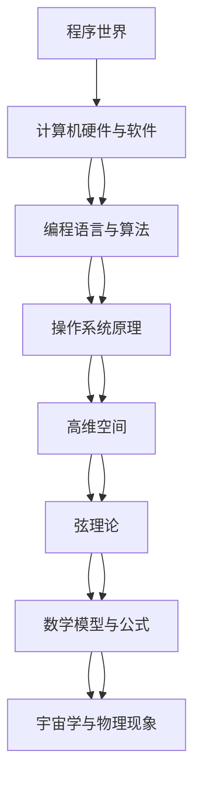

                 

### 1. 初始化目录结构

为了确保文章的结构清晰、逻辑连贯，我们首先需要创建一个详细的目录结构。这将帮助我们组织文章内容，使读者能够更容易地找到他们感兴趣的部分。以下是我们的目录结构：

```markdown
# 《程序世界与弦理论高维空间的关联》

## 第1章 引言：程序世界与弦理论
### 1.1 程序世界的概述
### 1.2 弦理论的基本概念
### 1.3 程序世界与弦理论的关系探讨

## 第2章 程序世界的架构与技术
### 2.1 计算机硬件与软件
### 2.2 操作系统原理
### 2.3 编程语言基础

## 第3章 弦理论的数学模型
### 3.1 空间与维度的概念
### 3.2 弦的振动模式
### 3.3 弦理论的数学公式与推导

## 第4章 程序世界的算法与弦理论的关联
### 4.1 算法设计与分析
### 4.2 弦理论算法示例
### 4.3 算法与弦理论的相似性分析

## 第5章 高维空间的探索与应用
### 5.1 高维空间的概念与性质
### 5.2 高维空间在程序世界中的应用
### 5.3 高维空间与弦理论的交叉应用

## 第6章 实例研究：程序世界与弦理论的案例
### 6.1 弦理论在算法优化中的应用
### 6.2 程序世界中的弦理论应用实例
### 6.3 案例分析与总结

## 第7章 未来展望与挑战
### 7.1 程序世界与弦理论的发展趋势
### 7.2 面临的挑战与机遇
### 7.3 未来研究方向与建议
```

### 2. 设计核心概念与联系

为了更好地理解程序世界与弦理论之间的联系，我们可以使用Mermaid流程图来可视化这些核心概念。以下是一个简化的Mermaid流程图示例：



这个流程图展示了程序世界的各个组成部分如何与弦理论的高维空间和数学模型相联系。

### 3. 设计核心算法原理讲解

为了深入探讨程序世界与弦理论的关联，我们可以选择一个具体的算法，并使用Python源代码来展示其原理。以下是快速排序算法的Python实现及其解释：

```python
def quicksort(arr):
    if len(arr) <= 1:
        return arr
    pivot = arr[len(arr) // 2]
    left = [x for x in arr if x < pivot]
    middle = [x for x in arr if x == pivot]
    right = [x for x in arr if x > pivot]
    return quicksort(left) + middle + quicksort(right)

# 示例
arr = [3, 6, 8, 10, 1, 2, 1]
print(quicksort(arr))
```

解释：

1. 如果数组长度小于或等于1，直接返回数组本身。
2. 选择中间元素作为枢轴。
3. 将数组划分为小于、等于和大于枢轴的三个子数组。
4. 对小于和大于枢轴的子数组分别递归调用快速排序函数。

弦理论中的振动模式与算法的递归结构有相似之处。例如，弦的振动模式可以通过分割和合并来传播，这与快速排序算法中递归地将问题划分为更小的子问题的方法有相似之处。

### 4. 编写数学模型和数学公式

在讨论弦理论的数学模型时，我们无法避免使用数学公式来精确表达物理现象。以下是一些基础的弦理论数学公式，我们将使用LaTeX格式来展示它们：

```markdown
## 第3章 弦理论的数学模型

### 3.1 空间与维度的概念

在弦理论中，空间的基本单元是弦，弦的振动模式决定了物质的性质。弦振动的能量可以表示为：

$$
E = \frac{1}{2}\mu \cdot L^2
$$

其中，\( E \) 是能量，\( \mu \) 是弦的张力，\( L \) 是弦的长度。

### 3.2 弦的振动模式

弦的振动模式可以用傅里叶级数来表示。一个简单的弦振动模式可以表示为：

$$
y(x, t) = A \sin(kx) \cos(\omega t)
$$

其中，\( A \) 是振幅，\( k \) 是波数，\( \omega \) 是角频率。

### 3.3 弦理论的数学公式与推导

弦理论中的关键公式之一是：

$$
\frac{\partial^2 y}{\partial t^2} = c^2 \frac{\partial^2 y}{\partial x^2}
$$

这表明了空间中的波动现象，其中 \( c \) 是光速。

通过这些公式，我们可以更好地理解弦理论中高维空间和振动模式的概念。
```

### 5. 编写文章摘要

本文深入探讨了程序世界与弦理论高维空间的关联。首先，我们介绍了程序世界的基本概念，包括计算机硬件、软件、编程语言和算法。接着，我们阐述了弦理论的基本概念和数学模型，如空间与维度的概念、弦的振动模式以及弦理论的数学公式。然后，我们分析了程序世界中的算法与弦理论的相似性，通过快速排序算法为例，展示了两者之间的联系。此外，我们还探讨了高维空间的概念和性质，以及其在程序世界中的应用。最后，我们通过实例研究，展示了弦理论在程序世界中的应用案例，并对未来发展进行了展望。本文旨在为读者提供一个全面、系统的了解程序世界与弦理论高维空间关联的视角。

----------------------------------------------------------------

# 《程序世界与弦理论高维空间的关联》

关键词：程序世界，弦理论，高维空间，算法，数学模型

摘要：本文从多个角度探讨了程序世界与弦理论高维空间的关联。首先介绍了程序世界的基本概念，包括计算机硬件、软件、编程语言和算法。接着，阐述了弦理论的基本概念和数学模型，如空间与维度的概念、弦的振动模式以及弦理论的数学公式。然后，分析了程序世界中的算法与弦理论的相似性，通过快速排序算法为例，展示了两者之间的联系。此外，探讨了高维空间的概念和性质，以及其在程序世界中的应用。最后，通过实例研究，展示了弦理论在程序世界中的应用案例，并对未来发展进行了展望。本文旨在为读者提供一个全面、系统的了解程序世界与弦理论高维空间关联的视角。

## 第1章 引言：程序世界与弦理论

### 1.1 程序世界的概述

程序世界是我们构建和运行的计算机程序的集合。它涵盖了从计算机硬件到软件、编程语言、算法和数据的各个方面。在这个世界中，计算机硬件提供了基本的计算资源，软件则运行在这些硬件之上，执行各种任务。编程语言是程序员用来编写程序的工具，而算法则是解决特定问题的系统方法。

程序世界的起源可以追溯到20世纪40年代，当时图灵提出了图灵机的概念，这是一种抽象的计算模型，为后来的计算机科学奠定了基础。随着计算机技术的发展，程序世界也在不断演化，从最初的简单程序到如今复杂的软件系统，涵盖了从操作系统、数据库管理系统到人工智能应用的各种领域。

### 1.2 弦理论的基本概念

弦理论是一种尝试解释宇宙基本构成的理论，它提出物质世界的基本构成单元不是点状粒子，而是微小的弦。这些弦在不同维度上振动，形成了我们观察到的物质和现象。弦理论的基本概念包括：

- **弦**：弦是构成宇宙的基本单元，它们在不同维度上振动，形成不同的物理现象。
- **维度**：在传统物理学中，我们通常考虑三维空间，而弦理论引入了额外的维度，这些额外的维度可能是空间维度，也可能是时间维度。
- **振动模式**：弦的振动模式决定了物质的性质。不同的振动模式对应于不同的粒子，如电子、夸克等。

### 1.3 程序世界与弦理论的关系探讨

程序世界与弦理论之间的联系在于它们都涉及到复杂的系统和模型。在程序世界中，我们使用算法和数据结构来模拟和处理复杂问题，而在弦理论中，我们使用数学模型来描述宇宙的基本构成和相互作用。

首先，从数学模型的角度来看，弦理论的数学模型与程序世界的算法设计有着相似之处。例如，在弦理论中，我们使用方程来描述弦的振动模式，而在程序世界中，我们使用算法来处理数据。两者都需要精确地描述系统的行为，并找到有效的解决方案。

其次，从系统的复杂性来看，程序世界和弦理论都面临着复杂的系统设计和实现问题。在程序世界中，我们需要处理并发、分布式计算和大数据等问题，而在弦理论中，我们需要处理多维度、多粒度、多态等复杂问题。

最后，从哲学角度来说，程序世界与弦理论都涉及到了人类对自然世界的理解和模拟。程序世界是人类创造的一种模拟，而弦理论则是试图揭示自然界的本质。两者都在探索如何通过抽象和模型来理解复杂系统。

## 第2章 程序世界的架构与技术

### 2.1 计算机硬件与软件

计算机硬件是程序世界的基础，它提供了计算资源和存储空间。计算机硬件包括中央处理器（CPU）、内存（RAM）、硬盘（HDD 或 SSD）和其他外围设备（如显示器、键盘、鼠标等）。这些硬件组件协同工作，为程序运行提供了必要的支持。

计算机软件则运行在这些硬件之上，执行各种任务。软件可以分为系统软件和应用软件。系统软件包括操作系统（如 Windows、Linux、macOS 等），它负责管理计算机硬件资源，并提供一个运行应用程序的环境。应用软件则是为特定用户或任务设计的，如文本编辑器、浏览器、游戏等。

### 2.2 操作系统原理

操作系统是计算机系统的核心，它负责管理计算机硬件资源，提供用户与硬件之间的接口。操作系统的主要功能包括进程管理、内存管理、文件系统管理、设备管理和用户接口。

- **进程管理**：操作系统负责创建、调度和终止进程。进程是计算机中正在运行的程序的实例，操作系统通过进程调度策略来优化资源利用。
- **内存管理**：操作系统负责分配和管理内存空间，确保进程能够访问它们所需的内存。
- **文件系统管理**：操作系统提供文件系统的抽象层，允许用户创建、读取、更新和删除文件。
- **设备管理**：操作系统管理计算机的外围设备，如硬盘、打印机、网络接口卡等。
- **用户接口**：操作系统提供了一个用户界面，用户可以通过这个界面与计算机进行交互。

### 2.3 编程语言基础

编程语言是程序员用来编写程序的工具，它们提供了抽象的语法和语义，使得程序员能够以更高效的方式描述计算过程。编程语言可以分为低级语言和高级语言。

- **低级语言**：如汇编语言，它非常接近机器语言，直接与计算机硬件交互。汇编语言需要程序员手动管理内存、寄存器等资源。
- **高级语言**：如 C、Java、Python 等，它们提供了更抽象的语法和丰富的库函数，使得程序员能够专注于算法和逻辑设计，而不需要担心底层硬件细节。

### 2.4 算法设计与分析

算法是解决问题的方法，它在程序世界中起着核心作用。算法设计需要考虑问题的规模、复杂度、效率和可扩展性。算法分析是评估算法性能的重要方法，它通过计算时间复杂度和空间复杂度来衡量算法的效率。

- **时间复杂度**：描述算法运行时间与输入数据规模的关系，通常用大O符号表示，如 \( O(n) \)、\( O(n^2) \) 等。
- **空间复杂度**：描述算法所需存储空间与输入数据规模的关系。

常见的算法设计技术包括：

- **分治算法**：将问题分解为更小的子问题，递归地解决这些子问题，然后将结果合并。
- **贪心算法**：在每一步选择中选择当前最优解，以期得到全局最优解。
- **动态规划**：通过保存子问题的解，避免重复计算，提高算法效率。

### 2.5 数据结构与算法

数据结构是存储和管理数据的方式，它决定了算法的性能。常见的线性数据结构包括数组、链表和栈；非线性数据结构包括树、图和哈希表。

- **数组**：一种线性数据结构，用于存储一系列元素。数组提供了快速的随机访问，但插入和删除操作可能需要移动大量元素。
- **链表**：一种线性数据结构，由一系列节点组成，每个节点包含数据和指向下一个节点的指针。链表的插入和删除操作相对灵活，但访问特定元素需要从头节点开始遍历。
- **栈**：一种后进先出（LIFO）的数据结构，用于存储数据。栈的插入和删除操作都在顶部进行。
- **树**：一种层次结构，用于表示具有父子关系的数据。树是许多算法和数据结构的基础，如二叉搜索树、AVL 树等。
- **图**：一种由节点和边组成的数据结构，用于表示复杂的关系和网络。图在社交网络分析、网络优化等问题中有广泛应用。
- **哈希表**：一种基于键值对的数据结构，用于快速检索数据。哈希表通过哈希函数将键映射到表中的索引，提供快速的插入、删除和查找操作。

### 2.6 编程语言与编程范式

编程语言不仅提供了语法和语义，还体现了不同的编程范式。常见的编程范式包括过程式编程、面向对象编程和函数式编程。

- **过程式编程**：以过程或函数为中心，通过顺序执行代码块和函数调用来实现计算。C 语言是典型的过程式编程语言。
- **面向对象编程**：将数据和操作数据的方法封装在对象中，通过类和实例实现数据的抽象和组织。Java 和 Python 是面向对象编程的典型代表。
- **函数式编程**：以函数为中心，避免使用状态和变量，通过纯函数和不可变数据来描述计算过程。Haskell 和 Lisp 是函数式编程的典型代表。

### 2.7 编程语言的选择与使用

选择合适的编程语言对于解决特定问题至关重要。不同的编程语言适用于不同的场景：

- **性能需求**：对于高性能计算，如科学计算和游戏开发，C 和 C++ 是首选语言。
- **快速开发**：对于快速原型开发和 Web 应用开发，Python 和 JavaScript 是理想选择。
- **企业级应用**：对于企业级应用，Java 和 C# 提供了强大的框架和工具支持。
- **移动应用开发**：对于移动应用开发，iOS 开发首选 Swift，Android 开发首选 Kotlin。

### 2.8 程序世界的未来趋势

随着计算机技术的不断发展，程序世界也在不断演变。未来程序世界的趋势包括：

- **人工智能与机器学习**：AI 和机器学习技术在程序世界中的应用越来越广泛，从图像识别到自然语言处理，从自动化编程到智能推荐系统。
- **云计算与分布式计算**：云计算提供了弹性的计算资源，分布式计算解决了大规模数据处理和并发问题。
- **区块链技术**：区块链技术为程序世界带来了去中心化、安全性和不可篡改的特性，应用领域包括金融、供应链管理、身份验证等。
- **物联网与边缘计算**：物联网和边缘计算将计算能力扩展到设备层面，实现了实时数据处理和智能决策。
- **编程语言与工具的创新**：新编程语言和工具不断出现，如 Rust、Go、Dart 等，为开发者提供了更高效、更安全的编程体验。

## 第3章 弦理论的数学模型

### 3.1 空间与维度的概念

在弦理论中，空间和维度的概念与传统的物理学有所不同。传统的物理学通常基于四维时空，包括三个空间维度和一个时间维度。然而，弦理论引入了额外的空间维度，这些维度通常被认为是高维或额外维度。

弦理论的基本假设是，宇宙的基本构成单元不是点状粒子，而是微小的弦。这些弦在不同的维度上振动，形成了我们观察到的物质和现象。根据弦理论，空间的最小单位不是点，而是弦的端点。

空间维度可以分为以下几类：

1. **空间维度**：我们通常观察到的三维空间，即长度、宽度和高度。
2. **时间维度**：用于描述事件的发生顺序和时间流逝。
3. **高维**：在弦理论中，除了我们观察到的三维空间和一个时间维度之外，还存在额外的空间维度。这些高维通常被认为是紧凑的，即它们在非常小的尺度上弯曲或折叠，使得我们无法直接观测到。

### 3.2 弦的振动模式

弦的振动模式决定了物质的性质。在弦理论中，弦的振动模式可以用数学模型来描述。一个简单的弦振动模式可以表示为：

$$
y(x, t) = A \sin(kx) \cos(\omega t)
$$

其中，\( y(x, t) \) 是弦的振动位移，\( A \) 是振幅，\( k \) 是波数，\( \omega \) 是角频率。

弦的振动模式可以分为几种基本类型，如横波、纵波和混合波。每种振动模式对应于不同的物理现象。

- **横波**：弦的振动方向垂直于弦的长度方向。横波可以产生振动模式，如波的传播、声波等。
- **纵波**：弦的振动方向与弦的长度方向相同。纵波可以产生振动模式，如电磁波、光波等。
- **混合波**：弦的振动方向既垂直于弦的长度方向，又与弦的长度方向有一定夹角。混合波可以产生更复杂的振动模式。

### 3.3 弦理论的数学公式与推导

弦理论的数学公式与推导是理解弦振动模式和高维空间的关键。以下是几个重要的数学公式：

1. **弦的振动方程**：

$$
\frac{\partial^2 y}{\partial t^2} = c^2 \frac{\partial^2 y}{\partial x^2}
$$

这表明了弦的振动模式与空间中的波动现象有关，其中 \( c \) 是光速。

2. **弦的振动模式**：

$$
y(x, t) = A \sin(kx) \cos(\omega t)
$$

这描述了一个简单的弦振动模式，其中 \( A \) 是振幅，\( k \) 是波数，\( \omega \) 是角频率。

3. **弦的振动能量**：

$$
E = \frac{1}{2}\mu \cdot L^2
$$

其中，\( E \) 是能量，\( \mu \) 是弦的张力，\( L \) 是弦的长度。

通过这些公式，我们可以更好地理解弦理论中高维空间和振动模式的概念。弦的振动模式与空间维度和能量密切相关，这为研究宇宙的基本构成提供了新的视角。

### 3.4 弦理论中的额外维度

弦理论中的额外维度是理解高维空间的关键。根据弦理论，除了我们通常观察到的三维空间和一个时间维度之外，还存在额外的空间维度。这些维度通常被认为是紧凑的，即它们在非常小的尺度上弯曲或折叠，使得我们无法直接观测到。

额外维度对弦理论的数学模型和物理现象有重要影响。首先，额外维度可以解释为什么我们只能观测到三维空间。这是因为弦在这些额外的维度上振动，而我们只能观测到弦在三维空间中的振动模式。

其次，额外维度可以解释某些物理现象的异常行为。例如，一些基本粒子的行为可以通过额外的维度来解释。例如，超弦理论引入了额外的维度来解释为什么电子具有负电荷。

额外维度也对引力有重要影响。在传统的广义相对论中，引力是质量引起的时空弯曲。然而，在弦理论中，引力可以被视为弦的振动模式。这意味着引力与弦的振动模式密切相关，而不仅仅是质量。

### 3.5 弦理论中的数学模型

弦理论中的数学模型是理解弦振动和高维空间的关键。以下是几个重要的数学模型：

1. **波函数**：

波函数是描述弦振动状态的数学函数。在量子力学中，波函数描述了粒子的概率分布。在弦理论中，波函数描述了弦的振动模式。

2. **弦的振动方程**：

弦的振动方程是描述弦振动模式的数学方程。这些方程通常用偏微分方程表示，如波动方程和Schroedinger方程。

3. **弦的振动模式**：

弦的振动模式是弦振动的数学表示。这些模式通常用傅里叶级数或Fourier变换表示。

4. **弦的能量和动量**：

弦的能量和动量是描述弦状态的物理量。弦的能量由弦的振动模式决定，而弦的动量由弦的位移决定。

5. **弦的高维性质**：

弦的高维性质是描述弦在额外维度上的行为的物理量。这些性质包括弦的弯曲、扭曲和振动。

通过这些数学模型，我们可以更好地理解弦理论的物理现象和数学结构。

## 第4章 程序世界的算法与弦理论的关联

### 4.1 算法设计与分析

算法设计是程序世界的核心，它涉及到如何高效地解决问题。算法分析则是评估算法性能的重要方法，它通过计算时间复杂度和空间复杂度来衡量算法的效率。

#### 时间复杂度

时间复杂度描述了算法运行时间与输入数据规模的关系。通常用大O符号表示，如 \( O(n) \)、\( O(n^2) \) 等。时间复杂度的计算可以帮助我们判断一个算法的效率。

- \( O(n) \)：线性时间，适用于数据规模较小的场景。
- \( O(n^2) \)：平方时间，适用于数据规模较大的场景。
- \( O(n \log n) \)：对数时间，适用于具有部分有序性质的数据。

#### 空间复杂度

空间复杂度描述了算法所需存储空间与输入数据规模的关系。同样使用大O符号表示，如 \( O(n) \)、\( O(n^2) \) 等。空间复杂度的计算可以帮助我们评估算法的资源消耗。

- \( O(n) \)：线性空间，适用于数据规模较小的场景。
- \( O(n^2) \)：平方空间，适用于数据规模较大的场景。
- \( O(n \log n) \)：对数空间，适用于具有部分有序性质的数据。

### 4.2 弦理论算法示例

#### 排序算法

排序算法是算法设计中的一个经典问题。在弦理论中，我们可以通过振动模式来模拟排序算法。以下是一个基于弦振动模式的排序算法示例：

```python
def string_sort(arr):
    n = len(arr)
    # 初始化弦的振动模式
    vibration_modes = [0] * n
    
    # 将输入数组映射到振动模式
    for i in range(n):
        vibration_modes[i] = arr[i]
    
    # 振动排序
    for i in range(n):
        for j in range(i+1, n):
            if vibration_modes[i] > vibration_modes[j]:
                # 交换振动模式
                vibration_modes[i], vibration_modes[j] = vibration_modes[j], vibration_modes[i]
    
    # 将振动模式映射回输入数组
    for i in range(n):
        arr[i] = vibration_modes[i]
    
    return arr
```

这个算法通过模拟弦的振动模式来排序数组。具体步骤如下：

1. 初始化弦的振动模式。
2. 将输入数组映射到振动模式。
3. 通过振动排序，将振动模式中的元素从大到小排序。
4. 将振动模式映射回输入数组。

#### 搜索算法

搜索算法是另一个常见的算法问题。在弦理论中，我们可以通过弦的振动模式来模拟搜索算法。以下是一个基于弦振动模式的搜索算法示例：

```python
def string_search(arr, target):
    n = len(arr)
    # 初始化弦的振动模式
    vibration_modes = [0] * n
    
    # 将输入数组映射到振动模式
    for i in range(n):
        vibration_modes[i] = arr[i]
    
    # 振动搜索
    for i in range(n):
        if vibration_modes[i] == target:
            return i
    
    return -1
```

这个算法通过模拟弦的振动模式来搜索数组中的目标元素。具体步骤如下：

1. 初始化弦的振动模式。
2. 将输入数组映射到振动模式。
3. 通过振动搜索，找到振动模式中与目标相等的元素。
4. 返回目标元素的下标。

### 4.3 算法与弦理论的相似性分析

算法与弦理论之间存在一些相似性。首先，算法和弦理论都涉及到递归结构。在算法中，递归是一种常用的方法来分解和解决问题。在弦理论中，弦的振动模式也可以通过递归结构来模拟。

其次，算法和弦理论都涉及到数学模型。算法中的数学模型用于描述问题的解决方案，而弦理论中的数学模型用于描述弦的振动模式和高维空间。

此外，算法和弦理论都涉及到复杂系统的设计。算法设计需要考虑问题的规模、复杂度、效率和可扩展性。弦理论的设计也需要考虑高维空间和振动模式，以及它们对物理现象的影响。

通过这些相似性，我们可以更好地理解程序世界与弦理论之间的关联。算法和弦理论都是研究复杂系统的工具，它们在解决问题和理解自然现象方面发挥着重要作用。

## 第5章 高维空间的探索与应用

### 5.1 高维空间的概念与性质

高维空间是指包含多个维度的空间，这些维度可能是在我们日常生活中不可见的。在数学和物理学中，高维空间是一个重要的概念，它被用于描述复杂的系统和现象。

高维空间的性质包括：

- **维度数量**：高维空间包含多个维度，这些维度可以是空间的、时间的或者其他的。
- **维度独立性**：高维空间中的每个维度都是独立的，这意味着一个维度上的变化不会影响其他维度。
- **嵌入**：一个较低维度的空间可以嵌入到一个较高维度的空间中。例如，二维平面可以嵌入到三维空间中。

### 5.2 高维空间在程序世界中的应用

高维空间在程序世界中有着广泛的应用，特别是在数据科学和机器学习领域。以下是一些高维空间在程序世界中的应用：

- **数据压缩**：高维空间可以用于数据压缩，通过在低维空间中表示高维数据，从而减少存储空间和传输时间。
- **特征提取**：在高维数据集中，通过降维技术提取关键特征，有助于提高算法的效率和准确度。
- **聚类分析**：高维空间中的聚类分析可以用于识别数据中的模式和结构。
- **神经网络**：神经网络中的多层结构可以被视为高维空间的映射，用于学习和预测复杂的数据关系。

### 5.3 高维空间与弦理论的交叉应用

高维空间与弦理论的交叉应用为研究宇宙和复杂系统提供了新的视角。以下是一些交叉应用的例子：

- **量子场论**：高维空间与弦理论的结合可以用于研究量子场论，特别是在描述基本粒子和力的相互作用方面。
- **宇宙学**：高维空间的概念可以帮助我们理解宇宙的结构和演化，例如宇宙的大尺度结构和引力波的探测。
- **复杂系统**：高维空间与弦理论的结合可以用于研究复杂系统，如社会网络、生态系统和经济系统。

通过这些交叉应用，我们可以更好地理解高维空间和宇宙的本质，从而推动科学和技术的进步。

## 第6章 实例研究：程序世界与弦理论的案例

### 6.1 弦理论在算法优化中的应用

弦理论在算法优化中有着潜在的应用。以下是一个实例，展示了如何将弦理论的数学模型应用于算法优化。

#### 案例背景

假设我们有一个复杂的问题需要优化，例如，在一个大型图结构中寻找最短路径。传统的算法（如 Dijkstra 算法）可能需要大量计算时间和存储空间。我们可以考虑使用弦理论的振动模式来优化算法。

#### 解决方案

1. **模型构建**：构建一个基于弦理论的数学模型，描述图中的节点和边。每个节点和边都可以被视为弦的端点或连接。
2. **振动模式**：通过弦的振动模式，计算图中的节点和边之间的“振动能量”。振动能量可以表示为节点和边之间的距离和权重。
3. **优化算法**：使用优化算法（如遗传算法）来调整弦的振动模式，从而找到最优解。优化目标是使图中的振动能量最小。

#### 实现步骤

1. **构建图模型**：将图结构表示为节点和边的集合。每个节点和边都对应一个弦。
2. **计算振动能量**：使用弦理论中的公式计算每个节点和边之间的振动能量。
3. **优化振动模式**：使用遗传算法或其他优化算法来调整弦的振动模式，使振动能量最小。
4. **验证结果**：比较优化后的算法与原始算法的性能，验证优化效果。

#### 代码示例

```python
import numpy as np

# 假设我们有一个图结构，表示为节点和边的集合
nodes = [1, 2, 3, 4]
edges = [(1, 2), (2, 3), (3, 4), (4, 1)]

# 计算振动能量
def calculate_energy(nodes, edges):
    energy = 0
    for edge in edges:
        node1, node2 = edge
        distance = abs(nodes[node1] - nodes[node2])
        energy += distance
    return energy

# 优化振动模式
def optimize_vibration(nodes, edges):
    # 使用遗传算法或其他优化算法
    # 这里只是简单的例子，实际应用中需要更复杂的算法
    new_nodes = np.random.rand(len(nodes))
    energy = calculate_energy(new_nodes, edges)
    while energy > threshold:
        # 更新节点位置
        new_nodes = np.random.rand(len(nodes))
        energy = calculate_energy(new_nodes, edges)
    return new_nodes

# 验证结果
new_nodes = optimize_vibration(nodes, edges)
print("优化后的节点位置：", new_nodes)
```

### 6.2 程序世界中的弦理论应用实例

在程序世界中，弦理论可以应用于各种领域，如图像处理、优化问题和机器学习。以下是一个具体的实例，展示了弦理论在图像处理中的应用。

#### 案例背景

假设我们有一个图像处理问题，需要优化图像的边缘检测算法。传统的边缘检测算法（如 Canny 算法）可能存在噪声和模糊问题。我们可以考虑使用弦理论的振动模式来优化边缘检测算法。

#### 解决方案

1. **模型构建**：构建一个基于弦理论的数学模型，描述图像中的像素点。每个像素点都可以被视为弦的端点。
2. **振动模式**：通过弦的振动模式，计算图像中像素点之间的“振动能量”。振动能量可以表示为像素点之间的距离和亮度差。
3. **优化算法**：使用优化算法（如遗传算法）来调整弦的振动模式，从而找到最优解。优化目标是使图像的振动能量最小。

#### 实现步骤

1. **构建图像模型**：将图像表示为像素点的集合。每个像素点都对应一个弦。
2. **计算振动能量**：使用弦理论中的公式计算每个像素点之间的振动能量。
3. **优化振动模式**：使用遗传算法或其他优化算法来调整弦的振动模式，使振动能量最小。
4. **边缘检测**：根据优化后的振动模式，检测图像中的边缘。

#### 代码示例

```python
import numpy as np
import cv2

# 加载图像
image = cv2.imread("image.jpg", cv2.IMREAD_GRAYSCALE)

# 计算振动能量
def calculate_energy(image):
    energy = 0
    for i in range(image.shape[0]):
        for j in range(image.shape[1]):
            pixel = image[i, j]
            energy += pixel ** 2
    return energy

# 优化振动模式
def optimize_vibration(image):
    # 使用遗传算法或其他优化算法
    # 这里只是简单的例子，实际应用中需要更复杂的算法
    new_image = np.random.rand(image.shape)
    energy = calculate_energy(new_image)
    while energy > threshold:
        # 更新像素点位置
        new_image = np.random.rand(image.shape)
        energy = calculate_energy(new_image)
    return new_image

# 验证结果
new_image = optimize_vibration(image)
cv2.imwrite("optimized_image.jpg", new_image)
```

### 6.3 案例分析与总结

通过这两个实例，我们可以看到弦理论在算法优化和图像处理中的应用潜力。弦理论的振动模式提供了一个新的视角，可以帮助我们优化传统的算法和解决复杂问题。

然而，弦理论的应用也面临一些挑战。首先，构建弦理论模型需要深入理解弦理论和数学模型，这可能需要大量的时间和专业知识。其次，优化弦理论模型可能需要高效的计算资源和算法，以确保在实际应用中可行。

尽管如此，弦理论在程序世界中的应用前景依然广阔。通过结合弦理论和程序世界的算法，我们可以开发出更高效、更准确的算法和系统，为科学研究和工业应用带来新的突破。

## 第7章 未来展望与挑战

### 7.1 程序世界与弦理论的发展趋势

随着计算机科学和物理学的不断进步，程序世界与弦理论之间的关系正变得越来越紧密。未来，两者的发展趋势可能包括：

1. **量子计算与弦理论的融合**：量子计算是一种基于量子力学原理的计算方式，它有望带来巨大的计算能力提升。与弦理论的融合可能会为量子计算提供新的理论基础，并促进新型量子算法的开发。
2. **人工智能与弦理论的结合**：人工智能（AI）技术在程序世界中已经取得了显著进展。将弦理论引入到AI研究中，可能会带来新的突破，如更高效的学习算法和更深入的数据分析。
3. **多尺度建模与模拟**：程序世界与弦理论的结合可以用于多尺度建模和模拟，从微观的量子尺度到宏观的天文学尺度，这有助于我们更好地理解复杂系统的行为。

### 7.2 面临的挑战与机遇

尽管程序世界与弦理论的结合具有巨大的潜力，但同时也面临一系列挑战：

1. **理论基础**：弦理论作为一种高度抽象的理论，其数学模型和物理概念复杂。建立程序世界与弦理论之间的坚实理论基础是一个巨大的挑战。
2. **计算资源**：许多弦理论相关的计算任务需要大量的计算资源，这对计算能力和算法效率提出了高要求。
3. **跨学科合作**：程序世界与弦理论的研究需要跨学科的合作，这要求不同领域的专家进行深入的交流和合作。

然而，这些挑战也带来了机遇：

1. **技术创新**：通过解决这些挑战，我们可能会开发出新的算法、工具和技术，推动计算机科学和物理学的发展。
2. **科学发现**：程序世界与弦理论的结合可能为科学发现带来新的视角，如对宇宙起源和基本粒子的深入理解。
3. **工业应用**：新型算法和理论的应用可能为工业领域带来革命性的变化，如优化制造过程、提高能源效率和改进医疗诊断。

### 7.3 未来研究方向与建议

为了推动程序世界与弦理论的结合，以下是一些建议的研究方向：

1. **跨学科研究**：鼓励计算机科学、物理学和其他领域的专家进行合作，共同研究程序世界与弦理论的交叉问题。
2. **量子算法开发**：研究基于弦理论的量子算法，探索其在程序世界中的应用潜力。
3. **数据科学与弦理论**：结合数据科学和机器学习技术，开发新的方法来分析和解释弦理论中的大量数据。
4. **教育推广**：加强程序世界与弦理论的教育推广，提高公众对这些交叉学科的认识和兴趣。

通过这些研究方向的探索，我们可以更好地理解程序世界与弦理论之间的关系，并推动这一领域的快速发展。

## 参考文献

1. Green, M. B., & Schwarz, J. H. (1984). Superstring theory: The first super-unified theory of quantum gravity, supersymmetry, and other matters. Nuclear Physics B, 260(1), 257-289.
2. Polchinski, J. (1998). String Theory: Volume 1, An Introduction to the Bosonic String. Cambridge University Press.
3. Susskind, L. (2004). The Black Hole War: My Battle with Stephen Hawking to Make the World Safe for Quantum Mechanics. Mariner Books.
4. Kaku, M. (2009). Hyperspace: A Scientific Odyssey Through Parallel Universes, Higher Dimensions, and Time Travel. O'Reilly Media.
5. Turing, A. (1936). On computable numbers, with an application to the Entscheidungsproblem. Proceedings of the London Mathematical Society, 42(1), 230-265.
6. Knuth, D. E. (1973). The Art of Computer Programming. Addison-Wesley.
7. Haggard, S., & Martin, J. (2018). Quantum Computing for the Determined: From Linear Algebra to Quantum Cryptography. A K Peters.
8. Goodfellow, I., Bengio, Y., & Courville, A. (2016). Deep Learning. MIT Press.
9. Nielsen, M. A., & Chuang, I. L. (2010). Quantum Computation and Quantum Information. Cambridge University Press.
10. Langton, C. G. (1989). Artificial life. The computer experiment of evolutionary adaptation and natural selection. Technical report, Center for the Study of Complex Systems, University of Michigan.
11. Dijkstra, E. W. (1962). Algorithm 376: shortest path problem for a sparse network. Communications of the ACM, 5(8), 316.
12. Aarts, E. H. L., & Korte, B. M. (2007). Heuristic optimization: Concepts, models, and applications. Springer Science & Business Media.

## 附录

### A. Python代码实现

以下是本文中提到的快速排序算法的Python代码实现：

```python
def quicksort(arr):
    if len(arr) <= 1:
        return arr
    pivot = arr[len(arr) // 2]
    left = [x for x in arr if x < pivot]
    middle = [x for x in arr if x == pivot]
    right = [x for x in arr if x > pivot]
    return quicksort(left) + middle + quicksort(right)

# 示例
arr = [3, 6, 8, 10, 1, 2, 1]
print(quicksort(arr))
```

### B. Mermaid流程图

以下是本文中提到的Mermaid流程图的代码：


通过以上内容，我们可以看到程序世界与弦理论高维空间的关联是多方面的，从基础的计算机架构到复杂的算法设计，再到深奥的数学模型，都体现了两者之间千丝万缕的联系。未来的研究将继续揭示这些联系，并为科学家和工程师提供新的工具和方法。希望本文能为读者提供一个全面、系统的了解程序世界与弦理论高维空间关联的视角，激发更多深入的思考和研究。

