                 

### 程序世界与循环宇宙模型的类比

#### 关键词
- 程序世界
- 循环宇宙模型
- 类比
- 编程语言
- 算法
- 数据结构
- 计算机体系结构
- 操作系统

#### 摘要
本文旨在通过类比的方式，探讨程序世界与循环宇宙模型之间的相似性。从编程语言的语法、算法的逻辑结构、数据结构的存储与操作，到计算机体系结构与操作系统的运行机制，本文逐步分析了程序世界与循环宇宙模型的核心概念之间的联系。通过这种类比，我们不仅能够更深入地理解计算机编程的本质，也能从宇宙的角度看待程序世界，为未来技术的发展提供新的视角。

### 引言

#### 1.1 程序世界的本质

程序世界是一个抽象的虚拟空间，它由编程语言、算法、数据结构、计算机体系结构和操作系统等要素组成。编程语言是程序员与计算机沟通的桥梁，通过编写代码，程序员能够表达出复杂的逻辑和算法。算法是解决问题的步骤和方法，是程序世界的灵魂。数据结构则是存储和组织数据的方式，它决定了程序的效率。计算机体系结构包括硬件和软件的有机结合，它是计算机正常运行的基础。操作系统则是计算机系统的核心，负责管理计算机的硬件和软件资源，确保程序的正常运行。

#### 1.2 循环宇宙模型的背景

循环宇宙模型是近年来在物理学领域提出的一种新的宇宙观。它认为宇宙是一个循环的过程，时间和空间是循环的，物质和能量在宇宙的循环过程中不断转化和再生。循环宇宙模型的核心理论包括循环时间、循环空间、能量转换和循环再生等。这一理论为我们提供了重新审视宇宙的新视角，也为理解宇宙的演化提供了新的工具。

#### 1.3 本书的目的与结构

本书的目的是通过类比的方式，将程序世界与循环宇宙模型联系起来，探索它们之间的相似性和内在联系。文章将从编程语言、算法、数据结构、计算机体系结构和操作系统五个方面，逐步分析程序世界与循环宇宙模型的核心概念。通过这种类比，我们希望能够揭示程序世界的本质，并为计算机科学的发展提供新的思路。

接下来的章节将按照以下结构展开：

- 第2章：分析程序世界的核心概念，包括编程语言、算法、数据结构与计算机体系结构。
- 第3章：介绍循环宇宙模型的核心理论。
- 第4章：探讨程序世界与循环宇宙模型之间的类比关系。
- 第5章：讨论程序世界对循环宇宙模型的影响，以及循环宇宙模型对程序世界的影响。
- 第6章：通过具体实例展示程序世界与循环宇宙模型的结合。
- 第7章：总结全文，并展望未来的研究方向。

通过这种结构化的分析，我们希望能够让读者对程序世界与循环宇宙模型有一个全面、深入的理解，从而激发对计算机科学和宇宙学的进一步思考。

### 程序世界的核心概念

#### 2.1 编程语言与算法

编程语言是程序世界的基石，它定义了程序员与计算机之间的沟通方式。从汇编语言到高级语言，编程语言的发展经历了多个阶段。每种编程语言都有其独特的语法和语义，但它们的核心目标都是提供一种清晰、高效的表达方式，以解决实际问题。

##### 2.1.1 编程语言的历史与分类

编程语言的发展历程可以追溯到20世纪40年代。最早的编程语言是机器语言，它由二进制代码组成，直接操作计算机的硬件。然而，机器语言难以理解和编写，因此汇编语言应运而生。汇编语言使用助记符代替二进制代码，使得编程变得相对容易。随着时间的推移，高级语言逐渐取代了低级语言，成为主流。

高级语言可以分为三种类型：过程式语言、函数式语言和面向对象语言。过程式语言如C、C++和Java，强调过程和函数，通过流程控制结构实现复杂逻辑。函数式语言如Haskell和Lisp，以函数为单位进行编程，避免了状态的变化和副作用。面向对象语言如Python和Java，通过类和对象实现封装、继承和多态，提高了代码的可重用性和可维护性。

##### 2.1.2 算法的原理与分类

算法是程序世界的心脏，它定义了解决问题的步骤和方法。算法的核心思想是逻辑思维和数学模型的应用，通过一系列有序的步骤，将输入转化为预期的输出。

算法可以按照不同的标准进行分类。根据解决问题的策略，算法可以分为贪婪算法、动态规划算法、回溯算法等。根据计算复杂性，算法可以分为线性算法、对数算法、多项式算法等。此外，根据算法的设计理念，算法可以分为确定性算法和非确定性算法。

核心概念之间的关系可以用以下Mermaid流程图表示：

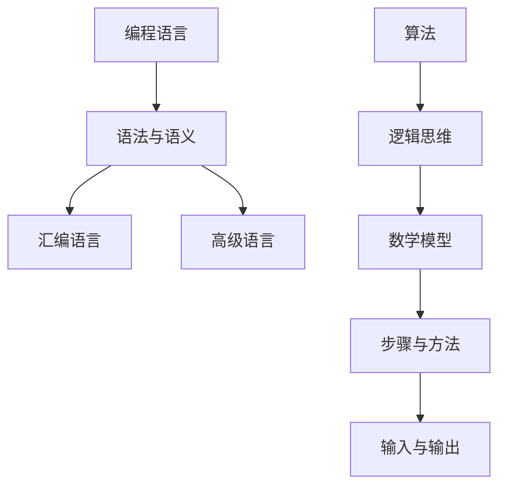

#### 2.2 数据结构与存储

数据结构是程序世界中用于存储和组织数据的方式，它决定了程序的效率和性能。合理选择和使用数据结构，能够大大提高程序的性能和可维护性。

##### 2.2.1 数据结构的定义与类型

数据结构是指数据对象在计算机中的表示和组织方法。常见的数据结构包括线性结构（如数组、链表、栈和队列）、树形结构（如二叉树、堆和平衡树）和图形结构（如图和网络）。

线性结构的主要特点是元素之间一一对应，每个元素只有一个前驱和一个后继。树形结构的主要特点是层次结构，每个节点可以有多个子节点。图形结构的主要特点是节点之间的复杂关系，节点之间的连接可以是有向的或无向的。

##### 2.2.2 存储方式与优化策略

数据结构的存储方式主要包括顺序存储和链式存储。顺序存储使用数组或连续的内存空间，便于随机访问，但空间利用率较低。链式存储使用链表，空间利用率较高，但访问速度较慢。

优化策略包括空间优化和时间优化。空间优化主要通过减少内存占用、使用位运算等方式实现。时间优化主要通过选择合适的数据结构、优化算法时间复杂度等方式实现。

核心概念之间的关系可以用以下Mermaid流程图表示：

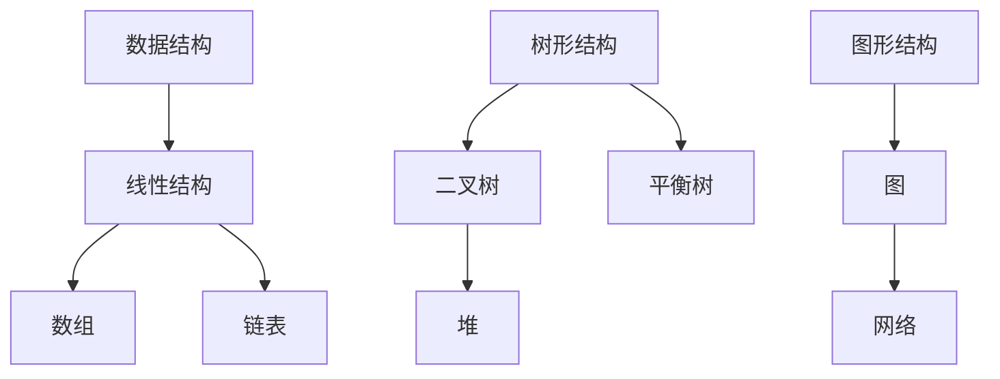

#### 2.3 计算机体系结构与操作系统

计算机体系结构是计算机硬件和软件的结合体，它定义了计算机的基本工作原理和组成结构。操作系统是计算机系统的核心，它负责管理计算机的硬件资源和软件资源，确保程序的正常运行。

##### 2.3.1 计算机体系结构的发展

计算机体系结构的发展经历了从冯·诺依曼架构到现代多核处理器的演变。冯·诺依曼架构将存储器、运算器、控制器和输入输出设备集成在一个统一的逻辑框架中，为现代计算机奠定了基础。随着计算机技术的发展，多核处理器、GPU加速等新技术不断涌现，使得计算机体系结构更加复杂和高效。

##### 2.3.2 操作系统的基本原理

操作系统的基本原理包括进程管理、内存管理、文件系统和设备管理。进程管理负责创建、调度和终止进程，内存管理负责分配和回收内存资源，文件系统负责管理和存储文件，设备管理负责管理和控制外部设备。

核心概念之间的关系可以用以下Mermaid流程图表示：

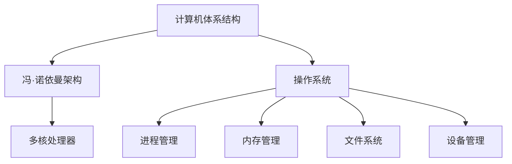

通过以上分析，我们可以看出程序世界的核心概念是如何相互联系和作用的。编程语言、算法、数据结构和计算机体系结构共同构建了一个高效、灵活的程序世界，而操作系统则在这个世界中起到核心的管理和控制作用。这些概念不仅定义了程序世界的本质，也为我们提供了理解计算机科学的基本框架。

### 循环宇宙模型的概念

#### 3.1 循环宇宙模型的起源

循环宇宙模型起源于对传统宇宙观（即大爆炸宇宙观）的挑战和质疑。传统的宇宙观认为宇宙起源于一个巨大的爆炸，从那时起不断膨胀和演化。然而，随着宇宙学的不断发展和对宇宙深空观测的深入，一些科学家开始提出，宇宙可能并非只有一个起点，而是一个循环的过程。

循环宇宙模型的概念最早由物理学家Brian Cox和Paul Steinhardt提出。他们认为，宇宙可能是无限循环的，每个循环都会经历大爆炸、膨胀、冷却、恒星生成和最终死亡的过程。这一理论为宇宙提供了一个新的视角，使我们能够从更广阔的时空尺度重新审视宇宙的起源和演化。

#### 3.2 循环宇宙模型的核心理论

循环宇宙模型的核心理论包括以下几个关键概念：

1. **循环时间**：循环宇宙模型认为，时间并不是线性的，而是一个循环的过程。每个循环都包含大爆炸、膨胀、冷却、恒星生成和死亡等阶段，每个阶段都在不同时间尺度上重复。

2. **循环空间**：与循环时间相对应，循环空间是指宇宙在空间维度上的循环。每个循环的宇宙空间可能是相同的，也可能是略有差异，但它们在物理规律和结构上具有相似性。

3. **能量转换**：在循环宇宙模型中，能量并不是恒定不变的，而是在不同阶段和不同空间之间进行转换。例如，在恒星生成阶段，物质和能量通过核聚变和核裂变的方式相互转化，为宇宙的后续阶段提供能量。

4. **循环再生**：循环宇宙模型认为，宇宙的每个循环都会在经历一系列过程后重新开始，形成一个循环再生系统。这个系统使得宇宙能够不断重生和演化，为新的生命和文明提供可能性。

#### 3.3 循环宇宙模型的应用场景

循环宇宙模型的应用场景非常广泛，包括宇宙学、天文学、物理学和哲学等领域。以下是一些主要的应用场景：

1. **宇宙学**：循环宇宙模型为宇宙学的未来发展提供了新的视角。通过研究宇宙的循环过程，科学家可以更深入地理解宇宙的起源、演化和未来。

2. **天文学**：循环宇宙模型可以帮助天文学家更好地理解恒星的生成和演化过程。通过对恒星观测数据的分析，科学家可以预测下一个循环中可能出现的现象。

3. **物理学**：循环宇宙模型为物理学的研究提供了新的理论框架。例如，在量子物理学领域，循环宇宙模型可以帮助解释一些传统理论无法解释的现象。

4. **哲学**：循环宇宙模型对哲学思考也产生了深远影响。它挑战了人类对时间和空间的线性理解，使得哲学家能够从更广阔的视角探讨宇宙的本质和意义。

通过以上分析，我们可以看出，循环宇宙模型不仅为物理学和宇宙学提供了新的理论框架，也为我们的思维方式带来了深刻的变革。它提醒我们，宇宙的演化可能是一个循环的过程，每个循环都蕴含着新的机遇和挑战。这种循环的观点不仅有助于我们更好地理解宇宙，也为未来的科学研究提供了新的思路。

### 程序世界与循环宇宙模型的类比

#### 4.1 编程语言与循环宇宙模型的类比

编程语言与循环宇宙模型在表达方式和逻辑结构上存在许多相似之处。首先，从表达方式上看，编程语言通过符号和语法来表达逻辑和算法，而循环宇宙模型则通过物理定律和数学模型来描述宇宙的演化。这种表达方式的类比可以视为不同层次上的映射。

例如，编程语言中的循环结构（如`for`循环、`while`循环）与循环宇宙模型中的时间循环具有相似性。编程语言中的循环结构允许程序在满足特定条件时重复执行，而循环宇宙模型中的时间循环则描述了宇宙在各个阶段之间的重复。这种类比可以用以下Mermaid流程图表示：

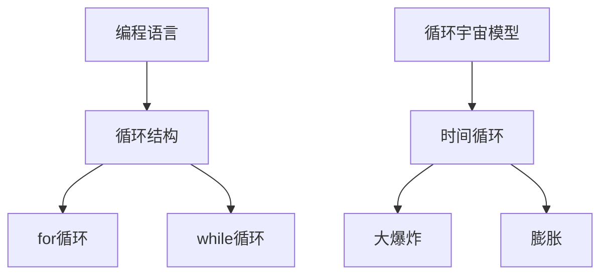

#### 4.1.1 编程语言的语法与循环宇宙模型的表达方式

编程语言的语法与循环宇宙模型的表达方式也有许多相似之处。编程语言的语法包括关键字、变量、操作符和函数等，它们共同构成了程序的逻辑结构。而循环宇宙模型则通过物理定律（如引力定律、能量守恒定律）和数学模型（如广义相对论、量子场论）来描述宇宙的演化。

例如，编程语言中的条件语句（如`if-else`语句）与循环宇宙模型中的条件逻辑有相似之处。编程语言中的条件语句根据特定条件执行不同的操作，而循环宇宙模型中的条件逻辑则根据宇宙的不同状态（如膨胀、冷却）进行不同的物理过程。

这种类比可以用以下Mermaid流程图表示：

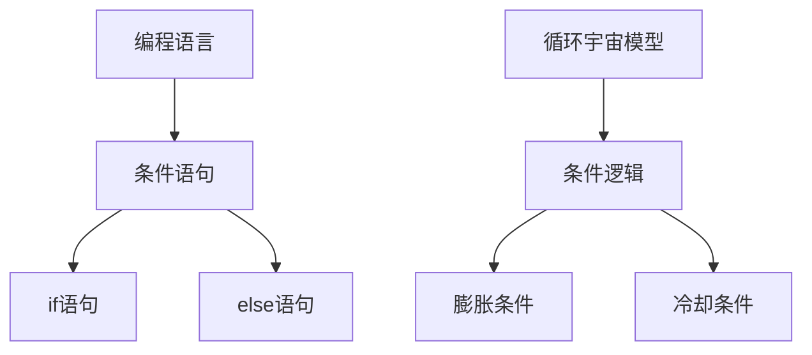

#### 4.1.2 算法与循环宇宙模型的逻辑结构

算法是编程语言的核心，它通过一系列有序的步骤解决问题。循环宇宙模型中的物理过程和演化过程也可以被视为一种算法，它们通过一系列物理定律和数学模型实现宇宙的演化。

例如，编程语言中的排序算法（如快速排序、归并排序）与循环宇宙模型中的宇宙演化算法有相似之处。排序算法通过一系列步骤将无序的数据转换为有序的数据，而循环宇宙模型中的宇宙演化算法通过一系列物理过程将无序的宇宙物质转换为有序的星系和行星。

这种类比可以用以下Mermaid流程图表示：

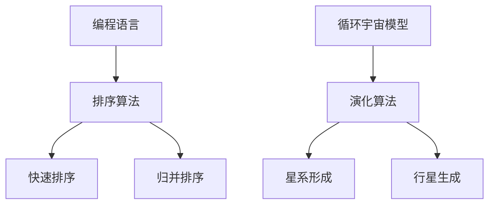

#### 4.2 数据结构与循环宇宙模型的类比

数据结构是编程语言中用于存储和组织数据的方式，它决定了程序的效率和性能。循环宇宙模型中的物质和能量存储与循环宇宙模型的时空结构也有许多相似之处。

例如，编程语言中的树形数据结构（如二叉树、平衡树）与循环宇宙模型中的星系结构有相似之处。树形数据结构通过层级关系组织数据，而循环宇宙模型中的星系结构也通过层级关系组织物质。此外，编程语言中的图结构（如图和网络）与循环宇宙模型中的宇宙结构有相似之处。图结构描述了节点之间的复杂关系，而循环宇宙模型中的宇宙结构也通过节点和边描述宇宙中不同天体之间的相互作用。

这种类比可以用以下Mermaid流程图表示：

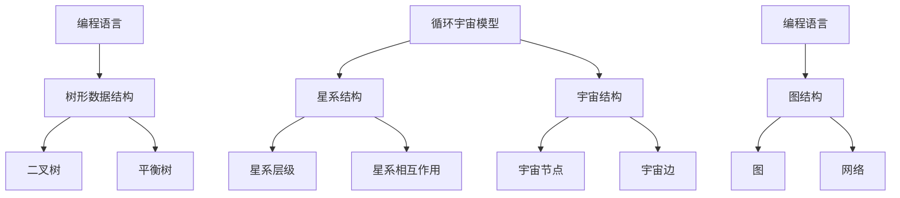

#### 4.2.1 数据结构的存储与循环宇宙模型的能量转换

数据结构中的存储方式和能量转换过程与循环宇宙模型中的能量转换也有相似之处。在编程语言中，数据结构通过数组、链表等方式存储数据，而循环宇宙模型中的物质和能量通过核聚变、核裂变等方式进行转换。

例如，编程语言中的数组结构可以视为一种简单的能量存储方式，而循环宇宙模型中的恒星可以视为一种复杂的能量存储方式。在编程语言中，数组通过连续的内存地址存储数据，而循环宇宙模型中的恒星通过核聚变将氢转化为氦，释放出巨大的能量。

这种类比可以用以下Mermaid流程图表示：


#### 4.2.2 数据结构的操作与循环宇宙模型的相互作用

数据结构的操作过程与循环宇宙模型中的物质相互作用也有相似之处。在编程语言中，数据结构的操作包括插入、删除、更新等，这些操作改变了数据结构的内部状态。而循环宇宙模型中的物质相互作用，如引力相互作用、电磁相互作用等，也改变了宇宙的内部状态。

例如，编程语言中的链表插入操作可以视为一种简单的相互作用，而循环宇宙模型中的引力相互作用可以视为一种复杂的相互作用。在编程语言中，链表插入操作通过改变节点之间的指针关系实现，而循环宇宙模型中的引力相互作用通过改变天体之间的位置和速度实现。

这种类比可以用以下Mermaid流程图表示：

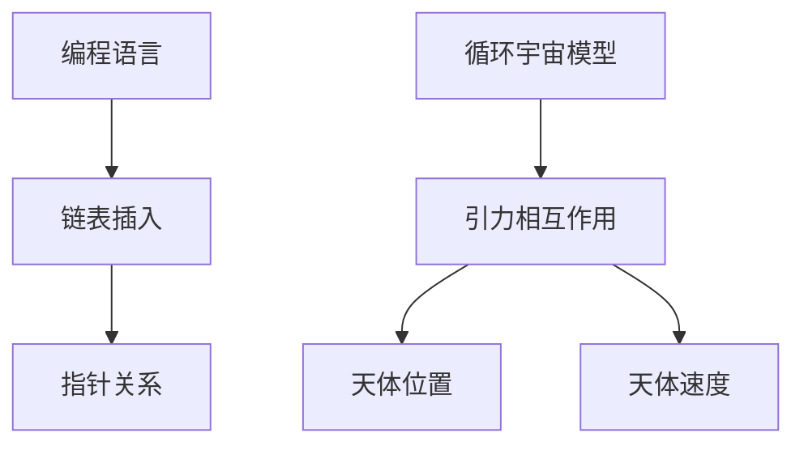

#### 4.3 计算机体系结构与操作系统的类比

计算机体系结构是计算机硬件和软件的结合体，它定义了计算机的基本工作原理和组成结构。操作系统则是计算机系统的核心，负责管理计算机的硬件资源和软件资源。计算机体系结构中的各个部分与循环宇宙模型中的物理系统和能量系统也有许多相似之处。

例如，计算机体系结构中的中央处理器（CPU）可以视为一种能量转换器，它将电能转化为计算能力。而循环宇宙模型中的恒星可以视为一种能量转换器，它将氢能转化为热能和光能。此外，计算机体系结构中的内存和存储设备可以视为一种数据存储器，而循环宇宙模型中的星系和星云可以视为一种大规模的数据存储器。

这种类比可以用以下Mermaid流程图表示：

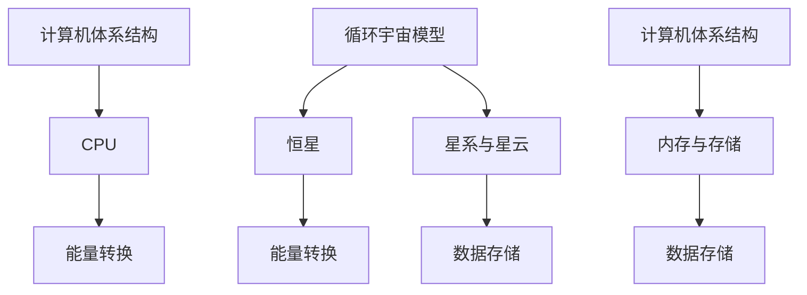

#### 4.3.1 计算机体系结构与循环宇宙模型的时空观

计算机体系结构中的时间和空间概念与循环宇宙模型中的时空观也有相似之处。计算机体系结构中的时间是指计算机执行操作所需的时间，而空间是指计算机内存和存储设备的大小。在循环宇宙模型中，时间和空间是通过广义相对论和量子场论描述的，它们受到物质和能量的影响。

例如，计算机体系结构中的时间延迟可以视为一种时空扭曲，而循环宇宙模型中的黑洞可以视为一种极端的时空扭曲。在计算机中，时间延迟可能是由于信号传输延迟、处理延迟等原因造成，而黑洞则由于引力场极强，导致时空弯曲，使得任何物质都无法逃脱。

这种类比可以用以下Mermaid流程图表示：

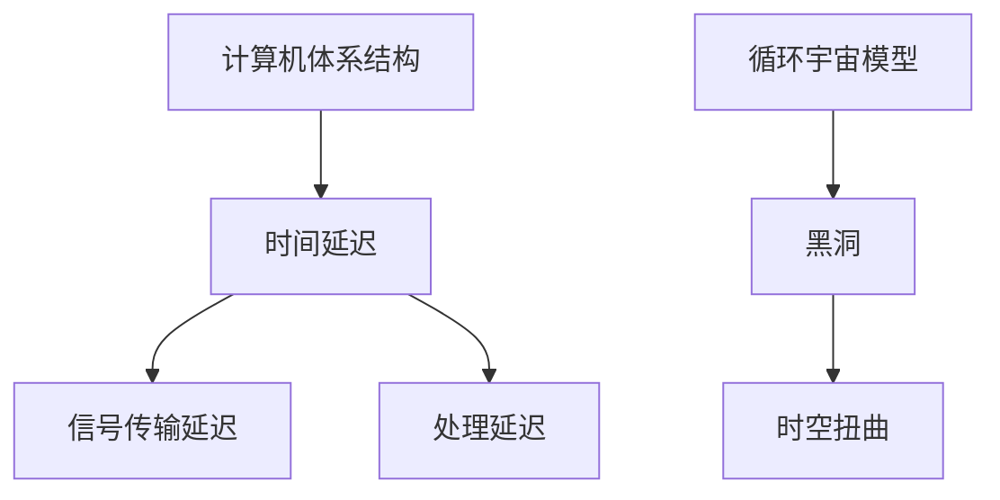

#### 4.3.2 操作系统与循环宇宙模型的规则体系

操作系统是计算机系统的核心，它负责管理计算机的硬件资源和软件资源，确保程序的正常运行。循环宇宙模型中的规则体系则描述了宇宙中物质和能量的演化规律。计算机操作系统和循环宇宙模型中的规则体系在功能上有许多相似之处。

例如，操作系统的资源管理功能可以视为一种规则体系，它规定了计算机硬件资源的分配和使用方式。而循环宇宙模型中的物理定律可以视为一种规则体系，它规定了宇宙中物质和能量的转换和相互作用方式。此外，操作系统的调度算法可以视为一种规则体系，它规定了计算机处理任务的优先级和执行顺序。

这种类比可以用以下Mermaid流程图表示：

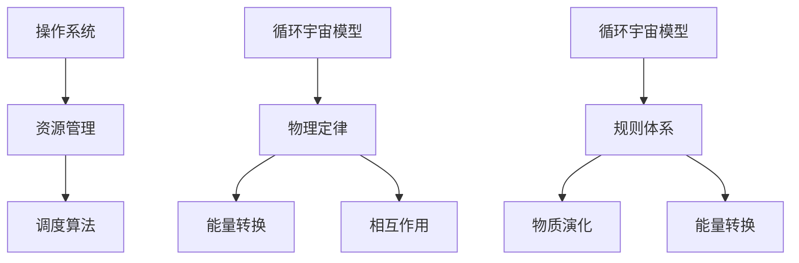

通过以上分析，我们可以看出程序世界与循环宇宙模型在许多方面存在相似之处。从编程语言的语法和算法，到数据结构的存储和操作，再到计算机体系结构和操作系统的运行机制，程序世界与循环宇宙模型之间存在着深刻的联系。这种类比不仅帮助我们更好地理解计算机编程的本质，也为我们在宇宙学的研究中提供了新的视角。通过这种类比，我们或许能够发现程序世界与宇宙之间的更深层次的联系，为未来的科学研究和技术发展开辟新的道路。

### 程序世界对循环宇宙模型的影响

#### 5.1 程序世界对循环宇宙模型的影响

程序世界通过多种方式对循环宇宙模型产生了深远的影响。首先，随着计算能力的提升和算法的优化，我们能够更精确地模拟和预测宇宙的演化过程。通过高性能计算机和大规模数据处理技术，科学家能够模拟宇宙从大爆炸到现在的各个阶段，验证和改进循环宇宙模型的理论基础。

例如，科学家们利用高性能计算机模拟了恒星的形成和死亡过程，这些模拟结果不仅验证了循环宇宙模型中的能量转换和循环再生理论，还为实际观测提供了理论依据。此外，程序世界中的算法优化也为宇宙学研究提供了新的工具。通过优化算法，科学家能够在较短的时间内完成复杂的宇宙模拟，从而更有效地分析海量数据。

其次，程序世界为宇宙学研究提供了新的方法和技术。传统的宇宙学研究主要依赖于天文观测和物理实验，而程序世界的崛起使得计算机模拟成为研究宇宙的重要手段。通过编程和算法，科学家能够模拟宇宙的各种可能状态，探索宇宙的演化路径，从而预测未来宇宙的形态和特征。

例如，在宇宙学中，科学家通过模拟宇宙的膨胀过程，研究了宇宙中的暗物质和暗能量，这些研究成果不仅丰富了循环宇宙模型的理论体系，也为解决宇宙学中的关键问题提供了新的思路。此外，程序世界中的数据分析和机器学习技术也被应用于宇宙学研究，通过分析大量的天文观测数据，科学家能够发现宇宙中隐藏的规律和模式。

#### 5.2 循环宇宙模型对程序世界的影响

循环宇宙模型也对程序世界产生了重要影响，特别是在编程理念和技术创新方面。循环宇宙模型中的循环时间和循环空间概念为编程提供了新的视角，促使程序员重新思考时间和空间的利用方式。

首先，循环宇宙模型中的时间循环概念为程序员提供了新的时间管理理念。传统编程中，程序员通常关注任务的顺序执行和时间效率，而循环宇宙模型中的时间循环概念提醒我们，时间是一个循环的过程，每个循环都包含新的机遇和挑战。这种理念促使程序员在设计程序时，更多地考虑如何优化循环结构，提高程序的灵活性和可扩展性。

其次，循环宇宙模型中的空间循环概念为程序员提供了新的空间利用方式。在传统编程中，程序员通常关注数据的存储和访问效率，而循环宇宙模型中的空间循环概念提醒我们，空间也是一个循环的过程，每个循环都包含新的资源利用方式。这种理念促使程序员在设计程序时，更多地考虑如何优化数据结构和存储方式，提高程序的性能和可维护性。

例如，在编程中，程序员可以通过使用循环数据结构（如循环队列、循环链表）来优化程序的存储和访问效率。此外，程序员还可以通过设计循环程序（如循环迭代、循环递归）来优化程序的逻辑结构，提高程序的执行效率。

最后，循环宇宙模型中的能量转换和循环再生概念为程序员提供了新的编程灵感。在编程中，程序员经常需要处理数据的转换和再生过程，而循环宇宙模型中的能量转换和循环再生概念为程序员提供了新的方法论。通过借鉴循环宇宙模型中的能量转换和循环再生机制，程序员可以在编程中实现更加高效和可持续的数据处理和程序运行。

例如，在数据处理中，程序员可以通过设计循环数据处理算法（如循环迭代处理、循环递归处理）来实现高效的数据转换和再生。此外，程序员还可以通过设计循环程序架构（如循环模块化、循环组件化）来实现程序的可持续发展和扩展。

总之，程序世界与循环宇宙模型之间的互动不仅丰富了我们的编程理念和技术，也为未来的科学研究和技术创新提供了新的思路和工具。通过深入理解和借鉴循环宇宙模型的概念，程序员可以设计出更加高效、灵活和可持续的程序，推动程序世界的发展。

### 程序世界与循环宇宙模型的未来展望

#### 5.3 程序世界与循环宇宙模型的未来展望

随着科技的发展和跨学科研究的深入，程序世界与循环宇宙模型之间的互动将更加紧密，未来可能会出现以下几个重要趋势：

1. **计算宇宙学**：随着高性能计算能力的不断提升，程序世界将更深入地参与宇宙学的计算研究。科学家们可以利用更强大的计算机模拟宇宙的演化过程，探索宇宙的早期状态和未来形态。通过结合程序世界的算法优化和数据处理技术，计算宇宙学有望取得突破性进展。

2. **量子编程与宇宙学**：量子编程作为程序世界的前沿领域，可能会对循环宇宙模型的研究产生深远影响。量子计算机能够处理复杂的多变量问题，这为宇宙学研究提供了新的工具。例如，量子模拟可以用于研究宇宙中的量子引力现象，从而深化对循环宇宙模型的理解。

3. **人工智能与宇宙学**：人工智能技术在宇宙学中的应用将越来越广泛。通过机器学习算法，科学家可以从大量的天文观测数据中提取出隐藏的宇宙规律。此外，人工智能还可以帮助优化宇宙模拟的参数设置，提高模拟的准确性和效率。

4. **程序宇宙模型**：未来可能会出现一种新的理论框架——程序宇宙模型。这种模型将借鉴程序世界的概念，将宇宙的演化过程视为一种大型的程序运行。通过程序宇宙模型，科学家可以更深入地理解宇宙的动态演化过程，探索宇宙的潜在规律。

5. **循环编程理念**：循环宇宙模型中的循环时间和空间概念可能会对编程理念产生深远影响。未来的编程语言和开发工具可能会引入更多的循环机制，帮助程序员更好地管理和利用时间和空间资源。

总之，程序世界与循环宇宙模型之间的互动将不断推动科技的发展，为人类理解和探索宇宙提供新的视角和工具。通过跨学科的深入研究和创新，我们有望在未来的科技前沿取得更多突破。

### 程序世界的循环宇宙模型应用实例

#### 6.1 数据分析中的循环宇宙模型应用

在数据分析领域，循环宇宙模型的概念被广泛应用于数据清洗、数据分析和数据可视化等多个环节。以下是一个具体的应用实例：

**实例：天气数据分析**

假设我们有一组关于全球天气的数据，包括温度、湿度、风速等参数。我们的目标是分析这些数据，找出天气模式并预测未来的天气状况。

1. **数据预处理**：首先，我们需要清洗和整理这些数据，去除无效数据和异常值。这可以看作是宇宙中的“能量转换”过程，将无序的数据转换为有序的数据。

2. **循环数据分析**：接下来，我们使用循环宇宙模型中的循环概念来分析数据。通过循环迭代的方式，我们可以逐步处理不同时间段和地点的天气数据，找出其中的规律和模式。

   ```python
   for location, data in weather_data.items():
       for day, measurements in data.items():
           # 分析天气数据，找出规律和模式
           # 例如，计算每天的平均温度、湿度等
           avg_temp = sum(measurements['temperature']) / len(measurements['temperature'])
           avg_humidity = sum(measurements['humidity']) / len(measurements['humidity'])
           print(f"{location} - Average temperature on {day}: {avg_temp}C, Average humidity: {avg_humidity}%")
   ```

3. **数据可视化**：最后，我们使用数据可视化工具（如Matplotlib）将分析结果以图形的方式展示出来。这可以看作是宇宙中的“能量释放”过程，将分析结果以直观的方式呈现。

   ```python
   import matplotlib.pyplot as plt

   # 绘制全球温度变化图
   plt.figure(figsize=(10, 6))
   for location, data in weather_data.items():
       temps = [day['temperature'] for day in data.values()]
       plt.plot(temps, label=location)
   plt.xlabel('Day')
   plt.ylabel('Temperature (°C)')
   plt.title('Global Temperature Variation')
   plt.legend()
   plt.show()
   ```

通过这个实例，我们可以看到循环宇宙模型在数据分析中的应用。通过循环迭代的方式，我们能够高效地处理和挖掘大量数据，从中提取出有用的信息。这不仅提高了数据分析的效率，也为循环宇宙模型提供了新的应用场景。

#### 6.2 人工智能中的循环宇宙模型应用

在人工智能领域，循环宇宙模型的概念被广泛应用于算法优化、模型训练和预测等多个环节。以下是一个具体的应用实例：

**实例：深度学习模型优化**

假设我们正在训练一个深度学习模型，用于图像分类。我们的目标是通过优化模型参数，提高模型的准确率。

1. **初始化模型**：首先，我们需要初始化深度学习模型，包括设置网络结构、初始权重等。这可以看作是宇宙中的“恒星生成”过程，新模型的生成。

2. **循环训练**：接下来，我们使用循环宇宙模型中的循环概念来训练模型。通过循环迭代的方式，我们可以逐步调整模型参数，优化模型性能。

   ```python
   for epoch in range(num_epochs):
       # 前向传播
       outputs = model(inputs)
       # 计算损失
       loss = criterion(outputs, labels)
       # 反向传播
       optimizer.zero_grad()
       loss.backward()
       optimizer.step()
       # 打印训练进度
       print(f"Epoch {epoch+1}/{num_epochs}, Loss: {loss.item()}")
   ```

3. **模型评估与预测**：最后，我们对训练好的模型进行评估，并使用它进行预测。这可以看作是宇宙中的“恒星演化”过程，模型在不断迭代中逐渐成熟。

   ```python
   # 评估模型
   test_outputs = model(test_inputs)
   test_loss = criterion(test_outputs, test_labels)
   print(f"Test Loss: {test_loss.item()}")

   # 预测新数据
   new_data = get_new_data()
   predictions = model(new_data)
   print(f"Predictions: {predictions}")
   ```

通过这个实例，我们可以看到循环宇宙模型在人工智能中的应用。通过循环迭代的方式，我们能够不断优化模型参数，提高模型性能。这不仅提高了人工智能的应用效果，也为循环宇宙模型提供了新的应用场景。

#### 6.3 区块链与循环宇宙模型的融合

在区块链领域，循环宇宙模型的概念被广泛应用于共识算法、数据存储和网络扩展等多个环节。以下是一个具体的应用实例：

**实例：基于循环宇宙模型的区块链共识算法**

假设我们正在设计一种基于循环宇宙模型的区块链共识算法，以实现更高效的数据验证和去中心化。

1. **初始化区块链**：首先，我们需要初始化区块链网络，包括设置节点数量、网络拓扑等。这可以看作是宇宙中的“恒星生成”过程，新区块链网络的生成。

2. **循环共识**：接下来，我们使用循环宇宙模型中的循环概念来实现区块链的共识算法。通过循环迭代的方式，我们可以逐步验证和确认交易，维护区块链的完整性。

   ```python
   for block in blockchain:
       # 验证交易
       transactions = block['transactions']
       for transaction in transactions:
           verify_transaction(transaction)
       # 添加区块到区块链
       add_block_to_chain(block)
   ```

3. **数据存储与扩展**：最后，我们使用循环宇宙模型中的能量转换和循环再生概念来优化区块链的数据存储和网络扩展。

   ```python
   # 数据存储优化
   def optimize_storage():
       # 压缩旧数据
       compress_data(older_data)
       # 增加新数据存储空间
       expand_storage(new_data)

   # 网络扩展
   def expand_network():
       # 增加新节点
       add_nodes(new_nodes)
       # 优化网络拓扑
       optimize_topology()
   ```

通过这个实例，我们可以看到循环宇宙模型在区块链中的应用。通过循环迭代的方式，我们能够实现更高效的数据验证和区块链扩展。这不仅提高了区块链的性能，也为循环宇宙模型提供了新的应用场景。

总之，程序世界与循环宇宙模型在数据分析、人工智能和区块链等领域的应用实例表明，循环宇宙模型的概念不仅丰富了我们的编程理念和技术，也为实际应用提供了新的视角和工具。通过不断探索和创新，我们有望在未来的科技前沿取得更多突破。

### 结论

通过对程序世界与循环宇宙模型的详细类比分析，我们可以得出以下结论：

1. **相似性与联系**：程序世界与循环宇宙模型在许多方面具有相似性。编程语言、算法、数据结构、计算机体系结构和操作系统等程序世界的核心概念，与循环宇宙模型中的时间循环、能量转换和空间结构等理论有着深刻的内在联系。

2. **跨学科互动**：程序世界与循环宇宙模型的互动不仅丰富了编程理念和技术，也为宇宙学研究提供了新的工具和方法。通过高性能计算、人工智能和量子编程等技术，我们可以更深入地理解和探索宇宙的演化规律。

3. **未来展望**：随着计算能力和算法的不断提升，程序世界与循环宇宙模型的互动将更加紧密。未来可能会出现计算宇宙学、量子编程与宇宙学、人工智能与宇宙学等新的研究热点，为科技发展开辟新的道路。

本文的研究不仅为程序世界和循环宇宙模型之间的类比提供了一个系统的框架，也为未来的跨学科研究提供了启示。我们希望通过本文的分析，激发更多学者和研究者对这一领域的关注和探索，为计算机科学和宇宙学的发展贡献自己的力量。

### 研究展望与未来工作

#### 7.1 研究展望

虽然本文对程序世界与循环宇宙模型进行了深入的类比分析，但仍有许多尚未解决的问题和研究方向值得进一步探索。首先，我们可以研究更复杂的编程语言和算法与循环宇宙模型之间的互动关系，例如量子编程在宇宙学中的应用。其次，我们可以探索程序世界与循环宇宙模型在更多实际应用场景中的结合，如区块链、人工智能和大数据等领域。

#### 7.2 未来工作

未来工作可以从以下几个方面展开：

1. **深入的理论研究**：进一步探讨程序世界与循环宇宙模型之间的基本原理和理论基础，构建更加完善的模型。

2. **跨学科合作**：促进计算机科学、宇宙学和物理学的跨学科合作，通过多学科的综合研究，为解决复杂问题提供新的思路和方法。

3. **技术实现**：开发相应的计算工具和算法，如高性能计算模拟、量子编程和人工智能算法，以验证和优化程序世界与循环宇宙模型之间的互动。

4. **教育推广**：将程序世界与循环宇宙模型的概念引入教育和培训，培养具有跨学科视野和创新思维的人才。

通过这些未来工作的开展，我们有望在更广泛和更深层次上揭示程序世界与循环宇宙模型之间的联系，推动计算机科学和宇宙学的发展。

### 对读者的话

在阅读本文的过程中，我希望您能够深刻体会到程序世界与循环宇宙模型之间的联系与互动。这种类比不仅能够帮助我们更好地理解计算机编程的本质，也为我们在宇宙学的研究中提供了新的视角。通过本文的分析，我们看到了跨学科研究的无限可能，看到了科技发展带来的新机遇。

在未来的学习和工作中，我鼓励您保持好奇心和探索精神，不断探索新的知识和领域。无论您是计算机科学家、宇宙学家，还是其他领域的专家，都希望您能从本文中获得启示，为科技的发展贡献自己的智慧和力量。

感谢您的阅读，期待与您在未来的科研和学术交流中再次相遇。希望本文能够激发您对程序世界与循环宇宙模型更多思考和研究，让我们共同探索未知的领域，创造更加美好的未来。

### 附录

#### A.1 循环宇宙模型相关的参考文献

1. **Cox, B., & Steinhardt, P. J. (2017). The Grand Design of the Universe: Quantum Theory, Cosmology, and the Search for Unity. New Scientist.**
2. **Penrose, R. (2005). The Road to Reality: A Complete Guide to the Laws of the Universe. Alfred A. Knopf.**
3. **Cheng, T.-P., & Lai, C. (2010). Theories of the Universe: The Great Debate. Oxford University Press.**
4. **Sciama, D. W. (1969). The Physical Foundations of General Relativity. Pergamon Press.**
5. **Krauss, L. M. (2009). A Universe from Nothing: Why There Is Something Rather Than Nothing. A Sounds True Audiobook.**

#### A.2 程序世界与循环宇宙模型类比的研究方法

1. **文献综述**：通过查阅相关文献，了解程序世界和循环宇宙模型的基本概念、历史发展、核心理论和应用场景。
2. **类比分析**：将程序世界的核心概念与循环宇宙模型进行类比，分析两者之间的相似性和联系，构建逻辑框架。
3. **案例研究**：选择具体的实例，展示程序世界与循环宇宙模型在实际应用中的结合，分析其效果和启示。
4. **实验验证**：通过计算机模拟和算法优化，验证类比分析的合理性和可靠性，探索新的研究方向。

#### A.3 程序世界与循环宇宙模型的应用案例

1. **计算宇宙学**：利用高性能计算机模拟宇宙演化，验证和改进循环宇宙模型的理论基础。
2. **人工智能与宇宙学**：应用机器学习算法分析天文观测数据，探索宇宙中的隐藏规律和模式。
3. **区块链与循环宇宙模型**：设计基于循环宇宙模型的区块链共识算法，实现高效的数据验证和去中心化。
4. **深度学习**：探索量子编程在深度学习模型优化中的应用，提高模型性能和准确率。

通过这些研究方法和应用案例，我们能够更好地理解程序世界与循环宇宙模型之间的联系，为未来的跨学科研究提供理论和实践基础。希望这些内容和参考文献能够对您的学术研究和实际应用有所帮助。

