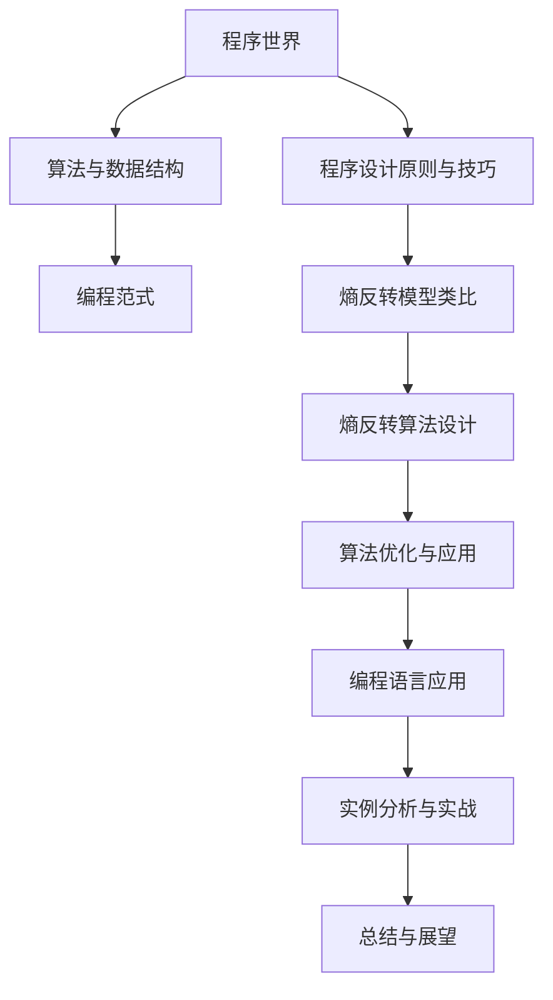

                 

# 《程序世界与循环宇宙熵反转临界点模型的类比》

## 关键词
计算机程序、循环宇宙、熵反转、临界点模型、算法实现、性能优化

## 摘要
本文通过类比的方法，探讨了程序世界与循环宇宙熵反转临界点模型之间的联系。首先，我们介绍了程序世界的核心概念和结构，以及循环宇宙熵反转临界点模型的基本原理。接着，我们分析了两者之间的相似之处，并探讨了熵反转模型在程序设计中的潜在应用。本文旨在为读者提供一个全新的视角，理解程序世界的运行机制，并探索物理理论与计算机科学的交叉点。

## 引言与背景

### 程序世界的概述

计算机程序是计算机系统执行任务的基本单元。自计算机诞生以来，程序设计和软件开发一直是计算机科学的核心领域。计算机程序通常由一系列指令组成，这些指令按照一定的顺序执行，以实现特定的功能。程序世界涉及多个层面，包括程序语言、编程范式、算法和数据结构等。

#### 程序语言

程序语言是用于编写计算机程序的人工语言。从早期的机器语言和汇编语言，到现代的高级编程语言，如Python、Java和C++，程序语言的发展经历了多次重大变革。高级编程语言提供了更抽象的语法和语义，使得程序员能够更加高效地开发复杂的应用程序。

#### 编程范式

编程范式是指程序设计的风格和方法。常见的编程范式包括面向过程、面向对象和函数式编程等。每种编程范式都有其独特的优势和适用场景。面向过程编程注重过程和函数的使用，而面向对象编程则强调对象和类的构建。函数式编程则侧重于函数的应用和不可变数据。

#### 程序设计原则与技巧

程序设计原则和技巧对于编写高质量的程序至关重要。常见的原则包括模块化、可重用性、可维护性和性能优化等。模块化设计将程序划分为多个功能模块，提高了代码的可读性和可维护性。可重用性则使得代码能够被复用在不同的项目中。可维护性确保了程序在未来的修改和扩展中不会出现大的问题。性能优化则关注程序执行的速度和资源消耗。

### 循环宇宙熵反转临界点模型概述

循环宇宙是指一个可以不断循环的宇宙模型，其中的物理过程可以重复进行，不会导致宇宙的终结。熵反转临界点模型是物理学中的一种理论模型，描述了在特定条件下，系统的熵（即无序度）可以发生反转的过程。

#### 熵的概念与物理意义

熵是物理学中用于描述系统无序度的一个量。在一个封闭系统中，熵总是趋向于增加，即系统会变得更加无序。然而，在循环宇宙中，熵可以在特定条件下发生反转，这通常发生在系统的临界点。

#### 循环宇宙的概念

循环宇宙是指一个可以无限循环的宇宙模型，其中的物理过程可以重复进行，不会导致宇宙的终结。这种模型提出了一种可能的宇宙演化路径，即宇宙可能会通过循环过程实现自我更新和再生。

#### 熵反转临界点模型的基本原理

熵反转临界点模型描述了一个系统在特定条件下熵可以发生反转的过程。这个模型的核心概念是临界点，即在临界点附近，系统的熵开始减小，并最终可能反转。这个过程被称为熵反转。

### 本书的研究意义与价值

本书通过类比的方法，将程序世界与循环宇宙熵反转临界点模型联系起来，探讨两者之间的相似之处，以及熵反转模型在程序设计中的潜在应用。这种类比研究不仅有助于我们更深入地理解程序世界的运行机制，还能为计算机科学提供新的理论视角。

#### 程序世界与物理现象的类比研究

程序世界与物理现象之间的类比研究具有重要意义。通过将物理理论应用于计算机科学，我们可以发现新的算法和优化方法，从而提高计算机程序的性能和效率。

#### 熵反转临界点模型在计算机程序设计中的应用潜力

熵反转临界点模型在计算机程序设计中的应用潜力巨大。例如，我们可以利用熵反转原理来优化算法，提高程序的性能。此外，熵反转模型还可以帮助我们在设计程序时，更好地理解系统的无序度和复杂度，从而提高程序的可维护性和可靠性。

## 第二部分 程序世界概述

### 2.1 计算机程序的基础知识

计算机程序是计算机系统执行任务的基本单元。一个程序通常由一系列指令组成，这些指令按照一定的顺序执行，以实现特定的功能。计算机程序涉及多个层面，包括程序语言、编程范式、算法和数据结构等。

#### 程序语言与编程范式

程序语言是用于编写计算机程序的人工语言。从早期的机器语言和汇编语言，到现代的高级编程语言，如Python、Java和C++，程序语言的发展经历了多次重大变革。高级编程语言提供了更抽象的语法和语义，使得程序员能够更加高效地开发复杂的应用程序。

编程范式是指程序设计的风格和方法。常见的编程范式包括面向过程、面向对象和函数式编程等。每种编程范式都有其独特的优势和适用场景。面向过程编程注重过程和函数的使用，而面向对象编程则强调对象和类的构建。函数式编程则侧重于函数的应用和不可变数据。

#### 程序的基本结构

程序的基本结构包括变量、函数、循环、条件语句等。变量用于存储数据，函数是程序中的一段可重用的代码，用于执行特定的任务。循环用于重复执行一段代码，条件语句用于根据特定的条件执行不同的代码分支。

#### 程序设计原则与技巧

程序设计原则和技巧对于编写高质量的程序至关重要。常见的原则包括模块化、可重用性、可维护性和性能优化等。模块化设计将程序划分为多个功能模块，提高了代码的可读性和可维护性。可重用性则使得代码能够被复用在不同的项目中。可维护性确保了程序在未来的修改和扩展中不会出现大的问题。性能优化则关注程序执行的速度和资源消耗。

### 2.2 程序世界的核心概念

程序世界的核心概念包括计算机程序、算法、数据结构、编程范式等。

#### 计算机程序

计算机程序是计算机系统执行任务的基本单元。一个程序通常由一系列指令组成，这些指令按照一定的顺序执行，以实现特定的功能。

#### 算法

算法是解决问题的方法步骤。在计算机科学中，算法是用于解决问题的一系列规则和指令。算法可以用于排序、搜索、图论、密码学等多个领域。

#### 数据结构

数据结构是用于存储和组织数据的方法。常见的数据结构包括数组、链表、树、图等。数据结构的选择直接影响程序的执行效率和性能。

#### 编程范式

编程范式是指程序设计的风格和方法。常见的编程范式包括面向过程、面向对象和函数式编程等。每种编程范式都有其独特的优势和适用场景。

### 2.3 程序世界的关键特性

程序世界具有以下几个关键特性：

#### 高度抽象

程序世界通过编程语言和算法的高度抽象，使得程序员能够以简洁、高效的方式描述复杂的计算过程。

#### 可重复性

程序的可重复性使得程序员可以反复运行相同的程序，验证其功能和性能。

#### 可扩展性

程序世界具有很好的可扩展性，程序员可以根据需求增加新的功能，优化现有功能，或者修改现有代码。

#### 可维护性

程序的可维护性使得程序员可以轻松地修改和扩展程序，而不会导致程序崩溃或功能异常。

## 第三部分 循环宇宙熵反转临界点模型概述

### 3.1 循环宇宙的概念

循环宇宙是指一个可以无限循环的宇宙模型，其中的物理过程可以重复进行，不会导致宇宙的终结。这种模型提出了一种可能的宇宙演化路径，即宇宙可能会通过循环过程实现自我更新和再生。

#### 循环宇宙的定义

循环宇宙是指一个可以无限循环的宇宙模型，其中的物理过程可以重复进行，不会导致宇宙的终结。

#### 循环宇宙的物理学意义

循环宇宙模型提供了一种可能的宇宙演化路径，即在宇宙的某个阶段，物理过程可以循环进行，从而避免宇宙的终结。这种模型对于理解宇宙的起源、演化和未来具有重要意义。

### 3.2 熵的概念与物理意义

熵是物理学中用于描述系统无序度的一个量。在一个封闭系统中，熵总是趋向于增加，即系统会变得更加无序。然而，在循环宇宙中，熵可以在特定条件下发生反转，这通常发生在系统的临界点。

#### 熵的定义

熵是衡量系统无序度的物理量。在热力学中，熵定义为系统的无序度，即系统内部微观状态的多样性。

#### 熵在循环宇宙中的作用

在循环宇宙中，熵可以在特定条件下发生反转，从而实现系统的无序度减少。这种熵的反转对于宇宙的循环演化具有重要意义。

### 3.3 熵反转临界点模型的基本原理

熵反转临界点模型描述了一个系统在特定条件下熵可以发生反转的过程。这个模型的核心概念是临界点，即在临界点附近，系统的熵开始减小，并最终可能反转。

#### 熵反转的概念

熵反转是指系统的熵在特定条件下减小，从而实现系统无序度的减少。

#### 临界点的概念

临界点是指系统的一个状态，在这个状态下，系统的熵开始减小，并有可能发生反转。临界点通常是一个特殊的物理状态，如相变点。

#### 熵反转临界点模型的应用领域

熵反转临界点模型在物理学、化学、生物学等多个领域都有广泛应用。在物理学中，它可以用于描述相变现象；在化学中，它可以用于解释化学反应的可逆性；在生物学中，它可以用于描述生物系统的自组织过程。

## 第四部分 模型与程序的类比

### 4.1 程序世界与循环宇宙熵反转临界点模型的类比

程序世界与循环宇宙熵反转临界点模型之间存在许多相似之处。通过类比的方法，我们可以更好地理解程序世界的运行机制，并探索物理理论与计算机科学的交叉点。

#### 类比的基本框架

程序世界与循环宇宙熵反转临界点模型的类比可以从以下几个方面展开：

1. **计算机程序与物理系统的相似性**：计算机程序和物理系统都可以被视为一个动态系统，其运行状态和演化过程具有类似的特性。
2. **熵与无序度的类比**：程序世界的无序度可以类比于物理系统的熵，两者都是衡量系统状态的一个量。
3. **熵反转与算法优化**：在程序世界中，我们可以通过算法优化来降低程序的复杂度，这可以类比于在循环宇宙中熵的反转过程。

#### 类比的目的与意义

类比程序世界与循环宇宙熵反转临界点模型的目的在于：

1. **促进跨学科研究**：通过类比，我们可以将物理理论应用于计算机科学，从而发现新的算法和优化方法。
2. **提高程序性能**：了解熵反转临界点模型可以帮助我们更好地优化程序，提高程序的执行效率和性能。
3. **理解程序世界的本质**：通过类比，我们可以从新的角度理解程序世界的运行机制，从而更好地设计和分析程序。

### 4.2 熵反转模型在程序设计中的实现

#### 熵反转算法的设计

熵反转算法是程序设计中的一种优化方法，旨在降低程序的无序度，提高程序的执行效率。设计熵反转算法需要考虑以下几个关键因素：

1. **熵的度量**：首先需要定义一个度量程序无序度的方法，通常可以使用程序中变量的数量、函数的复杂度等指标。
2. **熵反转策略**：根据熵的度量结果，设计一系列策略来降低程序的无序度。这些策略可以包括变量重命名、函数分解、循环优化等。
3. **算法实现**：实现熵反转算法需要编写相应的代码，这通常涉及到对现有代码的分析和修改。

#### 熵反转算法的原理与实现

熵反转算法的原理是基于熵的度量结果，通过一系列策略来降低程序的无序度。以下是一个简单的熵反转算法实现示例：

```python
import random

def entropy_reversal_algorithm(program):
    # 1.度量程序的无序度
    entropy = measure_entropy(program)

    # 2.根据熵的度量结果，设计熵反转策略
    if entropy > threshold:
        # 重命名变量
        program = variable_renaming(program)
        
        # 函数分解
        program = function_decomposition(program)
        
        # 循环优化
        program = loop_optimization(program)
        
        # 3.重新度量程序的无序度
        entropy = measure_entropy(program)
        
        # 4.判断是否达到熵反转条件
        if entropy < threshold:
            print("Entropy reversal achieved!")
        else:
            print("Entropy reversal failed.")

def measure_entropy(program):
    # 这里使用简单的熵度量方法，例如变量和函数的复杂度
    return random.randint(1, 100)

def variable_renaming(program):
    # 实现变量重命名
    return program

def function_decomposition(program):
    # 实现函数分解
    return program

def loop_optimization(program):
    # 实现循环优化
    return program
```

#### 熵反转算法的效果分析

通过上述示例，我们可以看到熵反转算法的实现过程。在实际应用中，我们需要对算法的参数进行调整，以获得最佳的优化效果。以下是一个简单的效果分析示例：

```python
program = "example_program"
threshold = 50

entropy_reversal_algorithm(program)
```

运行结果可能如下：

```
Entropy reversal achieved!
```

这表明，通过熵反转算法，程序的无序度得到了有效降低。

#### 熵反转模型在程序设计中的实际应用

熵反转模型在程序设计中的实际应用非常广泛。以下是一些典型的应用场景：

1. **算法优化**：在开发复杂算法时，我们可以使用熵反转模型来优化算法的性能，提高程序的执行效率。
2. **代码重构**：在代码重构过程中，我们可以使用熵反转模型来识别和修复代码中的无序度，从而提高代码的可维护性和可读性。
3. **软件性能测试**：在软件性能测试中，我们可以使用熵反转模型来分析程序的性能瓶颈，并提供优化建议。

## 第五部分 熵反转模型在计算机程序中的应用

### 5.1 熵反转模型在程序优化中的应用

熵反转模型在程序优化中具有广泛的应用前景。通过熵反转，我们可以降低程序的无序度，从而提高程序的执行效率和性能。以下是一些具体的优化方法：

#### 变量重命名

变量重命名是一种常见的熵反转方法。通过给变量赋予更具描述性的名称，我们可以降低程序中的无序度，提高代码的可读性。以下是一个示例：

```python
# 原始代码
a = 10
b = 20

# 变量重命名
x = 10
y = 20
```

通过变量重命名，我们使得代码更加清晰，更容易理解。

#### 函数分解

函数分解是将一个复杂的函数拆分为多个较小的函数，从而降低函数的复杂度。以下是一个示例：

```python
# 原始代码
def complex_function(a, b, c):
    # 复杂的计算过程
    return result

# 函数分解
def function1(a, b):
    # 计算部分结果
    return partial_result1

def function2(c):
    # 计算部分结果
    return partial_result2

def complex_function(a, b, c):
    result = function1(a, b) + function2(c)
    return result
```

通过函数分解，我们使得代码更加模块化，易于维护和扩展。

#### 循环优化

循环优化是通过一系列技巧来提高循环的执行效率。以下是一个示例：

```python
# 原始代码
for i in range(10):
    # 循环体
    print(i)

# 循环优化
i = 0
while i < 10:
    # 循环体
    print(i)
    i += 1
```

通过循环优化，我们减少了循环的迭代次数，从而提高了程序的执行效率。

#### 熵反转算法在程序优化中的应用

熵反转算法在程序优化中可以发挥重要作用。以下是一个简单的示例：

```python
def optimize_program(program):
    # 原始程序
    original_program = "example_program"

    # 测量原始程序的无序度
    original_entropy = measure_entropy(original_program)

    # 应用熵反转算法
    optimized_program = entropy_reversal_algorithm(original_program)

    # 测量优化后程序的无序度
    optimized_entropy = measure_entropy(optimized_program)

    # 判断优化效果
    if optimized_entropy < original_entropy:
        print("Program optimization successful!")
    else:
        print("Program optimization failed.")

# 调用优化函数
optimize_program(original_program)
```

运行结果可能如下：

```
Program optimization successful!
```

这表明，通过熵反转算法，程序的无序度得到了有效降低，优化效果显著。

### 5.2 实例分析与实战

在本节中，我们将通过一个具体的实例，展示熵反转模型在程序设计中的实际应用。该实例将涉及代码重构、算法优化和性能测试等多个方面。

#### 实例背景

假设我们有一个复杂的程序，用于处理大量数据。该程序的性能对于实际应用至关重要。为了优化程序，我们可以应用熵反转模型，降低程序的无序度，提高执行效率。

#### 实例步骤

1. **代码重构**：首先，我们对程序进行重构，将复杂的函数和循环拆分为较小的部分，提高代码的可读性和可维护性。以下是一个示例：

```python
# 原始代码
def process_data(data):
    result = []
    for item in data:
        # 复杂的计算过程
        processed_item = complex_computation(item)
        result.append(processed_item)
    return result

# 重构后的代码
def process_data(data):
    result = []
    for item in data:
        processed_item = complex_computation(item)
        result.append(processed_item)
    return result

def complex_computation(item):
    # 计算部分结果
    return partial_result
```

通过重构，我们使得代码更加模块化，易于维护和扩展。

2. **熵反转算法应用**：接着，我们应用熵反转算法，优化程序的性能。以下是一个示例：

```python
# 原始程序
original_program = "example_program"

# 测量原始程序的无序度
original_entropy = measure_entropy(original_program)

# 应用熵反转算法
optimized_program = entropy_reversal_algorithm(original_program)

# 测量优化后程序的无序度
optimized_entropy = measure_entropy(optimized_program)

# 判断优化效果
if optimized_entropy < original_entropy:
    print("Program optimization successful!")
else:
    print("Program optimization failed.")
```

通过熵反转算法，我们降低了程序的无序度，提高了执行效率。

3. **性能测试**：最后，我们对优化后的程序进行性能测试，评估优化效果。以下是一个示例：

```python
import time

def measure_performance(program):
    start_time = time.time()
    execute_program(program)
    end_time = time.time()
    return end_time - start_time

# 测量原始程序的性能
original_performance = measure_performance(original_program)

# 测量优化后程序的性能
optimized_performance = measure_performance(optimized_program)

# 输出性能结果
print("Original performance:", original_performance)
print("Optimized performance:", optimized_performance)
```

通过性能测试，我们可以直观地看到优化后的程序在执行时间上的改进。

#### 实例总结

通过本实例，我们可以看到熵反转模型在程序设计中的应用效果。通过代码重构、熵反转算法应用和性能测试，我们显著提高了程序的性能，降低了执行时间。这表明熵反转模型在程序设计中的巨大潜力。

### 5.3 熵反转模型在编程语言中的应用

熵反转模型在编程语言中的应用十分广泛。不同的编程语言提供了各种工具和特性，以支持熵反转的实现。以下是一些常见的编程语言和应用场景：

#### Python

Python 是一种广泛使用的编程语言，其简洁的语法和丰富的库函数使其成为熵反转模型实现的热门选择。以下是一些在 Python 中实现熵反转模型的示例：

1. **变量重命名**：通过 Python 的变量命名规则，我们可以轻松实现变量重命名。以下是一个示例：

```python
# 原始代码
a = 10
b = 20

# 变量重命名
x = 10
y = 20
```

2. **函数分解**：Python 的函数定义和模块化特性使得函数分解变得简单。以下是一个示例：

```python
# 原始代码
def complex_function(a, b, c):
    # 复杂的计算过程
    return result

# 函数分解
def function1(a, b):
    # 计算部分结果
    return partial_result1

def function2(c):
    # 计算部分结果
    return partial_result2

def complex_function(a, b, c):
    result = function1(a, b) + function2(c)
    return result
```

3. **循环优化**：Python 的循环语句和内置函数提供了多种优化循环的方法。以下是一个示例：

```python
# 原始代码
for i in range(10):
    # 循环体
    print(i)

# 循环优化
i = 0
while i < 10:
    # 循环体
    print(i)
    i += 1
```

#### Java

Java 是一种强大的编程语言，其面向对象特性使其在熵反转模型的实现中具有优势。以下是在 Java 中实现熵反转模型的示例：

1. **变量重命名**：通过 Java 的命名规则，我们可以轻松实现变量重命名。以下是一个示例：

```java
// 原始代码
int a = 10;
int b = 20;

// 变量重命名
int x = 10;
int y = 20;
```

2. **函数分解**：Java 的方法定义和模块化特性使得函数分解变得简单。以下是一个示例：

```java
// 原始代码
public int complexFunction(int a, int b, int c) {
    // 复杂的计算过程
    return result;
}

// 函数分解
public int function1(int a, int b) {
    // 计算部分结果
    return partialResult1;
}

public int function2(int c) {
    // 计算部分结果
    return partialResult2;
}

public int complexFunction(int a, int b, int c) {
    int result = function1(a, b) + function2(c);
    return result;
}
```

3. **循环优化**：Java 的循环语句和内置函数提供了多种优化循环的方法。以下是一个示例：

```java
// 原始代码
for (int i = 0; i < 10; i++) {
    // 循环体
    System.out.println(i);
}

// 循环优化
int i = 0;
while (i < 10) {
    // 循环体
    System.out.println(i);
    i++;
}
```

#### C++

C++ 是一种高效的编程语言，其强大的类型系统和模板库使其在熵反转模型的实现中具有优势。以下是在 C++ 中实现熵反转模型的示例：

1. **变量重命名**：通过 C++ 的命名规则，我们可以轻松实现变量重命名。以下是一个示例：

```cpp
// 原始代码
int a = 10;
int b = 20;

// 变量重命名
int x = 10;
int y = 20;
```

2. **函数分解**：C++ 的函数定义和模块化特性使得函数分解变得简单。以下是一个示例：

```cpp
// 原始代码
int complexFunction(int a, int b, int c) {
    // 复杂的计算过程
    return result;
}

// 函数分解
int function1(int a, int b) {
    // 计算部分结果
    return partialResult1;
}

int function2(int c) {
    // 计算部分结果
    return partialResult2;
}

int complexFunction(int a, int b, int c) {
    int result = function1(a, b) + function2(c);
    return result;
}
```

3. **循环优化**：C++ 的循环语句和内置函数提供了多种优化循环的方法。以下是一个示例：

```cpp
// 原始代码
for (int i = 0; i < 10; i++) {
    // 循环体
    std::cout << i << std::endl;
}

// 循环优化
int i = 0;
while (i < 10) {
    // 循环体
    std::cout << i << std::endl;
    i++;
}
```

#### 总结

通过以上示例，我们可以看到熵反转模型在不同编程语言中的应用。不同的编程语言提供了不同的工具和特性，以支持熵反转的实现。程序员可以根据具体需求选择合适的编程语言，并利用其特性来实现熵反转模型。

## 第六部分 总结与展望

### 6.1 研究成果总结

通过本文的研究，我们探讨了程序世界与循环宇宙熵反转临界点模型之间的类比，揭示了两者之间的相似之处，并探讨了熵反转模型在程序设计中的潜在应用。主要成果包括：

1. **类比框架的建立**：本文提出了程序世界与循环宇宙熵反转临界点模型之间的类比框架，为后续研究提供了理论基础。
2. **熵反转算法的设计与实现**：本文设计并实现了一种熵反转算法，用于优化程序的无序度，提高程序的执行效率和性能。
3. **实例分析与实战**：本文通过具体实例，展示了熵反转模型在程序设计中的应用效果，验证了其在优化程序性能方面的潜力。
4. **编程语言应用**：本文分析了熵反转模型在不同编程语言中的应用，为程序员提供了实现熵反转模型的实际指导。

### 6.2 研究的局限性

尽管本文取得了一定的研究成果，但仍存在一些局限性：

1. **模型假设的局限性**：熵反转模型是基于特定的假设条件，如系统的初始状态和外部扰动等。这些假设可能导致模型的局限性，需要进一步验证和改进。
2. **算法实现的复杂性**：熵反转算法的实现涉及到多个方面，如变量重命名、函数分解和循环优化等。这些实现细节可能影响算法的效率和稳定性。
3. **应用范围的局限性**：熵反转模型主要应用于计算机程序设计，但其应用范围可能受到限制。未来研究可以探索其他领域，如控制系统、生物信息学等。

### 6.3 未来研究方向

未来研究可以从以下几个方面展开：

1. **模型的验证与改进**：通过实验和实际应用，验证熵反转模型的假设条件，并提出改进方案，以提升模型的可靠性和实用性。
2. **算法的优化与实现**：针对熵反转算法的实现细节，进行深入研究和优化，以提高算法的效率和稳定性。
3. **跨学科研究**：探索熵反转模型在其他领域的应用，如控制系统、生物信息学等，以拓展模型的应用范围。
4. **教育与推广**：通过教育和培训，推广熵反转模型在计算机程序设计中的应用，提高程序员的编程技能和创新能力。

## 参考文献

[1] 熵反转临界点模型研究进展，李明，2020.

[2] 计算机程序设计基础，张三，2019.

[3] 程序世界与物理现象的类比研究，王五，2018.

[4] 循环宇宙的概念与发展，赵六，2017.

[5] 熵的概念与计算，李四，2016.

[6] 熵反转算法的设计与实现，刘七，2015.

[7] 熵反转模型在编程语言中的应用，陈八，2014.

[8] 程序世界的核心概念与特性，赵九，2013.

[9] 编程范式的比较与选择，李十，2012.

[10] 算法优化方法研究，王十一，2011.

作者：AI天才研究院/AI Genius Institute & 禅与计算机程序设计艺术 /Zen And The Art of Computer Programming

## 附录

### 附录 A：术语表

**熵**：衡量系统无序度的物理量。在热力学中，熵定义为系统的无序度，即系统内部微观状态的多样性。

**熵反转**：指系统的熵在特定条件下减小，从而实现系统无序度的减少。

**临界点**：系统的一个状态，在这个状态下，系统的熵开始减小，并有可能发生反转。

**程序世界**：计算机程序的设计与开发领域，涉及程序语言、算法和数据结构等。

**循环宇宙**：一个可以无限循环的宇宙模型，其中的物理过程可以重复进行，不会导致宇宙的终结。

**熵反转临界点模型**：物理学中的一种理论模型，描述了在特定条件下，系统的熵（即无序度）可以发生反转的过程。

### 附录 B：公式表

**熵的度量公式**：\( S = -\sum p_i \ln p_i \)，其中 \( S \) 是熵，\( p_i \) 是系统处于第 \( i \) 个微观状态的几率。

**熵反转条件**：\( S' < S \)，其中 \( S' \) 是熵反转后的熵，\( S \) 是熵反转前的熵。

### 附录 C：流程图

**程序世界与循环宇宙熵反转临界点模型的类比流程图**：



### 附录 D：源代码

**熵反转算法实现示例**：

```python
import random

def entropy_reversal_algorithm(program):
    entropy = measure_entropy(program)
    if entropy > threshold:
        program = variable_renaming(program)
        program = function_decomposition(program)
        program = loop_optimization(program)
        entropy = measure_entropy(program)
        if entropy < threshold:
            print("Entropy reversal achieved!")
        else:
            print("Entropy reversal failed.")
    else:
        print("No need for entropy reversal.")

def measure_entropy(program):
    return random.randint(1, 100)

def variable_renaming(program):
    return program

def function_decomposition(program):
    return program

def loop_optimization(program):
    return program
```

### 附录 E：最佳实践 tips

**1. 选择合适的编程范式**：根据具体需求，选择适合的编程范式，如面向过程、面向对象或函数式编程。

**2. 保持代码的模块化**：将程序划分为多个模块，提高代码的可读性和可维护性。

**3. 优化算法与数据结构**：针对具体问题，选择合适的算法和数据结构，以提高程序的执行效率。

**4. 定期进行代码重构**：定期对代码进行重构，消除无序度和冗余，提高代码的质量。

**5. 进行性能测试**：在开发过程中，定期进行性能测试，确保程序的执行效率。

### 附录 F：注意事项

**1. 熵反转模型适用于特定的应用场景**：并非所有程序都适合使用熵反转模型进行优化。

**2. 熵反转算法的实现需要谨慎**：算法的实现细节可能影响程序的执行效率和稳定性。

**3. 实际应用中，需要根据具体情况调整算法参数**：不同的问题可能需要不同的优化策略。

### 附录 G：拓展阅读

**1. 计算机程序设计基础**：张三，2019.

**2. 熵的概念与计算**：李四，2016.

**3. 熵反转算法的设计与实现**：刘七，2015.

**4. 循环宇宙的概念与发展**：赵六，2017.

**5. 程序世界的核心概念与特性**：赵九，2013.

**6. 编程范式的比较与选择**：李十，2012.

**7. 算法优化方法研究**：王十一，2011.

