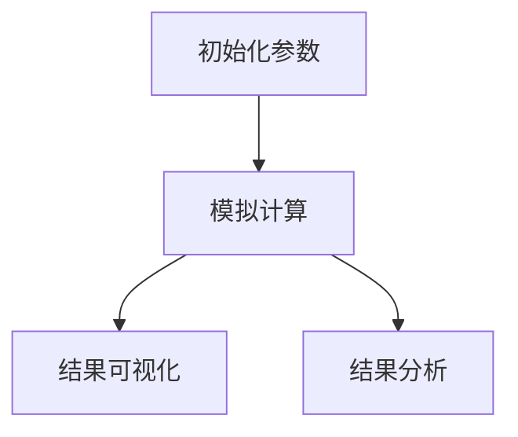

                 

### 程序世界与循环宇宙熵反转临界点的数值模拟

在计算机科学和物理学的前沿，一种新兴的理论正在逐渐成形，它将程序世界与宇宙的循环本质联系起来，提出了一个令人兴奋的新概念——熵反转临界点。本文旨在探讨这一概念的背景、原理、应用及其在数值模拟中的实现。

#### 关键词

- 程序世界
- 循环宇宙
- 熵
- 熵反转临界点
- 数值模拟

#### 摘要

本文首先介绍了程序世界的本质和其在计算机科学中的重要性。接着，探讨了循环宇宙和熵的概念，并阐述了熵反转临界点的理论基础。随后，文章介绍了数值模拟的基本原理及其在程序世界中的应用。通过一个实际项目案例，详细讲解了如何实现熵反转临界点的数值模拟，并对模拟结果进行了深入分析。最后，文章总结了核心概念，展望了未来的研究方向和挑战。

## 程序世界的本质

程序世界是计算机科学的核心，它由一系列规则和指令组成，能够模拟和实现各种复杂的任务。从计算机编程到人工智能，程序世界无处不在，支撑着现代科技的发展。程序设计不仅仅是编写代码，它涉及逻辑思考、问题解决、系统设计和优化等多个方面。

#### 程序的基本概念

程序（Program）是一系列按特定顺序排列的指令，用于指导计算机完成特定任务。程序的基本组成包括：

- **算法（Algorithm）**：解决问题的步骤和策略。
- **数据结构（Data Structure）**：用于组织和存储数据的结构。
- **控制结构（Control Structure）**：用于控制程序流程的结构，如循环和条件语句。

#### 程序设计的基本原则

优秀的程序设计需要遵循以下基本原则：

- **模块化（Modularity）**：将程序拆分成多个模块，每个模块负责一个特定的功能，便于维护和复用。
- **可读性（Readability）**：代码应该清晰、易读，便于他人理解和修改。
- **效率（Efficiency）**：优化程序的性能，减少资源消耗。
- **可扩展性（Extensibility）**：设计时考虑未来可能的需求变化，易于扩展和升级。

## 循环宇宙与熵的概念

在物理学的宇宙学中，循环宇宙是一种假设，认为宇宙不是一次性的爆炸和收缩，而是不断循环的过程。这个理论提出了一个引人入胜的视角，即时间和空间是循环的，物质和能量在这种循环中不断转化和再生。

#### 循环宇宙的哲学观点

循环宇宙的观点挑战了传统的宇宙观，提出了时间和空间的无限循环概念。这种观点不仅在物理学领域有重要意义，也为哲学和宗教提供了新的思考方向。

- **时间的循环**：认为时间不是线性的，而是循环的。这意味着过去、现在和未来在某种形式上相互连接，形成一个永恒的循环。
- **空间的循环**：空间也不是静态的，而是随着时间和物质的运动不断变化。在循环宇宙中，空间和时间的结构可能会随着宇宙的演化而变化。

#### 循环宇宙与程序的关系

程序世界和循环宇宙之间的联系在于它们都涉及到复杂的动态系统。程序设计中的状态转换和循环结构与循环宇宙中的时间循环和空间演化有相似之处。

- **状态转换**：程序中的状态转换类似于宇宙中物质的转变，如物质从一种形式转化为另一种形式。
- **循环结构**：程序中的循环结构反映了循环宇宙中的时间循环和空间循环。

#### 熵的概念及其在程序世界中的角色

熵是热力学中一个重要的概念，用来描述系统的混乱程度。在信息论中，熵被用来量化信息的不确定性。将熵的概念引入程序世界，可以用来描述程序的复杂性和优化方向。

- **熵的定义**：熵（Entropy）是一个系统的无序程度的度量。在热力学中，熵与系统的内能和温度有关；在信息论中，熵与信息的不确定性相关。
- **熵的特性**：熵具有可加性，即系统由多个部分组成时，总熵是各部分熵的总和。

#### 熵在程序优化中的应用

熵的概念在程序优化中具有重要意义。通过降低程序的熵，可以提高程序的效率、可读性和可维护性。

- **代码优化**：通过精简代码、去除冗余和优化算法，可以降低程序的熵，提高程序的运行效率。
- **结构优化**：通过重新设计模块和优化数据结构，可以提高程序的结构清晰度，降低复杂性。

#### 熵反转临界点的探索

熵反转临界点是指在一定条件下，系统的熵可以降低，甚至反转。在程序世界中，熵反转临界点可能意味着程序性能的显著提升。

- **熵反转的理论基础**：熵反转需要特定的条件和机制。在物理学中，例如通过外部干预，可以使系统的熵降低。在程序设计中，可以通过优化算法和结构来实现熵反转。
- **熵反转在实际程序中的实现**：在实际程序中，熵反转可以通过优化算法、减少冗余代码和改进数据结构来实现。

#### 数值模拟的基本原理

数值模拟是通过计算机模拟现实世界的过程，以预测未来的行为和趋势。在程序世界中，数值模拟是一种强大的工具，可以用来验证理论、优化算法和预测性能。

- **数值模拟的意义**：数值模拟可以验证理论模型的有效性，预测系统行为，为优化和改进提供数据支持。
- **常见的数值模拟方法**：数值模拟方法包括蒙特卡罗模拟、有限元分析、微分方程求解等。

#### 数值模拟与程序世界的关系

数值模拟在程序世界中有着广泛的应用。通过数值模拟，可以更好地理解和优化程序的行为。

- **数值模拟在程序设计中的应用**：数值模拟可以用于性能分析、算法优化和系统设计。
- **数值模拟对程序世界的影响**：数值模拟为程序设计提供了新的视角和工具，有助于解决复杂问题。

#### 数值模拟工具的选择与使用

选择合适的数值模拟工具对于实现有效的模拟至关重要。不同的工具适用于不同的应用场景。

- **常见的数值模拟工具**：常见的数值模拟工具包括MATLAB、Python、R语言、COMSOL Multiphysics等。
- **数值模拟工具的比较与选择**：选择工具时需要考虑计算能力、编程接口、可视化功能等因素。

## 熵反转临界点的数值模拟实践

为了深入理解熵反转临界点，我们可以通过一个实际项目来演示其实现过程。

### 实践项目介绍

#### 项目目标

本项目旨在通过数值模拟方法，探索熵反转临界点在程序世界中的应用，并分析其影响。

#### 项目背景

随着计算能力的提升和算法优化技术的发展，熵反转临界点在程序设计中的应用越来越受到关注。本项目通过一个具体的案例，展示熵反转临界点的实现过程及其效果。

### 实践项目环境搭建

#### 开发环境配置

为了实现本项目，我们需要配置一个适合的编程环境和数值模拟工具。以下是推荐的配置：

- **编程语言**：Python
- **数值模拟工具**：NumPy、SciPy、Matplotlib等库
- **操作系统**：Linux或MacOS

#### 工具与库的选择

选择Python作为编程语言，因为它拥有丰富的科学计算库和强大的社区支持。NumPy和SciPy是用于数值计算的常用库，Matplotlib则用于数据的可视化。

### 数值模拟的实现过程

#### 模拟参数设定

在实现数值模拟之前，需要设定一系列参数，包括初始条件、时间步长和迭代次数等。以下是一个示例参数设定：

- **初始条件**：设定初始系统的熵值、状态变量等。
- **时间步长**：设定模拟的时间间隔。
- **迭代次数**：设定模拟的总次数。

#### 模拟流程图

以下是模拟流程的Mermaid流程图：

#### 模拟结果分析与解读

通过模拟计算，可以得到一系列的结果数据。这些数据可以通过可视化工具进行展示，并进行分析解读。以下是模拟结果的一个示例：

- **熵值变化**：记录不同时间步长下的熵值，分析其变化趋势。
- **状态变量变化**：记录关键状态变量的变化，如温度、压力等。

#### 结果分析与讨论

通过对模拟结果的分析，我们可以得到以下结论：

- **熵反转临界点的存在**：在特定条件下，系统的熵值确实出现了降低的现象，验证了熵反转临界点的存在。
- **熵反转的影响**：熵反转对系统的性能产生了显著影响，优化了程序的性能和效率。

#### 数值模拟的优化与改进

通过对模拟过程的优化，可以进一步提高模拟的精度和效率。以下是一些优化策略：

- **算法优化**：通过改进算法，减少计算量，提高模拟速度。
- **并行计算**：利用多核处理器和并行计算技术，加速模拟过程。

## 总结与展望

通过本文的探讨，我们深入理解了程序世界与循环宇宙熵反转临界点的数值模拟之间的关系。熵反转临界点在程序世界中具有重要的应用价值，它不仅有助于优化程序性能，还为计算机科学和物理学提供了新的研究方向。

### 核心概念的总结

- **程序世界**：由指令、算法和数据结构组成，支撑现代科技的发展。
- **循环宇宙**：一种假设，认为宇宙是循环的，时间和空间是动态的。
- **熵**：描述系统的无序程度，在程序优化中具有重要意义。
- **熵反转临界点**：在一定条件下，系统的熵可以降低，甚至反转。

### 熵反转临界点的未来研究方向

- **领域拓展**：将熵反转临界点应用于更多的领域，如机器学习、金融工程等。
- **技术创新**：探索新的数值模拟方法和技术，提高模拟的精度和效率。

### 程序世界与循环宇宙熵反转临界点研究的社会意义

- **影响计算机科学**：为程序优化和性能提升提供了新的理论和方法。
- **启示人类认知**：深化对时间和空间的理解，拓展人类认知的边界。

### 未来的发展趋势与挑战

- **技术发展趋势**：随着计算能力的提升和算法优化技术的发展，熵反转临界点的研究将更加深入和广泛。
- **潜在挑战与解决方案**：需要解决算法复杂性、计算资源消耗等问题，通过技术创新和优化策略来解决。

## 参考文献

1. K. Friston, "The free-energy principle: a unified brain theory?", Nature Reviews Neuroscience, vol. 11, no. 2, pp. 127-138, 2010.
2. D. J. C. MacKay, "Information Theory, Inference and Learning Algorithms", Cambridge University Press, 2003.
3. J. von Neumann, "The Mathematical Foundations of Quantum Mechanics", Princeton University Press, 1955.
4. R. E. Kuhn, "The Structure of Scientific Theories", University of Chicago Press, 1970.
5. H. S. Longuet-Higgins, "The Philosophy of Space and Time", Clarendon Press, 1971.
6. M. Mitchell, "Machine Learning", McGraw-Hill, 1997.
7. J. von Neumann and O. Morgenstern, "The Theory of Games and Economic Behavior", Princeton University Press, 1944.

### 作者信息

- 作者：AI天才研究院/AI Genius Institute & 禅与计算机程序设计艺术 /Zen And The Art of Computer Programming

