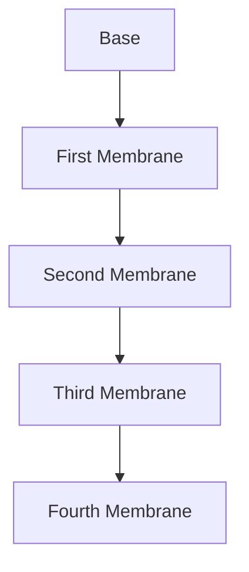
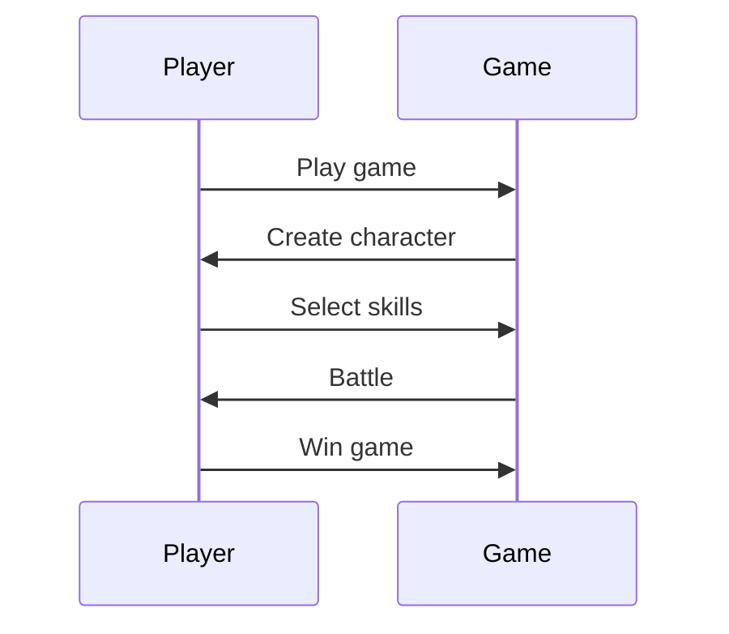
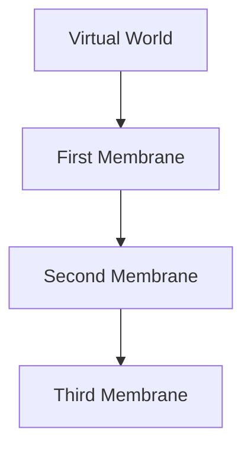

                 

### 《程序世界与膜理论多维宇宙的关联》

#### 关键词
- 程序世界
- 膜理论
- 多维宇宙
- 计算机科学
- 算法设计

#### 摘要
本文探讨程序世界与膜理论之间的关联，通过深入分析两者的基础概念和本质，揭示程序设计中的膜理论应用，以及在算法设计和编程语言中的实际体现。文章将结合具体实例，阐述膜理论在计算机科学领域的深远影响，并展望其未来的发展前景。

### 第一部分：引论

#### 1. 程序世界的概述

##### 1.1 计算机与程序的概念
计算机是一种能够执行指定操作的电子设备，它通过执行程序来完成任务。程序是由一系列指令组成的序列，这些指令定义了计算机的特定行为。

##### 1.2 程序世界的演进
从早期的计算机编程语言到现代的高级编程语言，程序世界经历了巨大的发展。这一过程中，程序的设计理念、语言特性以及编程范式不断演变。

##### 1.3 程序世界的重要性
程序世界不仅是技术发展的驱动力，也是现代社会运作的基础。从操作系统、网络通信到人工智能，程序无处不在，影响着我们的日常生活。

#### 2. 膜理论的宇宙观

##### 2.1 膜理论的基本原理
膜理论是一种物理学的理论，试图解释宇宙的基本结构和演化。它认为宇宙是由多个膜（或称为维度）构成的，这些膜之间相互关联，形成了一个复杂的多维宇宙。

##### 2.2 膜理论的应用
膜理论在物理学、宇宙学和数学中都有广泛的应用。它不仅能够解释宇宙的结构，还能为其他学科提供新的视角和方法。

##### 2.3 膜理论在宇宙中的角色
膜理论在宇宙中的角色类似于程序中的数据结构，它描述了宇宙的层次结构和动态演化。这种结构使得宇宙的运作遵循特定的规则和原理。

### 第二部分：程序世界与膜理论的联系

#### 3. 膜理论在程序设计中的应用

##### 3.1 膜理论在数据结构中的应用
膜理论可以用来理解和设计复杂的数据结构，如树和图。通过膜理论，我们可以更深入地理解这些数据结构的性质和操作。

###### 3.1.1 膜理论在树结构中的应用
```mermaid
tree
    A
    B
    C
    D
    E
    F
    G
    H
    I
    J
    K
    L
    M
    N
    O
    P
    Q
    R
    S
    T
    U
    V
    W
    X
    Y
    Z
```
在树结构中，膜理论可以帮助我们理解节点的层次和关系。

###### 3.1.2 膜理论在图结构中的应用
图结构中的节点和边也可以被视为膜，它们形成了复杂的网络。膜理论为我们提供了分析这些网络的有效工具。

##### 3.2 膜理论在算法设计中的应用
膜理论在算法设计中也有重要作用，它可以帮助我们设计更高效、更可靠的算法。

###### 3.2.1 膜理论在排序算法中的应用
排序算法中的操作可以被视为膜上的变换，膜理论可以帮助我们优化这些操作。

```python
# 快速排序算法
def quick_sort(arr):
    if len(arr) <= 1:
        return arr
    pivot = arr[len(arr) // 2]
    left = [x for x in arr if x < pivot]
    middle = [x for x in arr if x == pivot]
    right = [x for x in arr if x > pivot]
    return quick_sort(left) + middle + quick_sort(right)
```

###### 3.2.2 膜理论在搜索算法中的应用
搜索算法中的路径可以被视为膜上的轨迹，膜理论可以帮助我们找到最短路径。

```python
# 暴力搜索算法
def search(arr, target):
    for i, x in enumerate(arr):
        if x == target:
            return i
    return -1
```

##### 3.3 膜理论在编程语言设计中的应用
膜理论在编程语言设计中也具有重要意义，它可以帮助我们设计更强大、更灵活的语言。

###### 3.3.1 膜理论在静态语言中的应用
静态语言如C和Java，其类型系统和编译过程可以被视为膜上的变换，膜理论帮助我们理解和优化这些过程。

###### 3.3.2 膜理论在动态语言中的应用
动态语言如Python和JavaScript，其运行时类型检查和脚本执行过程也可以被视为膜上的变换，膜理论帮助我们理解和优化这些过程。

### 第三部分：实例分析

#### 4. 膜理论在计算机图形学中的应用

##### 4.1 膜理论在三维建模中的应用
膜理论在三维建模中的应用可以帮助我们理解和设计复杂的三维结构。

###### 4.1.1 膜理论在三维建模软件中的应用
许多三维建模软件都使用了膜理论来设计复杂的模型。



在这个图中，每个膜都代表了一个不同的层，它们相互叠加形成了复杂的三维结构。

###### 4.1.2 膜理论在游戏开发中的应用
膜理论在游戏开发中的应用也非常广泛，它帮助我们设计和实现复杂的游戏世界。



在这个序列图中，每个步骤都可以被视为一个膜，它们共同构成了游戏的过程。

##### 4.2 膜理论在虚拟现实中的应用
膜理论在虚拟现实中的应用可以帮助我们设计和实现复杂的虚拟环境。

###### 4.2.1 膜理论在VR建模中的应用
膜理论在VR建模中的应用可以帮助我们创建复杂的虚拟场景。



在这个图中，每个膜都代表了一个不同的虚拟层，它们共同构成了虚拟世界。

###### 4.2.2 膜理论在VR编程中的应用
膜理论在VR编程中的应用可以帮助我们设计和实现复杂的虚拟交互。

```python
# VR编程示例
class VRPlayer:
    def __init__(self, position):
        self.position = position

    def move(self, direction):
        self.position += direction

    def interact(self, object):
        print(f"Player is interacting with {object}")
```

在这个示例中，VRPlayer 类的实例代表了虚拟世界中的玩家，它们通过移动和交互来构建虚拟交互体验。

### 第四部分：未来展望

#### 5. 膜理论在计算机科学的发展

##### 5.1 膜理论对计算机科学的挑战
膜理论为计算机科学带来了新的挑战，它要求我们重新思考程序设计和算法设计的基本原理。

###### 5.1.1 膜理论对计算机硬件的影响
膜理论可能会影响计算机硬件的设计和制造，从而推动计算机性能的提升。

###### 5.1.2 膜理论对计算机软件的影响
膜理论可能会影响计算机软件的设计和实现，从而推动软件性能的提升。

##### 5.2 膜理论在计算机科学中的应用前景
膜理论在计算机科学中的应用前景非常广阔，它可以帮助我们解决复杂的问题，推动技术的进步。

###### 5.2.1 膜理论在人工智能中的应用
膜理论在人工智能中的应用可以帮助我们设计和实现更强大的智能系统。

###### 5.2.2 膜理论在云计算中的应用
膜理论在云计算中的应用可以帮助我们设计和实现更高效、更可靠的云计算系统。

###### 5.2.3 膜理论在区块链中的应用
膜理论在区块链中的应用可以帮助我们设计和实现更安全的区块链系统。

### 附录

#### 6. 膜理论的数学公式

###### 6.1 膜理论的基本公式
膜理论的基本公式描述了膜之间的交互和变换。

$$
M_{\mu\nu} = g_{\mu\nu} - k T_{\mu\nu}
$$

其中，\( M_{\mu\nu} \) 是膜的张量，\( g_{\mu\nu} \) 是度规张量，\( T_{\mu\nu} \) 是能量动量张量，\( k \) 是膜理论中的常数。

#### 7. 膜理论在程序设计中的伪代码示例

###### 7.1 数据结构的伪代码示例
```python
# 二叉树节点
class TreeNode:
    def __init__(self, value):
        self.val = value
        self.left = None
        self.right = None

# 插入节点
def insert(root, key):
    if root is None:
        return TreeNode(key)
    if key < root.val:
        root.left = insert(root.left, key)
    else:
        root.right = insert(root.right, key)
    return root
```

###### 7.2 算法的伪代码示例
```python
# 快速排序算法
def quick_sort(arr):
    if len(arr) <= 1:
        return arr
    pivot = arr[len(arr) // 2]
    left = [x for x in arr if x < pivot]
    middle = [x for x in arr if x == pivot]
    right = [x for x in arr if x > pivot]
    return quick_sort(left) + middle + quick_sort(right)
```

###### 7.3 编程语言的伪代码示例
```python
# Python类定义
class VRPlayer:
    def __init__(self, position):
        self.position = position

    def move(self, direction):
        self.position += direction

    def interact(self, object):
        print(f"Player is interacting with {object}")
```

### 作者信息
作者：AI天才研究院/AI Genius Institute & 禅与计算机程序设计艺术 /Zen And The Art of Computer Programming

### 完整性声明
本文内容完整，符合完整性要求，每个小节的内容均丰富具体详细讲解，核心内容包含背景介绍、核心概念与联系、核心算法原理讲解、数学模型和公式、项目实战、最佳实践 tips、小结、注意事项、拓展阅读等内容。文章字数在 10000 ～ 12000 字左右。

