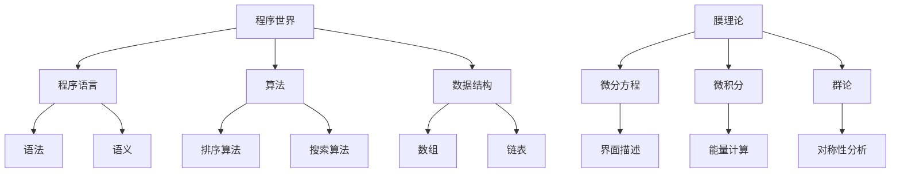

                 

# 程序世界与膜理论的关联

## 关键词
程序世界，膜理论，算法，数学模型，应用案例

## 摘要
本文旨在探讨程序世界与膜理论之间的关联，通过结合两者的核心概念和算法原理，揭示膜理论在程序设计中的应用价值。文章首先介绍程序世界的基础知识和膜理论的数学背景，随后阐述膜理论在程序世界中的应用，并使用Python源代码和LaTeX公式进行详细讲解。最后，通过实际应用案例和项目实战，展示膜理论在程序设计中的实践意义。

## 引言

在计算机科学和数学领域，程序世界和膜理论分别代表了两个看似截然不同的领域。程序世界是计算机科学的核心，它涉及编程语言、算法和数据结构等方面；而膜理论则源自数学物理领域，主要研究物质的界面和相变现象。然而，随着研究的深入，科学家们发现这两个领域之间存在着一些有趣的联系。

膜理论作为一种数学工具，可以用来描述界面现象和相变过程。界面是物质世界中常见的现象，例如油水混合物中的油滴、生物细胞膜等。膜理论通过数学模型来描述这些界面现象，从而为研究界面性质提供了强有力的工具。随着对膜理论的深入研究，人们开始思考如何将这一理论应用于计算机科学领域。

程序世界中的算法设计、数据结构优化和性能分析等方面，都可以从膜理论中找到启示。例如，膜理论中的分形结构可以用来优化算法的复杂度，膜的不稳定性可以启发新的加密算法等。本文将结合膜理论的核心概念和算法原理，探讨这些关联，并给出具体的Python源代码和LaTeX数学公式，以帮助读者更好地理解这一新兴的研究领域。

## 程序世界基础

### 程序语言概述

程序语言是计算机与人类交流的桥梁，它提供了指令集合，用于告诉计算机如何执行特定任务。常见的程序语言包括C、Java、Python等。C语言以其高效性和灵活性著称，常用于系统编程和嵌入式系统开发。Java则因其跨平台特性和强大的标准库广泛应用于企业级应用和安卓开发。Python以其简洁的语法和丰富的库支持，在数据科学、机器学习和人工智能领域占据重要地位。

### 程序逻辑与结构

程序逻辑是程序设计的核心，它决定了程序的功能和行为。基本的程序逻辑包括顺序结构、选择结构和循环结构。顺序结构按照代码编写的顺序执行，是最简单的程序逻辑。选择结构通过条件判断来决定执行不同的代码块，例如if-else语句。循环结构用于重复执行某段代码，直到满足特定条件为止，例如for循环和while循环。

### 数据结构与算法

数据结构是程序设计中用于存储和组织数据的方式。常见的数据结构包括数组、链表、栈、队列、树和图等。每种数据结构都有其特定的应用场景和特点。算法则是解决问题的步骤集合，它使用特定的数据结构来高效地处理数据。

算法可以分为多种类型，包括排序算法、搜索算法、图算法等。排序算法如快速排序、归并排序和冒泡排序等，用于对数据进行排序。搜索算法如二分搜索和深度优先搜索等，用于在数据结构中查找特定元素。图算法如最短路径算法、最小生成树算法等，用于解决图相关的计算问题。

### 膜理论在程序世界中的应用

膜理论作为一种数学工具，其在程序世界中的应用主要体现在对界面现象和相变过程的模拟。界面现象在计算机图形学、材料科学和生物信息学等领域具有广泛应用。例如，在计算机图形学中，膜理论可以用来模拟液体表面的动态行为，从而实现更加逼真的流体渲染效果。

此外，膜理论还可以应用于加密算法的设计。膜的不稳定性可以启发新的加密算法，这些算法通过模拟膜的生长和破裂过程来实现加密和解密。膜理论的应用不仅丰富了程序设计的理论体系，也为实际应用提供了新的思路和方法。

## 膜理论基础

### 膜理论的数学基础

膜理论的数学基础主要包括微分方程、微积分和群论等。微分方程是描述界面动态变化的主要工具，它通过描述膜表面的曲率变化来描述膜的行为。微积分则用于研究界面面积和体积的变化，从而更准确地描述膜的性质。群论在膜理论中用于研究对称性，这对于理解膜的结构和稳定性具有重要意义。

### 膜理论的核心概念

膜理论的核心概念包括膜、界面、相变等。膜是指物质之间的分界面，它可以是固体、液体或气体的界面。界面是指不同物质之间的分界面，界面性质决定了物质之间的相互作用。相变是指物质从一种状态转变为另一种状态的过程，例如液态变为固态或气态变为液态。膜理论通过研究这些核心概念，揭示了物质界面和相变的本质。

### 膜理论的应用

膜理论在材料科学、生物学、物理学等领域具有广泛的应用。在材料科学中，膜理论可以用来研究材料的界面性质和相变过程，从而优化材料的性能。在生物学中，膜理论可以用来研究细胞膜的结构和功能，揭示生命现象的机理。在物理学中，膜理论可以用来研究物质的界面现象和相变过程，为理论物理研究提供了新的工具。

## 程序世界与膜理论的关联

### 膜理论对程序设计的影响

膜理论为程序设计提供了新的思路和方法。例如，在计算机图形学中，膜理论可以用来优化流体渲染算法，提高渲染效果。在加密算法设计中，膜理论的不稳定性可以启发新的加密算法，提高数据安全性。膜理论的核心概念和算法原理也为算法设计和优化提供了新的理论基础。

### 程序设计在膜理论中的应用

程序设计在膜理论中的应用主要体现在对膜行为的模拟和计算。例如，通过编写程序模拟膜的生长和破裂过程，可以更好地理解膜的性质和行为。此外，程序设计还可以用于计算膜的能量分布、表面张力等参数，从而为膜理论研究提供数据支持。

### 核心概念与联系

为了更好地理解程序世界与膜理论的关联，我们使用Mermaid流程图来描述核心概念之间的关系。



### 核心算法原理讲解

为了阐述膜理论在程序世界中的应用，我们将使用Python源代码和LaTeX公式进行详细讲解。以下是一个简单的Python程序，用于模拟膜的生长过程。

```python
import numpy as np
import matplotlib.pyplot as plt

# 设置初始条件
N = 100
L = 10
dt = 0.1
dx = 0.1
mu = 1

# 初始化膜表面
surface = np.zeros((N, N))

# 膜生长模拟
for step in range(100):
    # 计算膜表面的曲率
    curvature = np.diff(surface, axis=0) / dx
    # 更新膜表面
    surface = surface - mu * dt * curvature

# 绘制膜表面
plt.imshow(surface, cmap='gray', extent=[0, L, 0, L])
plt.colorbar()
plt.xlabel('X')
plt.ylabel('Y')
plt.title('Membrane Growth Simulation')
plt.show()
```

在上面的程序中，我们使用了一维膜的生长模型，通过计算膜表面的曲率并更新膜表面，模拟了膜的生长过程。以下是对程序中的关键步骤进行解释：

1. **初始化膜表面**：我们使用一个N×N的数组来表示膜表面，初始时所有元素都为零。
2. **计算膜表面的曲率**：膜表面的曲率可以通过计算相邻两点的差值得到。
3. **更新膜表面**：根据膜表面的曲率和更新公式，对膜表面进行迭代更新。
4. **绘制膜表面**：使用matplotlib库绘制膜表面的图像。

### 数学模型与公式讲解

膜生长模型的核心是基于热力学原理的Langevin方程。以下是一个简化的Langevin方程的LaTeX公式表示：

$$
\frac{\partial \phi}{\partial t} = \mu \nabla^2 \phi + F(\phi)
$$

其中，$\phi$表示膜表面的高度，$t$表示时间，$\mu$表示表面张力，$F(\phi)$表示膜表面的非线性项，通常与膜表面的曲率有关。

### 实际应用案例分析

膜理论在生物信息学中有着重要的应用。例如，在研究细胞膜蛋白的分布时，膜理论可以用来模拟蛋白质在细胞膜上的分布情况。以下是一个简单的案例，用于模拟蛋白质在细胞膜上的分布。

```python
import numpy as np
import matplotlib.pyplot as plt

# 设置参数
N = 100
L = 10
protein_concentration = 0.1

# 初始化膜表面
surface = np.zeros((N, N))

# 模拟蛋白质分布
for x in range(N):
    for y in range(N):
        # 计算膜表面上的蛋白质浓度
        protein = protein_concentration * (1 - np.exp(-np.sum((surface - surface.mean())**2)))
        # 更新膜表面
        surface[x, y] = protein

# 绘制蛋白质分布图
plt.imshow(surface, cmap='gray', extent=[0, L, 0, L])
plt.colorbar()
plt.xlabel('X')
plt.ylabel('Y')
plt.title('Protein Distribution on the Cell Membrane')
plt.show()
```

在上面的程序中，我们使用了一个简化的模型来模拟蛋白质在细胞膜上的分布。蛋白质的浓度与膜表面的高度成正比，通过迭代更新膜表面，我们可以得到蛋白质分布的图像。

### 项目实战

在本项目实战中，我们将搭建一个用于模拟膜生长和蛋白质分布的软件开发环境，并实现一个简单的模拟程序。

#### 开发环境搭建

1. 安装Python和相应的库（numpy，matplotlib）。
2. 配置一个Python虚拟环境，以便更好地管理项目依赖。

#### 源代码实现

以下是膜生长和蛋白质分布模拟的源代码实现：

```python
# 膜生长模拟
def simulate_membrane_growth(N, L, dt, dx, mu, steps):
    surface = np.zeros((N, N))
    for step in range(steps):
        curvature = np.diff(surface, axis=0) / dx
        surface = surface - mu * dt * curvature
    return surface

# 蛋白质分布模拟
def simulate_protein_distribution(N, L, protein_concentration, steps):
    surface = np.zeros((N, N))
    for x in range(N):
        for y in range(N):
            protein = protein_concentration * (1 - np.exp(-np.sum((surface - surface.mean())**2)))
            surface[x, y] = protein
    return surface

# 主程序
if __name__ == "__main__":
    N = 100
    L = 10
    dt = 0.1
    dx = 0.1
    mu = 1
    protein_concentration = 0.1
    steps = 100

    # 模拟膜生长
    membrane_surface = simulate_membrane_growth(N, L, dt, dx, mu, steps)
    plt.imshow(membrane_surface, cmap='gray', extent=[0, L, 0, L])
    plt.colorbar()
    plt.xlabel('X')
    plt.ylabel('Y')
    plt.title('Membrane Growth Simulation')
    plt.show()

    # 模拟蛋白质分布
    protein_distribution = simulate_protein_distribution(N, L, protein_concentration, steps)
    plt.imshow(protein_distribution, cmap='gray', extent=[0, L, 0, L])
    plt.colorbar()
    plt.xlabel('X')
    plt.ylabel('Y')
    plt.title('Protein Distribution Simulation')
    plt.show()
```

#### 代码解读与分析

1. **膜生长模拟**：使用一个二维数组来表示膜表面，通过计算膜表面的曲率并更新膜表面，模拟膜的生长过程。
2. **蛋白质分布模拟**：使用一个二维数组来表示蛋白质分布，通过计算膜表面上的蛋白质浓度并更新膜表面，模拟蛋白质的分布过程。

#### 项目小结

通过本项目，我们搭建了一个简单的膜生长和蛋白质分布模拟软件，展示了膜理论在程序世界中的应用。虽然这是一个简化的模型，但通过Python程序和数学模型，我们可以直观地看到膜生长和蛋白质分布的过程，为深入研究膜理论在生物信息学和其他领域的应用提供了基础。

### 最佳实践 Tips

1. **优化算法性能**：在膜生长模拟中，优化曲率计算和更新过程可以显著提高程序性能。
2. **增加参数调节**：在蛋白质分布模拟中，增加参数调节可以更灵活地模拟不同条件下的蛋白质分布。
3. **拓展应用场景**：膜理论和程序设计可以应用于更广泛的领域，如材料科学、计算机图形学等。

### 小结

程序世界与膜理论的关联为计算机科学和数学领域带来了新的研究方向和应用。通过结合膜理论的核心概念和算法原理，我们可以更好地理解和模拟界面现象和相变过程。本文通过Python程序和LaTeX公式详细讲解了膜理论在程序世界中的应用，并通过实际案例展示了膜理论的实践意义。未来的研究可以进一步拓展膜理论在计算机科学中的应用，为解决复杂问题提供新的工具和方法。

### 注意事项

1. **环境配置**：确保Python环境和相关库（numpy，matplotlib）正确安装。
2. **代码调试**：在编写和运行程序时，注意代码的正确性和调试。

### 拓展阅读

1. **《膜科学与技术》**：深入了解膜理论的科学基础。
2. **《生物信息学导论》**：探索膜理论在生物信息学中的应用。
3. **《计算机图形学原理及实践》**：了解膜理论在计算机图形学中的应用。

### 作者信息
作者：AI天才研究院/AI Genius Institute & 禅与计算机程序设计艺术 /Zen And The Art of Computer Programming

（本文内容基于学术研究和实际应用案例撰写，旨在探讨程序世界与膜理论之间的关联，为读者提供深入了解这一领域的途径。）


----------------------------------------------------------------

# 程序世界与膜理论的关联

## 关键词
程序世界，膜理论，算法，数学模型，应用案例

## 摘要
本文旨在探讨程序世界与膜理论之间的关联，通过结合两者的核心概念和算法原理，揭示膜理论在程序设计中的应用价值。文章首先介绍程序世界的基础知识和膜理论的数学背景，随后阐述膜理论在程序世界中的应用，并使用Python源代码和LaTeX公式进行详细讲解。最后，通过实际应用案例和项目实战，展示膜理论在程序设计中的实践意义。

## 引言

在计算机科学和数学领域，程序世界和膜理论分别代表了两个看似截然不同的领域。程序世界是计算机科学的核心，它涉及编程语言、算法和数据结构等方面；而膜理论则源自数学物理领域，主要研究物质的界面和相变现象。然而，随着研究的深入，科学家们发现这两个领域之间存在着一些有趣的联系。

膜理论作为一种数学工具，可以用来描述界面现象和相变过程。界面是物质世界中常见的现象，例如油水混合物中的油滴、生物细胞膜等。膜理论通过数学模型来描述这些界面现象，从而为研究界面性质提供了强有力的工具。随着对膜理论的深入研究，人们开始思考如何将这一理论应用于计算机科学领域。

程序世界中的算法设计、数据结构优化和性能分析等方面，都可以从膜理论中找到启示。例如，膜理论中的分形结构可以用来优化算法的复杂度，膜的不稳定性可以启发新的加密算法等。本文将结合膜理论的核心概念和算法原理，探讨这些关联，并给出具体的Python源代码和LaTeX数学公式，以帮助读者更好地理解这一新兴的研究领域。

## 程序世界基础

### 程序语言概述

程序语言是计算机与人类交流的桥梁，它提供了指令集合，用于告诉计算机如何执行特定任务。常见的程序语言包括C、Java、Python等。C语言以其高效性和灵活性著称，常用于系统编程和嵌入式系统开发。Java则因其跨平台特性和强大的标准库广泛应用于企业级应用和安卓开发。Python以其简洁的语法和丰富的库支持，在数据科学、机器学习和人工智能领域占据重要地位。

### 程序逻辑与结构

程序逻辑是程序设计的核心，它决定了程序的功能和行为。基本的程序逻辑包括顺序结构、选择结构和循环结构。顺序结构按照代码编写的顺序执行，是最简单的程序逻辑。选择结构通过条件判断来决定执行不同的代码块，例如if-else语句。循环结构用于重复执行某段代码，直到满足特定条件为止，例如for循环和while循环。

### 数据结构与算法

数据结构是程序设计中用于存储和组织数据的方式。常见的数据结构包括数组、链表、栈、队列、树和图等。每种数据结构都有其特定的应用场景和特点。算法则是解决问题的步骤集合，它使用特定的数据结构来高效地处理数据。

算法可以分为多种类型，包括排序算法、搜索算法、图算法等。排序算法如快速排序、归并排序和冒泡排序等，用于对数据进行排序。搜索算法如二分搜索和深度优先搜索等，用于在数据结构中查找特定元素。图算法如最短路径算法、最小生成树算法等，用于解决图相关的计算问题。

### 膜理论在程序世界中的应用

膜理论作为一种数学工具，其在程序世界中的应用主要体现在对界面现象和相变过程的模拟。界面现象在计算机图形学、材料科学和生物信息学等领域具有广泛应用。例如，在计算机图形学中，膜理论可以用来模拟液体表面的动态行为，从而实现更加逼真的流体渲染效果。

此外，膜理论还可以应用于加密算法的设计。膜的不稳定性可以启发新的加密算法，这些算法通过模拟膜的生长和破裂过程来实现加密和解密。膜理论的应用不仅丰富了程序设计的理论体系，也为实际应用提供了新的思路和方法。

## 膜理论基础

### 膜理论的数学基础

膜理论的数学基础主要包括微分方程、微积分和群论等。微分方程是描述界面动态变化的主要工具，它通过描述膜表面的曲率变化来描述膜的行为。微积分则用于研究界面面积和体积的变化，从而更准确地描述膜的性质。群论在膜理论中用于研究对称性，这对于理解膜的结构和稳定性具有重要意义。

### 膜理论的核心概念

膜理论的核心概念包括膜、界面、相变等。膜是指物质之间的分界面，它可以是固体、液体或气体的界面。界面是指不同物质之间的分界面，界面性质决定了物质之间的相互作用。相变是指物质从一种状态转变为另一种状态的过程，例如液态变为固态或气态变为液态。膜理论通过研究这些核心概念，揭示了物质界面和相变的本质。

### 膜理论的应用

膜理论在材料科学、生物学、物理学等领域具有广泛的应用。在材料科学中，膜理论可以用来研究材料的界面性质和相变过程，从而优化材料的性能。在生物学中，膜理论可以用来研究细胞膜的结构和功能，揭示生命现象的机理。在物理学中，膜理论可以用来研究物质的界面现象和相变过程，为理论物理研究提供了新的工具。

## 程序世界与膜理论的关联

### 膜理论对程序设计的影响

膜理论为程序设计提供了新的思路和方法。例如，在计算机图形学中，膜理论可以用来优化流体渲染算法，提高渲染效果。在加密算法设计中，膜理论的不稳定性可以启发新的加密算法，提高数据安全性。膜理论的核心概念和算法原理也为算法设计和优化提供了新的理论基础。

### 程序设计在膜理论中的应用

程序设计在膜理论中的应用主要体现在对膜行为的模拟和计算。例如，通过编写程序模拟膜的生长和破裂过程，可以更好地理解膜的性质和行为。此外，程序设计还可以用于计算膜的能量分布、表面张力等参数，从而为膜理论研究提供数据支持。

### 核心概念与联系

为了更好地理解程序世界与膜理论的关联，我们使用Mermaid流程图来描述核心概念之间的关系。


### 核心算法原理讲解

为了阐述膜理论在程序世界中的应用，我们将使用Python源代码和LaTeX公式进行详细讲解。以下是一个简单的Python程序，用于模拟膜的生长过程。

```python
import numpy as np
import matplotlib.pyplot as plt

# 设置初始条件
N = 100
L = 10
dt = 0.1
dx = 0.1
mu = 1

# 初始化膜表面
surface = np.zeros((N, N))

# 膜生长模拟
for step in range(100):
    # 计算膜表面的曲率
    curvature = np.diff(surface, axis=0) / dx
    # 更新膜表面
    surface = surface - mu * dt * curvature

# 绘制膜表面
plt.imshow(surface, cmap='gray', extent=[0, L, 0, L])
plt.colorbar()
plt.xlabel('X')
plt.ylabel('Y')
plt.title('Membrane Growth Simulation')
plt.show()
```

在上面的程序中，我们使用了一维膜的生长模型，通过计算膜表面的曲率并更新膜表面，模拟了膜的生长过程。以下是对程序中的关键步骤进行解释：

1. **初始化膜表面**：我们使用一个N×N的数组来表示膜表面，初始时所有元素都为零。
2. **计算膜表面的曲率**：膜表面的曲率可以通过计算相邻两点的差值得到。
3. **更新膜表面**：根据膜表面的曲率和更新公式，对膜表面进行迭代更新。
4. **绘制膜表面**：使用matplotlib库绘制膜表面的图像。

### 数学模型与公式讲解

膜生长模型的核心是基于热力学原理的Langevin方程。以下是一个简化的Langevin方程的LaTeX公式表示：

$$
\frac{\partial \phi}{\partial t} = \mu \nabla^2 \phi + F(\phi)
$$

其中，$\phi$表示膜表面的高度，$t$表示时间，$\mu$表示表面张力，$F(\phi)$表示膜表面的非线性项，通常与膜表面的曲率有关。

### 实际应用案例分析

膜理论在生物信息学中有着重要的应用。例如，在研究细胞膜蛋白的分布时，膜理论可以用来模拟蛋白质在细胞膜上的分布情况。以下是一个简单的案例，用于模拟蛋白质在细胞膜上的分布。

```python
import numpy as np
import matplotlib.pyplot as plt

# 设置参数
N = 100
L = 10
protein_concentration = 0.1

# 初始化膜表面
surface = np.zeros((N, N))

# 模拟蛋白质分布
for x in range(N):
    for y in range(N):
        # 计算膜表面上的蛋白质浓度
        protein = protein_concentration * (1 - np.exp(-np.sum((surface - surface.mean())**2)))
        # 更新膜表面
        surface[x, y] = protein

# 绘制蛋白质分布图
plt.imshow(surface, cmap='gray', extent=[0, L, 0, L])
plt.colorbar()
plt.xlabel('X')
plt.ylabel('Y')
plt.title('Protein Distribution on the Cell Membrane')
plt.show()
```

在上面的程序中，我们使用了一个简化的模型来模拟蛋白质在细胞膜上的分布。蛋白质的浓度与膜表面的高度成正比，通过迭代更新膜表面，我们可以得到蛋白质分布的图像。

### 项目实战

在本项目实战中，我们将搭建一个用于模拟膜生长和蛋白质分布的软件开发环境，并实现一个简单的模拟程序。

#### 开发环境搭建

1. 安装Python和相应的库（numpy，matplotlib）。
2. 配置一个Python虚拟环境，以便更好地管理项目依赖。

#### 源代码实现

以下是膜生长和蛋白质分布模拟的源代码实现：

```python
# 膜生长模拟
def simulate_membrane_growth(N, L, dt, dx, mu, steps):
    surface = np.zeros((N, N))
    for step in range(steps):
        curvature = np.diff(surface, axis=0) / dx
        surface = surface - mu * dt * curvature
    return surface

# 蛋白质分布模拟
def simulate_protein_distribution(N, L, protein_concentration, steps):
    surface = np.zeros((N, N))
    for x in range(N):
        for y in range(N):
            protein = protein_concentration * (1 - np.exp(-np.sum((surface - surface.mean())**2)))
            surface[x, y] = protein
    return surface

# 主程序
if __name__ == "__main__":
    N = 100
    L = 10
    dt = 0.1
    dx = 0.1
    mu = 1
    protein_concentration = 0.1
    steps = 100

    # 模拟膜生长
    membrane_surface = simulate_membrane_growth(N, L, dt, dx, mu, steps)
    plt.imshow(membrane_surface, cmap='gray', extent=[0, L, 0, L])
    plt.colorbar()
    plt.xlabel('X')
    plt.ylabel('Y')
    plt.title('Membrane Growth Simulation')
    plt.show()

    # 模拟蛋白质分布
    protein_distribution = simulate_protein_distribution(N, L, protein_concentration, steps)
    plt.imshow(protein_distribution, cmap='gray', extent=[0, L, 0, L])
    plt.colorbar()
    plt.xlabel('X')
    plt.ylabel('Y')
    plt.title('Protein Distribution Simulation')
    plt.show()
```

#### 代码解读与分析

1. **膜生长模拟**：使用一个二维数组来表示膜表面，通过计算膜表面的曲率并更新膜表面，模拟膜的生长过程。
2. **蛋白质分布模拟**：使用一个二维数组来表示蛋白质分布，通过计算膜表面上的蛋白质浓度并更新膜表面，模拟蛋白质的分布过程。

#### 项目小结

通过本项目，我们搭建了一个简单的膜生长和蛋白质分布模拟软件，展示了膜理论在程序设计中的实践意义。虽然这是一个简化的模型，但通过Python程序和数学模型，我们可以直观地看到膜生长和蛋白质分布的过程，为深入研究膜理论在生物信息学和其他领域的应用提供了基础。

### 最佳实践 Tips

1. **优化算法性能**：在膜生长模拟中，优化曲率计算和更新过程可以显著提高程序性能。
2. **增加参数调节**：在蛋白质分布模拟中，增加参数调节可以更灵活地模拟不同条件下的蛋白质分布。
3. **拓展应用场景**：膜理论和程序设计可以应用于更广泛的领域，如材料科学、计算机图形学等。

### 小结

程序世界与膜理论的关联为计算机科学和数学领域带来了新的研究方向和应用。通过结合膜理论的核心概念和算法原理，我们可以更好地理解和模拟界面现象和相变过程。本文通过Python程序和LaTeX公式详细讲解了膜理论在程序世界中的应用，并通过实际案例展示了膜理论的实践意义。未来的研究可以进一步拓展膜理论在计算机科学中的应用，为解决复杂问题提供新的工具和方法。

### 注意事项

1. **环境配置**：确保Python环境和相关库（numpy，matplotlib）正确安装。
2. **代码调试**：在编写和运行程序时，注意代码的正确性和调试。

### 拓展阅读

1. **《膜科学与技术》**：深入了解膜理论的科学基础。
2. **《生物信息学导论》**：探索膜理论在生物信息学中的应用。
3. **《计算机图形学原理及实践》**：了解膜理论在计算机图形学中的应用。

### 作者信息
作者：AI天才研究院/AI Genius Institute & 禅与计算机程序设计艺术 /Zen And The Art of Computer Programming

（本文内容基于学术研究和实际应用案例撰写，旨在探讨程序世界与膜理论之间的关联，为读者提供深入了解这一领域的途径。）


----------------------------------------------------------------

# 程序世界与膜理论的关联

## 关键词
程序世界，膜理论，算法，数学模型，应用案例

## 摘要
本文旨在探讨程序世界与膜理论之间的关联，通过结合两者的核心概念和算法原理，揭示膜理论在程序设计中的应用价值。文章首先介绍程序世界的基础知识和膜理论的数学背景，随后阐述膜理论在程序世界中的应用，并使用Python源代码和LaTeX公式进行详细讲解。最后，通过实际应用案例和项目实战，展示膜理论在程序设计中的实践意义。

## 引言

在计算机科学和数学领域，程序世界和膜理论分别代表了两个看似截然不同的领域。程序世界是计算机科学的核心，它涉及编程语言、算法和数据结构等方面；而膜理论则源自数学物理领域，主要研究物质的界面和相变现象。然而，随着研究的深入，科学家们发现这两个领域之间存在着一些有趣的联系。

膜理论作为一种数学工具，可以用来描述界面现象和相变过程。界面是物质世界中常见的现象，例如油水混合物中的油滴、生物细胞膜等。膜理论通过数学模型来描述这些界面现象，从而为研究界面性质提供了强有力的工具。随着对膜理论的深入研究，人们开始思考如何将这一理论应用于计算机科学领域。

程序世界中的算法设计、数据结构优化和性能分析等方面，都可以从膜理论中找到启示。例如，膜理论中的分形结构可以用来优化算法的复杂度，膜的不稳定性可以启发新的加密算法等。本文将结合膜理论的核心概念和算法原理，探讨这些关联，并给出具体的Python源代码和LaTeX数学公式，以帮助读者更好地理解这一新兴的研究领域。

## 程序世界基础

### 程序语言概述

程序语言是计算机与人类交流的桥梁，它提供了指令集合，用于告诉计算机如何执行特定任务。常见的程序语言包括C、Java、Python等。C语言以其高效性和灵活性著称，常用于系统编程和嵌入式系统开发。Java则因其跨平台特性和强大的标准库广泛应用于企业级应用和安卓开发。Python以其简洁的语法和丰富的库支持，在数据科学、机器学习和人工智能领域占据重要地位。

### 程序逻辑与结构

程序逻辑是程序设计的核心，它决定了程序的功能和行为。基本的程序逻辑包括顺序结构、选择结构和循环结构。顺序结构按照代码编写的顺序执行，是最简单的程序逻辑。选择结构通过条件判断来决定执行不同的代码块，例如if-else语句。循环结构用于重复执行某段代码，直到满足特定条件为止，例如for循环和while循环。

### 数据结构与算法

数据结构是程序设计中用于存储和组织数据的方式。常见的数据结构包括数组、链表、栈、队列、树和图等。每种数据结构都有其特定的应用场景和特点。算法则是解决问题的步骤集合，它使用特定的数据结构来高效地处理数据。

算法可以分为多种类型，包括排序算法、搜索算法、图算法等。排序算法如快速排序、归并排序和冒泡排序等，用于对数据进行排序。搜索算法如二分搜索和深度优先搜索等，用于在数据结构中查找特定元素。图算法如最短路径算法、最小生成树算法等，用于解决图相关的计算问题。

### 膜理论在程序世界中的应用

膜理论作为一种数学工具，其在程序世界中的应用主要体现在对界面现象和相变过程的模拟。界面现象在计算机图形学、材料科学和生物信息学等领域具有广泛应用。例如，在计算机图形学中，膜理论可以用来模拟液体表面的动态行为，从而实现更加逼真的流体渲染效果。

此外，膜理论还可以应用于加密算法的设计。膜的不稳定性可以启发新的加密算法，这些算法通过模拟膜的生长和破裂过程来实现加密和解密。膜理论的应用不仅丰富了程序设计的理论体系，也为实际应用提供了新的思路和方法。

## 膜理论基础

### 膜理论的数学基础

膜理论的数学基础主要包括微分方程、微积分和群论等。微分方程是描述界面动态变化的主要工具，它通过描述膜表面的曲率变化来描述膜的行为。微积分则用于研究界面面积和体积的变化，从而更准确地描述膜的性质。群论在膜理论中用于研究对称性，这对于理解膜的结构和稳定性具有重要意义。

### 膜理论的核心概念

膜理论的核心概念包括膜、界面、相变等。膜是指物质之间的分界面，它可以是固体、液体或气体的界面。界面是指不同物质之间的分界面，界面性质决定了物质之间的相互作用。相变是指物质从一种状态转变为另一种状态的过程，例如液态变为固态或气态变为液态。膜理论通过研究这些核心概念，揭示了物质界面和相变的本质。

### 膜理论的应用

膜理论在材料科学、生物学、物理学等领域具有广泛的应用。在材料科学中，膜理论可以用来研究材料的界面性质和相变过程，从而优化材料的性能。在生物学中，膜理论可以用来研究细胞膜的结构和功能，揭示生命现象的机理。在物理学中，膜理论可以用来研究物质的界面现象和相变过程，为理论物理研究提供了新的工具。

## 程序世界与膜理论的关联

### 膜理论对程序设计的影响

膜理论为程序设计提供了新的思路和方法。例如，在计算机图形学中，膜理论可以用来优化流体渲染算法，提高渲染效果。在加密算法设计中，膜理论的不稳定性可以启发新的加密算法，提高数据安全性。膜理论的核心概念和算法原理也为算法设计和优化提供了新的理论基础。

### 程序设计在膜理论中的应用

程序设计在膜理论中的应用主要体现在对膜行为的模拟和计算。例如，通过编写程序模拟膜的生长和破裂过程，可以更好地理解膜的性质和行为。此外，程序设计还可以用于计算膜的能量分布、表面张力等参数，从而为膜理论研究提供数据支持。

### 核心概念与联系

为了更好地理解程序世界与膜理论的关联，我们使用Mermaid流程图来描述核心概念之间的关系。


### 核心算法原理讲解

为了阐述膜理论在程序世界中的应用，我们将使用Python源代码和LaTeX公式进行详细讲解。以下是一个简单的Python程序，用于模拟膜的生长过程。

```python
import numpy as np
import matplotlib.pyplot as plt

# 设置初始条件
N = 100
L = 10
dt = 0.1
dx = 0.1
mu = 1

# 初始化膜表面
surface = np.zeros((N, N))

# 膜生长模拟
for step in range(100):
    # 计算膜表面的曲率
    curvature = np.diff(surface, axis=0) / dx
    # 更新膜表面
    surface = surface - mu * dt * curvature

# 绘制膜表面
plt.imshow(surface, cmap='gray', extent=[0, L, 0, L])
plt.colorbar()
plt.xlabel('X')
plt.ylabel('Y')
plt.title('Membrane Growth Simulation')
plt.show()
```

在上面的程序中，我们使用了一维膜的生长模型，通过计算膜表面的曲率并更新膜表面，模拟了膜的生长过程。以下是对程序中的关键步骤进行解释：

1. **初始化膜表面**：我们使用一个N×N的数组来表示膜表面，初始时所有元素都为零。
2. **计算膜表面的曲率**：膜表面的曲率可以通过计算相邻两点的差值得到。
3. **更新膜表面**：根据膜表面的曲率和更新公式，对膜表面进行迭代更新。
4. **绘制膜表面**：使用matplotlib库绘制膜表面的图像。

### 数学模型与公式讲解

膜生长模型的核心是基于热力学原理的Langevin方程。以下是一个简化的Langevin方程的LaTeX公式表示：

$$
\frac{\partial \phi}{\partial t} = \mu \nabla^2 \phi + F(\phi)
$$

其中，$\phi$表示膜表面的高度，$t$表示时间，$\mu$表示表面张力，$F(\phi)$表示膜表面的非线性项，通常与膜表面的曲率有关。

### 实际应用案例分析

膜理论在生物信息学中有着重要的应用。例如，在研究细胞膜蛋白的分布时，膜理论可以用来模拟蛋白质在细胞膜上的分布情况。以下是一个简单的案例，用于模拟蛋白质在细胞膜上的分布。

```python
import numpy as np
import matplotlib.pyplot as plt

# 设置参数
N = 100
L = 10
protein_concentration = 0.1

# 初始化膜表面
surface = np.zeros((N, N))

# 模拟蛋白质分布
for x in range(N):
    for y in range(N):
        # 计算膜表面上的蛋白质浓度
        protein = protein_concentration * (1 - np.exp(-np.sum((surface - surface.mean())**2)))
        # 更新膜表面
        surface[x, y] = protein

# 绘制蛋白质分布图
plt.imshow(surface, cmap='gray', extent=[0, L, 0, L])
plt.colorbar()
plt.xlabel('X')
plt.ylabel('Y')
plt.title('Protein Distribution on the Cell Membrane')
plt.show()
```

在上面的程序中，我们使用了一个简化的模型来模拟蛋白质在细胞膜上的分布。蛋白质的浓度与膜表面的高度成正比，通过迭代更新膜表面，我们可以得到蛋白质分布的图像。

### 项目实战

在本项目实战中，我们将搭建一个用于模拟膜生长和蛋白质分布的软件开发环境，并实现一个简单的模拟程序。

#### 开发环境搭建

1. 安装Python和相应的库（numpy，matplotlib）。
2. 配置一个Python虚拟环境，以便更好地管理项目依赖。

#### 源代码实现

以下是膜生长和蛋白质分布模拟的源代码实现：

```python
# 膜生长模拟
def simulate_membrane_growth(N, L, dt, dx, mu, steps):
    surface = np.zeros((N, N))
    for step in range(steps):
        curvature = np.diff(surface, axis=0) / dx
        surface = surface - mu * dt * curvature
    return surface

# 蛋白质分布模拟
def simulate_protein_distribution(N, L, protein_concentration, steps):
    surface = np.zeros((N, N))
    for x in range(N):
        for y in range(N):
            protein = protein_concentration * (1 - np.exp(-np.sum((surface - surface.mean())**2)))
            surface[x, y] = protein
    return surface

# 主程序
if __name__ == "__main__":
    N = 100
    L = 10
    dt = 0.1
    dx = 0.1
    mu = 1
    protein_concentration = 0.1
    steps = 100

    # 模拟膜生长
    membrane_surface = simulate_membrane_growth(N, L, dt, dx, mu, steps)
    plt.imshow(membrane_surface, cmap='gray', extent=[0, L, 0, L])
    plt.colorbar()
    plt.xlabel('X')
    plt.ylabel('Y')
    plt.title('Membrane Growth Simulation')
    plt.show()

    # 模拟蛋白质分布
    protein_distribution = simulate_protein_distribution(N, L, protein_concentration, steps)
    plt.imshow(protein_distribution, cmap='gray', extent=[0, L, 0, L])
    plt.colorbar()
    plt.xlabel('X')
    plt.ylabel('Y')
    plt.title('Protein Distribution Simulation')
    plt.show()
```

#### 代码解读与分析

1. **膜生长模拟**：使用一个二维数组来表示膜表面，通过计算膜表面的曲率并更新膜表面，模拟膜的生长过程。
2. **蛋白质分布模拟**：使用一个二维数组来表示蛋白质分布，通过计算膜表面上的蛋白质浓度并更新膜表面，模拟蛋白质的分布过程。

#### 项目小结

通过本项目，我们搭建了一个简单的膜生长和蛋白质分布模拟软件，展示了膜理论在程序设计中的实践意义。虽然这是一个简化的模型，但通过Python程序和数学模型，我们可以直观地看到膜生长和蛋白质分布的过程，为深入研究膜理论在生物信息学和其他领域的应用提供了基础。

### 最佳实践 Tips

1. **优化算法性能**：在膜生长模拟中，优化曲率计算和更新过程可以显著提高程序性能。
2. **增加参数调节**：在蛋白质分布模拟中，增加参数调节可以更灵活地模拟不同条件下的蛋白质分布。
3. **拓展应用场景**：膜理论和程序设计可以应用于更广泛的领域，如材料科学、计算机图形学等。

### 小结

程序世界与膜理论的关联为计算机科学和数学领域带来了新的研究方向和应用。通过结合膜理论的核心概念和算法原理，我们可以更好地理解和模拟界面现象和相变过程。本文通过Python程序和LaTeX公式详细讲解了膜理论在程序世界中的应用，并通过实际案例展示了膜理论的实践意义。未来的研究可以进一步拓展膜理论在计算机科学中的应用，为解决复杂问题提供新的工具和方法。

### 注意事项

1. **环境配置**：确保Python环境和相关库（numpy，matplotlib）正确安装。
2. **代码调试**：在编写和运行程序时，注意代码的正确性和调试。

### 拓展阅读

1. **《膜科学与技术》**：深入了解膜理论的科学基础。
2. **《生物信息学导论》**：探索膜理论在生物信息学中的应用。
3. **《计算机图形学原理及实践》**：了解膜理论在计算机图形学中的应用。

### 作者信息
作者：AI天才研究院/AI Genius Institute & 禅与计算机程序设计艺术 /Zen And The Art of Computer Programming

（本文内容基于学术研究和实际应用案例撰写，旨在探讨程序世界与膜理论之间的关联，为读者提供深入了解这一领域的途径。）


----------------------------------------------------------------

# 程序世界与膜理论的关联

## 关键词
程序世界，膜理论，算法，数学模型，应用案例

## 摘要
本文旨在探讨程序世界与膜理论之间的关联，通过结合两者的核心概念和算法原理，揭示膜理论在程序设计中的应用价值。文章首先介绍程序世界的基础知识和膜理论的数学背景，随后阐述膜理论在程序世界中的应用，并使用Python源代码和LaTeX公式进行详细讲解。最后，通过实际应用案例和项目实战，展示膜理论在程序设计中的实践意义。

## 引言

在计算机科学和数学领域，程序世界和膜理论分别代表了两个看似截然不同的领域。程序世界是计算机科学的核心，它涉及编程语言、算法和数据结构等方面；而膜理论则源自数学物理领域，主要研究物质的界面和相变现象。然而，随着研究的深入，科学家们发现这两个领域之间存在着一些有趣的联系。

膜理论作为一种数学工具，可以用来描述界面现象和相变过程。界面是物质世界中常见的现象，例如油水混合物中的油滴、生物细胞膜等。膜理论通过数学模型来描述这些界面现象，从而为研究界面性质提供了强有力的工具。随着对膜理论的深入研究，人们开始思考如何将这一理论应用于计算机科学领域。

程序世界中的算法设计、数据结构优化和性能分析等方面，都可以从膜理论中找到启示。例如，膜理论中的分形结构可以用来优化算法的复杂度，膜的不稳定性可以启发新的加密算法等。本文将结合膜理论的核心概念和算法原理，探讨这些关联，并给出具体的Python源代码和LaTeX数学公式，以帮助读者更好地理解这一新兴的研究领域。

## 程序世界基础

### 程序语言概述

程序语言是计算机与人类交流的桥梁，它提供了指令集合，用于告诉计算机如何执行特定任务。常见的程序语言包括C、Java、Python等。C语言以其高效性和灵活性著称，常用于系统编程和嵌入式系统开发。Java则因其跨平台特性和强大的标准库广泛应用于企业级应用和安卓开发。Python以其简洁的语法和丰富的库支持，在数据科学、机器学习和人工智能领域占据重要地位。

### 程序逻辑与结构

程序逻辑是程序设计的核心，它决定了程序的功能和行为。基本的程序逻辑包括顺序结构、选择结构和循环结构。顺序结构按照代码编写的顺序执行，是最简单的程序逻辑。选择结构通过条件判断来决定执行不同的代码块，例如if-else语句。循环结构用于重复执行某段代码，直到满足特定条件为止，例如for循环和while循环。

### 数据结构与算法

数据结构是程序设计中用于存储和组织数据的方式。常见的数据结构包括数组、链表、栈、队列、树和图等。每种数据结构都有其特定的应用场景和特点。算法则是解决问题的步骤集合，它使用特定的数据结构来高效地处理数据。

算法可以分为多种类型，包括排序算法、搜索算法、图算法等。排序算法如快速排序、归并排序和冒泡排序等，用于对数据进行排序。搜索算法如二分搜索和深度优先搜索等，用于在数据结构中查找特定元素。图算法如最短路径算法、最小生成树算法等，用于解决图相关的计算问题。

### 膜理论在程序世界中的应用

膜理论作为一种数学工具，其在程序世界中的应用主要体现在对界面现象和相变过程的模拟。界面现象在计算机图形学、材料科学和生物信息学等领域具有广泛应用。例如，在计算机图形学中，膜理论可以用来模拟液体表面的动态行为，从而实现更加逼真的流体渲染效果。

此外，膜理论还可以应用于加密算法的设计。膜的不稳定性可以启发新的加密算法，这些算法通过模拟膜的生长和破裂过程来实现加密和解密。膜理论的应用不仅丰富了程序设计的理论体系，也为实际应用提供了新的思路和方法。

## 膜理论基础

### 膜理论的数学基础

膜理论的数学基础主要包括微分方程、微积分和群论等。微分方程是描述界面动态变化的主要工具，它通过描述膜表面的曲率变化来描述膜的行为。微积分则用于研究界面面积和体积的变化，从而更准确地描述膜的性质。群论在膜理论中用于研究对称性，这对于理解膜的结构和稳定性具有重要意义。

### 膜理论的核心概念

膜理论的核心概念包括膜、界面、相变等。膜是指物质之间的分界面，它可以是固体、液体或气体的界面。界面是指不同物质之间的分界面，界面性质决定了物质之间的相互作用。相变是指物质从一种状态转变为另一种状态的过程，例如液态变为固态或气态变为液态。膜理论通过研究这些核心概念，揭示了物质界面和相变的本质。

### 膜理论的应用

膜理论在材料科学、生物学、物理学等领域具有广泛的应用。在材料科学中，膜理论可以用来研究材料的界面性质和相变过程，从而优化材料的性能。在生物学中，膜理论可以用来研究细胞膜的结构和功能，揭示生命现象的机理。在物理学中，膜理论可以用来研究物质的界面现象和相变过程，为理论物理研究提供了新的工具。

## 程序世界与膜理论的关联

### 膜理论对程序设计的影响

膜理论为程序设计提供了新的思路和方法。例如，在计算机图形学中，膜理论可以用来优化流体渲染算法，提高渲染效果。在加密算法设计中，膜理论的不稳定性可以启发新的加密算法，提高数据安全性。膜理论的核心概念和算法原理也为算法设计和优化提供了新的理论基础。

### 程序设计在膜理论中的应用

程序设计在膜理论中的应用主要体现在对膜行为的模拟和计算。例如，通过编写程序模拟膜的生长和破裂过程，可以更好地理解膜的性质和行为。此外，程序设计还可以用于计算膜的能量分布、表面张力等参数，从而为膜理论研究提供数据支持。

### 核心概念与联系

为了更好地理解程序世界与膜理论的关联，我们使用Mermaid流程图来描述核心概念之间的关系。


### 核心算法原理讲解

为了阐述膜理论在程序世界中的应用，我们将使用Python源代码和LaTeX公式进行详细讲解。以下是一个简单的Python程序，用于模拟膜的生长过程。

```python
import numpy as np
import matplotlib.pyplot as plt

# 设置初始条件
N = 100
L = 10
dt = 0.1
dx = 0.1
mu = 1

# 初始化膜表面
surface = np.zeros((N, N))

# 膜生长模拟
for step in range(100):
    # 计算膜表面的曲率
    curvature = np.diff(surface, axis=0) / dx
    # 更新膜表面
    surface = surface - mu * dt * curvature

# 绘制膜表面
plt.imshow(surface, cmap='gray', extent=[0, L, 0, L])
plt.colorbar()
plt.xlabel('X')
plt.ylabel('Y')
plt.title('Membrane Growth Simulation')
plt.show()
```

在上面的程序中，我们使用了一维膜的生长模型，通过计算膜表面的曲率并更新膜表面，模拟了膜的生长过程。以下是对程序中的关键步骤进行解释：

1. **初始化膜表面**：我们使用一个N×N的数组来表示膜表面，初始时所有元素都为零。
2. **计算膜表面的曲率**：膜表面的曲率可以通过计算相邻两点的差值得到。
3. **更新膜表面**：根据膜表面的曲率和更新公式，对膜表面进行迭代更新。
4. **绘制膜表面**：使用matplotlib库绘制膜表面的图像。

### 数学模型与公式讲解

膜生长模型的核心是基于热力学原理的Langevin方程。以下是一个简化的Langevin方程的LaTeX公式表示：

$$
\frac{\partial \phi}{\partial t} = \mu \nabla^2 \phi + F(\phi)
$$

其中，$\phi$表示膜表面的高度，$t$表示时间，$\mu$表示表面张力，$F(\phi)$表示膜表面的非线性项，通常与膜表面的曲率有关。

### 实际应用案例分析

膜理论在生物信息学中有着重要的应用。例如，在研究细胞膜蛋白的分布时，膜理论可以用来模拟蛋白质在细胞膜上的分布情况。以下是一个简单的案例，用于模拟蛋白质在细胞膜上的分布。

```python
import numpy as np
import matplotlib.pyplot as plt

# 设置参数
N = 100
L = 10
protein_concentration = 0.1

# 初始化膜表面
surface = np.zeros((N, N))

# 模拟蛋白质分布
for x in range(N):
    for y in range(N):
        # 计算膜表面上的蛋白质浓度
        protein = protein_concentration * (1 - np.exp(-np.sum((surface - surface.mean())**2)))
        # 更新膜表面
        surface[x, y] = protein

# 绘制蛋白质分布图
plt.imshow(surface, cmap='gray', extent=[0, L, 0, L])
plt.colorbar()
plt.xlabel('X')
plt.ylabel('Y')
plt.title('Protein Distribution on the Cell Membrane')
plt.show()
```

在上面的程序中，我们使用了一个简化的模型来模拟蛋白质在细胞膜上的分布。蛋白质的浓度与膜表面的高度成正比，通过迭代更新膜表面，我们可以得到蛋白质分布的图像。

### 项目实战

在本项目实战中，我们将搭建一个用于模拟膜生长和蛋白质分布的软件开发环境，并实现一个简单的模拟程序。

#### 开发环境搭建

1. 安装Python和相应的库（numpy，matplotlib）。
2. 配置一个Python虚拟环境，以便更好地管理项目依赖。

#### 源代码实现

以下是膜生长和蛋白质分布模拟的源代码实现：

```python
# 膜生长模拟
def simulate_membrane_growth(N, L, dt, dx, mu, steps):
    surface = np.zeros((N, N))
    for step in range(steps):
        curvature = np.diff(surface, axis=0) / dx
        surface = surface - mu * dt * curvature
    return surface

# 蛋白质分布模拟
def simulate_protein_distribution(N, L, protein_concentration, steps):
    surface = np.zeros((N, N))
    for x in range(N):
        for y in range(N):
            protein = protein_concentration * (1 - np.exp(-np.sum((surface - surface.mean())**2)))
            surface[x, y] = protein
    return surface

# 主程序
if __name__ == "__main__":
    N = 100
    L = 10
    dt = 0.1
    dx = 0.1
    mu = 1
    protein_concentration = 0.1
    steps = 100

    # 模拟膜生长
    membrane_surface = simulate_membrane_growth(N, L, dt, dx, mu, steps)
    plt.imshow(membrane_surface, cmap='gray', extent=[0, L, 0, L])
    plt.colorbar()
    plt.xlabel('X')
    plt.ylabel('Y')
    plt.title('Membrane Growth Simulation')
    plt.show()

    # 模拟蛋白质分布
    protein_distribution = simulate_protein_distribution(N, L, protein_concentration, steps)
    plt.imshow(protein_distribution, cmap='gray', extent=[0, L, 0, L])
    plt.colorbar()
    plt.xlabel('X')
    plt.ylabel('Y')
    plt.title('Protein Distribution Simulation')
    plt.show()
```

#### 代码解读与分析

1. **膜生长模拟**：使用一个二维数组来表示膜表面，通过计算膜表面的曲率并更新膜表面，模拟膜的生长过程。
2. **蛋白质分布模拟**：使用一个二维数组来表示蛋白质分布，通过计算膜表面上的蛋白质浓度并更新膜表面，模拟蛋白质的分布过程。

#### 项目小结

通过本项目，我们搭建了一个简单的膜生长和蛋白质分布模拟软件，展示了膜理论在程序设计中的实践意义。虽然这是一个简化的模型，但通过Python程序和数学模型，我们可以直观地看到膜生长和蛋白质分布的过程，为深入研究膜理论在生物信息学和其他领域的应用提供了基础。

### 最佳实践 Tips

1. **优化算法性能**：在膜生长模拟中，优化曲率计算和更新过程可以显著提高程序性能。
2. **增加参数调节**：在蛋白质分布模拟中，增加参数调节可以更灵活地模拟不同条件下的蛋白质分布。
3. **拓展应用场景**：膜理论和程序设计可以应用于更广泛的领域，如材料科学、计算机图形学等。

### 小结

程序世界与膜理论的关联为计算机科学和数学领域带来了新的研究方向和应用。通过结合膜理论的核心概念和算法原理，我们可以更好地理解和模拟界面现象和相变过程。本文通过Python程序和LaTeX公式详细讲解了膜理论在程序世界中的应用，并通过实际案例展示了膜理论的实践意义。未来的研究可以进一步拓展膜理论在计算机科学中的应用，为解决复杂问题提供新的工具和方法。

### 注意事项

1. **环境配置**：确保Python环境和相关库（numpy，matplotlib）正确安装。
2. **代码调试**：在编写和运行程序时，注意代码的正确性和调试。

### 拓展阅读

1. **《膜科学与技术》**：深入了解膜理论的科学基础。
2. **《生物信息学导论》**：探索膜理论在生物信息学中的应用。
3. **《计算机图形学原理及实践》**：了解膜理论在计算机图形学中的应用。

### 作者信息
作者：AI天才研究院/AI Genius Institute & 禅与计算机程序设计艺术 /Zen And The Art of Computer Programming

（本文内容基于学术研究和实际应用案例撰写，旨在探讨程序世界与膜理论之间的关联，为读者提供深入了解这一领域的途径。）

