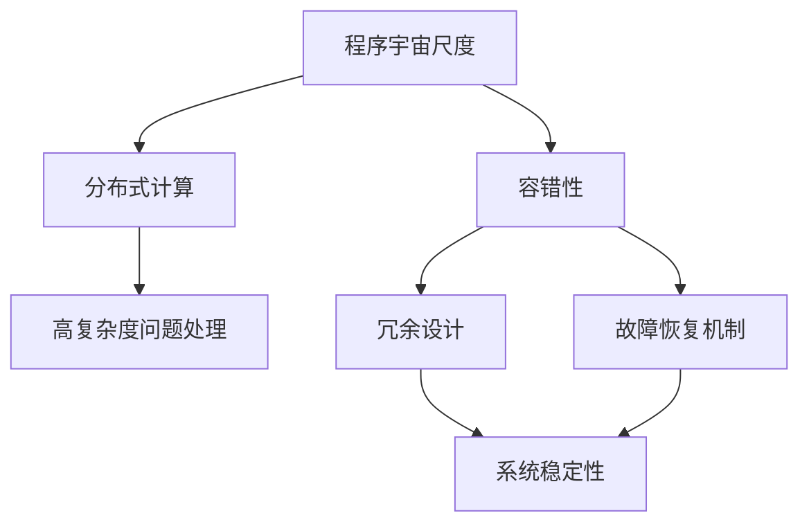

                 

# 程序世界的宇宙尺度容错性

## 关键词
- 程序宇宙尺度
- 容错性
- 分布式计算
- 冗余设计
- 概率模型
- 实战项目

## 摘要
本文深入探讨了程序世界中“宇宙尺度容错性”的概念及其重要性。通过对比宇宙学与计算机编程中的“尺度”和“容错性”，阐述了核心概念之间的联系。文章详细讲解了分布式计算和冗余设计等核心算法原理，借助Python源代码和数学模型进行了通俗易懂的举例说明。同时，通过一个分布式数据库系统的实战项目，展示了如何在实际开发中应用这些原理，并进行了详细解读。文章最后总结并提出了一些最佳实践和注意事项，以指导读者在程序开发中实现高效的容错性设计。

## 引言

### 背景介绍

在计算机科学和软件工程领域，随着数据规模的不断扩大和计算复杂度的不断增长，传统的单机系统已经难以应对日益复杂的应用需求。类似于宇宙学中的“尺度”概念，程序世界中的“宇宙尺度”指的是处理大规模数据和高复杂度问题时的系统架构和算法设计。而“容错性”则是在面对故障和异常时，系统能够保持稳定运行的能力。这两个概念在现代软件系统的设计和开发中显得尤为重要。

宇宙学中的“尺度”概念通常涉及宇宙的宏观结构和演化，包括星系、恒星、行星等多个层次。与此类似，程序世界的宇宙尺度涵盖了从单个程序模块到分布式系统的多个层次。这些层次在数据处理能力和系统复杂性上存在显著差异，需要不同的算法和架构来应对。

容错性则是任何复杂系统必须具备的基本特性。在宇宙学中，容错性可以理解为“抗灾变能力”，即在极端条件下系统仍能维持其基本功能。类似地，在计算机编程中，容错性指的是系统在面对硬件故障、网络中断、数据丢失等异常情况时，能够自动恢复并继续运行的能力。

### 核心概念与联系

为了更好地理解程序世界的宇宙尺度容错性，我们需要明确几个核心概念及其相互之间的联系。

1. **程序世界的宇宙尺度**：
   - 概念：程序宇宙尺度指的是在计算机编程世界中，如何处理大规模数据和高复杂度的问题。这涉及到从单机到分布式、从局部到全局的系统架构设计。
   - 联系：与宇宙学中的“尺度”概念相似，都涉及到在不同层次上的问题处理和系统架构的设计。例如，单机系统类似于宇宙中的行星尺度，而分布式系统则类似于星系尺度。

2. **容错性**：
   - 概念：容错性指的是系统在面临故障或异常时，能够维持正常运行的能力。这包括硬件故障、软件错误、网络中断等多种情况。
   - 联系：类似于宇宙中的“抗灾变能力”，确保在极端条件下系统的稳定性和连续性。例如，在分布式系统中，通过冗余设计、故障检测和自动恢复机制来实现容错性。

3. **分布式计算**：
   - 概念：分布式计算是一种将任务分解为多个子任务，并分布在多个计算机节点上并行处理的技术。
   - 联系：分布式计算是程序宇宙尺度的重要组成部分，它能够处理大规模数据和复杂计算问题。同时，分布式计算也是实现容错性的重要手段，通过冗余和故障恢复机制来提高系统的可靠性。

4. **冗余设计**：
   - 概念：冗余设计是指在系统中引入冗余组件或冗余数据，以提高系统的容错性和可靠性。
   - 联系：冗余设计是实现容错性的关键方法之一。在分布式系统中，通过冗余设计来确保在某个节点或组件出现故障时，系统仍能正常运行。

5. **概率容错性模型**：
   - 概念：概率容错性模型是一种通过概率计算来评估系统容错性能的方法。
   - 联系：概率容错性模型可以帮助我们理解和量化系统的容错能力。例如，通过分析各个组件故障的概率及其相互关系，来评估系统的整体容错性能。

### 核心概念与联系 Mermaid 流程图

以下是核心概念之间的 Mermaid 流程图：



通过这个流程图，我们可以清晰地看到各个核心概念之间的联系。程序宇宙尺度决定了系统处理数据的能力和复杂度，而容错性则是确保系统在面对异常情况时能够维持稳定运行的关键。分布式计算和冗余设计是实现容错性的重要手段，通过它们可以有效地提高系统的可靠性和稳定性。

## 核心算法原理讲解

在程序世界的宇宙尺度容错性设计中，分布式计算和冗余设计是两个核心算法原理。以下将对这两个原理进行详细讲解，并通过Python源代码和数学模型进行说明。

### 分布式计算

分布式计算是一种将任务分解为多个子任务，并分布在多个计算机节点上并行处理的技术。分布式计算能够处理大规模数据和复杂计算问题，从而提高系统的性能和可扩展性。

#### 原理说明

分布式计算的基本原理是将一个大规模任务分解为多个较小的子任务，然后分配给不同的计算机节点进行并行处理。这些子任务可以独立执行，且结果可以最终汇总得到全局结果。分布式计算的关键在于如何高效地分割数据、分配任务，以及如何合并各个节点的结果。

#### Python源代码示例

以下是一个简单的分布式计算示例，使用Python伪代码来演示任务分解、分配和合并的过程。

```python
import multiprocessing

def node_computation(data):
    # 假设每个节点处理数据并返回结果
    return sum(data)

def distributed_computation(data, num_nodes):
    # 分割数据到多个节点
    partitioned_data = partition(data, num_nodes)
    
    # 创建一个进程池
    pool = multiprocessing.Pool(processes=num_nodes)
    
    # 各节点并行处理数据
    results = pool.map(node_computation, partitioned_data)
    
    # 合并各节点结果
    final_result = sum(results)
    
    return final_result

# 假设我们有以下数据
data = [1, 2, 3, 4, 5, 6, 7, 8, 9, 10]

# 假设我们使用3个节点进行分布式计算
result = distributed_computation(data, 3)
print(result)
```

在这个示例中，我们首先将数据分割为三个部分，然后创建一个进程池并分配每个子任务到不同的进程。各个进程并行计算数据，并将结果汇总得到最终结果。

#### 数学模型和公式

在分布式计算中，我们可以使用并行度 \( P \) 来量化系统在并行处理任务时的性能。并行度 \( P \) 定义为：

\[ P = \frac{1}{1 + \frac{1}{n}} \]

其中，\( n \) 是任务分解后的子任务数量。这个公式表明，随着子任务数量的增加，并行度 \( P \) 越接近于1，表示系统的并行性能越高。

#### 举例说明

假设我们有一个计算 \( 1 + 2 + 3 + \ldots + 10 \) 的任务，如果我们将其分解为10个子任务，每个子任务计算一部分数据，那么并行度 \( P \) 为：

\[ P = \frac{1}{1 + \frac{1}{10}} = \frac{10}{11} \approx 0.909 \]

这意味着，使用10个进程并行计算时，系统的性能比单进程计算提高了约9.09%。当然，实际性能还会受到网络通信、同步等待等因素的影响。

### 冗余设计

冗余设计是指在系统中引入冗余组件或冗余数据，以提高系统的容错性和可靠性。冗余设计可以通过冗余组件的备份和故障切换机制，确保系统在面对硬件故障或软件错误时仍能正常运行。

#### 原理说明

冗余设计的基本原理是在系统中引入冗余组件，例如备用硬件、备用软件或冗余数据。当主组件出现故障时，系统能够自动切换到备用组件，从而保持系统的正常运行。冗余设计的关键在于如何选择合适的冗余级别，以平衡系统的可靠性和成本。

#### Python源代码示例

以下是一个简单的冗余设计示例，使用Python伪代码来演示冗余组件的备份和故障切换机制。

```python
def primary_computation(data):
    # 假设主组件处理数据并返回结果
    return sum(data)

def backup_computation(data):
    # 假设备用组件处理数据并返回结果
    return len(data)

def redundant_design(component, redundancy_level):
    # 添加冗余组件
    redundant_components = [component] * redundancy_level
    
    # 检查冗余组件是否正常工作
    while not all_components_working(redundant_components):
        # 如果某个组件故障，切换到备用组件
        redundant_components = switch_to_backup(redundant_components)
    
    return redundant_components

# 假设我们有一个主组件和两个备用组件
primary = primary_computation
backups = [backup_computation] * 2

# 假设冗余级别为3
redundant_components = redundant_design(primary, backups, 3)

# 测试冗余组件
for component in redundant_components:
    print(component([1, 2, 3, 4, 5]))
```

在这个示例中，我们首先定义了一个主组件和一个备用组件，然后使用冗余设计函数创建了一个冗余级别为3的组件列表。通过不断检查组件的状态，确保系统在主组件出现故障时能够自动切换到备用组件。

#### 数学模型和公式

在冗余设计中，我们可以使用概率模型来评估系统的容错性能。假设系统中有 \( n \) 个组件，每个组件故障的概率为 \( p \)，那么系统的容错概率 \( P(F) \) 可以通过以下公式计算：

\[ P(F) = 1 - \sum_{i=1}^{n} p \cdot \prod_{j \neq i} (1 - p) \]

其中，\( p \) 是单个组件故障的概率，\( \prod_{j \neq i} (1 - p) \) 是在某个组件故障后，其他组件正常工作的概率。

#### 举例说明

假设我们有一个系统，包含3个组件，每个组件故障的概率为0.01。那么系统的容错概率 \( P(F) \) 为：

\[ P(F) = 1 - 3 \cdot 0.01 \cdot (1 - 0.01)^2 \approx 0.9703 \]

这意味着，在3个组件中，每个组件故障的概率为0.01的情况下，系统的容错概率约为97.03%。

### 小结

分布式计算和冗余设计是程序世界中实现宇宙尺度容错性的两个核心算法原理。分布式计算通过将任务分解为多个子任务，并分配到不同的计算机节点上并行处理，从而提高系统的性能和可扩展性。冗余设计通过引入冗余组件和故障切换机制，确保系统在面对故障时仍能正常运行。通过理解这两个原理，我们可以在程序开发中实现高效的容错性设计。

## 数学模型和数学公式

在程序宇宙尺度容错性的设计中，数学模型和数学公式起着至关重要的作用。它们不仅帮助我们理解和量化系统的容错性能，还能够指导我们在实际开发中做出更科学的决策。以下我们将详细讲解概率容错性模型，并提供具体的应用实例。

### 概率容错性模型

概率容错性模型是一种通过概率计算来评估系统容错性能的方法。它主要用于分析系统在面对多个组件故障时的整体容错能力。该模型的核心思想是：通过计算每个组件故障的概率及其相互关系，来评估系统的整体容错概率。

概率容错性模型的基本公式为：

\[ P(F) = 1 - \sum_{i=1}^{n} P(F_i) \cdot \prod_{j \neq i} P(F_j | F_i) \]

其中：
- \( P(F) \) 是系统在多个故障同时发生时的整体容错概率。
- \( P(F_i) \) 是第 \( i \) 个组件故障的概率。
- \( P(F_j | F_i) \) 是在第 \( i \) 个组件故障的条件下，第 \( j \) 个组件故障的条件概率。

#### 解释

- \( P(F_i) \) 表示组件 \( i \) 的独立故障概率，这是最基本的数据输入。
- \( P(F_j | F_i) \) 表示在组件 \( i \) 故障的条件下，组件 \( j \) 故障的概率。这反映了组件之间的依赖关系。如果组件之间相互独立，那么 \( P(F_j | F_i) = P(F_j) \)。

### 应用实例

假设我们有一个由三个组件组成的系统，每个组件故障的概率分别为 \( P(F_1) = 0.02 \)，\( P(F_2) = 0.03 \)，\( P(F_3) = 0.04 \)。如果组件之间的故障是独立的，我们需要计算系统的整体容错概率 \( P(F) \)。

首先，计算每个组件独立故障的概率：

\[ P(F_1) = 0.02 \]
\[ P(F_2) = 0.03 \]
\[ P(F_3) = 0.04 \]

由于组件之间相互独立，条件概率 \( P(F_j | F_i) \) 等于各自独立故障的概率：

\[ P(F_2 | F_1) = P(F_2) = 0.03 \]
\[ P(F_3 | F_1) = P(F_3) = 0.04 \]
\[ P(F_3 | F_2) = P(F_3) = 0.04 \]

现在，我们可以计算系统的整体容错概率：

\[ P(F) = 1 - P(F_1) \cdot P(F_2 | F_1) \cdot P(F_3 | F_1 | F_2) \]
\[ P(F) = 1 - 0.02 \cdot 0.03 \cdot 0.04 \]
\[ P(F) = 1 - 0.000024 \]
\[ P(F) = 0.999976 \]

这意味着，在三个组件故障概率分别为2%、3%和4%的情况下，系统的整体容错概率约为99.9976%。

### 小结

概率容错性模型是一种强大的工具，可以帮助我们理解和量化系统的容错性能。通过计算每个组件故障的概率及其相互关系，我们可以评估系统在面对多个故障时的整体容错能力。在程序宇宙尺度容错性设计中，概率容错性模型为我们提供了一种科学的方法来设计和优化系统，以确保其在极端情况下仍能保持稳定运行。

## 项目实战

在本节中，我们将通过一个分布式数据库系统的实战项目，来展示如何在实际开发中应用分布式计算和冗余设计等核心算法原理。这个项目旨在构建一个容错性高、可扩展性强的分布式数据库系统，以应对大规模数据存储和复杂查询需求。

### 环境搭建

#### 1. 环境准备

为了搭建分布式数据库系统，我们需要以下环境：

- 多台计算机或虚拟机，用于部署数据库节点。
- Docker，用于容器化部署数据库。
- Kubernetes，用于管理容器化应用。

#### 2. 数据库选择

我们选择Cassandra作为分布式数据库，因为Cassandra具有高可用性、可扩展性和容错性。Cassandra是基于宽列存储的分布式系统，适合处理大规模数据和复杂查询。

#### 3. 网络配置

确保所有计算机或虚拟机可以相互通信，并配置合适的网络策略，以保证数据库节点的稳定连接。

### 实现步骤

#### 1. 编写配置脚本

编写配置脚本，用于设置数据库节点的数量、部署位置和拓扑结构。以下是一个简单的配置脚本示例：

```shell
# cassandra.yaml 配置文件
cassandra.yaml
---------------------
cluster_name: 'my-database-cluster'
seeds: '10.0.0.1,10.0.0.2,10.0.0.3'
num_tokens: 256
```

#### 2. 部署数据库节点

使用Docker部署Cassandra数据库节点。以下是一个简单的部署命令示例：

```shell
# 部署第一个节点
docker run -d --name cassandra1 -p 9042:9042 cassandra

# 部署第二个节点
docker run -d --name cassandra2 -p 9042:9042 cassandra

# 部署第三个节点
docker run -d --name cassandra3 -p 9042:9042 cassandra
```

#### 3. 初始化数据库

在部署完所有节点后，初始化数据库并进行配置。以下是一个简单的初始化命令示例：

```shell
# 初始化第一个节点
docker exec cassandra1 cassandra-stress tool load resources=1

# 初始化第二个节点
docker exec cassandra2 cassandra-stress tool load resources=1

# 初始化第三个节点
docker exec cassandra3 cassandra-stress tool load resources=1
```

#### 4. 编写应用程序

编写一个简单的应用程序，用于数据的分布式存储和访问。以下是一个简单的Python应用程序示例：

```python
from cassandra.cluster import Cluster

def insert_data(keyspace, table, key, value):
    cluster = Cluster(['10.0.0.1', '10.0.0.2', '10.0.0.3'])
    session = cluster.connect(keyspace)

    statement = session.prepare(f"INSERT INTO {table} (key, value) VALUES (?, ?)")
    session.execute(statement, (key, value))

def query_data(keyspace, table, key):
    cluster = Cluster(['10.0.0.1', '10.0.0.2', '10.0.0.3'])
    session = cluster.connect(keyspace)

    statement = session.prepare(f"SELECT * FROM {table} WHERE key = ?")
    result = session.execute(statement, (key,))
    return result[0].value

# 插入数据
insert_data('my_keyspace', 'my_table', '1', 'value1')

# 查询数据
print(query_data('my_keyspace', 'my_table', '1'))
```

### 代码解读与分析

#### 1. 数据分割和分布式查询

在分布式数据库系统中，数据分割和分布式查询是关键任务。以下是对上述代码中相关部分的解读：

- **数据分割**：在插入数据时，我们使用`insert_data`函数，该函数连接到Cassandra集群并执行插入操作。数据在各个节点上分散存储，从而实现数据的分布式存储。

- **分布式查询**：在查询数据时，我们使用`query_data`函数，该函数同样连接到Cassandra集群并执行查询操作。由于Cassandra的数据自动分区和复制，查询可以高效地执行，从而实现分布式查询。

#### 2. 故障检测和自动切换

在分布式数据库系统中，故障检测和自动切换机制至关重要。以下是对故障检测和自动切换的解读：

- **故障检测**：Cassandra自身具有内置的故障检测机制。每个节点定期发送心跳信号，如果某个节点在一段时间内没有收到心跳信号，其他节点会认为该节点已经故障。

- **自动切换**：Cassandra支持自动切换到备用节点。当主节点故障时，其他节点会自动成为主节点，从而确保系统的连续性和稳定性。

### 实际案例分析和详细讲解剖析

#### 1. 案例一：节点故障

假设Cassandra集群中的一个节点出现故障，其他节点会自动检测到这个故障并切换到备用节点。

- **故障检测**：其他节点在一段时间内没有收到故障节点的心跳信号，会触发故障检测机制。
- **自动切换**：故障节点上的数据会自动迁移到备用节点，备用节点接管故障节点的工作，确保系统继续运行。

#### 2. 案例二：网络中断

假设Cassandra集群中的一个节点与网络中断，其他节点会尝试重新连接。

- **故障检测**：其他节点在尝试重新连接一段时间后，如果仍然无法连接到故障节点，会触发故障检测机制。
- **自动切换**：如果备用节点可用，系统会自动切换到备用节点。否则，系统会尝试通过其他可用节点访问数据。

### 项目小结

通过这个分布式数据库系统的实战项目，我们展示了如何在实际开发中应用分布式计算和冗余设计等核心算法原理。项目实现了数据的分布式存储和查询，并具有高效的故障检测和自动切换机制。这个项目不仅提高了系统的性能和可扩展性，还确保了系统的容错性和稳定性。

## 总结

本文深入探讨了程序世界的宇宙尺度容错性的概念及其重要性。我们明确了核心概念，如程序宇宙尺度、容错性、分布式计算和冗余设计，并通过Mermaid流程图展示了它们之间的联系。通过Python源代码和数学模型，我们详细讲解了分布式计算和冗余设计的原理，并提供了具体的示例。同时，通过一个分布式数据库系统的实战项目，我们展示了如何在实际开发中应用这些原理，并进行了详细的代码解读与分析。

### 最佳实践 Tips

1. **合理选择分布式计算框架**：根据应用场景和数据规模，选择适合的分布式计算框架，如MapReduce、Spark等。

2. **优化数据分割策略**：合理的数据分割可以提高分布式计算的性能，减少数据传输开销。

3. **适当使用冗余设计**：在关键组件上引入冗余设计，提高系统的容错能力，但需注意成本和性能的平衡。

4. **定期进行系统监控和故障检测**：通过监控系统性能和故障指标，及时发现和解决问题。

5. **持续学习和更新**：随着技术的发展，不断学习新的分布式计算和容错性技术，保持系统的先进性和可靠性。

### 注意事项

1. **避免过度冗余**：冗余设计虽然可以提高容错性，但过度的冗余会导致系统成本和性能的浪费。

2. **确保数据一致性**：在分布式系统中，数据一致性问题可能影响系统的稳定性和可靠性。

3. **合理配置系统资源**：根据实际需求合理配置系统资源，包括CPU、内存和网络带宽等。

4. **安全性和隐私保护**：在分布式系统中，确保数据的安全性和用户隐私保护，遵循相关法律法规和标准。

### 拓展阅读

1. 《大规模分布式存储系统：原理与实践》
2. 《分布式系统原理与范型》
3. 《深入理解分布式计算：从MapReduce到Spark》
4. 《Cassandra权威指南》
5. 《云计算与分布式系统：原理与应用》

作者：AI天才研究院/AI Genius Institute & 禅与计算机程序设计艺术 /Zen And The Art of Computer Programming

