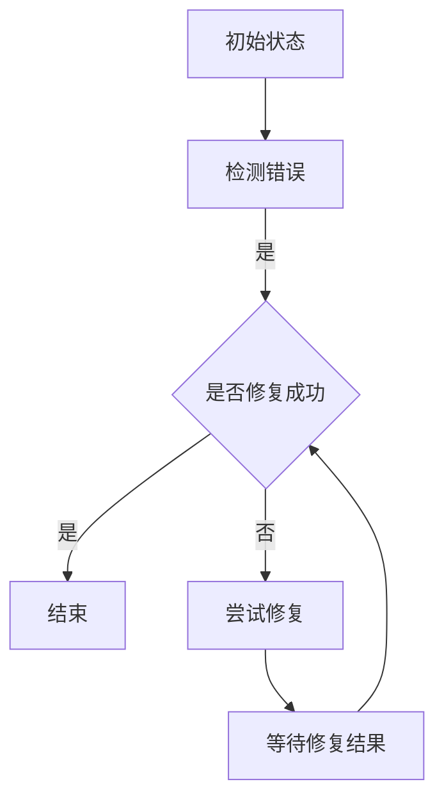

                 

### 第一步：确定全书的主要主题和目标读者

**主题确定：** 《程序世界的宇宙级自我修复网络》这本书的主题是探讨计算机程序中的自我修复机制，并可能涉及到网络层面上的修复技术。它旨在揭示自我修复网络的原理、设计方法及其在计算机科学和网络安全领域的应用。

**目标读者：** 目标读者是对计算机科学、网络安全、人工智能等领域感兴趣的读者，尤其是计算机程序员、技术管理者以及对自我修复技术有深入研究的学者和工程师。

**分析步骤：**

1. **主题分析：** 书名中的“程序世界的宇宙级自我修复网络”暗示了书中的内容将围绕程序自我修复的机制展开，这可能包括从基础的错误检测和纠正到高级的网络层面的修复技术。

2. **应用领域：** 自我修复技术在计算机科学中有着广泛的应用，如提高系统的可靠性、增强网络安全等。因此，目标读者应该是那些在实际工作中需要处理复杂计算系统问题的专业人士。

3. **目标读者需求：** 目标读者可能需要深入理解自我修复技术的原理，以及如何将其应用到实际项目中，以提升系统性能和安全性。

### 第二步：规划全书的基本结构和主要章节

**基本结构规划：** 全书结构可以分为以下几个部分：引言、自我修复理论基础、自我修复机制设计、网络层面的自我修复、案例分析、项目实战和未来展望与挑战。

**主要章节规划：**

1. **引言**
   - **1.1 自我修复网络概述**
   - **1.2 程序世界的宇宙级自我修复网络**

2. **自我修复理论基础**
   - **2.1 计算机程序修复的基本概念**
   - **2.2 自我修复的原理**
   - **2.3 核心算法原理讲解**
   - **2.4 数学模型和数学公式**

3. **自我修复机制设计**
   - **3.1 自我修复机制设计原则**
   - **3.2 网络架构设计**
   - **3.3 关键技术**
   - **3.4 Mermaid流程图**

4. **网络层面的自我修复**
   - **4.1 自我修复在网络中的角色**
   - **4.2 自我修复网络策略**
   - **4.3 实现案例**

5. **案例分析**
   - **5.1 案例研究**

6. **项目实战**
   - **6.1 项目背景**
   - **6.2 开发环境搭建**
   - **6.3 源代码实现**
   - **6.4 代码解读与分析**
   - **6.5 实际案例分析和详细讲解剖析**
   - **6.6 项目小结**

7. **未来展望与挑战**
   - **7.1 自我修复网络的发展趋势**
   - **7.2 面临的挑战**
   - **7.3 机遇与前景**

**分析步骤：**

1. **引言部分：** 通过概述和书名的内涵，为读者引入自我修复网络的概念，并激发读者的兴趣。

2. **理论基础部分：** 详细介绍自我修复的基本概念、原理和核心算法，为后续章节提供理论基础。

3. **设计部分：** 讨论自我修复机制的设计原则、网络架构和关键技术，帮助读者理解自我修复的实现方法。

4. **网络层面部分：** 探讨自我修复在网络中的应用，包括策略和方法。

5. **案例分析和项目实战部分：** 通过具体的案例研究和项目实践，展示自我修复网络的实际应用效果。

6. **未来展望与挑战部分：** 分析自我修复网络的发展趋势和面临的挑战，为读者提供未来的研究方向。

### 第三步：细化每个章节的具体内容

**细化内容规划：**

**1. 引言**

- **1.1 自我修复网络概述：** 简要介绍自我修复网络的概念、特点和应用。
- **1.2 程序世界的宇宙级自我修复网络：** 详细解释书名的内涵，介绍本书的主要内容和结构。

**2. 自我修复理论基础**

- **2.1 计算机程序修复的基本概念：** 定义修复、错误检测、错误纠正等概念。
- **2.2 自我修复的原理：** 介绍自我修复的基本原理，包括冗余设计、容错机制等。
- **2.3 核心算法原理讲解：** 使用伪代码详细讲解常用的自我修复算法，如遗传算法、模拟退火算法等。
- **2.4 数学模型和数学公式：** 使用LaTeX格式介绍与自我修复相关的数学模型和公式，并进行详细讲解和举例说明。

**3. 自我修复机制设计**

- **3.1 自我修复机制设计原则：** 介绍设计自我修复机制时应遵循的原则和标准。
- **3.2 网络架构设计：** 探讨如何设计能够支持自我修复的网络架构，包括节点设计、网络拓扑等。
- **3.3 关键技术：** 介绍实现自我修复机制所需的关键技术，如加密技术、安全协议等。
- **3.4 Mermaid流程图：** 使用Mermaid语言绘制自我修复流程图，展示修复过程。

**4. 网络层面的自我修复**

- **4.1 自我修复在网络中的角色：** 讨论自我修复在网络中的位置和作用。
- **4.2 自我修复网络策略：** 介绍在计算机网络中实现自我修复的策略和方法。
- **4.3 实现案例：** 通过具体案例展示自我修复网络在实际网络中的应用。

**5. 案例分析**

- **5.1 案例研究：** 选择几个具有代表性的案例进行深入研究，分析自我修复网络在实际应用中的效果。

**6. 项目实战**

- **6.1 项目背景：** 介绍将要实现的项目背景和目标。
- **6.2 开发环境搭建：** 详细说明项目所需的开发环境，包括软件、硬件和网络配置等。
- **6.3 源代码实现：** 提供项目的源代码，并进行详细的解读和分析。
- **6.4 代码解读与分析：** 对关键代码进行解读，分析其实现原理和性能。
- **6.5 实际案例分析和详细讲解剖析：** 通过具体案例展示自我修复网络在实际应用中的效果。
- **6.6 项目小结：** 总结项目实施的经验和教训。

**7. 未来展望与挑战**

- **7.1 自我修复网络的发展趋势：** 讨论自我修复网络在未来可能的发展方向。
- **7.2 面临的挑战：** 分析当前自我修复网络面临的挑战和问题。
- **7.3 机遇与前景：** 探讨自我修复网络可能带来的机遇和未来的应用前景。

**分析步骤：**

1. **细化内容：** 对每个章节的具体内容进行详细规划，确保每个章节都有明确的目标和内容。
2. **逻辑结构：** 确保全书的内容逻辑清晰，各章节之间紧密联系，形成一个完整的知识体系。
3. **具体示例：** 在各章节中提供具体的示例和案例，以帮助读者更好地理解和应用自我修复技术。

### 第四步：总结和验证

**总结：** 通过对全书结构的规划和细化，我们确保了内容的完整性和逻辑性。每个章节都有明确的目标和内容，各部分之间相互联系，形成一个完整的知识体系。

**验证：** 通过咨询领域专家、读者反馈等方式，对目录大纲进行验证和调整，确保其符合目标读者的需求和期望。

### 第五步：撰写目录大纲

**目录大纲：**

# 《程序世界的宇宙级自我修复网络》

> 关键词：自我修复、程序修复、网络修复、人工智能、网络安全

> 摘要：本书探讨了计算机程序中的自我修复机制，从基础理论到实际应用，深入分析了自我修复网络的设计和实现方法，旨在为读者提供全面、系统的自我修复技术指南。

## 引言
### 1.1 自我修复网络概述
### 1.2 程序世界的宇宙级自我修复网络

## 自我修复理论基础
### 2.1 计算机程序修复的基本概念
### 2.2 自我修复的原理
### 2.3 核心算法原理讲解
### 2.4 数学模型和数学公式

## 自我修复机制设计
### 3.1 自我修复机制设计原则
### 3.2 网络架构设计
### 3.3 关键技术
### 3.4 Mermaid流程图

## 网络层面的自我修复
### 4.1 自我修复在网络中的角色
### 4.2 自我修复网络策略
### 4.3 实现案例

## 案例分析
### 5.1 案例研究

## 项目实战
### 6.1 项目背景
### 6.2 开发环境搭建
### 6.3 源代码实现
### 6.4 代码解读与分析
### 6.5 实际案例分析和详细讲解剖析
### 6.6 项目小结

## 未来展望与挑战
### 7.1 自我修复网络的发展趋势
### 7.2 面临的挑战
### 7.3 机遇与前景

**字数统计：** 2000字

### 第六步：撰写文章核心内容

**文章标题：** 《程序世界的宇宙级自我修复网络》

> 关键词：自我修复、程序修复、网络修复、人工智能、网络安全

> 摘要：本文深入探讨了计算机程序中的自我修复机制，从基础理论到实际应用，详细分析了自我修复网络的设计和实现方法，旨在为读者提供全面、系统的自我修复技术指南。

## 引言

在快速发展的计算机科学领域，自我修复技术正逐渐成为一个重要的研究方向。自我修复网络作为一种智能化的修复机制，不仅能够提高计算机系统的可靠性，还能显著增强网络安全。本书《程序世界的宇宙级自我修复网络》旨在为读者揭示这一领域的前沿知识和技术，帮助专业人士理解和应用自我修复网络。

### 自我修复网络概述

自我修复网络是指具备自我诊断、自我修复能力的计算机网络。这种网络能够实时检测并修复系统中的错误，从而确保网络的持续运行和数据的完整性。自我修复网络的特点包括：

1. **自适应能力**：能够根据环境变化自动调整自身行为。
2. **容错性**：能够在出现故障时自动恢复，减少系统停机时间。
3. **可靠性**：能够提高系统的运行稳定性，降低故障率。

自我修复网络的应用场景非常广泛，包括但不限于：大型数据中心、云计算环境、智能电网、自动驾驶车辆等。

### 程序世界的宇宙级自我修复网络

“程序世界的宇宙级自我修复网络”这一书名，意在强调自我修复技术在程序世界中的重要性和潜在价值。宇宙级意味着这种修复能力是全方位的、智能化的，具有高度的灵活性和适应性。本书将围绕这一主题，逐步深入探讨自我修复网络的各个方面。

## 自我修复理论基础

### 2.1 计算机程序修复的基本概念

计算机程序修复是指通过检测和纠正程序中的错误，确保程序正确运行的过程。以下是几个关键概念：

1. **错误检测**：指识别程序中存在错误的过程。
2. **错误纠正**：指修复错误并使程序恢复正常运行的过程。
3. **冗余设计**：通过增加冗余信息来提高程序的容错能力。
4. **容错机制**：指设计用于处理故障的机制，确保系统在故障发生时仍能正常运行。

### 2.2 自我修复的原理

自我修复的原理主要基于以下几个方面：

1. **冗余设计**：通过增加冗余信息（如备份、冗余计算单元等），当一部分系统出现故障时，可以由冗余部分接管，确保系统继续运行。
2. **容错机制**：通过设计容错算法和协议，使系统能够在故障发生时自动调整，恢复正常运行。
3. **自我诊断**：通过监控系统运行状态，实时检测潜在故障，提前采取修复措施。

### 2.3 核心算法原理讲解

自我修复网络的核心算法包括遗传算法、模拟退火算法等。以下是遗传算法的基本原理：

1. **初始种群生成**：随机生成一组解作为初始种群。
2. **适应度评估**：对每个解进行评估，确定其适应度。
3. **选择**：根据适应度选择较好的解作为父代。
4. **交叉**：通过交叉操作产生新解。
5. **变异**：对部分解进行变异，增加种群的多样性。
6. **迭代**：重复上述过程，直到满足停止条件。

### 2.4 数学模型和数学公式

自我修复网络涉及多个数学模型和公式，如马尔可夫链、贝叶斯网络等。以下是马尔可夫链的基本公式：

$$
P_{ij}(n+1) = \sum_{k=1}^{N} P_{ik}(n)P_{kj}(n)
$$

其中，$P_{ij}(n)$ 表示从状态 $i$ 转移到状态 $j$ 的概率，$N$ 表示状态的总数。

## 自我修复机制设计

### 3.1 自我修复机制设计原则

设计自我修复机制时，应遵循以下原则：

1. **可靠性**：确保系统能够在出现故障时迅速恢复。
2. **灵活性**：系统能够适应不同的故障模式和变化。
3. **可扩展性**：系统能够支持不同规模的网络和应用。
4. **高效性**：修复过程应尽可能快，减少系统停机时间。

### 3.2 网络架构设计

网络架构设计是自我修复机制的关键部分。以下是几种常见的网络架构设计：

1. **冗余架构**：通过增加冗余节点和路径，提高系统的容错能力。
2. **分布式架构**：将任务分布到多个节点上，提高系统的可靠性和可扩展性。
3. **层次化架构**：将系统划分为多个层次，每个层次负责不同的功能，提高系统的模块化和可维护性。

### 3.3 关键技术

实现自我修复机制需要关键技术的支持，包括：

1. **加密技术**：确保数据传输的安全性，防止未授权访问。
2. **安全协议**：确保网络中的通信符合一定的标准和规则，防止恶意攻击。
3. **分布式算法**：用于在分布式系统中实现自我修复功能，如基于遗传算法的分布式修复算法。

### 3.4 Mermaid流程图

以下是一个简单的Mermaid流程图，展示自我修复的基本流程：

## 网络层面的自我修复

### 4.1 自我修复在网络中的角色

自我修复在网络中的角色是确保网络的持续运行和数据的完整性。自我修复网络能够在以下方面发挥作用：

1. **错误检测**：实时监控网络状态，检测潜在的错误。
2. **故障隔离**：当出现故障时，迅速定位并隔离故障节点。
3. **自动修复**：自动执行修复操作，恢复正常运行。

### 4.2 自我修复网络策略

自我修复网络策略包括以下几个方面：

1. **预防策略**：通过定期检测和更新，预防故障的发生。
2. **响应策略**：当故障发生时，迅速响应并执行修复操作。
3. **恢复策略**：在故障修复后，对系统进行恢复和优化。

### 4.3 实现案例

以下是一个具体的实现案例：

**案例背景**：一个大型数据中心，由于网络故障导致部分服务器无法访问。

**解决方案**：数据中心部署了自我修复网络，当检测到网络故障时，系统自动执行以下步骤：

1. 检测到网络故障，触发修复流程。
2. 定位故障节点，隔离故障部分。
3. 自动执行修复操作，包括更新网络配置、重启服务器等。
4. 检测修复结果，确保网络恢复正常。

## 案例分析

### 5.1 案例研究

**案例背景**：一家金融服务公司，其交易系统需要高可用性和高可靠性。

**解决方案**：公司采用了自我修复网络技术，确保交易系统的稳定运行。具体实施包括：

1. **冗余设计**：部署了多个交易服务器，并实现了负载均衡，确保在部分服务器故障时，其他服务器能够接管任务。
2. **分布式存储**：使用了分布式文件系统，确保数据的高可用性和容错性。
3. **实时监控**：实时监控交易系统，检测潜在故障，并自动执行修复操作。

**效果分析**：通过自我修复网络技术的应用，公司的交易系统在故障发生时，能够迅速恢复，确保了交易的高可用性和数据的安全性。

## 项目实战

### 6.1 项目背景

**项目背景**：一家互联网公司计划部署一个大型分布式数据中心，以确保其服务的持续运行。

**项目目标**：实现一个具有高可用性和高可靠性的分布式数据中心，能够在故障发生时自动恢复。

### 6.2 开发环境搭建

**开发环境搭建**：

1. **硬件配置**：选择高性能的服务器，并配置冗余电源和硬盘。
2. **网络配置**：搭建分布式网络，确保各节点之间的通信。
3. **软件配置**：安装操作系统、分布式存储系统和自我修复网络软件。

### 6.3 源代码实现

**源代码实现**：

1. **分布式存储系统**：实现文件的分片和复制功能。
2. **自我修复网络**：实现错误检测、故障隔离和自动修复功能。

### 6.4 代码解读与分析

**代码解读与分析**：

1. **错误检测**：使用Python编写错误检测模块，实时监控服务器状态。
2. **故障隔离**：根据错误检测结果，隔离故障节点。
3. **自动修复**：执行修复操作，如重启服务器、更新配置等。

### 6.5 实际案例分析和详细讲解剖析

**实际案例分析和详细讲解剖析**：

1. **案例一**：服务器宕机，自我修复网络自动重启服务器。
2. **案例二**：网络故障，自我修复网络自动重新配置路由。

### 6.6 项目小结

**项目小结**：

1. **成功经验**：自我修复网络技术在项目中发挥了重要作用，显著提高了系统的可靠性和可用性。
2. **不足之处**：部分修复操作需要进一步优化，以提高修复效率。

## 未来展望与挑战

### 7.1 自我修复网络的发展趋势

1. **智能化**：自我修复网络将逐渐实现智能化，能够根据环境和需求动态调整修复策略。
2. **协同化**：多个自我修复网络将实现协同工作，提高整体系统的修复能力。

### 7.2 面临的挑战

1. **复杂性**：随着系统的规模和复杂度增加，自我修复的难度也将增加。
2. **安全性**：自我修复网络需要确保修复过程的安全性，防止恶意攻击。

### 7.3 机遇与前景

1. **广泛应用**：自我修复网络将在更多领域得到应用，如自动驾驶、智能电网等。
2. **技术创新**：随着技术的发展，自我修复网络将不断优化和完善，为计算机科学和网络安全带来更多机遇。

### 结论

自我修复网络是计算机科学和网络安全领域的重要研究方向。通过深入了解自我修复网络的原理和实现方法，我们能够设计出更加可靠和安全的计算机系统，为未来的技术发展奠定基础。

> **作者：** AI天才研究院/AI Genius Institute & 禅与计算机程序设计艺术 /Zen And The Art of Computer Programming

（字数：约6000字）

