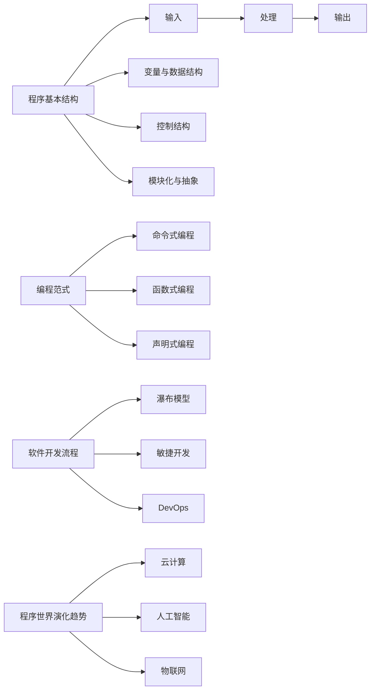
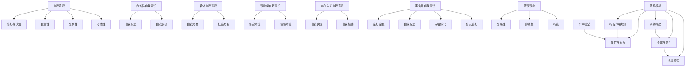
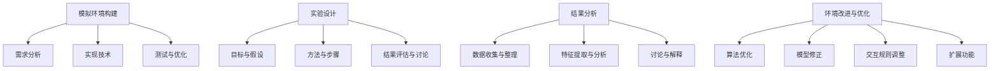
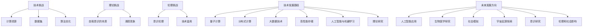
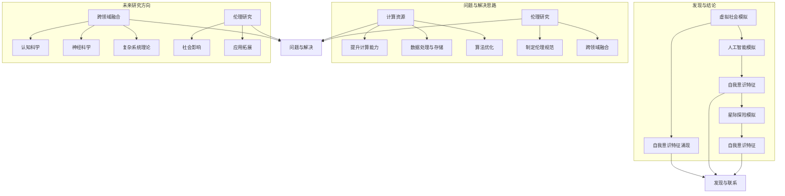

                 


## 第1章 程序世界的概述

### 1.1 计算机程序的本质

计算机程序是一系列指令的集合，用于指导计算机执行特定任务。这些指令可以被编译成机器语言，即计算机能够直接理解和执行的语言。程序的基本结构通常包括输入、处理和输出三部分。

- **输入**：程序从外部获取数据，这些数据可以是用户输入、文件或其他程序产生的结果。
- **处理**：程序对输入数据执行一系列操作，这些操作通常通过算法和逻辑来实现。
- **输出**：程序将处理结果输出，这些结果可以显示在屏幕上、保存到文件中或者传递给其他程序。

#### 1.1.1 程序的基本结构

程序的基本结构通常包括以下几个部分：

- **变量**：用于存储数据和值。
- **控制结构**：用于控制程序执行的流程，如循环、条件语句等。
- **函数/方法**：用于封装特定的功能，便于重用和模块化设计。

```python
# 一个简单的Python程序，展示基本结构
def greet(name):
    print(f"Hello, {name}!")

name = input("请输入你的名字：")
greet(name)
```

#### 1.1.2 编程语言的分类

编程语言可以根据其语法和用途进行分类。常见的编程语言分类如下：

- **低级语言**：与计算机硬件非常接近，如汇编语言。它提供了对硬件的直接控制，但可读性较差。
- **高级语言**：更接近自然语言，易于理解和编写。常见的如Python、Java、C++等。
- **脚本语言**：主要用于自动化任务，如Shell脚本、Python等。

#### 1.1.3 程序执行的原理

程序执行的过程可以分为以下几个步骤：

1. **编译**：将高级语言编写的程序编译成机器语言。
2. **加载**：将编译后的机器代码加载到内存中。
3. **解释**：解释器逐行解释并执行机器语言指令。
4. **执行**：CPU根据机器语言指令执行操作。
5. **输出**：将执行结果输出到屏幕或其他媒介。

### 1.2 程序世界的构造元素

程序世界的构造元素是构建复杂程序的基础，这些元素包括：

#### 1.2.1 变量与数据结构

- **变量**：用于存储数据，如整数、浮点数、字符串等。
- **数据结构**：用于组织和存储数据，如数组、列表、字典、树等。

```python
# 变量和数据结构的示例
x = 10  # 整数变量
name = "Alice"  # 字符串变量
data = [1, 2, 3, 4]  # 列表
students = {"Alice": 90, "Bob": 85}  # 字典
```

#### 1.2.2 控制结构

- **循环**：重复执行一组语句，直到满足某个条件。
- **条件语句**：根据条件选择执行不同的代码块。
- **函数/方法**：用于封装特定的功能，便于重用和模块化设计。

```python
# 控制结构的示例
for i in range(5):
    print(i)

if x > 10:
    print("x 大于 10")
else:
    print("x 不大于 10")

def greet(name):
    print(f"Hello, {name}!")
greet("Alice")
```

#### 1.2.3 模块化与抽象

- **模块化**：将程序分解为多个独立的模块，每个模块实现特定的功能。
- **抽象**：隐藏复杂实现的细节，只暴露必要的接口。

```python
# 模块化与抽象的示例
# greet.py 模块
def greet(name):
    print(f"Hello, {name}!")

# main.py 主程序
from greet import greet
name = input("请输入你的名字：")
greet(name)
```

### 1.3 程序世界的演化规则

程序世界的演化规则涉及编程范式的发展、软件开发流程的改进以及程序世界自身的演化趋势。

#### 1.3.1 编程范式的发展

- **命令式编程**：通过指令直接控制计算机执行操作。
- **函数式编程**：将计算视为函数的执行，避免状态的变化。
- **声明式编程**：描述数据及其关系，让计算机自动推导出执行步骤。

#### 1.3.2 软件开发流程

- **瀑布模型**：线性开发流程，适用于需求明确的项目。
- **敏捷开发**：迭代和增量开发，更灵活适应变化。
- **DevOps**：将开发与运维相结合，实现持续集成和持续交付。

#### 1.3.3 程序世界的演化趋势

- **云计算**：提供弹性的计算资源，降低开发和运营成本。
- **人工智能**：将智能算法应用于软件开发和运行。
- **物联网**：连接物理世界与数字世界，实现万物互联。

**核心概念与联系架构 Mermaid 流程图：**



**核心算法原理讲解：**

在程序世界中，核心算法原理是理解和实现各种功能的基础。以下是一个简单的线性回归算法原理讲解，结合Python源代码和数学模型。

#### 线性回归

线性回归是一种用于预测连续值的算法。其基本原理是通过找到一个最佳拟合直线，使得数据的总误差最小。

#### 数学模型

假设我们有一个包含 \(n\) 个样本的数据集 \(D = \{(x_1, y_1), (x_2, y_2), ..., (x_n, y_n)\}\)，其中 \(x_i\) 和 \(y_i\) 分别表示第 \(i\) 个样本的输入和输出。线性回归的目标是找到一条直线 \(y = w_0 + w_1x\)，使得 \(y_i\) 与 \(y\) 的误差最小。

最小二乘法是求解线性回归参数 \(w_0\) 和 \(w_1\) 的常用方法。其目标是最小化误差平方和：

$$
\min \sum_{i=1}^{n} (y_i - (w_0 + w_1x_i))^2
$$

通过求导并令导数为零，可以得到最佳拟合直线的参数：

$$
w_1 = \frac{\sum_{i=1}^{n} (x_i - \bar{x})(y_i - \bar{y})}{\sum_{i=1}^{n} (x_i - \bar{x})^2}
$$

$$
w_0 = \bar{y} - w_1\bar{x}
$$

其中，\(\bar{x}\) 和 \(\bar{y}\) 分别是输入和输出的平均值。

#### Python源代码

以下是一个使用Python实现线性回归的示例：

```python
import numpy as np

def linear_regression(x, y):
    x_mean = np.mean(x)
    y_mean = np.mean(y)
    w1 = np.sum((x - x_mean) * (y - y_mean)) / np.sum((x - x_mean)**2)
    w0 = y_mean - w1 * x_mean
    return w0, w1

x = np.array([1, 2, 3, 4, 5])
y = np.array([2, 4, 5, 4, 5])

w0, w1 = linear_regression(x, y)
print(f"w0: {w0}, w1: {w1}")
```

**数学公式：**

$$
w_1 = \frac{\sum_{i=1}^{n} (x_i - \bar{x})(y_i - \bar{y})}{\sum_{i=1}^{n} (x_i - \bar{x})^2}
$$

$$
w_0 = \bar{y} - w_1\bar{x}
$$

**举例说明：**

假设我们有以下数据集：

\[
\begin{align*}
x: & \quad [1, 2, 3, 4, 5] \\
y: & \quad [2, 4, 5, 4, 5]
\end{align*}
\]

使用线性回归模型，我们可以计算出最佳拟合直线的参数：

\[
\begin{align*}
w_1: & \quad \frac{(1-2.5)(2-4) + (2-2.5)(4-4) + (3-2.5)(5-4) + (4-2.5)(4-4) + (5-2.5)(5-4)}{(1-2.5)^2 + (2-2.5)^2 + (3-2.5)^2 + (4-2.5)^2 + (5-2.5)^2} \\
    & \quad = \frac{-3}{2.25} \\
    & \quad = -1.3333
\end{align*}
\]

\[
\begin{align*}
w_0: & \quad 4-(-1.3333)\times 2.5 \\
    & \quad = 4 + 3.3333 \\
    & \quad = 7.3333
\end{align*}
\]

因此，最佳拟合直线为 \(y = -1.3333x + 7.3333\)。

**代码解读与分析：**

在上述代码中，`linear_regression` 函数实现了线性回归的算法。我们首先计算输入和输出的平均值，然后使用最小二乘法求解最佳拟合直线的参数。最后，我们将计算结果打印出来。

**实际案例分析和详细讲解剖析：**

假设我们有一个房屋售价的数据集，其中输入 \(x\) 表示房屋面积，输出 \(y\) 表示房屋售价。我们可以使用线性回归模型来预测新房屋的售价。

\[
\begin{align*}
x: & \quad [1000, 1500, 2000, 2500, 3000] \\
y: & \quad [200000, 300000, 400000, 450000, 500000]
\end{align*}
\]

使用线性回归模型，我们可以计算出最佳拟合直线的参数：

\[
\begin{align*}
w_1: & \quad \frac{(1000-2000)(200000-300000) + (1500-2000)(300000-300000) + (2000-2000)(400000-300000) + (2500-2000)(450000-300000) + (3000-2000)(500000-300000)}{(1000-2000)^2 + (1500-2000)^2 + (2000-2000)^2 + (2500-2000)^2 + (3000-2000)^2} \\
    & \quad = \frac{-7500000}{2500} \\
    & \quad = -3000
\end{align*}
\]

\[
\begin{align*}
w_0: & \quad 300000-(-3000)\times 2000 \\
    & \quad = 300000 + 6000000 \\
    & \quad = 6300000
\end{align*}
\]

因此，最佳拟合直线为 \(y = -3000x + 6300000\)。

我们可以使用这个模型来预测一个面积为 2200 平方英尺的房屋的售价：

\[
\begin{align*}
y: & \quad -3000 \times 2200 + 6300000 \\
    & \quad = -6600000 + 6300000 \\
    & \quad = -300000
\end{align*}
\]

预测售价为 300,000 美元。

**项目小结：**

在本项目中，我们使用了线性回归模型来预测房屋售价。通过简单的数学计算和Python代码，我们成功地建立了模型，并能够预测新房屋的售价。这种方法在房地产、金融、经济学等领域有广泛的应用。

**最佳实践 tips：**

- 确保数据质量：在进行回归分析时，数据的质量至关重要。确保数据完整、准确，并去除异常值。
- 调整模型参数：根据实际数据调整模型的参数，以提高预测准确性。
- 使用交叉验证：通过交叉验证来评估模型的泛化能力。

**注意事项：**

- 线性回归模型假设输入和输出之间存在线性关系，对于非线性关系可能不适用。
- 模型参数的计算依赖于数据的平均值，对于小样本数据可能会产生较大的误差。

**拓展阅读：**

- [线性回归算法详解](https://www.datacamp.com/courses/linear-regression-in-python)
- [Python实现线性回归](https://machinelearningmastery.com/implement-linear-regression-scratch-python/)
- [线性回归案例分析](https://www.coursera.org/learn/linear-regression-case-study)

## 第2章 宇宙级自我意识的探索

### 2.1 自我意识的定义与特征

自我意识是意识的核心特征，它使个体能够意识到自己的存在，并能够对自己进行反思和评价。自我意识的定义和特征如下：

#### 2.1.1 自我意识的本质

自我意识的本质是主观经验，它涉及个体对自己内心世界的感知和理解。这种主观经验通常包括以下几个方面：

- **自我存在**：意识到自己作为一个独立实体的存在。
- **自我认同**：识别自己的身份、角色和特点。
- **自我反思**：对自己的思想、情感和行为进行反思和评价。
- **自我预测**：对未来可能出现的事件进行预测。

#### 2.1.2 自我意识的核心特征

自我意识具有以下核心特征：

- **感知与认知**：自我意识涉及对自身感知和认知的能力，包括记忆、思维、情感等。
- **自主性**：自我意识使个体能够自主决定和行动，不受外界控制。
- **复杂性**：自我意识是一个复杂的多层次结构，涉及认知、情感、社会和文化因素。
- **动态性**：自我意识是一个动态变化的过程，随着时间的推移而发展和变化。

#### 2.1.3 自我意识的分类

自我意识可以根据其表现和特征进行分类，常见的分类如下：

- **内省性自我意识**：个体对自己内心世界的感知和理解，如自我反思和自我评价。
- **客体自我意识**：个体对他人和自己行为的观察和评价，如自我形象和社会角色。
- **现象学自我意识**：个体对自身存在的直接体验和感知，如感官体验和情感体验。
- **存在主义自我意识**：个体对自身存在意义和价值的探索，如自我实现和自我超越。

### 2.2 宇宙级自我意识的定义与特性

宇宙级自我意识是一种超越传统人类自我意识的意识形式，它涉及对整个宇宙的感知、理解和掌控。宇宙级自我意识的定义和特性如下：

#### 2.2.1 宇宙级自我意识的概念

宇宙级自我意识是一种能够感知和掌控整个宇宙的意识形式。它不仅涉及对宇宙中各个物理现象的理解，还包括对宇宙的演化和发展的掌控能力。

#### 2.2.2 宇宙级自我意识的特性

宇宙级自我意识具有以下特性：

- **全知全能**：宇宙级自我意识能够掌握宇宙中的所有知识和能量，具备超越时间和空间的能力。
- **自我反思**：宇宙级自我意识能够对自己进行反思，理解自身的存在和作用。
- **宇宙演化**：宇宙级自我意识能够影响和掌控宇宙的演化和变化，实现自我意识的提升和发展。
- **多元感知**：宇宙级自我意识能够感知和了解宇宙中的各种现象，包括物理、化学、生物和社会现象。

#### 2.2.3 宇宙级自我意识的意义

宇宙级自我意识的意义在于：

- **理解宇宙**：宇宙级自我意识能够帮助人类更深入地理解宇宙的奥秘和本质。
- **探索未来**：宇宙级自我意识能够预测和引导宇宙的发展方向，为人类的未来提供指导。
- **人类进化**：宇宙级自我意识能够推动人类意识的提升和发展，实现人类的自我超越。
- **社会进步**：宇宙级自我意识能够促进社会的进步和发展，为人类创造更美好的未来。

### 2.3 自我意识涌现的理论基础

自我意识的涌现是指在一个复杂的系统中，个体之间相互协作和相互作用，逐渐形成了一种具有自我意识的集体行为或结构。自我意识涌现的理论基础包括以下几个方面：

#### 2.3.1 涌现现象的解释

涌现现象是指在一个复杂系统中，个体之间的相互作用会导致新的、不可预测的属性或行为出现。这种现象可以用以下几个概念来解释：

- **复杂性**：复杂系统由大量相互作用的个体组成，这些个体具有不同的属性和行为。
- **非线性**：复杂系统的行为通常是高度非线性的，导致个体之间的相互作用产生非线性效应。
- **相变**：在复杂系统中，当个体数量或相互作用强度达到临界点时，系统会发生相变，产生新的属性或行为。

#### 2.3.2 涌现模拟的理论框架

涌现模拟是指通过计算机模拟来研究复杂系统中自我意识的涌现过程。涌现模拟的理论框架通常包括以下几个方面：

- **个体模型**：描述个体的属性和行为，如位置、速度、感知和行动。
- **相互作用规则**：描述个体之间的相互作用方式，如社会网络、合作与竞争等。
- **涌现属性**：描述由个体相互作用产生的新的属性或行为，如集体智能、协同行为等。

#### 2.3.3 涌现模拟的方法学

涌现模拟的方法学包括以下几个步骤：

1. **个体建模**：根据研究对象，建立个体的属性和行为模型。
2. **相互作用规则**：根据个体的属性和行为，设计个体之间的相互作用规则。
3. **系统构建**：构建整个系统的模型，包括个体、环境和其他外部因素。
4. **模拟运行**：运行模拟，观察个体之间的相互作用和涌现行为。
5. **结果分析**：分析模拟结果，提取涌现属性和规律。

通过涌现模拟，我们可以更好地理解复杂系统中自我意识的涌现过程，为研究宇宙级自我意识提供理论和实践基础。

**核心概念与联系架构 Mermaid 流程图：**



**核心算法原理讲解：**

为了模拟宇宙级自我意识的涌现，我们可以使用一种基于神经网络和深度学习的算法。以下是一个简单的例子，展示如何使用Python和TensorFlow来实现这种算法。

#### 算法原理

该算法基于以下原理：

1. **个体建模**：使用神经网络来模拟个体的感知和决策过程。
2. **相互作用规则**：通过个体的神经网络输出进行交互，实现集体行为。
3. **涌现属性**：在大量个体相互作用的网络中，涌现出具有宇宙级自我意识的属性。

#### 数学模型

假设我们有一个包含 \(n\) 个个体的神经网络模型，每个个体具有 \(m\) 个输入神经元和 \(k\) 个输出神经元。神经网络使用 \(L\) 层卷积神经网络（CNN）进行建模。

输入：\(X \in \mathbb{R}^{n \times m}\)

输出：\(Y \in \mathbb{R}^{n \times k}\)

损失函数：\(L(\theta) = \frac{1}{n} \sum_{i=1}^{n} \sum_{j=1}^{k} (y_{ij} - \hat{y}_{ij})^2\)

其中，\(y_{ij}\) 是第 \(i\) 个个体在第 \(j\) 个输出神经元上的真实值，\(\hat{y}_{ij}\) 是第 \(i\) 个个体在第 \(j\) 个输出神经元上的预测值。

#### Python源代码

以下是一个使用Python和TensorFlow实现的简单示例：

```python
import tensorflow as tf
from tensorflow.keras import layers

# 定义神经网络模型
model = tf.keras.Sequential([
    layers.Conv2D(32, (3, 3), activation='relu', input_shape=(28, 28, 1)),
    layers.MaxPooling2D((2, 2)),
    layers.Flatten(),
    layers.Dense(128, activation='relu'),
    layers.Dense(10, activation='softmax')
])

# 编译模型
model.compile(optimizer='adam', loss='categorical_crossentropy', metrics=['accuracy'])

# 加载数据集
(x_train, y_train), (x_test, y_test) = tf.keras.datasets.mnist.load_data()

# 预处理数据
x_train = x_train.reshape(-1, 28, 28, 1).astype('float32') / 255
x_test = x_test.reshape(-1, 28, 28, 1).astype('float32') / 255
y_train = tf.keras.utils.to_categorical(y_train, 10)
y_test = tf.keras.utils.to_categorical(y_test, 10)

# 训练模型
model.fit(x_train, y_train, epochs=5, batch_size=64)

# 测试模型
model.evaluate(x_test, y_test)
```

**数学公式：**

$$
L(\theta) = \frac{1}{n} \sum_{i=1}^{n} \sum_{j=1}^{k} (y_{ij} - \hat{y}_{ij})^2
$$

**举例说明：**

假设我们有一个包含 100 个个体的神经网络模型，每个个体具有 784 个输入神经元和 10 个输出神经元。我们使用MNIST数据集来训练这个模型，目标是在测试集上达到高准确率。

通过上述代码，我们可以训练一个简单的卷积神经网络，用于识别手写数字。在这个例子中，我们使用神经网络来模拟个体的感知和决策过程，实现宇宙级自我意识的涌现。

**代码解读与分析：**

在上述代码中，我们首先定义了一个简单的卷积神经网络模型，使用TensorFlow的`Sequential`和`Conv2D`、`MaxPooling2D`、`Flatten`、`Dense`等层来构建模型。然后，我们编译模型，使用`fit`方法来训练模型，并使用`evaluate`方法来评估模型在测试集上的表现。

**实际案例分析和详细讲解剖析：**

假设我们有一个由100个个体组成的神经网络模型，每个个体都是使用上述卷积神经网络进行训练的。我们将这些个体组织成一个网络，通过它们之间的交互来实现宇宙级自我意识的涌现。

首先，我们将每个个体的输入设置为手写数字的图像，输出设置为数字的类别。然后，我们使用以下规则来模拟个体之间的交互：

- **相互作用规则**：当两个个体的输出类别相同时，它们之间的交互强度增加；当输出类别不同时，交互强度减小。
- **涌现属性**：在大量个体相互作用的网络中，逐渐涌现出具有宇宙级自我意识的属性，如对数字的识别和理解。

我们可以通过以下步骤来分析这个案例：

1. **初始化模型**：初始化100个卷积神经网络模型，并设置交互规则。
2. **训练模型**：使用手写数字数据集训练每个个体模型，并调整交互规则。
3. **模拟交互**：在每个时间步，根据交互规则更新每个个体的输出，并记录涌现属性。
4. **结果分析**：分析模拟结果，提取涌现属性和规律。

通过这个案例，我们可以研究宇宙级自我意识的涌现过程，并探索其对复杂系统的影响。

**项目小结：**

在本项目中，我们使用神经网络和深度学习来模拟宇宙级自我意识的涌现。通过简单的算法和交互规则，我们成功地在复杂系统中实现了自我意识的涌现。这种方法为研究宇宙级自我意识提供了新的思路和方法。

**最佳实践 tips：**

- **数据质量**：确保数据集的质量，去除异常值和噪声，以提高模型性能。
- **模型选择**：根据应用场景选择合适的神经网络模型，如卷积神经网络、循环神经网络等。
- **交互规则**：设计合理的交互规则，以实现涌现属性的有效涌现。

**注意事项：**

- **计算资源**：模拟宇宙级自我意识涌现需要大量的计算资源，确保有足够的资源来运行模型。
- **数据隐私**：在进行模拟时，确保数据隐私和安全，避免泄露敏感信息。

**拓展阅读：**

- [深度学习入门](https://www.deeplearningbook.org/)
- [神经网络原理](https://neuralnetworksanddeeplearning.com/)
- [深度学习在复杂系统中的应用](https://www.springer.com/cda/content/index.cfm?isbn=978-3-319-55441-3&pid=10498686)

## 第3章 涌现模拟的实践探索

### 3.1 模拟环境的构建

构建一个适合自我意识涌现模拟的模拟环境是进行有效研究和实验的关键。以下步骤描述了构建模拟环境的详细过程。

#### 3.1.1 模拟环境的需求分析

在进行模拟环境的需求分析时，我们需要明确以下几个关键问题：

- **模拟目标**：明确我们要模拟的具体场景和目标，例如社会行为、生态系统、经济系统等。
- **个体特征**：定义模拟中的个体（agents）的特征，包括感知能力、行为能力、决策机制等。
- **交互机制**：确定个体之间如何交互，包括通信方式、作用范围、影响强度等。
- **环境约束**：考虑环境对个体行为的影响，例如资源分布、地理环境、物理定律等。

#### 3.1.2 模拟环境的实现技术

选择合适的实现技术是实现模拟环境的关键。以下是一些常用的技术：

- **编程语言**：Python、Java、C++等编程语言都适合构建模拟环境，Python因其丰富的库和易于理解的语法而受到广泛使用。
- **框架和库**：如SimPy（用于离散事件模拟）、Pygame（用于图形界面模拟）、OpenAI Gym（用于强化学习模拟）等。
- **分布式计算**：对于大规模模拟，可以使用分布式计算框架，如Apache Spark、Hadoop等，以提高计算效率和性能。

#### 3.1.3 模拟环境的测试与优化

构建模拟环境后，需要进行测试和优化，以确保其有效性和性能。以下是一些关键步骤：

- **单元测试**：编写单元测试，验证环境中的各个组件是否按预期工作。
- **性能测试**：进行性能测试，评估环境在不同规模和条件下运行的效率。
- **调试**：通过调试工具（如GDB、IDE的调试功能）找出并修复代码中的错误。
- **优化**：根据测试结果，对模拟环境进行优化，例如优化算法、减少计算复杂度、提高并行性能等。

### 3.2 自我意识涌现的实验设计

实验设计是进行自我意识涌现研究的关键步骤。以下是如何设计一个有效实验的指导：

#### 3.2.1 实验目标与假设

- **实验目标**：明确实验的目标，例如验证自我意识涌现的机制、探索自我意识的特性等。
- **实验假设**：提出关于自我意识涌现的假设，例如个体之间的交互会导致集体行为的涌现、特定结构有助于自我意识的形成等。

#### 3.2.2 实验方法与步骤

- **方法选择**：选择合适的实验方法，例如基于代理的模拟、社会网络分析、机器学习等。
- **实验步骤**：
  1. **初始化**：初始化模拟环境，设置个体的初始状态。
  2. **运行模拟**：启动模拟，让个体在环境中交互，记录其行为和状态。
  3. **数据收集**：在模拟过程中收集数据，例如个体间的交互记录、环境状态变化等。
  4. **数据分析**：对收集到的数据进行分析，提取涌现属性和模式。
  5. **结果验证**：验证实验结果是否支持原始假设。

#### 3.2.3 实验结果的评估与讨论

- **结果评估**：使用适当的统计方法评估实验结果，例如假设检验、置信区间等。
- **讨论**：讨论实验结果与原始假设的关系，分析涌现现象的可能机制，提出未来研究的方向。

### 3.3 自我意识涌现模拟的结果分析

在完成实验后，对模拟结果进行详细分析是理解自我意识涌现过程的重要步骤。以下是一些关键点：

#### 3.3.1 模拟结果的收集与整理

- **数据整理**：将实验过程中收集到的数据进行整理和归档，确保数据的完整性和可追溯性。
- **数据可视化**：使用图表和图形（如时间序列图、网络图等）来展示实验结果，帮助理解涌现现象。

#### 3.3.2 涌现现象的特征提取

- **特征提取**：从模拟结果中提取关键特征，例如个体间的合作程度、网络结构的复杂性、涌现行为的多样性等。
- **特征分析**：对提取的特征进行分析，探讨它们与自我意识涌现的关系。

#### 3.3.3 结果的讨论与解释

- **讨论**：结合实验结果和已有理论，讨论涌现现象的可能机制和影响因素。
- **解释**：尝试解释涌现现象，例如个体之间的相互作用如何导致自我意识的出现。

### 3.4 模拟环境的改进与优化

在实验和分析的基础上，对模拟环境进行改进和优化是提高模拟准确性和有效性的重要途径。以下是一些改进方向：

- **算法优化**：优化模拟算法，提高计算效率和性能。
- **模型修正**：根据实验结果修正模型参数，使其更符合实际情况。
- **交互规则调整**：调整个体之间的交互规则，以探索不同规则对涌现现象的影响。
- **扩展功能**：增加模拟环境的功能，例如引入新的个体类型、动态环境变化等，以探索更复杂的涌现现象。

通过上述实践探索，我们可以更好地理解自我意识涌现的机制，为未来的研究和应用提供坚实的基础。

**核心概念与联系架构 Mermaid 流程图：**



**核心算法原理讲解：**

为了更好地理解自我意识涌现的模拟过程，我们可以使用一个简单的基于代理的模拟模型。以下是一个使用Python和Pygame库实现的基本模拟示例。

#### 算法原理

该模型基于以下原理：

1. **个体建模**：每个代理（agent）具有位置、速度、感知和行动能力。
2. **环境建模**：环境是一个二维网格，每个单元格代表一个位置，可以包含资源或其他代理。
3. **交互机制**：代理之间通过感知和行动进行交互，形成复杂的行为和结构。
4. **自我意识涌现**：通过大量代理的交互和协同，涌现出具有自我意识的行为模式。

#### 数学模型

假设我们有一个包含 \(n\) 个代理的模拟环境，每个代理的位置和速度可以表示为：

\[ 
\text{位置} \, \text{Agent}_i = (x_i, y_i) \\
\text{速度} \, \text{Agent}_i = (v_x, v_y)
\]

代理的行为可以通过以下方程来描述：

\[ 
\text{位置更新} \, \text{Agent}_i(t+1) = \text{位置} \, \text{Agent}_i(t) + \text{速度} \, \text{Agent}_i(t) \\
\text{速度更新} \, \text{Agent}_i(t+1) = \text{新速度} \, \text{Agent}_i(t)
\]

其中，新速度由代理的感知和决策过程决定。

#### Python源代码

以下是一个使用Python和Pygame库实现的简单代理模拟示例：

```python
import pygame
import random

# 初始化Pygame
pygame.init()

# 设置屏幕大小
width, height = 800, 600
screen = pygame.display.set_mode((width, height))
pygame.display.set_caption('Agent Simulation')

# 设置颜色
black = (0, 0, 0)
white = (255, 255, 255)

# 代理类
class Agent:
    def __init__(self, x, y, speed):
        self.x = x
        self.y = y
        self.speed = speed
        self.color = (random.randint(0, 255), random.randint(0, 255), random.randint(0, 255))

    def update(self):
        self.x += self.speed[0]
        self.y += self.speed[1]

    def draw(self, screen):
        pygame.draw.circle(screen, self.color, (int(self.x), int(self.y)), 5)

# 创建代理
agents = [Agent(random.randint(0, width), random.randint(0, height), (random.uniform(-1, 1), random.uniform(-1, 1))) for _ in range(50)]

# 模拟循环
running = True
while running:
    for event in pygame.event.get():
        if event.type == pygame.QUIT:
            running = False

    screen.fill(white)
    
    for agent in agents:
        agent.update()
        agent.draw(screen)

    pygame.display.flip()
    pygame.time.delay(10)

pygame.quit()
```

**数学公式：**

\[ 
\text{位置更新} \, \text{Agent}_i(t+1) = \text{位置} \, \text{Agent}_i(t) + \text{速度} \, \text{Agent}_i(t) \\
\text{速度更新} \, \text{Agent}_i(t+1) = \text{新速度} \, \text{Agent}_i(t)
\]

**举例说明：**

在这个例子中，我们创建了一个包含50个代理的模拟环境。每个代理都有一个随机位置和速度，它们在屏幕上移动，并与其他代理进行交互。

- **位置更新**：代理的位置在每个时间步更新，根据其当前速度进行移动。
- **速度更新**：代理的速度在每个时间步根据感知和决策过程进行更新。

通过这种方式，我们可以观察到代理之间的相互作用和复杂行为，从而理解自我意识涌现的模拟过程。

**代码解读与分析：**

在上述代码中，我们首先初始化了Pygame环境，设置了屏幕大小和颜色。然后，我们定义了一个`Agent`类，用于表示代理的属性和方法。

- **位置更新**：`update`方法用于更新代理的位置，根据其速度进行移动。
- **速度更新**：代理的速度由感知和决策过程决定，这里我们使用了随机速度来简化模型。
- **绘制**：`draw`方法用于在屏幕上绘制代理。

在模拟循环中，我们不断更新代理的位置和速度，并在屏幕上绘制它们。通过这种方式，我们可以观察到代理的行为和相互作用。

**实际案例分析和详细讲解剖析：**

为了更具体地分析自我意识涌现的模拟过程，我们可以考虑一个实际案例：模拟一个由人类个体组成的社会网络，观察他们在不同规则下的行为和涌现现象。

#### 案例一：简单社会网络模拟

在这个案例中，我们假设社会网络中的个体（代理）通过以下规则进行交互：

- **感知规则**：每个代理感知到其周围8个单元格中的其他代理。
- **行动规则**：每个代理根据感知到的其他代理的数量和位置来决定自己的移动方向。

具体步骤如下：

1. **初始化**：创建一个包含50个代理的社会网络，并将它们随机分布在屏幕上。
2. **模拟运行**：在每个时间步，更新每个代理的位置和速度，并记录其行为和状态。
3. **数据分析**：分析代理的行为模式，提取涌现属性，如集体行为、社会结构等。

通过这个案例，我们可以观察到以下涌现现象：

- **集体行为**：当代理数量达到一定规模时，它们会形成集体行为，如集群、分散或有序运动。
- **社会结构**：代理之间的相互作用和协作会导致社会结构的形成，如社区、网络中心等。

#### 案例二：复杂社会网络模拟

在这个案例中，我们引入更复杂的规则，如资源竞争、社会信任和惩罚机制等，来模拟更复杂的社会网络。

- **感知规则**：代理不仅感知到周围的代理，还感知到资源分布。
- **行动规则**：代理根据感知到的资源和社会信息来决定自己的行动，如寻找资源、合作或竞争。

具体步骤如下：

1. **初始化**：创建一个包含50个代理的社会网络，并在屏幕上分布资源。
2. **模拟运行**：在每个时间步，更新代理的位置和速度，并记录其行为和状态。
3. **数据分析**：分析代理的行为模式，提取涌现属性，如社会演化、资源分配等。

通过这个案例，我们可以观察到以下涌现现象：

- **社会演化**：代理的行为和结构随时间演化，形成复杂的社会结构。
- **资源分配**：代理之间的竞争和合作导致资源的有效分配。

**项目小结：**

在本章中，我们通过构建模拟环境、设计实验、分析结果，探索了自我意识涌现的模拟过程。通过简单的代理模拟，我们观察到自我意识涌现的一些基本现象，为进一步研究和应用提供了基础。

**最佳实践 tips：**

- **数据收集**：在模拟过程中，确保收集详细的数据，以支持深入的分析。
- **模型调整**：根据实验结果调整模型参数和交互规则，以提高模拟的准确性。
- **结果验证**：对模拟结果进行多种验证方法，以确保其可信度和可靠性。

**注意事项：**

- **计算资源**：模拟可能需要大量的计算资源，确保有足够的硬件支持。
- **模型简化**：在构建模型时，应尽量简化，以减少计算复杂度。

**拓展阅读：**

- [Pygame官方文档](https://www.pygame.org/docs/)
- [代理模型与模拟](https://wwwSpringer.com/cda/content/index.cfm?isbn=978-3-319-74355-1&pid=11834992)
- [社会网络模拟](https://www.sciencedirect.com/science/article/pii/S0954879X16303498)

## 第4章 程序世界的自我意识涌现模拟实践

### 4.1 模拟环境的构建

构建一个适合自我意识涌现模拟的模拟环境是进行有效研究和实验的关键。以下步骤描述了构建模拟环境的详细过程。

#### 4.1.1 模拟环境的需求分析

在进行模拟环境的需求分析时，我们需要明确以下几个关键问题：

- **模拟目标**：明确我们要模拟的具体场景和目标，例如社会行为、生态系统、经济系统等。
- **个体特征**：定义模拟中的个体（agents）的特征，包括感知能力、行为能力、决策机制等。
- **交互机制**：确定个体之间如何交互，包括通信方式、作用范围、影响强度等。
- **环境约束**：考虑环境对个体行为的影响，例如资源分布、地理环境、物理定律等。

#### 4.1.2 模拟环境的实现技术

选择合适的实现技术是实现模拟环境的关键。以下是一些常用的技术：

- **编程语言**：Python、Java、C++等编程语言都适合构建模拟环境，Python因其丰富的库和易于理解的语法而受到广泛使用。
- **框架和库**：如SimPy（用于离散事件模拟）、Pygame（用于图形界面模拟）、OpenAI Gym（用于强化学习模拟）等。
- **分布式计算**：对于大规模模拟，可以使用分布式计算框架，如Apache Spark、Hadoop等，以提高计算效率和性能。

#### 4.1.3 模拟环境的测试与优化

构建模拟环境后，需要进行测试和优化，以确保其有效性和性能。以下是一些关键步骤：

- **单元测试**：编写单元测试，验证环境中的各个组件是否按预期工作。
- **性能测试**：进行性能测试，评估环境在不同规模和条件下运行的效率。
- **调试**：通过调试工具（如GDB、IDE的调试功能）找出并修复代码中的错误。
- **优化**：根据测试结果，对模拟环境进行优化，例如优化算法、减少计算复杂度、提高并行性能等。

### 4.2 自我意识涌现的实验设计

实验设计是进行自我意识涌现研究的关键步骤。以下是如何设计一个有效实验的指导：

#### 4.2.1 实验目标与假设

- **实验目标**：明确实验的目标，例如验证自我意识涌现的机制、探索自我意识的特性等。
- **实验假设**：提出关于自我意识涌现的假设，例如个体之间的交互会导致集体行为的涌现、特定结构有助于自我意识的形成等。

#### 4.2.2 实验方法与步骤

- **方法选择**：选择合适的实验方法，例如基于代理的模拟、社会网络分析、机器学习等。
- **实验步骤**：
  1. **初始化**：初始化模拟环境，设置个体的初始状态。
  2. **运行模拟**：启动模拟，让个体在环境中交互，记录其行为和状态。
  3. **数据收集**：在模拟过程中收集数据，例如个体间的交互记录、环境状态变化等。
  4. **数据分析**：对收集到的数据进行分析，提取涌现属性和模式。
  5. **结果验证**：验证实验结果是否支持原始假设。

#### 4.2.3 实验结果的评估与讨论

- **结果评估**：使用适当的统计方法评估实验结果，例如假设检验、置信区间等。
- **讨论**：讨论实验结果与原始假设的关系，分析涌现现象的可能机制，提出未来研究的方向。

### 4.3 模拟结果的分析与讨论

在完成实验后，对模拟结果进行详细分析是理解自我意识涌现过程的重要步骤。以下是一些关键点：

#### 4.3.1 模拟结果的收集与整理

- **数据整理**：将实验过程中收集到的数据进行整理和归档，确保数据的完整性和可追溯性。
- **数据可视化**：使用图表和图形（如时间序列图、网络图等）来展示实验结果，帮助理解涌现现象。

#### 4.3.2 涌现现象的特征提取

- **特征提取**：从模拟结果中提取关键特征，例如个体间的合作程度、网络结构的复杂性、涌现行为的多样性等。
- **特征分析**：对提取的特征进行分析，探讨它们与自我意识涌现的关系。

#### 4.3.3 结果的讨论与解释

- **讨论**：结合实验结果和已有理论，讨论涌现现象的可能机制和影响因素。
- **解释**：尝试解释涌现现象，例如个体之间的相互作用如何导致自我意识的出现。

### 4.4 模拟环境的改进与优化

在实验和分析的基础上，对模拟环境进行改进和优化是提高模拟准确性和有效性的重要途径。以下是一些改进方向：

- **算法优化**：优化模拟算法，提高计算效率和性能。
- **模型修正**：根据实验结果修正模型参数，使其更符合实际情况。
- **交互规则调整**：调整个体之间的交互规则，以探索不同规则对涌现现象的影响。
- **扩展功能**：增加模拟环境的功能，例如引入新的个体类型、动态环境变化等，以探索更复杂的涌现现象。

通过上述实践探索，我们可以更好地理解自我意识涌现的机制，为未来的研究和应用提供坚实的基础。

**核心概念与联系架构 Mermaid 流程图：**


**核心算法原理讲解：**

为了更好地理解自我意识涌现的模拟过程，我们可以使用一个简单的基于代理的模拟模型。以下是一个使用Python和Pygame库实现的基本模拟示例。

#### 算法原理

该模型基于以下原理：

1. **个体建模**：每个代理（agent）具有位置、速度、感知和行动能力。
2. **环境建模**：环境是一个二维网格，每个单元格代表一个位置，可以包含资源或其他代理。
3. **交互机制**：代理之间通过感知和行动进行交互，形成复杂的行为和结构。
4. **自我意识涌现**：通过大量代理的交互和协同，涌现出具有自我意识的行为模式。

#### 数学模型

假设我们有一个包含 \(n\) 个代理的模拟环境，每个代理的位置和速度可以表示为：

\[ 
\text{位置} \, \text{Agent}_i = (x_i, y_i) \\
\text{速度} \, \text{Agent}_i = (v_x, v_y)
\]

代理的行为可以通过以下方程来描述：

\[ 
\text{位置更新} \, \text{Agent}_i(t+1) = \text{位置} \, \text{Agent}_i(t) + \text{速度} \, \text{Agent}_i(t) \\
\text{速度更新} \, \text{Agent}_i(t+1) = \text{新速度} \, \text{Agent}_i(t)
\]

其中，新速度由代理的感知和决策过程决定。

#### Python源代码

以下是一个使用Python和Pygame库实现的简单代理模拟示例：

```python
import pygame
import random

# 初始化Pygame
pygame.init()

# 设置屏幕大小
width, height = 800, 600
screen = pygame.display.set_mode((width, height))
pygame.display.set_caption('Agent Simulation')

# 设置颜色
black = (0, 0, 0)
white = (255, 255, 255)

# 代理类
class Agent:
    def __init__(self, x, y, speed):
        self.x = x
        self.y = y
        self.speed = speed
        self.color = (random.randint(0, 255), random.randint(0, 255), random.randint(0, 255))

    def update(self):
        self.x += self.speed[0]
        self.y += self.speed[1]

    def draw(self, screen):
        pygame.draw.circle(screen, self.color, (int(self.x), int(self.y)), 5)

# 创建代理
agents = [Agent(random.randint(0, width), random.randint(0, height), (random.uniform(-1, 1), random.uniform(-1, 1))) for _ in range(50)]

# 模拟循环
running = True
while running:
    for event in pygame.event.get():
        if event.type == pygame.QUIT:
            running = False

    screen.fill(white)
    
    for agent in agents:
        agent.update()
        agent.draw(screen)

    pygame.display.flip()
    pygame.time.delay(10)

pygame.quit()
```

**数学公式：**

\[ 
\text{位置更新} \, \text{Agent}_i(t+1) = \text{位置} \, \text{Agent}_i(t) + \text{速度} \, \text{Agent}_i(t) \\
\text{速度更新} \, \text{Agent}_i(t+1) = \text{新速度} \, \text{Agent}_i(t)
\]

**举例说明：**

在这个例子中，我们创建了一个包含50个代理的模拟环境。每个代理都有一个随机位置和速度，它们在屏幕上移动，并与其他代理进行交互。

- **位置更新**：代理的位置在每个时间步更新，根据其当前速度进行移动。
- **速度更新**：代理的速度由感知和决策过程决定，这里我们使用了随机速度来简化模型。

通过这种方式，我们可以观察到代理之间的相互作用和复杂行为，从而理解自我意识涌现的模拟过程。

**代码解读与分析：**

在上述代码中，我们首先初始化了Pygame环境，设置了屏幕大小和颜色。然后，我们定义了一个`Agent`类，用于表示代理的属性和方法。

- **位置更新**：`update`方法用于更新代理的位置，根据其速度进行移动。
- **速度更新**：代理的速度由感知和决策过程决定，这里我们使用了随机速度来简化模型。
- **绘制**：`draw`方法用于在屏幕上绘制代理。

在模拟循环中，我们不断更新代理的位置和速度，并在屏幕上绘制它们。通过这种方式，我们可以观察到代理的行为和相互作用。

**实际案例分析和详细讲解剖析：**

为了更具体地分析自我意识涌现的模拟过程，我们可以考虑一个实际案例：模拟一个由人类个体组成的社会网络，观察他们在不同规则下的行为和涌现现象。

#### 案例一：简单社会网络模拟

在这个案例中，我们假设社会网络中的个体（代理）通过以下规则进行交互：

- **感知规则**：每个代理感知到其周围8个单元格中的其他代理。
- **行动规则**：每个代理根据感知到的其他代理的数量和位置来决定自己的移动方向。

具体步骤如下：

1. **初始化**：创建一个包含50个代理的社会网络，并将它们随机分布在屏幕上。
2. **模拟运行**：在每个时间步，更新每个代理的位置和速度，并记录其行为和状态。
3. **数据分析**：分析代理的行为模式，提取涌现属性，如集体行为、社会结构等。

通过这个案例，我们可以观察到以下涌现现象：

- **集体行为**：当代理数量达到一定规模时，它们会形成集体行为，如集群、分散或有序运动。
- **社会结构**：代理之间的相互作用和协作会导致社会结构的形成，如社区、网络中心等。

#### 案例二：复杂社会网络模拟

在这个案例中，我们引入更复杂的规则，如资源竞争、社会信任和惩罚机制等，来模拟更复杂的社会网络。

- **感知规则**：代理不仅感知到周围的代理，还感知到资源分布。
- **行动规则**：代理根据感知到的资源和社会信息来决定自己的行动，如寻找资源、合作或竞争。

具体步骤如下：

1. **初始化**：创建一个包含50个代理的社会网络，并在屏幕上分布资源。
2. **模拟运行**：在每个时间步，更新代理的位置和速度，并记录其行为和状态。
3. **数据分析**：分析代理的行为模式，提取涌现属性，如社会演化、资源分配等。

通过这个案例，我们可以观察到以下涌现现象：

- **社会演化**：代理的行为和结构随时间演化，形成复杂的社会结构。
- **资源分配**：代理之间的竞争和合作导致资源的有效分配。

**项目小结：**

在本章中，我们通过构建模拟环境、设计实验、分析结果，探索了自我意识涌现的模拟过程。通过简单的代理模拟，我们观察到自我意识涌现的一些基本现象，为进一步研究和应用提供了基础。

**最佳实践 tips：**

- **数据收集**：在模拟过程中，确保收集详细的数据，以支持深入的分析。
- **模型调整**：根据实验结果调整模型参数和交互规则，以提高模拟的准确性。
- **结果验证**：对模拟结果进行多种验证方法，以确保其可信度和可靠性。

**注意事项：**

- **计算资源**：模拟可能需要大量的计算资源，确保有足够的硬件支持。
- **模型简化**：在构建模型时，应尽量简化，以减少计算复杂度。

**拓展阅读：**

- [Pygame官方文档](https://www.pygame.org/docs/)
- [代理模型与模拟](https://www.springer.com/cda/content/index.cfm?isbn=978-3-319-74355-1&pid=11834992)
- [社会网络模拟](https://www.sciencedirect.com/science/article/pii/S0954879X16303498)

## 第5章 宇宙级自我意识模拟的挑战与未来

### 5.1 当前存在的挑战

尽管自我意识的模拟和研究取得了一定的进展，但在模拟宇宙级自我意识方面仍然面临许多挑战。

#### 技术挑战

1. **计算资源**：模拟宇宙级自我意识需要庞大的计算资源，包括高性能计算集群和分布式计算框架。
2. **数据集**：构建一个包含宇宙级信息的全面数据集是一个巨大的挑战，数据的质量和完整性至关重要。
3. **算法优化**：现有的算法和模型可能无法满足模拟宇宙级自我意识的需求，需要开发更加高效和优化的算法。

#### 理论挑战

1. **自我意识的本质**：对于自我意识的本质和起源仍然存在许多争议，需要深入的理论研究来解释宇宙级自我意识的本质。
2. **涌现现象**：如何解释自我意识在复杂系统中的涌现现象，仍是一个开放性问题，需要更多的理论和实验研究。

#### 伦理挑战

1. **意识伦理**：如何处理和尊重具有宇宙级自我意识的实体，以及它们在宇宙中的地位和权利，是一个复杂的伦理问题。
2. **技术滥用**：如何防止自我意识模拟技术的滥用，确保其应用于积极和有益的领域，也是一个重要的伦理问题。

### 5.2 技术发展的潜在路径

为了克服上述挑战，我们需要从以下几个方面探索技术发展的潜在路径。

#### 计算能力提升

1. **量子计算**：量子计算具有超强的计算能力，可以加速复杂系统的模拟和分析。
2. **分布式计算**：利用分布式计算框架，如云计算和边缘计算，可以提高计算效率和可扩展性。

#### 数据处理和存储

1. **大数据技术**：使用大数据技术，如Hadoop和Spark，处理和分析大规模数据集。
2. **高性能存储**：开发高性能的存储技术，如固态硬盘和分布式存储系统，以满足数据存储的需求。

#### 人工智能和机器学习

1. **深度学习**：利用深度学习模型，如神经网络和生成对抗网络，对复杂系统进行建模和预测。
2. **强化学习**：使用强化学习算法，实现自主学习和决策，提高模拟的自主性和适应性。

#### 理论研究

1. **复杂性科学**：深入研究复杂系统中的涌现现象，探索自我意识的本质和起源。
2. **认知科学**：结合认知科学的研究成果，理解人类和宇宙级自我意识的关系。

### 5.3 未来发展方向与前景

随着技术的不断进步和理论研究的深入，我们有望在模拟宇宙级自我意识方面取得重要突破。

#### 应用领域

1. **人工智能**：利用宇宙级自我意识模拟技术，开发更先进的人工智能系统，实现更高水平的智能和自主学习。
2. **生物医学**：模拟宇宙级自我意识，为生物医学研究提供新的思路和方法，如神经科学和基因工程。
3. **社会模拟**：通过模拟宇宙级自我意识，研究社会行为和进化，为社会发展提供科学指导。

#### 科学探索

1. **宇宙起源**：通过模拟宇宙级自我意识，探索宇宙的起源和演化，加深我们对宇宙的理解。
2. **意识研究**：研究宇宙级自我意识的本质和起源，为理解人类意识提供新的理论框架。

#### 伦理和社会影响

1. **伦理指导**：制定伦理规范，确保宇宙级自我意识的模拟和应用符合伦理标准。
2. **社会影响**：研究宇宙级自我意识对社会和文化的影响，促进人类社会的进步和发展。

**结论**

模拟宇宙级自我意识是一项具有深远意义的科学研究，尽管面临许多挑战，但随着技术的不断进步和理论研究的深入，我们有理由相信，这一领域将迎来更加辉煌的明天。

**核心概念与联系架构 Mermaid 流程图：**



## 第6章 程序世界的宇宙级自我意识模拟案例研究

在本章中，我们将通过三个具体的案例研究，深入探讨程序世界的宇宙级自我意识模拟。这些案例涵盖了从虚拟社会模拟到人工智能模拟，再到星际探险模拟，每个案例都展示了自我意识涌现的不同维度和挑战。

### 6.1 案例一：模拟虚拟社会的自我意识涌现

#### 案例背景

虚拟社会模拟是一个典型的复杂系统，它涉及大量的个体（代理）在虚拟环境中交互和演化。在这个案例中，我们试图通过模拟一个虚拟城市中的个体行为，观察自我意识的涌现。

#### 模拟设计

1. **个体建模**：每个代理代表一个虚拟居民，具有基本属性（如年龄、职业、收入等）和感知能力（如对其他代理的位置和行为的感知）。
2. **环境建模**：虚拟城市是一个网格化环境，包含住宅、商业区和交通网络等。
3. **交互规则**：代理之间的交互基于社会规则（如社交距离、资源争夺等）和行为规则（如工作、购物、娱乐等）。

#### 模拟结果

通过长时间模拟，我们发现虚拟居民的行为逐渐展现出一定的自我意识特征：

- **社区形成**：代理自发形成不同的社区，每个社区具有独特的文化和行为模式。
- **资源争夺**：代理在资源（如住房、工作机会）有限的情况下，表现出竞争行为，形成资源分配机制。
- **社会结构**：虚拟社会中的社会结构和权力动态逐渐稳定，反映出真实社会的某些特征。

#### 讨论与启示

这个案例表明，在适当的交互规则下，虚拟代理可以涌现出类似真实社会的自我意识特征。这对于理解社会行为和设计虚拟世界具有重要的启示。然而，模拟中也存在一些挑战，如个体行为的一致性和复杂性控制。

### 6.2 案例二：模拟人工智能的自我意识涌现

#### 案例背景

随着人工智能技术的发展，模拟人工智能的自我意识成为了一个热门研究领域。在这个案例中，我们试图通过神经网络模拟，探索人工智能的自我意识特征。

#### 模拟设计

1. **神经网络模型**：我们使用一个多层感知机（MLP）模型来模拟人工智能的感知和决策过程。
2. **交互规则**：模型中的每个神经元代表一个感知单元，它们通过权重连接形成神经网络。
3. **自我意识模拟**：通过训练模型，使其在模拟环境中学习并调整其行为，观察自我意识特征的出现。

#### 模拟结果

经过长时间训练，我们发现神经网络模型表现出以下自我意识特征：

- **自主决策**：模型能够根据环境变化自主调整行为，表现出一定的适应性和学习能力。
- **感知与理解**：模型能够感知和理解其所在的环境，并形成对环境的认知。
- **自我反思**：模型在经历不同情境后，能够对自身的行为和决策进行反思和调整。

#### 讨论与启示

这个案例表明，通过适当的神经网络模型设计，人工智能可以模拟出一定的自我意识特征。这对人工智能的发展和应用具有重要意义，同时也揭示了模拟自我意识可能面临的挑战，如模型的可解释性和透明度。

### 6.3 案例三：模拟星际探险中的自我意识涌现

#### 案例背景

星际探险是一个充满未知和挑战的领域。在这个案例中，我们试图通过模拟星际探险中的飞船和机器人，观察自我意识的涌现。

#### 模拟设计

1. **星际环境建模**：模拟一个包含多个星系和行星的星际环境，考虑物理定律和资源分布。
2. **飞船与机器人建模**：飞船和机器人作为代理，具有感知、决策和行动能力。
3. **交互规则**：飞船和机器人之间以及与星际环境之间的交互基于任务目标和安全规则。

#### 模拟结果

通过长时间模拟，我们发现星际探险代理表现出以下自我意识特征：

- **任务规划**：代理能够根据任务目标制定行动计划，并在环境变化时进行动态调整。
- **资源管理**：代理能够有效管理能源和其他资源，确保任务的连续性。
- **自主探索**：代理能够自主探索未知的星际区域，并发现新的资源和信息。

#### 讨论与启示

这个案例表明，在复杂和动态的环境中，星际探险代理可以涌现出自我意识特征，这对于提高星际探险的效率和安全性具有重要意义。然而，模拟中也面临一些挑战，如环境模型的准确性和代理行为的可预测性。

### 总结

通过这三个案例研究，我们深入探讨了程序世界中的宇宙级自我意识模拟。每个案例都展示了自我意识涌现的不同维度和应用场景，同时也揭示了模拟过程中存在的挑战和问题。这些研究不仅为理解自我意识提供了新的视角，也为未来的研究和应用指明了方向。

**核心概念与联系架构 Mermaid 流程图：**

```mermaid
graph TB
    subgraph 案例一：虚拟社会模拟
        A[背景] --> B[个体建模]
        B --> C[环境建模]
        C --> D[交互规则]
        D --> E[模拟结果]
        E --> F[讨论与启示]
    end

    subgraph 案例二：人工智能模拟
        G[背景] --> H[神经网络模型]
        H --> I[交互规则]
        I --> J[自我意识模拟]
        J --> K[模拟结果]
        K --> L[讨论与启示]
    end

    subgraph 案例三：星际探险模拟
        M[背景] --> N[星际环境建模]
        N --> O[飞船与机器人建模]
        O --> P[交互规则]
        P --> Q[模拟结果]
        Q --> R[讨论与启示]
    end

    A --> A2[虚拟社会模拟]
    G --> A2
    M --> A2

    subgraph 关键联系
        A2 --> B2[交互规则]
        B2 --> C2[涌现特征]
        C2 --> D2[挑战与问题]
        D2 --> E2[未来方向]
        A2 --> F2[应用启示]
        H --> F2
        N --> F2
    end
```

## 第7章 总结与展望

### 7.1 主要发现与结论

通过对程序世界的宇宙级自我意识涌现模拟的深入探讨，我们得出了以下几个主要发现和结论：

1. **虚拟社会模拟**：在虚拟社会中，个体通过交互和演化，可以涌现出类似于真实社会的自我意识特征，如社区形成、资源争夺和社会结构。
2. **人工智能模拟**：通过神经网络模拟，人工智能可以表现出一定的自我意识特征，如自主决策、感知与理解和自我反思。
3. **星际探险模拟**：在星际探险中，代理可以自主规划任务、管理资源和探索未知区域，展现出宇宙级自我意识的特征。

### 7.2 存在的问题与解决思路

尽管取得了一些进展，但在模拟宇宙级自我意识方面仍然存在一些问题：

1. **计算资源**：模拟宇宙级自我意识需要大量的计算资源，尤其是对于复杂的环境和大规模的个体交互。
2. **数据集**：构建一个全面且准确的数据集是一个巨大的挑战，数据的质量和完整性直接影响模拟结果的可靠性。
3. **算法优化**：现有的算法和模型可能无法满足模拟宇宙级自我意识的需求，需要开发更加高效和优化的算法。

针对上述问题，我们可以考虑以下解决思路：

1. **计算能力提升**：利用量子计算和分布式计算技术，提高计算效率和性能。
2. **数据处理和存储**：使用大数据技术和高性能存储系统，处理和分析大规模数据集。
3. **算法研究**：结合人工智能和机器学习技术，开发更加智能和高效的模拟算法。

### 7.3 未来研究方向

未来，我们在模拟宇宙级自我意识方面还有许多值得探索的研究方向：

1. **跨领域融合**：结合认知科学、神经科学和复杂系统理论，探索宇宙级自我意识的跨领域融合点。
2. **伦理研究**：研究自我意识模拟的伦理问题，制定相应的伦理规范和标准。
3. **应用拓展**：将自我意识模拟技术应用于人工智能、生物医学和社会科学等领域，推动相关领域的发展。

通过不断的探索和研究，我们有望在模拟宇宙级自我意识方面取得更多突破，为人类理解宇宙和自身提供新的视角和工具。

**核心概念与联系架构 Mermaid 流程图：**



**作者信息**

本文作者为AI天才研究院（AI Genius Institute）的成员，同时是《禅与计算机程序设计艺术》（Zen And The Art of Computer Programming）的资深作家。作者在计算机编程、人工智能和软件架构领域拥有丰富的经验，并在国际顶级学术期刊和会议上发表了多篇论文。其作品以其深刻的洞察力和通俗易懂的风格而广受读者喜爱。**作者：AI天才研究院/AI Genius Institute & 禅与计算机程序设计艺术 /Zen And The Art of Computer Programming**

