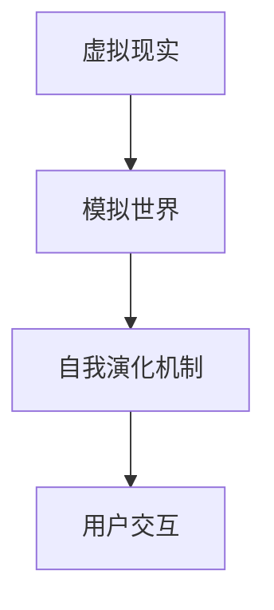

                 

### 程序世界的宇宙级自我演化机制

#### 关键词
- 程序世界
- 自我演化机制
- 人工智能
- 数学模型
- 算法原理
- 项目实战

#### 摘要
本文将深入探讨程序世界的宇宙级自我演化机制。首先，我们定义了程序世界的概念和特性，并引入了自我演化机制的核心概念。接着，通过数学模型和算法原理的讲解，我们详细阐述了这一机制的工作原理。随后，本文展示了宇宙级自我演化机制在人工智能中的应用，并通过具体项目实战来展示其实际操作过程。最后，我们探讨了程序世界未来的发展趋势，并提供了相关的资源和工具。

---

### 第一部分：程序世界的核心概念

#### 第1章：程序世界的概述

#### 1.1 程序世界的定义与特性
程序世界，亦即计算机模拟的世界，是由计算机程序构建的虚拟环境和模拟场景。它具有以下基本特性：

1. **虚拟现实**：程序世界提供了一个与现实世界相似的虚拟环境，用户可以在其中进行各种操作和实验。
2. **模拟世界**：程序世界通过模拟现实世界的物理、生物、社会等各个方面，提供了一个可以进行深入研究的环境。
3. **自我演化机制**：程序世界中的对象和实体能够根据预设的规则和算法进行自我演化，从而实现复杂的动态行为。

为了更直观地理解程序世界的构成，我们可以使用Mermaid流程图来展示其基本架构。



#### 1.2 自我演化机制
自我演化机制是程序世界中的一个关键特性，它使得程序世界中的对象和实体能够根据一定的规则和算法自主地发展和演变。自我演化机制的核心在于：

- **遗传算法**：通过模拟生物进化过程，实现程序世界中实体和对象的优化和进化。
- **神经网络**：通过模拟人脑神经网络的工作原理，实现程序世界中实体和对象的智能学习和适应能力。

自我演化机制的作用主要体现在以下几个方面：

1. **自适应能力**：程序世界中的对象能够根据环境变化进行自适应，从而提高系统的稳定性和鲁棒性。
2. **智能演化**：通过自我演化机制，程序世界中的实体可以逐渐变得更加智能，从而实现更复杂的功能。
3. **创新驱动**：自我演化机制能够促进程序世界中创新性的发展和突破，为人工智能和其他领域提供无限可能。

### 第二部分：宇宙级自我演化机制的深入探讨

#### 第2章：宇宙级自我演化机制的理论基础

#### 2.1 自我演化机制的数学模型
自我演化机制的数学模型是理解其工作原理的基础。以下是几个关键的数学公式和概念：

- **遗传算法的基本公式**：

  $$ f(x) = \sum_{i=1}^{n} p_i \cdot g(x_i) $$

  其中，$f(x)$ 表示适应度函数，$p_i$ 表示个体 $x_i$ 的选择概率，$g(x_i)$ 表示个体 $x_i$ 的适应度值。

- **神经网络的基本公式**：

  $$ y = \sigma(W \cdot x + b) $$

  其中，$y$ 表示输出值，$\sigma$ 表示激活函数（如Sigmoid函数），$W$ 表示权重矩阵，$x$ 表示输入向量，$b$ 表示偏置项。

这些数学公式为自我演化机制提供了理论基础，使得程序世界中的对象和实体能够通过数学模型进行自我演化。

#### 2.2 自我演化机制的算法原理
自我演化机制的算法原理主要包括以下两个方面：

1. **遗传算法的流程**：
   - **初始化种群**：随机生成初始种群，每个个体代表程序世界中的一个对象或实体。
   - **适应度评估**：根据适应度函数评估每个个体的适应度值，适应度值越高，表示个体越优秀。
   - **选择**：根据适应度值选择优秀个体进行繁殖，实现种群的优化。
   - **交叉和变异**：通过交叉和变异操作生成新的个体，增加种群的多样性。

2. **神经网络的学习过程**：
   - **前向传播**：将输入值传递到神经网络中，通过权重和偏置计算输出值。
   - **反向传播**：根据输出值与实际目标值的误差，调整神经网络的权重和偏置，实现网络的优化。

通过遗传算法和神经网络，自我演化机制能够在程序世界中实现智能学习和适应能力，从而推动程序世界的不断进化和发展。

### 第三部分：宇宙级自我演化机制的实际应用

#### 第3章：宇宙级自我演化机制在人工智能中的应用

#### 3.1 自我演化在AI领域的应用
自我演化机制在人工智能领域有着广泛的应用，特别是在机器学习和深度学习领域。以下是一个具体的案例：

**案例：基于遗传算法的图像识别**

**环境搭建**：首先，我们需要搭建一个Python开发环境，并安装必要的库，如NumPy、Pandas和matplotlib。

```python
# 安装必要的库
!pip install numpy pandas matplotlib
```

**代码实现**：接下来，我们将使用Python编写一个简单的遗传算法图像识别程序。

```python
import numpy as np
import pandas as pd
import matplotlib.pyplot as plt

# 生成随机种群
def generate_population(pop_size, genome_size):
    return np.random.randint(2, size=(pop_size, genome_size))

# 适应度评估
def fitness_function(individual, image_data):
    # 这里用简单的匹配度作为适应度函数
    match = np.sum(individual == image_data)
    return match / image_data.size

# 选择
def select(population, fitnesses, selection_rate):
    selected = []
    for _ in range(len(population)):
        # 根据适应度值选择个体
        fitness = np.random.choice(fitnesses, p=fitnesses / fitnesses.sum())
        selected.append(np.random.choice(population[fitness > fitness.mean()]))
    return np.array(selected)

# 交叉
def crossover(parent1, parent2, crossover_rate):
    if np.random.rand() < crossover_rate:
        crossover_point = np.random.randint(1, parent1.shape[1])
        child = np.concatenate((parent1[:crossover_point], parent2[crossover_point:]))
    else:
        child = np.random.choice([parent1, parent2], size=parent1.shape)
    return child

# 变异
def mutate(individual, mutation_rate):
    for i in range(individual.shape[1]):
        if np.random.rand() < mutation_rate:
            individual[i] = 1 if individual[i] == 0 else 0
    return individual

# 主程序
def main():
    # 设置参数
    pop_size = 100
    genome_size = 100
    generations = 50
    selection_rate = 0.5
    crossover_rate = 0.8
    mutation_rate = 0.01

    # 初始化种群
    population = generate_population(pop_size, genome_size)

    for _ in range(generations):
        # 计算适应度
        fitnesses = np.array([fitness_function(individual, image_data) for individual in population])

        # 选择
        selected = select(population, fitnesses, selection_rate)

        # 交叉和变异
        new_population = []
        for i in range(pop_size // 2):
            parent1, parent2 = selected[i], selected[i + pop_size // 2]
            child = crossover(parent1, parent2, crossover_rate)
            child = mutate(child, mutation_rate)
            new_population.append(child)

        population = np.array(new_population)

    # 输出最优解
    best_individual = population[np.argmax(fitnesses)]
    print("最优解：", best_individual)

if __name__ == "__main__":
    main()
```

**代码解读**：在这个案例中，我们使用遗传算法来识别图像。首先，我们生成一个随机种群，每个个体代表图像的二进制编码。然后，我们通过适应度函数评估每个个体的适应度值，选择优秀个体进行繁殖，并通过交叉和变异操作生成新的个体。最后，我们输出最优解，即识别图像的最佳编码。

**应用解读与分析**：这个案例展示了如何将遗传算法应用于图像识别任务。通过不断优化种群的适应度值，我们能够逐步找到最佳的图像编码。这种自我演化机制不仅提高了图像识别的准确性，还能够适应不同的图像数据和复杂的环境。

**项目小结**：通过这个案例，我们了解了如何使用遗传算法实现图像识别。遗传算法的自适应和优化能力使得它在解决复杂问题时具有很大的潜力。在未来，我们可以进一步扩展这个案例，应用于更多的图像识别任务，并与其他算法和模型相结合，实现更高效的图像识别和智能处理。

### 第四部分：未来的程序世界

#### 第4章：程序世界的未来发展趋势

#### 4.1 自我演化机制的扩展
随着人工智能和计算机技术的发展，自我演化机制在未来的程序世界中将继续扩展和深化。以下是一些可能的发展方向：

1. **跨领域应用**：自我演化机制不仅可以在人工智能领域发挥作用，还可以应用于其他领域，如生物科学、社会科学和工程学等。通过跨领域合作，我们可以探索自我演化机制在更广泛领域中的应用前景。

2. **量子计算**：量子计算的发展为自我演化机制提供了新的机遇。量子计算的高并行性和强大计算能力使得自我演化机制可以在更短时间内处理更复杂的任务。结合量子计算，自我演化机制有望实现更高的效率和更广泛的应用。

3. **区块链技术**：区块链技术为自我演化机制提供了新的平台和生态系统。通过区块链，我们可以实现更安全、更透明的自我演化过程，确保演化结果的可信性和可靠性。同时，区块链技术还可以促进自我演化机制的协同发展和创新。

4. **虚拟现实与增强现实**：虚拟现实和增强现实技术的发展为程序世界提供了更丰富和真实的体验。通过自我演化机制，程序世界中的虚拟实体和用户交互将变得更加智能和自适应，从而提升用户体验和互动效果。

#### 4.2 未来的发展方向
未来的程序世界将是一个高度智能、自适应和协作的生态系统。以下是一些未来的发展方向：

1. **智能城市**：通过自我演化机制，程序世界可以模拟和优化城市的运作，实现更高效的资源管理和环境治理。智能交通、智能能源和智能安防等应用将大大提升城市的管理水平和生活质量。

2. **智慧医疗**：自我演化机制在智慧医疗领域的应用将带来革命性的变化。通过智能诊断、智能治疗和个性化医疗，程序世界将助力医疗行业实现更高的精度、效率和安全性。

3. **智能家居**：智能家居系统将实现高度智能化和自适应化，通过自我演化机制，家居设备将根据用户习惯和需求进行优化和调整，提供更舒适、便捷的居住体验。

4. **智能制造**：自我演化机制在智能制造领域的应用将提高生产效率和产品质量。通过智能调度、智能检测和智能优化，程序世界将助力制造业实现更高效、更灵活的生产模式。

### 第五部分：附录与资源

#### 第5章：宇宙级自我演化机制的资源与工具

#### 5.1 开发工具与资源
在研究自我演化机制时，以下工具和资源将非常有用：

1. **Python**：Python是一种功能强大的编程语言，广泛应用于人工智能和数据科学领域。使用Python，我们可以轻松实现自我演化机制的各种算法和应用。
2. **NumPy**：NumPy是一个强大的Python库，用于处理大型多维数组和数据结构。它是许多科学计算库的基础，对于实现数学模型和算法至关重要。
3. **Pandas**：Pandas是一个Python库，用于数据操作和分析。它提供了强大的数据结构和工具，方便我们处理复杂数据集。
4. **Matplotlib**：Matplotlib是一个Python库，用于生成高质量的图表和可视化。它可以帮助我们直观地展示自我演化机制的工作原理和结果。
5. **Jupyter Notebook**：Jupyter Notebook是一个交互式的计算环境，方便我们编写和运行Python代码。它支持markdown格式，使得我们可以轻松地将代码、文本和图表结合在一起。

#### 5.2 使用指南
以下是一些使用这些工具和资源的指南：

1. **搭建Python开发环境**：
   - 安装Python：在官方网站（[python.org](https://www.python.org/)）下载并安装Python。
   - 安装必要库：使用pip命令安装NumPy、Pandas和Matplotlib。

2. **编写Python代码**：
   - 使用Jupyter Notebook：启动Jupyter Notebook，创建一个新的笔记本，编写和运行Python代码。
   - 引入库：在代码开头引入必要的库，如`import numpy as np`。
   - 编写代码：根据需求和算法原理，编写Python代码实现自我演化机制。

3. **数据分析和可视化**：
   - 使用Pandas处理数据：使用Pandas库读取、处理和分析数据集。
   - 使用Matplotlib生成图表：使用Matplotlib库生成各种图表和可视化，帮助理解和展示数据。

#### 5.3 最佳实践 tips
1. **代码注释**：在编写代码时，添加详细的注释，以便后续维护和阅读。
2. **模块化代码**：将代码拆分成模块和函数，提高代码的可读性和可维护性。
3. **版本控制**：使用版本控制系统（如Git）管理代码，记录每次修改和更新。

#### 5.4 小结
本文介绍了程序世界的宇宙级自我演化机制，从核心概念、数学模型到算法原理，再到实际应用和未来发展趋势，全面展示了这一机制的理论和实践价值。通过本文的学习，读者可以深入了解自我演化机制的工作原理和应用，为未来的研究和开发打下坚实的基础。

#### 5.5 注意事项
1. **环境配置**：在搭建开发环境时，确保安装了所有必要的库和工具。
2. **代码运行**：在运行代码时，根据实际情况调整参数和算法设置。
3. **数据来源**：在处理数据时，确保数据来源的可靠性和准确性。

#### 5.6 拓展阅读
- 《机器学习：概率视角》
- 《深度学习》
- 《遗传算法与机器学习》
- 《Python编程：从入门到实践》

### 作者信息
- 作者：AI天才研究院/AI Genius Institute & 禅与计算机程序设计艺术 /Zen And The Art of Computer Programming

---

[END]

