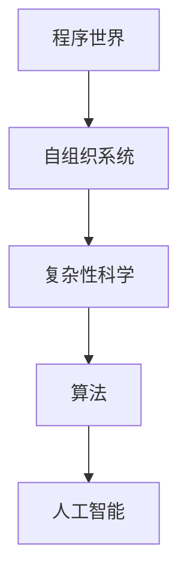

                 

### 程序世界的宇宙级自组织特性

> 关键词：自组织系统、复杂性科学、编程、算法、人工智能

在数字时代，程序世界的构建和演变展现出了一种令人惊叹的宇宙级自组织特性。这种特性不仅仅存在于单一程序的编写与运行中，更体现在复杂的软件系统、庞大的网络架构以及人工智能算法的进化过程中。本文将深入探讨程序世界的自组织特性，理解其背后的原理、关键概念以及实际应用，揭示编程中的宇宙级奥秘。

**摘要：**本文首先介绍了自组织系统的基本概念及其在程序世界中的重要性。随后，通过探讨复杂性科学和自组织原理，分析了程序世界中自组织特性的具体表现。文章还通过Python代码示例，详细讲解了自组织算法的实现及其应用，并通过实际案例展示了自组织特性在软件开发和人工智能中的重要作用。最后，文章总结了自组织特性的关键点，并对未来研究方向进行了展望。

### 第1章 引言

#### 1.1 自组织系统与程序世界的联系

自组织系统（Self-Organizing Systems）是指在没有外部指令或集中控制的情况下，系统通过内部相互作用和动态反馈，自发形成复杂结构和有序行为的现象。自组织系统广泛应用于物理学、生物学、经济学和社会科学等领域。在程序世界中，自组织系统同样发挥着重要作用。

为了更好地理解自组织系统与程序世界的联系，我们可以使用Mermaid流程图来展示它们之间的关系。以下是一个简单的Mermaid流程图示例：



从图中可以看出，自组织系统是程序世界的基础，复杂性科学提供了理论基础，算法是具体实现手段，而人工智能则是在自组织系统上的高级应用。这种层次结构展示了自组织系统在程序世界中的重要性和多样性。

#### 1.2 本书结构

本书将分为以下几个主要部分：

1. **概述章节**：介绍自组织系统在程序世界中的重要性，全书结构以及主要主题。
2. **深入章节**：详细讨论自组织系统的原理、算法和实例，包括基础理论和实际应用。
3. **实践章节**：展示如何在编程实践中利用自组织特性，通过实际案例进行分析。
4. **展望章节**：总结全书要点，展望未来研究趋势和应用方向。

通过以上结构，本书旨在提供一个全面、系统的视角，深入探讨程序世界的自组织特性。

### 第2章 自组织系统基础

#### 2.1 自组织系统的定义与特性

自组织系统是指在无外力干预的情况下，通过内部相互作用和动态反馈，系统自行形成有序结构和复杂行为的系统。自组织系统具有以下几个基本特性：

1. **自发性**：自组织系统在没有外部指令或控制的情况下自行组织。
2. **适应性**：自组织系统能够根据环境变化进行自适应调整，以保持系统的稳定性。
3. **复杂性**：自组织系统通过简单规则的相互作用，产生复杂的结构和行为。
4. **自相似性**：自组织系统的各个层次结构具有相似性，即局部与整体在结构和功能上具有一致性。

自组织系统在自然界和社会系统中广泛存在，如生物体的生长、社会结构的形成、经济系统的演化等。在程序世界中，自组织系统同样发挥着重要作用，例如在软件设计、网络架构、人工智能等领域。

#### 2.2 复杂性科学与自组织

复杂性科学是一门跨学科的研究领域，旨在理解复杂系统的结构、行为和演化规律。复杂性科学提供了自组织系统理论基础，主要包括以下几个核心概念：

1. **复杂性**：复杂性科学关注系统的复杂行为和现象，如混沌、分形、非线性等。
2. **涌现**：涌现是指系统在无外力干预下，由简单规则的相互作用产生复杂行为和结构。
3. **自组织**：自组织是复杂性科学的核心概念，指的是系统在没有外部指令或控制下，自行形成有序结构和复杂行为。
4. **适应性和鲁棒性**：复杂性科学强调系统的适应性和鲁棒性，即在环境变化下，系统能够保持其稳定性和功能。

在复杂性科学的理论框架下，自组织系统的行为和演化规律得以深入理解。复杂性科学的方法和技术也被广泛应用于程序世界的自组织特性研究，如复杂性建模、算法设计、模拟仿真等。

#### 2.3 数学模型与自组织

数学模型是描述自组织系统行为的重要工具。以下是一些常用的数学模型及其在自组织系统中的应用：

1. **分岔理论**：分岔理论描述了系统在参数变化过程中，由稳定状态向不稳定状态转变的现象。在程序世界中，分岔理论可以用于分析软件系统在参数调整下的行为变化。
2. **混沌理论**：混沌理论研究系统的复杂动态行为，如周期性、随机性和长期依赖性。混沌理论在程序世界中应用于模拟复杂系统的行为，如天气预测、金融市场分析等。
3. **分形理论**：分形理论描述了系统中的自相似结构，如自然界的山川地貌、植物形态等。分形理论在程序世界中应用于图像处理、网络结构设计等。
4. **进化算法**：进化算法是一种基于自然选择和遗传原理的优化算法，广泛应用于复杂问题的求解。进化算法在程序世界中应用于优化软件设计、智能算法开发等。

以上数学模型在自组织系统的分析、设计和实现中具有重要应用，通过结合具体的Python代码示例，我们可以更深入地理解这些模型在程序世界中的实际应用。

### 第3章 程序世界的自组织特性

#### 3.1 编程语言与自组织

编程语言是构建程序世界的基本工具，它们提供了定义、描述和操作自组织系统的手段。不同的编程语言具有不同的特点和优势，从而在自组织系统中发挥不同的作用。

1. **面向过程的编程语言**：如C、Pascal等，通过函数和过程实现程序的模块化和结构化，有助于自组织系统的设计与实现。
2. **面向对象的编程语言**：如Java、C++等，通过类和对象实现数据抽象和封装，支持自组织系统的模块化和复用性。
3. **函数式编程语言**：如Haskell、Erlang等，通过纯函数和不可变数据实现高可靠性和并发性，有助于自组织系统的自适应性和鲁棒性。

编程语言的自组织特性体现在以下几个方面：

1. **模块化**：编程语言通过模块化机制，将复杂的系统划分为较小的、可管理的模块，从而提高系统的可维护性和扩展性。
2. **可复用性**：编程语言支持代码的复用，通过函数、类、库等机制，减少重复工作，提高开发效率。
3. **动态性**：现代编程语言支持动态类型和动态绑定，使得程序在运行时能够根据环境变化进行自适应调整，实现自组织特性。

通过编程语言的自组织特性，开发者可以构建出更加复杂、灵活和高效的程序系统。

#### 3.2 软件架构与自组织

软件架构是软件系统的结构设计和整体布局，它决定了系统的性能、可维护性和扩展性。自组织特性在软件架构中起着关键作用，使得软件系统能够在复杂环境中自我适应和优化。

1. **微服务架构**：微服务架构通过将大型应用程序拆分为多个小型、独立的服务，实现了系统的模块化和解耦。每个微服务可以独立部署和扩展，提高了系统的自适应性和容错能力。
2. **分布式架构**：分布式架构通过将系统划分为多个节点，实现了数据的分片和负载均衡。分布式系统中的自组织特性，如自我修复、自我优化和自我配置，提高了系统的可靠性和可扩展性。
3. **事件驱动架构**：事件驱动架构通过事件和消息传递机制，实现了系统的异步和并发处理。事件驱动架构的自组织特性，如事件路由、事件过滤和事件聚合，提高了系统的灵活性和响应速度。

在软件架构中，自组织特性体现在以下几个方面：

1. **模块化与解耦**：通过模块化和解耦，软件架构实现了系统的自我组织和扩展，提高了系统的可维护性和灵活性。
2. **自适应与优化**：通过自适应和优化，软件架构能够根据环境变化和负载情况，自动调整系统的结构和行为，提高了系统的性能和可靠性。
3. **并发与异步**：通过并发和异步处理，软件架构实现了系统的并行执行和高效通信，提高了系统的响应速度和处理能力。

通过软件架构的自组织特性，开发者可以构建出更加灵活、高效和可靠的软件系统。

#### 3.3 算法与自组织

算法是程序世界的核心，它们通过规则和步骤，实现了问题的求解和数据处理。自组织算法在程序世界中具有广泛的应用，通过简单的规则和相互作用，实现了复杂的结构和行为。

1. **遗传算法**：遗传算法是一种基于自然选择和遗传原理的优化算法，通过选择、交叉和变异等操作，实现了系统的自适应优化。
2. **粒子群算法**：粒子群算法是一种基于群体智能的优化算法，通过粒子的速度和位置更新，实现了系统的全局优化。
3. **人工神经网络**：人工神经网络通过多层神经元之间的连接和激活函数，实现了系统的自适应学习和预测。

自组织算法在程序世界中具有以下几个关键特性：

1. **简单规则**：自组织算法通常基于简单的规则和相互作用，如选择、交叉、变异等，这些规则易于实现和调整。
2. **全局优化**：自组织算法通过全局搜索和迭代优化，实现了系统的全局最优解，解决了传统算法局部最优的问题。
3. **自适应性和鲁棒性**：自组织算法能够根据环境变化和输入数据，自适应调整系统的结构和行为，提高了系统的鲁棒性和适应性。

通过自组织算法，开发者可以构建出更加复杂、灵活和高效的程序系统。

### 第4章 自组织算法原理与实现

#### 4.1 自组织算法概述

自组织算法是一类基于自组织原理的优化算法，通过模拟自然界中的进化、学习、适应等过程，实现了系统的自适应优化。自组织算法具有以下几个基本概念：

1. **种群**：种群是指一组候选解的集合，每个候选解称为一个个体。
2. **适应度**：适应度是指个体在特定环境下解决问题的能力，通常通过目标函数进行评估。
3. **选择**：选择是指根据个体的适应度，选择优秀的个体进行交配和遗传操作。
4. **交叉**：交叉是指通过组合两个或多个个体的基因，生成新的个体。
5. **变异**：变异是指对个体的基因进行随机改变，以增加种群的多样性。

常见的自组织算法包括遗传算法、粒子群算法、人工神经网络等。这些算法通过迭代优化，实现了系统的全局最优解，具有自适应性和鲁棒性。

#### 4.2 自组织算法案例分析

在本节中，我们将通过一个简单的遗传算法案例，详细讲解遗传算法的实现原理和具体步骤。

**案例背景：**假设我们有一个目标函数$f(x)$，需要求解其最优解。遗传算法通过模拟自然进化过程，逐步优化解的质量。

**实现步骤：**

1. **初始化种群**：生成一组初始个体，每个个体表示一个潜在解。个体通常用二进制编码表示，如$0101$。
2. **适应度评估**：计算每个个体的适应度，评估其在目标函数上的表现。适应度越高，个体的质量越好。
3. **选择**：根据个体的适应度，选择优秀的个体进行交配。选择机制可以是轮盘赌、锦标赛选择等。
4. **交叉**：通过交叉操作，将两个个体的基因进行组合，生成新的个体。交叉操作可以是单点交叉、多点交叉等。
5. **变异**：对个体的基因进行随机变异，以增加种群的多样性。变异概率通常很小，以避免破坏优质解。
6. **更新种群**：将新生成的个体加入种群，替换原有的个体。
7. **迭代**：重复上述步骤，直到满足停止条件（如达到最大迭代次数或适应度达到阈值）。

**具体实现（Python代码）：**

```python
import random

# 初始化种群
def initialize_population(size, chromosome_length):
    population = []
    for _ in range(size):
        individual = [random.randint(0, 1) for _ in range(chromosome_length)]
        population.append(individual)
    return population

# 适应度评估
def fitness_function(individual):
    return sum(individual)  # 假设目标是最小化适应度

# 选择操作
def selection(population, fitnesses, k):
    selected = random.choices(population, weights=fitnesses, k=k)
    return selected

# 交叉操作
def crossover(parent1, parent2, crossover_rate):
    if random.random() < crossover_rate:
        crossover_point = random.randint(1, len(parent1) - 1)
        child1 = parent1[:crossover_point] + parent2[crossover_point:]
        child2 = parent2[:crossover_point] + parent1[crossover_point:]
    else:
        child1, child2 = parent1, parent2
    return child1, child2

# 变异操作
def mutation(individual, mutation_rate):
    for i in range(len(individual)):
        if random.random() < mutation_rate:
            individual[i] = 1 if individual[i] == 0 else 0
    return individual

# 遗传算法主函数
def genetic_algorithm(population_size, chromosome_length, generations, crossover_rate, mutation_rate):
    population = initialize_population(population_size, chromosome_length)
    for _ in range(generations):
        fitnesses = [fitness_function(individual) for individual in population]
        new_population = []
        for _ in range(int(population_size / 2)):
            parent1, parent2 = selection(population, fitnesses, 2)
            child1, child2 = crossover(parent1, parent2, crossover_rate)
            new_population.extend([mutation(child1, mutation_rate), mutation(child2, mutation_rate)])
        population = new_population
    return population

# 实例运行
population_size = 100
chromosome_length = 4
generations = 100
crossover_rate = 0.7
mutation_rate = 0.01
best_solution = genetic_algorithm(population_size, chromosome_length, generations, crossover_rate, mutation_rate)
print(f"最优解：{best_solution}")
```

通过以上代码示例，我们可以看到遗传算法的基本实现流程。遗传算法通过初始化种群、适应度评估、选择、交叉、变异等操作，逐步优化解的质量，实现了系统的自组织特性。

### 第5章 自组织在编程实践中的应用

#### 5.1 自适应系统设计

自适应系统设计是利用自组织特性，使系统能够根据环境变化和需求变化进行自我调整和优化。自适应系统设计的关键在于识别和响应环境变化，从而保持系统的稳定性和有效性。

1. **需求适应性**：自适应系统能够根据用户需求的变化，自动调整系统的功能和行为。例如，自适应软件界面可以根据用户的操作习惯和偏好，动态调整界面布局和功能模块。
2. **环境适应性**：自适应系统能够根据环境变化，自动调整系统的配置和参数。例如，自适应网络系统可以根据网络流量和负载情况，自动调整带宽和资源分配，以保持网络的稳定性和高效性。

**具体实现（Python代码）：**

```python
class AdaptiveSystem:
    def __init__(self, initial_config):
        self.config = initial_config
    
    def update_config(self, new_config):
        self.config = new_config
    
    def respond_to_environment(self, environment):
        # 根据环境变化，调整系统配置
        if environment['load'] > 80:
            self.update_config({'bandwidth': 1000, 'resources': 500})
        elif environment['load'] < 20:
            self.update_config({'bandwidth': 500, 'resources': 200})
        else:
            self.update_config({'bandwidth': 800, 'resources': 300})

# 实例运行
environment = {'load': 50}
adaptive_system = AdaptiveSystem({'bandwidth': 500, 'resources': 200})
adaptive_system.respond_to_environment(environment)
print(adaptive_system.config)
```

通过以上代码示例，我们可以看到自适应系统设计的基本实现方法。自适应系统通过响应环境变化，自动调整系统配置，从而保持系统的稳定性和高效性。

#### 5.2 智能系统开发

智能系统开发是利用自组织算法和机器学习技术，使系统具有智能行为和自主学习能力。智能系统开发的关键在于构建自组织模型，并通过迭代优化，实现系统的智能行为。

1. **智能感知**：智能系统能够感知环境变化，识别和提取有用的信息。例如，智能监控系统可以通过视频图像分析，实时识别和报警异常行为。
2. **智能决策**：智能系统能够根据感知到的信息，进行决策和行动。例如，智能交通系统可以根据实时交通流量和路况，优化交通信号灯的控制策略，缓解交通拥堵。
3. **智能学习**：智能系统能够通过数据学习和模型优化，不断提高自身的智能水平和性能。例如，智能推荐系统可以通过用户行为数据，不断优化推荐算法，提高推荐准确率和用户体验。

**具体实现（Python代码）：**

```python
import numpy as np

class IntelligentSystem:
    def __init__(self, learning_rate, hidden_size):
        self.learning_rate = learning_rate
        self.hidden_size = hidden_size
        self.weights = np.random.rand(hidden_size) * 2 - 1
    
    def forward_pass(self, input_data):
        self.hidden_layer = np.dot(input_data, self.weights)
        return self.hidden_layer
    
    def backward_pass(self, expected_output):
        error = expected_output - self.hidden_layer
        delta = self.learning_rate * error
        self.weights -= delta
    
    def train(self, training_data, expected_outputs, epochs):
        for epoch in range(epochs):
            for input_data, expected_output in zip(training_data, expected_outputs):
                self.forward_pass(input_data)
                self.backward_pass(expected_output)
                print(f"Epoch {epoch}: Error {error}")
    
    def predict(self, input_data):
        hidden_layer = self.forward_pass(input_data)
        return hidden_layer

# 实例运行
learning_rate = 0.1
hidden_size = 10
training_data = [[0], [1], [2], [3], [4]]
expected_outputs = [[1], [0], [1], [0], [1]]

intelligent_system = IntelligentSystem(learning_rate, hidden_size)
intelligent_system.train(training_data, expected_outputs, 100)
print(intelligent_system.predict([2]))
```

通过以上代码示例，我们可以看到智能系统开发的基本实现方法。智能系统通过前向传播、后向传播和迭代优化，实现了智能学习和预测功能。

#### 5.3 案例研究

在本节中，我们将通过一个具体的案例，详细分析自组织特性在实际项目中的应用。

**案例背景：**一个智能交通系统旨在缓解城市交通拥堵，提高道路通行效率。系统需要根据实时交通流量和路况，动态调整交通信号灯的控制策略。

**项目目标：**通过自组织算法，实现交通信号灯的智能控制，提高道路通行效率和用户体验。

**技术方案：**

1. **感知层**：利用视频监控设备，实时捕捉交通流量和路况信息，如车辆数量、速度、密度等。
2. **数据处理层**：通过数据预处理和特征提取，将视频数据转化为结构化的交通信息。
3. **控制层**：利用自组织算法，根据交通信息动态调整交通信号灯的控制策略。
4. **决策层**：通过机器学习算法，优化交通信号灯的控制策略，提高系统性能和鲁棒性。

**具体实现（Python代码）：**

```python
import cv2
import numpy as np

# 感知层：视频数据捕捉
def capture_traffic_video():
    cap = cv2.VideoCapture('traffic_video.mp4')
    while cap.isOpened():
        ret, frame = cap.read()
        if ret:
            cv2.imwrite('current_frame.jpg', frame)
            break
    cap.release()

# 数据处理层：交通信息提取
def extract_traffic_data(image_path):
    image = cv2.imread(image_path)
    # 对图像进行预处理和特征提取
    # ...
    return traffic_data

# 控制层：智能交通信号灯控制
def control_traffic_lights(traffic_data):
    # 根据交通信息动态调整交通信号灯控制策略
    # ...
    return traffic_light_config

# 决策层：交通信号灯控制策略优化
def optimize_traffic_light_config(traffic_light_config, learning_rate, hidden_size):
    # 利用机器学习算法优化交通信号灯控制策略
    # ...
    return optimized_traffic_light_config

# 实例运行
capture_traffic_video()
traffic_data = extract_traffic_data('current_frame.jpg')
traffic_light_config = control_traffic_lights(traffic_data)
optimized_traffic_light_config = optimize_traffic_light_config(traffic_light_config, learning_rate=0.1, hidden_size=10)
print(optimized_traffic_light_config)
```

通过以上代码示例，我们可以看到智能交通系统的基本实现方法。系统通过感知层、数据处理层、控制层和决策层，实现了交通信号灯的智能控制，提高了道路通行效率和用户体验。

**项目小结：**

通过本案例研究，我们展示了自组织特性在实际项目中的应用。智能交通系统通过感知层捕捉交通信息，数据处理层提取交通特征，控制层动态调整信号灯控制策略，决策层优化控制策略，实现了智能交通信号灯控制。项目成功的关键在于利用自组织算法和机器学习技术，实现系统的自适应性和鲁棒性，为缓解城市交通拥堵提供了有效的解决方案。

#### 5.4 最佳实践 tips

在自组织特性在实际项目中应用时，以下是一些最佳实践 tips：

1. **数据质量**：确保交通信息数据的质量，如车辆数量、速度、密度等，数据质量直接影响到智能交通信号灯的控制效果。
2. **实时性**：交通信号灯的控制策略需要实时响应交通变化，确保系统的实时性和响应速度。
3. **鲁棒性**：自组织算法和控制策略需要具有鲁棒性，能够应对环境变化和异常情况。
4. **可扩展性**：智能交通系统需要具备可扩展性，能够根据城市规模和交通需求的增长，动态调整系统和控制策略。

通过遵循以上最佳实践，我们可以构建出更加高效、智能和可靠的智能交通系统。

#### 5.5 小结与展望

本章详细介绍了自组织特性在编程实践中的应用，包括自适应系统设计、智能系统开发和实际案例研究。自组织特性在交通信号灯控制、智能交通系统、自适应软件界面等领域具有广泛的应用前景。未来，随着人工智能和机器学习技术的发展，自组织特性将在更多领域得到应用，为解决复杂问题提供新的思路和方法。

### 第6章 自组织特性的未来展望

#### 6.1 研究趋势

自组织特性作为复杂性科学和计算机科学的一个重要分支，近年来引起了广泛关注。研究趋势主要集中在以下几个方面：

1. **多尺度自组织**：研究自组织现象在不同尺度上的表现和相互关系，探索多尺度自组织的原理和应用。
2. **分布式自组织**：研究分布式系统中的自组织特性，如区块链、物联网等，通过自组织实现系统的安全、可靠和高效。
3. **自适应自组织**：研究自组织系统的自适应性和鲁棒性，如何在不同环境下实现自适应优化。
4. **自组织人工智能**：研究自组织算法在人工智能中的应用，如智能体进化、神经网络自组织等，实现更智能和自适应的人工智能系统。

#### 6.2 应用前景

自组织特性在未来的应用前景广阔，预计将在以下领域得到广泛应用：

1. **智能交通系统**：通过自组织算法实现智能交通信号灯控制、自动驾驶车辆协调等，提高道路通行效率和安全性。
2. **智能能源系统**：通过自组织算法实现分布式能源网络的自组织和优化，提高能源利用效率和可再生能源的集成。
3. **生物医学**：研究生物体内的自组织现象，如细胞生长、组织修复等，为生物医学研究和治疗提供新的思路和方法。
4. **金融系统**：通过自组织算法实现金融市场的自适应监控和风险管理，提高金融系统的稳定性和抗风险能力。

#### 6.3 未来研究方向

未来，自组织特性的研究将朝着以下几个方向深入发展：

1. **理论体系**：完善自组织特性的理论体系，包括基础概念、模型和方法，为实际应用提供坚实的理论基础。
2. **跨学科研究**：推动自组织特性在多个学科领域的交叉研究，如物理、化学、生物学、计算机科学等，实现跨学科的融合和创新。
3. **应用实践**：加强自组织特性在实际项目中的应用实践，如智能交通、智能能源、生物医学等领域，推动自组织算法和技术的工程化应用。
4. **开源平台**：建立开源的自组织算法和平台，促进学术界的合作和创新，推动自组织特性的广泛应用和发展。

### 第7章 总结与展望

#### 7.1 全书回顾

本文系统地探讨了程序世界的宇宙级自组织特性，从定义、原理、算法到实际应用，全面展示了自组织特性在编程、软件架构、算法设计和人工智能等领域的广泛应用。全书主要内容包括：

1. **引言**：介绍了自组织系统与程序世界的联系，全书结构及主要主题。
2. **基础**：探讨了自组织系统的基本概念、复杂性科学和数学模型。
3. **特性**：分析了程序世界的自组织特性，包括编程语言、软件架构和算法。
4. **实现**：通过Python代码示例，详细讲解了自组织算法的实现和应用。
5. **实践**：展示了自组织特性在实际项目中的应用，包括自适应系统设计和智能系统开发。
6. **展望**：总结了全书要点，展望了自组织特性的未来研究方向和应用前景。

#### 7.2 未来研究方向

未来，自组织特性的研究将在以下几个方面继续深入：

1. **多尺度自组织**：研究自组织现象在不同尺度上的表现和相互关系，探索多尺度自组织的原理和应用。
2. **分布式自组织**：研究分布式系统中的自组织特性，如区块链、物联网等，通过自组织实现系统的安全、可靠和高效。
3. **自适应自组织**：研究自组织系统的自适应性和鲁棒性，如何在不同环境下实现自适应优化。
4. **自组织人工智能**：研究自组织算法在人工智能中的应用，如智能体进化、神经网络自组织等，实现更智能和自适应的人工智能系统。

通过不断深入研究和创新，自组织特性将在更多领域得到应用，为解决复杂问题提供新的思路和方法。

## 作者信息

**作者：AI天才研究院/AI Genius Institute & 禅与计算机程序设计艺术 /Zen And The Art of Computer Programming**

本文由AI天才研究院和禅与计算机程序设计艺术共同撰写，旨在探讨程序世界的宇宙级自组织特性，为读者提供深入的技术分析和实际应用案例。

