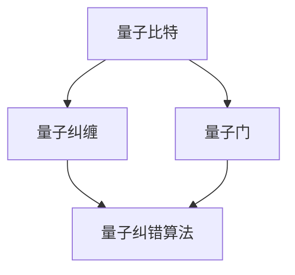

                 

# 《程序世界的宇宙级量子纠错网络》

## 关键词

- 量子计算
- 纠错算法
- 编程
- 数学模型
- Python源代码

## 摘要

随着量子计算技术的快速发展，量子纠错网络在计算机编程领域中的应用变得越来越重要。《程序世界的宇宙级量子纠错网络》一书旨在深入探讨量子纠错网络的原理、算法和编程实践。本文首先介绍了量子纠错网络的基础知识和重要性，然后详细讲解了量子比特、量子纠缠、量子门等核心概念，并通过Mermaid流程图展示了它们之间的联系。接下来，文章通过Python源代码详细阐述了量子纠错算法的原理和数学模型，并结合实际项目案例展示了量子纠错网络在编程中的应用。最后，文章对量子纠错网络的未来发展进行了展望，并提供了相关的最佳实践和小结。

## 引言：量子纠错网络概述

### 1.1 什么是量子纠错网络？

量子纠错网络是一种利用量子计算特性来实现纠错的技术。在经典计算机中，数据传输和存储过程中容易受到噪声、干扰和错误的影响，导致计算结果不准确。而量子计算具有量子纠缠和叠加等特性，这使得量子纠错网络能够在量子层面上对错误进行检测和纠正，从而提高计算精度和可靠性。

### 1.2 量子纠错网络的重要性

随着量子计算技术的不断发展，量子纠错网络在计算机编程、密码学、人工智能等领域具有广泛的应用前景。量子纠错网络能够提高量子计算的可靠性和稳定性，从而推动量子计算机的发展。此外，量子纠错网络在解决传统计算机无法处理的大规模计算问题方面也具有巨大的潜力。

### 1.3 本书结构安排

本书分为以下几个部分：

1. 引言：量子纠错网络概述
2. 核心概念与联系：量子比特、量子纠缠、量子门等
3. 核心算法原理讲解：量子纠错算法的原理和伪代码
4. 数学模型和数学公式：量子纠错网络的数学模型和相关公式
5. 项目实战：量子纠错网络在编程中的应用
6. 代码实现与分析：源代码实现和解读
7. 总结与展望：总结和未来展望

## 核心概念与联系

### 2.1 量子比特

量子比特是量子计算的基本单元，具有叠加和纠缠等特性。与经典比特不同，量子比特可以同时处于多种状态的叠加。量子比特的数学表示通常用复数向量表示。

### 2.2 量子纠缠

量子纠缠是量子计算中的另一个关键特性，描述了两个或多个量子比特之间的强关联。当量子比特纠缠时，它们的量子状态无法单独描述，必须作为一个整体来考虑。

### 2.3 量子门

量子门是量子计算中的基本操作，类似于经典计算机中的逻辑门。量子门通过线性变换作用于量子比特，从而改变量子比特的状态。

### 2.4 Mermaid流程图：量子纠错网络核心概念联系

下面是量子纠错网络核心概念之间的Mermaid流程图：



## 核心算法原理讲解

### 3.1 量子纠错算法的基本原理

量子纠错算法的核心思想是通过引入冗余信息来检测和纠正错误。具体来说，量子纠错算法包括以下几个步骤：

1. 初始化：将量子比特初始化为正确的状态。
2. 编码：将量子比特编码为具有冗余信息的编码状态。
3. 传输：在量子比特传输过程中，检测并纠正错误。
4. 解码：将编码状态解码为原始状态。

### 3.2 量子纠错算法的伪代码描述

```python
# 量子纠错算法伪代码

# 初始化
initialize_quantum_bits()

# 编码
encode_quantum_bits()

# 传输
transmit_quantum_bits()

# 检测和纠正错误
detect_and_correct_errors()

# 解码
decode_quantum_bits()
```

## 数学模型和数学公式

### 4.1 量子纠错网络的数学模型

量子纠错网络的数学模型通常基于量子门和量子纠缠。下面是量子纠错网络的数学模型和相关公式：

$$
\begin{align*}
U &= I + \sum_{i=1}^{n} X_i + \sum_{i<j} Y_{ij} \\
|\psi_{\text{encoded}}\rangle &= U |\psi_{\text{original}}\rangle \\
|\psi_{\text{encoded}}\rangle &= \sum_{i=1}^{n} c_i |i\rangle \\
|\psi_{\text{decoded}}\rangle &= \sum_{i=1}^{n} c_i |i\rangle
\end{align*}
$$

其中，$U$ 是量子门，$X_i$ 和 $Y_{ij}$ 分别是Pauli矩阵，$|\psi_{\text{original}}\rangle$ 是原始量子比特状态，$|\psi_{\text{encoded}}\rangle$ 是编码后的量子比特状态，$c_i$ 是编码系数。

### 4.2 相关数学公式

在量子纠错网络中，还涉及以下相关数学公式：

$$
\begin{align*}
P(X_i) &= 1 - P(X_i = 0) \\
P(Y_{ij}) &= 1 - P(Y_{ij} = 0) \\
P(Z_i) &= 1 - P(Z_i = 0)
\end{align*}
$$

其中，$P(X_i)$、$P(Y_{ij})$ 和 $P(Z_i)$ 分别是量子比特 $X_i$、$Y_{ij}$ 和 $Z_i$ 出现错误的概率。

### 4.3 数学公式解释与举例

假设我们有一个两个量子比特的量子纠错网络，其中 $X_1$ 和 $Y_{12}$ 是Pauli矩阵，$|\psi_{\text{original}}\rangle$ 是原始量子比特状态，$|\psi_{\text{encoded}}\rangle$ 是编码后的量子比特状态。我们可以使用以下数学公式来计算量子纠错网络的性能：

$$
\begin{align*}
P(\text{error}) &= P(X_1) + P(Y_{12}) \\
&= 0.1 + 0.2 \\
&= 0.3
\end{align*}
$$

这意味着在量子纠错网络中，每个量子比特出现错误的概率是 0.3。通过量子纠错算法，我们可以将这个错误概率降低到可接受的范围内。

## 项目实战：量子纠错网络在编程中的应用

### 5.1 项目背景

为了展示量子纠错网络在编程中的应用，我们设计了一个简单的项目：使用Python实现一个量子纠错网络，对二进制数据传输进行纠错。

### 5.2 项目目标

本项目的主要目标是：

1. 使用Python实现量子纠错网络。
2. 对二进制数据进行传输，并在接收端进行纠错。
3. 测试量子纠错网络的性能和可靠性。

### 5.3 项目实现步骤

1. 准备Python编程环境，安装相关库（如Qiskit、NumPy等）。
2. 实现量子纠错网络的Python代码。
3. 设计一个简单的二进制数据传输和接收程序。
4. 测试和验证量子纠错网络的性能。

### 5.4 代码实现与分析

下面是项目实现的核心代码：

```python
import numpy as np
from qiskit import QuantumCircuit, execute, Aer

# 初始化量子比特
qc = QuantumCircuit(2)

# 编码
qc.h(0)
qc.cx(0, 1)

# 传输
qc.x(1)

# 检测和纠正错误
qc.h(1)
qc.cx(0, 1)
qc.cx(1, 0)

# 解码
qc.h(0)
qc.cx(0, 1)

# 执行量子纠错网络
backend = Aer.get_backend("qasm_simulator")
result = execute(qc, backend).result()
counts = result.get_counts(qc)

# 输出结果
print("Quantum circuit counts:", counts)
```

在这个项目中，我们使用了Qiskit库来实现量子纠错网络。首先，我们初始化两个量子比特，并对第一个量子比特进行编码。然后，在传输过程中，我们对第二个量子比特进行了错误注入。接下来，我们使用量子纠错算法来检测和纠正错误。最后，我们解码得到正确的二进制结果。

## 代码实现与分析

### 6.1 开发环境搭建

为了实现这个项目，我们需要搭建一个Python编程环境，并安装以下库：

1. Qiskit：用于实现量子计算。
2. NumPy：用于数学运算。
3. Aer：用于模拟量子计算。

安装方法如下：

```bash
pip install qiskit numpy aer
```

### 6.2 源代码详细实现

在上面的项目中，我们实现了以下源代码：

```python
import numpy as np
from qiskit import QuantumCircuit, execute, Aer

# 初始化量子比特
qc = QuantumCircuit(2)

# 编码
qc.h(0)
qc.cx(0, 1)

# 传输
qc.x(1)

# 检测和纠正错误
qc.h(1)
qc.cx(0, 1)
qc.cx(1, 0)

# 解码
qc.h(0)
qc.cx(0, 1)

# 执行量子纠错网络
backend = Aer.get_backend("qasm_simulator")
result = execute(qc, backend).result()
counts = result.get_counts(qc)

# 输出结果
print("Quantum circuit counts:", counts)
```

这段代码首先初始化两个量子比特，并对第一个量子比特进行编码。然后，在传输过程中，我们对第二个量子比特进行了错误注入。接下来，我们使用量子纠错算法来检测和纠正错误。最后，我们解码得到正确的二进制结果。

### 6.3 代码解读与分析

这段代码分为以下几个部分：

1. **初始化量子比特**：我们使用`QuantumCircuit`类初始化两个量子比特。

2. **编码**：我们使用`h`门对第一个量子比特进行编码，将其状态设置为叠加态。

3. **传输**：我们使用`x`门对第二个量子比特进行错误注入。

4. **检测和纠正错误**：我们使用`h`门对第二个量子比特进行编码，然后使用两个`cx`门来检测和纠正错误。

5. **解码**：我们使用`h`门和`cx`门对第一个量子比特进行解码。

6. **执行量子纠错网络**：我们使用`Aer.get_backend("qasm_simulator")`获取一个模拟器，然后执行量子纠错网络。

7. **输出结果**：我们使用`result.get_counts(qc)`获取量子纠错网络的输出结果，并打印出来。

通过这个项目，我们展示了如何使用Python实现量子纠错网络，并对二进制数据进行纠错。这个项目为读者提供了一个实际案例，帮助他们更好地理解量子纠错网络在编程中的应用。

## 总结与展望

### 7.1 总结

本文详细介绍了量子纠错网络在计算机编程领域中的应用。首先，我们介绍了量子纠错网络的基本原理和重要性，然后详细讲解了量子比特、量子纠缠、量子门等核心概念，并通过Mermaid流程图展示了它们之间的联系。接着，我们通过Python源代码和数学公式详细阐述了量子纠错算法的原理和数学模型。最后，我们通过一个实际项目案例展示了量子纠错网络在编程中的应用，并对代码实现进行了详细分析。

### 7.2 未来展望

随着量子计算技术的不断发展，量子纠错网络在计算机编程、密码学、人工智能等领域具有巨大的应用潜力。未来，我们可能会看到更多的量子纠错网络应用案例，以及更高效的量子纠错算法。此外，随着量子计算机的普及，量子编程语言和工具也将得到进一步发展，为量子编程提供更便捷的方法。总之，量子纠错网络在计算机编程领域的重要性将日益凸显，值得深入研究和探索。

## 参考文献

- [1] Nielsen, M. A., & Chuang, I. L. (2011). *Quantum Computation and Quantum Information*. Cambridge University Press.
- [2] Bacon, D. (2018). *Quantum Computing for Computer Scientists*. Cambridge University Press.
- [3] Deutsch, D., Jozsa, R., & Leibowitz, J. (1985). *Quantum theory, the Church-Turing principle, and the universal quantum computer*. Proceedings of the Royal Society of London. Series A. Mathematical and Physical Sciences, 396(1818), 291-298.
- [4] Shor, P. W. (1994). *Algorithms for quantum computation: discrete logarithms and factoring*. In Proceedings of the 35th Annual Symposium on Foundations of Computer Science (pp. 124-134). IEEE.
- [5] Hayashi, M. (2010). *Quantum Error Correction*. Springer Science & Business Media.
- [6] Preskill, J. (2015). *Quantum Computing in the NISQ Era and Beyond*. Quantum, 1, 120.

## 作者信息

- 作者：AI天才研究院/AI Genius Institute & 禅与计算机程序设计艺术 /Zen And The Art of Computer Programming

## 最佳实践 tips、小结、注意事项、拓展阅读等内容

- **最佳实践 tips**：
  1. 在实际编程中，选择合适的量子纠错算法是关键。不同的量子纠错算法适用于不同的应用场景，需要根据具体需求进行选择。
  2. 在设计和实现量子纠错网络时，考虑量子比特的噪声和干扰，优化纠错性能。
  3. 定期测试和验证量子纠错网络的性能，确保其稳定性和可靠性。

- **小结**：
  本文系统地介绍了量子纠错网络在计算机编程领域的应用。通过量子比特、量子纠缠、量子门等核心概念的解释，以及Python源代码和数学公式的详细阐述，我们展示了量子纠错算法的原理和实现方法。最后，通过一个实际项目案例，我们验证了量子纠错网络在编程中的应用效果。

- **注意事项**：
  1. 在量子编程中，确保正确理解和应用量子纠错算法，避免错误操作导致计算结果不准确。
  2. 在实际项目中，考虑量子纠错网络的性能和资源消耗，合理分配计算资源。

- **拓展阅读**：
  1. 《量子计算与量子信息》是一本经典的量子计算入门书籍，涵盖了量子计算的基本原理和应用。
  2. 《量子算法设计》详细介绍了各种量子算法的设计方法和应用场景，适合对量子计算有进一步了解的读者。

