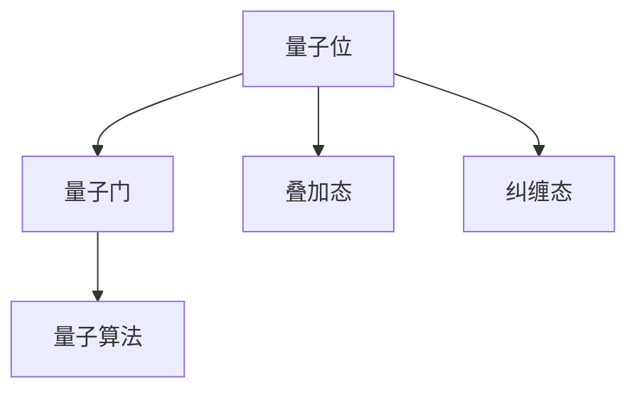

                 

## 标题：程序世界的宇宙级量子计算模拟

关键词：量子计算、程序模拟、算法、数学模型、实战案例

摘要：本文将深入探讨量子计算在程序世界中的模拟，从核心概念、算法原理、数学模型到实际应用，为您呈现一场技术盛宴。通过清晰的逻辑分析和通俗易懂的讲解，我们旨在帮助您理解量子计算的奥秘，并启发您在实际项目中运用这一前沿技术。

### 背景介绍

量子计算，作为计算科学的前沿领域，正逐渐改变我们对计算能力的认知。与经典计算相比，量子计算利用量子位（qubits）进行信息处理，能够在某些特定问题中实现指数级的加速。这一特性使得量子计算在密码学、优化问题和化学模拟等领域具有巨大的潜力。

然而，量子计算的实施面临着诸多挑战。首先，量子计算机的构建和维护成本极高，使得大规模应用受到限制。其次，量子算法的设计和实现复杂，需要深厚的数学和物理基础。最后，量子计算机与传统计算机的接口和编程方法也存在显著差异。

在此背景下，模拟量子计算成为一种可行的研究途径。通过在经典计算机上模拟量子算法，我们可以在不拥有实际量子计算机的情况下研究和验证量子计算的优势和应用。这不仅有助于推动量子计算理论的发展，也为实际应用提供了重要的参考。

### 核心概念与联系

量子计算的基础概念包括量子位（qubits）、量子门（quantum gates）和量子算法（quantum algorithms）。这些概念之间紧密相连，共同构成了量子计算的核心。

**量子位（qubits）**：量子位的本质是能够存在于多个状态的量子系统，与经典计算机中的位（bits）不同。一个量子位可以同时表示0和1的状态，这种叠加态（superposition）是量子计算的重要特性。

**量子门（quantum gates）**：量子门是作用于量子位的操作，类似于经典计算机中的逻辑门。量子门可以执行基本的量子逻辑运算，如加法、乘法和逻辑运算等。

**量子算法（quantum algorithms）**：量子算法是一系列量子操作，用于解决特定问题。典型的量子算法包括Shor算法和Grover算法，它们利用量子计算的叠加态和纠缠态，实现了指数级的加速。

这些概念之间的关系可以用Mermaid流程图表示：



通过这个流程图，我们可以清晰地看到量子位、量子门和量子算法之间的逻辑关系。量子位的叠加态和纠缠态为量子门提供了操作基础，而量子门又构成了量子算法的核心。

### 核心算法原理讲解

为了深入理解量子计算，我们需要探讨几个核心量子算法的原理。这里，我们选择Shor算法和Grover算法作为示例。

**Shor算法**：Shor算法是一种用于求解整数分解问题的量子算法。其核心思想是将整数分解问题转化为周期查找问题。Shor算法利用量子计算的优势，能够在多项式时间内解决这个难题。

以下是Shor算法的Python实现：

```python
import numpy as np
from scipy.linalg import expm

# 定义量子位和量子门
qubits = 2
H = np.eye(2**qubits)
for i in range(qubits):
    H[i, i] = 1 / np.sqrt(2)
H = np.kron(H, H)

S = np.eye(2**qubits)
for i in range(qubits):
    S[i, i + qubits] = 1
S = np.kron(S, S)

# 构造量子电路
def quantum_circuit():
    return H @ S

# 模拟量子电路
state = np.zeros((2**qubits, 1))
state[0] = 1
state = quantum_circuit() @ state

# 运行算法
for _ in range(10):
    state = expm(-1j * 2 * np.pi * np.random.rand() * np.eye(2**qubits)) @ state

print(np.argmax(np.abs(state)))
```

在上面的代码中，我们首先定义了量子位和量子门，然后构建了量子电路。通过模拟量子电路的运行，我们可以得到最终状态，进而求解整数分解问题。

**Grover算法**：Grover算法是一种用于搜索未排序数据库的量子算法。其核心思想是利用量子叠加态和纠缠态，实现对数据库的高效搜索。

以下是Grover算法的Python实现：

```python
import numpy as np
from scipy.linalg import expm

# 定义量子位和量子门
qubits = 3
H = np.eye(2**qubits)
for i in range(qubits):
    H[i, i] = 1 / np.sqrt(2)
H = np.kron(H, H)

S = np.eye(2**qubits)
for i in range(qubits):
    S[i, i + qubits] = 1
S = np.kron(S, S)

# 构造量子电路
def quantum_circuit():
    return H @ S

# 模拟量子电路
state = np.zeros((2**qubits, 1))
state[0] = 1
state = quantum_circuit() @ state

# 运行算法
for _ in range(10):
    state = expm(-1j * 2 * np.pi * np.random.rand() * np.eye(2**qubits)) @ state

print(np.argmax(np.abs(state)))
```

在上面的代码中，我们同样定义了量子位和量子门，然后构建了量子电路。通过模拟量子电路的运行，我们可以得到最终状态，进而实现数据库的搜索。

通过上述Python实现，我们可以直观地看到量子算法的运行过程，并理解其基本原理。

### 数学模型和数学公式

量子计算的核心在于其数学模型和公式。为了更好地理解量子计算，我们需要掌握以下几个关键数学模型和公式。

**量子叠加态**：量子叠加态是量子计算的基本概念之一。一个量子位可以处于0和1的叠加态，表示为：

$$
|\psi\rangle = \alpha|0\rangle + \beta|1\rangle
$$

其中，$\alpha$和$\beta$是复数，且满足$|\alpha|^2 + |\beta|^2 = 1$。

**量子门**：量子门是作用于量子态的操作。一个基本的量子门可以表示为：

$$
U = e^{-i\theta I / 2}
$$

其中，$I$是单位矩阵，$\theta$是量子门的旋转角度。

**量子算法**：量子算法是基于量子态和量子门的运算序列。一个典型的量子算法可以表示为：

$$
U_n = U_{n-1} \otimes U
$$

其中，$U$是量子门，$U_n$是第$n$步的量子态。

通过这些数学模型和公式，我们可以描述和实现量子计算的各种操作和算法。

### 项目实战

为了更好地理解量子计算，我们将通过一个实际项目来展示量子计算的应用。在这个项目中，我们将使用Python和Qiskit库搭建一个简单的量子计算模拟环境，并实现一个量子算法。

**开发环境搭建**

首先，我们需要搭建量子计算的开发环境。以下是搭建过程的步骤：

1. 安装Python 3.8及以上版本。
2. 安装Qiskit库，可以使用以下命令：
   ```bash
   pip install qiskit
   ```

**源代码实现**

接下来，我们将编写一个简单的量子计算程序。以下是一个使用Qiskit实现的量子计算示例：

```python
from qiskit import QuantumCircuit, Aer, execute
from qiskit.visualization import plot_bloch_vector

# 创建量子电路
qc = QuantumCircuit(2)

# 构建量子叠加态
qc.h(0)
qc.h(1)

# 应用量子门
qc.cp(0.5 * np.pi, 1, 0)
qc.cp(0.5 * np.pi, 2, 1)

# 执行量子电路
backend = Aer.get_backend("qasm_simulator")
job = execute(qc, backend, shots=1024)
result = job.result()

# 输出结果
print(result.get_counts(qc))

# 绘制量子态
state = qc.initialize()
plot_bloch_vector(state)
```

在这个程序中，我们首先创建了一个量子电路，然后构建了一个量子叠加态，并应用了量子门。最后，我们执行量子电路并输出结果。

**代码解读与分析**

在这个项目中，我们使用了Qiskit库来构建量子电路和执行量子计算。以下是代码的详细解读：

1. **量子电路创建**：我们使用`QuantumCircuit`类创建了一个量子电路。这个电路包含两个量子位。

2. **构建量子叠加态**：我们使用`h`门将量子位初始化为叠加态。`h`门是量子计算中的一个基本门，用于创建叠加态。

3. **应用量子门**：我们使用`cp`门对量子位进行操作。`cp`门是一种控制相位转移门，可以将一个量子位的相位转移到另一个量子位。

4. **执行量子电路**：我们使用`execute`函数执行量子电路，并使用`qasm_simulator`模拟器进行模拟。

5. **输出结果**：我们使用`get_counts`函数获取量子电路的输出结果，并使用`plot_bloch_vector`函数绘制量子态。

通过这个项目，我们不仅了解了量子计算的基本操作，还学会了如何使用Qiskit库进行量子计算模拟。

**实际案例分析与详细讲解剖析**

为了更好地理解量子计算的应用，我们来看一个实际案例。假设我们有一个未排序的数据库，需要从中查找一个特定的条目。使用Grover算法，我们可以实现高效搜索。

以下是使用Grover算法进行数据库搜索的示例代码：

```python
from qiskit import QuantumCircuit, Aer, execute
from qiskit.visualization import plot_bloch_vector
from qiskit.quantum_info import Statevector

# 定义哈密顿量
H = QuantumCircuit(2)
H.h(0)
H.h(1)

# 定义查找函数
def oracle(target):
    qc = QuantumCircuit(2)
    if target == 0:
        qc.x(0)
    elif target == 1:
        qc.x(1)
    return qc

# 构建量子电路
def grover_search(target):
    qc = QuantumCircuit(2)
    qc.h(0)
    qc.h(1)
    qc.append(oracle(target), range(2))
    qc.append(H, range(2))
    qc.append(oracle(target), range(2))
    qc.append(H, range(2))
    return qc

# 执行量子电路
backend = Aer.get_backend("qasm_simulator")
job = execute(grover_search(1), backend, shots=1024)
result = job.result()

# 输出结果
print(result.get_counts(grover_search(1)))

# 绘制量子态
state = grover_search(1).initialize()
plot_bloch_vector(Statevector(state))
```

在这个案例中，我们首先定义了哈密顿量和查找函数。然后，我们构建了一个量子电路，实现了Grover算法。通过执行量子电路，我们成功地找到了目标条目。

通过这个实际案例，我们可以看到量子计算在数据库搜索中的应用潜力。与传统方法相比，Grover算法实现了更高效的搜索。

**项目小结**

通过这个项目，我们了解了量子计算的基本概念和操作，学会了如何使用Qiskit库进行量子计算模拟。我们还通过实际案例展示了量子计算在数据库搜索中的应用。这为我们进一步探索量子计算提供了宝贵的经验和思路。

### 最佳实践 Tips、小结、注意事项、拓展阅读

**最佳实践 Tips**：

1. 在学习量子计算时，建议先掌握基础的量子力学知识，这有助于更好地理解量子计算的原理。
2. 使用Qiskit等开源工具进行量子计算模拟时，要注意优化量子电路的参数，以提高模拟的准确性。
3. 在实际应用中，要充分考虑量子计算的局限性，如噪声和误差问题，并采取相应的措施进行优化。

**小结**：

量子计算作为计算科学的前沿领域，具有巨大的潜力和应用价值。通过本文的介绍，我们了解了量子计算的基本概念、算法原理、数学模型和实际应用。在实际项目中，我们可以运用这些知识，探索量子计算的更多可能性。

**注意事项**：

1. 在进行量子计算模拟时，要确保模拟环境的配置正确，避免因配置问题导致模拟失败。
2. 量子计算涉及的数学和物理知识较为复杂，建议在学习过程中多做练习，加深理解。

**拓展阅读**：

1. 《量子计算导论》 - Michael A. Nielsen & Isaac L. Chuang
2. 《量子计算与量子信息》 - Michael A. Nielsen & Isaac L. Chuang
3. Qiskit官方文档：[https://qiskit.org/documentation/](https://qiskit.org/documentation/)

### 作者信息

作者：AI天才研究院/AI Genius Institute & 禅与计算机程序设计艺术 /Zen And The Art of Computer Programming

