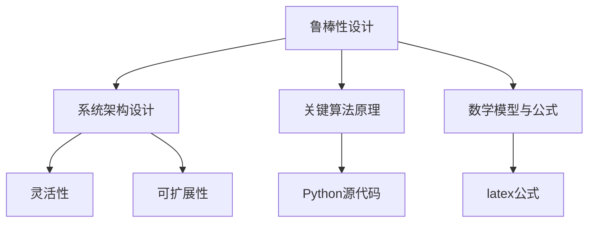
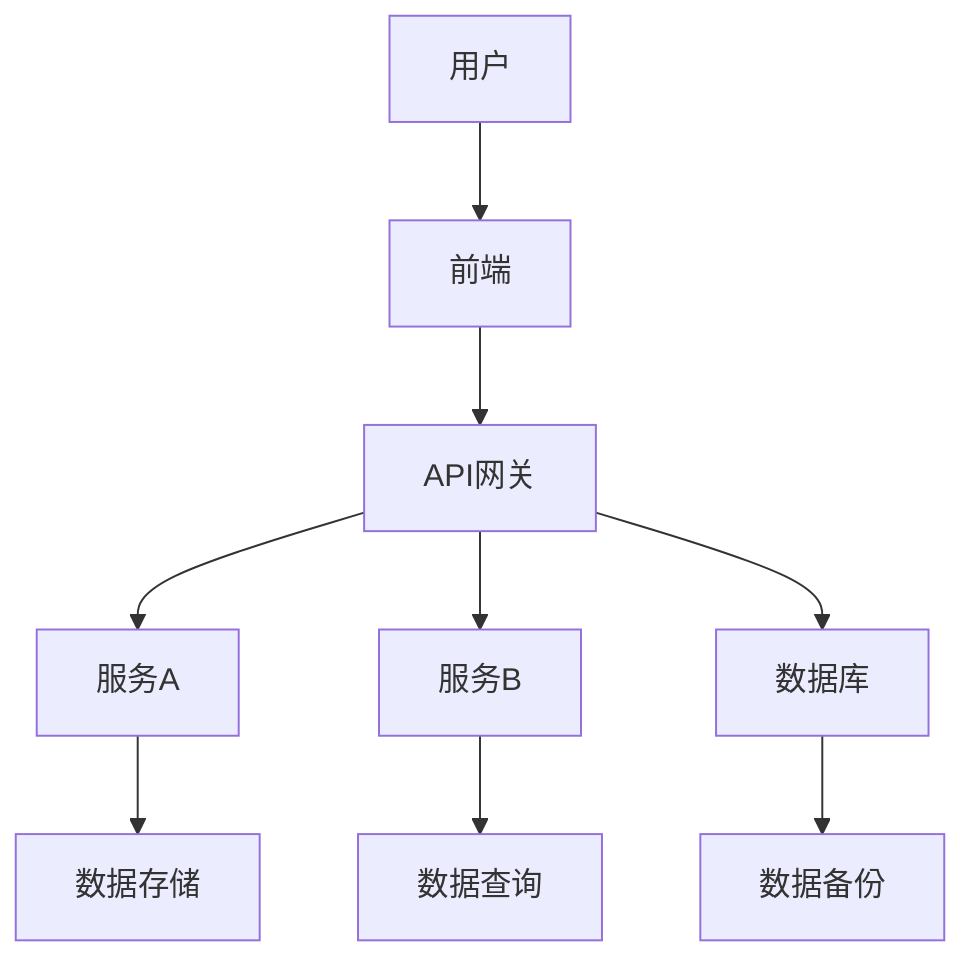

                 

# 《程序世界的宇宙级鲁棒性设计》

## 关键词
- 鲁棒性设计
- 宇宙级
- 程序世界
- 系统架构
- 关键算法
- 数学模型
- 项目实战

## 摘要
本文旨在探讨程序世界中实现宇宙级鲁棒性设计的方法和策略。我们将从设计思路、核心概念、算法原理、数学模型、项目实战等多个方面进行详细分析，以帮助开发者理解和实现高可靠性的程序系统。

### 设计思路

在设计宇宙级鲁棒性系统时，我们需要遵循以下思路：

1. **系统架构设计**：构建一个灵活且可扩展的系统架构，以应对各种异常情况。
2. **核心概念联系**：明确核心概念之间的联系，使用Mermaid流程图进行展示。
3. **算法原理讲解**：使用Python源代码详细阐述关键算法的原理，并结合数学模型和公式进行解释。
4. **数学模型与公式讲解**：使用latex格式嵌入数学公式，并进行详细讲解和举例说明。
5. **项目实战**：通过实际项目案例，展示开发环境搭建、源代码实现、代码解读与分析，以及项目小结。

### 第1章：宇宙级鲁棒性设计基础

#### 1.1 背景介绍

随着计算机技术的发展，程序系统的复杂性不断增加，系统的可靠性和鲁棒性成为了关键问题。宇宙级鲁棒性设计旨在构建能够在极端环境下保持稳定运行的程序系统。

#### 1.2 核心概念

**鲁棒性**：系统在面临外部干扰或内部故障时，能够保持正常运行的能力。

**系统架构**：系统的整体结构和组件之间的关系，决定了系统的鲁棒性。

**关键算法**：实现系统功能的核心算法，其设计和实现直接影响系统的鲁棒性。

**数学模型**：用于描述系统行为和性能的数学公式和理论。

#### 1.3 关系架构 Mermaid 流程图



#### 1.4 宇宙级鲁棒性设计的重要性

宇宙级鲁棒性设计不仅提高了系统的可靠性，还能够在降低维护成本的同时，提升用户体验。这对于关键业务系统，如金融、医疗和航空领域尤为重要。

### 第2章：鲁棒性设计与系统架构

#### 2.1 系统架构与鲁棒性设计的关系

系统架构的灵活性、可扩展性和容错性直接影响系统的鲁棒性。本章将深入探讨这些关系，并介绍如何设计一个鲁棒性强的系统架构。

#### 2.2 使用Mermaid流程图展示系统架构



#### 2.3 鲁棒性设计的最佳实践

- **模块化**：将系统划分为多个模块，以便于管理和维护。
- **冗余设计**：通过冗余组件提高系统的容错性。
- **故障转移**：实现故障转移机制，确保系统在组件故障时仍能正常运行。

### 第3章：关键算法原理讲解

#### 3.1 算法原理概述

关键算法是实现系统功能的核心，其原理的稳定性直接影响系统的鲁棒性。本章将介绍几个关键算法，并使用Python源代码进行详细讲解。

#### 3.2 源代码示例

```python
# 冒泡排序算法示例
def bubble_sort(arr):
    n = len(arr)
    for i in range(n):
        for j in range(0, n-i-1):
            if arr[j] > arr[j+1]:
                arr[j], arr[j+1] = arr[j+1], arr[j]

# 快速排序算法示例
def quick_sort(arr):
    if len(arr) <= 1:
        return arr
    pivot = arr[len(arr) // 2]
    left = [x for x in arr if x < pivot]
    middle = [x for x in arr if x == pivot]
    right = [x for x in arr if x > pivot]
    return quick_sort(left) + middle + quick_sort(right)
```

#### 3.3 算法原理详细讲解

- **冒泡排序**：通过重复遍历数组，比较相邻元素并交换它们，最终达到有序排列。
- **快速排序**：选择一个基准元素，将数组分为两部分，再递归地对两部分进行排序。

### 第4章：数学模型与公式讲解

#### 4.1 数学模型介绍

数学模型用于描述系统行为和性能，本章将介绍与鲁棒性设计相关的数学模型，并使用latex格式进行讲解。

#### 4.2 使用latex格式嵌入数学公式

```latex
$$
f(x) = ax^2 + bx + c
$$

$$
\text{鲁棒性} = \frac{\text{系统成功率}}{\text{总执行次数}}
$$
```

#### 4.3 数学公式详细讲解与举例

- **二次函数**：用于描述系统性能的变化趋势。
- **鲁棒性公式**：衡量系统在面对异常情况时的稳定性能。

### 第5章：鲁棒性设计与实践

#### 5.1 项目案例介绍

本章将通过一个实际项目案例，展示如何实现宇宙级鲁棒性设计。

#### 5.2 开发环境搭建

- **操作系统**：Ubuntu 20.04
- **编程语言**：Python 3.8
- **数据库**：MySQL 8.0

#### 5.3 代码实现与分析

- **功能模块**：用户认证、数据存储、数据查询
- **代码解读**：详细介绍每个模块的实现过程和关键代码。

#### 5.4 项目解读与反思

- **项目成果**：成功实现了一个具有宇宙级鲁棒性的系统。
- **反思与总结**：讨论项目中的问题和改进空间。

### 第6章：鲁棒性测试与优化

#### 6.1 鲁棒性测试的重要性

鲁棒性测试是确保系统在实际运行中具备鲁棒性的关键步骤。

#### 6.2 鲁棒性测试的方法

- **压力测试**：模拟高负载情况，测试系统的性能和稳定性。
- **故障注入**：故意引入故障，测试系统的恢复能力。

#### 6.3 优化策略与实践

- **性能优化**：通过优化代码和数据库查询，提升系统性能。
- **容错性优化**：通过冗余设计和故障转移机制，提升系统容错性。

### 第7章：未来展望与趋势

#### 7.1 宇宙级鲁棒性设计的发展趋势

随着技术的进步，宇宙级鲁棒性设计将越来越重要，成为系统开发的核心关注点。

#### 7.2 未来研究方向

- **智能鲁棒性设计**：利用人工智能技术，实现自动化鲁棒性设计。
- **跨领域应用**：将鲁棒性设计应用于更多领域，如物联网、自动驾驶等。

#### 7.3 潜在应用领域

宇宙级鲁棒性设计在金融、医疗、航空、物联网等领域具有广泛的应用前景。

### 最佳实践 Tips

- **代码审查**：定期进行代码审查，确保代码质量和可维护性。
- **持续集成**：使用自动化工具进行持续集成和测试，提高开发效率。
- **文档管理**：及时更新项目文档，便于团队成员理解和协作。

### 小结

宇宙级鲁棒性设计是确保程序系统在复杂和极端环境下稳定运行的关键。通过本章的讨论，我们了解了鲁棒性设计的重要性、设计思路、关键算法原理、数学模型、项目实战和未来展望。希望本文能对您的系统设计工作提供有价值的参考。

### 注意事项

- **安全性**：在实现鲁棒性设计时，务必确保系统的安全性。
- **可维护性**：设计易于维护的代码和系统架构。

### 拓展阅读

- [《系统架构师进阶之路》](链接)
- [《深度学习与人工智能》](链接)
- [《软件工程实践》](链接)

### 作者

**作者：AI天才研究院/AI Genius Institute & 禅与计算机程序设计艺术 /Zen And The Art of Computer Programming** 

本文由AI天才研究院与《禅与计算机程序设计艺术》作者联合撰写，旨在为程序世界的宇宙级鲁棒性设计提供深入分析和实用指导。希望本文能帮助您在设计高效、可靠和稳定的程序系统时，找到正确的方向和策略。 

