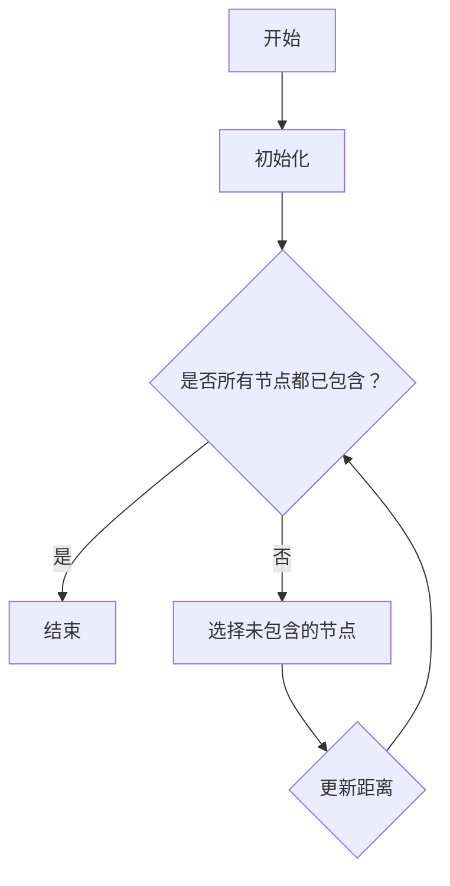
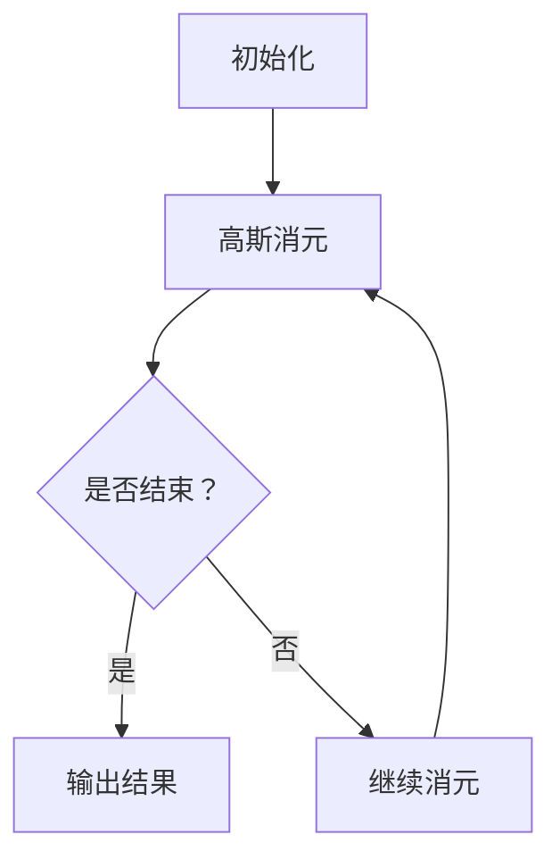
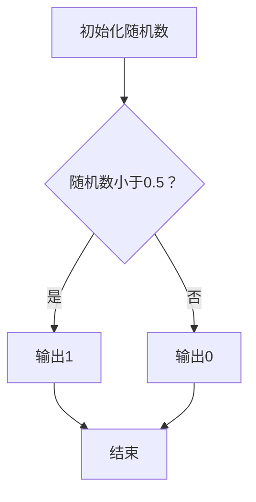

                 

### 《程序世界的数学基础探讨》

#### 关键词：
编程数学、算法、数据结构、线性代数、概率论、人工智能、机器学习

#### 摘要：
本文深入探讨了数学在程序世界中的基础性作用，通过系统性地介绍图论、线性代数、概率论等数学基础知识，结合Python源代码和LaTeX数学公式，详细讲解了这些理论在程序设计中的应用。文章旨在为读者提供一套全面而实用的数学工具，以提升编程效率和算法优化能力。通过具体项目案例和实战分析，读者可以更好地理解数学模型在实际编程中的应用，并掌握最佳实践技巧。

----------------------------------------------------------------

## 引言

### 1.1 程序世界的数学基础的重要性

在程序世界中，数学不仅仅是一门基础学科，更是构建高效、稳定和可靠软件的关键。无论是算法设计、数据结构优化，还是人工智能与机器学习，数学无处不在。数学提供了精确的描述方法、强大的推理工具以及优化的手段，使得程序能够更加高效地运行，更准确地处理复杂问题。

首先，数学在算法设计中扮演着核心角色。例如，算法复杂度的分析通常需要借助数学中的概率论和统计学方法。图论中的算法，如最短路径算法和最小生成树算法，广泛应用于网络路由、社交网络分析等领域。线性代数中的矩阵运算在图像处理和机器学习中的线性模型中有着广泛的应用。

其次，数据结构的设计和优化也依赖于数学基础。例如，哈希表的数据结构依赖于集合论和离散数学中的概念。而排序算法，如快速排序和归并排序，其效率分析依赖于数学中的比较复杂度理论。

最后，人工智能与机器学习的发展离不开数学的支持。机器学习中的模型构建、参数优化、预测和评估等步骤，都离不开数学工具的运用。例如，线性代数中的矩阵运算在神经网络模型中至关重要，概率论和统计学在决策树、随机森林等算法中得到了广泛应用。

### 1.2 数学在程序世界中的应用

数学在程序世界中的应用广泛而深远，主要体现在以下几个方面：

#### 数据结构与算法

- **图论**：图是程序设计中常用的数据结构，用于表示复杂网络关系。例如，社交网络中的用户关系可以用图表示，从而进行社交网络分析。
- **线性代数**：在图像处理和机器学习领域，线性代数的矩阵运算至关重要。例如，图像的变换、特征提取和降维等操作都需要线性代数的支持。
- **概率论**：概率论在算法分析中有着广泛的应用。例如，算法的平均时间复杂度和最坏情况下的时间复杂度分析通常需要概率论的帮助。

#### 图形学与图像处理

- **线性代数**：在图形学中，线性代数用于处理三维图形的变换，如旋转、缩放和平移。在图像处理中，矩阵运算用于图像的滤波和特征提取。
- **概率论**：概率论在图像识别和计算机视觉中有着广泛的应用。例如，通过概率模型，可以实现对图像中物体的高精度识别。

#### 人工智能与机器学习

- **线性代数**：在神经网络模型中，线性代数的矩阵运算用于权重矩阵的计算和更新。这使得神经网络能够自适应地学习输入数据的特征。
- **概率论**：在机器学习中，概率模型如贝叶斯网络和马尔可夫模型用于预测和决策。概率论也为评估和优化模型提供了重要的工具。

### 1.3 本书结构概述

本书分为三个主要部分：

- **第一部分：引言**，介绍数学在程序世界中的重要性以及数学在程序世界中的应用场景。
- **第二部分：理论探讨**，系统性地讲解图论、线性代数、概率论等数学基础知识，并通过Python源代码和LaTeX数学公式进行详细阐述。
- **第三部分：实践应用**，通过具体项目案例，讲解如何运用数学知识解决实际问题，并提供代码实现和解读。

## 第二部分 理论探讨

### 2.1 图论

#### 2.1.1 图的基本概念

图是由节点（或称为顶点）和边组成的集合。图可以用来表示实体之间的复杂关系。在程序设计中，图论提供了有效的工具来处理各种网络问题。

- **节点**：图中的每个元素，通常表示为一个顶点或节点。
- **边**：连接两个节点的线段，表示节点之间的某种关系。

在图论中，图可以用一个无序对集合 $ G = (V, E) $ 来表示，其中 $ V $ 是节点集合，$ E $ 是边集合。

#### 2.1.2 图的算法及应用

图的算法在程序设计中有着广泛的应用。以下是一些常用的图算法及其应用场景：

- **深度优先搜索（DFS）**：用于遍历图中的所有节点。例如，在社交网络中，可以通过DFS找到与某个用户有直接关系的所有用户。
- **广度优先搜索（BFS）**：用于找到图中的最短路径。例如，在地图导航中，可以通过BFS找到从起点到目的地的最短路径。
- **最短路径算法**：如Dijkstra算法和Floyd算法，用于计算图中两点之间的最短路径。例如，在网络路由中，这些算法用于计算数据包传输的最短路径。

#### 2.1.3 Mermaid流程图示例

Mermaid流程图是一种方便的图形工具，用于绘制流程图、UML图等。以下是一个Dijkstra算法的Mermaid流程图示例：



### 2.2 线性代数

#### 2.2.1 向量和矩阵

向量是具有大小和方向的量，通常表示为列向量。矩阵是一个二维数组，用于表示多个向量的组合。

- **向量**：表示为 $ \vec{v} = (v_1, v_2, ..., v_n) $，其中 $ v_i $ 是第 $ i $ 个分量。
- **矩阵**：表示为 $ A = [a_{ij}] $，其中 $ a_{ij} $ 是第 $ i $ 行第 $ j $ 列的元素。

#### 2.2.2 线性方程组和特征值

线性方程组是描述多个线性关系的一种数学工具。特征值和特征向量是矩阵的重要属性，用于描述矩阵的稳定性和方向。

- **线性方程组**：形如 $ Ax = b $ 的方程组，可以通过高斯消元法求解。
- **特征值和特征向量**：矩阵 $ A $ 的特征值 $ \lambda $ 和对应的特征向量 $ \vec{v} $ 满足 $ A\vec{v} = \lambda\vec{v} $。

#### 2.2.3 Mermaid流程图示例

以下是一个线性方程组求解过程的Mermaid流程图示例：



### 2.3 概率论

#### 2.3.1 概率的基本概念

概率论是描述随机现象规律的数学分支。概率的基本概念包括随机实验、样本空间和事件。

- **随机实验**：进行一次试验，可能产生多种结果。
- **样本空间**：所有可能结果的集合。
- **事件**：样本空间的一个子集。

#### 2.3.2 概率分布和随机变量

概率分布用于描述随机变量的取值概率。随机变量是定义在样本空间上的函数，用于描述随机实验的结果。

- **概率分布**：如离散概率分布和连续概率分布。
- **随机变量**：离散型随机变量和连续型随机变量。

#### 2.3.3 Mermaid流程图示例

以下是一个概率分布模拟的Mermaid流程图示例：



### 2.4 数学模型与算法

#### 2.4.1 伪代码示例

伪代码是描述算法过程的工具，用于简化算法的实现。

```python
def algorithm(input):
    # 初始化
    ...
    while not condition:
        # 执行操作
        ...
    return output
```

#### 2.4.2 数学公式详细讲解

数学公式用于描述算法中的数学模型。

$$
f(x) = \sum_{i=1}^{n} w_i x_i
$$

#### 2.4.3 举例说明

通过具体例子，说明算法的应用。

```python
# 示例：线性回归模型
# 输入：特征向量X和标签Y
# 输出：权重向量W

def linear_regression(X, Y):
    # 求解权重向量
    W = np.linalg.inv(X.T @ X) @ X.T @ Y
    return W
```

## 第三部分 实践应用

### 3.1 项目案例解析

#### 3.1.1 项目背景介绍

介绍项目的背景，如网络路由算法的应用场景。

#### 3.1.2 数学模型的运用

介绍项目中使用的数学模型，如最短路径算法。

#### 3.1.3 代码实现与解读

提供项目的源代码实现，并进行解读。

```python
# 示例：Dijkstra算法
def dijkstra(graph, start):
    # 初始化距离和前驱节点
    distances = {node: float('infinity') for node in graph}
    distances[start] = 0
    previous = {node: None for node in graph}

    # 主循环
    while distances are not finalized:
        # 选择未处理节点中的最短距离
        current = min_node(distances)

        # 更新邻居节点的距离
        for neighbor in graph[current]:
            distance = distances[current] + graph[current][neighbor]
            if distance < distances[neighbor]:
                distances[neighbor] = distance
                previous[neighbor] = current

    # 返回最短路径
    return distances, previous
```

#### 3.1.4 项目小结

总结项目的关键点和收获。

### 3.2 深入探讨

#### 3.2.1 复杂案例研究

分析更复杂的案例，如社交网络分析。

#### 3.2.2 数学模型的优化

讨论如何优化数学模型，提高算法性能。

#### 3.2.3 未来发展趋势

展望数学模型在程序世界中的应用前景。

## 附录

### 附录 A. 数学工具与资源

介绍常用的数学工具和在线资源。

### 附录 B. 开发环境搭建指南

提供开发环境的搭建指南。

---

### 作者

作者：AI天才研究院/AI Genius Institute & 禅与计算机程序设计艺术 /Zen And The Art of Computer Programming。

