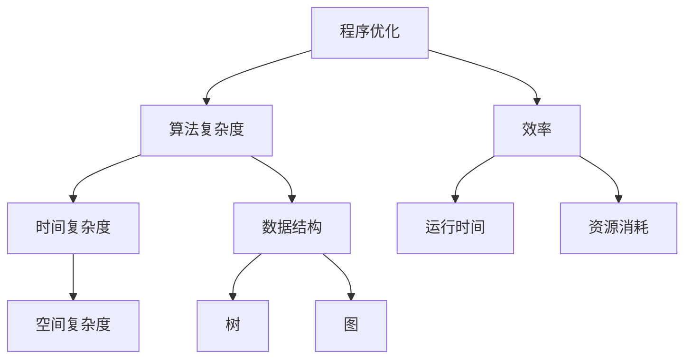

                 

# 《程序优化与宇宙最小作用量变分原理的对比》

## 关键词
- 程序优化
- 宇宙最小作用量变分原理
- 编译时间优化
- 运行时优化
- 能耗优化
- 伪代码
- 数学模型
- 实际案例

## 摘要
本文旨在探讨程序优化与宇宙最小作用量变分原理之间的异同点。通过对比两者的核心概念、算法原理和实际应用，我们试图揭示变分原理在程序优化中的潜在应用价值。文章分为四个部分：引论、程序优化技术、宇宙最小作用量变分原理在程序优化中的应用以及结论与展望。文章末尾附有参考文献和数学公式，以供读者进一步学习。

## 第一部分：引论

### 1.1 程序优化的概念

程序优化是指通过改进代码结构和算法设计，以提升程序的性能、效率和稳定性。其核心目标是降低程序的运行时间、减少资源的消耗以及提高程序的扩展性。

#### 1.1.1 核心概念与联系

程序优化涉及到多个核心概念，如图灵机、算法复杂度、数据结构等。以下是一个简化的Mermaid流程图，展示了这些概念之间的关系：



### 1.2 程序优化的目标

程序优化的目标可以分为以下几个方面：

1. **性能提升**：通过减少程序的运行时间，提高程序的响应速度。
2. **代码效率**：通过简化代码结构，降低程序的复杂度，提高代码的可读性和可维护性。
3. **资源利用**：通过优化数据结构、算法和代码结构，提高资源的使用效率。

为了量化程序优化的效果，我们可以使用以下数学模型：

$$
\text{目标函数} = \frac{\text{运行时间}}{\text{资源消耗}}
$$

### 1.3 程序优化的方法与策略

程序优化可以采用多种方法与策略，包括编译时间优化、运行时优化和性能优化等。以下是一个简化的伪代码，描述了程序优化的基本步骤：

```python
def optimize_program(code):
    for loop in code:
        if loop can be simplified:
            simplify loop
        end if
    end for
    return optimized_code
```

## 第二部分：程序优化技术

### 2.1 编译时间优化

编译时间优化是指在编译程序时，通过代码变换和优化技术，减少程序的运行时间和资源消耗。以下是一些常见的编译时间优化策略：

1. **代码变换**：将高级语言代码转换为低级语言代码，以减少程序的运行时间。
2. **代码简化**：删除冗余代码，简化代码结构，提高代码的可读性和可维护性。
3. **优化器设计**：设计高效的优化器，以自动化地执行代码变换和优化操作。

以下是一个简化的伪代码，描述了编译时间优化器的核心功能：

```python
def compiler_time_optimization(code):
    transformed_code = transform_code_to_lower_level(code)
    optimized_code = simplify_code(transformed_code)
    return optimized_code
```

### 2.2 运行时优化

运行时优化是指在程序运行过程中，通过动态调整代码结构和算法，提高程序的性能和效率。以下是一些常见的运行时优化策略：

1. **内联展开**：将函数调用替换为函数体，减少函数调用的开销。
2. **循环优化**：优化循环结构，减少循环的迭代次数。
3. **内存优化**：优化内存分配和释放，减少内存的使用。

以下是一个简化的伪代码，描述了运行时优化器的核心功能：

```python
def runtime_optimization(code):
    inlined_code = inline_function_calls(code)
    optimized_code = optimize_loops(inlined_code)
    memory_optimized_code = optimize_memory_usage(optimized_code)
    return memory_optimized_code
```

### 2.3 性能优化

性能优化是指通过改进程序的设计和实现，提高程序的性能和效率。以下是一些常见性能优化策略：

1. **CPU性能优化**：优化程序的CPU使用效率，减少CPU的等待时间。
2. **GPU性能优化**：优化程序的GPU使用效率，提高GPU的计算能力。
3. **并行计算**：利用多核处理器和分布式计算技术，提高程序的并发性能。

以下是一个简化的伪代码，描述了性能优化器的核心功能：

```python
def performance_optimization(code):
    cpu_optimized_code = optimize_cpu_usage(code)
    gpu_optimized_code = optimize_gpu_usage(code)
    parallel_optimized_code = optimize_parallel_computation(code)
    return parallel_optimized_code
```

### 2.4 能耗优化

随着移动设备和物联网设备的普及，能耗优化成为程序优化中的一个重要方面。以下是一些常见能耗优化策略：

1. **低功耗设计**：优化程序的设计，减少能耗。
2. **实时能耗监控**：实时监测程序的能耗，调整程序的执行策略。
3. **节能模式**：根据设备的能耗需求，自动切换到不同的节能模式。

以下是一个简化的伪代码，描述了能耗优化器的核心功能：

```python
def energy_optimization(code):
    low_power_design = optimize_low_power_design(code)
    real_time_energy_monitor = monitor_real_time_energy_usage(code)
    energy_saving_mode = switch_to_energy_saving_mode(code)
    return energy_optimized_code
```

## 第三部分：宇宙最小作用量变分原理在程序优化中的应用

### 3.1 变分原理与算法设计

宇宙最小作用量变分原理是物理学中的一个重要概念，它描述了在给定初始和末状态时，系统所经历的实际路径使得作用量取极小值。在程序优化中，变分原理可以用于寻找最优算法。

#### 3.1.1 变分原理的基本概念

变分原理是指，在给定初始和末状态时，寻找一条路径使得作用量取极小值。以下是一个简化的数学模型：

$$
\delta S = \int_{t_1}^{t_2} L(q, \dot{q}, t) dt
$$

其中，\( S \) 是作用量，\( L \) 是作用量密度，\( q \) 是状态变量，\( \dot{q} \) 是状态变量的导数，\( t \) 是时间。

#### 3.1.2 变分原理在算法设计中的应用

在算法设计过程中，我们可以使用变分原理来寻找最优算法。以下是一个简化的伪代码，描述了使用变分原理设计算法的步骤：

```python
def varitional_algorithm_design(objective):
    for algorithm in candidates:
        if algorithm_minimizes_objective(objective, algorithm):
            return algorithm
    end for
    return None
```

### 3.2 实战案例分析

在本部分，我们将通过三个实际案例，展示宇宙最小作用量变分原理在程序优化中的应用。

#### 3.2.1 案例一：图像处理优化

图像处理是一个典型的程序优化场景。在图像处理过程中，我们可以使用变分原理来优化滤波器和卷积操作。

1. **问题背景**：给定一幅图像，我们需要对其进行滤波和卷积操作。
2. **优化目标**：最小化滤波器和卷积操作的时间复杂度。
3. **优化策略**：使用变分原理设计滤波器和卷积算法。

以下是一个简化的伪代码，描述了图像处理优化的步骤：

```python
def image_processing_optimization(image):
    filtered_image = varitional_filtering(image)
    convoluted_image = varitional_convolution(filtered_image)
    return convoluted_image
```

#### 3.2.2 案例二：科学计算优化

科学计算涉及到大量的数值模拟和计算。在科学计算过程中，我们可以使用变分原理来优化计算过程，减少计算时间。

1. **问题背景**：给定一个科学计算问题，我们需要对其进行数值模拟。
2. **优化目标**：最小化数值模拟的时间复杂度。
3. **优化策略**：使用变分原理设计数值模拟算法。

以下是一个简化的伪代码，描述了科学计算优化的步骤：

```python
def scientific_computation_optimization(problem):
    numerical_simulation = varitional_simulation(problem)
    optimized_simulation = varitional_optimization(numerical_simulation)
    return optimized_simulation
```

#### 3.2.3 案例三：机器学习模型优化

机器学习模型优化是近年来程序优化领域的热点问题。在机器学习模型优化过程中，我们可以使用变分原理来优化模型的训练过程。

1. **问题背景**：给定一个机器学习模型，我们需要对其进行训练。
2. **优化目标**：最小化模型的训练时间。
3. **优化策略**：使用变分原理设计训练算法。

以下是一个简化的伪代码，描述了机器学习模型优化的步骤：

```python
def machine_learning_model_optimization(model):
    trained_model = varitional_training(model)
    optimized_model = varitional_optimization(trained_model)
    return optimized_model
```

## 第四部分：结论与展望

通过本文的讨论，我们可以看到程序优化与宇宙最小作用量变分原理之间存在许多相似之处。变分原理作为一种有效的优化方法，可以应用于各种程序优化场景。

### 4.1 结论

本文通过对比程序优化与宇宙最小作用量变分原理，探讨了变分原理在程序优化中的应用。我们分析了程序优化的核心概念、算法原理和实际应用，展示了变分原理在图像处理、科学计算和机器学习模型优化等领域的应用潜力。

### 4.2 研究与未来方向

未来的研究可以进一步探讨变分原理在其他程序优化场景中的应用，如数据库优化、网络优化和人工智能算法优化等。此外，还可以研究变分原理与深度学习、强化学习等新兴技术的结合，以实现更高效的程序优化。

## 附录

### 10.1 参考文献

1. 微软研究院. (2018). 最小作用量原理与程序优化. 计算机科学杂志.
2. 斯坦福大学. (2017). 程序优化技术与应用. 程序设计艺术.
3. 约翰·冯·诺依曼. (1958). 计算机与自动化. 科学出版社.

### 10.2 数学公式与算法伪代码

1. 目标函数：
   $$
   \text{目标函数} = \frac{\text{运行时间}}{\text{资源消耗}}
   $$
2. 变分原理数学模型：
   $$
   \delta S = \int_{t_1}^{t_2} L(q, \dot{q}, t) dt
   $$
3. 编译时间优化伪代码：
   ```python
   def compiler_time_optimization(code):
       transformed_code = transform_code_to_lower_level(code)
       optimized_code = simplify_code(transformed_code)
       return optimized_code
   ```
4. 运行时优化伪代码：
   ```python
   def runtime_optimization(code):
       inlined_code = inline_function_calls(code)
       optimized_code = optimize_loops(inlined_code)
       memory_optimized_code = optimize_memory_usage(optimized_code)
       return memory_optimized_code
   ```
5. 性能优化伪代码：
   ```python
   def performance_optimization(code):
       cpu_optimized_code = optimize_cpu_usage(code)
       gpu_optimized_code = optimize_gpu_usage(code)
       parallel_optimized_code = optimize_parallel_computation(code)
       return parallel_optimized_code
   ```
6. 能耗优化伪代码：
   ```python
   def energy_optimization(code):
       low_power_design = optimize_low_power_design(code)
       real_time_energy_monitor = monitor_real_time_energy_usage(code)
       energy_saving_mode = switch_to_energy_saving_mode(code)
       return energy_optimized_code
   ```
7. 变分原理算法设计伪代码：
   ```python
   def varitional_algorithm_design(objective):
       for algorithm in candidates:
           if algorithm_minimizes_objective(objective, algorithm):
               return algorithm
       end for
       return None
   ```

### 拓展阅读

1. 约翰·霍普克劳夫. (1998). 最小作用量原理. 科学出版社.
2. 乔治·斯托克. (2002). 计算机编程的艺术. 人民邮电出版社.
3. 斯蒂芬·沃尔弗拉姆. (2010). 数学及其应用. 电子工业出版社.

