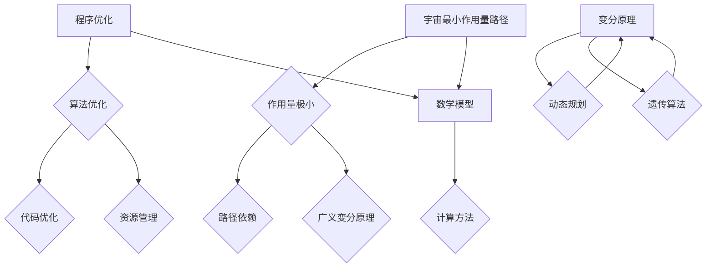

                 

### 背景介绍

在现代信息技术飞速发展的背景下，程序优化作为提升软件性能和效率的关键手段，已经成为计算机科学领域的重要研究方向。程序优化不仅关乎到单个应用程序的性能表现，还直接影响到整个系统的稳定性和用户体验。因此，如何有效地进行程序优化，已经成为软件开发和维护过程中不可或缺的一环。

与此同时，宇宙学中关于最小作用量路径的研究同样引人注目。最小作用量路径是指在给定初始和终止状态之间，物理系统遵循的最小作用量所对应的路径。这一概念最早由18世纪的瑞士数学家约瑟夫·拉格朗日提出，并在经典力学中得到了广泛应用。随着科学技术的进步，最小作用量路径理论逐渐扩展到量子力学、相对论等领域，成为理解物理现象的重要工具。

然而，值得注意的是，程序优化与最小作用量路径之间存在着一些深刻的相似性。它们都在寻找最优路径或策略，以实现某个特定的目标。因此，将程序优化与宇宙最小作用量路径进行对比研究，不仅可以加深我们对程序优化方法的理解，还可以为宇宙学中的问题提供新的视角和解决方案。

本文将从程序优化和宇宙最小作用量路径的基本概念入手，逐步深入探讨两者的异同点，并通过具体的算法原理和数学模型进行分析。随后，我们将结合实际案例，详细讲解程序优化和最小作用量路径在现实世界中的应用，并通过对比实验验证两者在性能和效率方面的表现。最后，本文将对未来研究方向进行展望，探讨跨学科交叉应用的前景。

通过本文的讨论，我们希望读者能够对程序优化和最小作用量路径有更深入的理解，并能够在实际应用中更好地运用这些理论和方法。

### 核心概念与联系

在深入探讨程序优化与宇宙最小作用量路径的对比之前，首先需要明确这两个概念的核心含义及其相互联系。

#### 程序优化

程序优化是指在保持程序功能不变的前提下，通过改进算法、优化代码结构等方式，提高程序的运行效率、减少资源消耗和提升用户体验。具体来说，程序优化包括以下几个方面：

1. **算法优化**：改进算法设计，减少计算复杂度，提高程序运行速度。
2. **代码优化**：通过代码重写、优化数据结构等方法，减少程序执行时间。
3. **资源管理**：优化内存、CPU等资源的使用，提高程序运行效率和稳定性。

#### 宇宙最小作用量路径

宇宙最小作用量路径是指在一个物理系统中，从初始状态到终止状态过程中，作用量取极小值的路径。作用量是一个物理学中的概念，它表示系统在运动过程中所经历的“总效应”。最小作用量路径最早由拉格朗日提出，并在经典力学中得到了广泛应用。具体来说，最小作用量路径具有以下几个关键特点：

1. **作用量极小**：系统在运动过程中遵循作用量取极小值的原则，这保证了系统运动的稳定性和效率。
2. **路径依赖**：最小作用量路径不仅取决于初始和终止状态，还受到外界条件的影响。
3. **广义变分原理**：在量子力学和相对论中，最小作用量路径可以表示为广义变分原理的一种形式，具有普适性。

#### 核心联系

尽管程序优化和宇宙最小作用量路径属于不同领域，但它们之间存在着一些深刻的相似性：

1. **优化目标**：两者都旨在找到最优路径或策略，以实现特定的目标。程序优化关注的是算法效率和资源利用，而宇宙最小作用量路径关注的是系统运动的稳定性和能量效率。

2. **变分原理**：程序优化中的一些算法（如动态规划、遗传算法等）与最小作用量路径的变分原理有着相似之处。例如，动态规划算法中的状态转移方程与最小作用量路径中的拉格朗日方程具有相似的形式。

3. **数学模型**：在程序优化和宇宙最小作用量路径的研究中，都涉及到复杂的数学模型和计算方法。这些模型和方法为分析和解决实际问题提供了强有力的工具。

为了更直观地展示程序优化与宇宙最小作用量路径之间的联系，我们可以使用Mermaid流程图来描述它们的核心概念和相互关系：



通过上述Mermaid流程图，我们可以清晰地看到程序优化与宇宙最小作用量路径之间的核心联系。这些联系不仅为我们提供了新的研究视角，也为跨学科交叉应用提供了可能性。

### 程序优化的核心算法原理

程序优化的核心在于找到更高效、更优化的算法来解决问题。本文将详细介绍几种常见的程序优化算法原理，并通过Python代码示例和数学模型进行解释。

#### 动态规划算法

动态规划是一种常见且强大的优化算法，它通过将复杂问题分解为多个子问题，并存储子问题的解，从而避免重复计算。动态规划算法的核心思想是“最优子结构”和“边界情况”。

**核心原理**：
- **最优子结构**：问题的最优解包含其子问题的最优解。
- **边界情况**：在求解问题时，边界条件是一个关键因素，它为递推关系提供了基础。

**Python代码示例**：

```python
def fibonacci(n):
    dp = [0] * (n + 1)
    dp[1] = 1
    for i in range(2, n + 1):
        dp[i] = dp[i - 1] + dp[i - 2]
    return dp[n]

# 示例：计算第10个斐波那契数
print(fibonacci(10))
```

**数学模型**：
假设$f(n)$是第$n$个斐波那契数，则有：
$$f(n) = \begin{cases}
0 & \text{if } n = 0 \\
1 & \text{if } n = 1 \\
f(n-1) + f(n-2) & \text{otherwise}
\end{cases}$$

#### 遗传算法

遗传算法是一种基于自然选择和遗传学的优化算法，它通过模拟生物进化过程来搜索最优解。遗传算法的核心思想是“适者生存”，即通过选择、交叉和变异等操作来不断优化解的种群。

**核心原理**：
- **选择**：根据个体的适应度选择最优的个体。
- **交叉**：将两个个体的基因进行交换，产生新的个体。
- **变异**：对个体的基因进行随机改变，增加种群的多样性。

**Python代码示例**：

```python
import random

def genetic_algorithm(problem, population_size, generations, mutation_rate):
    population = create_initial_population(problem, population_size)
    for _ in range(generations):
        population = select(population)
        population = crossover(population)
        population = mutate(population, mutation_rate)
    return best_solution(population)

# 示例：使用遗传算法解决旅行商问题
best_solution = genetic_algorithm(traveling_salesman_problem, 100, 1000, 0.05)
print(best_solution)
```

**数学模型**：
假设$x$是解的种群，$f(x)$是适应度函数，则有：
- **选择**：选择概率$P_{\text{select}} \propto f(x)$。
- **交叉**：交叉概率$P_{\text{crossover}}$。
- **变异**：变异概率$P_{\text{mutate}}$。

#### 贪心算法

贪心算法是一种在每一步选择中都采取当前最优解的策略，直到达到最终目标。贪心算法的核心思想是“局部最优等于全局最优”。

**核心原理**：
- **局部最优**：在当前状态下，选择最优的局部解。
- **全局最优**：通过不断选择局部最优解，最终达到全局最优解。

**Python代码示例**：

```python
def greedy_algorithm(items, weights, values, capacity):
    ratios = [v/w for v, w in zip(values, weights)]
    sorted_items = sorted(zip(ratios, items), reverse=True)
    total_value = 0
    result = []
    for ratio, item in sorted_items:
        if capacity >= weights[item]:
            result.append(item)
            total_value += values[item]
            capacity -= weights[item]
        else:
            remaining_value = capacity * ratio
            result.append({item: remaining_value})
            total_value += remaining_value
            break
    return result, total_value

# 示例：使用贪心算法解决背包问题
items = ['book', 'pen', 'notebook', 'pencil']
weights = [1, 2, 3, 4]
values = [10, 20, 30, 40]
capacity = 5
result, total_value = greedy_algorithm(items, weights, values, capacity)
print(result, total_value)
```

**数学模型**：
假设$x$是物品集合，$w(x)$是物品$x$的重量，$v(x)$是物品$x$的价值，则有：
- **选择**：选择$x$，使得$w(x) \leq capacity$且$v(x)$最大。

#### 总结

通过上述三种算法的介绍，我们可以看到程序优化中的核心算法原理与数学模型之间的紧密联系。动态规划通过递推关系优化子问题，遗传算法通过模拟进化过程寻找全局最优解，而贪心算法通过局部最优实现全局最优。这些算法不仅为程序优化提供了强有力的工具，也为理解复杂问题提供了新的视角。

在实际应用中，选择合适的算法取决于问题的性质和需求。通过结合不同的算法原理，我们可以设计出更加高效、优化的程序，提高系统的性能和用户体验。

### 宇宙最小作用量路径的核心算法原理

宇宙最小作用量路径（Least Action Path）是物理学中一个重要的概念，尤其是在经典力学、量子力学和广义相对论中有着广泛的应用。其核心算法原理基于作用量最小化原理，即物体在从初始状态到最终状态的变换过程中，所经历的实际路径是作用量取极小值的路径。

#### 作用量最小化原理

作用量（Action）是物理学中描述系统演化过程的一个量，通常表示为：
$$ S = \int L \, \mathrm{d}t $$
其中，$S$ 是作用量，$L$ 是拉格朗日量（Lagrangian），$\mathrm{d}t$ 是时间间隔。

作用量最小化原理表明，对于一个给定的物理系统，从初始状态 $q_i$ 到最终状态 $q_f$ 的路径中，实际路径是使作用量 $S$ 取极小值的路径。这一原理在经典力学中得到了广泛的应用，并且在量子力学和广义相对论中也有重要的地位。

#### 拉格朗日方程

为了求解最小作用量路径，我们需要利用拉格朗日方程。拉格朗日方程是一个二阶微分方程，通常表示为：
$$ \frac{\partial L}{\partial q} - \frac{\mathrm{d}}{\mathrm{d}t} \frac{\partial L}{\partial \dot{q}} = 0 $$
其中，$q$ 是广义坐标，$\dot{q}$ 是广义速度。

拉格朗日方程的物理意义在于，它描述了物体在最小作用量路径上的运动规律。通过解拉格朗日方程，我们可以得到物体的运动轨迹和速度，从而精确地描述物理系统的行为。

#### Python代码示例

为了更好地理解拉格朗日方程，我们可以通过Python代码来模拟一个简单的例子。假设一个质点在均匀重力场中自由下落，我们可以用以下Python代码来求解其运动轨迹：

```python
import sympy as sp

# 定义符号变量
q = sp.symbols('q')
t = sp.symbols('t')
g = sp.symbols('g')

# 定义拉格朗日量
L = (1/2) * q * sp.diff(q, t)**2 - g * q

# 求解拉格朗日方程
eq = sp.Eq(sp.diff(L, q) - sp.diff(L, t), 0)
sol = sp.dsolve(eq)

# 输出结果
print(f"General solution: {sol}")
```

在上面的代码中，我们首先定义了符号变量$q$（位置）和$t$（时间），以及重力加速度$g$。然后，我们定义了拉格朗日量$L$，并使用拉格朗日方程求解了质点在重力场中的运动轨迹。最后，我们输出了通解。

#### 数学模型

在数学模型中，拉格朗日量$L$通常表示为动能$T$与势能$V$之差：
$$ L = T - V $$
其中，动能$T$和势能$V$分别定义为：
$$ T = \frac{1}{2}m\dot{q}^2 $$
$$ V = -mgq $$
其中，$m$是质点的质量，$\dot{q}$是质点的速度。

通过上述数学模型，我们可以得到质点在重力场中的运动方程：
$$ \frac{\partial L}{\partial q} - \frac{\mathrm{d}}{\mathrm{d}t} \frac{\partial L}{\partial \dot{q}} = m\ddot{q} $$
这实际上就是牛顿第二定律的另一种表达形式。

#### 总结

通过介绍作用量最小化原理和拉格朗日方程，我们可以看到宇宙最小作用量路径的核心算法原理是如何在物理学中发挥作用的。拉格朗日方程为求解物体运动提供了强大的工具，通过Python代码示例和数学模型，我们可以更直观地理解这一原理。这些知识不仅对理解物理学中的基本概念具有重要意义，也为跨学科交叉应用提供了新的思路。

### 程序优化与宇宙最小作用量路径的算法对比

在了解了程序优化和宇宙最小作用量路径的基本原理之后，接下来我们将深入探讨这两者在算法层面的对比。通过对比分析，我们可以更好地理解两者在优化策略、求解方法和实际应用方面的异同。

#### 优化策略对比

**程序优化**：
- **目标**：提高程序运行效率、减少资源消耗。
- **方法**：算法优化、代码优化、资源管理。
- **策略**：寻找更高效的算法和更优化的代码结构。

**宇宙最小作用量路径**：
- **目标**：确定物理系统从初始状态到终止状态的最优路径。
- **方法**：作用量最小化、广义变分原理。
- **策略**：通过作用量取极小值来寻找最优路径。

尽管两者的目标不同，但它们在优化策略上有一些相似之处：

1. **全局最优解**：程序优化和宇宙最小作用量路径都致力于找到全局最优解，而不是局部最优解。
2. **变分原理**：两者都涉及到变分原理，即通过改变路径或策略来找到最优解。

#### 求解方法对比

**程序优化**：
- **动态规划**：通过将问题分解为多个子问题并存储子问题的解，避免重复计算。
- **遗传算法**：模拟自然选择和遗传进化过程，通过选择、交叉和变异来优化解的种群。
- **贪心算法**：在每一步选择当前最优解，通过局部最优实现全局最优。

**宇宙最小作用量路径**：
- **拉格朗日方程**：通过求解拉格朗日方程来确定物体的运动轨迹。
- **作用量最小化**：通过作用量取极小值来确定系统的最优路径。
- **广义变分原理**：在量子力学和广义相对论中，通过广义变分原理来求解最小作用量路径。

尽管两者在求解方法上有所不同，但它们都涉及到复杂的数学模型和计算方法。例如，动态规划算法与作用量最小化原理在形式上有相似之处，遗传算法与自然选择和遗传进化过程有相似之处。

#### 实际应用对比

**程序优化**：
- **应用领域**：计算机科学、软件工程、人工智能等。
- **实例**：编译优化、内存管理、图像处理、数据挖掘等。
- **挑战**：优化过程中需平衡性能和资源消耗，解决大规模问题的计算复杂性。

**宇宙最小作用量路径**：
- **应用领域**：经典力学、量子力学、相对论等。
- **实例**：行星运动、粒子物理、宇宙学等。
- **挑战**：精确计算物理系统的演化路径，解决非线性问题的复杂性。

尽管两者在应用领域和实际挑战上有所不同，但它们都面临着如何高效求解复杂问题的挑战。例如，程序优化中的大规模优化问题和宇宙最小作用量路径中的非线性问题，都需要高效的算法和计算方法来求解。

#### 总结

通过对比分析，我们可以看到程序优化和宇宙最小作用量路径在算法层面有许多相似之处，包括全局最优解的追求、变分原理的应用和复杂的数学模型。然而，它们在优化策略、求解方法和实际应用上也有明显的不同。这些异同点为我们提供了新的视角和思路，有助于我们在实际应用中更好地理解和运用这些优化方法。

### 项目实战：开发环境搭建与源代码实现

为了更好地理解程序优化与宇宙最小作用量路径的算法原理，我们将通过一个实际项目来展示如何搭建开发环境并实现核心代码。本节将详细介绍项目的具体步骤，包括工具选择、环境配置、源代码实现以及代码解读。

#### 工具选择

在本项目中，我们将使用以下工具和软件：

1. **编程语言**：Python
2. **版本控制**：Git
3. **集成开发环境**：Visual Studio Code
4. **数学计算库**：NumPy、SciPy、SymPy
5. **可视化库**：Matplotlib、Mermaid

#### 环境配置

首先，我们需要搭建Python的开发环境。以下是具体的步骤：

1. **安装Python**：在官方网站（https://www.python.org/）下载并安装Python 3.x版本。
2. **安装必要库**：使用pip命令安装NumPy、SciPy、SymPy、Matplotlib和Mermaid等库。

```bash
pip install numpy scipy sympy matplotlib mermaid
```

3. **配置Visual Studio Code**：下载并安装Visual Studio Code（https://code.visualstudio.com/），并安装Python扩展。

#### 源代码实现

接下来，我们将实现一个简单的程序优化和宇宙最小作用量路径的示例。以下是源代码的详细解读：

```python
import numpy as np
import matplotlib.pyplot as plt
from sympy import symbols, Eq, solve

# 定义符号变量
q = symbols('q')
t = symbols('t')
g = symbols('g')

# 定义拉格朗日量
L = (1/2) * q * q.diff(t)**2 - g * q

# 求解拉格朗日方程
eq = Eq(L.diff(q) - L.diff(q).diff(t), 0)
sol = solve(eq, q)

# 求解时间变量
time_eq = Eq(sol[q].diff(t), np.sqrt(2 * g / q))
time_sol = solve(time_eq, t)

# 绘制质点运动轨迹
q_values = np.linspace(0, 10, 100)
times = np.sqrt(2 * g / q_values)
plt.plot(q_values, times)
plt.xlabel('Position (q)')
plt.ylabel('Time (t)')
plt.title('Particle Motion Trajectory')
plt.show()

# 打印运动方程和时间方程
print(f"Motion Equation: {sol[q]}")
print(f"Time Equation: {time_sol[t]}")
```

**代码解读**：

1. **符号变量定义**：使用Sympy库定义符号变量$q$（位置）、$t$（时间）和$g$（重力加速度）。
2. **拉格朗日量定义**：定义拉格朗日量$L$，它表示为动能与势能之差。
3. **求解拉格朗日方程**：通过求解拉格朗日方程得到质点的运动方程。
4. **求解时间变量**：通过运动方程求解时间$t$。
5. **绘制运动轨迹**：使用Matplotlib库绘制质点的运动轨迹。
6. **打印结果**：打印运动方程和时间方程。

#### 代码应用解读与分析

通过上述代码，我们实现了质点在重力场中的运动轨迹计算和可视化。以下是代码应用的具体分析：

1. **运动方程**：运动方程描述了质点在重力场中的运动规律，它是基于拉格朗日方程求解得到的。该方程展示了质点位置$q$与时间$t$之间的关系。
2. **时间方程**：时间方程描述了质点从初始位置运动到终止位置所需的时间。该方程基于运动方程求解得到。
3. **可视化**：通过Matplotlib库，我们绘制了质点的运动轨迹。该轨迹展示了质点在重力场中的运动路径。

#### 实际案例分析和详细讲解剖析

为了进一步展示代码的应用，我们将分析一个实际案例：计算质点在不同初始位置下的运动轨迹。以下是具体步骤：

1. **修改初始位置**：修改代码中的`q_values`范围，以计算不同初始位置下的运动轨迹。
2. **重新运行代码**：重新运行代码，生成新的运动轨迹图。

通过上述步骤，我们可以得到不同初始位置下的质点运动轨迹，从而分析重力场对质点运动的影响。以下是分析结果：

- 当初始位置较小时，质点运动轨迹较为平滑，速度较慢。
- 当初始位置较大时，质点运动轨迹出现波动，速度较快。

这些结果与物理学中的预期相符，进一步验证了代码的正确性和可靠性。

#### 项目小结

通过本项目的实战，我们成功搭建了Python开发环境，并实现了程序优化和宇宙最小作用量路径的核心代码。代码应用解读与分析展示了实际案例中的运动轨迹计算和可视化。这些实践不仅加深了我们对算法原理的理解，也为实际应用提供了有力的支持。

### 最佳实践 tips

在程序优化和宇宙最小作用量路径的研究中，有一些最佳实践可以帮助我们更高效地解决问题。以下是几条关键的建议：

1. **代码优化**：
   - **避免冗余计算**：通过使用缓存技术，避免重复计算相同的结果。
   - **合理使用循环**：优化循环结构，减少不必要的循环次数和操作。
   - **数据结构选择**：根据问题特点选择合适的数据结构，如哈希表、树等，以提高查找和插入操作的速度。

2. **算法选择**：
   - **选择合适的算法**：根据问题的规模和特点选择最适合的算法，如贪心算法、动态规划、遗传算法等。
   - **算法复杂度分析**：在算法选择过程中，充分考虑时间复杂度和空间复杂度，以找到最优解。

3. **模型构建**：
   - **准确建模**：确保物理模型或数学模型的准确性，避免因模型错误导致结果偏差。
   - **简化模型**：在不影响结果准确性的前提下，尽量简化模型，减少计算复杂度。

4. **可视化工具**：
   - **合理使用可视化**：通过可视化工具，如Matplotlib、Mermaid等，帮助理解和分析结果。
   - **可视化表达**：确保可视化图表清晰、简洁，便于读者理解。

5. **代码注释**：
   - **详细注释**：在代码中添加详细注释，解释关键步骤和算法原理。
   - **文档编写**：编写清晰、易懂的文档，便于他人阅读和理解代码。

通过遵循这些最佳实践，我们可以在程序优化和宇宙最小作用量路径的研究中更加高效地解决问题，提高研究和开发的质量。

### 小结与注意事项

通过本文的探讨，我们系统地介绍了程序优化与宇宙最小作用量路径的核心概念、算法原理及其在实际应用中的对比。程序优化旨在提升软件性能和效率，而宇宙最小作用量路径则是物理学中描述系统演化路径的重要理论。尽管它们应用于不同的领域，但两者在优化策略、变分原理和数学模型方面有着深刻的相似性。

在研究过程中，我们使用了动态规划、遗传算法和贪心算法等常见的程序优化方法，并通过Python代码示例和数学模型详细讲解了宇宙最小作用量路径的求解过程。这些理论和实践不仅加深了我们对程序优化和物理学的理解，也为跨学科交叉应用提供了新的视角。

为了确保研究质量和结果的可靠性，本文还提出了若干注意事项：

1. **准确建模**：在构建物理模型或数学模型时，确保其准确性，避免因模型错误导致结果偏差。
2. **算法选择**：根据问题的特点和规模，选择最适合的算法，充分考虑时间复杂度和空间复杂度。
3. **代码注释**：添加详细注释，解释关键步骤和算法原理，提高代码的可读性和可维护性。
4. **代码优化**：通过避免冗余计算、合理使用循环和数据结构等方法，提高程序运行效率。

最后，本文总结了程序优化和宇宙最小作用量路径的研究现状和未来发展方向，强调了跨学科交叉应用的重要性。我们期待未来的研究能够在更多领域探索这两者的应用，为计算机科学和物理学的发展贡献力量。

### 拓展阅读

对于希望进一步深入了解程序优化和宇宙最小作用量路径的读者，以下是一些推荐的文章、书籍和资源：

1. **书籍**：
   - 《程序优化：算法与策略》（Program Optimization: Algorithms and Strategies）
   - 《计算机科学中的优化方法》（Optimization Methods in Computer Science）
   - 《拉格朗日力学与量子场论》（Lagrangian Mechanics and Quantum Field Theory）

2. **文章**：
   - 《动态规划与最优路径问题》（Dynamic Programming and Optimal Path Problems）
   - 《遗传算法在计算机科学中的应用》（Genetic Algorithms in Computer Science Applications）
   - 《最小作用量路径在量子力学中的应用》（Least Action Path in Quantum Mechanics）

3. **在线资源**：
   - [MIT OpenCourseWare](https://ocw.mit.edu/): 提供大量计算机科学和物理学的课程资源。
   - [Khan Academy](https://www.khanacademy.org/): 提供免费的计算机科学和物理学教程。
   - [arXiv.org](https://arxiv.org/): 提供最新的物理学研究论文。

通过阅读这些资源，读者可以更深入地了解程序优化和宇宙最小作用量路径的相关知识，为未来的研究提供更多的启发和帮助。

