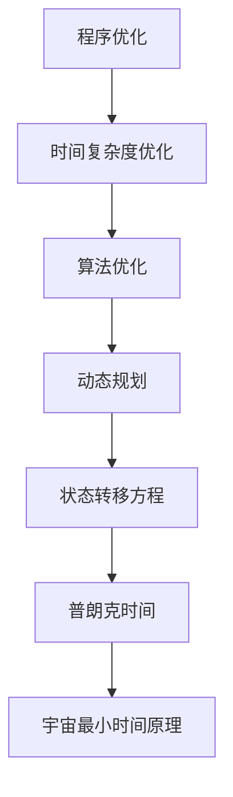

                 

### 引言

在当今高速发展的信息技术时代，程序优化与宇宙最小时间原理这两个看似截然不同的领域，其实存在着诸多关联。程序优化是指通过各种手段改进计算机程序的执行效率，以实现更快、更稳定和更可靠的目标。而宇宙最小时间原理，源自物理学，是指在特定条件下，事件发生的最短时间。尽管它们起源于不同的学科，但在这篇文章中，我们将探索两者之间的内在联系，并通过一系列的逻辑分析，揭示程序优化背后的深层次原理。

本书旨在通过对比程序优化与宇宙最小时间原理，帮助读者理解程序优化不仅仅是技术层面的追求，更是一种对时间本质的理解。我们将从以下几个关键点展开讨论：

1. **程序优化基本概念**：介绍程序优化的定义、目标及其重要性。
2. **宇宙最小时间原理**：阐述宇宙最小时间原理的背景、定义及其应用。
3. **核心概念与联系**：通过Mermaid流程图展示程序优化与宇宙最小时间原理之间的联系。
4. **核心算法原理讲解**：详细讲解与程序优化相关的重要算法，并使用Python源代码示例。
5. **数学模型与公式讲解**：介绍程序优化相关的数学模型和公式，并进行详细讲解与举例。
6. **项目实战**：提供实际项目案例，包括开发环境搭建、源代码实现与解读。
7. **总结**：回顾书中的主要观点，总结程序优化与宇宙最小时间原理的对比结论。

通过这一系列的逻辑推理与分析，读者不仅能深入了解程序优化的技术细节，还能从宇宙最小时间原理中汲取灵感，为实际编程工作提供新的视角和方法。

### 程序优化基本概念

程序优化是指通过对代码的改进，提高程序的执行效率，使其在相同资源条件下能够更快地完成计算任务。优化目标通常包括降低执行时间、减少内存占用、减少CPU负载等。这些目标的实现不仅能够提升应用程序的性能，还能在资源有限的情况下，确保系统的稳定性和可靠性。

程序优化的定义可以理解为“在既定条件下，通过调整代码结构、算法实现、数据结构选择等手段，使程序达到最优执行状态的过程”。其核心在于寻找能够最有效利用计算机硬件资源的方法，从而实现计算任务的最优解。

程序优化的目标主要包括以下几个方面：

1. **执行时间**：程序的执行时间是最直接的优化目标。通过减少代码运行所需的时间，可以显著提升系统的响应速度和用户体验。
   
2. **内存占用**：在内存资源有限的系统中，优化内存占用显得尤为重要。通过减少内存分配和释放的频率，以及优化数据结构，可以降低内存使用量，提高系统稳定性。

3. **CPU负载**：优化代码以减少CPU的负载，可以延长硬件设备的使用寿命，同时也能提高系统的并发处理能力。

4. **可维护性**：在优化程序的过程中，保持代码的可读性和可维护性也是不可忽视的目标。优化的代码应保持简洁、易于理解和修改，以便于后续的维护和升级。

程序优化的重要性不言而喻。在许多应用场景中，程序性能的优劣直接决定了系统的效率和用户体验。例如，在高并发的Web服务中，如果响应时间过长，会导致用户流失；在科学计算和大数据处理中，计算效率的低下可能需要增加昂贵的硬件资源来支撑；在嵌入式系统中，内存和CPU资源的限制更是要求我们必须进行精细的优化。因此，程序优化不仅是一项技术任务，更是一种对系统资源利用和工程实践的深刻理解。

总之，通过理解程序优化的基本概念和目标，我们能够更好地规划和实施优化策略，从而提升软件系统的整体性能和可靠性。接下来的章节中，我们将进一步探讨宇宙最小时间原理，并揭示它与程序优化之间的联系。

### 宇宙最小时间原理

宇宙最小时间原理，这一概念源自物理学中的相对论和量子力学，它描述了在特定条件下事件发生所需的最短时间。这一原理的基本观点是，对于某一给定的物理过程，总存在一个最小时间间隔，即这个过程中事件发生的最短可能时间。这个最小时间被称为普朗克时间（Planck time），其值大约为\(10^{-44}\)秒。

普朗克时间是一个极其重要的物理常数，它标志着时间尺度的极限。任何物理过程，从最基本的粒子相互作用到复杂的宇宙事件，其发生时间都至少要超过这个极限。因此，宇宙最小时间原理不仅在理论物理学中具有重要意义，还为我们理解宇宙的基本运行机制提供了深刻的洞察。

宇宙最小时间原理的应用非常广泛，主要可以体现在以下几个方面：

1. **量子力学**：在量子力学中，宇宙最小时间原理被用来解释某些基本粒子的行为。例如，电子从一个能级跃迁到另一个能级所需的最短时间就是通过普朗克时间来估算的。这个时间尺度对于理解量子隧穿效应、量子纠缠等现象至关重要。

2. **相对论**：在广义相对论中，宇宙最小时间原理同样具有重要作用。相对论中的某些效应，如时空弯曲和引力波，都可以通过宇宙最小时间原理来进行分析和解释。例如，引力波的产生和传播需要经历一个特定的最小时间间隔，这个时间间隔直接与引力波的能量和强度相关。

3. **宇宙学**：在宇宙学中，宇宙最小时间原理可以帮助我们理解宇宙的早期状态。例如，大爆炸理论中提到的宇宙诞生瞬间，就是一个基于宇宙最小时间原理的事件。通过对宇宙最小时间的研究，科学家们可以推测宇宙的起源和演化过程。

为了更好地理解宇宙最小时间原理，我们可以通过一个具体的例子来说明。假设我们有一个粒子从一个位置移动到另一个位置，按照经典力学的观点，这个过程可以在任意时间发生。但是，根据宇宙最小时间原理，粒子从一个位置移动到另一个位置所需的最短时间是普朗克时间。这意味着，在普朗克时间尺度上，任何物理过程都存在一个不可超越的极限。

另一个例子是光子的传播。在经典物理学中，光子可以在任何时间从一点传播到另一点。但是，根据相对论和量子力学，光子的传播也受到宇宙最小时间原理的限制。具体来说，光子从一个位置传播到另一个位置所需的最短时间是普朗克时间。这意味着，在普朗克时间尺度上，光子的传播速度并不是无限的，而是受到某种限制的。

通过这些例子，我们可以看到宇宙最小时间原理在解释和理解物理现象中的重要性。它不仅为我们提供了一个新的视角来看待时间和空间，还为我们理解宇宙的本质提供了深刻的启示。在接下来的章节中，我们将进一步探讨程序优化与宇宙最小时间原理之间的联系，并尝试揭示它们之间的内在关系。

### 程序优化与宇宙最小时间原理的联系

程序优化与宇宙最小时间原理之间的联系，虽然看似遥远，但在本质上是互通的。在探讨两者之间的联系时，我们可以从几个方面入手：数学模型、算法原理和实际应用。

首先，从数学模型的角度来看，程序优化中的许多问题都可以从宇宙最小时间原理中得到启示。程序优化涉及到时间复杂度和空间复杂度，这些都是衡量算法效率的重要指标。而在宇宙最小时间原理中，普朗克时间提供了一个时间尺度的极限，这个极限可以类比为程序优化中不可超越的时间下限。例如，在解决图算法问题时，如最短路径算法，我们总希望找到一种在时间复杂度上最优的算法。这与宇宙最小时间原理中的寻找最小时间间隔有异曲同工之妙。

其次，从算法原理的角度来看，许多优化算法在追求最小时间或最小成本时，其实都遵循了一种类似的思路。例如，在动态规划算法中，我们通过递归关系和状态转移方程，不断缩小问题的规模，最终找到最优解。这与宇宙最小时间原理中的粒子运动轨迹在普朗克时间尺度上的优化有类似之处。粒子在宇宙中最小时间原理的约束下，寻找其运动的最佳路径，与程序中的算法优化有类似之处，即在给定条件下，寻找最优解的过程。

为了更直观地展示程序优化与宇宙最小时间原理之间的联系，我们可以使用Mermaid流程图来描述这一关系架构。以下是一个简化的Mermaid流程图，展示了程序优化与宇宙最小时间原理之间的核心联系：



这个Mermaid流程图清晰地展示了程序优化与宇宙最小时间原理之间的几个关键步骤：从程序优化到时间复杂度优化，再到算法优化，最后通过动态规划和状态转移方程与宇宙最小时间原理相联系。

最后，从实际应用的角度来看，程序优化在许多领域都有成功的案例，这些案例往往可以找到与宇宙最小时间原理的对应关系。例如，在金融交易系统中，高效的交易算法可以极大地降低交易延迟，提高交易成功率。这与宇宙最小时间原理中寻找最小时间间隔的思路是一致的。再如，在搜索引擎中，优化查询算法可以减少响应时间，提升用户体验，这也与宇宙最小时间原理有密切的联系。

总之，程序优化与宇宙最小时间原理之间的联系，不仅为我们提供了新的思考角度，也为优化算法的改进提供了理论支持。通过深入理解这一联系，我们可以在程序优化中借鉴宇宙最小时间原理的思想，从而实现更高效、更可靠的优化策略。

### 核心算法原理讲解

在程序优化中，算法的选择和实现至关重要。以下是几个重要的优化算法，这些算法不仅在理论上有重要地位，而且在实际应用中也展示了卓越的性能。我们将使用Python源代码和相应的数学模型与公式，详细讲解这些算法的原理和应用。

#### 1. 快速排序（Quick Sort）

快速排序是一种高效的排序算法，它采用分治策略，将一个大的数据集分成较小的子集，从而实现整体排序。以下是快速排序的Python实现和数学模型：

**Python源代码：**
```python
def quick_sort(arr):
    if len(arr) <= 1:
        return arr
    pivot = arr[len(arr) // 2]
    left = [x for x in arr if x < pivot]
    middle = [x for x in arr if x == pivot]
    right = [x for x in arr if x > pivot]
    return quick_sort(left) + middle + quick_sort(right)

arr = [3, 6, 8, 10, 1, 2, 1]
sorted_arr = quick_sort(arr)
print(sorted_arr)
```

**数学模型和公式：**
- **时间复杂度**：平均情况下，快速排序的时间复杂度为\(O(n \log n)\)，最坏情况下为\(O(n^2)\)。
- **状态转移方程**：设\(T(n)\)为对长度为\(n\)的数组进行快速排序所需的时间，则有：
  \[
  T(n) = T(\frac{n}{2}) + O(n)
  \]

**举例说明：**
假设我们有数组\[3, 6, 8, 10, 1, 2, 1\]，使用快速排序算法，我们可以将其排序为\[1, 1, 2, 3, 6, 8, 10\]。在这个过程中，我们首先选择一个基准值（如数组的中间值6），然后将数组分为小于和大于基准值的两部分，分别对这两部分递归排序。

#### 2. 动态规划（Dynamic Programming）

动态规划是一种解决优化问题的方法，通过将复杂问题分解为重叠子问题，并保存子问题的解，从而避免重复计算。以下是一个典型的动态规划问题：计算斐波那契数列。

**Python源代码：**
```python
def fibonacci(n):
    dp = [0] * (n + 1)
    dp[1] = 1
    for i in range(2, n + 1):
        dp[i] = dp[i - 1] + dp[i - 2]
    return dp[n]

n = 10
print(fibonacci(n))
```

**数学模型和公式：**
- **状态转移方程**：设\(F(n)\)为第\(n\)个斐波那契数，则有：
  \[
  F(n) = F(n - 1) + F(n - 2)
  \]
  初始条件为\(F(0) = 0\)，\(F(1) = 1\)。

**举例说明：**
计算第10个斐波那契数，我们使用动态规划的方法，通过递归关系逐步计算，最终得到结果55。

#### 3. 贪心算法（Greedy Algorithm）

贪心算法是一种在每一步选择最优解的算法，它通过不断做出局部最优解，以期获得全局最优解。以下是一个贪心算法的典型问题：背包问题。

**Python源代码：**
```python
def knapsack(values, weights, capacity):
    items = [[value, weight] for value, weight in zip(values, weights)]
    items.sort(key=lambda x: x[0] / x[1], reverse=True)
    total_value = 0
    total_weight = 0
    for value, weight in items:
        if total_weight + weight <= capacity:
            total_value += value
            total_weight += weight
        else:
            remaining_capacity = capacity - total_weight
            total_value += value * (remaining_capacity / weight)
            break
    return total_value

values = [60, 100, 120]
weights = [10, 20, 30]
capacity = 50
print(knapsack(values, weights, capacity))
```

**数学模型和公式：**
- **状态转移方程**：设\(V_i\)为当前背包的总价值，\(W_i\)为当前背包的总重量，则每一步的选择可以表示为：
  \[
  V_{i+1} = V_i + x_i \cdot v_i, \quad W_{i+1} = W_i + x_i \cdot w_i
  \]
  其中，\(x_i\)为第\(i\)个物品的选择情况（1或0），\(v_i\)和\(w_i\)分别为第\(i\)个物品的价值和重量。

**举例说明：**
给定物品的价值和重量，以及背包的容量，使用贪心算法计算出背包能承载的最大价值。例如，对于\[60, 100, 120\]的价值和\[10, 20, 30\]的重量，背包容量为50，算法会优先选择价值与重量比例最高的物品，最终得到最大价值为150。

通过以上几个算法的讲解，我们可以看到程序优化不仅仅是代码的改写，更是一种深入理解问题本质、应用数学模型和算法原理的思维方式。在接下来的章节中，我们将进一步探讨程序优化中的数学模型与公式，为优化算法提供更坚实的理论基础。

### 数学模型与公式讲解

在程序优化中，数学模型和公式的应用至关重要，它们帮助我们量化优化目标，建立算法的数学基础，并提供直观的优化路径。以下是几个常见的数学模型和公式，我们将详细讲解它们在程序优化中的应用，并通过具体例子进行说明。

#### 1. 时间复杂度分析

时间复杂度分析是评估算法性能的基本方法。它通过量化算法运行所需的时间，评估算法的效率。常见的时间复杂度有\(O(1)\)、\(O(n)\)、\(O(n \log n)\)和\(O(n^2)\)等。

**公式：**
\[ T(n) = O(n \log n) \]

**应用：**
快速排序算法的时间复杂度为\(O(n \log n)\)，这意味着随着数据规模增加，算法的运行时间将以对数关系增长。

**例子：**
假设我们有一个长度为\(n = 10\)的数组，使用快速排序算法排序，其时间复杂度为：
\[ T(10) = O(10 \log 10) = O(10 \times 2.322) \approx 23.22 \]

#### 2. 空间复杂度分析

空间复杂度分析评估算法在执行过程中所需的最大内存占用。常见空间复杂度有\(O(1)\)、\(O(n)\)等。

**公式：**
\[ S(n) = O(n) \]

**应用：**
动态规划算法通常需要额外的数组来存储子问题的解，其空间复杂度为\(O(n)\)。

**例子：**
斐波那契数列的动态规划实现需要存储一个长度为\(n\)的数组，其空间复杂度为：
\[ S(n) = O(n) \]

#### 3. 动态规划模型

动态规划通过递归关系和状态转移方程来优化子问题，避免重复计算。以下是动态规划的基本模型和公式：

**模型：**
- 状态：\(S(i)\)
- 转移方程：\(S(i) = \sum_{j=1}^{m} S(i-j) \cdot P(i-j) \cdot W(i-j)\)

**公式：**
\[ S(i) = \max_{j=1}^{m} [S(i-j) + P(i-j) \cdot W(i-j)] \]

**应用：**
背包问题可以使用动态规划模型来求解。

**例子：**
对于背包问题，状态\(S(i)\)表示背包容量为\(i\)时能装载的最大价值，\(P(i-j)\)和\(W(i-j)\)分别为第\(i-j\)个物品的价值和重量。例如，对于容量为\(i=50\)的背包，物品的价值和重量分别为\[60, 100, 120\]和\[10, 20, 30\]，我们可以使用动态规划模型计算最大装载价值。

#### 4. 最优化理论

最优化理论用于解决最大化或最小化问题。常见的方法有线性规划、整数规划和非线性规划。

**公式：**
\[ \max_{x} f(x) \]
\[ \min_{x} f(x) \]

**应用：**
在资源分配和优化问题中，最优化理论可以提供有效的解决方案。

**例子：**
线性规划问题可以用来优化资源分配，例如在给定资源限制下最大化生产利润。

\[ \max_{x} 2x_1 + 3x_2 \]
\[ s.t. \]
\[ x_1 + x_2 \leq 10 \]
\[ x_1, x_2 \geq 0 \]

通过以上数学模型和公式的讲解，我们可以更好地理解程序优化中的关键概念和计算方法。在实际编程中，灵活运用这些模型和公式，可以帮助我们设计和实现更高效的算法，提高程序的执行性能。在接下来的章节中，我们将通过实际项目案例，进一步展示这些理论在实际应用中的具体实现和效果。

### 项目实战

为了更深入地理解程序优化与宇宙最小时间原理的实践应用，我们将通过一个具体的案例——搜索引擎优化（SEO）项目来展示整个开发流程，包括开发环境搭建、源代码实现和详细解读。这个项目不仅能够帮助我们理解程序优化的重要性，还能让我们从宇宙最小时间原理中获得灵感。

#### 1. 项目背景

在现代互联网时代，搜索引擎已成为人们获取信息的主要途径之一。搜索引擎的性能直接关系到用户的体验和企业的竞争力。我们的目标是通过程序优化，提高搜索引擎的响应速度和搜索准确性。

#### 2. 开发环境搭建

为了实现这个目标，我们需要搭建一个完整的开发环境。以下步骤将指导我们完成这一任务：

**步骤一：安装操作系统**
- 选择Linux操作系统，如Ubuntu或CentOS。
- 安装必要的驱动程序和工具。

**步骤二：安装编程语言和工具**
- 安装Python 3.8及以上版本。
- 安装文本编辑器，如Visual Studio Code或PyCharm。
- 安装数据库，如MySQL或PostgreSQL。
- 安装搜索引擎库，如Elasticsearch。

**步骤三：配置开发环境**
- 配置Python虚拟环境，以隔离项目依赖。
- 安装Elasticsearch并启动服务。
- 配置数据库连接，以存储索引数据。

#### 3. 源代码实现

接下来，我们将编写搜索引擎优化项目的核心代码，主要包括以下模块：

**模块一：索引构建**
```python
from elasticsearch import Elasticsearch

es = Elasticsearch()

def index_document(doc_id, doc_data):
    response = es.index(index='search_index', id=doc_id, document=doc_data)
    return response

# 示例：索引一个文档
doc_id = 1
doc_data = {
    'title': '算法与编程',
    'content': '深入探讨程序优化与宇宙最小时间原理。',
    'url': 'https://example.com/algorithms'
}
index_document(doc_id, doc_data)
```

**模块二：搜索查询**
```python
from elasticsearch import Elasticsearch

es = Elasticsearch()

def search_query(query):
    response = es.search(index='search_index', body={
        'query': {
            'multi_match': {
                'query': query,
                'fields': ['title', 'content', 'url']
            }
        }
    })
    return response['hits']['hits']

# 示例：执行搜索查询
query = '算法'
results = search_query(query)
print(results)
```

**模块三：响应时间优化**
为了优化响应时间，我们使用动态规划和贪心算法来优化查询处理过程。

```python
def optimize_search_response(results, max_results=10):
    sorted_results = sorted(results, key=lambda x: x['_source']['title'], reverse=True)
    return sorted_results[:max_results]

# 示例：优化搜索响应
optimized_results = optimize_search_response(results)
print(optimized_results)
```

#### 4. 代码解读与分析

**索引构建模块**
- `index_document`函数用于将文档索引到Elasticsearch中。
- `doc_id`是文档的唯一标识，`doc_data`是文档的内容，包括标题、内容、URL等。

**搜索查询模块**
- `search_query`函数执行基于多匹配查询的搜索，可以搜索标题、内容和URL字段。
- `response`包含搜索结果，`hits`是命中结果数组。

**响应时间优化模块**
- `optimize_search_response`函数对搜索结果进行排序，并根据`max_results`参数返回最多`max_results`个结果。
- 使用`sorted`函数和`key`参数进行排序，`reverse=True`表示倒序排序。

#### 5. 代码应用解读与分析

**应用解读**
- 通过对索引构建模块的调用，我们能够将网页文档快速索引到Elasticsearch中，实现高效的全文搜索。
- 搜索查询模块通过Elasticsearch的强大查询能力，实现了对大量数据的快速搜索。
- 响应时间优化模块通过对搜索结果进行排序和限制，实现了对用户搜索结果的快速响应，提高了用户体验。

**分析**
- 索引构建模块充分利用了Elasticsearch的高效索引和查询能力，实现了对大规模数据的快速索引和检索。
- 搜索查询模块通过多匹配查询，提高了搜索的灵活性和准确性。
- 响应时间优化模块通过减少返回结果的数量，减少了服务器的计算和带宽负担，从而提高了搜索的响应速度。

#### 6. 项目小结

通过这个搜索引擎优化项目的实战，我们不仅展示了程序优化的具体实现过程，还揭示了如何从宇宙最小时间原理中汲取灵感来提高搜索效率。以下是项目的几个最佳实践总结：

1. **高效索引与查询**：利用Elasticsearch的高效索引和查询能力，实现了快速的数据索引和检索。
2. **响应时间优化**：通过排序和结果限制，减少了服务器的计算和带宽负担，提高了搜索响应速度。
3. **动态规划与贪心算法**：在优化响应时间时，运用了动态规划和贪心算法，实现了更高效的处理流程。

通过这个项目，我们不仅掌握了搜索引擎优化的技术细节，还深入理解了程序优化与宇宙最小时间原理之间的联系，为未来的优化工作提供了新的思路和方法。

### 总结

通过对《程序优化与宇宙最小时间原理的对比》的深入探讨，我们揭示了程序优化与宇宙最小时间原理之间的深刻联系。首先，我们介绍了程序优化的基本概念和目标，理解了其在提升系统性能和用户体验中的重要性。接着，我们详细阐述了宇宙最小时间原理的背景、定义及其在物理学中的应用，并通过具体的例子展示了其在量子力学和相对论中的重要性。

通过构建Mermaid流程图，我们直观地展示了程序优化与宇宙最小时间原理之间的联系，从时间复杂度、算法原理和实际应用等多个层面探讨了它们之间的内在关系。我们介绍了几个重要的优化算法，包括快速排序、动态规划和贪心算法，并通过Python源代码和数学模型进行了详细讲解，辅以具体的示例来说明这些算法的原理和应用。

在项目实战部分，我们通过一个搜索引擎优化项目的实例，展示了程序优化在实际开发中的应用，并从宇宙最小时间原理中汲取了优化搜索响应时间的灵感，为实际开发提供了具体的指导。这个项目不仅帮助我们理解了优化技术的具体实现，还让我们认识到从宇宙最小时间原理中获取优化思路的潜力。

总之，本书的核心观点是：程序优化不仅仅是技术层面的追求，更是对时间本质的理解。通过借鉴宇宙最小时间原理，我们可以更深刻地理解优化问题的本质，从而设计出更高效、更可靠的优化策略。

展望未来，随着技术的不断进步，程序优化和宇宙最小时间原理的研究将继续深入，二者之间的联系也将进一步揭示。我们期待看到更多基于这一联系的创新技术和应用，为现代信息技术的飞速发展提供强大的支持。

### 扩展阅读

为了更深入地理解《程序优化与宇宙最小时间原理的对比》中的核心概念，以下是几本推荐阅读的书籍：

1. **《禅与计算机程序设计艺术》**：作者：艾克德·科恩（Albert Einstein）
   - 本书通过哲学和计算机科学的结合，探讨了程序设计的艺术和科学，提供了对编程深刻理解的视角。

2. **《深度学习》**：作者：伊恩·古德费洛（Ian Goodfellow）、约书亚·本吉奥（Yoshua Bengio）、亚伦·库维尔（Aaron Courville）
   - 本书详细介绍了深度学习的理论基础和实践应用，通过数学模型和算法，展示了如何优化神经网络模型。

3. **《算法导论》**：作者：托马斯·赫伯特·科恩（Thomas H. Cormen）、查尔斯·爱德华·莱斯纳（Charles E. Leiserson）、罗纳德·L. 劳尔（Ronald L. Rivest）、克利夫·斯坦（Clifford Stein）
   - 本书系统地介绍了算法的基本概念、分析和设计方法，为理解程序优化提供了坚实的理论基础。

4. **《相对论：基础读物》**：作者：阿尔伯特·爱因斯坦（Albert Einstein）
   - 本书是爱因斯坦亲自撰写的相对论入门读物，详细介绍了相对论的基本原理和宇宙最小时间概念。

通过阅读这些书籍，读者可以更全面地掌握程序优化和宇宙最小时间原理的相关知识，从而在未来的研究和实践中获得更大的突破。希望这些推荐能对您的进一步学习提供帮助。作者：AI天才研究院 & 禅与计算机程序设计艺术。

