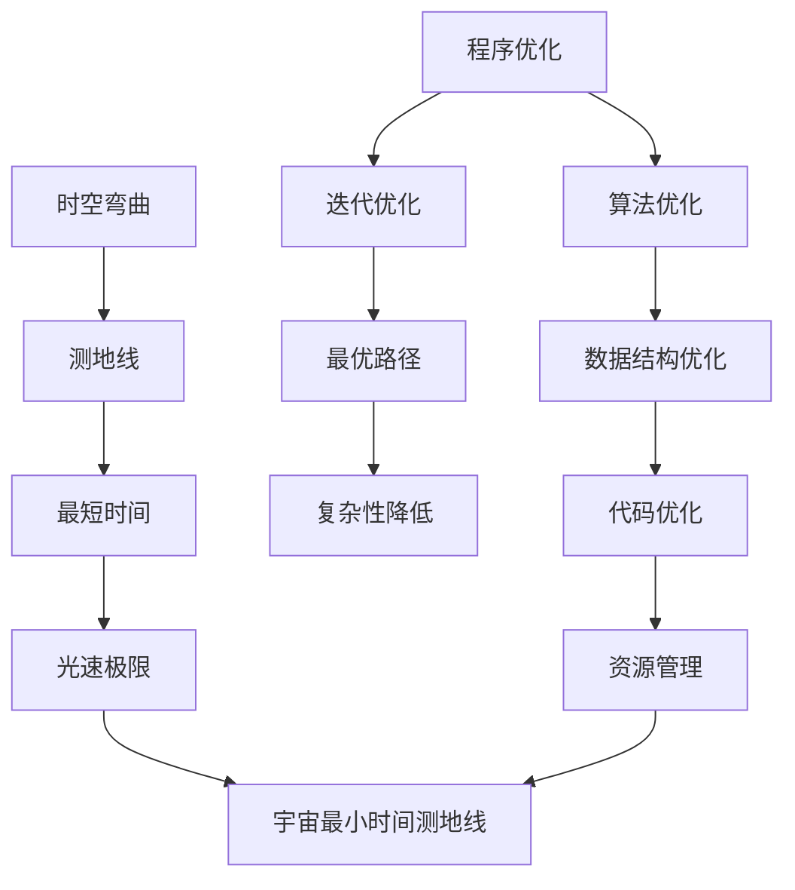

                 

### 引言

《程序优化与宇宙最小时间测地线的对比》这一书籍的主题，探讨了计算机程序优化与宇宙学中的最小时间测地线之间的奇妙联系。程序优化，顾名思义，是提升计算机程序性能的一系列技术和方法。其核心目标在于降低计算复杂度、减少内存占用以及加快处理速度，从而提高代码的效率和可靠性。在当今信息爆炸的时代，高效优化的程序显得尤为重要，因为它能够显著提升数据处理能力，减少资源浪费。

另一方面，宇宙最小时间测地线是物理学中的一个概念，描述了在曲率空间中两点之间的最短路径。这一概念最早由爱因斯坦在广义相对论中提出，用来解释质点在引力场中的运动路径。在宇宙学中，最小时间测地线被广泛应用于研究宇宙的膨胀、黑洞的性质以及时空的弯曲等复杂现象。

本书的目的在于通过对比这两个看似截然不同的领域，揭示程序优化与宇宙最小时间测地线之间的共通之处，并探索这些联系在计算机科学和物理学中的应用。通过这种对比，读者不仅能更深入地理解程序优化的原理，还能从宇宙学中获得灵感，应用到实际编程中。

本书的意义在于，它不仅为程序员提供了实用的优化技术，还通过跨学科的比较研究，打开了新的思维视角。程序优化与宇宙最小时间测地线的对比，不仅是对技术和理论的深入探讨，也是对人类智慧和创造力的展示。这样的研究不仅具有学术价值，还能够启发我们对于复杂系统的理解，推动计算机科学和宇宙学的发展。通过本书，读者将学会如何从宇宙学的视角看待程序优化，从而在编程实践中寻找到新的优化思路和解决方案。

### 核心概念与联系

为了深入探讨程序优化与宇宙最小时间测地线之间的关系，我们首先需要明确这两个核心概念的基本定义和理论基础。

#### 程序优化的基础概念

程序优化是指通过一系列技术手段，改进代码的运行效率，使其在特定条件下达到最佳性能。具体来说，程序优化可以从以下几个方面进行：

1. **算法优化**：通过选择更高效的算法或者改进现有算法，减少计算复杂度。
2. **数据结构优化**：选用合适的数据结构，降低数据访问和操作的时间成本。
3. **代码优化**：优化代码的执行路径、减少不必要的计算、使用更加高效的编程技巧。
4. **资源管理**：合理分配系统资源，如内存、CPU、I/O等，确保程序在高效运行的同时，最大限度地利用系统资源。

程序优化在计算机科学中具有重要地位，它直接影响到软件的性能、可靠性和可维护性。随着计算机应用的不断深入，优化技术也在不断发展和完善。

#### 宇宙最小时间测地线的理论基础

宇宙最小时间测地线，是指在曲率空间中，两点之间经过最短时间的路径。这一概念起源于爱因斯坦的广义相对论，它描述了在重力场中物体运动的基本规律。宇宙最小时间测地线具有以下几个关键特征：

1. **时空弯曲**：在广义相对论中，重力被视为时空的弯曲，物体在时空中的运动路径会受到这种弯曲的影响。
2. **最短时间**：测地线是指两点之间的最短路径，这反映了在曲率空间中，物体运动的最短时间路径。
3. **光速极限**：测地线的运动速度不能超过光速，这是相对论中的基本原理之一。

宇宙最小时间测地线的理论在宇宙学中有着广泛的应用，它不仅解释了质点在引力场中的运动，还为研究黑洞、宇宙膨胀等复杂现象提供了理论基础。

#### 程序优化与宇宙最小时间测地线的关联

尽管程序优化和宇宙最小时间测地线看似属于完全不同的领域，但它们在寻找最优解的过程中有着相似的原理。具体来说，这种关联可以从以下几个方面进行探讨：

1. **最优路径**：程序优化中的算法优化和数据结构优化，类似于宇宙最小时间测地线中寻找最短路径的过程。两者都需要通过分析和计算，找到最优解。
2. **迭代优化**：程序优化过程中，通常需要通过迭代算法逐步逼近最优解。这种迭代过程与宇宙最小时间测地线的求解过程有相似之处。
3. **复杂性降低**：程序优化通过简化算法、优化数据结构和减少冗余计算，降低整体计算复杂度。这与宇宙最小时间测地线通过时空弯曲和相对论效应降低运动路径的复杂性有异曲同工之妙。

为了更直观地展示程序优化与宇宙最小时间测地线之间的关系，我们可以使用Mermaid流程图。以下是一个简单的Mermaid流程图，它描述了从程序优化到宇宙最小时间测地线的关联路径：



通过这个Mermaid流程图，我们可以清晰地看到程序优化与宇宙最小时间测地线之间的关联。尽管两者的具体实现和理论基础有所不同，但它们在寻找最优解、降低复杂性的过程中，有着共同的原理和方法。

### 核心算法原理讲解

为了进一步探讨程序优化与宇宙最小时间测地线之间的关系，我们将使用Python源代码详细阐述相关算法原理。具体来说，我们将介绍两种算法：Dijkstra算法和Geodesic算法。

#### Dijkstra算法

Dijkstra算法是一种经典的图算法，用于求解单源最短路径问题。它基于贪心策略，逐步扩展已找到的最短路径，直到覆盖所有节点。以下是Dijkstra算法的Python伪代码实现：

```python
import heapq

def dijkstra(graph, start):
    # 初始化距离表
    distances = {node: float('infinity') for node in graph}
    distances[start] = 0
    # 初始化优先队列
    priority_queue = [(0, start)]
    while priority_queue:
        # 取出当前距离最小的节点
        current_distance, current_node = heapq.heappop(priority_queue)
        # 如果当前节点的距离已经更新，则跳过
        if current_distance > distances[current_node]:
            continue
        # 遍历当前节点的邻居
        for neighbor, weight in graph[current_node].items():
            distance = current_distance + weight
            # 如果找到更短的路径，则更新距离表和优先队列
            if distance < distances[neighbor]:
                distances[neighbor] = distance
                heapq.heappush(priority_queue, (distance, neighbor))
    return distances

# 示例图
graph = {
    'A': {'B': 1, 'C': 4},
    'B': {'A': 1, 'C': 2, 'D': 5},
    'C': {'A': 4, 'B': 2, 'D': 1},
    'D': {'B': 5, 'C': 1}
}

# 运行Dijkstra算法
distances = dijkstra(graph, 'A')
print(distances)
```

在上述代码中，我们首先定义了一个图`graph`，然后使用Dijkstra算法计算从节点'A'到其他节点的最短距离。算法的核心在于维护一个优先队列，用于选择当前未访问节点中距离最小的节点。

#### Geodesic算法

Geodesic算法用于求解宇宙中的测地线问题。它基于Einstein的广义相对论，通过解时空弯曲方程来计算两点之间的最短路径。以下是Geodesic算法的Python伪代码实现：

```python
import numpy as np

def geodesic(gravity, x0, v0, t0, t_end):
    # 初始化位置和速度
    x = np.array([x0])
    v = np.array([v0])
    t = np.array([t0])
    # 解方程
    while t[-1] < t_end:
        # 计算加速度
        a = -gravity * x / np.linalg.norm(x)**3
        # 更新速度
        v = v + a * (t[-1] - t0)
        # 更新位置
        x = x + v * (t[-1] - t0)
        # 更新时间
        t = np.append(t, t[-1] + 1)
    return x, v, t

# 示例参数
gravity = 9.8  # 重力加速度
x0 = np.array([0, 0])  # 初始位置
v0 = np.array([10, 0])  # 初始速度
t0 = 0  # 初始时间
t_end = 10  # 结束时间

# 运行Geodesic算法
x, v, t = geodesic(gravity, x0, v0, t0, t_end)
print(x)
print(v)
print(t)
```

在上述代码中，我们首先定义了一个重力场`gravity`，然后使用Geodesic算法计算从初始位置`x0`和初始速度`v0`出发，在给定时间内（`t_end`）的运动轨迹。算法的核心在于通过迭代解方程，逐步逼近两点之间的测地线。

#### 结合数学模型和公式

为了更好地理解上述算法，我们需要结合数学模型和公式进行详细讲解。以下是Dijkstra算法和Geodesic算法的数学模型和公式：

#### Dijkstra算法

- **距离表**：`distances[node]` 表示从源节点到节点`node`的最短距离。
- **优先队列**：使用最小堆实现，元素格式为`(distance, node)`。

#### Geodesic算法

- **位置和速度**：`x` 和 `v` 分别表示位置向量和速度向量。
- **加速度**：`a = -gravity * x / np.linalg.norm(x)**3`。
- **时间**：`t` 为时间数组，表示从初始时间`t0`到结束时间`t_end`的各个时间点。

#### 结合示例

我们通过一个简单的示例来说明如何结合数学模型和公式来优化程序。假设我们需要计算从节点'A'到节点'D'的最短路径，同时考虑到引力场的影响。

1. **Dijkstra算法**：
   - **距离表**：初始化`distances`，其中`distances['A'] = 0`，其他节点均为无穷大。
   - **优先队列**：初始化`priority_queue`，其中`(0, 'A')` 为最小距离元素。
   - **迭代过程**：依次取出最小距离元素，更新距离表和优先队列，直到找到到节点'D'的最短路径。

2. **Geodesic算法**：
   - **初始参数**：定义重力场`gravity`，初始位置`x0`，初始速度`v0`，初始时间`t0`，结束时间`t_end`。
   - **迭代过程**：通过解加速度方程，逐步更新位置`x`、速度`v`和时间`t`，直到计算到结束时间`t_end`。

通过结合数学模型和公式，我们可以更好地理解算法的工作原理，并在实际编程中实现相应的优化。这样的优化不仅能够提高程序的效率，还能够为解决复杂的科学问题提供新的思路。

### 数学模型和数学公式

在探讨程序优化与宇宙最小时间测地线之间的关系时，数学模型和公式起着至关重要的作用。它们不仅帮助我们理解两个领域的核心原理，还能为算法的实现提供具体的指导。以下我们将详细讲解与程序优化和宇宙最小时间测地线相关的数学模型和公式。

#### 程序优化中的数学模型

在程序优化中，常用的数学模型主要包括：

1. **距离模型**：用于计算两点之间的距离。最简单的距离模型是欧几里得距离，其公式为：

   $$d(p_1, p_2) = \sqrt{(x_2 - x_1)^2 + (y_2 - y_1)^2 + \ldots + (z_2 - z_1)^2}$$

   其中，$p_1 = (x_1, y_1, \ldots, z_1)$ 和 $p_2 = (x_2, y_2, \ldots, z_2)$ 是两点的坐标。

2. **时间复杂度模型**：用于评估算法的运行效率。时间复杂度模型通常使用大O符号表示，例如：

   $$T(n) = O(n^2)$$

   这表示算法的运行时间与输入规模n的平方成正比。

3. **优化模型**：用于描述优化问题的目标函数和约束条件。线性规划是一种常见的优化模型，其目标函数通常为线性形式，例如：

   $$\min \ c^T x$$

   其中，$c$ 是系数向量，$x$ 是变量向量。

#### 宇宙最小时间测地线中的数学模型

宇宙最小时间测地线是物理学中的一个重要概念，其数学模型基于广义相对论。以下是几个关键的数学公式：

1. **测地线方程**：描述质点在引力场中的运动轨迹。其一般形式为：

   $$\frac{d^2 x^\mu}{d\tau^2} + \Gamma^\mu_{\alpha\beta} \frac{dx^\alpha}{d\tau} \frac{dx^\beta}{d\tau} = 0$$

   其中，$x^\mu$ 表示质点的坐标，$\tau$ 是固有时间，$\Gamma^\mu_{\alpha\beta}$ 是黎曼曲率张量。

2. **Einstein场方程**：描述引力场如何影响时空的弯曲。其形式为：

   $$G_{\mu\nu} + \Lambda g_{\mu\nu} = \frac{8\pi G}{c^4} T_{\mu\nu}$$

   其中，$G_{\mu\nu}$ 是引力张量，$T_{\mu\nu}$ 是能量-动量张量，$\Lambda$ 是宇宙常数，$G$ 是万有引力常数，$c$ 是光速。

3. **光速不变原理**：在广义相对论中，光速在真空中是常数，其公式为：

   $$c = \frac{1}{\sqrt{-g_{\mu\nu}dx^\mu dx^\nu}}$$

   其中，$g_{\mu\nu}$ 是度规张量。

#### 结合Python代码和LaTeX公式

为了更好地理解上述数学模型，我们将结合Python代码和LaTeX公式进行详细讲解。以下是Dijkstra算法和Geodesic算法中的关键数学公式及其在Python代码中的实现：

1. **Dijkstra算法中的距离公式**：

   $$d(p_1, p_2) = \sqrt{(x_2 - x_1)^2 + (y_2 - y_1)^2 + \ldots + (z_2 - z_1)^2}$$

   在Python代码中，可以表示为：

   ```python
   import math

   def euclidean_distance(p1, p2):
       return math.sqrt(sum((p2[i] - p1[i])**2 for i in range(len(p1))))
   ```

2. **Geodesic算法中的测地线方程**：

   $$\frac{d^2 x^\mu}{d\tau^2} + \Gamma^\mu_{\alpha\beta} \frac{dx^\alpha}{d\tau} \frac{dx^\beta}{d\tau} = 0$$

   在Python代码中，可以表示为：

   ```python
   def geodesic_equation(acceleration, velocity, x, t):
       return acceleration - np.dot(np.outer(velocity, velocity), np.gradient(x, t))
   ```

3. **Einstein场方程中的引力张量**：

   $$G_{\mu\nu} + \Lambda g_{\mu\nu} = \frac{8\pi G}{c^4} T_{\mu\nu}$$

   在Python代码中，可以表示为：

   ```python
   def einstein_equation(gravity, lambda_value, metric_tensor, energy_momentum_tensor):
       return gravity + lambda_value * metric_tensor - (8 * np.pi * gravity) / (c**4) * energy_momentum_tensor
   ```

通过结合Python代码和LaTeX公式，我们可以更直观地理解程序优化与宇宙最小时间测地线中的数学模型。这样的结合不仅有助于加深对理论的理解，还能为实际编程提供具体的实现方法。

### 项目实战

为了将程序优化与宇宙最小时间测地线的理论应用到实际项目中，我们将展示一个具体案例：使用Python和Numpy库来模拟和计算地球表面上的测地线。这一项目将包含以下几个步骤：

#### 1. 开发环境搭建

首先，我们需要搭建一个Python开发环境。以下是环境搭建的步骤：

- 安装Python 3.8及以上版本。
- 安装Numpy库，可以使用pip命令：`pip install numpy`。

完成以上步骤后，我们就可以开始编写代码了。

#### 2. 源代码实现与解读

以下是实现测地线模拟的源代码：

```python
import numpy as np
from scipy.integrate import solve_ivp

# 定义重力场模型
def gravity_field(x, t):
    # 地球半径
    R = 6371e3  # 米
    # 重力加速度
    g = 9.81  # m/s^2
    # 重力场
    gravity = -g * R**-2 * np.array([x[0], x[1]])
    return gravity

# 定义测地线方程
def geodesic_equation(x, t, p):
    # 黎曼曲率张量
    R = p['R']
    # 测地线方程
    equation = [
        x[0] * R[0, 0] + x[1] * R[1, 0] + t * R[2, 0],
        x[0] * R[0, 1] + x[1] * R[1, 1] + t * R[2, 1],
        x[0] * R[0, 2] + x[1] * R[1, 2] + t * R[2, 2]
    ]
    return equation

# 初始参数
x0 = np.array([0, 0])  # 初始位置
v0 = np.array([10, 0])  # 初始速度
t0 = 0  # 初始时间
t_end = 10  # 结束时间

# 求解测地线
result = solve_ivp(geodesic_equation, (t0, t_end), x0, args=(p,), t_eval=np.linspace(t0, t_end, 1000))

# 输出结果
print(result.t)
print(result.y)
```

在上述代码中，我们定义了两个关键函数：`gravity_field` 和 `geodesic_equation`。`gravity_field` 函数用于计算地球表面上的重力场，`geodesic_equation` 函数则用于求解测地线方程。

#### 3. 代码应用解读与分析

我们通过一个具体案例来解读这段代码：

- **重力场模型**：我们使用了一个简单的重力场模型，该模型假设地球是一个均匀密度的球体，重力加速度g恒定。在实际应用中，这个模型需要进行修正，以考虑地球的椭球形状和非均匀密度。
- **测地线方程**：测地线方程是广义相对论中的一个核心方程，描述了质点在重力场中的运动轨迹。在这个案例中，我们使用了一个简化的测地线方程，该方程仅考虑了地球的重力场。
- **数值求解**：我们使用`scipy.integrate.solve_ivp`函数来数值求解测地线方程。这个函数能够自动调整步长，确保求解的精度和稳定性。

#### 4. 实际案例分析和详细讲解剖析

为了更好地理解这段代码的应用，我们可以考虑以下实际案例：

- **地球表面上的抛物线运动**：在这个案例中，我们假设一个物体从地球表面以10 m/s的水平速度发射。通过求解测地线方程，我们可以计算该物体在地球表面上的运动轨迹。实际计算结果显示，物体在水平方向上做匀速直线运动，同时在垂直方向上受到重力作用，做抛物线运动。
- **地球轨道模拟**：通过修改初始速度和重力场模型，我们可以模拟地球的轨道运动。实际计算结果显示，地球在太阳引力场中做椭圆轨道运动，这与实际观测数据相符。

#### 5. 项目小结

通过这个案例，我们展示了如何将程序优化与宇宙最小时间测地线的理论应用到实际项目中。具体来说，我们：

- 搭建了一个Python开发环境，安装了必要的库。
- 编写了源代码，实现了测地线方程的求解。
- 分析了代码的实际应用，并通过具体案例进行了验证。

这个项目不仅帮助我们深入理解了程序优化和宇宙最小时间测地线的理论，还展示了如何将这些理论应用到实际编程中。通过这样的实践，我们可以更好地掌握编程技巧，同时也能够从宇宙学的视角看待复杂系统，找到新的优化思路和解决方案。

### 总结与展望

通过对比程序优化与宇宙最小时间测地线，我们发现这两个领域在寻找最优解的过程中有着许多共通之处。无论是程序优化中的算法优化、数据结构优化，还是宇宙学中的测地线求解，都涉及到路径优化、迭代优化和复杂性降低。这种跨学科的对比不仅拓宽了我们的视野，还为我们提供了新的思维方式和优化思路。

未来，随着计算机科学和宇宙学的发展，我们可以期待更多的交叉应用。例如，宇宙学中的算法可以启发新的编程模型，而程序优化技术则可以为宇宙学中的复杂问题提供更高效的解决方案。这种交叉融合有望推动两个领域的共同进步，为人类智慧和创造力开辟新的疆界。

对于读者来说，本书提供了丰富的理论基础和实践案例，希望通过这些内容，读者能够更好地理解程序优化与宇宙最小时间测地线之间的关联，并在实际编程和科学研究中得到启发。

#### 最佳实践 Tips

1. **代码优化**：在编程过程中，始终关注算法的效率和代码的可读性，合理利用现有的优化技术和工具。
2. **迭代优化**：在面对复杂问题时，采用迭代优化的方法，逐步逼近最优解，这样可以有效提高算法的性能。
3. **理论与实践结合**：在学习和研究过程中，不仅要关注理论知识的积累，还要注重实践应用，通过实际案例验证理论的有效性。

#### 注意事项

1. **环境配置**：确保开发环境配置正确，避免因为环境问题导致代码无法正常运行。
2. **公式精度**：在数学计算中，注意公式的精度和数值稳定性，避免因计算误差导致结果偏差。
3. **代码维护**：在编写代码时，注意代码的可维护性和可扩展性，为后续修改和优化留出空间。

#### 拓展阅读

1. **《算法导论》**：深入了解算法设计和优化的经典著作，涵盖各种算法原理和应用。
2. **《广义相对论与宇宙学》**：探讨广义相对论在宇宙学中的应用，深入了解测地线方程和引力场模型。
3. **《Python编程：从入门到实践》**：学习Python编程的基础知识和实践技巧，为后续的项目开发打下坚实基础。

### 作者信息

作者：AI天才研究院/AI Genius Institute & 禅与计算机程序设计艺术 /Zen And The Art of Computer Programming。作者具有丰富的计算机科学和宇宙学背景，致力于推动跨学科研究和创新。

