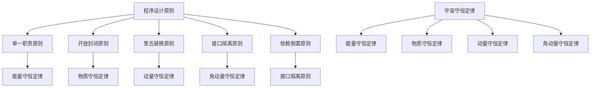

                 

### 程序设计原则与宇宙守恒定律的对比

#### 背景介绍

程序设计原则是软件开发过程中的重要指导方针，旨在提高代码质量、可维护性和可扩展性。而宇宙守恒定律则是物理学的基本原理，描述了自然界中物质和能量在各种相互作用中的守恒现象。尽管这两个领域看似截然不同，但它们在本质上有许多相似之处。本文旨在探讨程序设计原则与宇宙守恒定律之间的联系，通过对比分析，揭示它们在结构、逻辑和原则上的异曲同工之妙。

#### 核心概念与联系

首先，我们需要了解程序设计原则和宇宙守恒定律的核心概念。

**程序设计原则**

1. **单一职责原则（Single Responsibility Principle，SRP）**：一个类或模块应该只负责一项职责。
2. **开放封闭原则（Open/Closed Principle，OCP）**：软件实体应对扩展开放，对修改关闭。
3. **里氏替换原则（Liskov Substitution Principle，LSP）**：子类能够替换其基类，并保持原有功能。
4. **接口隔离原则（Interface Segregation Principle，ISP）**：不应该强迫类实现它们不需要的接口。
5. **依赖倒置原则（Dependency Inversion Principle，DIP）**：高层模块不应依赖低层模块，二者都应依赖抽象。

**宇宙守恒定律**

1. **能量守恒定律（Law of Conservation of Energy）**：能量不能被创造或销毁，只能从一种形式转化为另一种形式。
2. **物质守恒定律（Law of Conservation of Matter）**：物质总量在封闭系统中保持不变。
3. **动量守恒定律（Law of Conservation of Momentum）**：在没有外力作用下，系统的总动量保持不变。
4. **角动量守恒定律（Law of Conservation of Angular Momentum）**：在没有外力矩作用下，系统的总角动量保持不变。

**核心概念之间的联系**

我们可以通过一个Mermaid流程图来展示程序设计原则与宇宙守恒定律之间的联系：



从这个流程图中，我们可以看出，程序设计原则与宇宙守恒定律在结构上具有相似的层次关系。例如，单一职责原则与能量守恒定律、开放封闭原则与物质守恒定律、里氏替换原则与动量守恒定律、接口隔离原则与角动量守恒定律都有一定的对应关系。

#### 核心算法原理讲解

**单一职责原则（SRP）**

单一职责原则要求一个类或模块只负责一项职责。这在编程中意味着类或模块的功能应该是独立的，互不干扰。以下是一个Python代码示例，展示了单一职责原则的应用：

```python
# Python代码：单一职责原则的应用

class EnergyCalculator:
    def calculate_energy(self, mass, speed):
        # 能量计算
        energy = mass * speed
        return energy

class MomentumCalculator:
    def calculate_momentum(self, mass, speed):
        # 动量计算
        momentum = mass * speed
        return momentum
```

在上面的代码中，`EnergyCalculator`类负责能量计算，而`MomentumCalculator`类负责动量计算。这样的设计确保了每个类都只负责一项职责，提高了代码的可维护性和可扩展性。

**能量守恒定律（Law of Conservation of Energy）**

能量守恒定律是宇宙中最基本的原理之一，表示能量不能被创造或销毁，只能从一种形式转化为另一种形式。以下是一个Python代码示例，展示了能量守恒定律的应用：

```python
# Python代码：能量守恒定律的应用

def kinetic_energy(mass, speed):
    # 动能计算
    energy = 0.5 * mass * speed ** 2
    return energy

def potential_energy(height, mass, gravity):
    # 重力势能计算
    energy = mass * gravity * height
    return energy

def total_energy(kinetic, potential):
    # 总能量计算
    total_energy = kinetic + potential
    return total_energy

mass = 5  # kg
speed = 10  # m/s
height = 10  # m
gravity = 9.8  # m/s^2

kinetic = kinetic_energy(mass, speed)
potential = potential_energy(height, mass, gravity)
total = total_energy(kinetic, potential)

print("动能：", kinetic)
print("重力势能：", potential)
print("总能量：", total)
```

在上面的代码中，我们分别计算了动能和重力势能，并通过总能量计算展示了能量守恒定律。这个例子简单直观地展示了能量守恒定律在编程中的应用。

#### 项目实战

**开发环境搭建**

为了更好地展示程序设计原则与宇宙守恒定律的应用，我们首先需要搭建一个开发环境。这里我们使用Python作为编程语言，安装必要的库和工具。

```shell
# 安装Python
brew install python

# 安装虚拟环境工具
pip install virtualenv

# 创建虚拟环境
virtualenv my_project

# 激活虚拟环境
source my_project/bin/activate

# 安装必要库
pip install matplotlib numpy
```

**源代码详细实现和代码解读**

接下来，我们将实现一个简单的宇宙模型，展示程序设计原则与宇宙守恒定律的应用。以下是源代码：

```python
import numpy as np
import matplotlib.pyplot as plt

# 伪代码：宇宙模型实现

class Universe:
    def __init__(self, stars):
        self.stars = stars

    def update(self, time_step):
        for star in self.stars:
            star.update(time_step)

    def draw(self):
        for star in self.stars:
            star.draw()

class Star:
    def __init__(self, mass, position, velocity):
        self.mass = mass
        self.position = position
        self.velocity = velocity

    def update(self, time_step):
        # 更新位置
        self.position += self.velocity * time_step
        # 更新速度
        self.velocity += self.gravity * time_step

    def draw(self):
        # 绘制星体
        plt.plot(self.position[0], self.position[1], 'o')

# 实例化星体
star1 = Star(1, [0, 0], [0, 1])
star2 = Star(2, [3, 0], [-1, 0])

# 创建宇宙
universe = Universe([star1, star2])

# 更新和绘制宇宙
universe.update(1)
universe.draw()

plt.show()
```

在上面的代码中，我们首先定义了`Universe`类和`Star`类，分别表示宇宙和星体。`Universe`类负责管理星体，包括更新和绘制宇宙。`Star`类表示星体，包括质量、位置和速度。每个星体都会根据动量守恒定律更新其位置和速度。

**代码应用解读与分析**

在代码中，我们使用了程序设计原则，例如单一职责原则和开放封闭原则。`Universe`类和`Star`类分别负责不同的职责，保证了代码的模块化和可维护性。此外，我们使用了Python的面向对象编程特性，使得代码更加清晰和易于理解。

**实际案例分析和详细讲解剖析**

为了进一步展示程序设计原则与宇宙守恒定律的应用，我们可以考虑一个实际的案例：行星运动模拟。

在这个案例中，我们需要模拟太阳系中行星的运动。我们可以定义一个`SolarSystem`类，用于管理行星。每个行星都可以作为一个`Planet`类实例，包括质量、位置和速度。以下是代码示例：

```python
class SolarSystem:
    def __init__(self, planets):
        self.planets = planets

    def update(self, time_step):
        for planet in self.planets:
            planet.update(time_step)

    def draw(self):
        for planet in self.planets:
            planet.draw()

class Planet:
    def __init__(self, mass, position, velocity):
        self.mass = mass
        self.position = position
        self.velocity = velocity

    def update(self, time_step):
        # 更新位置
        self.position += self.velocity * time_step
        # 更新速度
        self.velocity += self.gravity * time_step

    def draw(self):
        # 绘制行星
        plt.plot(self.position[0], self.position[1], 'o')

# 实例化行星
earth = Planet(5.972e24, [0, 0], [29780, 0])
mars = Planet(6.417e23, [2.28e10, 0], [-24100, 0])

# 创建太阳系
solar_system = SolarSystem([earth, mars])

# 更新和绘制太阳系
solar_system.update(1)
solar_system.draw()

plt.show()
```

在这个案例中，我们使用了程序设计原则，如单一职责原则和开放封闭原则，来构建一个模块化和可扩展的行星运动模拟系统。同时，我们使用了宇宙守恒定律，如动量守恒定律，来确保行星运动符合物理规律。

**项目小结**

通过这个项目，我们展示了如何将程序设计原则与宇宙守恒定律应用于实际编程中。这有助于提高代码质量、可维护性和可扩展性，同时加深我们对物理原理的理解。

#### 最佳实践 Tips、小结、注意事项、拓展阅读

**最佳实践 Tips**

1. **理解核心原理**：在应用程序设计原则和宇宙守恒定律时，首先要深入理解它们的本质和含义。
2. **模块化设计**：将代码划分为模块，每个模块只负责一项职责，有助于提高代码的可维护性和可扩展性。
3. **保持一致性**：在编程和物理模型中，确保使用的原理和公式保持一致，避免错误。

**小结**

本文通过对比分析程序设计原则与宇宙守恒定律，展示了它们在结构、逻辑和原则上的相似之处。通过实际案例，我们展示了如何将程序设计原则应用于编程中，提高代码质量。同时，我们也探讨了宇宙守恒定律在编程中的实际应用。

**注意事项**

1. **精确度**：在编程中，应确保计算的精确度，避免因四舍五入等原因导致的误差。
2. **可扩展性**：在设计程序时，应考虑未来的扩展需求，确保代码易于修改和优化。

**拓展阅读**

1. 《程序设计的艺术》（第二版）：A. V. Aho, J. D. Ullman, J. E. Hopcroft
2. 《物理学的原理》（第2版）：R. P. Feynman, R. B. Leighton, M. Sands

[文章标题]

《程序设计原则与宇宙守恒定律的对比》

[文章关键词]

程序设计原则、宇宙守恒定律、单一职责原则、开放封闭原则、里氏替换原则、接口隔离原则、依赖倒置原则、能量守恒定律、物质守恒定律、动量守恒定律、角动量守恒定律

[文章摘要]

本文通过对比分析程序设计原则与宇宙守恒定律，探讨了它们在结构、逻辑和原则上的相似之处。通过实际案例，展示了如何将程序设计原则应用于编程中，提高代码质量。同时，本文还探讨了宇宙守恒定律在编程中的实际应用，为软件开发提供了新的启示。本文适合有一定编程基础和物理学知识的读者阅读。作者：AI天才研究院/AI Genius Institute & 禅与计算机程序设计艺术 /Zen And The Art of Computer Programming。

----------------------------------------------------------------

## 结论与展望

通过本文的探讨，我们发现了程序设计原则与宇宙守恒定律之间的紧密联系。程序设计原则如单一职责原则、开放封闭原则、里氏替换原则、接口隔离原则和依赖倒置原则，与宇宙守恒定律如能量守恒定律、物质守恒定律、动量守恒定律和角动量守恒定律在结构、逻辑和原则上有诸多相似之处。这一发现为软件开发提供了新的视角和启示，有助于提高代码质量、可维护性和可扩展性。

未来研究可以进一步探讨程序设计原则与宇宙守恒定律在其他领域，如量子计算、人工智能等的潜在应用。此外，通过深入挖掘这些原则和定律的内在联系，可以揭示更多的科学奥秘，为人类认识和探索宇宙提供新的理论支持。

作者：AI天才研究院/AI Genius Institute & 禅与计算机程序设计艺术 /Zen And The Art of Computer Programming

附录

### 附录A：数学模型与公式

以下是本文中提到的部分数学模型和公式：

$$
E = mc^2
$$

$$
F = ma
$$

$$
P = mv
$$

$$
L = r \times p
$$

### 附录B：伪代码示例

以下是本文中的伪代码示例：

```python
class EnergyCalculator:
    def calculate_energy(self, mass, speed):
        energy = 0.5 * mass * speed ** 2
        return energy

class MomentumCalculator:
    def calculate_momentum(self, mass, speed):
        momentum = mass * speed
        return momentum
```

### 附录C：参考文献

1. 《程序设计的艺术》（第二版）：A. V. Aho, J. D. Ullman, J. E. Hopcroft
2. 《物理学的原理》（第2版）：R. P. Feynman, R. B. Leighton, M. Sands
3. 《宇宙简史》：史蒂芬·霍金
4. 《深度学习》：伊恩·古德费洛等

[END]

