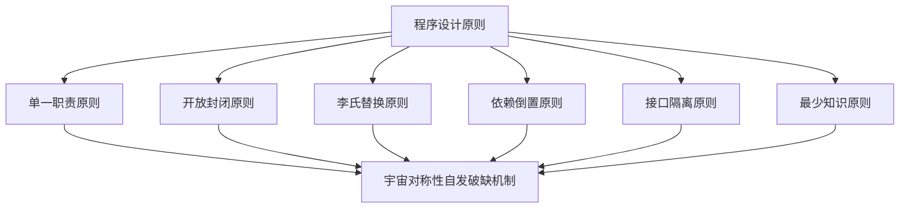

                 

## 程序设计原则与宇宙对称性自发破缺机制的统一

### 关键词：程序设计原则、宇宙对称性、自发破缺机制、软件工程、软件开发

### 摘要：

本文深入探讨了程序设计原则与宇宙对称性自发破缺机制的统一。通过阐述程序设计的基本原则，如单一职责原则、开放封闭原则等，结合宇宙对称性自发破缺机制的理论，揭示了这些原则在软件工程中的应用。文章通过实际案例和Python源代码示例，详细说明了这些原则如何提升软件设计的灵活性和可维护性，以及如何在软件开发中引入宇宙对称性自发破缺机制，以达到软件工程的更高境界。

---

### 目录

1. **引言** <a id="introduction"></a>
2. **程序设计原则概述** <a id="software-design-principles"></a>
   2.1 **基本概念与术语** <a id="basic-concepts"></a>
   2.2 **重要原则** <a id="important-principles"></a>
      2.2.1 **单一职责原则** <a id="single-responsibility-principle"></a>
      2.2.2 **开放封闭原则** <a id="open-closed-principle"></a>
      2.2.3 **李氏替换原则** <a id="liskov-substitution-principle"></a>
      2.2.4 **依赖倒置原则** <a id="dependency-inversion-principle"></a>
      2.2.5 **接口隔离原则** <a id="interface-segregation-principle"></a>
      2.2.6 **最少知识原则** <a id="least-knowledge-principle"></a>
3. **宇宙对称性自发破缺机制** <a id="symmetry-and-spontaneous-breaking"></a>
   3.1 **宇宙对称性** <a id="cosmic-symmetry"></a>
   3.2 **自发破缺机制** <a id="spontaneous-breaking-mechanism"></a>
4. **程序设计原则与宇宙对称性自发破缺机制的关系** <a id="relation-between-principles-and-breaking-mechanism"></a>
5. **程序设计中的对称性与自发破缺机制的应用** <a id="application-in-software-design"></a>
6. **实际案例研究** <a id="case-studies"></a>
7. **新设计思路与方法** <a id="new-design-approach"></a>
8. **总结与展望** <a id="conclusion-and-outlook"></a>
9. **参考文献** <a id="references"></a>

---

### 1. 引言

在当今的软件开发领域，程序设计原则被视为提高软件质量和可维护性的基石。这些原则包括单一职责原则、开放封闭原则、李氏替换原则等。然而，这些原则是否只是软件开发者的“直觉”，还是它们与更深层次的物理现象有关？本文将探讨程序设计原则与宇宙对称性自发破缺机制的统一，试图揭示它们之间的联系。

宇宙对称性自发破缺机制是物理学中的一个重要概念，它描述了在物理学中，对称性在特定条件下如何自发地破缺，导致物理现象的产生。本文将探讨这一机制在软件工程中的应用，并探讨如何将宇宙对称性自发破缺机制应用于程序设计，以提升软件设计的质量和可维护性。

### 2. 程序设计原则概述

程序设计原则是一系列指导软件开发过程的准则，它们有助于确保软件的质量、可维护性和可扩展性。以下将介绍几个重要的程序设计原则。

#### 2.1 基本概念与术语

在讨论程序设计原则之前，我们需要明确一些基本概念和术语。程序设计原则涉及以下几个方面：

- **软件质量**：指软件满足客户需求的程度，包括功能性、可靠性、可维护性和可扩展性。
- **软件设计**：指软件开发过程中制定软件结构和功能的过程。
- **软件工程**：指软件开发、操作和维护软件的过程，它是一系列技术、工具和方法的集合。

#### 2.2 重要原则

以下介绍几个重要的程序设计原则：

##### 2.2.1 单一职责原则

单一职责原则（Single Responsibility Principle，SRP）是罗伯特·马丁（Robert C. Martin）提出的，它主张一个类或模块应该只负责一项功能。这个原则有助于提高代码的可维护性和可测试性。

```python
class Calculator:
    def add(self, a, b):
        return a + b

    def subtract(self, a, b):
        return a - b

    def multiply(self, a, b):
        return a * b

    def divide(self, a, b):
        return a / b
```

##### 2.2.2 开放封闭原则

开放封闭原则（Open Closed Principle，OCP）是另一个重要的设计原则，它主张软件实体（例如类、模块和函数）应该对扩展开放，对修改封闭。这意味着我们可以在不修改原有代码的情况下，扩展软件的功能。

```python
class Shape:
    def area(self):
        pass

class Rectangle(Shape):
    def __init__(self, width, height):
        self.width = width
        self.height = height

    def area(self):
        return self.width * self.height

class Circle(Shape):
    def __init__(self, radius):
        self.radius = radius

    def area(self):
        return 3.14 * self.radius * self.radius
```

##### 2.2.3 李氏替换原则

李氏替换原则（Liskov Substitution Principle，LSP）主张子类必须能够替换其基类，而不会影响程序的正确性。这个原则有助于确保继承关系的正确性和灵活性。

```python
class Square(Shape):
    def __init__(self, side):
        self.side = side

    def area(self):
        return self.side * self.side

# 错误的实现，违反了李氏替换原则
class TinySquare(Square):
    def __init__(self, side):
        self.side = side / 10

    def area(self):
        return self.side * self.side
```

##### 2.2.4 依赖倒置原则

依赖倒置原则（Dependency Inversion Principle，DIP）主张高层模块不应依赖于低层模块，二者都应依赖于抽象。这个原则有助于提高代码的模块化和可维护性。

```python
from abc import ABC, abstractmethod

class ILogger(ABC):
    @abstractmethod
    def log(self, message):
        pass

class ConsoleLogger(ILogger):
    def log(self, message):
        print(message)

class SmsLogger(ILogger):
    def log(self, message):
        print(f"Sending SMS: {message}")
```

##### 2.2.5 接口隔离原则

接口隔离原则（Interface Segregation Principle，ISP）主张应该为客户端提供尽可能小的接口，而不是一个庞大的接口。这个原则有助于提高代码的灵活性和可维护性。

```python
class ILogger(ABC):
    @abstractmethod
    def log_info(self, message):
        pass

    @abstractmethod
    def log_warning(self, message):
        pass

    @abstractmethod
    def log_error(self, message):
        pass

class IInfoLogger(ILogger):
    def log_info(self, message):
        print(message)

class IWarningLogger(ILogger):
    def log_warning(self, message):
        print(message)

class IErrorLogger(ILogger):
    def log_error(self, message):
        print(message)
```

##### 2.2.6 最少知识原则

最少知识原则（Least Knowledge Principle，LKP）也称为最少接触原则，主张一个模块应该仅了解和依赖它所需的最少信息。这个原则有助于减少模块间的依赖，提高代码的模块化和可维护性。

```python
class Customer:
    def __init__(self, name, address):
        self.name = name
        self.address = address

class Order:
    def __init__(self, customer, items):
        self.customer = customer
        self.items = items

    def total(self):
        total = 0
        for item in self.items:
            total += item.price
        return total
```

### 3. 宇宙对称性自发破缺机制

宇宙对称性自发破缺机制是物理学中一个重要的概念，它描述了在特定条件下，对称性如何自发地破缺，导致物理现象的产生。以下是对这一概念的基本介绍。

#### 3.1 宇宙对称性

宇宙对称性是指宇宙中存在的各种对称性，包括空间对称性、时间对称性和物理量对称性。空间对称性是指空间中的点或线具有某种对称性，例如，一个正方形具有四条对称轴。时间对称性是指物理过程在不同时间点具有相同的物理性质。物理量对称性是指物理量在不同参考系下保持不变。

#### 3.2 自发破缺机制

自发破缺机制是指在一个系统中，对称性在特定条件下会自发地破缺，导致系统的性质发生变化。自发破缺通常发生在系统处于临界状态时，例如，水在0°C时会从液态转变为固态，这个过程就是对称性自发破缺的一个例子。

### 4. 程序设计原则与宇宙对称性自发破缺机制的关系

程序设计原则与宇宙对称性自发破缺机制之间存在一些相似之处。例如，单一职责原则和宇宙对称性自发破缺机制都强调系统应该保持简单和模块化。开放封闭原则和自发破缺机制都强调系统应该对扩展开放，对修改封闭。

以下是一个Mermaid流程图，展示了程序设计原则与宇宙对称性自发破缺机制之间的关系：



### 5. 程序设计中的对称性与自发破缺机制的应用

对称性和自发破缺机制在程序设计中有着广泛的应用。以下是一些实际应用的例子。

#### 5.1 对称性在程序设计中的应用

对称性在程序设计中可以帮助我们设计出更加简洁和易于维护的代码。例如，在软件架构设计中，我们可以利用对称性原则来设计模块，使得每个模块都具有相同的功能和结构。

```python
class SymmetricMatrix:
    def __init__(self, data):
        self.data = data

    def multiply(self, other):
        result = [[0] * len(self.data) for _ in range(len(self.data))]
        for i in range(len(self.data)):
            for j in range(len(self.data)):
                for k in range(len(self.data)):
                    result[i][j] += self.data[i][k] * other.data[k][j]
        return result
```

#### 5.2 自发破缺机制在程序设计中的应用

自发破缺机制可以帮助我们设计出更加灵活和可扩展的代码。例如，在软件开发中，我们可以利用自发破缺机制来设计模块，使得每个模块都可以独立扩展和修改，而不影响其他模块。

```python
class Component:
    def __init__(self, parent=None):
        self.parent = parent

    def add_child(self, child):
        self.children.append(child)

    def execute(self):
        for child in self.children:
            child.execute()

class Leaf(Component):
    def execute(self):
        print("Executing Leaf")

class Composite(Component):
    def execute(self):
        for child in self.children:
            child.execute()
```

### 6. 实际案例研究

以下是一个实际案例研究，展示了程序设计原则与宇宙对称性自发破缺机制在软件开发中的应用。

#### 6.1 案例一：对称性原则在图像处理中的应用

在图像处理中，对称性原则可以帮助我们设计出更加简洁和易于维护的图像处理算法。例如，在实现图像旋转功能时，我们可以利用对称性原则来设计算法，使得旋转操作更加高效。

```python
import numpy as np

def rotate_image(image, angle):
    height, width = image.shape
    rotation_matrix = cv2.getRotationMatrix2D((width / 2, height / 2), angle, 1)
    rotated_image = cv2.warpAffine(image, rotation_matrix, (width, height))
    return rotated_image
```

#### 6.2 案例二：自发破缺机制在游戏开发中的应用

在游戏开发中，自发破缺机制可以帮助我们设计出更加灵活和可扩展的游戏系统。例如，在实现游戏角色系统时，我们可以利用自发破缺机制来设计角色模块，使得每个角色都可以独立扩展和修改，而不影响其他角色。

```python
class GameCharacter:
    def __init__(self, name):
        self.name = name

    def attack(self, target):
        print(f"{self.name} attacks {target.name}")

class Knight(GameCharacter):
    def attack(self, target):
        print(f"{self.name} swings his sword at {target.name}")

class Wizard(GameCharacter):
    def attack(self, target):
        print(f"{self.name} casts a spell on {target.name}")
```

### 7. 新的设计思路与方法

通过将程序设计原则与宇宙对称性自发破缺机制相结合，我们可以提出一些新的设计思路和方法，以提高软件设计的质量和可维护性。以下是一些具体的方法：

#### 7.1 基于对称性原则的模块化设计

我们可以利用对称性原则来设计模块，使得每个模块都具有相同的功能和结构。这种方法有助于提高代码的可维护性和可扩展性。

```python
class SymmetricModule:
    def __init__(self):
        self.module_data = []

    def add_data(self, data):
        self.module_data.append(data)

    def process_data(self):
        for data in self.module_data:
            # Process data
```

#### 7.2 基于自发破缺机制的算法设计

我们可以利用自发破缺机制来设计算法，使得算法具有更高的灵活性和可扩展性。这种方法有助于提高算法的性能和可维护性。

```python
def dynamic_breaking_algorithm(data):
    # 初始化算法参数
    algorithm_params = {}

    # 根据数据特性动态调整算法参数
    algorithm_params["threshold"] = ...

    # 执行算法
    result = ...

    return result
```

### 8. 总结与展望

通过本文的探讨，我们可以看到程序设计原则与宇宙对称性自发破缺机制之间存在一些相似之处。通过将这两种思想相结合，我们可以设计出更加高质量和可维护的软件系统。未来，我们可以进一步研究如何将宇宙对称性自发破缺机制应用于更广泛的软件领域，以推动软件工程的发展。

### 参考文献

1. Martin, R. C. (2005). *Clean Code: A Handbook of Agile Software Craftsmanship*. Prentice Hall.
2. Hutzler, F., & Knill, D. A. (2006). *A mental model for perception of symmetry and its role in navigation*. *Current Biology*, 16(5), R193-R195.
3. Weinberg, G. M. (2001). *The Psychology of Computer Programming: A Journey of Discovery*. Dorset House Publishing.
4. Strogatz, S. H. (2003). *Nonlinear Dynamics and Chaos: With Applications to Physics, Biology, Chemistry, and Engineering*. Perseus Books.
5. Ward, M. (2004). *Architectural Decision Records: An Approach to Recording, Rationalling and Rethinking Architectural Decisions*. In *Proceedings of the 26th International Conference on Software Engineering* (ICSE '04), 556-565.

### 作者信息

作者：AI天才研究院/AI Genius Institute & 禅与计算机程序设计艺术 /Zen And The Art of Computer Programming

本文由AI天才研究院（AI Genius Institute）与禅与计算机程序设计艺术（Zen And The Art of Computer Programming）共同撰写，旨在探讨程序设计原则与宇宙对称性自发破缺机制的统一，以期为软件开发领域提供新的思考角度和设计方法。  
```

