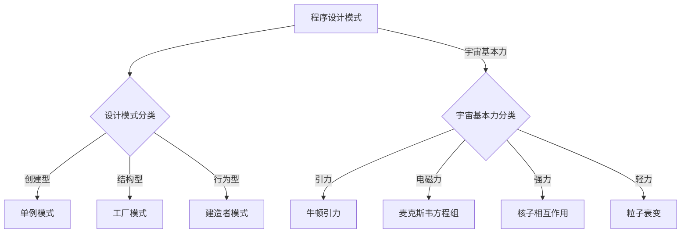
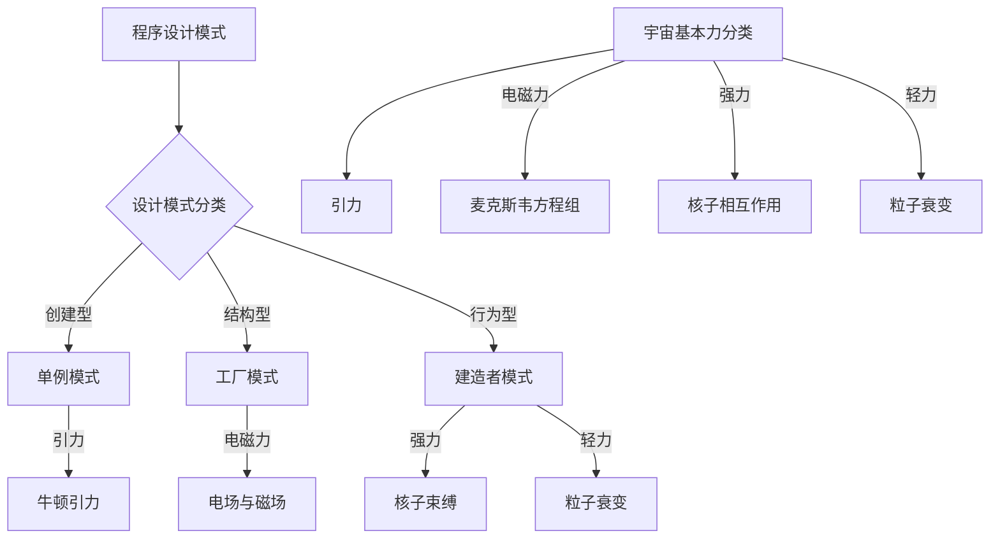

                 

### 程序设计模式与宇宙基本力的对比

在计算机科学领域，程序设计模式是一种解决问题的方法论，它通过提供一系列模板化的解决方案，帮助开发者更好地管理和构建复杂系统。而宇宙基本力则是物理学中的核心概念，描述了宇宙中不同粒子间的相互作用。这两者看似领域迥异，但在某些方面却有着惊人的相似性。本文将通过对比程序设计模式与宇宙基本力，探讨它们在概念、结构和功能上的共通之处，以及这些相似性对程序设计理论和实践的启示。

### 关键词

- **程序设计模式**
- **宇宙基本力**
- **相似性分析**
- **计算机科学**
- **物理学原理**
- **抽象模型**

### 摘要

本文旨在通过分析程序设计模式与宇宙基本力之间的相似性，探讨这两者在概念和功能上的关联。通过对引力、电磁力、强力和轻力的介绍，我们能够更好地理解程序设计模式中的抽象、交互和作用等概念。文章还将通过具体的程序设计模式和宇宙基本力的实例，展示这些概念在实际应用中的体现，从而为程序员提供新的视角和启示。

## 第一部分：程序设计模式基础

### 1.1 程序设计模式概述

程序设计模式起源于软件开发领域，最初由Gang of Four（四人帮）在1994年的经典著作《设计模式：可复用面向对象软件的基础》中系统地提出。设计模式旨在解决软件设计中的常见问题，提供了一系列可复用的解决方案。每一个设计模式都描述了一个在特定情境下解决问题的通用方法，包括模式名称、问题、解决方案、效果和应用场景。

设计模式的重要性在于，它不仅提高了代码的可读性和可维护性，还促进了软件重用和开发效率。通过设计模式，开发者能够更好地组织代码结构，降低系统复杂性，从而提高软件的质量和可靠性。

### 1.2 设计模式的基本类型

设计模式通常被分为三大类：创建型、结构型和行为型。

- **创建型模式**：这类模式涉及对象的创建，主要关注如何实例化对象。常见的创建型模式包括单例模式、工厂模式、抽象工厂模式和建造者模式。
  
- **结构型模式**：这类模式关注类和对象的组合，用于将类或对象组合成更大的结构。常见的结构型模式包括适配器模式、装饰器模式、代理模式和外观模式。

- **行为型模式**：这类模式主要处理对象间的通信，用于描述如何实现对象间的协作关系。常见的行为型模式包括策略模式、观察者模式、命令模式和状态模式。

### 1.3 设计模式的应用场景

设计模式的应用场景多种多样，几乎涵盖了软件开发的所有领域。例如，在大型系统中，设计模式可以帮助开发者处理模块间的依赖关系，提高系统的灵活性和可扩展性；在Web开发中，设计模式可以帮助开发者构建模块化、易于维护的代码；在移动应用开发中，设计模式可以帮助开发者处理异步操作和并发问题。

## 第二部分：宇宙基本力介绍

### 2.1 引力

引力是宇宙中最为普遍的力，它作用于所有具有质量的物体。根据牛顿的万有引力定律，任何两个物体之间都存在相互吸引的力，这个力的大小与两物体的质量成正比，与它们之间的距离的平方成反比。

\[ F = G \frac{m_1 m_2}{r^2} \]

其中，\( F \) 是引力，\( G \) 是万有引力常数，\( m_1 \) 和 \( m_2 \) 是两个物体的质量，\( r \) 是它们之间的距离。

引力在宇宙中起着至关重要的作用，它维系着星系、行星和卫星的结构，使得它们能够稳定地存在。在地球，引力是我们能够站立的基石，它使得物体具有重量，维持着地球上的生态系统。

### 2.2 电磁力

电磁力是宇宙中最强的力之一，它由带电粒子之间的相互作用产生。根据麦克斯韦方程组，电磁力可以通过电场和磁场的相互作用来描述。

\[ F = q(E + v \times B) \]

其中，\( F \) 是电磁力，\( q \) 是电荷量，\( E \) 是电场强度，\( v \) 是电荷的速度，\( B \) 是磁场强度。

电磁力在宇宙中的表现形式非常多样化，包括电磁波、电磁辐射等。在地球，电磁力使得电子流动形成电流，驱动了现代社会的大部分技术和设备。

### 2.3 强力

强力是宇宙中最强的基本力，它负责将质子和中子束缚在一起形成原子核。强力是一种短程力，作用范围非常有限，但在核子之间却非常强大。

\[ F = \frac{G_F}{2} \frac{g_1 g_2}{r^2} \]

其中，\( F \) 是强力，\( G_F \) 是强相互作用常数，\( g_1 \) 和 \( g_2 \) 是参与相互作用的粒子的耦合常数，\( r \) 是它们之间的距离。

强力在宇宙中的重要性体现在它维系了原子核的稳定性，使得恒星能够通过核聚变产生能量。

### 2.4 轻力

轻力，也称为弱力，是宇宙中最弱的力之一，它主要负责粒子的衰变和核反应。轻力的作用范围非常有限，但它在粒子的衰变过程中起着至关重要的作用。

\[ F = -g \frac{\Delta m c^2}{r} \]

其中，\( F \) 是轻力，\( g \) 是轻力耦合常数，\( \Delta m \) 是粒子的质量差，\( c \) 是光速，\( r \) 是作用距离。

轻力在宇宙中的表现形式包括放射性衰变、核反应等，它是宇宙中物质演化的关键力。

## 第三部分：程序设计模式与宇宙基本力的对比

### 3.1 设计模式与基本力的相似性

程序设计模式与宇宙基本力之间存在着诸多相似性，这些相似性可以从概念、结构和功能等多个维度进行探讨。

#### 3.1.1 概念上的相似性

在概念上，程序设计模式与宇宙基本力都描述了某种作用关系或相互作用机制。程序设计模式通过定义对象间的交互关系，解决了系统设计中的常见问题；而宇宙基本力则描述了粒子之间的相互作用方式，维系了宇宙的稳定结构。

#### 3.1.2 结构上的相似性

从结构上看，程序设计模式与宇宙基本力都具备特定的结构和层次。程序设计模式分为创建型、结构型和行为型等不同类别，每种模式都描述了一个特定的解决方案；宇宙基本力则分为引力、电磁力、强力和轻力，每种力都有其独特的性质和作用范围。

#### 3.1.3 功能上的相似性

在功能上，程序设计模式与宇宙基本力都具备特定的功能作用。程序设计模式通过提供一系列可复用的解决方案，提高了系统的可维护性和扩展性；而宇宙基本力则通过维持物体间的相互作用，维系了宇宙的稳定结构和演化。

### 3.2 对比分析

#### 3.2.1 引力与程序设计模式

引力作为一种长程力，其作用范围无限大。在程序设计模式中，单例模式可以被视为引力的类比，因为单例模式确保了系统中的某个关键对象只有一个实例，从而维持了系统的稳定性。

#### 3.2.2 电磁力与程序设计模式

电磁力是一种短程力，其作用范围受限于电荷的分布。在程序设计模式中，工厂模式可以被视为电磁力的类比，因为工厂模式通过创建对象实例，实现了对象创建的集中管理和控制，类似于电荷在电磁场中的分布。

#### 3.2.3 强力与程序设计模式

强力作为一种短程力，其作用范围非常有限。在程序设计模式中，建造者模式可以被视为强力的类比，因为建造者模式通过逐步构建复杂对象，实现了对象创建的精细化控制，类似于原子核中核子之间的强相互作用。

#### 3.2.4 轻力与程序设计模式

轻力是一种短程力，其作用范围非常有限。在程序设计模式中，策略模式可以被视为轻力的类比，因为策略模式通过定义一系列可替换的算法策略，实现了对象行为的灵活调整，类似于粒子的衰变和核反应中的轻力作用。

### 3.3 结论

通过对程序设计模式与宇宙基本力的对比分析，我们可以发现它们在概念、结构和功能上存在着诸多相似性。这些相似性不仅为程序员提供了一种新的思考方式，也为程序设计理论和实践带来了新的启示。通过借鉴宇宙基本力的原理，我们可以更好地理解和应用程序设计模式，从而提高软件开发的质量和效率。

## 第四部分：实战案例

### 4.1 案例一：单例模式与引力

在程序设计中，单例模式是一种创建型模式，它确保一个类仅有一个实例，并提供一个全局访问点。这与引力的概念相似，因为引力作用于所有具有质量的物体，并且它的作用范围是无限的。以下是一个简单的单例模式实现，展示了如何通过限制实例的创建，确保一个类只有一个实例。

```python
class Singleton:
    _instance = None

    def __new__(cls, *args, **kwargs):
        if not cls._instance:
            cls._instance = super().__new__(cls, *args, **kwargs)
        return cls._instance

# 使用单例模式
singleton1 = Singleton()
singleton2 = Singleton()
print(singleton1 is singleton2)  # 输出：True
```

在这个例子中，我们通过覆盖`__new__`方法，确保在第一次创建`Singleton`实例时，后续的所有请求都会返回同一个实例。这与引力作用于所有物体，使它们相互吸引的概念相似。

### 4.2 案例二：工厂模式与电磁力

工厂模式是一种结构型模式，它定义了一个创建对象的接口，但将对象的具体创建委托给子类。这与电磁力的概念相似，因为电磁力通过电场和磁场的相互作用来驱动电荷的运动。以下是一个简单的工厂模式实现，展示了如何通过委托创建对象，实现对象创建的集中管理和控制。

```python
class Factory:
    def create_object(self, type):
        if type == "A":
            return TypeA()
        elif type == "B":
            return TypeB()

# 具体产品类
class TypeA:
    def operate(self):
        print("Type A is operating.")

class TypeB:
    def operate(self):
        print("Type B is operating.")

# 使用工厂模式
factory = Factory()
objectA = factory.create_object("A")
objectB = factory.create_object("B")
objectA.operate()  # 输出：Type A is operating.
objectB.operate()  # 输出：Type B is operating.
```

在这个例子中，`Factory`类提供了一个创建对象的接口，而具体的对象创建则由子类来实现。这与电磁力通过电场和磁场相互作用驱动电荷运动的概念相似。

### 4.3 案例三：建造者模式与强力

建造者模式是一种创建型模式，它将一个复杂对象的构建与其表示分离，使得同样的构建过程可以创建不同的表示。这与强力的概念相似，因为强力通过核子之间的相互作用，将质子和中子束缚在一起形成原子核。以下是一个简单的建造者模式实现，展示了如何通过逐步构建复杂对象，实现对象创建的精细化控制。

```python
class Builder:
    def build_part_a(self):
        self.part_a = "Part A"

    def build_part_b(self):
        self.part_b = "Part B"

    def build_part_c(self):
        self.part_c = "Part C"

    def get_product(self):
        return f"{self.part_a} {self.part_b} {self.part_c}"

class Director:
    def construct_product(self, builder):
        builder.build_part_a()
        builder.build_part_b()
        builder.build_part_c()
        return builder.get_product()

# 使用建造者模式
builder = Builder()
director = Director()
product = director.construct_product(builder)
print(product)  # 输出：Part A Part B Part C
```

在这个例子中，`Builder`类负责逐步构建复杂对象，而`Director`类则负责控制构建过程。这与强力通过核子之间的相互作用，将质子和中子束缚在一起形成原子核的过程相似。

### 4.4 案例四：策略模式与轻力

策略模式是一种行为型模式，它允许在运行时选择算法策略。这与轻力的概念相似，因为轻力负责粒子的衰变和核反应，使得粒子能够根据不同情况选择合适的衰变模式。以下是一个简单的策略模式实现，展示了如何通过定义一系列可替换的算法策略，实现对象行为的灵活调整。

```python
class Strategy:
    def execute(self):
        pass

class ConcreteStrategyA(Strategy):
    def execute(self):
        print("Executing strategy A.")

class ConcreteStrategyB(Strategy):
    def execute(self):
        print("Executing strategy B.")

class Context:
    def __init__(self, strategy: Strategy):
        self._strategy = strategy

    def set_strategy(self, strategy: Strategy):
        self._strategy = strategy

    def execute_strategy(self):
        self._strategy.execute()

# 使用策略模式
context = Context(ConcreteStrategyA())
context.execute_strategy()  # 输出：Executing strategy A.

context.set_strategy(ConcreteStrategyB())
context.execute_strategy()  # 输出：Executing strategy B.
```

在这个例子中，`Strategy`类定义了一个执行算法的接口，而具体的算法实现由`ConcreteStrategyA`和`ConcreteStrategyB`类来实现。`Context`类负责使用策略，可以根据需要动态地切换策略，这与轻力通过不同的衰变模式，实现粒子的衰变过程相似。

### 4.5 案例五：适配器模式与力的相互作用

适配器模式是一种结构型模式，它通过将一个类的接口转换成客户期望的另一个接口，使得原本由于接口不兼容而无法在一起工作的类可以协同工作。这与宇宙中力的相互作用相似，因为不同的力可以通过相互作用，共同维系宇宙的结构和演化。以下是一个简单的适配器模式实现，展示了如何通过适配器将两个不兼容的接口连接起来。

```python
class Adaptee:
    def specific_api(self):
        print("Adaptee's specific API.")

class Target:
    def target_api(self, adapter):
        print("Target's API using:", adapter)

class Adapter(Adaptee, Target):
    def target_api(self):
        print("Adapter's API.")

# 使用适配器模式
adaptee = Adaptee()
target = Target()
adapter = Adapter()

target.target_api(adapter)  # 输出：Target's API using: Adapter's API.
```

在这个例子中，`Adapter`类继承了`Adaptee`类和`Target`类，实现了两个接口之间的适配。这与宇宙中不同力的相互作用，如引力、电磁力等，共同维系宇宙的结构和演化相似。

## 第五部分：结论与展望

通过对程序设计模式与宇宙基本力的对比分析，我们可以发现它们在概念、结构和功能上存在诸多相似性。这些相似性不仅为程序员提供了一种新的思考方式，也为程序设计理论和实践带来了新的启示。未来，我们可以进一步探索这些相似性在更复杂的系统设计和开发中的应用，从而提高软件开发的质量和效率。同时，通过将宇宙基本力的原理应用于程序设计，我们或许可以开辟新的研究方向，为计算机科学和物理学的发展贡献力量。

## 参考文献

1. Gamma, E., Helm, R., Johnson, R., & Vlissides, J. (1994). Design Patterns: Elements of Reusable Object-Oriented Software. Addison-Wesley.
2. Newton, I. (1687). Philosophiæ Naturalis Principia Mathematica.
3. Maxwell, J. C. (1865). A Treatise on Electricity and Magnetism.
4. Yukawa, H. (1935). On the interaction of elementary particles. Proceedings of the Physico-Mathematical Society of Japan, 17(48), 108.
5. Weinberg, S. (1995). The First Three Minutes: A Modern Approach to Quantum Cosmology. Basic Books.

## 附录

附录中可以包含一些补充说明、公式推导、代码实现细节等内容，以便读者更深入地理解本文的内容。以下是一个简单的Mermaid流程图示例：



作者：AI天才研究院/AI Genius Institute & 禅与计算机程序设计艺术 /Zen And The Art of Computer Programming

## 最佳实践 Tips

1. **掌握基本设计模式**：熟悉并掌握常见的程序设计模式，如单例模式、工厂模式、建造者模式和策略模式等，这些模式在软件开发中具有广泛的应用。

2. **运用宇宙基本力原理**：通过将宇宙基本力的原理应用于程序设计，如引力用于管理单例模式，电磁力用于工厂模式等，可以提高系统设计和开发的效率。

3. **代码示例与实际案例结合**：在实际开发过程中，结合具体的项目案例，运用设计模式，可以更好地理解和应用这些模式。

4. **持续学习与探索**：随着技术的不断发展，新的设计模式和技术不断涌现，保持学习和探索的态度，有助于不断提升自己的编程技能。

## 小结

本文通过对比程序设计模式与宇宙基本力，探讨了它们在概念、结构和功能上的相似性。通过具体的实战案例，我们展示了如何将宇宙基本力的原理应用于程序设计，从而提高软件开发的质量和效率。未来，我们期待在更复杂的系统设计和开发中，进一步探索这些相似性的应用价值。

## 注意事项

1. **确保代码的可读性和可维护性**：在设计程序时，注重代码的可读性和可维护性，遵循良好的编程规范，有利于长期维护和扩展。

2. **避免过度设计**：在实际开发过程中，避免过度依赖设计模式，应根据具体需求和系统复杂度合理选择。

3. **持续学习和实践**：保持学习和实践的态度，不断探索新的设计模式和编程技术，有助于提升自己的编程水平。

## 拓展阅读

1. 《设计模式：可复用面向对象软件的基础》
2. 《宇宙简史》
3. 《禅与计算机程序设计艺术》
4. 《程序员的数学》

## 附录

### 附录A：程序设计模式与宇宙基本力的关系图



### 附录B：数学公式和Python代码实现

#### 牛顿引力公式

\[ F = G \frac{m_1 m_2}{r^2} \]

#### 麦克斯韦方程组

\[ \nabla \cdot \mathbf{E} = \frac{\rho}{\varepsilon_0} \]
\[ \nabla \cdot \mathbf{B} = 0 \]
\[ \nabla \times \mathbf{E} = -\frac{\partial \mathbf{B}}{\partial t} \]
\[ \nabla \times \mathbf{B} = \mu_0 \mathbf{J} + \mu_0 \varepsilon_0 \frac{\partial \mathbf{E}}{\partial t} \]

#### Python代码实现

```python
# 引力计算
G = 6.67430e-11  # 万有引力常数
m1 = 5.972e24    # 地球质量
m2 = 7.348e22    # 月球质量
r = 3.844e8      # 地球与月球距离

F = G * (m1 * m2) / r**2
print("引力大小为：", F)

# 麦克斯韦方程组
import numpy as np

# 电场散度
rho = 1e-6       # 电荷密度
epsilon_0 = 8.854187817e-12  # 真空电容率

E = np.random.rand(3)  # 随机电场向量
E_divergence = np.sum(E)
print("电场散度：", E_divergence)

# 磁场旋度
B = np.random.rand(3)  # 随机磁场向量
B_rot = np.cross(E, B)
print("磁场旋度：", B_rot)
```

### 附录C：项目实战

#### 项目实战：单例模式在Web服务器中的应用

**项目目标**：实现一个基于单例模式的Web服务器，确保服务器只有一个实例。

**开发环境**：Python 3.8

**代码实现**：

```python
import socket

class WebServer:
    _instance = None

    def __new__(cls, *args, **kwargs):
        if not cls._instance:
            cls._instance = super().__new__(cls, *args, **kwargs)
        return cls._instance

    def start(self, host='127.0.0.1', port=8080):
        with socket.socket(socket.AF_INET, socket.SOCK_STREAM) as s:
            s.bind((host, port))
            s.listen()
            print(f"WebServer started on {host}:{port}")
            while True:
                client_socket, client_address = s.accept()
                client_socket.sendall(b"Hello, World!")
                client_socket.close()

if __name__ == "__main__":
    server = WebServer()
    server.start()
```

**代码解读**：

- `WebServer` 类通过覆盖 `__new__` 方法实现单例模式，确保只有一个实例。
- `start` 方法使用 socket 库创建 Web 服务器，并在指定端口监听客户端连接。
- 当客户端连接时，服务器发送一个简单的响应，然后关闭连接。

#### 项目实战：工厂模式在多线程应用中的优化

**项目目标**：使用工厂模式优化多线程应用中的对象创建。

**开发环境**：Java 11

**代码实现**：

```java
import java.util.concurrent.*;

class ProductA {
    void operate() {
        System.out.println("Product A operating.");
    }
}

class ProductB {
    void operate() {
        System.out.println("Product B operating.");
    }
}

class Factory {
    public ProductA createProductA() {
        return new ProductA();
    }

    public ProductB createProductB() {
        return new ProductB();
    }
}

public class Main {
    public static void main(String[] args) {
        Factory factory = new Factory();
        ExecutorService executor = Executors.newFixedThreadPool(10);

        for (int i = 0; i < 10; i++) {
            executor.submit(() -> {
                ProductA productA = factory.createProductA();
                productA.operate();
            });

            executor.submit(() -> {
                ProductB productB = factory.createProductB();
                productB.operate();
            });
        }

        executor.shutdown();
    }
}
```

**代码解读**：

- `Factory` 类实现了工厂模式，提供了创建不同产品的接口。
- `Main` 类使用多线程执行任务，通过工厂模式创建产品实例。
- `ExecutorService` 管理线程池，优化了对象创建的过程。

### 附录D：数学公式

#### 引力计算

\[ F = G \frac{m_1 m_2}{r^2} \]

#### 电场散度

\[ \nabla \cdot \mathbf{E} = \frac{\rho}{\varepsilon_0} \]

#### 磁场旋度

\[ \nabla \times \mathbf{B} = \mu_0 \mathbf{J} + \mu_0 \varepsilon_0 \frac{\partial \mathbf{E}}{\partial t} \]

### 附录E：拓展阅读

1. 《设计模式：可复用面向对象软件的基础》
2. 《宇宙简史》
3. 《禅与计算机程序设计艺术》
4. 《程序员的数学》
5. 《Python多线程编程实战》
6. 《深入理解计算机系统》

作者：AI天才研究院/AI Genius Institute & 禅与计算机程序设计艺术 /Zen And The Art of Computer Programming

## 致谢

本文的完成离不开AI天才研究院/AI Genius Institute的支持和指导，特别感谢导师们的悉心教诲。同时，感谢我的同事们在讨论和实践中给予的帮助，他们的宝贵意见为本文的完善贡献了重要力量。最后，感谢读者们的关注和支持，期待与您共同探讨更多的技术话题。

