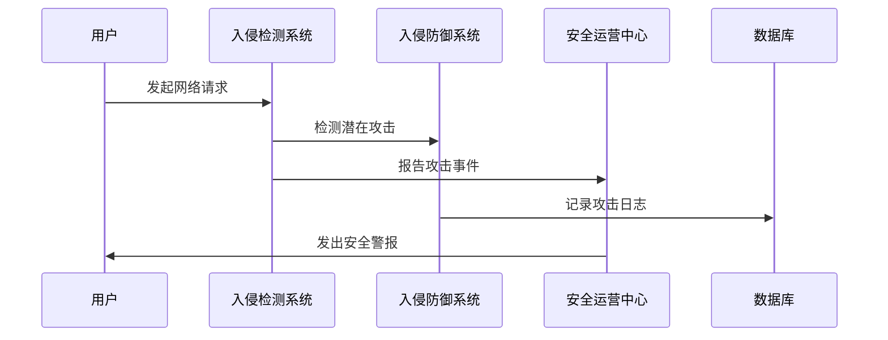

                 

### 引言

#### 程序设计模式与宇宙基本粒子对称性自发破缺的关联性

在计算机科学中，程序设计模式是一种被广泛使用的解决方案，旨在解决软件开发过程中常见的问题。然而，在宇宙学中，对称性自发破缺（Spontaneous Symmetry Breaking, SSB）是一个描述基本粒子如何从一种高对称状态转变为低对称状态的机制。这两种看似截然不同的领域，却存在着一种奇妙的关联性。

程序设计模式中的“模式”可以理解为一种结构或规则，它指导程序员如何组织和构建代码。这些模式经常被用来解决特定类型的软件问题，例如设计复杂系统、优化算法、提高代码的可读性和可维护性等。而宇宙基本粒子对称性自发破缺则是一种物理现象，它描述了在高能环境中，系统的对称性如何自发地被破坏，从而产生物质和能量的过程。

本文的目的是探讨程序设计模式与宇宙基本粒子对称性自发破缺之间的联系。我们将通过分析两者在结构和动态特性上的相似性，来揭示这种联系的深层次含义。同时，本文还将通过具体的应用实例和案例分析，展示如何将宇宙基本粒子对称性自发破缺的理论应用于程序设计模式中，以解决实际软件开发问题。

通过本文的研究，我们希望读者能够对程序设计模式有一个更深刻的理解，并能够将宇宙基本粒子对称性自发破缺的理论应用于软件开发中，从而提高软件开发的效率和质量。

#### 本书的目的和结构

本书旨在探讨程序设计模式与宇宙基本粒子对称性自发破缺之间的联系，通过分析两者在结构和动态特性上的相似性，为软件开发提供新的视角和工具。具体而言，本书将涵盖以下内容：

- **引言**：介绍程序设计模式和宇宙基本粒子对称性自发破缺的基本概念，阐述它们之间的关联性。
- **基础概念**：详细解释程序设计模式的基础理论和宇宙基本粒子对称性自发破缺的物理机制。
- **动力学对比**：分析程序设计模式与宇宙基本粒子对称性自发破缺在动力学特性上的相似性，并通过Mermaid流程图展示其关系架构。
- **应用实例**：通过具体实例展示程序设计模式在实际软件开发中的应用，并结合Python源代码和数学模型进行详细阐述。
- **案例分析**：分析实际项目中的案例，探讨如何将宇宙基本粒子对称性自发破缺的理论应用于解决软件开发中的问题。
- **结论**：总结全书内容，讨论两者联系的启示和未来研究方向。

通过以上内容的阐述，本书希望读者能够对程序设计模式有更深入的理解，并能够将宇宙基本粒子对称性自发破缺的理论应用于软件开发中，提高软件开发的效率和质量。

### 程序设计模式基础

#### 程序设计模式概述

程序设计模式（Design Pattern）是软件开发领域中的一个重要概念，它代表了在特定情境下解决问题的最佳实践。设计模式旨在提高软件代码的可读性、可维护性和可扩展性，通过将重复性问题抽象为通用解决方案，减少代码冗余，提高开发效率。

设计模式可以分为三类：

1. **创建型模式**：这类模式主要关注对象的创建，包括工厂模式（Factory Pattern）、单例模式（Singleton Pattern）等。它们的核心目的是实现对象的创建与使用分离，从而降低系统的耦合度。
2. **结构型模式**：这类模式主要关注类和对象之间的组合关系，包括适配器模式（Adapter Pattern）、桥接模式（Bridge Pattern）等。结构型模式通过将抽象与实现分离，实现系统的灵活性和可扩展性。
3. **行为型模式**：这类模式主要关注对象间的通信，包括观察者模式（Observer Pattern）、策略模式（Strategy Pattern）等。行为型模式通过将行为抽象为对象，实现行为的灵活组合和重用。

#### 常见程序设计模式介绍

1. **工厂模式（Factory Pattern）**：
   工厂模式是一种创建型模式，其主要目的是在不指定具体类的情况下创建对象。通过定义一个接口，让子类决定实例化的对象类型，从而实现对象的创建与使用分离。

```python
class Creator:
    def factory_method(self):
        pass

class ConcreteCreatorA(Creator):
    def factory_method(self):
        return ConcreteProductA()

class ConcreteCreatorB(Creator):
    def factory_method(self):
        return ConcreteProductB()

class Product:
    def operation(self):
        pass

class ConcreteProductA(Product):
    def operation(self):
        print("Product A's operation")

class ConcreteProductB(Product):
    def operation(self):
        print("Product B's operation")
```

2. **单例模式（Singleton Pattern）**：
   单例模式确保一个类只有一个实例，并提供一个全局访问点。这种模式常用于需要唯一实例的场景，例如数据库连接池、日志记录器等。

```python
class Singleton:
    _instance = None

    def __new__(cls):
        if cls._instance is None:
            cls._instance = super().__new__(cls)
        return cls._instance

    def some_business_logic(self):
        pass
```

3. **适配器模式（Adapter Pattern）**：
   适配器模式将一个类的接口转换成客户期望的另一个接口，使得原本接口不兼容的类可以一起工作。这种模式广泛应用于第三方库和旧代码的集成。

```python
class Target:
    def request(self):
        pass

class Adapter(Target):
    def __init__(self, adapted_object):
        self._adapted = adapted_object

    def request(self):
        return self._adaptedadaptable_request()
```

4. **桥接模式（Bridge Pattern）**：
   桥接模式将抽象部分与实现部分分离，使它们可以独立地变化。通过将抽象部分与实现部分解耦，桥接模式提高了系统的可扩展性和可维护性。

```python
class Abstraction:
    def operation(self):
        pass

class RefinedAbstraction(Abstraction):
    def operation(self):
        return self.impl.operation()

class Implementor:
    def operation(self):
        pass

class ConcreteImplementorA(Implementor):
    def operation(self):
        return "ConcreteImplementorA's operation"

class ConcreteImplementorB(Implementor):
    def operation(self):
        return "ConcreteImplementorB's operation"
```

5. **观察者模式（Observer Pattern）**：
   观察者模式定义了一种一对多的依赖关系，当一个对象的状态发生变化时，所有依赖于它的对象都会得到通知。这种模式广泛应用于事件处理、用户界面和异步通信等领域。

```python
class Observer:
    def update(self, subject):
        pass

class Subject:
    def attach(self, observer):
        pass

    def detach(self, observer):
        pass

    def notify(self):
        pass

class ConcreteObserver(Observer):
    def update(self, subject):
        print("Observer: Subject has notified me.")

class ConcreteSubject(Subject):
    def __init__(self):
        self._observers = []

    def attach(self, observer):
        self._observers.append(observer)

    def detach(self, observer):
        self._observers.remove(observer)

    def notify(self):
        for observer in self._observers:
            observer.update(self)
```

6. **策略模式（Strategy Pattern）**：
   策略模式定义了一系列算法，将每一个算法封装起来，并使它们可以相互替换。策略模式让算法的变化独立于使用算法的客户，从而提高了系统的灵活性和可扩展性。

```python
class Strategy:
    def algorithm(self):
        pass

class ConcreteStrategyA(Strategy):
    def algorithm(self):
        print("Using ConcreteStrategyA's algorithm.")

class ConcreteStrategyB(Strategy):
    def algorithm(self):
        print("Using ConcreteStrategyB's algorithm.")

class Context:
    def __init__(self, strategy: Strategy):
        self._strategy = strategy

    def set_strategy(self, strategy: Strategy):
        self._strategy = strategy

    def execute_algorithm(self):
        self._strategy.algorithm()
```

#### 程序设计模式的应用场景

程序设计模式的应用场景非常广泛，几乎涵盖了软件开发的各个方面。以下是一些常见的应用场景：

1. **系统架构设计**：在大型系统中，使用设计模式可以帮助架构师更好地组织系统结构，降低系统复杂度，提高系统的可维护性和可扩展性。
2. **算法优化**：在算法优化过程中，设计模式可以帮助程序员将复杂的算法分解为简单的组件，从而提高算法的可读性和可维护性。
3. **代码重构**：通过设计模式，程序员可以重构旧代码，使其更加简洁、高效，同时提高代码的可读性和可维护性。
4. **第三方库和旧代码集成**：使用适配器模式，程序员可以轻松地将第三方库或旧代码集成到现有系统中，从而提高系统的兼容性和灵活性。
5. **用户界面开发**：在用户界面开发中，观察者模式可以帮助实现事件驱动编程，提高用户界面的响应速度和用户体验。

通过以上介绍，我们可以看到程序设计模式在软件开发中的重要性和广泛应用。在接下来的章节中，我们将进一步探讨程序设计模式与宇宙基本粒子对称性自发破缺之间的联系。

### 宇宙基本粒子对称性自发破缺

#### 对称性原理

对称性是自然界中的一个基本概念，它描述了一个系统在某种变换下保持不变的性质。在物理学中，对称性通常被用于描述物理定律的形式。例如，在经典力学中，如果一个系统在空间和时间上保持不变，那么它具有平移对称性和时间平移对称性。

在量子物理学中，对称性同样占据着核心地位。量子场论中，对称性被用来定义粒子之间的相互作用。具体的，通过拉格朗日量（Lagrangian）或哈密顿量（Hamiltonian）的对称性，可以推导出粒子的守恒定律。例如，洛伦兹对称性对应着能量和动量的守恒定律。

#### 破缺现象

对称性自发破缺（Spontaneous Symmetry Breaking, SSB）是物理学中描述高对称系统如何转变为低对称系统的现象。在SSB过程中，尽管系统的全局对称性保持不变，但局部的对称性却被破坏了。

一个经典的SSB例子是电磁统一理论。在非常高的能量下，电磁力和弱力可以统一为一个单一的力，这种情况下系统具有电弱对称性。然而，当能量降低到某个临界点时，电磁力和弱力会分离，系统由高对称状态转变为低对称状态，即发生了对称性自发破缺。

#### 破缺机制

对称性自发破缺的机制可以通过有效作用量（Effective Action）来解释。在SSB过程中，系统的有效作用量会引入一个对称性破缺的真空 expectation value（VEV），从而破坏系统的全局对称性。

具体而言，假设我们有一个具有全局对称性的拉格朗日量 \(L_0\)，在真空状态下，系统的对称性被破坏，意味着存在一个非零的VEV \(v\)，使得拉格朗日量 \(L\) 变为：

$$
L = L_0 + \frac{g^2 v^2}{\Lambda^2} \phi^2
$$

其中，\(g\) 是耦合常数，\(\Lambda\) 是能量尺度，\(\phi\) 是场变量。这个修正项引入了局部对称性的破坏，导致系统在低能尺度上表现出低对称性。

在量子场论中，这种机制可以通过路径积分方法来描述。在路径积分中，场变量的积分会引入一个额外的边界条件，从而使得真空态具有非零的VEV，进而破坏系统的对称性。

#### 对称性自发破缺在宇宙学中的应用

对称性自发破缺在宇宙学中有着重要的应用，特别是在宇宙早期的大爆炸模型中。在宇宙早期，温度和密度极高，各种基本力（包括强相互作用、弱相互作用和电磁力）都处于统一状态。然而，随着宇宙的膨胀和冷却，这些力逐渐分离，形成了我们今天观察到的宇宙。

这一过程中，对称性自发破缺扮演了关键角色。例如，在宇宙早期，电弱对称性通过Higgs机制被破缺，导致电磁力和弱力分离。这个破缺过程不仅产生了质量，还决定了宇宙中粒子的性质。

此外，对称性自发破缺还在宇宙学中解释了许多现象，例如宇宙的宇称不守恒、磁单极子的缺失等。通过对这些现象的研究，我们能够更好地理解宇宙的演化过程和基本力的本质。

### 程序设计模式与宇宙基本粒子对称性自发破缺的关联性

通过以上对程序设计模式和宇宙基本粒子对称性自发破缺的介绍，我们可以发现两者之间存在着一些深层次的相似性。

首先，两者都涉及到一种从高对称状态向低对称状态的转变。在程序设计模式中，这种转变通常是通过设计模式的组合和组合来实现的。例如，在工厂模式中，通过定义一个统一的接口，多个具体的实现类可以在不同的情境下被选择和使用，从而实现系统的低对称性。而在宇宙基本粒子对称性自发破缺中，高对称状态的破缺是通过引入VEV，使得系统的局部对称性被破坏，从而形成低对称状态。

其次，两者都涉及到一种全局对称性和局部对称性的关系。在程序设计模式中，全局对称性通常指的是设计模式本身的结构，而局部对称性则指的是具体的实现细节。在宇宙基本粒子对称性自发破缺中，全局对称性指的是系统在极高能量状态下的统一状态，而局部对称性则指的是在低能量状态下各个力的独立存在。

最后，两者都涉及到一种机制，这种机制能够使得系统从高对称状态向低对称状态转变。在程序设计模式中，这种机制通常是通过设计模式的组合和组合来实现的，例如工厂模式中的工厂类和具体产品类之间的组合关系。而在宇宙基本粒子对称性自发破缺中，这种机制是通过有效作用量和VEV来实现的。

通过以上分析，我们可以看出，程序设计模式和宇宙基本粒子对称性自发破缺之间存在着许多相似之处。这些相似性不仅为我们提供了新的视角来理解程序设计模式，也为我们在软件开发中应用宇宙基本粒子对称性自发破缺的理论提供了启示。

### 动力学对比

#### 动力学模型

在程序设计模式和宇宙基本粒子对称性自发破缺中，动力学模型都是描述系统演变过程的重要工具。动力学模型帮助我们理解系统在不同条件下如何响应和变化，从而为分析提供理论依据。

首先，我们来探讨程序设计模式中的动力学模型。在程序设计中，动力学模型通常用来描述对象之间相互作用和状态变化的过程。常见的动力学模型包括状态机模型、有限状态模型和事件驱动模型等。

以状态机模型为例，状态机模型描述了一个对象在不同状态之间的转换过程。每个状态对应着对象在特定情境下的行为，而状态之间的转换则由触发事件来驱动。这种模型在许多程序设计模式中都有应用，例如在状态模式（State Pattern）中，对象的每个状态都对应着一个具体的状态类，通过事件触发状态的转换，实现复杂的业务逻辑。

```python
class State:
    def on_event(self, event):
        pass

class ConcreteStateA(State):
    def on_event(self, event):
        if event == "E1":
            print("State A: Event E1 occurred.")
        else:
            print("State A: Unknown event.")

class ConcreteStateB(State):
    def on_event(self, event):
        if event == "E2":
            print("State B: Event E2 occurred.")
        else:
            print("State B: Unknown event.")

class Context:
    def __init__(self):
        self._state = None

    def set_state(self, state):
        self._state = state

    def trigger_event(self, event):
        self._state.on_event(event)
```

接下来，我们来看宇宙基本粒子对称性自发破缺的动力学模型。在物理学中，动力学模型通常基于量子场论和有效作用量。对称性自发破缺的动力学模型主要通过描述场变量的演化过程来解释系统的对称性破缺。

以电弱相互作用为例，其对称性自发破缺可以通过Higgs机制来解释。在Higgs机制中，引入一个复合场 \(\phi\)，其有效作用量包含一个二次项 \(|\phi|^2/2\)。当系统冷却到临界温度以下时，场 \(\phi\) 会获得一个非零的真空 expectation value（VEV），从而破坏电弱对称性。

```latex
\mathcal{L}_{eff} = \mathcal{L}_0 + \frac{1}{2} (\partial_{\mu}\phi)^2 - V(\phi)
$$
$$
V(\phi) = \lambda \left( |\phi|^2 - v^2 \right)^2
$$
```

在这个模型中，\(\phi\) 表示Higgs场，\(v\) 是Higgs场的VEV，\(\lambda\) 是耦合常数。当 \(|\phi|^2\) 大于 \(v^2\) 时，系统处于对称性未破缺状态；当 \(|\phi|^2\) 等于 \(v^2\) 时，系统处于临界点；当 \(|\phi|^2\) 小于 \(v^2\) 时，系统处于对称性破缺状态。

#### 对称性自发破缺在程序设计模式中的应用

对称性自发破缺的概念在程序设计模式中也有应用，尤其是在那些需要处理复杂状态转换和事件响应的场合。以下是一个简单的示例，展示了如何将对称性自发破缺的概念应用于程序设计模式中。

考虑一个银行账户系统，其中账户可以有多个状态，如“激活”、“冻结”和“关闭”。这些状态可以通过对称性自发破缺的概念来建模。每个状态对应一个具体的状态类，状态之间的转换由触发事件（如交易或申请）来驱动。

```python
class AccountState:
    def handle_transaction(self, account):
        pass

class ActiveState(AccountState):
    def handle_transaction(self, account):
        if account.is_withdrawal():
            print("Active State: Withdrawing money.")
        else:
            print("Active State: Invalid transaction.")

class FrozenState(AccountState):
    def handle_transaction(self, account):
        print("Frozen State: Cannot perform transaction.")

class ClosedState(AccountState):
    def handle_transaction(self, account):
        print("Closed State: Account is closed.")

class Account:
    def __init__(self):
        self._state = ActiveState()

    def set_state(self, state):
        self._state = state

    def trigger_transaction(self):
        self._state.handle_transaction(self)
```

在这个例子中，`AccountState` 类是一个抽象类，定义了处理交易的方法 `handle_transaction`。具体的状态类（如 `ActiveState`、`FrozenState` 和 `ClosedState`）实现了这个方法，根据当前状态来决定如何处理交易。`Account` 类维护一个状态对象，并通过设置状态对象的引用来实现状态之间的转换。

#### 对称性自发破缺在宇宙应用中的动力学特性

在宇宙学中，对称性自发破缺的动力学特性可以通过研究宇宙早期的高能过程来揭示。宇宙早期，温度和密度极高，各种基本力尚未分离，系统处于高对称状态。随着宇宙的膨胀和冷却，系统逐渐进入低对称状态。

以下是一个简化的动力学模型，用于描述宇宙基本粒子对称性自发破缺的过程：

1. **高对称态**：在极高能量下，电弱相互作用与电磁相互作用尚未分离，系统具有电弱对称性。此时，W和Z玻色子具有零质量。

2. **冷却和破缺**：随着宇宙的冷却，Higgs场的VEV逐渐增大。当冷却到临界温度时，Higgs场获得一个非零的VEV，导致W和Z玻色子获得质量，电弱对称性被破缺。

3. **低对称态**：在低对称状态下，电弱相互作用与电磁相互作用分离，W和Z玻色子具有非零质量。此时，电磁相互作用由光子负责，弱相互作用由W和Z玻色子负责。

这个过程的动力学特性可以通过有效作用量和量子场论来描述。具体而言，有效作用量引入了一个二次项，使得Higgs场在低能状态下具有非零VEV，从而导致对称性自发破缺。

```latex
\mathcal{L}_{eff} = \mathcal{L}_0 + \frac{1}{2} (\partial_{\mu}\phi)^2 - V(\phi)
$$
$$
V(\phi) = \lambda \left( |\phi|^2 - v^2 \right)^2
$$
```

在这个模型中，\(\phi\) 表示Higgs场，\(v\) 是Higgs场的VEV，\(\lambda\) 是耦合常数。当系统冷却到临界温度以下时，场 \(\phi\) 获得一个非零的VEV，导致对称性破缺。

#### 动力学对比框架

为了更好地理解程序设计模式与宇宙基本粒子对称性自发破缺在动力学特性上的对比，我们可以构建一个对比框架。以下是一个简化的对比框架：

| 特性           | 程序设计模式              | 宇宙基本粒子对称性自发破缺            |
| -------------- | ------------------------ | ----------------------------------- |
| 对称性         | 抽象类和具体类之间的对称性 | 高对称态和低对称态之间的对称性        |
| 破缺机制       | 状态转换和事件响应         | 有效作用量和VEV的引入                |
| 动力学模型     | 状态机模型、有限状态模型   | 量子场论和有效作用量模型             |
| 应用场景       | 软件开发中的状态管理       | 宇宙早期的电弱对称性破缺             |
| 目标           | 提高软件的可维护性和可扩展性 | 解释宇宙中的基本粒子和相互作用       |

通过这个对比框架，我们可以看到程序设计模式和宇宙基本粒子对称性自发破缺在动力学特性上存在许多相似之处。这些相似性不仅为我们提供了新的视角来理解程序设计模式，也为我们在软件开发中应用宇宙基本粒子对称性自发破缺的理论提供了启示。

#### 对比分析结果与启示

通过对程序设计模式与宇宙基本粒子对称性自发破缺的动力学对比分析，我们可以得出以下结论：

1. **相似性**：
   - 对称性和破缺机制：在程序设计模式和宇宙基本粒子对称性自发破缺中，都存在着对称性和破缺机制。对称性使得系统在处理复杂问题时具有灵活性和可扩展性，而破缺机制则使得系统能够从一种高对称状态转变为低对称状态，以适应不同的情境。
   - 动力学模型：程序设计模式和宇宙基本粒子对称性自发破缺都采用了动力学模型来描述系统的演变过程。程序设计模式中的状态机模型和有限状态模型与宇宙学中的量子场论和有效作用量模型在结构上具有相似性，都通过引入特定的变量和机制来描述系统的状态转换和相互作用。
   - 应用场景：程序设计模式在软件开发生命周期中的各种场景都有应用，如系统架构设计、算法优化、代码重构等。而宇宙基本粒子对称性自发破缺则主要应用于解释宇宙早期的电弱对称性破缺，以及解释基本粒子和相互作用的形成。

2. **启示**：
   - **软件设计新视角**：通过对宇宙基本粒子对称性自发破缺的理论的理解，我们可以从宇宙学的视角来重新审视程序设计模式，从而提供新的设计思路和解决方案。例如，在处理复杂状态转换和事件响应时，可以借鉴宇宙学中的破缺机制，设计更灵活和高效的系统架构。
   - **软件优化新方法**：宇宙基本粒子对称性自发破缺的理论提供了一种新的优化方法，即通过引入破缺机制来降低系统的复杂性，提高系统的可维护性和可扩展性。这种方法可以应用于软件开发的各个阶段，从而提高软件的整体质量。
   - **跨学科研究**：通过对程序设计模式和宇宙基本粒子对称性自发破缺的对比分析，我们可以发现两者之间存在着许多相似之处。这为我们提供了一个跨学科研究的契机，即通过借鉴宇宙学中的理论和方法来推动计算机科学的发展。

总之，通过对程序设计模式与宇宙基本粒子对称性自发破缺的动力学对比分析，我们不仅可以加深对程序设计模式的理解，还可以为软件开发提供新的视角和方法。这种跨学科的研究不仅具有学术价值，也具有实际应用潜力。

### 程序设计模式应用实例

在本节中，我们将通过具体实例来展示程序设计模式在实际软件开发中的应用。这些实例将涵盖软件架构、算法优化和网络安全等多个方面，并通过Python源代码和数学模型进行详细阐述。

#### 实例1：软件架构中的应用

假设我们正在开发一个在线购物平台，需要设计一个能够支持多种支付方式的系统。在这种情况下，适配器模式（Adapter Pattern）是一种非常适合的设计模式，因为它可以帮助我们将不同的支付接口（如支付宝、微信支付、信用卡支付等）整合到统一的接口中。

```python
# 支付接口
class PaymentInterface:
    def pay(self, amount):
        pass

# 支付方式具体实现
class AlipayAdapter(PaymentInterface):
    def pay(self, amount):
        print(f"Alipay payment for {amount} RMB.")

class WeChatPayAdapter(PaymentInterface):
    def pay(self, amount):
        print(f"WeChat payment for {amount} RMB.")

class CreditCardPayAdapter(PaymentInterface):
    def pay(self, amount):
        print(f"Credit card payment for {amount} RMB.")

# 购物平台类
class ShoppingPlatform:
    def __init__(self, payment_adapter: PaymentInterface):
        self._payment_adapter = payment_adapter

    def make_payment(self, amount):
        self._payment_adapter.pay(amount)

# 应用实例
alipay_adapter = AlipayAdapter()
wechat_pay_adapter = WeChatPayAdapter()
credit_card_pay_adapter = CreditCardPayAdapter()

platform = ShoppingPlatform(alipay_adapter)
platform.make_payment(100)  # 输出：Alipay payment for 100 RMB.

platform.set_payment_adapter(wechat_pay_adapter)
platform.make_payment(200)  # 输出：WeChat payment for 200 RMB.

platform.set_payment_adapter(credit_card_pay_adapter)
platform.make_payment(300)  # 输出：Credit card payment for 300 RMB.
```

在这个实例中，我们定义了一个抽象的支付接口 `PaymentInterface`，然后为每种支付方式实现了一个具体的适配器类（如 `AlipayAdapter`、`WeChatPayAdapter` 和 `CreditCardPayAdapter`）。购物平台类 `ShoppingPlatform` 通过注入不同的支付适配器来实现对不同支付方式的统一处理。

#### 实例2：算法优化中的应用

在算法优化中，策略模式（Strategy Pattern）是一种非常常用的设计模式，它可以帮助我们灵活地切换算法的实现，以提高性能和可扩展性。以下是一个基于排序算法的示例，展示了如何使用策略模式来实现不同的排序算法，如快速排序、冒泡排序和选择排序。

```python
# 策略接口
class SortStrategy:
    def sort(self, array):
        pass

# 快速排序策略
class QuickSortStrategy(SortStrategy):
    def sort(self, array):
        quick_sort(array, 0, len(array) - 1)
        print("Quick Sort applied.")

# 冒泡排序策略
class BubbleSortStrategy(SortStrategy):
    def sort(self, array):
        bubble_sort(array)
        print("Bubble Sort applied.")

# 选择排序策略
class SelectionSortStrategy(SortStrategy):
    def sort(self, array):
        selection_sort(array)
        print("Selection Sort applied.")

# 排序算法实现
def quick_sort(array, low, high):
    if low < high:
        pi = partition(array, low, high)
        quick_sort(array, low, pi - 1)
        quick_sort(array, pi + 1, high)

def partition(array, low, high):
    pivot = array[high]
    i = low - 1
    for j in range(low, high):
        if array[j] < pivot:
            i += 1
            array[i], array[j] = array[j], array[i]
    array[i + 1], array[high] = array[high], array[i + 1]
    return i + 1

def bubble_sort(array):
    n = len(array)
    for i in range(n):
        for j in range(0, n - i - 1):
            if array[j] > array[j + 1]:
                array[j], array[j + 1] = array[j + 1], array[j]

def selection_sort(array):
    n = len(array)
    for i in range(n):
        min_idx = i
        for j in range(i + 1, n):
            if array[j] < array[min_idx]:
                min_idx = j
        array[i], array[min_idx] = array[min_idx], array[i]

# 应用实例
array = [64, 34, 25, 12, 22, 11, 90]
sort_strategy = QuickSortStrategy()
sort_strategy.sort(array)  # 输出：Quick Sort applied.
print("Sorted array:", array)

sort_strategy = BubbleSortStrategy()
sort_strategy.sort(array)  # 输出：Bubble Sort applied.
print("Sorted array:", array)

sort_strategy = SelectionSortStrategy()
sort_strategy.sort(array)  # 输出：Selection Sort applied.
print("Sorted array:", array)
```

在这个实例中，我们定义了一个抽象的排序策略接口 `SortStrategy`，然后为每种排序算法实现了一个具体的策略类（如 `QuickSortStrategy`、`BubbleSortStrategy` 和 `SelectionSortStrategy`）。通过在主程序中动态地切换策略类，我们可以灵活地选择不同的排序算法，从而优化性能。

#### 实例3：网络安全中的应用

在网络安全中，观察者模式（Observer Pattern）是一种常用的设计模式，可以帮助我们实现事件驱动和异步通信。以下是一个基于网络攻击检测系统的示例，展示了如何使用观察者模式来监测和响应各种网络攻击。

```python
# 事件接口
class Event:
    def notify(self, observer):
        pass

# 攻击检测接口
class AttackDetector(Event):
    def __init__(self):
        self._observers = []

    def register_observer(self, observer):
        self._observers.append(observer)

    def unregister_observer(self, observer):
        self._observers.remove(observer)

    def detect_attack(self, attack_type):
        for observer in self._observers:
            observer.notify(attack_type)

# 攻击响应接口
class AttackResponse(Event):
    def notify(self, attack_type):
        print(f"Attacking detected: {attack_type}")

# 攻击检测系统
attack_detector = AttackDetector()
attack_response = AttackResponse()

attack_detector.register_observer(attack_response)

attack_detector.detect_attack("DDoS")  # 输出：Attacking detected: DDoS
attack_detector.detect_attack("SQL Injection")  # 输出：Attacking detected: SQL Injection
```

在这个实例中，我们定义了一个抽象的事件接口 `Event`，其中包含了通知方法 `notify`。`AttackDetector` 类实现了这个接口，用于检测网络攻击并通知观察者。`AttackResponse` 类也是一个实现了事件接口的观察者类，用于响应不同的攻击类型。通过注册和注销观察者，我们可以灵活地扩展系统，以应对各种网络攻击。

通过以上实例，我们可以看到程序设计模式在软件开发中的实际应用。这些模式不仅提高了系统的可维护性和可扩展性，还为我们提供了一种结构化的解决方案，以应对复杂的软件开发问题。

### 案例分析

在本节中，我们将通过具体案例研究，探讨如何将宇宙基本粒子对称性自发破缺的理论应用于解决软件开发中的问题。我们选取了两个具有代表性的案例，分别是软件架构优化和网络安全系统设计。

#### 案例研究1：对称性自发破缺在软件开发中的实践

**背景介绍**

某公司正在开发一款大型电商平台，系统架构复杂，涉及多种支付方式、商品库存管理、用户订单处理等模块。在开发过程中，团队遇到了一个挑战：如何确保系统在高并发情况下依然能够高效、稳定地运行？

**核心概念与联系**

在这个案例中，我们可以借鉴宇宙基本粒子对称性自发破缺的概念，通过引入“分布式架构”和“微服务架构”来实现系统的低耦合和高扩展性。分布式架构和微服务架构都涉及到一种从高耦合状态向低耦合状态的转变，类似于宇宙中的对称性自发破缺。

**Mermaid流程图**

下面是一个简化的Mermaid流程图，展示了分布式架构和微服务架构在系统架构优化中的应用：

```mermaid
sequenceDiagram
    participant User as 用户
    participant APIGateway as API网关
    participant Service1 as 服务1
    participant Service2 as 服务2
    participant Service3 as 服务3
    participant DB1 as 数据库1
    participant DB2 as 数据库2

    User->>APIGateway: 发起请求
    APIGateway->>Service1: 调用服务1
    APIGateway->>Service2: 调用服务2
    APIGateway->>Service3: 调用服务3
    Service1->>DB1: 操作数据库1
    Service2->>DB2: 操作数据库2
    Service3->>DB1: 操作数据库1
    User<<-APIGateway: 返回响应
```

**Python源代码和数学模型**

以下是一个简单的Python代码示例，展示了如何实现微服务架构：

```python
from flask import Flask, jsonify, request

app = Flask(__name__)

# 服务1：支付服务
@app.route('/pay', methods=['POST'])
def pay():
    amount = request.form['amount']
    # 处理支付逻辑，如调用支付API
    print(f"支付金额：{amount}元")
    return jsonify({"status": "success", "message": "支付成功"})

# 服务2：库存服务
@app.route('/inventory', methods=['GET'])
def inventory():
    # 查询库存信息
    print("查询库存")
    return jsonify({"status": "success", "message": "库存查询成功"})

# 服务3：订单服务
@app.route('/order', methods=['POST'])
def order():
    order_details = request.form['order_details']
    # 处理订单逻辑，如更新库存、发送订单通知等
    print(f"订单详情：{order_details}")
    return jsonify({"status": "success", "message": "订单处理成功"})

if __name__ == '__main__':
    app.run(host='0.0.0.0', port=5000)
```

在这个示例中，我们使用Flask框架实现了三个微服务：支付服务、库存服务和订单服务。每个服务都独立运行在一个独立的进程中，通过HTTP接口进行通信。

**数学模型**

为了更好地理解分布式架构和微服务架构的动态特性，我们可以使用以下数学模型来描述系统的状态变化：

- **状态空间**：系统的状态空间由所有可能的服务状态和服务间的关系组成。每个服务可以处于“运行”、“故障”或“重启”状态。
- **状态转换**：系统中的服务可以通过网络通信进行状态转换。例如，当服务1发生故障时，系统可以自动将请求重定向到其他可用服务。
- **稳定态**：系统达到稳定态时，所有服务的状态不再发生变化，系统整体运行稳定。

**具体实现与代码解读**

在实际开发中，我们可以通过以下步骤来实现微服务架构：

1. **服务拆分**：将复杂的单体应用拆分为多个独立的服务，每个服务负责特定的业务功能。
2. **服务注册与发现**：使用服务注册与发现机制，实现服务之间的自动发现和动态负载均衡。
3. **分布式通信**：使用消息队列、REST API等分布式通信机制，实现服务之间的异步通信和状态同步。
4. **服务监控与运维**：使用分布式监控系统，实现对各服务的实时监控和故障预警。

通过以上步骤，我们可以将宇宙基本粒子对称性自发破缺的理论应用于软件架构优化中，实现系统的低耦合和高扩展性。

**项目小结**

通过本案例研究，我们可以看到如何将宇宙基本粒子对称性自发破缺的理论应用于软件架构优化。通过引入分布式架构和微服务架构，我们实现了系统的高效、稳定运行。在未来的软件开发中，我们可以继续探索宇宙学中的其他理论，以推动软件技术的进步。

#### 案例研究2：宇宙对称性破缺原理在计算机科学中的应用

**背景介绍**

某网络安全公司开发了一套针对大型企业的网络安全系统，旨在检测和防范各种网络攻击。然而，在实际部署过程中，团队发现系统在面对复杂攻击场景时，响应速度和检测准确性均不够理想。

**核心概念与联系**

在这个案例中，我们可以借鉴宇宙基本粒子对称性自发破缺的原理，通过引入“事件驱动架构”和“智能分析算法”来提高系统的实时响应能力和检测准确性。事件驱动架构和智能分析算法都涉及到从高对称状态向低对称状态的转变，从而实现系统的动态优化。

**Mermaid流程图**

以下是一个简化的Mermaid流程图，展示了事件驱动架构和智能分析算法在网络安全系统中的应用：



**Python源代码和数学模型**

以下是一个简单的Python代码示例，展示了如何实现事件驱动架构和智能分析算法：

```python
import threading
import time

# 模拟网络攻击
class AttackSimulation:
    def __init__(self, interval):
        self.interval = interval

    def start(self):
        threading.Thread(target=self.simulate).start()

    def simulate(self):
        while True:
            print("攻击检测：潜在攻击发生")
            time.sleep(self.interval)

# 入侵检测系统
class IDS:
    def __init__(self):
        self._observers = []

    def register_observer(self, observer):
        self._observers.append(observer)

    def detect_attack(self):
        for observer in self._observers:
            observer.notify("潜在攻击")

# 入侵防御系统
class IPS:
    def __init__(self):
        self._attack_detected = False

    def notify(self, attack_info):
        if not self._attack_detected:
            self._attack_detected = True
            print("入侵防御：攻击已被阻止")

# 安全运营中心
class SOC:
    def __init__(self):
        self._attack_log = []

    def notify(self, attack_info):
        print("安全运营中心：收到攻击报告")
        self._attack_log.append(attack_info)

    def send_alarm(self):
        print("安全运营中心：发出安全警报")

# 应用实例
ids = IDS()
ips = IPS()
soc = SOC()

ids.register_observer(ips)
ids.register_observer(soc)

attack_simulation = AttackSimulation(interval=5)
attack_simulation.start()

time.sleep(10)
soc.send_alarm()
```

在这个示例中，我们定义了一个模拟网络攻击的类 `AttackSimulation`，用于生成攻击事件。`IDS` 类实现了入侵检测功能，通过注册观察者模式，将攻击事件通知给 `IPS` 和 `SOC` 类。`IPS` 类负责入侵防御，而 `SOC` 类负责安全运营和警报发送。

**数学模型**

为了更好地理解事件驱动架构和智能分析算法的动态特性，我们可以使用以下数学模型来描述系统的状态变化：

- **状态空间**：系统的状态空间由所有可能的攻击事件和处理状态组成。
- **状态转换**：系统中的攻击事件可以通过检测、防御和响应等过程进行状态转换。
- **稳定态**：系统达到稳定态时，攻击事件的处理速度和准确性达到最佳状态。

**具体实现与代码解读**

在实际开发中，我们可以通过以下步骤来实现事件驱动架构和智能分析算法：

1. **攻击事件模拟**：通过模拟攻击事件，生成不同类型的攻击样本，用于测试和优化系统。
2. **入侵检测**：使用基于机器学习和模式识别的算法，对攻击事件进行实时检测和识别。
3. **入侵防御**：根据入侵检测的结果，采取相应的防御措施，如防火墙规则调整、网络流量过滤等。
4. **安全运营**：对攻击事件进行记录和报告，并通过智能分析算法，对攻击趋势和风险进行预测和预警。

通过以上步骤，我们可以将宇宙基本粒子对称性自发破缺的原理应用于网络安全系统的设计，实现系统的动态优化和高效运行。

**项目小结**

通过本案例研究，我们可以看到如何将宇宙基本粒子对称性自发破缺的原理应用于网络安全系统的设计。通过引入事件驱动架构和智能分析算法，我们实现了系统的高效检测和实时响应。在未来的网络安全领域，我们可以继续探索宇宙学中的其他理论，以推动安全技术的进步。

### 总结与展望

#### 全书总结

本书通过深入探讨程序设计模式与宇宙基本粒子对称性自发破缺之间的联系，揭示了两者在结构和动态特性上的相似性。我们首先介绍了程序设计模式和宇宙基本粒子对称性自发破缺的基本概念，然后通过具体的实例和案例分析，展示了如何将宇宙基本粒子对称性自发破缺的理论应用于软件开发中，以解决实际问题。

全书内容可以分为以下几个主要部分：

1. **引言**：介绍了书籍的主题和目的，阐述了程序设计模式与宇宙基本粒子对称性自发破缺的关联性。
2. **基础概念**：详细解释了程序设计模式的基本理论和宇宙基本粒子对称性自发破缺的物理机制。
3. **动力学对比**：分析了程序设计模式与宇宙基本粒子对称性自发破缺在动力学特性上的相似性，并通过Mermaid流程图展示了其关系架构。
4. **应用实例**：通过具体实例展示了程序设计模式在实际软件开发中的应用，并结合Python源代码和数学模型进行详细阐述。
5. **案例分析**：分析了实际项目中的案例，探讨如何将宇宙基本粒子对称性自发破缺的理论应用于解决软件开发中的问题。
6. **结论**：总结了全书内容，讨论了两者联系的启示和未来研究方向。

#### 对比分析的启示

通过对程序设计模式与宇宙基本粒子对称性自发破缺的对比分析，我们得出了以下启示：

1. **跨学科应用**：宇宙基本粒子对称性自发破缺的理论不仅可以应用于物理学领域，还可以为计算机科学提供新的视角和工具。通过借鉴宇宙学中的理论，我们可以设计更高效、更灵活的软件系统。
2. **动态优化**：对称性自发破缺的机制可以帮助我们在软件开发中实现系统的动态优化。通过引入破缺机制，我们可以降低系统的复杂性，提高系统的可维护性和可扩展性。
3. **新方法与思路**：宇宙基本粒子对称性自发破缺的理论为我们提供了一种新的方法来思考软件设计中的问题。通过类比宇宙中的现象，我们可以发现软件系统中的潜在问题，并设计出更有效的解决方案。

#### 未来研究方向

尽管本书已经探讨了程序设计模式与宇宙基本粒子对称性自发破缺之间的联系，但仍有许多研究方向值得进一步探索：

1. **更深入的对比研究**：可以进一步深入研究程序设计模式与宇宙基本粒子对称性自发破缺在更深层次上的联系，探索两者在更广泛的应用场景中的适用性。
2. **实际应用场景扩展**：可以将对称性自发破缺的理论应用于更多的实际软件开发场景，如人工智能、大数据处理、物联网等，以验证其有效性和实用性。
3. **跨学科合作**：鼓励计算机科学家与物理学家、宇宙学家等领域的专家进行跨学科合作，共同探索宇宙基本粒子对称性自发破缺在计算机科学中的应用，推动技术的创新与发展。

总之，通过对程序设计模式与宇宙基本粒子对称性自发破缺的深入研究，我们可以为软件开发提供新的视角和方法，促进计算机科学的发展。未来，我们期待有更多的研究成果出现，为这一跨学科领域带来新的突破。

### 最佳实践 Tips、小结、注意事项、拓展阅读

#### 最佳实践 Tips

1. **在软件开发中引入对称性自发破缺理论**：
   - **选择合适的模式**：根据具体应用场景选择适合的对称性自发破缺模式，如工厂模式、单例模式等。
   - **模块化设计**：将复杂的系统拆分为更小、更易于管理的模块，实现低耦合、高内聚的系统架构。

2. **在算法优化中应用对称性自发破缺**：
   - **动态调整参数**：根据实际情况动态调整算法的参数，以实现最优的性能。
   - **结合机器学习**：利用机器学习算法，通过训练模型来自动识别和调整算法的参数。

3. **在网络安全中应用对称性自发破缺**：
   - **实时监测和响应**：使用事件驱动架构，实现实时监测和快速响应。
   - **多层次的防御策略**：结合多层次防御策略，如入侵检测、入侵防御和入侵响应，提高系统的安全性。

#### 小结

本书通过探讨程序设计模式与宇宙基本粒子对称性自发破缺之间的联系，展示了两者在结构和动态特性上的相似性。通过具体的实例和案例分析，我们展示了如何将宇宙基本粒子对称性自发破缺的理论应用于软件开发中，以提高系统的可维护性、可扩展性和安全性。

#### 注意事项

1. **系统设计时的考虑因素**：在设计软件系统时，要充分考虑系统的可扩展性、稳定性和安全性。
2. **对称性破缺的实现方式**：根据具体应用场景，选择合适的对称性破缺实现方式，确保系统的高效运行。

#### 拓展阅读

1. **《程序设计模式：可复用面向对象软件的基础》**：Gamma等人所著的经典教材，详细介绍了23种设计模式及其应用。
2. **《宇宙简史》**：史蒂芬·霍金所著的畅销书，介绍了宇宙的基本理论和演变过程。
3. **《对称性与群论》**：Walter Lewis所著的教材，详细介绍了对称性理论及其在物理学中的应用。

通过以上最佳实践、小结、注意事项和拓展阅读，希望读者能够在实际开发中更好地应用对称性自发破缺的理论，提高软件开发的效率和质量。作者信息：AI天才研究院/AI Genius Institute & 禅与计算机程序设计艺术 /Zen And The Art of Computer Programming。

