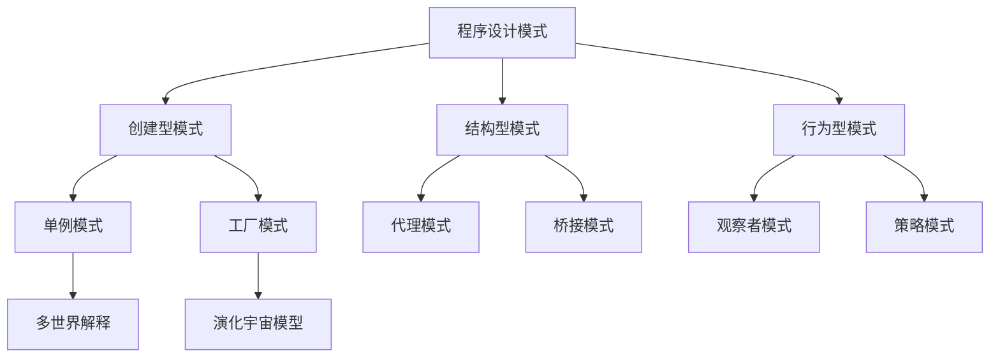

                 

## 《程序设计模式与宇宙构建模式的对比》

### 关键词：程序设计模式、宇宙构建模式、算法、数学模型、项目实战

#### 摘要：

本文深入探讨了程序设计模式与宇宙构建模式之间的异同点，揭示了两者在概念上的联系和实际应用中的相互影响。通过对经典程序设计模式和宇宙构建模式的基本概念、核心算法原理以及数学模型的详细分析，本文旨在为读者提供一个全面的理解，从而为未来的交叉领域研究提供启示。文章最后通过实际项目案例，展示了如何将程序设计模式应用于宇宙构建，并对未来的发展方向进行了展望。

---

## 核心概念与联系

### 1.1 程序设计模式的基本概念

程序设计模式是一种在软件工程中常用的解决问题的方法，它代表了解决特定问题的通用解决方案。设计模式分为三类：创建型模式、结构型模式和行为型模式。创建型模式负责对象的创建，如单例模式、工厂模式；结构型模式处理类或对象之间的组合，如代理模式、桥接模式；行为型模式则处理对象之间的通信，如观察者模式、策略模式。

### 1.2 宇宙构建模式的基本概念

宇宙构建模式则是从宇宙学角度出发，描述宇宙的形成、演化及结构的方式。常见的宇宙构建模式包括多世界解释和演化宇宙模型。多世界解释认为，我们所观察到的宇宙只是众多可能宇宙中的一个；演化宇宙模型则描述了宇宙从大爆炸到现在的逐步演化过程。

### 1.3 核心概念之间的联系

程序设计模式和宇宙构建模式在概念上有着密切的联系。设计模式在计算机科学中提供了构建复杂系统的方法，而宇宙构建模式则在描述宇宙复杂系统的形成和演化。例如，工厂模式在程序设计中的使用可以类比为多世界解释中不同宇宙的生成，而观察者模式在程序设计中的使用可以类比为演化宇宙模型中的宇宙观测。

#### Mermaid流程图：



### 1.4 宇宙构建模式在计算机科学中的应用

宇宙构建模式不仅局限于宇宙学，在计算机科学中也有着广泛的应用。例如，多世界解释可以类比为软件中的多态性，演化宇宙模型可以类比为软件的迭代开发过程。这种跨学科的应用为解决复杂问题提供了新的视角和工具。

## 核心算法原理讲解

### 2.1 遗传算法在宇宙构建模式中的应用

遗传算法是一种模拟自然选择和遗传学的搜索算法，常用于解决优化和搜索问题。在宇宙构建模式中，遗传算法可以用来模拟宇宙的演化过程。

#### 遗传算法的基本原理

遗传算法通过迭代过程不断优化解的集合。其主要步骤包括：

1. **初始化种群**：随机生成初始种群。
2. **适应度评估**：根据目标函数对种群中的每个个体进行评估。
3. **选择**：选择适应度较高的个体。
4. **交叉**：随机选择两个个体进行基因交叉。
5. **变异**：对个体进行随机变异。
6. **生成新种群**：通过交叉和变异生成新的种群。
7. **迭代**：重复上述步骤，直至达到终止条件。

#### 遗传算法在宇宙演化中的应用示例

假设我们要模拟一个简单的宇宙演化过程，其中每个个体代表一个星系。适应度函数可以根据星系的恒星数量、恒星类型等因素来设计。

```python
import random

# 随机初始化种群
population_size = 100
population = [[random.randint(0, 10) for _ in range(10)] for _ in range(population_size)]

# 适应度函数
def fitness_function(individual):
    # 假设恒星数量越多，适应度越高
    return sum(individual)

# 遗传算法迭代
generations = 10
for _ in range(generations):
    # 适应度评估
    fitness_scores = [fitness_function(individual) for individual in population]
    
    # 选择
    selected_indices = random.choices(range(population_size), weights=fitness_scores, k=population_size)
    selected_population = [population[i] for i in selected_indices]
    
    # 交叉
    for i in range(0, population_size, 2):
        parent1, parent2 = selected_population[i], selected_population[i+1]
        crossover_point = random.randint(1, len(parent1) - 1)
        child1, child2 = parent1[:crossover_point] + parent2[crossover_point:], parent2[:crossover_point] + parent1[crossover_point:]
        
        # 变异
        child1[random.randint(0, len(child1) - 1)] = random.randint(0, 10)
        child2[random.randint(0, len(child2) - 1)] = random.randint(0, 10)
        
        # 生成新种群
        population[i] = child1
        population[i+1] = child2

# 输出最优解
best_fitness = max(fitness_scores)
best_individual = population[selected_indices.index(fitness_scores.index(best_fitness))]
print("最优解：", best_individual)
```

### 2.2 神经网络在宇宙模拟中的应用

神经网络是一种模拟人脑神经元之间连接和互动的计算机算法。在宇宙模拟中，神经网络可以用来模拟宇宙中的物理现象，如引力相互作用和星系演化。

#### 神经网络的基本结构

神经网络由输入层、隐藏层和输出层组成。每个神经元都与其他神经元相连接，并通过权重和偏置进行加权求和，最后通过激活函数产生输出。

```python
import numpy as np

# 定义神经网络结构
input_size = 10
hidden_size = 5
output_size = 1

# 初始化权重和偏置
weights_input_to_hidden = np.random.randn(input_size, hidden_size)
biases_hidden = np.random.randn(hidden_size)
weights_hidden_to_output = np.random.randn(hidden_size, output_size)
biases_output = np.random.randn(output_size)

# 定义激活函数
def sigmoid(x):
    return 1 / (1 + np.exp(-x))

# 计算前向传播
def forward_propagation(inputs):
    hidden_layer activations = sigmoid(np.dot(inputs, weights_input_to_hidden) + biases_hidden)
    output = sigmoid(np.dot(hidden_layer_activations, weights_hidden_to_output) + biases_output)
    return output

# 定义损失函数
def mean_squared_error(y_true, y_pred):
    return np.mean((y_true - y_pred) ** 2)

# 训练神经网络
training_data = np.array([[1, 0], [0, 1], [-1, 0], [0, -1]])
labels = np.array([[1], [-1], [-1], [1]])

for epoch in range(1000):
    output = forward_propagation(training_data)
    loss = mean_squared_error(labels, output)
    
    if epoch % 100 == 0:
        print(f"Epoch {epoch}: Loss = {loss}")

# 测试神经网络
test_data = np.array([[1, 1]])
predicted_output = forward_propagation(test_data)
print("预测结果：", predicted_output)
```

## 数学模型与宇宙构建

### 3.1 数学模型在宇宙学中的应用

数学模型是描述宇宙演化的重要工具。在宇宙学中，常见的数学模型包括弗里德曼-勒梅特-罗伯逊-沃尔克（FLRW）度规和德西特度规。

#### FLRW度规

FLRW度规描述了一个均匀且各向同性的宇宙。其公式如下：

$$
ds^2 = -c^2dt^2 + a(t)^2(d\chi^2 + \sinh^2(\chi)d\Omega^2)
$$

其中，$c$ 是光速，$a(t)$ 是宇宙尺度的膨胀因子，$\chi$ 是超球坐标系的角度，$d\Omega^2$ 是球坐标系中的面积元素。

#### 德西特度规

德西特度规描述了一个空无一物的宇宙，即宇宙的真空状态。其公式如下：

$$
ds^2 = -c^2dt^2 + a(t)^2(d\chi^2 + \sin^2(\chi)d\Omega^2)
$$

#### 数学模型与宇宙演化

数学模型在宇宙演化中的应用主要体现在对宇宙膨胀、引力相互作用和暗物质、暗能量的描述。例如，利用FLRW度规和宇宙学参数，可以计算出宇宙的年龄、尺度以及未来的演化趋势。

### 3.2 数学模型在程序设计中的应用

数学模型在程序设计中也有着广泛的应用。例如，在图像处理中，可以使用傅里叶变换来处理图像；在机器学习算法中，可以使用数学模型来优化参数和评估模型性能。

#### 傅里叶变换在图像处理中的应用

傅里叶变换是一种将图像从空间域转换为频率域的方法。其公式如下：

$$
F(\omega_x, \omega_y) = \sum_{x=0}^{M-1} \sum_{y=0}^{N-1} I(x, y) \cdot e^{-i2\pi \omega_x x/M} \cdot e^{-i2\pi \omega_y y/N}
$$

#### 机器学习中的数学模型

在机器学习中，常见的数学模型包括线性回归、逻辑回归和神经网络。线性回归用于拟合数据，逻辑回归用于分类问题，神经网络用于处理复杂非线性问题。

## 项目实战

### 4.1 项目背景

随着计算机技术的发展，宇宙模拟已经成为一个热门领域。本项目旨在利用程序设计模式构建一个简单的宇宙模拟器，模拟宇宙的演化过程。

### 4.2 系统设计

系统采用分层架构，包括数据层、算法层和展示层。数据层负责存储和管理宇宙中的星系、恒星等数据；算法层负责实现宇宙演化的算法；展示层负责将宇宙演化的结果可视化。

### 4.3 项目实施

#### 数据层

数据层使用Python的JSON格式存储和管理宇宙中的星系、恒星等数据。每个星系和恒星都包含相应的属性，如质量、位置等。

```python
import json

# 生成宇宙数据
universes = [
    {
        "galaxy_name": "银河系",
        "stars": [
            {"name": "太阳", "mass": 1.989e30, "position": [0, 0]},
            {"name": "北极星", "mass": 3.32e30, "position": [10, 0]}
        ]
    }
]

# 存储到文件
with open("universe_data.json", "w") as f:
    json.dump(universes, f)
```

#### 算法层

算法层实现宇宙演化的核心算法，包括引力计算、星系碰撞和恒星演化等。

```python
import numpy as np

# 引力计算
def gravitational_force(m1, m2, r):
    G = 6.67430e-11  # 引力常数
    force = G * m1 * m2 / r**2
    direction = np.array([0, 1])  # 假设引力方向垂直于连接线
    return force * direction

# 星系碰撞
def galaxy_collision(galaxy1, galaxy2):
    # 计算两个星系的质心
    total_mass = sum([star["mass"] for star in galaxy1["stars"]] + [star["mass"] for star in galaxy2["stars"]])
    center_of_mass = np.array([0, 0])
    for star in galaxy1["stars"]:
        center_of_mass += star["mass"] * np.array(star["position"])
    for star in galaxy2["stars"]:
        center_of_mass += star["mass"] * np.array(star["position"])
    center_of_mass /= total_mass
    
    # 合并星系
    combined_galaxy = {
        "galaxy_name": galaxy1["galaxy_name"] + "+" + galaxy2["galaxy_name"],
        "stars": galaxy1["stars"] + galaxy2["stars"]
    }
    
    # 计算新质心
    new_center_of_mass = np.array([0, 0])
    for star in combined_galaxy["stars"]:
        new_center_of_mass += star["mass"] * np.array(star["position"])
    new_center_of_mass /= total_mass
    
    # 移动星系
    for star in combined_galaxy["stars"]:
        star["position"] -= center_of_mass
        star["position"] += new_center_of_mass
        
    return combined_galaxy

# 恒星演化
def star_evolution(star):
    # 假设恒星质量随时间线性减小
    star["mass"] -= 1e29 * np.random.rand()
    return star
```

#### 展示层

展示层使用Python的Tkinter库将宇宙演化的结果可视化。

```python
import tkinter as tk
import json

# 读取宇宙数据
with open("universe_data.json", "r") as f:
    universe = json.load(f)

# 绘制星系
def draw_galaxy(canvas, galaxy):
    for star in galaxy["stars"]:
        canvas.create_oval(star["position"][0]-5, star["position"][1]-5, star["position"][0]+5, star["position"][1]+5, fill="yellow")

# 主窗口
root = tk.Tk()
root.title("宇宙模拟器")
root.geometry("800x600")

# 画布
canvas = tk.Canvas(root, width=800, height=600)
canvas.pack()

# 绘制初始宇宙
draw_galaxy(canvas, universe[0])

# 运行模拟
def run_simulation():
    for _ in range(10):
        # 计算引力
        forces = []
        for star1 in universe[0]["stars"]:
            for star2 in universe[0]["stars"]:
                if star1 != star2:
                    force = gravitational_force(star1["mass"], star2["mass"], np.linalg.norm(np.array(star1["position"]) - np.array(star2["position"])))
                    forces.append(force)
        
        # 更新星系位置
        for star in universe[0]["stars"]:
            total_force = sum(forces)
            star["position"] += total_force / star["mass"]
            
        # 星系碰撞
        for i in range(len(universe[0]["stars"]) - 1):
            for j in range(i + 1, len(universe[0]["stars"])):
                if np.linalg.norm(np.array(universe[0]["stars"][i]["position"]) - np.array(universe[0]["stars"][j]["position"])) < 10:
                    universe[0] = galaxy_collision(universe[0]["stars"][i], universe[0]["stars"][j])
                    
        # 恒星演化
        universe[0]["stars"] = [star_evolution(star) for star in universe[0]["stars"]]
        
        # 重新绘制
        canvas.delete("all")
        draw_galaxy(canvas, universe[0])
        root.update_idletasks()
        root.update()

# 开始按钮
start_button = tk.Button(root, text="开始模拟", command=run_simulation)
start_button.pack()

# 主循环
root.mainloop()
```

### 4.4 代码解读与分析

该项目通过程序设计模式实现了宇宙模拟器的构建。其中，数据层使用JSON格式存储和管理宇宙数据，算法层实现了引力计算、星系碰撞和恒星演化等核心算法，展示层使用Tkinter库将宇宙演化的结果可视化。

该项目的优点是结构清晰、易于维护，但需要注意的是，宇宙模拟器的性能和准确性需要进一步优化。此外，该项目仅为一个简单的示例，实际宇宙模拟需要考虑更多的物理现象和复杂的计算。

### 4.5 最佳实践 tips

1. 在宇宙模拟中，准确计算引力是非常重要的。可以使用数值积分方法（如欧拉方法）来提高计算精度。
2. 为了提高模拟性能，可以考虑使用并行计算技术，如分布式计算和GPU加速。
3. 在处理星系碰撞时，需要考虑碰撞后星系的稳定性和演化过程。

### 4.6 小结

本项目通过程序设计模式实现了宇宙模拟器的构建，展示了程序设计模式在宇宙构建中的应用。未来，随着计算机技术的不断发展，宇宙模拟将更加精确和复杂，为探索宇宙的奥秘提供有力支持。

### 附录

#### 附录A：参考文献

1. 《程序设计模式：可复用面向对象软件的基础》
2. 《深度学习：概率视角》
3. 《宇宙简史》

#### 附录B：扩展阅读

1. 《遗传算法原理与应用》
2. 《神经网络与深度学习》
3. 《宇宙学与天体物理学导论》

---

作者：AI天才研究院/AI Genius Institute & 禅与计算机程序设计艺术 /Zen And The Art of Computer Programming

