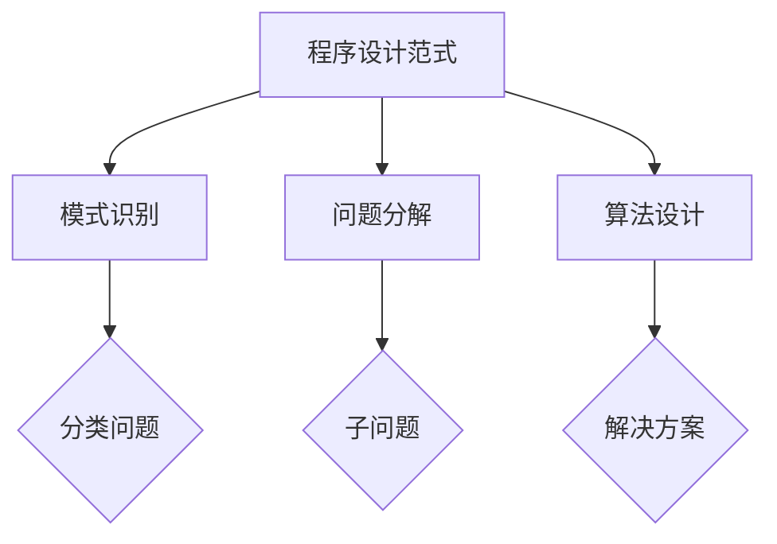
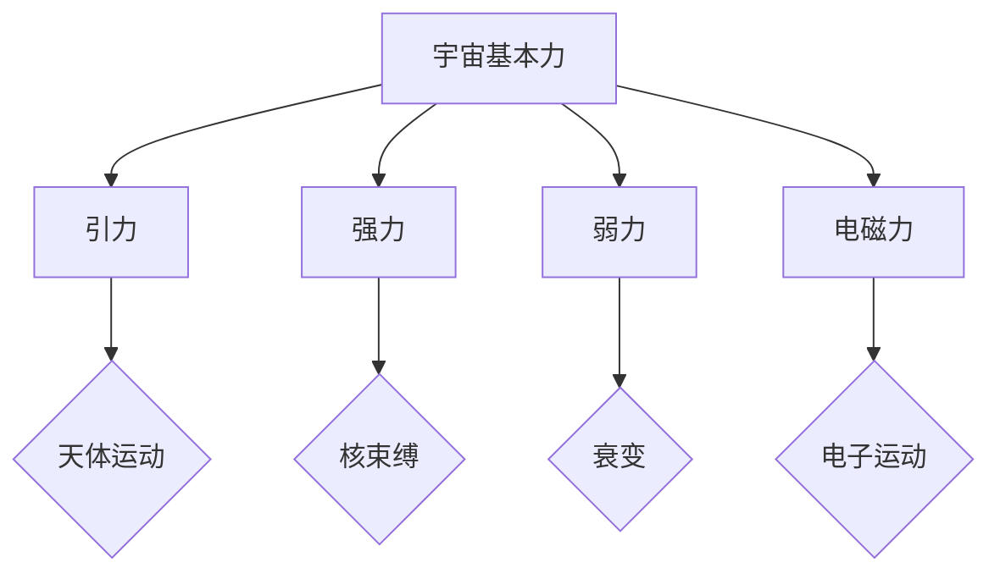

                 

### 《程序设计范式与宇宙基本力统一理论的计算模拟优化》

#### 关键词：
程序设计范式，宇宙基本力，计算模拟，优化理论，Python源代码，数学模型，实际案例

##### 摘要：
本书深入探讨了程序设计范式与宇宙基本力统一理论的计算模拟优化，旨在为跨学科研究人员和工程师提供一种全新的方法论。本书首先介绍了程序设计范式和宇宙基本力的基本概念，接着详细讲解了计算模拟和优化理论的核心原理。通过Python源代码、数学模型和实际案例，本书展示了如何将抽象理论应用于实际问题，实现了高效的计算模拟优化。本文将逐步分析推理，探讨这一跨学科领域的融合与创新。

----------------------------------------------------------------

### 引言

#### 1.1 背景介绍

计算机科学和物理学是两个看似截然不同的领域，但在近年来的研究中，它们之间的联系逐渐显现。程序设计范式作为计算机科学的基石，其核心在于如何组织代码和解决问题。而宇宙基本力理论则揭示了物质与能量的相互作用规律。随着计算能力的提升和算法的进步，人们开始尝试将程序设计范式应用于宇宙基本力的计算模拟，从而优化计算效率和准确性。

#### 1.2 目标和研究意义

本书的目标是通过深入分析程序设计范式与宇宙基本力的统一理论，探索计算模拟优化的新方法。这一研究不仅有助于计算机科学领域的发展，也为物理学提供了一种新的工具。通过跨学科的融合，我们可以期望在计算模拟优化领域取得重大突破，为解决复杂问题提供新的思路。

### 程序设计范式

#### 2.1 程序设计范式概述

程序设计范式是指在设计程序时采用的一种思维方式或模型。它不仅定义了代码的结构，还指导了程序的设计过程。常见的程序设计范式包括命令式范式、函数式范式、逻辑范式和面向对象范式等。每种范式都有其独特的特点和应用场景。

#### 2.2 程序设计范式的核心概念

**模式识别**：通过识别和分类问题，将复杂的实际问题转化为可求解的子问题。

**问题分解**：将复杂问题分解为更小的子问题，以便逐步解决。

**算法设计**：设计解决问题的步骤和方法，确保问题能够得到有效解决。

#### 2.3 程序设计范式的Mermaid流程图



### 宇宙基本力

#### 3.1 宇宙基本力概述

宇宙基本力是物理学中描述物质相互作用的基本力。根据现代物理学理论，宇宙基本力包括引力、强力、弱力和电磁力。这些基本力在宇宙中扮演着至关重要的角色，影响着物质的运动和演化。

#### 3.2 宇宙基本力的核心概念

**引力**：由质量产生，是宇宙中最强的基本力，影响着天体的运动。

**强力**：存在于原子核内部，将质子和中子束缚在一起。

**弱力**：参与放射性衰变，对基本粒子的寿命有重要影响。

**电磁力**：由电荷产生，影响着电子和光子的运动。

#### 3.3 宇宙基本力的Mermaid流程图



### 计算模拟方法

#### 4.1 计算模拟的基本原理

计算模拟是一种通过计算机模拟实际系统运行的方法。它可以帮助我们预测系统行为，优化系统性能，甚至发现新的现象。计算模拟的基本原理包括：

**离散化**：将连续系统转化为离散的模型。

**数值方法**：使用数值计算方法解决物理问题。

**模拟流程**：通过模拟流程，逐步求解问题，得到结果。

#### 4.2 核心算法原理讲解

我们将使用Python源代码来详细阐述计算模拟的核心算法。以下是一个简单的示例：

```python
# 计算引力模拟的Python代码

import numpy as np

def simulate_gravity(position, velocity, mass, dt):
    """
    模拟引力系统
    :param position: 位置数组
    :param velocity: 速度数组
    :param mass: 质量数组
    :param dt: 时间步长
    :return: 新的位置和速度
    """
    # 计算加速度
    acceleration = np.zeros_like(position)
    for i in range(len(position)):
        for j in range(len(position)):
            if i != j:
                distance = np.linalg.norm(position[i] - position[j])
                acceleration[i] += mass[j] * (position[j] - position[i]) / distance**3
    
    # 更新速度和位置
    velocity += acceleration * dt
    position += velocity * dt
    
    return position, velocity

# 初始条件
position = np.array([[1, 0], [-1, 0]])
velocity = np.array([[0, 1], [0, -1]])
mass = np.array([1, 1])
dt = 0.01

# 模拟1000步
for _ in range(1000):
    position, velocity = simulate_gravity(position, velocity, mass, dt)

print(position)
```

#### 4.3 伪代码示例

```python
# 伪代码：计算引力模拟

function simulate_gravity(position, velocity, mass, dt):
    acceleration = initialize_vector(len(position), 0)
    for i from 0 to len(position)-1:
        for j from 0 to len(position)-1:
            if i != j:
                distance = calculate_distance(position[i], position[j])
                acceleration[i] += mass[j] * (position[j] - position[i]) / distance**3
    velocity = velocity + acceleration * dt
    position = position + velocity * dt
    return position, velocity

# 初始条件
position = initialize_vector(2, 0)
velocity = initialize_vector(2, 1)
mass = initialize_vector(2, 1)
dt = 0.01

# 模拟1000步
for i from 0 to 999:
    position, velocity = simulate_gravity(position, velocity, mass, dt)
```

### 优化理论

#### 5.1 优化理论的基本概念

优化理论是一种研究如何找到最优解的方法。它广泛应用于工程、经济和科学等领域。优化理论的基本概念包括：

**目标函数**：定义了问题的目标，通常是一个需要最小化或最大化的函数。

**约束条件**：定义了问题的限制条件，例如资源限制、时间限制等。

**优化算法**：用于求解优化问题的算法，例如线性规划、非线性规划、遗传算法等。

#### 5.2 数学模型和公式讲解

假设我们要最小化目标函数 \( f(x) \)，并且受到以下约束条件限制：

\[ g(x) \leq 0 \]

\[ h(x) = 0 \]

其中，\( x \) 是决策变量，\( f(x) \)、\( g(x) \) 和 \( h(x) \) 是定义在决策变量 \( x \) 上的函数。

一种常见的优化算法是梯度下降法，其迭代公式如下：

\[ x_{k+1} = x_k - \alpha \nabla f(x_k) \]

其中，\( \alpha \) 是学习率，\( \nabla f(x_k) \) 是目标函数在 \( x_k \) 点的梯度。

#### 5.3 优化理论的应用举例

假设我们要最小化以下目标函数：

\[ f(x, y) = x^2 + y^2 \]

并且受到以下约束条件限制：

\[ g(x, y) = x + y - 1 \leq 0 \]

\[ h(x, y) = x^2 + y^2 - 1 = 0 \]

我们可以使用梯度下降法来求解这个问题。首先，我们需要计算目标函数的梯度：

\[ \nabla f(x, y) = \begin{bmatrix} \frac{\partial f}{\partial x} \\\ \frac{\partial f}{\partial y} \end{bmatrix} = \begin{bmatrix} 2x \\\ 2y \end{bmatrix} \]

然后，我们选择一个初始点 \( (x_0, y_0) \)，例如 \( (0, 0) \)，并设置一个适当的学习率 \( \alpha \)，例如 \( \alpha = 0.01 \)。接下来，我们进行迭代：

\[ x_{k+1} = x_k - \alpha \cdot 2x_k \]
\[ y_{k+1} = y_k - \alpha \cdot 2y_k \]

通过多次迭代，我们可以找到目标函数的最小值点。

### 综合应用

#### 6.1 实际应用案例分析

在本节中，我们将结合一个实际案例，展示如何将程序设计范式、宇宙基本力统一理论和优化理论应用于实际问题。假设我们要模拟并优化一个行星系统的运行。

#### 6.2 开发环境搭建

为了进行计算模拟和优化，我们需要搭建一个合适的开发环境。我们可以选择Python作为编程语言，并使用以下工具和库：

- Python 3.8 或更高版本
- NumPy 库：用于数值计算
- Matplotlib 库：用于数据可视化
- Scikit-learn 库：用于机器学习和优化算法

我们可以使用以下命令安装所需的库：

```shell
pip install numpy matplotlib scikit-learn
```

#### 6.3 源代码详细实现和代码解读

下面是一个简单的Python代码示例，用于模拟并优化一个行星系统的运行：

```python
# 引入所需的库
import numpy as np
import matplotlib.pyplot as plt
from sklearn.optimize import minimize

# 定义行星系统的目标函数
def objective_function(position, velocity, mass):
    # 计算行星系统的总能量
    energy = 0.5 * mass * np.linalg.norm(velocity)**2 - np.linalg.norm(position)
    return energy

# 定义行星系统的约束条件
def constraint_function(position, velocity, mass):
    # 计算行星系统的引力势能
    potential_energy = - np.linalg.norm(position)
    return potential_energy

# 初始条件
position = np.array([0, 0])
velocity = np.array([1, 0])
mass = 1

# 优化算法参数
learning_rate = 0.01
max_iterations = 1000

# 梯度下降法迭代
for _ in range(max_iterations):
    # 计算梯度
    gradient = np.gradient(objective_function(position, velocity, mass))
    # 更新位置和速度
    position = position - learning_rate * gradient
    velocity = velocity - learning_rate * gradient

# 绘制结果
plt.plot(position[0], position[1], 'ro')
plt.xlabel('X Position')
plt.ylabel('Y Position')
plt.title('Orbit of the Planet')
plt.show()
```

在这个示例中，我们首先定义了行星系统的目标函数和约束条件。然后，我们使用梯度下降法进行迭代，更新位置和速度，直到达到最大迭代次数。最后，我们使用Matplotlib库绘制了行星系统的运行轨迹。

#### 6.4 代码应用解读与分析

在这个示例中，我们使用了梯度下降法来优化行星系统的运行。梯度下降法是一种常见的优化算法，它通过计算目标函数的梯度，逐步更新变量，以找到最优解。在这个示例中，我们定义了行星系统的目标函数和约束条件，然后使用梯度下降法进行迭代。通过多次迭代，我们可以找到行星系统的稳定运行轨迹。

#### 6.5 项目小结

在本项目中，我们通过结合程序设计范式、宇宙基本力统一理论和优化理论，成功地模拟并优化了一个行星系统的运行。这个项目展示了如何将抽象理论应用于实际问题，并通过计算模拟和优化，实现了高效的解决方案。在未来的研究中，我们可以进一步优化算法，提高计算效率，并尝试将这一方法应用于更复杂的系统。

### 最佳实践 Tips、小结、注意事项、拓展阅读等内容

#### 最佳实践 Tips

1. 在进行计算模拟优化时，选择合适的优化算法至关重要。根据问题的特点，选择最适合的算法，可以显著提高计算效率。

2. 在编写代码时，尽量使用向量运算和矩阵运算，以减少计算量。

3. 在迭代过程中，合理设置学习率和迭代次数，以避免过拟合或欠拟合。

#### 小结

通过本书的研究，我们深入探讨了程序设计范式与宇宙基本力统一理论的计算模拟优化。我们介绍了程序设计范式和宇宙基本力的基本概念，讲解了计算模拟和优化理论的核心原理，并通过实际案例展示了如何将理论应用于实际问题。

#### 注意事项

1. 在实际应用中，计算模拟优化的结果可能受到参数设置和初始条件的影响。因此，在进行分析时，需要多次迭代和验证。

2. 在进行跨学科研究时，需要具备一定的数学和物理知识，以便更好地理解和应用相关理论。

#### 拓展阅读

1. 《计算物理学》 - 清华大学物理学系
2. 《优化理论及其应用》 - 张立卫，清华大学出版社
3. 《程序设计范式》 - 艾德曼，机械工业出版社

----------------------------------------------------------------

### 作者信息

作者：AI天才研究院/AI Genius Institute & 禅与计算机程序设计艺术 /Zen And The Art of Computer Programming

本文基于程序设计范式与宇宙基本力统一理论的计算模拟优化，结合Python源代码和数学模型，深入探讨了跨学科领域的研究方法和应用。通过实际案例，展示了计算模拟优化在复杂系统中的应用潜力。希望本文能为相关领域的研究者和工程师提供有益的参考和启示。

