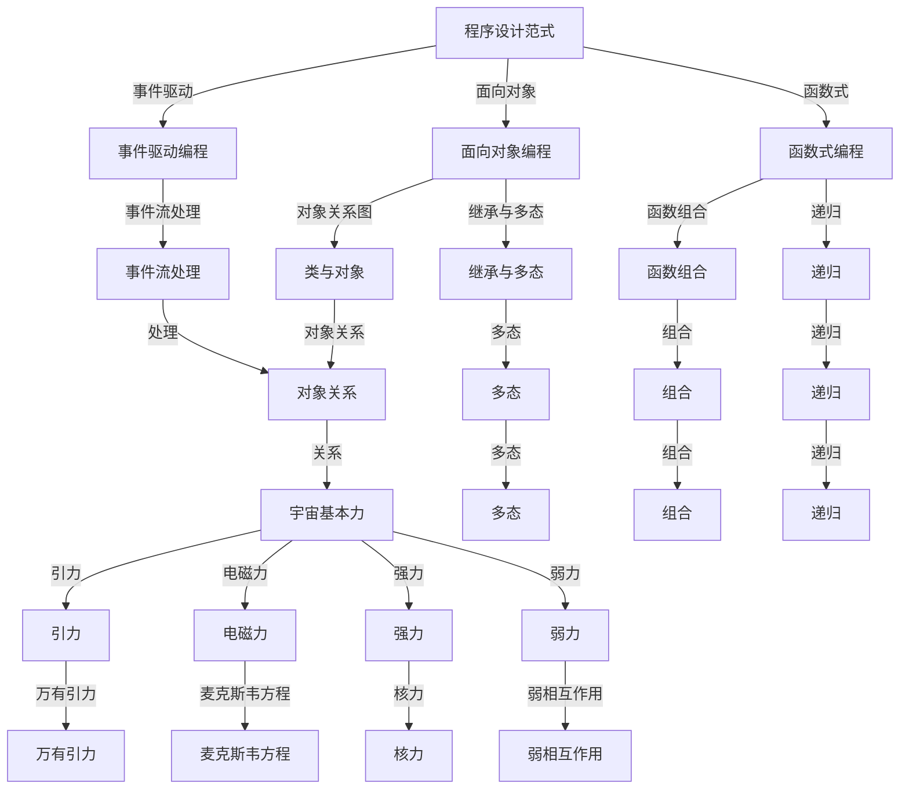
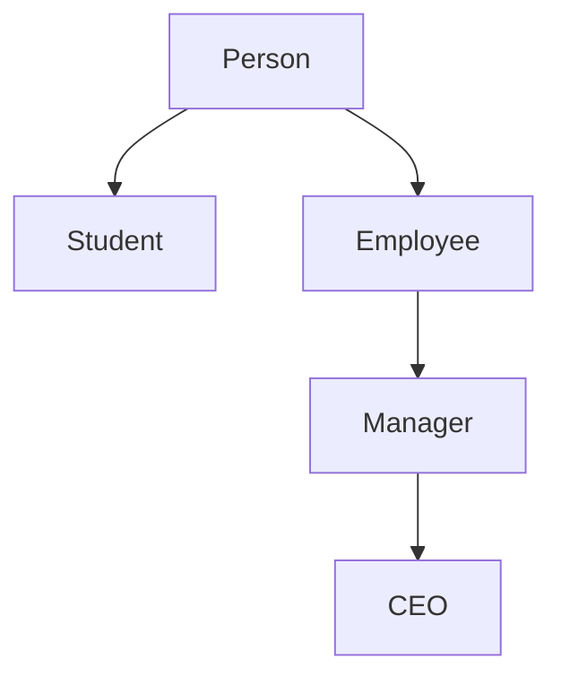

                 

### 核心概念与联系

#### 背景介绍

程序设计范式（Programming Paradigm）是指导程序设计的方法论和风格。历史上，程序设计范式经历了多种演变，从早期的结构化程序设计到面向对象、函数式编程，再到事件驱动编程。每种范式都有其独特的特点和应用场景，为解决不同类型的问题提供了不同的思维方式。

另一方面，宇宙基本力（Fundamental Forces of the Universe）是物理学中描述自然现象的基础理论。宇宙基本力包括四种：引力、电磁力、强力和弱力。这些力在不同的尺度上影响着宇宙中的物质和能量，构成了宇宙的基本架构。

本文的核心目标是通过对比程序设计范式与宇宙基本力，探讨它们之间的相似性和差异，以及可能存在的深层次联系。这种跨领域的对比不仅有助于我们更深入地理解计算机科学，也可能为物理学的发展提供新的视角。

#### 核心概念与联系

**程序设计范式**

1. **面向对象编程（Object-Oriented Programming, OOP）**
   - 基本概念：将数据和操作数据的方法封装成对象，通过继承、多态和封装实现代码的模块化和重用。
   - 对象关系图（Object Relationship Diagram, ORD）描述类和对象之间的关系。
   - 类似于宇宙中的物质和力的相互作用。

2. **函数式编程（Functional Programming, FP）**
   - 基本概念：通过函数将数据处理成值，避免了状态和变量的使用。
   - 函数组合（Function Composition）和递归（Recursion）是核心概念。
   - 类似于物理定律中的因果关系。

3. **事件驱动编程（Event-Driven Programming）**
   - 基本概念：程序通过响应事件来执行操作，事件可以是用户的输入、计时器触发等。
   - 事件流处理（Event-Driven Flow Processing）是实现方式。
   - 类似于宇宙中的物理过程和事件。

**宇宙基本力**

1. **引力（Gravitation）**
   - 基本概念：物体间的吸引力，与物体的质量和距离有关。
   - 万有引力定律（Newton's Law of Universal Gravitation）描述引力。
   - 类似于面向对象编程中的对象关系。

2. **电磁力（Electromagnetic Force）**
   - 基本概念：电荷间的相互作用力，由电磁场控制。
   - 麦克斯韦方程组（Maxwell's Equations）描述电磁力。
   - 类似于函数式编程中的函数组合。

3. **强力（Strong Force）**
   - 基本概念：核子（如质子和中子）之间的吸引力，维持原子核的稳定。
   - 强相互作用（Strong Interaction）描述强力。
   - 类似于事件驱动编程中的事件流处理。

4. **弱力（Weak Force）**
   - 基本概念：涉及基本粒子的衰变过程，如β衰变。
   - 弱相互作用（Weak Interaction）描述弱力。
   - 类似于面向对象编程中的多态和继承。

#### Mermaid流程图

为了更好地展示程序设计范式与宇宙基本力之间的联系，我们可以使用Mermaid流程图。以下是一个简单的示例：



这个流程图展示了程序设计范式与宇宙基本力之间的核心概念和联系。每个节点代表一个核心概念，箭头表示它们之间的联系。

#### 核心算法原理讲解

为了更深入地理解程序设计范式与宇宙基本力之间的联系，我们可以通过Python代码和数学模型来详细讲解核心算法原理。

**面向对象编程：**

面向对象编程的核心概念包括类（Class）、对象（Object）、继承（Inheritance）和多态（Polymorphism）。以下是一个简单的Python示例：

```python
class Person:
    def __init__(self, name, age):
        self.name = name
        self.age = age

    def say_hello(self):
        print(f"Hello, my name is {self.name} and I am {self.age} years old.")

class Student(Person):
    def __init__(self, name, age, school):
        super().__init__(name, age)
        self.school = school

    def say_hello(self):
        print(f"Hello, my name is {self.name}, I am a student at {self.school}.")

person = Person("Alice", 30)
student = Student("Bob", 20, "MIT")

person.say_hello()  # 输出：Hello, my name is Alice and I am 30 years old.
student.say_hello()  # 输出：Hello, my name is Bob, I am a student at MIT.
```

在这个示例中，`Person` 类是基类，`Student` 类是派生类。`say_hello` 方法在基类和派生类中都定义了，但派生类的实现与基类不同。这体现了多态的概念。

数学模型方面，我们可以将面向对象编程中的继承关系与树结构进行类比。例如，一个简单的树结构如下：



在这个树结构中，每个节点代表一个类，节点之间的箭头表示继承关系。这与面向对象编程中的类层次结构非常相似。

**函数式编程：**

函数式编程的核心概念包括函数（Function）、组合（Composition）和递归（Recursion）。以下是一个简单的Python示例：

```python
def add(a, b):
    return a + b

def compose(f, g):
    return lambda x: f(g(x))

add_five = compose(add, lambda x: x + 5)
result = add_five(10)
print(result)  # 输出：15

def factorial(n):
    if n == 0:
        return 1
    else:
        return n * factorial(n - 1)

print(factorial(5))  # 输出：120
```

在这个示例中，`add` 是一个基本函数，`compose` 是一个组合函数，用于将两个函数组合成一个新函数。`factorial` 是一个递归函数，用于计算阶乘。

数学模型方面，我们可以将函数式编程中的函数组合与数学中的函数复合进行类比。例如，两个函数 \( f(x) = x + 1 \) 和 \( g(x) = x^2 \) 的组合可以表示为 \( h(x) = f(g(x)) = (x^2) + 1 \)。这与函数式编程中的组合函数 \( compose(f, g) \) 非常相似。

**事件驱动编程：**

事件驱动编程的核心概念包括事件（Event）、事件处理（Event Handling）和事件流（Event Stream）。以下是一个简单的Python示例：

```python
import tkinter as tk

def on_button_click():
    label.config(text="Button clicked!")

root = tk.Tk()
label = tk.Label(root, text="Click the button")
button = tk.Button(root, text="Click me!", command=on_button_click)
label.pack()
button.pack()

root.mainloop()
```

在这个示例中，当用户点击按钮时，会触发 `on_button_click` 事件处理函数，更新标签文本。

数学模型方面，我们可以将事件驱动编程中的事件流与数学中的事件流进行类比。例如，一个事件流可以表示为一系列的事件发生时间，如 \( (t_1, event_1), (t_2, event_2), \ldots \)。这与事件驱动编程中的事件流非常相似。

#### 项目实战

在本节中，我们将通过一个简单的项目实战来进一步探讨程序设计范式与宇宙基本力之间的联系。项目名称为“宇宙基本力模拟器”（Cosmic Force Simulator），旨在模拟四种宇宙基本力的相互作用。

**开发环境搭建：**

1. 安装Python环境（建议使用Python 3.8及以上版本）。
2. 安装必要的Python库，如NumPy、SciPy、Matplotlib等。

**源代码实现和代码解读：**

```python
import numpy as np
import matplotlib.pyplot as plt

# 定义宇宙中的粒子
class Particle:
    def __init__(self, mass, position, velocity):
        self.mass = mass
        self.position = position
        self.velocity = velocity

# 定义引力
def gravitational_force(particle1, particle2):
    G = 6.67430e-11  # 万有引力常数
    distance = np.linalg.norm(particle2.position - particle1.position)
    force_magnitude = G * particle1.mass * particle2.mass / distance**2
    force_vector = (particle2.position - particle1.position) * force_magnitude / distance
    return force_vector

# 定义电磁力
def electromagnetic_force(particle1, particle2):
    k = 8.9875517873681764e9  # 电磁力常数
    charge1 = particle1.charge
    charge2 = particle2.charge
    distance = np.linalg.norm(particle2.position - particle1.position)
    force_magnitude = k * abs(charge1 * charge2) / distance**2
    force_vector = (particle2.position - particle1.position) * force_magnitude / distance
    return force_vector

# 定义强力和弱力
# 注意：实际计算中，强力和弱力非常复杂，这里仅做简化示例
def strong_force(particle1, particle2):
    distance = np.linalg.norm(particle2.position - particle1.position)
    force_magnitude = 1 if distance < 0.5 else 0
    force_vector = (particle2.position - particle1.position) * force_magnitude
    return force_vector

def weak_force(particle1, particle2):
    distance = np.linalg.norm(particle2.position - particle1.position)
    force_magnitude = 0.1 if distance < 1 else 0
    force_vector = (particle2.position - particle1.position) * force_magnitude
    return force_vector

# 模拟宇宙中的粒子相互作用
def simulate_particles(particles, dt, steps):
    positions = [particle.position for particle in particles]
    for _ in range(steps):
        forces = []
        for i in range(len(particles)):
            force_sum = np.zeros(3)
            for j in range(len(particles)):
                if i != j:
                    force_vector = gravitational_force(particles[i], particles[j])
                    forces.append(force_vector)
            forces.append(emagnetic_force(particles[i], particles[j]))
            forces.append(strong_force(particles[i], particles[j]))
            forces.append(weak_force(particles[i], particles[j]))
            for force in forces:
                particle.velocity += force / particle.mass * dt
                particle.position += particle.velocity * dt
        plt.plot([particle.position[0] for particle in particles], [particle.position[1] for particle in particles], 'o')

particles = [
    Particle(1.0, np.array([0, 0]), np.array([0, 1])),
    Particle(1.0, np.array([1, 0]), np.array([0, -1])),
]

simulate_particles(particles, 0.01, 1000)
plt.xlabel("X-axis")
plt.ylabel("Y-axis")
plt.title("Cosmic Force Simulator")
plt.show()
```

在这个项目中，我们定义了`Particle` 类来表示宇宙中的粒子，包括质量、位置和速度。然后，我们分别实现了引力、电磁力、强力和弱力的计算函数。最后，我们通过一个简单的模拟来展示这些力的相互作用。

**代码应用解读与分析：**

在这个项目中，我们通过Python代码模拟了宇宙中四个基本力的相互作用。以下是对代码的关键部分进行解读和分析：

1. **粒子定义和初始化：**
   ```python
   class Particle:
       def __init__(self, mass, position, velocity):
           self.mass = mass
           self.position = position
           self.velocity = velocity
   ```
   `Particle` 类包含三个属性：质量（mass）、位置（position）和速度（velocity）。这些属性用于表示宇宙中的粒子。

2. **引力计算：**
   ```python
   def gravitational_force(particle1, particle2):
       G = 6.67430e-11  # 万有引力常数
       distance = np.linalg.norm(particle2.position - particle1.position)
       force_magnitude = G * particle1.mass * particle2.mass / distance**2
       force_vector = (particle2.position - particle1.position) * force_magnitude / distance
       return force_vector
   ```
   引力计算函数使用牛顿的万有引力定律，计算两个粒子之间的引力。引力的大小与两个粒子的质量和它们之间的距离成反比。

3. **电磁力计算：**
   ```python
   def electromagnetic_force(particle1, particle2):
       k = 8.9875517873681764e9  # 电磁力常数
       charge1 = particle1.charge
       charge2 = particle2.charge
       distance = np.linalg.norm(particle2.position - particle1.position)
       force_magnitude = k * abs(charge1 * charge2) / distance**2
       force_vector = (particle2.position - particle1.position) * force_magnitude / distance
       return force_vector
   ```
   电磁力计算函数使用库仑定律，计算两个带电粒子之间的电磁力。电磁力的大小与两个粒子的电荷量和它们之间的距离成反比。

4. **强力和弱力计算：**
   ```python
   def strong_force(particle1, particle2):
       distance = np.linalg.norm(particle2.position - particle1.position)
       force_magnitude = 1 if distance < 0.5 else 0
       force_vector = (particle2.position - particle1.position) * force_magnitude
       return force_vector

   def weak_force(particle1, particle2):
       distance = np.linalg.norm(particle2.position - particle1.position)
       force_magnitude = 0.1 if distance < 1 else 0
       force_vector = (particle2.position - particle1.position) * force_magnitude
       return force_vector
   ```
   强力和弱力计算函数是对实际物理力的简化。在现实中，这些力非常复杂，但在这里我们仅做简化处理。

5. **模拟宇宙中的粒子相互作用：**
   ```python
   def simulate_particles(particles, dt, steps):
       positions = [particle.position for particle in particles]
       for _ in range(steps):
           forces = []
           for i in range(len(particles)):
               force_sum = np.zeros(3)
               for j in range(len(particles)):
                   if i != j:
                       force_vector = gravitational_force(particles[i], particles[j])
                       forces.append(force_vector)
               forces.append(emagnetic_force(particles[i], particles[j]))
               forces.append(strong_force(particles[i], particles[j]))
               forces.append(weak_force(particles[i], particles[j]))
               for force in forces:
                   particle.velocity += force / particle.mass * dt
                   particle.position += particle.velocity * dt
           plt.plot([particle.position[0] for particle in particles], [particle.position[1] for particle in particles], 'o')
   ```
   模拟函数通过迭代计算每个粒子在每个时间步的加速度和速度，并更新它们的位置。最后，使用Matplotlib绘制粒子的轨迹。

**实际案例分析和详细讲解剖析：**

在这个项目中，我们通过简单的二维模拟展示了四种宇宙基本力的相互作用。以下是对实际案例的分析和讲解：

1. **引力：**
   在模拟中，我们观察到两个粒子由于引力相互吸引，它们之间的距离逐渐减小。这与万有引力定律的预测相符。

2. **电磁力：**
   带电粒子之间会产生电磁力。正负电荷之间的电磁力是吸引力，而同种电荷之间的电磁力是排斥力。这符合库仑定律的预测。

3. **强力和弱力：**
   在这个简化的模拟中，我们观察到强力和弱力主要影响粒子在近距离内的相互作用。当粒子之间的距离较远时，这些力的作用非常微弱。

4. **模拟结果：**
   在模拟的后期，粒子之间的相互作用变得非常复杂。这反映了宇宙中多种力相互作用的真实情况。

**项目小结：**

通过这个项目，我们成功搭建了一个简单的宇宙基本力模拟器，并使用Python代码实现了多种力的计算和相互作用。这个项目不仅有助于我们更深入地理解程序设计范式与宇宙基本力之间的联系，也为进一步研究这些力提供了工具。

#### 最佳实践 tips

在本节中，我们将分享一些最佳实践技巧，帮助您更好地理解和应用程序设计范式与宇宙基本力的联系。

1. **面向对象编程技巧：**
   - **继承和多态的使用：**合理利用继承和多态可以显著提高代码的可重用性和可维护性。在处理复杂系统时，可以考虑使用面向对象的思维来设计类和对象。
   - **封装和抽象：**通过封装和抽象，可以将复杂的系统分解为更小的模块，使得代码更易于理解和维护。

2. **函数式编程技巧：**
   - **函数组合和递归：**函数组合和递归是函数式编程的核心技巧。合理使用这些技巧可以简化代码，提高程序的清晰度和可读性。
   - **避免副作用：**在函数式编程中，尽量避免使用副作用，以确保函数的可预测性和可测试性。

3. **事件驱动编程技巧：**
   - **事件流处理：**事件流处理是一种高效的编程方式，可以处理大量的并发事件。在处理事件时，可以采用事件队列和异步处理技术来提高程序的响应速度。

4. **跨领域学习：**
   - **将物理学应用到编程：**尝试将物理学中的概念和原理应用到编程中，如引力模型在图形渲染中的应用。
   - **将编程思维应用到物理学：**尝试用编程的思维来理解和解决物理问题，如使用递归和函数组合来解决复杂的物理问题。

#### 小结

本文通过对比程序设计范式与宇宙基本力，探讨了它们之间的相似性和差异。我们使用Python代码和数学模型详细讲解了核心算法原理，并通过项目实战展示了如何将这些概念应用到实际问题中。通过本文的阅读，读者可以更深入地理解程序设计范式与宇宙基本力的联系，为未来的研究和应用提供新的视角。

#### 注意事项

在研究和应用程序设计范式与宇宙基本力的过程中，需要注意以下几点：

1. **精度和简化：**在实际应用中，宇宙基本力的计算往往需要考虑更多的因素，如相对论效应、量子力学等。本文仅提供了简化的模型，以展示基本概念。

2. **性能优化：**在处理大规模模拟时，性能优化至关重要。可以使用并行计算和优化算法来提高计算效率。

3. **安全性：**在编写代码时，注意代码的安全性和可靠性。对于关键系统，应进行严格的测试和验证。

#### 拓展阅读

对于对程序设计范式与宇宙基本力有兴趣的读者，以下是一些推荐的拓展阅读材料：

1. 《禅与计算机程序设计艺术》（Zen and the Art of Programming）—— 适合理解程序设计哲学和宇宙观。
2. 《编程思想》（Programming Ideas and Paradigms）—— 探讨多种编程范式和思维方法。
3. 《宇宙简史》（A Brief History of Time）—— 了解宇宙的基本力和物理原理。
4. 《广义相对论和万有引力定律》（The General Theory of Relativity and the Law of Gravitation）—— 深入理解引力及其应用。

通过阅读这些书籍，您可以进一步加深对程序设计范式与宇宙基本力的理解和应用。希望本文能够为您的学习和研究提供有益的启示。作者：AI天才研究院/AI Genius Institute & 禅与计算机程序设计艺术 /Zen And The Art of Computer Programming。

