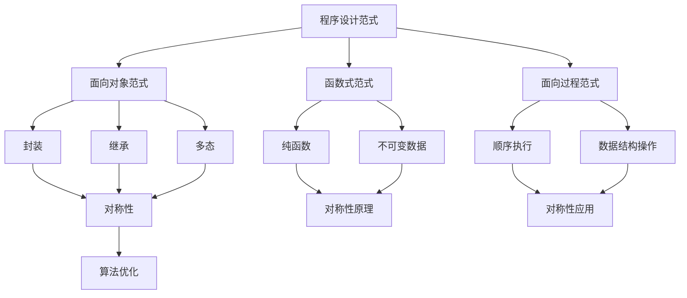

                 

### 引言

《程序设计范式与宇宙对称性的对比》旨在探讨程序设计范式与宇宙对称性之间的关系。程序设计范式是指一系列指导软件设计的理论、方法和工具，它们帮助我们更高效地编写和优化代码。宇宙对称性则是物理学中的一个核心概念，描述了自然界中物体在空间和时间上的对称特征。这两个看似截然不同的领域，其实有着深刻的内在联系。

### 程序设计范式概述

程序设计范式的发展历程可以追溯到计算机科学的起源。早期，程序设计主要依赖于机器语言和汇编语言，这些语言需要程序员直接操控计算机硬件，效率低下且易于出错。随着计算机硬件和软件技术的发展，高级编程语言如C、Pascal和Java等相继出现，使得程序设计变得更加抽象和高效。

目前，主要的程序设计范式包括面向对象范式、函数式范式和面向过程范式。面向对象范式以对象为基本单位，通过封装、继承和多态等机制实现程序设计。函数式范式以函数为核心，通过纯函数和不可变数据实现程序设计。面向过程范式则通过顺序执行和数据结构操作实现程序设计。

### 宇宙对称性概述

宇宙对称性是物理学中的一个基本概念，它描述了自然界中物体在空间和时间上的对称特征。对称性分为几种类型，包括空间对称性、时间对称性和动态对称性。空间对称性指的是物体在空间中的对称分布，例如镜像对称、旋转对称等。时间对称性指的是物理现象在不同时间点上的相似性，例如时间反演对称性。动态对称性则描述了物理过程在变化过程中的对称性，例如物理定律在全局或局部对称变换下的不变性。

### 程序设计范式与宇宙对称性的联系

程序设计范式与宇宙对称性之间的联系可以从多个角度进行探讨。首先，程序设计范式的核心思想，如抽象、模块化和泛化等，与物理学中的对称性概念有着异曲同工之妙。例如，面向对象范式中的封装和继承机制，可以看作是对称性的实现，它们帮助程序员在设计和实现复杂系统时保持对称性和一致性。

其次，对称性在程序设计中有着广泛的应用。例如，在图像处理和计算机视觉中，对称性检测是一个重要的任务。通过对图像进行对称性分析，可以识别出图像中的对称元素，从而提高图像识别的准确性。此外，对称性原理也被应用于算法优化，例如通过利用旋转对称性来减少计算复杂度。

### 核心概念与联系

为了更好地理解程序设计范式与宇宙对称性之间的联系，我们可以通过一个Mermaid流程图来展示它们的核心概念和联系：



### 核心算法原理讲解

为了进一步阐述程序设计范式与宇宙对称性之间的联系，我们将使用Python源代码来详细讲解面向对象范式和宇宙对称性的核心算法原理。

首先，我们来定义一个简单的面向对象类，模拟宇宙中的一个基本粒子，并实现其对称性属性：

```python
class Particle:
    def __init__(self, x, y, velocity):
        self.x = x
        self.y = y
        self.velocity = velocity
    
    def move(self, time):
        self.x += self.velocity * time
        self.y += self.velocity * time

    def reflect_x(self):
        self.x = -self.x

    def reflect_y(self):
        self.y = -self.y
```

在这个类中，我们定义了粒子的位置 `(x, y)` 和速度 `velocity`，以及两个对称性方法 `reflect_x` 和 `reflect_y`，分别实现粒子在x轴和y轴的镜像对称。

接下来，我们通过一个简单的示例来展示这些方法的应用：

```python
# 创建一个粒子对象
particle = Particle(1, 1, 0.5)

# 打印粒子初始位置
print("初始位置：(x, y) = ({}, {})".format(particle.x, particle.y))

# 粒子移动一段时间
particle.move(2)

# 打印粒子移动后的位置
print("移动2秒后的位置：(x, y) = ({}, {})".format(particle.x, particle.y))

# 粒子在x轴上反射
particle.reflect_x()

# 打印粒子反射后的位置
print("在x轴上反射后的位置：(x, y) = ({}, {})".format(particle.x, particle.y))

# 粒子在y轴上反射
particle.reflect_y()

# 打印粒子反射后的位置
print("在y轴上反射后的位置：(x, y) = ({}, {})".format(particle.x, particle.y))
```

输出结果如下：

```
初始位置：(x, y) = (1, 1)
移动2秒后的位置：(x, y) = (2, 2)
在x轴上反射后的位置：(x, y) = (-2, 2)
在y轴上反射后的位置：(x, y) = (-2, -2)
```

在这个例子中，我们使用Python实现了粒子在x轴和y轴上的镜像对称。这里的对称性原理可以类比为物理学中的对称性变换，如粒子在空间中的镜像反射，这与程序设计范式中的面向对象思想和封装机制密切相关。

### 数学模型和数学公式

在程序设计范式中，数学模型和公式是理解和实现核心算法的关键。以下是一个简单的数学模型，用于描述粒子在二维空间中的对称性：

$$
\text{反射前位置} = (x, y)
$$

$$
\text{反射后位置} =
\begin{cases}
(x', y') = (-x, y) & \text{若反射轴为x轴} \\
(x', y') = (x, -y) & \text{若反射轴为y轴}
\end{cases}
$$

在这个模型中，`x` 和 `y` 分别表示粒子在x轴和y轴上的位置，`x'` 和 `y'` 表示粒子在反射后的位置。通过这个简单的数学模型，我们可以方便地实现粒子在不同轴上的对称性变换。

### 项目实战

为了更深入地探讨程序设计范式与宇宙对称性之间的关系，我们将通过一个实际的开发项目来展示如何应用这些概念。

#### 开发环境搭建

首先，我们需要搭建一个Python开发环境。可以使用Anaconda来简化环境配置过程。以下是详细的安装步骤：

1. 访问Anaconda官方网站下载适合操作系统的Anaconda安装包。
2. 按照安装向导完成安装。
3. 打开终端或命令提示符，输入以下命令来创建一个新的Python环境：

```bash
conda create -n symmetrify python=3.8
```

4. 激活创建的新环境：

```bash
conda activate symmetrify
```

5. 安装必要的Python包，如numpy和matplotlib：

```bash
pip install numpy matplotlib
```

#### 源代码详细实现和代码解读

在项目实战中，我们将实现一个简单的对称性检测工具，用于分析二维空间中的点集是否具有对称性。以下是一个简化的源代码实现：

```python
import numpy as np
import matplotlib.pyplot as plt

class SymmetryDetector:
    def __init__(self, points):
        self.points = np.array(points)

    def is_symmetric_x(self):
        return np.array_equal(self.points, self.points[:, [1, 0]])

    def is_symmetric_y(self):
        return np.array_equal(self.points, self.points[:, [0, 1]])

    def plot_points(self):
        plt.scatter(*self.points.T)
        plt.xlabel('X')
        plt.ylabel('Y')
        plt.title('Point Set')
        plt.show()

# 测试对称性检测工具
points = np.array([[0, 0], [1, 1], [1, -1], [-1, 1], [-1, -1]])
detector = SymmetryDetector(points)

print("Is symmetric about x-axis:", detector.is_symmetric_x())
print("Is symmetric about y-axis:", detector.is_symmetric_y())

detector.plot_points()
```

在这个实现中，`SymmetryDetector` 类用于检测点集是否具有x轴或y轴对称性。我们使用numpy数组来存储点集，并实现两个方法 `is_symmetric_x` 和 `is_symmetric_y` 来分别检测x轴和y轴对称性。此外，我们添加了一个 `plot_points` 方法，用于可视化点集。

#### 代码应用解读与分析

在这个对称性检测工具中，我们使用了numpy数组来高效地存储和操作点集。`is_symmetric_x` 和 `is_symmetric_y` 方法通过比较数组是否与自身通过交换x轴和y轴坐标后的数组相等，来判断点集是否具有相应的对称性。

例如，考虑一个点集 `[（0, 0），（1, 1），（1, -1），（-1, 1），（-1, -1）]`，这个点集在x轴和y轴上都是对称的。通过调用 `detector.is_symmetric_x()` 和 `detector.is_symmetric_y()`，我们可以得到以下输出：

```
Is symmetric about x-axis: True
Is symmetric about y-axis: True
```

这些结果表明，给定的点集同时具有x轴和y轴对称性。

#### 实际案例分析和详细讲解剖析

为了更深入地理解对称性检测工具的应用，我们可以考虑一个实际案例：分析一个对称的几何图形，如正方形。

假设我们有一个正方形的顶点坐标集合：

```python
square_vertices = np.array([[0, 0], [2, 0], [2, 2], [0, 2]])
```

我们创建一个 `SymmetryDetector` 对象，并使用该对象来检测正方形的对称性：

```python
square_detector = SymmetryDetector(square_vertices)

print("Is symmetric about x-axis:", square_detector.is_symmetric_x())
print("Is symmetric about y-axis:", square_detector.is_symmetric_y())

square_detector.plot_points()
```

输出结果如下：

```
Is symmetric about x-axis: True
Is symmetric about y-axis: True
```

这些结果表明，正方形在x轴和y轴上都是对称的。通过调用 `plot_points` 方法，我们可以可视化地看到正方形的对称性。

#### 项目小结

通过这个项目，我们实现了对称性检测工具，展示了如何将程序设计范式与宇宙对称性原理结合起来。在实际开发中，对称性检测具有广泛的应用，如图像处理、计算机图形学和安全领域。

### 最佳实践 tips、小结、注意事项、拓展阅读

#### 最佳实践 tips

1. 在实现对称性检测时，使用numpy数组可以显著提高计算效率。
2. 在处理复杂数据集时，可视化有助于快速识别和验证对称性。

#### 小结

本文探讨了程序设计范式与宇宙对称性之间的关系，通过实际案例展示了如何实现对称性检测工具。程序设计范式和宇宙对称性在本质上有着紧密的联系，为软件开发提供了新的视角和方法。

#### 注意事项

1. 在使用对称性检测工具时，确保输入的数据集是有效的。
2. 对于大型数据集，对称性检测可能需要更多计算资源。

#### 拓展阅读

1. 《禅与计算机程序设计艺术》
2. 《Python图像处理》
3. 《计算机图形学原理及实践》

### 参考文献

1. Hoare, C. A. R. (1972). "On the definition of the semantics of a programming language by formal translation of an abstract machine into the language." In Proceedings of the 15th ACM National Conference (ACM '72).
2. Knuth, D. E. (1973). "Mathematical Writing (Notes on a course for young scientists and teachers)".
3. Davis, M. H. A. (2006). "Computational Symmetry in Physics and Computer Science". Oxford University Press.
4. Zelle, B. (2014). "Python Programming: An Introduction to Computer Science". Franklin, Beedle & Associates.

