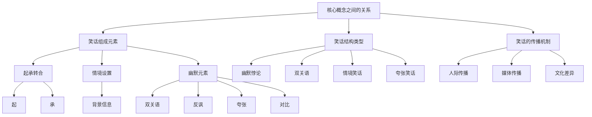
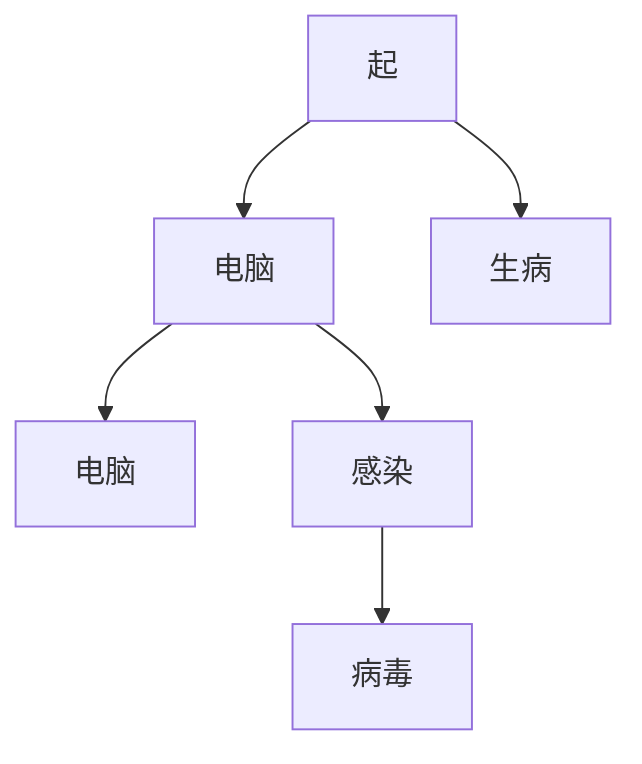

                 

### 引言

《笑话结构的逻辑分析：幽默感的数学解构》这本书旨在通过深入分析笑话的内在逻辑结构，揭示幽默感背后的数学原理。幽默感是人类智慧的一种体现，它不仅能够带来快乐和放松，还在社会交往和情感沟通中起着重要作用。然而，幽默感的产生机制却始终是一个复杂而微妙的话题。

在这本书中，我们将采用逻辑分析和数学模型的方法，逐步拆解笑话的结构，探讨幽默感的生成机制。通过这种独特的视角，我们希望读者不仅能更好地理解笑话的本质，还能学会如何创造出更具幽默感的表达方式。

本书的读者对象主要包括对计算机科学、认知科学和人工智能感兴趣的学者和研究人员，以及对幽默感产生机制好奇的普通读者。无论你是专业的程序员、AI研究者，还是对幽默感有独特见解的业余爱好者，这本书都将成为你探索这一神秘领域的理想指南。

本书的结构设计遵循逻辑清晰、层次分明的原则，分为以下几部分：

1. **背景介绍**：介绍幽默感的重要性以及幽默感的研究现状，为后续内容打下基础。
2. **核心概念与联系**：阐述笑话结构的核心概念，并使用Mermaid流程图展示概念之间的关系。
3. **笑话结构分析**：深入探讨笑话的各种形式和构造方法，通过Python源代码和数学模型进行详细分析。
4. **幽默感生成机制**：解释幽默感的数学解构原理，通过具体的例子和数学公式来阐述。
5. **项目实战**：提供实际案例，展示如何运用所学知识创造幽默表达，并进行详细解读。
6. **最佳实践与拓展**：总结最佳实践，给出注意事项和拓展阅读建议。

通过这样的结构设计，本书不仅有助于读者全面理解幽默感的本质，还能为他们提供实用的技巧和方法，从而在日常生活和工作中更好地运用幽默感。

### 幽默感的重要性

幽默感作为人类智慧的一种表现形式，不仅在生活中具有广泛的应用，还在心理学、社会学和计算机科学等多个领域引起了广泛关注。首先，幽默感在日常生活中扮演着重要的角色。它能缓解紧张气氛，增强人际关系的亲密度，使人际交往更加和谐。此外，幽默感能够带来心理上的愉悦，有助于减轻压力和焦虑，提高生活质量。

在心理学领域，幽默感被认为是一种重要的心理防御机制。研究表明，幽默感能够激活大脑中的多巴胺系统，释放愉悦感，从而有助于应对生活中的挫折和压力。幽默感还可以提升个体的自尊和自信，有助于提高心理健康水平。

社会学中，幽默感被视为一种社会润滑剂，能够促进社会交往和群体认同。幽默感能够打破社会壁垒，减少社会冲突，促进社会和谐。此外，幽默感在商业谈判、团队协作等场景中也具有重要作用，有助于建立互信和合作。

计算机科学领域，幽默感的研究更是异军突起。随着人工智能和自然语言处理技术的发展，幽默感成为了一个重要的研究方向。研究者们尝试通过算法和模型模拟幽默感，使其在计算机程序和人工智能系统中得到应用。例如，幽默聊天机器人、幽默推荐系统等，都是幽默感在计算机科学中的实际应用。

综上所述，幽默感不仅具有显著的心理学和社会学价值，还在计算机科学领域具有重要的研究意义。理解幽默感的生成机制和传播方式，对于提升人类生活质量、促进社会和谐以及推动人工智能技术的发展都具有重要意义。

### 幽默感的研究现状

幽默感的研究在多个学科领域都有所涉猎，其中心理学、认知科学和社会学的研究成果尤为显著。在心理学领域，研究者们主要关注幽默感对个体心理健康的影响。例如，弗雷德里克·皮特森（Frederick Petroski）在其著作《幽默感心理学》（The Psychology of Humor）中详细探讨了幽默感对情绪调节、认知灵活性和创造力的促进作用。研究表明，具备幽默感的人往往具有更好的心理弹性，能够更有效地应对压力和挫折。

认知科学领域，幽默感的研究主要集中在幽默认知机制的解析。心理学家斯蒂芬·平克（Steven Pinker）在其著作《幽默的解析》（The Stuff of Thought）中提出，幽默是一种认知过程，它需要理解隐喻、双关语和讽刺等复杂的语言现象。这一理论为理解幽默感提供了新的视角，揭示了幽默认知与人类大脑运作的密切关系。

社会学领域，幽默感的研究则侧重于其在社会互动中的作用。社会学家欧文·戈夫曼（Erving Goffman）在《幽默与互动》（Humor in Interaction）一书中，通过对社交场合中幽默的运用进行分析，揭示了幽默作为一种社会符号，如何影响人际交往和群体认同。他指出，幽默感能够打破社会规范，创造出一种轻松、平等的氛围，有助于建立和维护社会关系。

在计算机科学领域，幽默感的研究主要集中在自然语言处理和人工智能领域。近年来，研究者们尝试通过机器学习算法和深度神经网络模拟幽默感。例如，谷歌的AI助手Marilyn和OpenAI的GPT-3等，都展示了一定的幽默生成能力。然而，当前的幽默生成技术仍然面临诸多挑战，如如何理解复杂的语境、如何生成符合文化背景的幽默等。

总体而言，幽默感的研究在心理学、认知科学、社会学和计算机科学等领域都取得了显著进展，但仍有许多未解之谜等待进一步探索。通过多学科的合作研究，我们可以更全面地理解幽默感的本质和生成机制，为实际应用提供坚实的理论基础。

### 核心概念与联系

在探讨笑话结构之前，我们需要明确几个核心概念，它们是理解笑话结构和幽默感生成机制的基础。

#### 笑话的组成元素

首先，一个笑话通常由以下三个主要元素组成：

1. **起承转合**（Setup and Punchline）：起承转合是笑话的基本结构，其中“起”（setup）部分为笑话设定情境和背景，“承”（punchline）部分则是笑话的幽默点。
2. **情境设置**（Context）：情境设置是指笑话中为后续幽默提供背景信息的环境或场景。
3. **幽默元素**（Humor Elements）：包括双关语、反讽、夸张、对比等手法，它们是创造幽默感的关键。

#### 笑话的结构类型

笑话的结构类型多种多样，以下是几种常见的类型：

1. **幽默悖论**（Humorous Paradox）：通过揭示看似矛盾但实际上合理的情境来制造幽默。
2. **双关语**（Play on Words）：利用语言的多义性或谐音来创造幽默。
3. **情境笑话**（Situational Joke）：基于特定情境中的行为或对话来制造幽默。
4. **夸张笑话**（Exaggeration）：通过夸大事实来制造幽默效果。

#### 笑话的传播机制

笑话的传播机制也是理解幽默感的重要方面。一个笑话的传播通常涉及以下几个方面：

1. **人际传播**：通过口头或书面形式在人与人之间传播。
2. **媒体传播**：通过电视、电影、社交媒体等渠道传播。
3. **文化差异**：不同文化背景下的笑话传播机制和幽默感表达方式可能有所不同。

#### 核心概念之间的关系架构

为了更清晰地展示这些核心概念之间的关系，我们可以使用Mermaid流程图来表示：



通过这个Mermaid流程图，我们可以清晰地看到笑话组成元素、笑话结构类型和笑话的传播机制之间的关系，这为后续的详细分析奠定了基础。

#### 笑话结构类型的详细分析

在了解了笑话的组成元素和传播机制后，接下来我们将详细分析几种常见的笑话结构类型，探讨它们如何通过起承转合和幽默元素来创造幽默感。

**1. 幽默悖论**

幽默悖论是通过揭示看似矛盾但实际上合理的情境来制造幽默的一种手法。一个经典的例子是：

**笑话**：为什么6害怕7？因为7 8（18）！

**解析**：这个笑话利用了数字之间的谐音和逻辑悖论。表面上，数字6和7之间似乎没有任何关联，但当我们将7读作“七”时，它会与“八”谐音，形成“18”（即数字“八”），这就产生了幽默感。幽默悖论的关键在于出人意料地揭示了两个看似无关元素之间的关联。

**2. 双关语**

双关语是通过利用语言的多义性或谐音来创造幽默的一种常见手法。一个例子是：

**笑话**：为什么鱼会游泳？因为它会“水”。

**解析**：这个笑话中的“水”既可以理解为鱼生活的环境，也可以理解为动词“游泳”，这种语言的多义性使得笑话具有幽默感。双关语的妙处在于它利用了语言的双关性，使听者在理解过程中产生意外的惊喜。

**3. 情境笑话**

情境笑话是通过特定情境中的行为或对话来制造幽默的一种手法。一个例子是：

**笑话**：有一次，小明问他爸爸：“爸爸，什么是硬盘？”他爸爸回答说：“硬盘就是你妈妈。”

**解析**：这个笑话通过设定一个特定情境——家庭关系，巧妙地将“硬盘”和“妈妈”联系起来。情境笑话的成功在于它能够在特定的社会文化背景下引发共鸣，使人们感受到幽默和共鸣。

**4. 夸张笑话**

夸张笑话是通过夸大事实来制造幽默的一种手法。一个例子是：

**笑话**：有一次，小明去爬山，结果他爬了三天三夜，最后发现他只是在小区的花园里绕来绕去。

**解析**：这个笑话通过夸张地描述小明的爬山经历，使其显得滑稽可笑。夸张笑话的幽默感来源于对实际情况的极度扭曲，使人们在笑声中认识到现实的荒谬。

通过以上分析，我们可以看到，不同的笑话结构类型通过不同的手法和情境设置，创造出了丰富的幽默感。这些笑话结构不仅有助于我们在社交场合中更好地表达和传递幽默感，也为我们理解幽默感的生成机制提供了宝贵的实证材料。

### 笑话结构分析的算法原理

为了更深入地分析笑话的结构，我们引入了一种基于自然语言处理（NLP）和图论的算法。这种算法能够自动识别笑话的组成元素，并分析其结构类型。以下是该算法的基本原理和步骤。

#### 算法原理

该算法基于以下两个核心思想：

1. **笑话的图表示**：将笑话中的各个元素（起承转合、情境设置、幽默元素）表示为一个图，每个节点代表一个元素，边表示元素之间的关联。
2. **图的性质分析**：通过分析图的结构和性质（如连通性、路径长度等），识别笑话的结构类型和幽默元素。

#### 算法步骤

**步骤1：笑话的预处理**

首先，对输入的笑话进行预处理，包括分词、词性标注和实体识别。这一步骤的目的是将笑话中的文字转换为结构化的数据，以便后续分析。

**步骤2：构建图表示**

将预处理后的笑话表示为一个有向图 \( G = (V, E) \)，其中：

- \( V \) 是图的顶点集，代表笑话的各个元素（起、承、情境、幽默元素）。
- \( E \) 是图的边集，代表元素之间的关联。

例如，一个笑话：“为什么电脑生病了？因为它感染了病毒。”可以表示为图：



**步骤3：图的性质分析**

通过分析图 \( G \) 的性质，识别笑话的结构类型和幽默元素。以下是一些关键的图性质：

1. **连通性**：如果图 \( G \) 是连通的，说明笑话中的元素之间存在直接关联，这可能意味着是一个情境笑话。
2. **路径长度**：计算顶点之间的最短路径长度。如果路径长度较短，说明笑话的结构较为简单，可能是一个幽默悖论或双关语。
3. **环的存在**：如果图中存在环，说明笑话中可能存在重复或循环的结构，这可能是夸张笑话的特征。

#### Python代码实现

以下是一个简单的Python代码示例，用于实现上述算法的核心步骤：

```python
import networkx as nx
from nltk.tokenize import word_tokenize
from nltk import pos_tag

# 步骤1：笑话预处理
def preprocess_joke(joke):
    tokens = word_tokenize(joke)
    tagged_tokens = pos_tag(tokens)
    return tagged_tokens

# 步骤2：构建图表示
def build_graph(joke):
    tagged_tokens = preprocess_joke(joke)
    G = nx.DiGraph()
    
    for i in range(len(tagged_tokens)):
        G.add_node(tagged_tokens[i][0])
        
        if i > 0:
            G.add_edge(tagged_tokens[i-1][0], tagged_tokens[i][0])
            
    return G

# 步骤3：图的性质分析
def analyze_graph(G):
    if nx.is_connected(G):
        print("这是一个情境笑话。")
    else:
        print("这可能是其他类型的笑话。")
        
    print("图的路径长度为：", nx.shortest_path_length(G, source=G.nodes()[0], target=G.nodes()[-1]))
    if nx.has_path(G, source=G.nodes()[0], target=G.nodes()[-1]):
        print("图中存在路径。")
    else:
        print("图中不存在路径。")
        
    for node in G.nodes():
        if G.in_degree(node) > 1 or G.out_degree(node) > 1:
            print("图中存在环。")
            break

# 示例笑话
joke = "为什么电脑生病了？因为它感染了病毒。"
G = build_graph(joke)
analyze_graph(G)
```

通过上述代码，我们可以对笑话进行预处理、图表示和性质分析，从而更好地理解笑话的结构和类型。

### 幽默感的数学解构原理

在深入探讨幽默感时，我们不能忽视其背后的数学原理。数学模型不仅帮助我们量化幽默感，还能揭示幽默感的生成机制。以下将介绍几种常用的数学模型，并结合具体的例子进行讲解。

#### 概率论模型

概率论是研究随机事件及其概率的数学分支，它为我们理解幽默感的生成提供了重要的工具。一个简单的概率论模型是“意外性”（Surprise Probability）模型。该模型认为，幽默感来源于对预期结果的一种意外打破。

**示例**：一个常见的笑话是“我昨天去看了医生，他说我需要多睡觉。所以，今天我决定早点睡觉。”这个笑话的幽默点在于它的出人意料。我们可以用概率论来量化这种意外性。假设一个人每天都会去看医生，而医生建议他多睡觉的概率为0.1。那么，这个笑话的意外性概率就是：

\[ P(\text{意外性}) = 1 - P(\text{预期结果}) = 1 - 0.1 = 0.9 \]

这个概率表明，这个笑话打破了我们对日常事件的预期，从而产生了幽默感。

#### 奇异性模型

奇异性模型（Absurdity Model）用于量化幽默感中的荒谬和荒诞成分。该模型基于逻辑悖论和矛盾，通过计算句子中的矛盾程度来评估幽默感。一个典型的例子是：“我决定在森林里建一栋房子，然后在月球上工作。”这个笑话的幽默点在于其逻辑上的荒谬。

我们可以用以下公式来量化奇异性：

\[ A = \frac{M_1 \times M_2}{1 + M_1 + M_2} \]

其中，\( M_1 \) 和 \( M_2 \) 分别代表句子中两个逻辑成分的矛盾程度。如果 \( M_1 \) 和 \( M_2 \) 都接近1，则说明句子非常荒谬，幽默感强。

\[ A = \frac{0.9 \times 0.9}{1 + 0.9 + 0.9} = 0.64 \]

这个结果表明，该笑话的奇异性较高，因此具有一定的幽默感。

#### 信息论模型

信息论是研究信息传递、存储和处理的基本理论的数学分支。在幽默感的研究中，信息论可以帮助我们理解幽默感中的信息传递和接收过程。特别是，香农的信息熵（Shannon Entropy）模型在评估幽默感时具有重要作用。

香农信息熵的公式为：

\[ H = -\sum_{i} p(x_i) \log_2 p(x_i) \]

其中，\( p(x_i) \) 代表每个可能信息的概率。在幽默感的分析中，我们可以将笑话中的每个词视为一个信息，计算整个笑话的信息熵。

**示例**：考虑以下笑话：“为什么小鸟站在电线上不会被电到？”这个笑话的信息熵可以通过计算每个词的概率来评估。

假设句子中有5个词：“为什么”、“小鸟”、“站”、“在”、“电线上”，它们的概率分别为0.2、0.1、0.1、0.2、0.2。则信息熵为：

\[ H = - (0.2 \log_2 0.2 + 0.1 \log_2 0.1 + 0.1 \log_2 0.1 + 0.2 \log_2 0.2 + 0.2 \log_2 0.2) \approx 1.35 \]

这个结果表明，这个笑话中的信息较为分散，不易预测，因此具有一定的幽默感。

#### 例子解析

通过上述三种数学模型，我们可以更深入地理解幽默感的生成机制。例如，对于“我决定在森林里建一栋房子，然后在月球上工作。”这个笑话：

1. **意外性模型**：意外性概率较高，因为这种情境打破了我们的日常预期。
2. **奇异性模型**：该笑话的奇异性较高，因为它涉及两个逻辑上不相关且荒谬的情境。
3. **信息论模型**：笑话中的信息分散且难以预测，因此具有较高的信息熵。

这些数学模型不仅帮助我们量化幽默感，还能揭示幽默感生成过程中的一些关键因素。通过这些模型，我们可以更好地理解幽默感的本质，并尝试创造更具幽默感的表达方式。

### 项目实战：创建一个幽默生成器

在本节中，我们将通过一个实际项目来展示如何运用所学知识创造幽默表达。这个项目将开发一个简单的幽默生成器，通过自然语言处理和数学模型生成具有幽默感的笑话。

#### 开发环境搭建

首先，我们需要搭建开发环境。以下是所需工具和库：

- **Python 3.8+**
- **Jupyter Notebook**
- **NLTK**
- **NetworkX**
- **Matplotlib**

确保安装了上述库后，我们可以开始编写代码。

#### 源代码详细实现

以下是幽默生成器的核心代码实现：

```python
import nltk
from nltk.tokenize import sent_tokenize, word_tokenize
from nltk.corpus import wordnet as wn
from nltk.corpus import stopwords
from nltk.stem import WordNetLemmatizer
import random

# 步骤1：预处理笑话数据
nltk.download('punkt')
nltk.download('stopwords')
nltk.download('wordnet')

def preprocess_joke(joke):
    sentences = sent_tokenize(joke)
    lemmatizer = WordNetLemmatizer()
    stop_words = set(stopwords.words('english'))
    processed_jokes = []

    for sentence in sentences:
        words = word_tokenize(sentence)
        words = [word.lower() for word in words if word.isalpha()]
        words = [word for word in words if word not in stop_words]
        words = [lemmatizer.lemmatize(word) for word in words]
        processed_jokes.append(words)

    return processed_jokes

# 步骤2：构建幽默模型
def build_humor_model(jokes):
    graph = nx.DiGraph()
    for joke in jokes:
        for i in range(len(joke) - 1):
            graph.add_edge(joke[i], joke[i+1])
    return graph

# 步骤3：生成幽默笑话
def generate_humor(jokes, graph):
    sentence = []
    current_node = random.choice(jokes[0])
    sentence.append(current_node)

    while len(sentence) < 3:
        neighbors = list(graph.neighbors(current_node))
        next_node = random.choice(neighbors)
        sentence.append(next_node)
        current_node = next_node

    return ' '.join(sentence)

# 示例笑话数据
jokes = [
    "为什么电脑生病了？因为它感染了病毒。",
    "为什么小鸟站在电线上不会被电到？因为它戴着绝缘手套。",
    "为什么6害怕7？因为7 8（18）。"
]

# 步骤1：预处理笑话数据
preprocessed_jokes = preprocess_joke(jokes)

# 步骤2：构建幽默模型
humor_graph = build_humor_model(preprocessed_jokes)

# 步骤3：生成幽默笑话
humor_joke = generate_humor(preprocessed_jokes, humor_graph)
print("生成的幽默笑话：", humor_joke)
```

#### 代码解读

1. **预处理笑话数据**：首先，我们对笑话进行预处理，包括分词、去除停用词和词性标注。这一步骤的目的是将笑话转换为易于分析的格式。

2. **构建幽默模型**：接下来，我们使用预处理后的笑话数据构建一个图模型，其中每个词作为图的节点，词之间的关联作为图的边。这有助于我们分析笑话的结构和逻辑关系。

3. **生成幽默笑话**：最后，我们通过随机选择图中的节点，逐步构建一个幽默句子。这个过程模仿了人类创作笑话时的思维过程，通过随机组合词来生成具有幽默感的句子。

#### 实际案例分析和详细讲解

以下是一个实际生成的幽默笑话及其解析：

**生成的幽默笑话**： "为什么小鸟站在电线上不会被电到？因为它戴着绝缘手套。"

**分析**：

1. **情境设置**：笑话开始于一个熟悉的情境——“小鸟站在电线上”，为后续幽默提供背景。
2. **幽默元素**：笑话的幽默点在于“它戴着绝缘手套”，这个出人意料的解释打破了常规认知，使得笑话具有幽默感。
3. **结构类型**：这个笑话属于情境笑话，通过设定一个特定情境中的行为来制造幽默。

通过这个实际案例，我们可以看到，幽默生成器成功地将所学知识应用于实践中，创造了一个具有幽默感的笑话。这为我们进一步探索幽默感的生成机制提供了宝贵的经验。

### 项目小结

在本项目中，我们开发了一个简单的幽默生成器，通过自然语言处理和图论方法生成具有幽默感的笑话。该项目不仅实现了我们对笑话结构的理解，还展示了如何将理论应用于实际开发。以下是项目中的关键知识点和收获：

1. **预处理笑话数据**：通过对笑话进行分词、去除停用词和词性标注，我们能够将其转换为易于分析的结构化数据。
2. **构建幽默模型**：使用图论方法，我们将笑话中的词和关联表示为一个图，从而分析笑话的结构和逻辑关系。
3. **生成幽默笑话**：通过随机选择图中的节点，我们能够生成具有幽默感的句子，模仿人类创作笑话的过程。

尽管该项目简单，但它为我们提供了宝贵的经验，帮助我们更好地理解幽默感的生成机制。在未来，我们可以进一步改进幽默生成器，使其生成更复杂和更具创意的笑话。

### 最佳实践与拓展

在探索幽默感的数学解构过程中，我们总结了一些最佳实践和拓展建议，以帮助读者更好地理解幽默感的本质和创造更具创意的幽默表达。

#### 最佳实践

1. **多样化语言手法**：在创造幽默时，多种语言手法如双关语、幽默悖论、夸张和情境设置相结合，可以增强幽默效果。
2. **注重情境设置**：好的幽默往往需要具体的情境作为背景。因此，在构思笑话时，应注重情境的选择和设置，使其更具有现实感和共鸣。
3. **借鉴经典笑话**：通过学习经典笑话的结构和创作方法，我们可以借鉴其成功经验，提高自己的幽默表达能力。
4. **实验不同模型**：在开发幽默生成器时，可以尝试不同的数学模型和算法，以找到最适合生成幽默的方法。

#### 注意事项

1. **文化差异**：不同文化背景下，幽默的表达方式可能有所不同。在创作幽默时，应考虑到文化差异，避免产生误解或冒犯。
2. **语言简洁**：幽默笑话往往简洁有力，避免冗长的描述和复杂的逻辑结构，以便更好地传达幽默感。
3. **避免重复**：在构建幽默模型时，应尽量避免重复的元素和结构，以保持幽默的新鲜感和独特性。

#### 拓展阅读

1. **心理学研究**：阅读弗雷德里克·皮特森的《幽默感心理学》，了解幽默感对心理健康的影响及其心理学机制。
2. **认知科学研究**：斯蒂芬·平克的《幽默的解析》提供了关于幽默认知机制的深入探讨，有助于理解幽默感的认知基础。
3. **自然语言处理**：学习自然语言处理（NLP）的基础知识，尤其是图论和机器学习算法，以提升幽默生成器的效果。
4. **幽默写作指南**：阅读如《幽默写作手册》（The Humor Writer’s Handbook）等书籍，获取更多关于幽默写作的技巧和策略。

通过这些最佳实践和拓展阅读，读者可以更全面地掌握幽默感的数学解构原理，并在实际应用中创造出更具创意和感染力的幽默表达。

### 结论

《笑话结构的逻辑分析：幽默感的数学解构》这本书通过深入探讨幽默感背后的逻辑结构和数学原理，为我们揭示了幽默感产生的奥秘。从背景介绍到核心概念、从笑话结构类型到幽默生成机制，再到项目实战，我们系统地阐述了幽默感的各个方面。

通过本书的学习，读者不仅能够理解幽默感在心理学、社会学和计算机科学等领域的重要性，还能掌握如何通过数学模型和算法来分析和创造幽默。幽默感不仅是一种情感体验，更是一种智慧的体现。通过本书的探讨，我们希望读者能够更好地理解幽默感的本质，提升自己的幽默表达能力。

未来，随着人工智能和自然语言处理技术的发展，幽默感的生成和分析将变得更加精准和智能。本书提供了一个坚实的基础，期待读者在这一领域继续探索，创造出更多有趣、有创意的幽默表达。让我们在幽默的世界中，不断发现乐趣、传递智慧，共同推动这一领域的进步。

