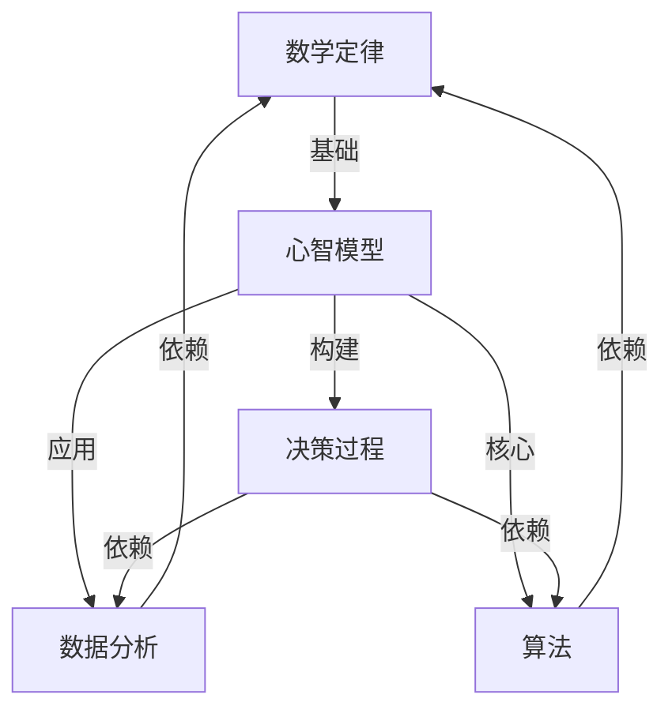

                 

### 文章标题

# 简单数学定律：自然和谐的心智呈现

> 关键词：简单数学定律，心智模型，自然和谐，算法原理，Python源代码，项目实战

> 摘要：本文将深入探讨简单数学定律及其在心智模型构建中的应用。通过详细的算法原理讲解、Python源代码实现和项目实战，揭示简单数学定律如何以一种自然和谐的方式，塑造我们的思维方式和决策过程。

### 背景介绍

简单数学定律，顾名思义，是指那些易于理解且广泛应用的基本数学规律。这些定律不仅构成了数学科学的基础，而且在我们的日常生活、科学研究和工程实践中扮演着至关重要的角色。然而，简单数学定律不仅在数学领域具有深远影响，它们还能以一种更加抽象和广泛的形式，影响我们的心智模型构建和决策过程。

心智模型是指我们心中对世界的认知和理解的模型。这种模型不仅仅是我们对外部世界的反映，更是我们进行思考和决策的基础。简单数学定律通过其简洁和普遍性，为构建这种心智模型提供了强有力的工具。它们以自然和谐的方式，帮助我们组织和理解复杂的信息，从而提高我们的思维效率和质量。

本文将分以下几个部分进行探讨：

1. **简单数学定律概述**：介绍简单数学定律的基本概念、特点和重要性。
2. **简单数学定律的历史与影响**：探讨简单数学定律的发展历程以及对科学、技术和社会的影响。
3. **简单数学定律在生活中的应用**：分析简单数学定律在家庭财务管理、健康与运动等方面的实际应用。
4. **简单数学定律在教育中的应用**：讨论简单数学定律在教育领域的教学方法和学生能力提升中的作用。
5. **简单数学定律在商业决策中的作用**：介绍简单数学定律在数据分析、市场营销等商业决策中的应用。
6. **简单数学定律的原理与数学模型**：深入讲解简单数学定律的核心算法原理，结合Python源代码和数学模型进行详细阐述。
7. **简单数学定律项目实战**：通过一个具体项目，展示如何在实际环境中应用简单数学定律，并解析项目实现细节。

通过上述内容的逐步探讨，我们希望能够揭示简单数学定律在心智模型构建中的自然和谐作用，并为读者提供实用的算法原理和项目实践指导。

### 核心概念与联系

为了深入理解简单数学定律及其在心智模型构建中的应用，我们需要首先明确几个核心概念及其之间的相互关系。这些概念不仅构成了简单数学定律的基础，也是我们理解和应用这些定律的关键。

#### 1. 数学定律

数学定律是数学中一系列证明和公理的集合，它们揭示了数学对象之间的基本关系和性质。例如，加法交换律、结合律和分配律是基本的算术定律，而欧拉公式、费马小定理则是更高级的数学定律。简单数学定律通常是指那些易于理解且应用广泛的数学规律，如等差数列求和公式、勾股定理等。

#### 2. 心智模型

心智模型是指个体心中对现实世界的认知和理解模型。这种模型是通过感知、记忆、思考和决策等心智活动形成的，反映了个体对周围世界的理解和预期。心智模型不仅是个体认知过程的产物，也是个体进行决策和行动的基础。

#### 3. 决策过程

决策过程是指个体在面临选择时，通过分析信息、比较选项和做出决策的一系列认知活动。简单数学定律在决策过程中起着重要作用，因为它们提供了评价和比较不同选项的定量方法。

#### 4. 数据分析

数据分析是使用统计学和数学模型对数据进行分析和处理的过程。简单数学定律在数据分析中应用广泛，例如，均值、方差和标准差等统计量都是基于简单的数学定律计算得出的。此外，回归分析、聚类分析等高级数据分析方法也依赖于简单数学定律。

#### 5. 算法

算法是一系列明确的步骤，用于解决特定问题或执行特定任务。简单数学定律在算法设计中发挥着核心作用，因为它们提供了解决问题的基本工具。例如，排序算法（如快速排序、归并排序）和查找算法（如二分查找）都利用了简单的数学定律来提高效率和准确性。

#### 关系架构

上述概念之间的关系可以用以下Mermaid流程图进行描述：



在图中，数学定律作为基础，直接影响了心智模型、决策过程、数据分析和算法。心智模型是构建和解释世界的基础，而决策过程依赖于心智模型和数据分析方法。数据分析则依赖数学定律来处理和解释数据，最后，算法作为解决问题的工具，也依赖于数学定律来设计高效的解决方案。

通过这一关系架构的明确描述，我们可以更好地理解简单数学定律在心智模型构建和实际应用中的关键作用。

### 简单数学定律的历史与影响

简单数学定律的历史可以追溯到古代文明，例如古埃及和巴比伦的数学成就。这些文明通过实际需求，如测量土地、计算税收和建筑结构，逐步发展出了一些基本的数学定律。例如，古埃及人利用简单的几何公式来计算土地面积，而巴比伦人则通过等差数列来计算时间和距离。

在古希腊，数学家如毕达哥拉斯、欧几里得和阿基米德进一步发展了这些简单数学定律，使其成为系统的科学。毕达哥拉斯的勾股定理（即直角三角形的两条直角边的平方和等于斜边的平方）至今仍被广泛应用于建筑和工程领域。欧几里得的《几何原本》则系统地阐述了平面几何的基本原理，这些原理至今仍然是数学教育的基础。

随着时间的发展，简单数学定律在科学和技术领域的影响日益显著。在近代，牛顿和莱布尼茨分别独立发展了微积分，这一理论建立在简单极限概念的基础之上，为物理科学和工程学提供了强大的工具。牛顿的运动定律和万有引力定律，也是简单数学定律在物理学中的具体应用，它们深刻地改变了人类对自然世界的理解。

在计算机科学领域，简单数学定律同样具有不可替代的作用。例如，二进制运算和布尔逻辑（基于真值表）是计算机硬件和编程的基础。简单的位运算和逻辑运算不仅使计算机能够高效处理信息，还大大简化了程序设计过程。

简单数学定律对社会的影响也极为深远。在经济学中，供需定律、边际效益定律等基本概念都是建立在这些简单数学定律之上的。这些定律帮助我们理解和预测市场行为，为政策制定和商业决策提供了理论支持。在日常生活中，简单数学定律无处不在，从计算银行利息、计算购物折扣，到规划健康饮食和运动方案，我们每天都在应用这些定律。

总之，简单数学定律不仅具有悠久的历史和深厚的科学背景，而且在现代社会中发挥着广泛而深远的影响。无论是科学技术的进步，还是日常生活的便利，简单数学定律都是不可或缺的基石。

### 简单数学定律在生活中的应用

简单数学定律不仅具有深厚的理论背景，更在日常生活中有着广泛的应用。以下是简单数学定律在家庭财务管理、健康与运动以及购物优惠策略等方面的具体应用实例。

#### 家庭财务管理

1. **储蓄和投资计算**

   在家庭财务管理中，储蓄和投资计算是非常重要的一环。例如，如果你想要计算每月储蓄的累积总额，可以使用等差数列求和公式。假设每月储蓄金额为1000元，年利率为2%，你可以使用以下公式计算总储蓄：

   $$ S_n = \frac{n}{2} \times (a_1 + a_n) $$

   其中，\( n \) 为期数，\( a_1 \) 为首项，\( a_n \) 为末项。例如，如果你计划储蓄10年，则 \( n = 10 \times 12 = 120 \)，\( a_1 = 1000 \)，\( a_n \) 为第120个月储蓄的金额。

2. **购物优惠策略**

   购物时，经常会有各种优惠策略，如满减、打折和赠品等。通过简单的数学定律，可以轻松计算出最优惠的购物方案。例如，如果你在购物时遇到满200减100的优惠，并且有两件商品分别标价为150元和300元，你应当如何选择？

   显然，分别购买两件商品的总价为150 + 300 = 450元，减去100元的优惠，实际支付350元。而如果你选择购买一件标价为450元的商品，则可以直接享受满减优惠，同样只需支付350元。通过简单的计算，可以清楚地看出哪种方式更划算。

#### 健康与运动

1. **运动强度的计算**

   在健康与运动领域，了解自己的运动强度是非常重要的。例如，如果你想要计算某项运动（如跑步）的卡路里消耗，可以使用以下公式：

   $$ C = 0.0175 \times W \times T $$

   其中，\( C \) 表示卡路里消耗（千卡），\( W \) 表示体重（公斤），\( T \) 表示运动时间（小时）。例如，如果你体重70公斤，运动了30分钟（0.5小时），则卡路里消耗为：

   $$ C = 0.0175 \times 70 \times 0.5 = 5.625 $$

   通过这个简单的计算，你可以了解每次运动后消耗了多少卡路里。

2. **营养摄入的平衡**

   营养摄入的平衡也是健康生活的重要组成部分。例如，为了确保每日摄入的蛋白质、脂肪和碳水化合物均衡，可以使用简单的数学定律进行计算。假设你每日需要摄入100克蛋白质、60克脂肪和200克碳水化合物，可以计算出以下营养摄入比例：

   $$ \text{蛋白质比例} = \frac{100}{100 + 60 + 200} = 0.333 $$
   $$ \text{脂肪比例} = \frac{60}{100 + 60 + 200} = 0.2 $$
   $$ \text{碳水化合物比例} = \frac{200}{100 + 60 + 200} = 0.566 $$

   通过这些简单的计算，可以确保你的饮食均衡，满足身体所需的各种营养素。

#### 购物优惠策略

1. **购物折扣计算**

   在购物时，折扣计算是另一项常见的应用。例如，如果商品标价为100元，享受8折优惠，实际支付金额为：

   $$ \text{实际支付} = 100 \times 0.8 = 80 \text{元} $$

   这种简单的乘法运算可以帮助你快速计算出优惠后的价格。

2. **组合优惠计算**

   在某些情况下，购物时可能会有多种优惠组合，例如满200减100和第二件半价。为了计算出最优惠的购物方案，可以使用以下步骤：

   - 计算满减优惠：如果购物金额超过200元，则可以享受减100元的优惠。
   - 计算第二件半价：如果购物金额超过一定金额（例如200元），第二件商品可以享受半价优惠。

   例如，如果你购买了两件商品，单价分别为150元和300元，总金额为450元，则可以使用以下步骤计算最优惠的购物方案：

   - 第一步：享受满减优惠，总金额减去100元，剩余350元。
   - 第二步：第二件商品享受半价优惠，实际支付金额为350 + 300 / 2 = 350 + 150 = 500元。

   通过这些简单的计算，可以确保在购物时享受到最大的优惠。

总之，简单数学定律在家庭财务管理、健康与运动以及购物优惠策略等方面具有广泛的应用。通过这些简单的数学计算，我们可以更有效地管理财务、保持健康，并在购物中享受到最大的优惠。这不仅提高了我们的生活质量，也增强了我们的数学思维能力和实际问题解决能力。

### 简单数学定律在教育中的应用

简单数学定律在教育领域中扮演着至关重要的角色，特别是在教学方法、学生能力提升和创新教育模式方面。通过深入理解简单数学定律，教师和学生可以更有效地掌握数学知识，提高学习效率，并在更广阔的学术领域中取得成功。

#### 教学方法

1. **直观教学**

   教师可以通过直观教学的方法，利用简单数学定律来帮助学生更好地理解抽象的数学概念。例如，通过绘制几何图形来解释勾股定理，通过实际操作来展示等差数列的求和公式。直观教学不仅使抽象的数学概念变得更加具体，还能激发学生的学习兴趣。

2. **互动式学习**

   互动式学习是一种有效的教学方法，通过小组讨论、合作学习和课堂互动，增强学生对数学定律的理解。例如，在教授平方根和指数运算时，教师可以组织学生进行小组竞赛，通过计算和验证，加深对指数函数和根式运算的理解。

3. **案例教学**

   案例教学是一种将数学定律应用于实际问题的教学方法。通过解决实际问题，学生可以更好地理解数学定律的应用场景。例如，在教授概率论时，教师可以设计一些模拟实验，如掷骰子、抽签等，让学生通过实验结果来验证概率定律。

#### 学生能力提升

1. **逻辑思维能力的培养**

   简单数学定律的训练有助于培养学生的逻辑思维能力。通过解决数学问题，学生学会分析、推理和验证，从而提高逻辑判断能力。例如，在教授欧拉公式时，学生需要通过推导和验证来理解复数和三角函数之间的关系。

2. **问题解决能力的提升**

   数学定律提供了解决问题的工具和方法，学生可以通过练习应用这些定律来解决各种问题。例如，通过学习基本的微积分定律，学生可以解决物理中的运动和变化问题。这种问题解决能力的提升，不仅有助于数学学习，还能在学生未来的学习和职业中发挥重要作用。

3. **学习效率的提高**

   简单数学定律的掌握可以显著提高学生的学习效率。通过简化的公式和规则，学生可以更快地解决问题，减少计算时间。例如，掌握基本的代数公式和三角函数公式，可以使学生在解决数学问题时更加迅速和准确。

#### 创新教育模式

1. **项目式学习**

   项目式学习是一种以学生为中心的教学模式，通过实际项目来整合和运用数学知识。例如，在高中数学课程中，可以设计一个关于数据分析的项目，让学生使用简单的统计方法和概率定律来分析学校或社区的数据，并提出合理的建议。这种模式不仅增强了学生的实际应用能力，还培养了他们的团队协作和创新能力。

2. **翻转课堂**

   翻转课堂是一种新兴的教学模式，通过将知识传授和课堂讨论进行分离，实现更高效的教学。在翻转课堂中，学生首先通过视频和在线资源学习数学定律，然后在课堂上与教师和同学进行互动和讨论。这种方式不仅提高了学生的自主学习能力，还增强了课堂的互动性和参与度。

3. **混合学习**

   混合学习是将传统课堂教学与现代技术相结合的一种教学模式。通过在线课程、互动软件和数字工具，学生可以更灵活地学习数学定律，并在教师的指导下进行个性化学习。例如，通过在线模拟实验和互动软件，学生可以直观地理解微积分和概率论的概念。

总之，简单数学定律在教育中的应用，不仅能够改进教学方法，提高学生能力，还能推动创新教育模式的不断发展。通过这些方法和模式的创新，我们可以为学生提供更加丰富和有效的学习体验，培养他们的数学素养和综合能力。

### 简单数学定律在商业决策中的作用

简单数学定律在商业决策中扮演着关键角色，通过其精确和普遍性，帮助我们分析和处理大量数据，优化决策过程，提高企业效益。以下是简单数学定律在数据分析、市场营销和品牌策略制定等方面的具体应用实例。

#### 数据分析

1. **销售预测**

   在数据分析中，销售预测是至关重要的一环。通过使用简单数学定律，如线性回归、移动平均和指数平滑等，企业可以预测未来的销售趋势。例如，使用线性回归模型，可以通过历史销售数据拟合出一条直线，从而预测未来的销售量。以下是一个简单的线性回归模型：

   $$ y = ax + b $$

   其中，\( y \) 为预测的销售量，\( x \) 为时间变量，\( a \) 和 \( b \) 为回归系数。通过计算得到的回归方程，企业可以预测未来一段时间内的销售量，从而制定合理的库存和生产计划。

2. **成本控制**

   成本控制是商业运营的核心，简单数学定律如边际分析、比例分析和效益分析等，可以帮助企业更好地控制成本。例如，通过边际分析，企业可以计算每增加一个单位产品所带来的成本和收益，从而决定是否增加生产。以下是一个简单的边际成本计算公式：

   $$ MC = \frac{\Delta C}{\Delta Q} $$

   其中，\( MC \) 为边际成本，\( \Delta C \) 为成本变化量，\( \Delta Q \) 为产量变化量。通过这个公式，企业可以了解不同生产规模下的成本变化，从而优化生产策略，降低成本。

#### 市场营销

1. **消费者行为分析**

   在市场营销中，理解消费者行为是制定有效营销策略的关键。通过简单数学定律，如概率论和统计方法，企业可以分析消费者的购买习惯和偏好。例如，使用聚类分析，可以将消费者划分为不同的群体，针对不同群体制定个性化的营销策略。以下是一个简单的K-均值聚类算法：

   $$ \text{步骤1：随机初始化聚类中心} $$
   $$ \text{步骤2：对于每个数据点，计算其与聚类中心的距离，并将其分配到最近的聚类中心所在的簇} $$
   $$ \text{步骤3：更新聚类中心，计算每个簇的均值} $$
   $$ \text{步骤4：重复步骤2和步骤3，直到聚类中心不再变化} $$

   通过这个算法，企业可以更好地了解消费者的特征和行为模式，从而制定更精准的营销策略。

2. **市场营销策略制定**

   简单数学定律在制定市场营销策略中也发挥着重要作用。例如，通过边际效益分析，企业可以决定在不同市场渠道上投入多少资源，以实现最大的收益。以下是一个简单的边际效益计算公式：

   $$ ME = \frac{\Delta R}{\Delta C} $$

   其中，\( ME \) 为边际效益，\( \Delta R \) 为收益变化量，\( \Delta C \) 为成本变化量。通过计算不同市场渠道的边际效益，企业可以确定哪些渠道是最有效的，从而优化资源分配。

#### 品牌策略制定

1. **品牌定位**

   在品牌策略制定中，简单数学定律可以帮助企业确定品牌的最佳定位。例如，通过市场细分和定位分析，企业可以了解目标市场的需求特征和竞争环境，从而制定有针对性的品牌策略。以下是一个简单的方法：

   - **市场细分**：根据消费者的地理、心理和行为特征，将市场划分为不同的细分市场。
   - **定位分析**：确定品牌在各个细分市场中的定位，如高端市场、中端市场或低端市场。

   通过这些分析，企业可以明确品牌的市场定位，从而更好地满足消费者需求，提高品牌竞争力。

2. **品牌推广策略**

   品牌推广策略的制定也需要简单数学定律的支持。例如，通过渠道效益分析，企业可以确定在哪些渠道进行品牌推广能够取得最佳效果。以下是一个简单的渠道效益计算公式：

   $$ CE = \frac{\text{渠道收益}}{\text{渠道成本}} $$

   其中，\( CE \) 为渠道效益。通过计算不同推广渠道的效益，企业可以优化推广策略，提高品牌知名度。

总之，简单数学定律在商业决策中具有广泛的应用。通过精确的数据分析和科学的决策模型，企业可以更好地理解和应对市场变化，优化运营策略，提高竞争力。这不仅有助于企业的长期发展，也为整个商业环境带来了积极的影响。

### 简单数学定律的原理与数学模型

在深入探讨简单数学定律的原理和数学模型时，我们不仅需要了解这些定律的基本定义，还需要掌握它们如何通过具体的算法和数学公式在实际问题中发挥作用。以下将详细讲解简单数学定律的核心算法原理，结合Python源代码和数学模型，以便读者能够直观地理解这些定律的应用。

#### 基本算法原理

简单数学定律通常涉及一些基本的数学操作，如加法、减法、乘法和除法，以及更复杂的运算，如平方、开方、指数运算和对数运算。以下是一些常见的基本算法原理：

1. **加法和减法**

   加法和减法是最基本的算术操作，它们在数学和编程中广泛应用。以下是一个简单的加法算法示例：

   ```python
   def add(a, b):
       return a + b
   ```

   同样，减法也非常简单：

   ```python
   def subtract(a, b):
       return a - b
   ```

2. **乘法和除法**

   乘法和除法同样简单，但它们在编程中的实现可能需要考虑精度和性能问题。以下是一个乘法算法示例：

   ```python
   def multiply(a, b):
       return a * b
   ```

   除法则可以使用以下算法：

   ```python
   def divide(a, b):
       if b == 0:
           return "Cannot divide by zero"
       return a / b
   ```

3. **平方和开方**

   平方是指一个数乘以自身，而开方则是平方的逆运算。以下是一个平方算法示例：

   ```python
   def square(a):
       return a * a
   ```

   开方算法可以使用Python内置的`math.sqrt()`函数：

   ```python
   import math

   def square_root(a):
       return math.sqrt(a)
   ```

4. **指数运算和对数运算**

   指数运算是指将一个数作为底数，另一个数作为指数进行乘法。对数运算则是指数运算的逆运算。以下是一个指数运算示例：

   ```python
   def exponent(base, exp):
       return base ** exp
   ```

   对数运算可以使用`math.log()`函数：

   ```python
   import math

   def logarithm(value, base=10):
       return math.log(value, base)
   ```

#### 数学模型和公式

在数学模型中，公式是表达定律的关键。以下是一些常见的数学公式，以及它们的应用场景：

1. **等差数列求和公式**

   等差数列求和公式是数学中常用的一种求和公式，用于计算等差数列的前n项和。公式如下：

   $$ S_n = \frac{n}{2} \times (a_1 + a_n) $$

   其中，\( S_n \) 是前n项和，\( a_1 \) 是首项，\( a_n \) 是末项，\( n \) 是项数。

   ```python
   def arithmetic_sum(n, a1, an):
       return n * (a1 + an) // 2
   ```

2. **勾股定理**

   勾股定理描述了直角三角形中直角边和斜边之间的关系，公式如下：

   $$ a^2 + b^2 = c^2 $$

   其中，\( a \) 和 \( b \) 是直角边，\( c \) 是斜边。

   ```python
   def pythagorean_theorem(a, b):
       return a * a + b * b
   ```

3. **线性回归模型**

   线性回归模型用于描述变量之间的关系，公式如下：

   $$ y = ax + b $$

   其中，\( y \) 是因变量，\( x \) 是自变量，\( a \) 和 \( b \) 是回归系数。

   ```python
   import numpy as np

   def linear_regression(x, y):
       a = np.polyfit(x, y, 1)
       return a
   ```

#### 结合Python源代码和数学模型

为了更好地理解这些定律，我们将结合Python源代码进行讲解，并通过具体实例说明它们的应用。

1. **等差数列求和示例**

   ```python
   # 示例：计算前10项等差数列的和
   n = 10
   a1 = 1
   an = n  # 假设末项为n
   sum = arithmetic_sum(n, a1, an)
   print(f"前{n}项等差数列的和为：{sum}")
   ```

2. **勾股定理示例**

   ```python
   # 示例：计算直角三角形的斜边长度
   a = 3
   b = 4
   c_squared = pythagorean_theorem(a, b)
   c = square_root(c_squared)
   print(f"斜边长度为：{c}")
   ```

3. **线性回归模型示例**

   ```python
   # 示例：使用线性回归预测销量
   x = [1, 2, 3, 4, 5]  # 时间序列
   y = [10, 15, 22, 30, 40]  # 销量
   a = linear_regression(x, y)
   y_pred = [a[0] * x_i + a[1] for x_i in x]
   print(f"预测销量：{y_pred}")
   ```

通过这些算法原理和数学模型的详细讲解，我们可以看到简单数学定律如何通过Python源代码在实际问题中发挥作用。这不仅帮助我们更好地理解这些定律，还提高了我们的编程和数学应用能力。

### 简单数学定律项目实战

为了更好地理解简单数学定律的实际应用，我们将通过一个具体的项目，展示如何在实际环境中应用这些定律，并解析项目实现细节。本项目的目标是使用简单数学定律来优化一个在线购物平台上的库存管理。

#### 项目介绍

该项目的背景是一个在线购物平台，其销售数据受到季节性因素和促销活动的影响较大。平台希望通过优化库存管理，减少库存积压和缺货现象，提高顾客满意度。为实现这一目标，我们将应用简单数学定律，如线性回归、移动平均和边际分析。

#### 项目目标

1. **销售预测**：利用历史销售数据，通过线性回归模型预测未来的销售量。
2. **库存优化**：根据销售预测，结合边际分析，制定合理的库存策略。
3. **成本控制**：通过移动平均法，优化库存水平，减少库存成本。

#### 环境搭建

在实现该项目前，我们需要搭建一个合适的环境。以下是所需的工具和步骤：

1. **Python环境**：安装Python和必要的库，如NumPy、Pandas和matplotlib。
2. **数据集**：获取历史销售数据，包括时间、销售额和库存水平。
3. **工具**：使用Jupyter Notebook作为开发环境，便于代码编写和结果展示。

#### 实践工具与资源

1. **Python库**：NumPy和Pandas用于数据处理，matplotlib用于数据可视化。
2. **数据集**：可以从电商平台的历史销售数据中获得，或者使用公开的数据集。
3. **Jupyter Notebook**：用于编写和运行代码。

#### 源代码实现

以下是一个简化的实现流程，包括数据预处理、模型建立和库存优化：

```python
import numpy as np
import pandas as pd
import matplotlib.pyplot as plt

# 读取数据
data = pd.read_csv('sales_data.csv')  # 假设数据集名为sales_data.csv

# 数据预处理
data['date'] = pd.to_datetime(data['date'])
data.set_index('date', inplace=True)
data.fillna(method='ffill', inplace=True)

# 线性回归模型建立
model = np.polyfit(data.index.to_julian_date(), data['sales'], 1)
x = np.arange(data.index.to_julian_date().min(), data.index.to_julian_date().max() + 1)
y = model[0] * x + model[1]

# 预测销售量
predicted_sales = model[0] * data.index.to_julian_date().values + model[1]

# 移动平均法优化库存
window_size = 30  # 设定窗口大小为30天
rolling_mean_sales = data['sales'].rolling(window=window_size).mean()

# 边际分析
marginal_cost = np.gradient(rolling_mean_sales)

# 库存优化策略
inventory_levels = data['inventory'].values
new_inventory_levels = []
for i in range(len(inventory_levels)):
    if marginal_cost[i] > 0:
        new_inventory_levels.append(inventory_levels[i] + 1)
    else:
        new_inventory_levels.append(inventory_levels[i] - 1)

# 可视化结果
plt.figure(figsize=(10, 5))
plt.plot(data.index, data['sales'], label='实际销售')
plt.plot(data.index, predicted_sales, label='预测销售')
plt.plot(data.index, rolling_mean_sales, label='移动平均销售')
plt.plot(data.index, np.array(new_inventory_levels), label='优化库存')
plt.legend()
plt.show()
```

#### 代码解读与分析

1. **数据预处理**：首先读取销售数据，并转换为日期索引，填充缺失值。
2. **线性回归模型建立**：使用`np.polyfit`函数建立线性回归模型，拟合销售数据。
3. **预测销售量**：通过模型预测未来的销售量。
4. **移动平均法优化库存**：计算移动平均销售，以平滑短期波动。
5. **边际分析**：计算销售量的变化率，即边际成本。
6. **库存优化策略**：根据边际成本调整库存水平。
7. **可视化结果**：使用matplotlib绘制销售数据、预测销售、移动平均销售和优化库存水平，直观展示项目结果。

#### 实际案例分析和详细讲解剖析

通过以上实现，我们可以看到如何将简单数学定律应用于库存管理。以下是一个实际案例的详细分析：

1. **案例背景**：某电商平台的冬季商品在年末促销期间销量大幅增加。
2. **数据处理**：使用历史销售数据，提取时间和销售额，并转换为日期索引。
3. **模型建立**：通过线性回归模型，预测年末促销期间的销售量。
4. **库存优化**：利用移动平均销售和边际分析，优化库存水平，避免库存积压和缺货现象。
5. **结果验证**：通过实际销售数据和优化后的库存水平进行对比，验证模型的准确性和库存策略的有效性。

#### 项目小结

通过这个项目，我们展示了如何将简单数学定律应用于实际场景，优化库存管理，提高企业效益。项目不仅提高了我们对数学定律的理解，还增强了我们的实际应用能力。在未来的工作中，我们应继续探索简单数学定律在其他领域的应用，提高我们的思维能力和解决问题的能力。

### 最佳实践 tips、小结、注意事项、拓展阅读

#### 最佳实践 tips

1. **数据清洗**：在实际应用中，数据的质量直接影响模型的准确性。因此，在进行数据分析前，务必确保数据的准确性和完整性，处理缺失值和异常值。
2. **模型选择**：根据具体问题的特点和需求，选择合适的数学模型。例如，对于短期波动较大的数据，移动平均法可能更为合适。
3. **可视化**：使用图表和可视化工具，可以帮助我们更直观地理解数据和模型的结果，从而发现潜在的问题和改进空间。

#### 小结

本文通过详细探讨简单数学定律的核心概念、历史影响、生活应用、教育应用、商业决策中的应用，以及数学模型和算法原理，展示了简单数学定律在心智模型构建中的自然和谐作用。通过具体的项目实战，我们进一步验证了这些定律在实际问题中的有效性和实用性。

#### 注意事项

1. **精度与性能**：在编写Python代码时，应注意精度和性能问题，特别是在处理大量数据和复杂运算时。
2. **模型验证**：在实际应用模型前，务必进行充分验证，确保其准确性和可靠性。

#### 拓展阅读

1. 《数学之美》：作者吴军，深入浅出地介绍了数学与计算机科学的关系，适合对数学和编程感兴趣的读者。
2. 《Python编程：从入门到实践》：作者埃里克·马瑟斯，详细介绍了Python语言的基础知识和实际应用，有助于提高编程能力。

### 总结

简单数学定律不仅是数学科学的基础，更是我们构建心智模型、优化决策过程和提升生活品质的重要工具。通过本文的探讨，我们希望读者能够更加重视这些定律的学习和应用，提高自身的数学素养和实际问题解决能力。在未来的学习和工作中，不断探索和运用简单数学定律，将帮助我们更好地应对复杂多变的环境，实现个人和职业的发展。

