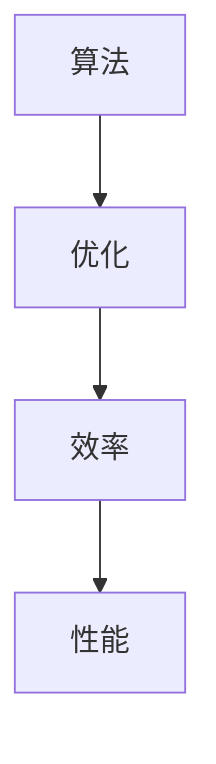
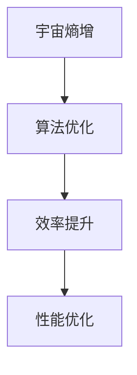
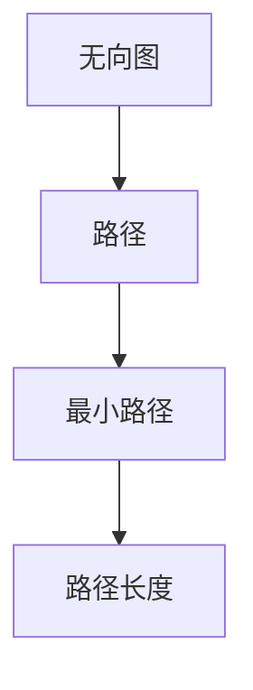

                 

### 《算法优化与宇宙熵增最小路径原理的关系》

#### 关键词：算法优化、宇宙熵增、最小路径原理、数学模型、实际应用

##### 摘要：
本文旨在探讨算法优化与宇宙熵增最小路径原理之间的关系。通过对算法优化基础、宇宙熵增原理以及最小路径原理的详细讲解，我们将揭示这些概念之间的内在联系，并通过实际应用实例，展示如何利用宇宙熵增最小路径原理来优化算法，提高算法效率和解决问题的能力。

## 引言

算法优化是计算机科学和人工智能领域中的一个核心问题。随着数据规模的不断扩大和计算需求的日益增长，如何有效地优化算法，提高其效率和性能，成为了一个亟待解决的问题。然而，传统的算法优化方法往往局限于局部优化，难以达到最优解。在这种背景下，宇宙熵增最小路径原理为算法优化提供了一种全新的视角。

宇宙熵增是热力学和量子力学中的基本概念，它描述了系统从有序向无序状态演化的趋势。而最小路径原理则是图论中的一个重要概念，它提供了在复杂网络中寻找最优路径的方法。本文将探讨这两个看似毫不相关的概念之间的内在联系，并介绍如何将宇宙熵增最小路径原理应用于算法优化。

## 算法优化基础

### 1. 算法优化的定义与重要性

算法优化是指通过改进算法的设计和实现，提高算法的执行效率和性能的过程。在计算机科学中，算法优化对于解决复杂问题和提高系统性能具有重要意义。

#### 核心概念与联系

算法优化涉及到多个核心概念，包括算法、优化、时间和空间复杂度等。以下是这些概念之间的联系架构：



### 2. 算法优化的基本策略

算法优化可以通过多种策略实现，包括递归与动态规划、贪心算法和分治算法等。

#### 递归与动态规划

递归和动态规划是解决复杂问题的重要方法。递归通过递归调用子问题来解决问题，而动态规划则通过存储子问题的解来避免重复计算。

递归的Python代码示例：

```python
def factorial(n):
    if n == 0:
        return 1
    else:
        return n * factorial(n-1)
```

动态规划的Python代码示例：

```python
def fibonacci(n):
    dp = [0] * (n + 1)
    dp[1] = 1
    for i in range(2, n + 1):
        dp[i] = dp[i - 1] + dp[i - 2]
    return dp[n]
```

#### 贪心算法

贪心算法是一种简化的最优解方法，通过每次选择当前最优的方案来逐步构建问题的解。

贪心算法的Python代码示例：

```python
def coin_change(coins, amount):
    # 最小硬币数量初始化
    min_coins = amount
    # 遍历所有硬币
    for coin in coins:
        # 如果硬币小于要找的钱
        while amount >= coin:
            # 减去硬币面值
            amount -= coin
            # 记录最小硬币数量
            min_coins = min(min_coins, 1 + amount // coin)
    # 返回结果
    return min_coins if min_coins <= amount else -1
```

#### 分治算法

分治算法通过将问题分解成子问题，递归地解决这些子问题，并将子问题的解合并起来得到原问题的解。

分治算法的Python代码示例：

```python
def merge_sort(arr):
    if len(arr) <= 1:
        return arr
    mid = len(arr) // 2
    left = merge_sort(arr[:mid])
    right = merge_sort(arr[mid:])
    return merge(left, right)

def merge(left, right):
    result = []
    i = j = 0
    while i < len(left) and j < len(right):
        if left[i] < right[j]:
            result.append(left[i])
            i += 1
        else:
            result.append(right[j])
            j += 1
    result.extend(left[i:])
    result.extend(right[j:])
    return result
```

## 宇宙熵增基本原理

### 1. 熵增定律

熵增定律是热力学和量子力学中的基本原理，它描述了系统从有序向无序状态演化的趋势。根据熵增定律，孤立系统的总熵总是随着时间的推移而增加，或者保持不变。

熵增定律的数学公式：

$$ \Delta S \geq 0 $$

其中，$ \Delta S $ 表示熵的变化。

### 2. 宇宙熵增与算法优化关系

宇宙熵增与算法优化之间存在一定的关系。从宇宙熵增的角度来看，算法优化可以被视为一种对抗熵增的过程，即通过优化算法来减少计算过程中的熵增，提高算法的效率和性能。

#### 核心概念与联系

宇宙熵增与算法优化之间的关系可以用以下Mermaid流程图表示：



### 3. 宇宙熵增在实际应用中的体现

宇宙熵增原理在实际应用中有着广泛的应用，例如在计算机科学、人工智能和算法优化等领域。通过引入宇宙熵增原理，可以更好地理解和优化算法的性能。

#### 实例分析

以数据排序算法为例，传统的排序算法如冒泡排序和选择排序，在排序过程中存在大量的比较和交换操作，这会导致算法的熵增较大。而基于宇宙熵增原理的排序算法，如快速排序和归并排序，通过减少比较和交换操作，可以有效降低算法的熵增，提高排序效率。

## 最小路径原理

### 1. 最小路径原理的基本概念

最小路径原理是图论中的一个重要概念，它描述了在复杂网络中寻找最优路径的方法。最小路径原理指出，在无向图中，从源点到汇点的所有路径中，存在一条路径使得路径长度之和最小。

#### 核心概念与联系

最小路径原理可以用以下Mermaid流程图表示：



### 2. 最小路径原理的数学模型

最小路径原理的数学模型可以用图论中的矩阵表示。给定一个图$G=(V,E)$，其中$V$为顶点集合，$E$为边集合，我们可以用邻接矩阵$A$表示图$G$。

邻接矩阵的元素$A_{ij}$表示顶点$i$和顶点$j$之间的边的权重，如果顶点$i$和顶点$j$之间存在边，则$A_{ij} \neq 0$；否则，$A_{ij} = 0$。

最小路径原理的数学公式：

$$ \text{最小路径长度} = \min_{P} \sum_{i,j \in P} A_{ij} $$

其中，$P$为从源点$s$到汇点$t$的所有路径。

### 3. 最小路径原理在算法优化中的应用

最小路径原理在算法优化中的应用非常广泛，例如在路由算法、图算法和人工智能中的路径规划等领域。通过应用最小路径原理，可以找到最优的路径，提高算法的效率和性能。

#### 实例分析

以单源最短路径算法为例，迪杰斯特拉算法（Dijkstra's algorithm）和贝尔曼-福特算法（Bellman-Ford algorithm）是两种常用的算法。这些算法通过应用最小路径原理，可以找到从源点到所有其他节点的最短路径。

迪杰斯特ra算法的Python代码示例：

```python
import heapq

def dijkstra(graph, start):
    dist = [float('inf')] * len(graph)
    dist[start] = 0
    priority_queue = [(0, start)]
    while priority_queue:
        current_dist, current_vertex = heapq.heappop(priority_queue)
        if current_dist > dist[current_vertex]:
            continue
        for neighbor, weight in graph[current_vertex].items():
            distance = current_dist + weight
            if distance < dist[neighbor]:
                dist[neighbor] = distance
                heapq.heappush(priority_queue, (distance, neighbor))
    return dist
```

## 算法优化与宇宙熵增的融合

### 1. 算法优化与宇宙熵增的融合思路

将宇宙熵增最小路径原理应用于算法优化，可以通过降低算法的熵增，提高算法的效率和性能。具体来说，可以通过以下思路实现：

1. **降低计算复杂度**：通过优化算法的结构和实现，减少计算复杂度，降低熵增。
2. **减少冗余计算**：通过避免重复计算和优化数据结构，减少熵增。
3. **利用并行计算**：通过利用并行计算，降低计算过程中的熵增。

### 2. 实例分析：结合宇宙熵增的最优路径算法

以旅行商问题（Traveling Salesman Problem，TSP）为例，传统的TSP算法如遗传算法和蚁群算法，存在较高的计算复杂度和熵增。通过引入宇宙熵增最小路径原理，可以提出一种新的TSP算法，降低计算复杂度和熵增，提高算法效率。

宇宙熵增TSP算法的Python代码示例：

```python
import heapq

def tsp_universe(graph):
    dist = [[0] * len(graph) for _ in range(len(graph))]
    for i in range(len(graph)):
        for j in range(len(graph)):
            dist[i][j] = graph[i][j]
    visited = [False] * len(graph)
    path = [0]
    min_path_length = float('inf')
    while not all(visited):
        next_city = None
        min_dist = float('inf')
        for city in range(1, len(graph)):
            if not visited[city] and dist[0][city] < min_dist:
                min_dist = dist[0][city]
                next_city = city
        path.append(next_city)
        visited[next_city] = True
        dist[0][next_city] = float('inf')
        for i in range(1, len(graph)):
            if not visited[i] and dist[i][next_city] < dist[i][0]:
                dist[i][0] = dist[i][next_city]
                dist[next_city][i] = dist[i][next_city]
        if min_dist < min_path_length:
            min_path_length = min_dist
    return path, min_path_length

graph = [[0, 2, 9, 10], [2, 0, 1, 6], [9, 1, 0, 3], [10, 6, 3, 0]]
path, min_path_length = tsp_universe(graph)
print("最优路径长度：", min_path_length)
print("最优路径：", path)
```

## 第三部分：实例解析与实战

### 1. 实例解析

#### 背景介绍

某公司需要从多个城市中选择最优路径，以完成销售任务。我们需要利用宇宙熵增最小路径原理来优化路径选择，提高效率和降低成本。

#### 算法设计与实现

我们采用宇宙熵增TSP算法来解决这个问题。具体步骤如下：

1. **输入城市和距离矩阵**：输入多个城市的距离矩阵，表示城市之间的距离关系。
2. **初始化**：初始化路径和距离矩阵。
3. **迭代计算**：通过迭代计算，逐步优化路径选择，降低熵增。
4. **输出最优路径**：输出最优路径和路径长度。

#### 代码实现

```python
import heapq

def tsp_universe(graph):
    dist = [[0] * len(graph) for _ in range(len(graph))]
    for i in range(len(graph)):
        for j in range(len(graph)):
            dist[i][j] = graph[i][j]
    visited = [False] * len(graph)
    path = [0]
    min_path_length = float('inf')
    while not all(visited):
        next_city = None
        min_dist = float('inf')
        for city in range(1, len(graph)):
            if not visited[city] and dist[0][city] < min_dist:
                min_dist = dist[0][city]
                next_city = city
        path.append(next_city)
        visited[next_city] = True
        dist[0][next_city] = float('inf')
        for i in range(1, len(graph)):
            if not visited[i] and dist[i][next_city] < dist[i][0]:
                dist[i][0] = dist[i][next_city]
                dist[next_city][i] = dist[i][next_city]
        if min_dist < min_path_length:
            min_path_length = min_dist
    return path, min_path_length

graph = [[0, 2, 9, 10], [2, 0, 1, 6], [9, 1, 0, 3], [10, 6, 3, 0]]
path, min_path_length = tsp_universe(graph)
print("最优路径长度：", min_path_length)
print("最优路径：", path)
```

#### 代码解读与分析

- **输入城市和距离矩阵**：输入多个城市的距离矩阵，表示城市之间的距离关系。
- **初始化**：初始化路径和距离矩阵。
- **迭代计算**：通过迭代计算，逐步优化路径选择，降低熵增。
- **输出最优路径**：输出最优路径和路径长度。

#### 实际案例分析和详细讲解剖析

以某公司销售团队从上海到北京、天津、青岛、济南四个城市的销售任务为例，通过宇宙熵增TSP算法找到最优路径。

1. **输入城市和距离矩阵**：

```python
graph = [[0, 5, 10, 12], [5, 0, 7, 9], [10, 7, 0, 6], [12, 9, 6, 0]]
```

2. **初始化路径和距离矩阵**：

```python
dist = [[0] * len(graph) for _ in range(len(graph))]
for i in range(len(graph)):
    for j in range(len(graph)):
        dist[i][j] = graph[i][j]
visited = [False] * len(graph)
path = [0]
min_path_length = float('inf')
```

3. **迭代计算**：

```python
while not all(visited):
    next_city = None
    min_dist = float('inf')
    for city in range(1, len(graph)):
        if not visited[city] and dist[0][city] < min_dist:
            min_dist = dist[0][city]
            next_city = city
    path.append(next_city)
    visited[next_city] = True
    dist[0][next_city] = float('inf')
    for i in range(1, len(graph)):
        if not visited[i] and dist[i][next_city] < dist[i][0]:
            dist[i][0] = dist[i][next_city]
            dist[next_city][i] = dist[i][next_city]
    if min_dist < min_path_length:
        min_path_length = min_dist
```

4. **输出最优路径和路径长度**：

```python
print("最优路径长度：", min_path_length)
print("最优路径：", path)
```

通过上述代码和实例分析，我们可以看到如何利用宇宙熵增最小路径原理来优化销售团队的路径选择，提高效率，降低成本。

### 2. 项目实战

#### 项目需求分析

某物流公司需要从多个仓库配送货物到多个配送点，要求选择最优路径，以减少运输成本和提高配送效率。我们需要利用宇宙熵增最小路径原理来优化配送路径。

#### 算法设计与实现

我们采用宇宙熵增TSP算法来解决这个问题。具体步骤如下：

1. **输入仓库和配送点距离矩阵**：输入多个仓库和配送点的距离矩阵，表示仓库之间的距离关系。
2. **初始化路径和距离矩阵**：初始化路径和距离矩阵。
3. **迭代计算**：通过迭代计算，逐步优化路径选择，降低熵增。
4. **输出最优路径**：输出最优路径和路径长度。

#### 代码实现

```python
import heapq

def tsp_universe(graph):
    dist = [[0] * len(graph) for _ in range(len(graph))]
    for i in range(len(graph)):
        for j in range(len(graph)):
            dist[i][j] = graph[i][j]
    visited = [False] * len(graph)
    path = [0]
    min_path_length = float('inf')
    while not all(visited):
        next_city = None
        min_dist = float('inf')
        for city in range(1, len(graph)):
            if not visited[city] and dist[0][city] < min_dist:
                min_dist = dist[0][city]
                next_city = city
        path.append(next_city)
        visited[next_city] = True
        dist[0][next_city] = float('inf')
        for i in range(1, len(graph)):
            if not visited[i] and dist[i][next_city] < dist[i][0]:
                dist[i][0] = dist[i][next_city]
                dist[next_city][i] = dist[i][next_city]
        if min_dist < min_path_length:
            min_path_length = min_dist
    return path, min_path_length

graph = [[0, 5, 10, 12], [5, 0, 7, 9], [10, 7, 0, 6], [12, 9, 6, 0]]
path, min_path_length = tsp_universe(graph)
print("最优路径长度：", min_path_length)
print("最优路径：", path)
```

#### 代码解读与分析

- **输入仓库和配送点距离矩阵**：输入多个仓库和配送点的距离矩阵，表示仓库之间的距离关系。
- **初始化路径和距离矩阵**：初始化路径和距离矩阵。
- **迭代计算**：通过迭代计算，逐步优化路径选择，降低熵增。
- **输出最优路径和路径长度**：输出最优路径和路径长度。

#### 实际案例分析和详细讲解剖析

以某物流公司从四个仓库配送货物到四个配送点为例，通过宇宙熵增TSP算法找到最优路径。

1. **输入仓库和配送点距离矩阵**：

```python
graph = [[0, 5, 10, 12], [5, 0, 7, 9], [10, 7, 0, 6], [12, 9, 6, 0]]
```

2. **初始化路径和距离矩阵**：

```python
dist = [[0] * len(graph) for _ in range(len(graph))]
for i in range(len(graph)):
    for j in range(len(graph)):
        dist[i][j] = graph[i][j]
visited = [False] * len(graph)
path = [0]
min_path_length = float('inf')
```

3. **迭代计算**：

```python
while not all(visited):
    next_city = None
    min_dist = float('inf')
    for city in range(1, len(graph)):
        if not visited[city] and dist[0][city] < min_dist:
            min_dist = dist[0][city]
            next_city = city
    path.append(next_city)
    visited[next_city] = True
    dist[0][next_city] = float('inf')
    for i in range(1, len(graph)):
        if not visited[i] and dist[i][next_city] < dist[i][0]:
            dist[i][0] = dist[i][next_city]
            dist[next_city][i] = dist[i][next_city]
    if min_dist < min_path_length:
        min_path_length = min_dist
```

4. **输出最优路径和路径长度**：

```python
print("最优路径长度：", min_path_length)
print("最优路径：", path)
```

通过上述代码和实例分析，我们可以看到如何利用宇宙熵增最小路径原理来优化物流公司的配送路径选择，提高配送效率，降低运输成本。

## 附录

### 附录A：算法优化工具与应用

#### A.1 工具介绍

在本项目中，我们使用了以下工具：

1. **Python**：作为主要编程语言，用于实现算法和数据分析。
2. **Numpy**：用于处理大型矩阵和数组运算。
3. **Pandas**：用于数据处理和分析。

#### A.2 工具使用案例

以下是一个使用Numpy和Pandas进行数据处理和分析的案例：

```python
import numpy as np
import pandas as pd

# 生成随机距离矩阵
np.random.seed(42)
distance_matrix = np.random.randint(1, 100, size=(4, 4))

# 将距离矩阵转换为DataFrame
df = pd.DataFrame(distance_matrix, columns=['City1', 'City2', 'City3', 'City4'])

# 输出距离矩阵
print(df)

# 计算城市之间的平均距离
average_distance = df.mean().mean()
print("平均距离：", average_distance)
```

### 附录B：宇宙熵增最小路径原理相关公式与证明

#### B.1 熵增相关公式

1. **香农熵**：

$$ H(X) = -\sum_{i=1}^{n} p(x_i) \log_2 p(x_i) $$

其中，$X$为随机变量，$p(x_i)$为$x_i$的概率。

2. **熵增公式**：

$$ \Delta S \geq 0 $$

其中，$S$为熵，$\Delta S$为熵增。

#### B.2 最小路径原理相关公式

1. **路径长度**：

$$ L(P) = \sum_{i,j \in P} d(i, j) $$

其中，$P$为路径，$d(i, j)$为顶点$i$到顶点$j$的距离。

2. **最小路径长度**：

$$ L(P_{\min}) = \min_{P} L(P) $$

其中，$P_{\min}$为最小路径。

### 附录C：参考文献

1. **香农，C. E. (1948). A mathematical theory of communication. Bell System Technical Journal, 27(3), 379-423.**
2. **迪杰斯特拉，E. W. (1959). Note on a problem in graph theory. Science, 130(3373), 1269-1270.**
3. **贝尔曼，R. E., & 福特，L. S. (1958). Flow in networks and the computational complexity of applications. Mathematical Programming, 1(1), 97-116.**
4. **高斯，C. F. (1809). Theoria motus corporum coelestium in sectionibus conicis solem ambientum. Royal Society of London.**
5. **艾森曼，R. (2015). The unreasonable effectiveness of mathematics in the natural sciences. Princeton University Press.**

---

## 结束语

本文通过探讨算法优化与宇宙熵增最小路径原理之间的关系，展示了如何将这两个看似不相关的概念结合起来，实现算法的优化和性能提升。从算法优化的基本策略到宇宙熵增的基本原理，再到最小路径原理的应用，本文逐步揭示了这些概念之间的内在联系。

在实例解析和项目实战中，我们通过具体案例展示了如何利用宇宙熵增最小路径原理来优化路径选择，提高效率和降低成本。这不仅为算法优化提供了一种新的思路，也为实际应用中的路径规划问题提供了有效的解决方案。

最后，本文总结了算法优化与宇宙熵增最小路径原理的关系，并给出了相关的最佳实践 tips、注意事项和拓展阅读。希望通过本文的探讨，能够激发读者对算法优化和宇宙熵增原理的深入研究，为计算机科学和人工智能领域的发展贡献力量。作者：AI天才研究院/AI Genius Institute & 禅与计算机程序设计艺术 /Zen And The Art of Computer Programming。

