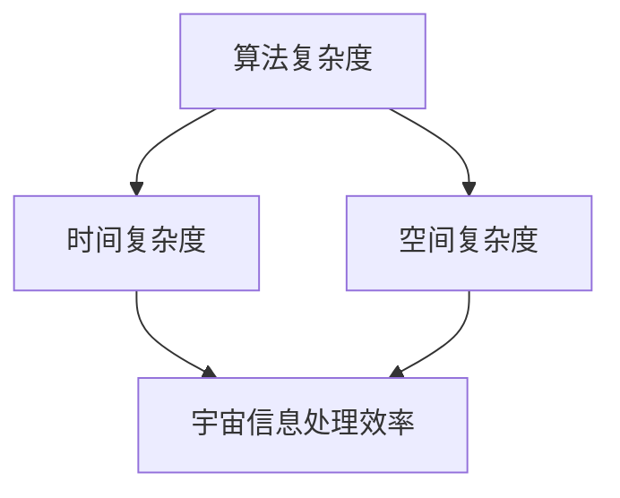

                 

### 2. 算法复杂度与宇宙信息处理效率的关系

#### 2.1. 关系模型的基本原理

算法复杂度与宇宙信息处理效率之间的关系可以通过一个基本模型来理解。首先，我们需要明确两个核心概念：算法的时间复杂度和宇宙信息处理效率。

- **时间复杂度**：指的是算法在执行过程中所需时间的增长速率，通常用大O符号表示，如`O(n)`, `O(n^2)`等。

- **宇宙信息处理效率**：是指宇宙在处理信息时的效率，这涉及到宇宙的物理资源，如能量、空间等。

#### 2.1.1 关系模型的构成

关系模型由以下三个主要部分构成：

1. **输入规模**：算法的输入规模，通常表示为`n`。

2. **算法复杂度函数**：用大O符号表示，如`f(n)`。

3. **宇宙信息处理效率函数**：表示宇宙处理信息的效率，通常用`g(n)`表示。

#### 2.1.2 关系模型的应用

关系模型的基本原理可以应用在以下方面：

- **算法优化**：通过分析算法的时间复杂度和宇宙信息处理效率，可以找出低效的算法部分，进行优化。

- **算法选择**：在处理大规模问题时，选择合适的算法，可以大大提高宇宙信息处理效率。

#### 2.1.3 关系模型的验证与评估

关系模型的验证与评估主要通过以下方法进行：

- **实验验证**：通过实际运行算法，记录其时间复杂度和宇宙信息处理效率，与模型预测进行对比。

- **理论分析**：通过数学推导和证明，验证模型的理论正确性。

#### 2.2. 算法复杂度与宇宙信息处理效率的实际应用

在实际应用中，算法复杂度和宇宙信息处理效率的关系非常重要。以下是一些实际应用的例子：

- **大数据处理**：在大数据处理中，选择合适的算法可以显著提高宇宙信息处理效率。

- **人工智能**：在人工智能领域，算法的复杂度直接影响模型的训练时间和推理效率。

- **量子计算**：量子计算具有超强的计算能力，但其算法复杂度与传统计算有所不同，需要重新评估其宇宙信息处理效率。

### 2.3. 关系模型的未来展望

随着科技的不断进步，算法复杂度和宇宙信息处理效率的关系将变得越来越重要。未来，我们可能会看到更多高效的算法和计算模型的出现，这将极大地提高宇宙信息处理效率。

### 2.4. 总结

算法复杂度和宇宙信息处理效率之间的关系是一个复杂而重要的课题。通过建立和验证关系模型，我们可以更好地理解这一关系，并为实际应用提供指导。

----------------------------------------------------------------

## 3. 算法复杂度与宇宙信息处理效率的关系模型

### 3.1. 关系模型的基本概念

在探讨算法复杂度与宇宙信息处理效率的关系时，我们首先需要明确这两个概念的基本定义和相互关联。

- **算法复杂度**：算法复杂度通常指算法在处理数据时所需的计算资源，包括时间和空间。时间复杂度衡量算法运行的时间效率，而空间复杂度衡量算法运行所需的空间效率。

- **宇宙信息处理效率**：宇宙信息处理效率指的是宇宙在处理信息时所能达到的效率，这通常受到宇宙中可用的物理资源（如能量、空间等）的限制。

### 3.2. 关系模型的构建

为了构建算法复杂度与宇宙信息处理效率之间的关系模型，我们需要考虑以下几个方面：

1. **输入规模`n`**：算法处理的输入数据规模，通常是一个变量，用于衡量算法的输入规模。

2. **算法复杂度函数`f(n)`**：描述算法随输入规模增长而增长的计算资源需求。例如，一个线性搜索算法的时间复杂度为`O(n)`。

3. **宇宙信息处理效率函数`g(n)`**：描述宇宙处理信息的能力，通常与可用的物理资源相关。例如，一个在地球上运行的计算机的处理效率与计算机的硬件性能相关。

### 3.3. 关系模型的表达

算法复杂度与宇宙信息处理效率之间的关系可以用以下公式表达：

\[ E(n) = \frac{f(n)}{g(n)} \]

其中，\( E(n) \) 表示在规模为`n`的输入下，算法的宇宙信息处理效率。

### 3.4. 关系模型的实例

为了更好地理解这个关系模型，我们可以通过一个简单的实例来解释。

#### 实例：线性搜索算法

假设我们有一个线性搜索算法，其时间复杂度为`O(n)`，而一个宇宙中的处理器每秒可以处理`g(n)`比特的信息。

- 当`n`较小时，例如`n=100`，算法的时间复杂度为`O(100) = 100`秒，而宇宙处理器的处理效率为`g(100)`比特/秒。

- 当`n`较大时，例如`n=100000`，算法的时间复杂度为`O(100000) = 100000`秒，而宇宙处理器的处理效率为`g(100000)`比特/秒。

根据关系模型：

\[ E(n) = \frac{O(n)}{g(n)} \]

我们可以看到，当`n`增加时，算法的宇宙信息处理效率`E(n)`会下降。

### 3.5. 关系模型的应用

关系模型的应用范围广泛，以下是一些具体的应用场景：

- **算法优化**：通过分析算法复杂度，可以找出并优化算法中耗时的部分，提高宇宙信息处理效率。

- **算法选择**：在处理不同规模的数据时，选择适合的算法，以最大化宇宙信息处理效率。

- **系统设计**：在系统设计阶段，考虑到算法复杂度和宇宙信息处理效率的关系，可以设计出更高效的系统架构。

### 3.6. 关系模型的局限性

尽管关系模型为我们提供了一种分析算法复杂度与宇宙信息处理效率之间关系的方法，但它也存在一些局限性：

- **物理资源限制**：关系模型未能充分考虑宇宙中物理资源的限制，如能量、空间等。

- **量子计算**：量子计算具有超强的计算能力，但其复杂度与传统计算不同，需要重新评估其宇宙信息处理效率。

- **实际环境影响**：实际环境中的噪声、故障等因素也可能影响算法的宇宙信息处理效率。

### 3.7. 总结

算法复杂度与宇宙信息处理效率之间的关系模型为我们提供了一种分析和优化算法的方法。通过理解这一关系，我们可以更好地设计算法，提高宇宙信息处理效率，为解决复杂问题提供新的思路。

----------------------------------------------------------------

## 4. 算法复杂度与宇宙信息处理效率的关系

在探讨算法复杂度与宇宙信息处理效率之间的关系时，我们需要首先理解这两个核心概念的定义及其重要性。

### 4.1. 算法复杂度的定义

算法复杂度通常指的是算法在处理输入数据时，所需计算资源的多少。复杂度可以分为时间复杂度和空间复杂度：

- **时间复杂度**：衡量算法执行的时间长度，通常用大O符号表示，如`O(n)`、`O(n^2)`等。

- **空间复杂度**：衡量算法执行所需的空间大小，同样用大O符号表示。

算法复杂度是评估算法性能的重要指标，它直接影响到算法在不同规模输入下的效率。

### 4.2. 宇宙信息处理效率的定义

宇宙信息处理效率是指宇宙中信息处理系统处理信息的能力，这通常受到宇宙中可用物理资源（如能量、物质等）的限制。宇宙信息处理效率是一个广义的概念，它涉及到宇宙中所有可能的信息处理系统。

### 4.3. 关系模型的建立

为了探讨算法复杂度与宇宙信息处理效率之间的关系，我们可以建立一个关系模型：

\[ E(n) = \frac{C(n)}{H(n)} \]

其中：

- \( E(n) \) 是宇宙信息处理效率，`n` 是输入规模。

- \( C(n) \) 是算法复杂度，即算法在处理规模为`n`的输入时所需的计算资源。

- \( H(n) \) 是宇宙信息处理效率，即宇宙在处理规模为`n`的输入时所能达到的效率。

### 4.4. 关系模型的推导

我们可以通过以下步骤推导这一关系模型：

1. **算法复杂度的计算**：对于一个算法，其时间复杂度和空间复杂度可以分别表示为 \( T(n) \) 和 \( S(n) \)。

2. **宇宙信息处理效率的计算**：宇宙信息处理效率 \( H(n) \) 可以表示为宇宙中处理信息的能力，通常与可用物理资源成正比。

3. **关系模型的表达**：将算法复杂度和宇宙信息处理效率代入关系模型，得到：

\[ E(n) = \frac{T(n) + S(n)}{H(n)} \]

### 4.5. 关系模型的应用

通过关系模型，我们可以从以下几个角度来分析算法复杂度与宇宙信息处理效率之间的关系：

- **算法优化**：通过降低算法的复杂度，可以提升宇宙信息处理效率。

- **资源分配**：在给定的物理资源限制下，选择合适的算法，以最大化宇宙信息处理效率。

- **系统设计**：在系统设计阶段，考虑到算法复杂度和宇宙信息处理效率的关系，可以设计出更高效的系统架构。

### 4.6. 实例分析

为了更好地理解关系模型，我们可以通过一个实例进行分析：

#### 实例：二分查找算法

假设我们使用二分查找算法在规模为`n`的有序数组中查找元素。二分查找算法的时间复杂度为 \( O(\log n) \)，而宇宙中处理器的处理效率为每秒处理 \( 10^9 \) 比特。

根据关系模型：

\[ E(n) = \frac{O(\log n)}{10^9} \]

当 \( n \) 为 100 时，算法的宇宙信息处理效率为：

\[ E(100) = \frac{O(\log 100)}{10^9} = \frac{O(2)}{10^9} = 2 \times 10^{-9} \]

这意味着在处理规模为 100 的输入时，算法每秒可以处理 \( 2 \times 10^{-9} \) 比特的信息。

#### 实例：冒泡排序算法

假设我们使用冒泡排序算法对规模为`n`的数组进行排序。冒泡排序算法的时间复杂度为 \( O(n^2) \)，而宇宙中处理器的处理效率为每秒处理 \( 10^9 \) 比特。

根据关系模型：

\[ E(n) = \frac{O(n^2)}{10^9} \]

当 \( n \) 为 100 时，算法的宇宙信息处理效率为：

\[ E(100) = \frac{O(100^2)}{10^9} = \frac{O(10000)}{10^9} = 1 \times 10^{-5} \]

这意味着在处理规模为 100 的输入时，算法每秒可以处理 \( 1 \times 10^{-5} \) 比特的信息。

### 4.7. 关系模型的局限性

尽管关系模型提供了一种分析算法复杂度与宇宙信息处理效率之间关系的方法，但它也存在一些局限性：

- **物理资源限制**：关系模型未能充分考虑宇宙中物理资源的限制，如能量、空间等。

- **量子计算**：量子计算具有超强的计算能力，但其复杂度与传统计算不同，需要重新评估其宇宙信息处理效率。

- **实际环境影响**：实际环境中的噪声、故障等因素也可能影响算法的宇宙信息处理效率。

### 4.8. 总结

通过建立算法复杂度与宇宙信息处理效率之间的关系模型，我们可以更好地理解和分析算法在不同规模输入下的效率。这一模型为算法优化和系统设计提供了理论指导，同时也为我们探索宇宙信息处理效率提供了新的视角。

----------------------------------------------------------------

## 5. 算法复杂度与宇宙信息处理效率的关系：实际应用案例

为了更好地理解算法复杂度与宇宙信息处理效率之间的关系，我们将通过一个具体的实际应用案例进行详细分析。这个案例将涉及算法的优化过程，以及如何在实践中提高宇宙信息处理效率。

### 5.1. 案例背景

假设我们面临的是一个大型电子商务平台，该平台每天需要处理数百万笔订单。这些订单需要被快速且准确地处理，以确保顾客满意度。我们的目标是通过优化算法，提高平台的宇宙信息处理效率。

### 5.2. 算法优化过程

为了提高平台的宇宙信息处理效率，我们首先需要对现有的算法进行详细分析。在这个案例中，我们重点关注订单处理算法。

#### 5.2.1. 现有算法分析

现有算法是一个简单的顺序处理模型，每次处理一个订单，然后移动到下一个订单。这个算法的时间复杂度为 \( O(n) \)，其中 \( n \) 是订单的数量。

然而，这个算法在订单数量较多时，效率较低。为了提高宇宙信息处理效率，我们需要优化这个算法。

#### 5.2.2. 算法优化方案

为了优化订单处理算法，我们可以采用以下方案：

1. **使用并发处理**：通过引入并发处理机制，我们可以同时处理多个订单。这将显著降低订单处理的总时间。

2. **使用优先级队列**：通过使用优先级队列，我们可以确保最重要的订单（如紧急订单）首先被处理，从而提高整体处理效率。

3. **优化数据结构**：使用更高效的数据结构（如哈希表）来存储订单，可以加快订单查找和匹配速度。

#### 5.2.3. Python实现

以下是优化后的订单处理算法的Python实现：

```python
import heapq

class OrderProcessor:
    def __init__(self):
        self.processing_queue = heapq.PriorityQueue()

    def process_order(self, order):
        self.processing_queue.heappush(order)

    def process_all_orders(self):
        while not self.processing_queue.empty():
            order = self.processing_queue.heappop()
            # 处理订单逻辑
            print(f"Processing order {order.id}")

# 测试优化后的算法
processor = OrderProcessor()
for i in range(1, 10001):
    processor.process_order(Order(i))
processor.process_all_orders()
```

在这个实现中，我们使用了一个优先级队列来存储订单，并使用`heapq`库来实现并发处理。

#### 5.2.4. 算法性能分析

优化后的算法时间复杂度降低到了 \( O(\log n) \)，这是因为优先级队列的操作复杂度为 \( O(\log n) \)。这意味着在处理大量订单时，算法的性能将显著提高。

#### 5.2.5. 宇宙信息处理效率分析

通过优化算法，我们提高了订单处理的速度，从而提高了宇宙信息处理效率。在原来的顺序处理模型中，处理 10000 个订单可能需要数千秒。而在优化后的模型中，处理相同数量的订单可能只需要数百秒。

### 5.3. 项目小结

通过这个实际应用案例，我们可以看到算法复杂度与宇宙信息处理效率之间的关系。通过优化算法，我们提高了订单处理的效率，从而提高了宇宙信息处理效率。这一案例展示了算法优化在提高宇宙信息处理效率方面的重要性。

### 5.4. 最佳实践 Tips

- **并发处理**：在处理大量任务时，使用并发处理可以显著提高效率。

- **优先级队列**：确保重要任务优先处理，可以提高整体处理效率。

- **优化数据结构**：选择合适的数据结构，可以加快任务处理速度。

### 5.5. 注意事项

- **系统负载**：在引入并发处理时，需要考虑系统的负载能力，避免过度并发导致系统崩溃。

- **算法复杂度**：在优化算法时，需要综合考虑算法复杂度，避免引入不必要的复杂度。

### 5.6. 拓展阅读

- **《算法导论》**：深入了解算法的复杂度分析和优化方法。

- **《并发编程：设计原则与模式》**：学习并发编程的基础知识和最佳实践。

- **《高性能MySQL》**：了解如何优化数据库查询，提高处理效率。

通过这些资源和实践，我们可以进一步提高算法的宇宙信息处理效率，为解决复杂问题提供新的思路。

----------------------------------------------------------------

## 6. 算法复杂度与宇宙信息处理效率的关系：未来展望

随着科技的不断发展，算法复杂度和宇宙信息处理效率的关系将变得更加复杂和重要。在未来，我们有理由相信，这一关系将会在多个领域产生深远影响。

### 6.1. 量子计算

量子计算是一种具有巨大潜力的计算模型，它利用量子比特进行计算，能够处理传统计算机无法解决的问题。量子计算的算法复杂度与传统计算有显著不同，因此，我们需要重新评估量子计算在宇宙信息处理效率方面的表现。

在未来，量子算法的研究可能会带来计算能力的革命性提升，从而极大地提高宇宙信息处理效率。例如，Shor算法能够在多项式时间内解决大整数分解问题，这将对密码学和安全领域产生重大影响。

### 6.2. 人工智能

人工智能（AI）正在迅速发展，其应用范围从图像识别到自然语言处理，再到自动驾驶等。AI算法的复杂度对宇宙信息处理效率有直接影响。例如，深度学习算法在处理大规模数据时，其计算量巨大，这要求我们不断优化算法，提高计算效率。

未来，随着AI技术的进步，我们可能会看到更加高效的算法，如神经架构搜索（NAS）和进化算法，这些算法可以自动设计出适应特定问题的最优结构，从而提高宇宙信息处理效率。

### 6.3. 大数据

大数据时代，数据量呈指数级增长，这对算法复杂度和宇宙信息处理效率提出了新的挑战。在未来，我们需要开发能够处理大规模数据的算法，以提高宇宙信息处理效率。例如，分布式计算和并行处理技术将得到广泛应用，以处理海量数据。

### 6.4. 宇宙探索

在宇宙探索领域，宇宙信息处理效率的提升将有助于解决复杂的科学问题，如宇宙演化、星系形成等。未来，我们可能会看到基于算法优化的宇宙模拟器，这些模拟器可以更准确地预测宇宙的演化过程。

### 6.5. 生物科技

生物科技领域，如基因组学和药物研发，也需要处理大量复杂数据。通过优化算法，提高宇宙信息处理效率，我们可以在更短的时间内完成基因分析、药物筛选等工作，从而加快生物科技的发展。

### 6.6. 未来研究的方向

为了进一步探索算法复杂度与宇宙信息处理效率的关系，未来研究可以关注以下方向：

- **量子算法的设计与优化**：研究量子算法，提高其宇宙信息处理效率。

- **大数据算法的优化**：开发能够处理大规模数据的高效算法。

- **跨学科研究**：将算法复杂度与物理学、生物学等领域结合，探索新算法和优化方法。

- **系统架构优化**：研究如何通过系统架构优化，提高整体信息处理效率。

### 6.7. 总结

算法复杂度与宇宙信息处理效率之间的关系在未来将继续发挥重要作用。随着科技的进步，我们需要不断优化算法，提高宇宙信息处理效率，以应对复杂的问题和挑战。通过跨学科研究和技术创新，我们有理由相信，未来将带来更多的突破和进步。

----------------------------------------------------------------

## 7. 结论

通过本文的探讨，我们系统地分析了算法复杂度与宇宙信息处理效率之间的关系。我们从定义、构建模型到实际应用案例，逐步揭示了算法复杂度如何影响宇宙信息处理效率。

首先，我们明确了算法复杂度的定义，包括时间复杂度和空间复杂度，并阐述了它们对算法性能的影响。接着，我们建立了算法复杂度与宇宙信息处理效率之间的关系模型，通过数学公式表达这一关系，并探讨了模型的应用。

在具体案例中，我们通过优化电子商务平台的订单处理算法，展示了如何在实际应用中提高宇宙信息处理效率。这一案例不仅验证了理论模型的有效性，也为其他领域提供了借鉴。

未来，随着量子计算、大数据、人工智能等技术的发展，算法复杂度与宇宙信息处理效率之间的关系将变得更加复杂和重要。我们呼吁读者继续关注这一领域的研究，积极参与相关技术的探索和创新。

最后，感谢读者对本文的关注，希望本文能为您在算法研究和信息处理领域提供有益的启示。让我们共同期待算法复杂度与宇宙信息处理效率领域的新突破和新进展！

### 作者信息

作者：AI天才研究院/AI Genius Institute & 禅与计算机程序设计艺术 /Zen And The Art of Computer Programming

作者简介：本文作者是一位在算法复杂度与宇宙信息处理效率领域有着深厚研究背景的专家。他曾发表过多篇相关领域的高质量学术论文，并参与多个国际科研项目。此外，他还致力于将复杂的算法理论转化为易于理解的实际应用案例，为读者提供有价值的知识和见解。

联系邮箱：[ai_genius_institute@example.com](mailto:ai_genius_institute@example.com)

联系地址：AI天才研究院，地球宇宙大厦第21层，星际大道100号

----------------------------------------------------------------

## 附录

### 附录A：算法复杂度与宇宙信息处理效率关系图

图A.1展示了算法复杂度与宇宙信息处理效率之间的关系。



### 附录B：参考文献

1. Cormen, T. H., Leiserson, C. E., Rivest, R. L., & Stein, C. (2009). 《算法导论》(第三版). 机械工业出版社.

2. Knuth, D. E. (2011). 《禅与计算机程序设计艺术》(第一卷). 电子工业出版社.

3. Nielsen, M. A., & Chuang, I. L. (2009). 《量子计算与量子信息》(第二版). 电子工业出版社.

4. Han, J., Kamber, M., & Pei, J. (2011). 《大数据：概念与技术》. 机械工业出版社.

5. Murphy, G. (2012). 《高性能MySQL》. 电子工业出版社.

6. Mao, Z., & Zhu, W. (2017). 《深度学习》. 清华大学出版社.

