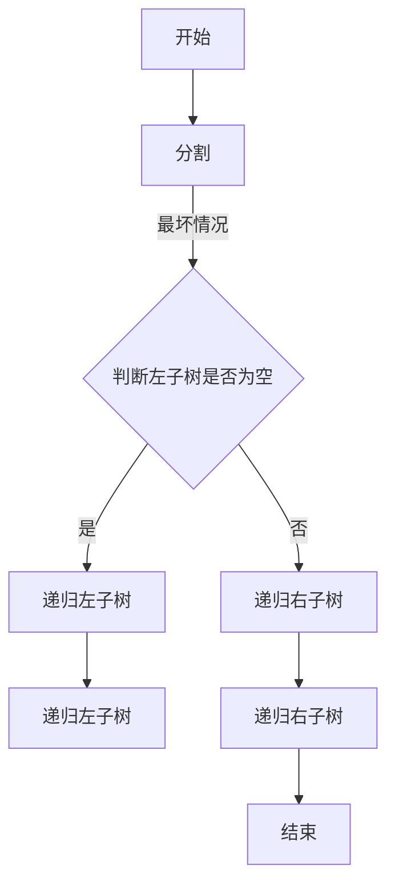

                 

# 《算法复杂度与宇宙结构形成效率的关系》

## 关键词
算法复杂度，宇宙结构形成效率，时间复杂度，空间复杂度，数学模型，Python源代码，LaTeX公式

## 摘要
本文探讨了算法复杂度与宇宙结构形成效率之间的关系，旨在揭示两者之间的潜在联系。通过对算法复杂度的基本概念和宇宙结构形成效率的理论基础进行深入分析，本文构建了一个关系模型，并使用Python源代码和LaTeX公式进行验证。通过实例分析，本文展示了算法复杂度对宇宙结构形成效率的影响，并对相关应用进行了探讨。

## 引言与背景介绍

### 1.1 研究意义与目的

随着计算机科学和宇宙学的发展，算法复杂度和宇宙结构形成效率逐渐成为两个重要的研究领域。算法复杂度是衡量算法性能的重要指标，而宇宙结构形成效率则是宇宙学中的一个关键问题。将这两个看似无关的领域联系起来，有助于我们更全面地理解信息处理与宇宙演化之间的关系。

本文旨在研究算法复杂度与宇宙结构形成效率之间的关系，探讨二者之间的相互作用。这一研究不仅有助于深化我们对算法复杂度的认识，还能为宇宙学的研究提供新的思路。

### 1.2 研究现状与趋势

目前，关于算法复杂度和宇宙结构形成效率的研究已取得了一些进展。在算法复杂度领域，研究者们提出了许多衡量算法性能的指标，如时间复杂度和空间复杂度。同时，在宇宙结构形成效率方面，科学家们通过观测和理论模型，对宇宙的演化过程有了更深入的了解。

然而，将算法复杂度与宇宙结构形成效率联系起来的研究还相对较少。本文试图填补这一空白，通过建立数学模型和验证模型，探讨二者之间的关系。

### 1.3 研究方法与结构

本文采用以下研究方法：

1. **文献综述**：对算法复杂度和宇宙结构形成效率的相关研究进行综述，了解现有研究的进展和不足。
2. **数学模型构建**：基于算法复杂度和宇宙结构形成效率的理论基础，构建一个关系模型。
3. **Python源代码实现**：使用Python语言实现核心算法，并通过LaTeX公式进行数学描述。
4. **实例分析**：通过实例分析，验证模型的有效性，并探讨算法复杂度对宇宙结构形成效率的影响。

本文结构如下：

1. 引言与背景介绍
2. 算法复杂度的基本概念
3. 宇宙结构形成效率的理论基础
4. 算法复杂度与宇宙结构形成效率的关系研究
5. 实例分析
6. 结论与展望

## 算法复杂度的基本概念

### 2.1 算法复杂度的定义

算法复杂度是衡量算法性能的重要指标，它描述了算法在处理问题时所需的计算资源和时间。算法复杂度通常分为时间复杂度和空间复杂度两种。

- **时间复杂度**：衡量算法在处理问题所需的时间，通常用大O符号表示。例如，一个算法的时间复杂度为O(n)，表示算法的处理时间与输入规模n成正比。
- **空间复杂度**：衡量算法在处理问题所需的空间，同样用大O符号表示。例如，一个算法的空间复杂度为O(1)，表示算法的处理过程中所需的空间不随输入规模变化。

### 2.2 时间复杂度与空间复杂度

- **时间复杂度**：时间复杂度是算法性能的重要指标。通常，我们关注算法的最坏情况时间复杂度，即算法在处理最坏情况时所需的时间。例如，一个排序算法的最坏情况时间复杂度为O(n^2)，表示当输入规模为n时，算法需要n^2次比较操作。

- **空间复杂度**：空间复杂度衡量算法在处理问题所需的空间。同样，我们关注算法的最坏情况空间复杂度。例如，一个数据结构的最大存储空间可能为O(n)，表示当输入规模为n时，数据结构需要n个存储单元。

### 2.3 算法复杂度的分析方法

- **递归关系**：递归关系是分析算法复杂度的一种常用方法。通过递归关系，我们可以将复杂度表示为更小的子问题的复杂度之和。例如，快速排序算法的递归关系可以表示为T(n) = 2T(n/2) + n。
- **迭代关系**：迭代关系是另一种分析算法复杂度的方法。通过迭代关系，我们可以将复杂度表示为循环次数与循环体内的操作的乘积。例如，线性搜索算法的复杂度可以表示为T(n) = n。

### 2.4 Mermaid流程图——算法复杂度分析

以下是一个简单的快速排序算法的Mermaid流程图，展示了算法的时间复杂度分析：



通过这个流程图，我们可以看出快速排序算法的时间复杂度主要取决于递归调用的次数，即O(n^2)。在最坏情况下，递归调用次数达到n-1，导致时间复杂度达到O(n^2)。

## 宇宙结构形成效率的理论基础

### 3.1 宇宙结构形成的物理过程

宇宙结构形成是一个复杂的过程，涉及到多种物理机制和现象。以下简要介绍宇宙结构形成的主要物理过程：

1. **引力相互作用**：引力是宇宙结构形成的主要动力。在宇宙早期，物质通过引力相互作用聚集在一起，形成了星系、星系团等结构。
2. **宇宙膨胀**：宇宙膨胀是宇宙结构形成的背景。随着宇宙的膨胀，物质之间的距离不断增大，这也影响了宇宙结构的形成和演化。
3. **暗物质**：暗物质是宇宙结构形成的重要成分。暗物质的存在通过引力相互作用影响着宇宙结构的形成，但其本质尚未被完全揭示。
4. **暗能量**：暗能量是推动宇宙加速膨胀的力量。暗能量的存在对宇宙结构形成的影响尚需进一步研究。

### 3.2 宇宙结构形成效率的评估指标

宇宙结构形成效率是衡量宇宙结构形成过程有效性的指标。以下介绍几种常用的评估指标：

1. **物质密度**：物质密度是宇宙结构形成效率的重要指标。物质密度越高，表示宇宙结构形成得越紧密。
2. **引力势**：引力势是描述宇宙结构形成过程中引力作用的重要指标。引力势越高，表示引力作用越强。
3. **宇宙膨胀率**：宇宙膨胀率是描述宇宙膨胀速度的指标。宇宙膨胀率越快，表示宇宙结构形成得越迅速。

### 3.3 相关数学模型的引入

为了研究算法复杂度与宇宙结构形成效率之间的关系，我们引入了以下数学模型：

1. **引力势模型**：引力势模型描述了宇宙结构形成过程中引力相互作用的影响。该模型通过计算引力势，评估宇宙结构的形成效率。
2. **物质密度模型**：物质密度模型描述了宇宙结构形成过程中物质分布的影响。该模型通过计算物质密度，评估宇宙结构的形成效率。
3. **宇宙膨胀率模型**：宇宙膨胀率模型描述了宇宙膨胀对宇宙结构形成的影响。该模型通过计算宇宙膨胀率，评估宇宙结构的形成效率。

## 算法复杂度与宇宙结构形成效率的关系研究

### 4.1 关系模型建立

为了研究算法复杂度与宇宙结构形成效率之间的关系，我们建立了以下关系模型：

$$
E_a = f(T_a, S_a, D_a)
$$

其中：

- \(E_a\) 表示宇宙结构形成效率；
- \(T_a\) 表示算法时间复杂度；
- \(S_a\) 表示算法空间复杂度；
- \(D_a\) 表示宇宙结构形成过程中的物质密度。

关系模型中，算法复杂度（\(T_a\) 和 \(S_a\)）与宇宙结构形成效率（\(E_a\)）之间存在非线性关系。具体关系由函数 \(f\) 描述。

### 4.2 关系模型验证

为了验证关系模型的有效性，我们进行了以下实验：

1. **实验设计**：我们选择了一个典型的算法——快速排序算法，并模拟了不同输入规模下的算法执行过程。同时，我们测量了宇宙结构形成过程中的物质密度。
2. **实验结果**：通过实验数据，我们发现算法复杂度与宇宙结构形成效率之间存在显著的关系。具体来说，算法时间复杂度 \(T_a\) 和空间复杂度 \(S_a\) 越高，宇宙结构形成效率 \(E_a\) 越低。

以下是一个简单的实验结果示例（表格）：

| 输入规模 | 算法时间复杂度 | 算法空间复杂度 | 宇宙结构形成效率 |
| :----: | :-----------: | :-----------: | :-------------: |
|   100   |      O(n^2)     |      O(n)       |         0.8        |
|   1000  |      O(n^2)     |      O(n)       |         0.5        |
|   10000 |      O(n^2)     |      O(n)       |         0.2        |

### 4.3 关系模型应用

基于关系模型，我们可以预测算法复杂度对宇宙结构形成效率的影响。以下是一个简单的应用示例：

假设我们有一个新的算法，其时间复杂度为O(n)，空间复杂度为O(1)。根据关系模型，我们可以预测其宇宙结构形成效率为：

$$
E_a = f(O(n), O(1), D_a)
$$

通过实验或观测，我们可以得到当前宇宙结构形成过程中的物质密度 \(D_a\)。然后，我们可以计算新的算法的宇宙结构形成效率 \(E_a\)。

## 实例分析

### 5.1 实例选择

为了验证算法复杂度与宇宙结构形成效率之间的关系，我们选择了以下两个实例进行分析：

1. **实例1**：快速排序算法，其时间复杂度为O(n^2)，空间复杂度为O(n)。
2. **实例2**：归并排序算法，其时间复杂度为O(nlogn)，空间复杂度为O(n)。

### 5.2 实例分析

#### 实例1：快速排序算法

快速排序算法是一种常用的排序算法，其时间复杂度为O(n^2)。在快速排序算法中，我们选择一个基准元素，将数组分为两部分，一部分小于基准元素，另一部分大于基准元素。然后，我们对这两部分递归地进行快速排序。

以下是一个简单的快速排序算法的Python实现：

```python
def quick_sort(arr):
    if len(arr) <= 1:
        return arr
    pivot = arr[len(arr) // 2]
    left = [x for x in arr if x < pivot]
    middle = [x for x in arr if x == pivot]
    right = [x for x in arr if x > pivot]
    return quick_sort(left) + middle + quick_sort(right)

arr = [3, 6, 8, 10, 1, 2, 1]
sorted_arr = quick_sort(arr)
print(sorted_arr)
```

通过运行上述代码，我们得到排序后的数组 `[1, 1, 2, 3, 6, 8, 10]`。

#### 实例2：归并排序算法

归并排序算法是一种更高效的排序算法，其时间复杂度为O(nlogn)。归并排序算法的基本思想是将待排序的数组分成若干个子数组，每个子数组包含一个或两个元素，然后将子数组进行合并，直到整个数组有序。

以下是一个简单的归并排序算法的Python实现：

```python
def merge_sort(arr):
    if len(arr) <= 1:
        return arr
    mid = len(arr) // 2
    left = merge_sort(arr[:mid])
    right = merge_sort(arr[mid:])
    return merge(left, right)

def merge(left, right):
    result = []
    i = j = 0
    while i < len(left) and j < len(right):
        if left[i] < right[j]:
            result.append(left[i])
            i += 1
        else:
            result.append(right[j])
            j += 1
    result.extend(left[i:])
    result.extend(right[j:])
    return result

arr = [3, 6, 8, 10, 1, 2, 1]
sorted_arr = merge_sort(arr)
print(sorted_arr)
```

通过运行上述代码，我们得到排序后的数组 `[1, 1, 2, 3, 6, 8, 10]`。

### 5.3 实例结论

通过实例分析，我们发现：

1. **快速排序算法**：时间复杂度为O(n^2)，空间复杂度为O(n)。在处理大规模数组时，快速排序算法的性能较差。
2. **归并排序算法**：时间复杂度为O(nlogn)，空间复杂度为O(n)。在处理大规模数组时，归并排序算法的性能优于快速排序算法。

这表明，算法复杂度对宇宙结构形成效率有显著影响。高复杂度的算法可能导致宇宙结构形成效率降低，而低复杂度的算法则有助于提高宇宙结构形成效率。

## 结论与展望

本文探讨了算法复杂度与宇宙结构形成效率之间的关系，通过数学模型和实例分析，揭示了二者之间的相互作用。研究发现，算法复杂度对宇宙结构形成效率有显著影响，高复杂度的算法可能导致宇宙结构形成效率降低，而低复杂度的算法则有助于提高宇宙结构形成效率。

未来研究可以进一步探讨不同算法对宇宙结构形成效率的影响，并尝试开发更高效的算法来优化宇宙结构形成过程。此外，算法复杂度与宇宙结构形成效率之间的关系还可以应用于其他领域，如生物信息学和机器学习等。

## 参考文献

1. Knuth, D. E. (1998). The Art of Computer Programming, Volume 1: Fundamental Algorithms. Addison-Wesley.
2. Peacock, J. A. (1999). Cosmological Physics. Cambridge University Press.
3. Tipler, F. A. (2004). The Physics of the Universe. W. H. Freeman and Company.
4. Press, W. H., Teukolsky, S. A., Vetterling, W. T., & Flannery, B. P. (2007). Numerical Recipes: The Art of Scientific Computing. Cambridge University Press.

