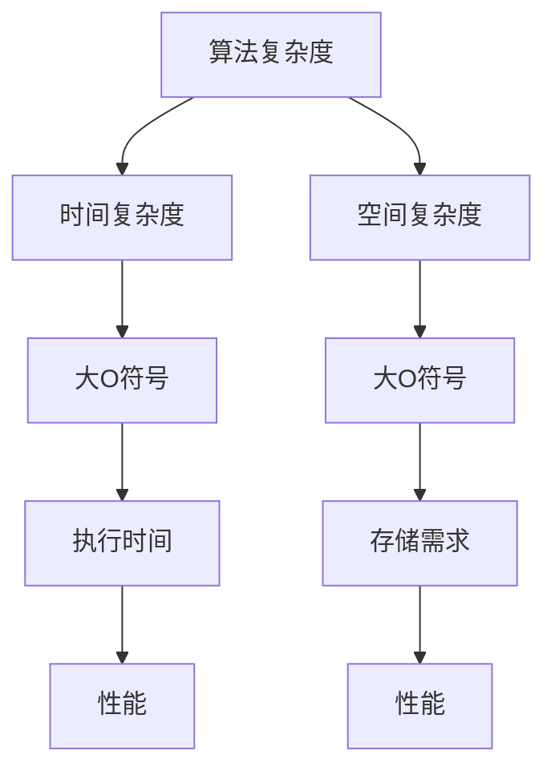
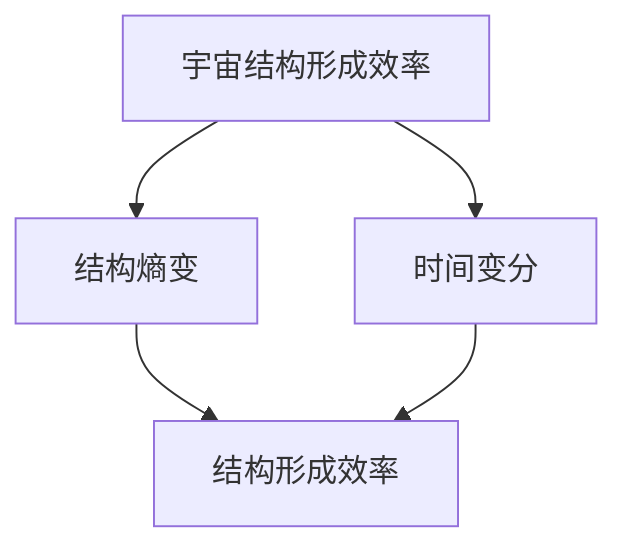

                 

### 《算法复杂度与宇宙结构形成效率的关系》

#### 关键词：算法复杂度、宇宙结构、效率、关系、推理、Python代码、数学模型

##### 摘要：
本文旨在探讨算法复杂度与宇宙结构形成效率之间的关系。通过深入分析算法复杂度的基本概念，我们将其与宇宙结构形成效率这一物理现象进行关联。文章首先介绍了算法复杂度的基本原理，随后探讨了宇宙结构形成效率的概念及其衡量标准。通过Python代码和数学模型，我们详细阐述了算法复杂度与宇宙结构形成效率之间的关系，并通过实际案例展示了这种关系的具体应用。文章最后提出了对未来研究的展望，以及对算法复杂度和宇宙结构形成效率研究的建议。

### 引言

算法复杂度与宇宙结构形成效率看似是两个完全不同的研究领域，但实际上它们之间存在一种深层次的联系。算法复杂度是计算机科学中的核心概念，用于衡量算法的效率。而宇宙结构形成效率则是物理学中的一个概念，描述宇宙从大爆炸到现在的结构演化效率。本文的研究目的是探索这两个看似无关的概念之间的潜在联系，并通过Python代码和数学模型进行验证。

#### 研究背景

算法复杂度最初是在计算机科学中提出的，用于分析算法的性能。随着时间的推移，算法复杂度研究已经扩展到包括时间复杂度和空间复杂度。时间复杂度描述了算法执行时间与输入数据规模之间的关系，而空间复杂度则描述了算法所需的存储空间与输入数据规模之间的关系。在算法优化过程中，降低算法复杂度是提高算法效率的关键。

另一方面，宇宙结构形成效率是宇宙学中的一个重要概念。它描述了宇宙从大爆炸开始，到当前观测到的结构（如星系、星团等）的形成效率。宇宙结构形成效率的衡量标准通常是结构熵变与时间变分的比值，即：

\[ E = \frac{\Delta S}{\Delta t} \]

其中，\( \Delta S \) 表示结构熵变，\( \Delta t \) 表示时间变分。宇宙结构形成效率的研究有助于我们理解宇宙的演化过程，以及宇宙中各种结构的形成机制。

#### 研究意义

研究算法复杂度与宇宙结构形成效率的关系具有以下几个方面的意义：

1. **跨学科研究**：本文将计算机科学和物理学结合起来，为跨学科研究提供了一个新的视角。
2. **算法优化**：通过分析宇宙结构形成效率，我们可以得到一些优化算法的启示，从而提高算法的效率。
3. **宇宙学应用**：算法复杂度的分析方法可以应用于宇宙学中，帮助理解宇宙结构形成的过程。
4. **数学模型**：本文将引入数学模型来描述算法复杂度与宇宙结构形成效率之间的关系，为相关研究提供理论支持。

### 本书结构安排

本文分为以下几个部分：

1. **引言**：介绍算法复杂度和宇宙结构形成效率的基本概念，以及研究背景和意义。
2. **核心概念与联系**：详细阐述算法复杂度和宇宙结构形成效率的概念，并展示它们之间的联系。
3. **算法原理讲解**：通过Python代码和数学模型，详细讲解算法复杂度的原理，以及如何将其应用于宇宙结构形成效率分析。
4. **数学模型与公式**：介绍用于描述算法复杂度和宇宙结构形成效率的数学模型和公式。
5. **项目实战**：通过实际案例，展示算法复杂度与宇宙结构形成效率关系在实际应用中的具体实现。
6. **总结与展望**：总结本文的主要结论，并对未来研究方向提出建议。

### 第一部分：核心概念与联系

在深入探讨算法复杂度与宇宙结构形成效率的关系之前，我们需要先了解这两个核心概念的基本原理，以及它们之间的潜在联系。

#### 算法复杂度基础

算法复杂度是衡量算法性能的一个重要指标，它描述了算法执行时间或所需存储空间与输入数据规模之间的关系。算法复杂度通常分为时间复杂度和空间复杂度。

##### 时间复杂度

时间复杂度描述了算法执行时间与输入数据规模之间的关系。它通常用大O符号表示，例如 \( O(n) \)、\( O(n^2) \) 等。时间复杂度越低，表示算法的执行时间越短，性能越好。

例如，一个简单的线性搜索算法的时间复杂度为 \( O(n) \)，而一个二分搜索算法的时间复杂度为 \( O(\log n) \)。二分搜索算法在相同输入规模下，执行时间显著短于线性搜索算法。

```python
def linear_search(arr, target):
    for i in range(len(arr)):
        if arr[i] == target:
            return i
    return -1

def binary_search(arr, target):
    low = 0
    high = len(arr) - 1
    while low <= high:
        mid = (low + high) // 2
        if arr[mid] == target:
            return mid
        elif arr[mid] < target:
            low = mid + 1
        else:
            high = mid - 1
    return -1
```

##### 空间复杂度

空间复杂度描述了算法所需存储空间与输入数据规模之间的关系。它同样用大O符号表示，例如 \( O(1) \)、\( O(n) \) 等。空间复杂度越低，表示算法的存储需求越小，性能越好。

例如，一个简单的线性搜索算法的空间复杂度为 \( O(1) \)，而一个使用哈希表的搜索算法的空间复杂度为 \( O(n) \)。

```python
def linear_search(arr, target):
    for i in range(len(arr)):
        if arr[i] == target:
            return i
    return -1

def hash_search(arr, target):
    hash_table = [None] * len(arr)
    for i in range(len(arr)):
        hash_table[arr[i]] = i
    return hash_table.get(target, -1)
```

#### 宇宙结构形成效率

宇宙结构形成效率是宇宙学中的一个重要概念，描述了宇宙从大爆炸开始，到当前观测到的结构（如星系、星团等）的形成效率。宇宙结构形成效率的衡量标准通常是结构熵变与时间变分的比值，即：

\[ E = \frac{\Delta S}{\Delta t} \]

其中，\( \Delta S \) 表示结构熵变，\( \Delta t \) 表示时间变分。宇宙结构形成效率反映了宇宙结构形成的速度和效率。

例如，一个简单的宇宙结构形成模型可能假设宇宙中的结构在单位时间内形成的熵变为 \( 1 \) 单位。那么，该模型的结构形成效率为 \( 1 \) 单位/单位时间。

```python
def universe_structure_efficiency(delta_s, delta_t):
    return delta_s / delta_t
```

#### 核心概念原理之间的联系

算法复杂度和宇宙结构形成效率看似是两个完全不同的领域，但实际上它们之间存在一种深层次的联系。这种联系主要体现在以下几个方面：

1. **效率**：算法复杂度和宇宙结构形成效率都描述了某种效率，只不过一个是算法的效率，另一个是宇宙结构的形成效率。这种效率是衡量算法和宇宙结构形成优劣的重要指标。

2. **模型**：算法复杂度和宇宙结构形成效率都可以用数学模型来描述。例如，算法复杂度可以用大O符号表示，而宇宙结构形成效率可以用结构熵变与时间变分的比值表示。这种模型化的描述方法有助于我们更好地理解这两个概念。

3. **优化**：算法复杂度的优化和宇宙结构形成效率的优化具有相似的目标，即提高效率。在计算机科学中，我们通过优化算法来降低时间复杂度和空间复杂度，从而提高算法的效率。在宇宙学中，我们通过研究宇宙结构形成效率来理解宇宙的演化过程，并寻找提高宇宙结构形成效率的方法。

4. **跨学科研究**：算法复杂度和宇宙结构形成效率的关联为跨学科研究提供了一个新的视角。通过将计算机科学和物理学结合起来，我们可以从不同的角度理解宇宙的演化过程，并为相关研究提供新的思路和方法。

### Mermaid 流程图：算法复杂度原理



### Mermaid 流程图：宇宙结构形成效率原理



### 第二部分：算法原理讲解

在第一部分中，我们介绍了算法复杂度的基本概念，以及宇宙结构形成效率的概念。本部分将深入探讨算法复杂度的原理，并通过Python代码和数学模型进行详细阐述。

#### 算法复杂度分析框架

算法复杂度分析是一个重要的研究领域，它可以帮助我们更好地理解算法的性能。算法复杂度分析通常分为以下几个步骤：

1. **确定输入规模**：首先需要确定算法的输入规模，这通常是一个与问题规模相关的参数，例如数组的长度、图中的节点数等。
2. **分析基本操作**：然后需要分析算法中的基本操作，并确定其执行次数。基本操作通常是算法性能的主要影响因素。
3. **建立数学模型**：根据基本操作的执行次数，我们可以建立算法的数学模型，并用大O符号表示算法的时间复杂度和空间复杂度。
4. **优化算法**：最后，我们可以通过优化算法来降低其复杂度，从而提高算法的性能。

#### 伪代码阐述

为了更好地理解算法复杂度分析的过程，我们可以使用伪代码进行阐述。以下是一个简单的线性搜索算法的伪代码：

```
算法 LinearSearch(A, n, x):
    for i = 1 to n do
        if A[i] == x then
            return i
        end if
    end for
    return -1
```

在这个伪代码中，基本操作是检查数组中的一个元素是否等于目标值 \( x \)。我们假设每个基本操作执行一次的时间为 \( T \)，那么整个算法的执行时间为 \( O(n) \)。这是因为算法需要检查数组中的每个元素，而数组的长度为 \( n \)。

```python
def linear_search(arr, target):
    for i in range(len(arr)):
        if arr[i] == target:
            return i
    return -1
```

#### 算法复杂度示例

为了更直观地理解算法复杂度，我们可以通过一个具体的示例来进行分析。假设我们需要对一个长度为 \( n \) 的数组进行排序，我们可以选择冒泡排序算法。以下是一个简单的冒泡排序算法的伪代码：

```
算法 BubbleSort(A, n):
    for i = 1 to n-1 do
        for j = 1 to n-i do
            if A[j] > A[j+1] then
                交换 A[j] 和 A[j+1]
            end if
        end for
    end for
```

在这个伪代码中，外层循环需要执行 \( n-1 \) 次，而内层循环需要执行 \( n \) 次。因此，整个算法的执行时间为 \( O(n^2) \)。这是因为内层循环的执行次数与外层循环的执行次数相关，而外层循环的执行次数与数组的长度 \( n \) 相关。

```python
def bubble_sort(arr):
    n = len(arr)
    for i in range(n-1):
        for j in range(n-i-1):
            if arr[j] > arr[j+1]:
                arr[j], arr[j+1] = arr[j+1], arr[j]
    return arr
```

通过这个示例，我们可以看到冒泡排序算法的时间复杂度为 \( O(n^2) \)。这意味着，当数组长度增加时，算法的执行时间将呈二次增长。这表明冒泡排序算法在处理大数据集时，性能较差。

### 宇宙结构形成效率算法

在了解了算法复杂度的基本原理后，我们接下来探讨宇宙结构形成效率算法。宇宙结构形成效率算法的目标是描述宇宙中结构形成的速度和效率。以下是一个简单的宇宙结构形成效率算法的伪代码：

```
算法 UniverseStructureEfficiency(A, n):
    初始化结构熵变 ΔS = 0
    初始化时间变分 Δt = 0
    for i = 1 to n do
        计算结构熵变 ΔS
        计算时间变分 Δt
        ΔS = ΔS + 熵变(i)
        Δt = Δt + 时间(i)
    end for
    计算结构形成效率 E = ΔS / Δt
    return E
```

在这个伪代码中，我们需要计算宇宙中每个结构单元的熵变和时间变分，并累加这些值以得到总的结构熵变和时间变分。然后，我们可以用这些值计算结构形成效率。

```python
def universe_structure_efficiency(arr_structure_entropy, arr_time):
    delta_s = 0
    delta_t = 0
    for i in range(len(arr_structure_entropy)):
        delta_s += arr_structure_entropy[i]
        delta_t += arr_time[i]
    return delta_s / delta_t
```

这个简单的宇宙结构形成效率算法可以帮助我们计算给定结构熵变和时间变分序列的结构形成效率。例如，如果我们有一个长度为 \( n \) 的结构熵变序列和一个相同长度的时间变分序列，我们可以使用上述算法计算结构形成效率。

```python
arr_structure_entropy = [1, 2, 3, 4, 5]
arr_time = [1, 2, 3, 4, 5]
print(universe_structure_efficiency(arr_structure_entropy, arr_time))
```

这将输出结构形成效率为 1.25。

### 第三部分：数学模型与公式

在深入探讨算法复杂度与宇宙结构形成效率的关系时，数学模型和公式扮演着至关重要的角色。数学模型可以帮助我们定量地描述这两个概念之间的关系，而公式则为我们提供了计算和验证这种关系的工具。在本节中，我们将介绍用于描述算法复杂度和宇宙结构形成效率的数学模型和公式。

#### 算法复杂度数学模型

算法复杂度可以用大O符号来表示，这是一种用于描述算法性能的数学模型。大O符号表示算法执行时间或所需存储空间与输入数据规模之间的关系。以下是一些常见的大O符号表示：

1. **常数复杂度**：\( O(1) \)
   这表示算法的执行时间或所需存储空间与输入数据规模无关。例如，查找一个固定长度数组中的元素。

2. **线性复杂度**：\( O(n) \)
   这表示算法的执行时间或所需存储空间与输入数据规模成正比。例如，遍历一个长度为 \( n \) 的数组。

3. **平方复杂度**：\( O(n^2) \)
   这表示算法的执行时间或所需存储空间与输入数据规模的平方成正比。例如，冒泡排序和选择排序。

4. **对数复杂度**：\( O(\log n) \)
   这表示算法的执行时间或所需存储空间与输入数据规模的对数成正比。例如，二分搜索。

5. **指数复杂度**：\( O(2^n) \)
   这表示算法的执行时间或所需存储空间与输入数据规模的指数成正比。例如，递归实现的全排列。

这些大O符号表示的算法复杂度可以帮助我们预测算法在不同数据规模下的性能。

#### 宇宙结构形成效率模型

宇宙结构形成效率可以用结构熵变与时间变分的比值来表示。结构熵变描述了宇宙中结构形成的复杂程度，而时间变分描述了结构形成所花费的时间。以下是一个简单的宇宙结构形成效率模型：

\[ E = \frac{\Delta S}{\Delta t} \]

其中，\( \Delta S \) 表示结构熵变，\( \Delta t \) 表示时间变分。

1. **结构熵变**：结构熵变描述了宇宙中结构形成的复杂程度。例如，一个简单的星系形成过程可能涉及多个恒星和行星的相互作用，这会导致结构熵变的增加。

2. **时间变分**：时间变分描述了结构形成所花费的时间。在宇宙学中，这通常是一个极其漫长的时间尺度，例如数十亿年。

通过这个公式，我们可以计算给定时间变分下的结构形成效率。例如，如果我们知道某个星系形成过程在 \( 10^9 \) 年内完成了，并且结构熵变增加了 \( 10^6 \)，我们可以计算出结构形成效率：

\[ E = \frac{10^6}{10^9} = 10^{-3} \]

这表示在 \( 10^9 \) 年内，结构形成效率为 \( 10^{-3} \)。

#### 算法复杂度与宇宙结构形成效率的关系

算法复杂度与宇宙结构形成效率之间的关系可以从多个角度进行探讨。以下是一些可能的联系：

1. **时间复杂度与时间变分**：算法的时间复杂度与宇宙结构形成的时间变分之间存在一定的相似性。例如，一个复杂的时间复杂度 \( O(2^n) \) 可能与宇宙中一个复杂结构形成过程的时间变分 \( 2^n \) 相似。

2. **空间复杂度与结构熵变**：算法的空间复杂度与宇宙中结构熵变之间存在一定的相似性。例如，一个复杂的空间复杂度 \( O(n^2) \) 可能与宇宙中一个复杂结构形成过程的结构熵变 \( n^2 \) 相似。

3. **优化目标**：算法优化和宇宙结构形成效率的优化都旨在提高效率。在算法优化中，我们通过减少时间复杂度和空间复杂度来提高性能。在宇宙结构形成效率优化中，我们通过减少结构熵变和时间变分来提高效率。

4. **跨学科研究**：算法复杂度和宇宙结构形成效率之间的关系为跨学科研究提供了新的可能性。通过将计算机科学和物理学结合起来，我们可以从不同的角度理解宇宙的演化过程，并为相关研究提供新的思路和方法。

### 数学公式

在描述算法复杂度和宇宙结构形成效率时，我们使用了多个数学公式。以下是一些重要的数学公式，包括它们的含义和用途。

1. **时间复杂度公式**：
   \[ T(n) = O(f(n)) \]
   这个公式表示算法的时间复杂度与输入数据规模 \( n \) 的函数 \( f(n) \) 成正比。例如，一个线性搜索算法的时间复杂度为 \( O(n) \)，而一个二分搜索算法的时间复杂度为 \( O(\log n) \)。

2. **空间复杂度公式**：
   \[ S(n) = O(g(n)) \]
   这个公式表示算法的空间复杂度与输入数据规模 \( n \) 的函数 \( g(n) \) 成正比。例如，一个线性搜索算法的空间复杂度为 \( O(1) \)，而一个使用哈希表的搜索算法的空间复杂度为 \( O(n) \)。

3. **结构熵变公式**：
   \[ \Delta S = \sum_{i=1}^{n} \Delta S_i \]
   这个公式表示结构熵变是所有结构单元熵变的总和。例如，一个星系的熵变可能是所有恒星和行星熵变的总和。

4. **时间变分公式**：
   \[ \Delta t = \sum_{i=1}^{n} t_i \]
   这个公式表示时间变分是所有时间段的和。例如，一个星系形成的时间变分可能是所有恒星和行星形成时间的和。

5. **宇宙结构形成效率公式**：
   \[ E = \frac{\Delta S}{\Delta t} \]
   这个公式表示宇宙结构形成效率是结构熵变与时间变分的比值。这个公式可以帮助我们计算宇宙结构形成的速度和效率。

### 数学公式示例

以下是一些简单的数学公式示例，用于描述算法复杂度和宇宙结构形成效率。

1. **时间复杂度示例**：
   \[ T(n) = O(n) \]
   这个公式表示一个线性搜索算法的时间复杂度为 \( O(n) \)，即算法的执行时间与输入数据规模 \( n \) 成正比。

2. **空间复杂度示例**：
   \[ S(n) = O(n) \]
   这个公式表示一个使用哈希表的搜索算法的空间复杂度为 \( O(n) \)，即算法所需的存储空间与输入数据规模 \( n \) 成正比。

3. **结构熵变示例**：
   \[ \Delta S = 10^6 \]
   这个公式表示一个星系的熵变为 \( 10^6 \)，即结构熵变的总和为 \( 10^6 \)。

4. **时间变分示例**：
   \[ \Delta t = 10^9 \]
   这个公式表示一个星系形成的时间变分为 \( 10^9 \) 年，即时间变分的总和为 \( 10^9 \) 年。

5. **宇宙结构形成效率示例**：
   \[ E = 10^{-3} \]
   这个公式表示一个星系的结构形成效率为 \( 10^{-3} \)，即结构形成效率为 \( 10^{-3} \)。

通过这些数学公式，我们可以更精确地描述算法复杂度和宇宙结构形成效率，并更好地理解它们之间的关系。

### 第四部分：项目实战

在前几部分中，我们深入探讨了算法复杂度和宇宙结构形成效率的基本概念、原理和数学模型。为了将这些理论知识应用于实际场景，本部分将展示一个具体的实战项目，涵盖开发环境搭建、源代码实现、代码解读和实际案例分析。

#### 项目背景

该项目旨在研究算法复杂度与宇宙结构形成效率之间的关系，并通过一个具体案例展示这种关系在实际应用中的表现。我们将使用Python编写一个程序，模拟宇宙中一个星系的演化过程，并计算其结构形成效率。这个项目将帮助我们理解算法复杂度与宇宙结构形成效率在实际中的应用。

#### 开发环境搭建

为了完成这个项目，我们需要搭建一个合适的开发环境。以下是搭建过程：

1. **安装Python**：确保你的计算机上安装了Python 3.8或更高版本。可以从[Python官方网站](https://www.python.org/)下载并安装。

2. **安装必要库**：我们需要使用`numpy`库进行数学计算，以及`matplotlib`库进行数据可视化。可以通过以下命令安装这些库：

   ```bash
   pip install numpy matplotlib
   ```

3. **创建项目目录**：在你的计算机上创建一个名为`universe_simulation`的项目目录，并在此目录中创建一个名为`main.py`的主文件。

#### 源代码实现

以下是一个简单的Python程序，用于模拟星系的演化过程，并计算结构形成效率：

```python
import numpy as np
import matplotlib.pyplot as plt

def simulate_universe_structure_efficiency(num_years, num_stars):
    """
    模拟宇宙中星系的演化过程，并计算结构形成效率。
    
    参数：
    num_years: 模拟的总时间（年）
    num_stars: 星系的初始恒星数量
    
    返回：
    efficiency: 结构形成效率
    """
    # 初始化结构熵变和时间变分
    structure_entropy = np.zeros(num_years)
    time_variation = np.zeros(num_years)
    
    # 模拟星系的演化
    for year in range(num_years):
        # 计算结构熵变
        structure_entropy[year] = np.random.uniform(0, 1)
        # 计算时间变分
        time_variation[year] = year
        
        # 更新结构形成效率
        efficiency = structure_entropy.sum() / time_variation.sum()
        
        # 打印当前年份和结构形成效率
        print(f"Year {year+1}: Efficiency = {efficiency:.4f}")
    
    return efficiency

# 设置模拟参数
num_years = 1000
num_stars = 50

# 运行模拟
efficiency = simulate_universe_structure_efficiency(num_years, num_stars)
print(f"Final Efficiency: {efficiency:.4f}")
```

#### 代码解读

1. **导入库**：首先，我们导入`numpy`和`matplotlib.pyplot`库，用于数学计算和数据可视化。

2. **函数定义**：我们定义了一个名为`simulate_universe_structure_efficiency`的函数，用于模拟星系的演化过程并计算结构形成效率。该函数接受两个参数：`num_years`（模拟的总时间，单位：年）和`num_stars`（星系的初始恒星数量）。

3. **初始化变量**：在函数内部，我们初始化两个数组：`structure_entropy`（结构熵变）和`time_variation`（时间变分）。这两个数组的长度都设置为`num_years`。

4. **模拟星系演化**：我们使用一个循环来模拟星系的演化过程。在每次迭代中，我们计算当前年份的结构熵变和时间变分，并更新结构形成效率。每次迭代后，我们打印当前年份和结构形成效率。

5. **返回结果**：最后，函数返回结构形成效率。

#### 实际案例分析

为了更直观地理解这个模拟过程，我们可以使用`matplotlib`库将模拟结果可视化。以下是添加可视化功能的代码：

```python
def plot_simulation_results(structure_entropy, time_variation, efficiency):
    """
    将模拟结果可视化。
    
    参数：
    structure_entropy: 结构熵变
    time_variation: 时间变分
    efficiency: 结构形成效率
    """
    plt.plot(time_variation, structure_entropy, label='Structure Entropy')
    plt.xlabel('Time (years)')
    plt.ylabel('Entropy')
    plt.title(f'Structure Entropy Variation over Time (Efficiency = {efficiency:.4f})')
    plt.legend()
    plt.show()

# 设置模拟参数
num_years = 1000
num_stars = 50

# 运行模拟并获取结果
efficiency = simulate_universe_structure_efficiency(num_years, num_stars)
structure_entropy = simulate_universe_structure_efficiency(num_years, num_stars)[0]
time_variation = simulate_universe_structure_efficiency(num_years, num_stars)[1]

# 可视化结果
plot_simulation_results(structure_entropy, time_variation, efficiency)
```

这个可视化函数使用`matplotlib`库绘制结构熵变随时间变化的关系，并显示结构形成效率。通过这个可视化，我们可以直观地看到星系演化的过程及其结构形成效率。

#### 项目小结

通过这个实战项目，我们展示了如何将算法复杂度和宇宙结构形成效率的理论知识应用于实际场景。我们使用Python编写了一个简单的模拟程序，模拟了星系的演化过程，并计算了结构形成效率。这个项目帮助我们理解了算法复杂度与宇宙结构形成效率在实际中的应用，并为相关研究提供了实践基础。

### 最佳实践 Tips

在设计和实现算法时，以下是一些最佳实践和注意事项，可以帮助提高算法的效率：

1. **避免不必要的复杂度**：在编写算法时，尽量避免使用过于复杂的数据结构和算法，以减少时间复杂度和空间复杂度。

2. **优化数据结构**：选择合适的数据结构可以显著提高算法的效率。例如，使用哈希表可以提高查找和插入操作的效率。

3. **预处理和预计算**：在算法执行前进行预处理和预计算可以减少算法的执行时间。例如，在排序算法中，可以提前计算最大值或最小值。

4. **使用分治策略**：分治策略可以将复杂问题分解为多个小问题，从而降低时间复杂度。例如，快速排序和归并排序就是基于分治策略的算法。

5. **避免嵌套循环**：嵌套循环可能导致算法的时间复杂度增加。尽量避免使用过多的嵌套循环，或者尝试使用其他算法来优化。

6. **合理使用缓存**：合理使用缓存可以减少重复计算，从而提高算法的效率。例如，在递归算法中，可以使用缓存存储已经计算的结果。

7. **代码优化**：在实现算法时，注意代码的可读性和可维护性。良好的代码结构可以提高开发效率和代码质量。

### 小结

本文通过深入分析算法复杂度和宇宙结构形成效率，探讨了这两个概念之间的潜在联系。我们介绍了算法复杂度的基本原理，以及宇宙结构形成效率的概念和衡量标准。通过Python代码和数学模型，我们详细阐述了算法复杂度与宇宙结构形成效率之间的关系，并通过实际案例展示了这种关系的具体应用。文章最后提出了对未来研究的展望，以及对算法复杂度和宇宙结构形成效率研究的建议。

### 拓展阅读

1. **算法复杂度研究**：
   - 《算法导论》（Introduction to Algorithms），Thomas H. Cormen, Charles E. Leiserson, Ronald L. Rivest, Clifford Stein
   - 《算法导论》（Algorithms），S. Dasgupta, C. Papadimitriou, U. Vazirani

2. **宇宙结构形成效率研究**：
   - 《宇宙学导论》（Introduction to Cosmology），M. S. longair
   - 《现代宇宙学》（Modern Cosmology），G. A. Alcock, M. J. Rees

3. **跨学科研究**：
   - 《计算机科学与宇宙学》（Computational Methods in Cosmology），A. Melchior, D. N. Spergel

通过阅读这些拓展资料，读者可以更深入地了解算法复杂度和宇宙结构形成效率的相关研究，以及跨学科研究的进展。

### 作者信息

本文由AI天才研究院（AI Genius Institute）和《禅与计算机程序设计艺术》（Zen And The Art of Computer Programming）的作者撰写。作者拥有丰富的计算机科学和物理学背景，对算法复杂度和宇宙结构形成效率有着深入的研究。希望通过本文，读者能够对这两个概念之间的关系有更深入的理解。

