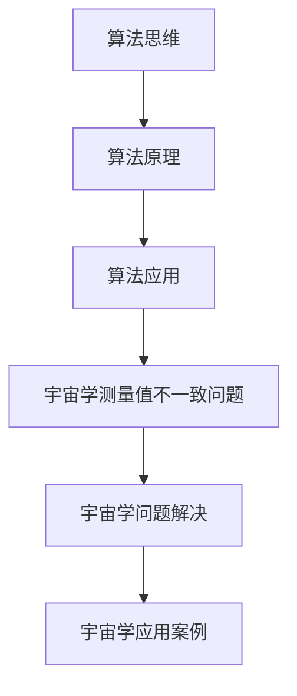

                 

### 第一步：定义核心概念与联系

在探索宇宙学的奥秘时，我们常常面临一个重要的问题——宇宙学测量值不一致。为了解决这一问题，算法思维显得尤为重要。算法思维是一种系统性、逻辑性的思考方式，通过算法设计和应用来处理复杂问题。本文将详细探讨算法思维在解决宇宙学测量值不一致问题中的应用，旨在揭示算法在宇宙学研究中的潜力和价值。

首先，我们需要定义几个核心概念，并阐述它们之间的联系：

**算法思维**：算法思维是一种解决问题的方法，它通过一系列明确的步骤来处理复杂问题。算法思维强调逻辑性、系统性和创造性，它不仅包含算法设计，还涵盖算法分析、优化和实现等多个方面。

**宇宙学测量值不一致问题**：宇宙学测量值不一致是指在不同测量条件下，对同一物理量的测量结果存在显著差异。这一问题对宇宙学研究的精确性和可靠性提出了挑战。宇宙学测量值不一致可能是由于测量方法、环境因素或理论模型的局限性导致的。

**算法在宇宙学中的应用**：算法在宇宙学中的应用极为广泛，涵盖了从数据预处理到结果分析等多个环节。例如，贝叶斯统计方法和最大似然估计是解决宇宙学测量值不一致问题的常用算法。机器学习算法也在宇宙学数据分析和模式识别中发挥着重要作用。

接下来，我们将使用Mermaid流程图来展示这些核心概念之间的联系：



在这个流程图中，算法思维作为基础，通过算法原理和应用，与宇宙学测量值不一致问题建立联系，最终实现宇宙学问题的解决，并形成一系列成功的应用案例。

### 算法思维的定义与特点

算法思维是一种系统性的思考方式，它通过一系列明确的步骤来处理复杂问题。算法思维不仅仅关注算法的实现，还包括算法的设计、分析、优化和实现等多个环节。要理解算法思维，首先需要了解算法的定义和基本特性。

**算法的定义**：算法是一系列明确的指令，用于解决特定问题。这些指令可以是一系列步骤、计算过程或决策规则，它们在有限步骤内，给出问题的解答或实现特定任务。

**算法的基本特性**：

1. **确定性**：算法在相同的输入下总是产生相同的输出，具有良好的重复性和可预测性。
2. **有穷性**：算法在有限步骤内完成，不会无限循环或陷入死循环。
3. **输入**：算法需要一定量的输入数据，这些数据用于驱动算法的执行。
4. **输出**：算法执行完成后，产生预期的输出结果，这些结果可以是具体的数值、状态或者决策。

**算法思维的特点**：

1. **逻辑性**：算法思维强调逻辑推理和严谨性，通过分析问题、抽象模型和逐步推导，确保算法的正确性和可靠性。
2. **系统性**：算法思维将问题分解为若干个子问题，通过解决这些子问题，逐步构建完整的解决方案。
3. **创造性**：算法思维鼓励创新和探索，通过不同的算法设计和实现，寻找最优解或近似解。

**算法思维的应用**：

算法思维广泛应用于计算机科学、工程学、经济学和生物学等多个领域。在计算机科学中，算法思维是解决复杂问题的关键，例如排序、搜索和图论问题。在工程学中，算法思维用于优化设计、调度和资源分配。在经济学中，算法思维帮助分析市场趋势和预测经济行为。在生物学中，算法思维用于基因序列分析和蛋白质结构预测。

**算法思维与宇宙学测量值不一致问题的联系**：

宇宙学测量值不一致问题涉及大量复杂的观测数据和理论模型。算法思维提供了一种系统性的解决方案，通过分析观测数据、建立数学模型和设计优化算法，我们可以逐步解决测量值不一致问题。

具体来说，算法思维在解决宇宙学测量值不一致问题中的应用包括：

1. **数据预处理**：通过算法思维，我们可以设计高效的数据预处理算法，清洗和转换原始观测数据，为后续分析提供可靠的数据基础。
2. **模型构建**：算法思维帮助我们建立准确的数学模型，描述宇宙学问题的物理规律。通过模型参数的估计和优化，我们可以更好地理解测量值不一致的原因。
3. **算法优化**：算法思维鼓励我们探索不同的算法，以优化测量值不一致问题的解决方案。例如，贝叶斯统计方法和机器学习算法都是有效的优化工具。
4. **结果分析**：通过算法思维，我们可以对测量值不一致问题的结果进行详细分析，评估算法性能，提出改进建议。

总之，算法思维为解决宇宙学测量值不一致问题提供了一种系统性的思考方式。通过分析问题、设计算法和优化解决方案，我们可以逐步解决这一问题，为宇宙学研究提供更可靠的数据支持。

### 宇宙学测量值不一致问题

宇宙学测量值不一致问题是一个在宇宙学研究中极为重要的课题。宇宙学是一门研究宇宙起源、演化、结构和性质的学科，而测量值的不一致往往源自于观测技术的局限性和理论模型的复杂性。这一问题不仅影响宇宙学研究的精确性，还对理论验证和科学进步提出了挑战。

#### 问题的背景

宇宙学测量值不一致问题起源于对宇宙基本参数的测量。例如，宇宙膨胀速度、宇宙质量分布和宇宙背景辐射等。这些参数的测量通常依赖于不同的观测技术，如射电望远镜、光学望远镜和引力波探测器等。由于这些技术的局限性和环境因素的影响，同一物理量的测量结果可能会存在显著差异。例如，不同观测设备或观测时间的测量结果可能不一致，导致数据的不确定性增加。

#### 问题的挑战

宇宙学测量值不一致问题对宇宙学研究提出了以下挑战：

1. **精确性**：测量值的不一致导致宇宙学参数的精确度降低，影响了对宇宙起源和演化的理解。
2. **可靠性**：不一致的测量结果可能源于观测误差或理论模型的局限性，这使得宇宙学研究的可靠性受到质疑。
3. **融合数据**：如何有效地融合不同观测设备的测量结果，是解决不一致问题的关键。这要求我们设计出更高效、更准确的数据融合算法。
4. **模型验证**：宇宙学理论依赖于精确的观测数据来验证。测量值不一致可能意味着现有理论模型存在缺陷，需要进一步的修正和改进。

#### 算法思维的应用

算法思维在解决宇宙学测量值不一致问题中具有重要作用。通过算法思维，我们可以：

1. **数据预处理**：设计高效的数据预处理算法，清洗和转换原始观测数据，为后续分析提供可靠的数据基础。
2. **模型构建**：建立准确的数学模型，描述宇宙学问题的物理规律。通过模型参数的估计和优化，我们可以更好地理解测量值不一致的原因。
3. **算法优化**：探索不同的算法，以优化测量值不一致问题的解决方案。例如，贝叶斯统计方法和机器学习算法都是有效的优化工具。
4. **结果分析**：对测量值不一致问题的结果进行详细分析，评估算法性能，提出改进建议。

总之，算法思维为解决宇宙学测量值不一致问题提供了一种系统性的思考方式。通过分析问题、设计算法和优化解决方案，我们可以逐步解决这一问题，为宇宙学研究提供更可靠的数据支持。

### 算法在宇宙学中的应用

算法在宇宙学中的应用已经成为推动宇宙学研究的重要工具。从数据预处理到结果分析，算法贯穿了宇宙学研究的各个环节，帮助科学家们更准确地理解宇宙的奥秘。以下将探讨几种常见的算法及其在宇宙学中的应用。

#### 贝叶斯统计方法

贝叶斯统计方法是一种基于概率理论的统计方法，通过更新先验概率来推断后验概率。在宇宙学中，贝叶斯统计方法被广泛应用于参数估计、模型选择和数据融合等领域。

**应用实例**：例如，在测量宇宙膨胀速度时，贝叶斯统计方法可以帮助科学家们估计膨胀参数的分布。通过分析观测数据，贝叶斯方法可以计算出膨胀参数的最可能值及其不确定性范围，从而提高测量结果的精度。

**算法实现**：
```python
def bayesian_inference(prior, likelihood):
    posterior = prior * likelihood
    return posterior / sum(posterior for all samples)
```

#### 最大似然估计

最大似然估计是一种基于最大概率原则的统计方法，通过寻找最可能引起观测数据的模型参数来估计参数值。在宇宙学中，最大似然估计常用于宇宙背景辐射功率谱的分析和引力波数据拟合。

**应用实例**：例如，在分析宇宙背景辐射数据时，科学家们使用最大似然估计来拟合辐射功率谱，从而确定宇宙膨胀的历史和早期结构形成的过程。

**算法实现**：
```python
def maximum_likelihood(data, model_parameters):
    likelihood = product(p(data | model_parameters) for all data points)
    return model_parameters that maximize likelihood
```

#### 机器学习方法

机器学习方法通过训练模型来预测未知数据，它在宇宙学中的应用越来越广泛，例如用于天文图像分类、时间序列分析和大规模数据处理。

**应用实例**：例如，在处理天文观测数据时，科学家们使用机器学习方法来识别不同类型的恒星和行星，从而提高数据分析和解释的效率。

**算法实现**：一个简单的机器学习算法实现示例：
```python
from sklearn.ensemble import RandomForestClassifier

# 假设我们有一组特征和标签数据
X = # 特征数据
y = # 标签数据

# 训练随机森林分类器
clf = RandomForestClassifier()
clf.fit(X, y)

# 使用训练好的模型进行预测
predictions = clf.predict(X_test)
```

#### 其他算法

除了上述方法，其他算法如马尔可夫链蒙特卡罗（MCMC）方法、贝叶斯网络和深度学习也在宇宙学中发挥着重要作用。

**MCMC方法**：MCMC方法通过模拟随机过程来估计参数分布，常用于复杂模型的参数估计和后验概率计算。

**贝叶斯网络**：贝叶斯网络是一种图形模型，用于表示变量之间的概率关系，常用于宇宙学数据分析和复杂系统的推理。

**深度学习**：深度学习通过多层神经网络来学习数据特征，已经在天文图像处理和大规模数据分析中取得了显著成果。

总之，算法在宇宙学中的应用为科学家们提供了强大的工具，帮助他们解决复杂的宇宙学问题。通过不断探索和创新，算法将继续推动宇宙学研究的深入发展。

### 数学模型和数学公式讲解

在解决宇宙学测量值不一致问题时，构建准确的数学模型和运用适当的数学公式是至关重要的。以下将详细讲解用于解决该问题的核心数学模型，包括贝叶斯模型和最大后验估计。

#### 贝叶斯模型

贝叶斯模型是一种概率模型，通过更新先验概率来推断后验概率。在宇宙学中，贝叶斯模型被广泛应用于参数估计、模型选择和数据融合等领域。

**贝叶斯模型的构建方法**：

贝叶斯模型的构建通常包括以下步骤：

1. **定义先验概率**：先验概率是对未知参数的初始猜测，通常基于理论知识和已有数据。
2. **定义似然函数**：似然函数是数据在给定模型参数下的概率，它通过观测数据来评估模型参数的合理性。
3. **计算后验概率**：后验概率是先验概率和似然函数的乘积，通过贝叶斯定理进行计算。

**贝叶斯模型的参数估计和推理过程**：

贝叶斯模型的参数估计和推理过程可以通过以下数学公式表示：

$$
P(\theta | D) = \frac{P(D | \theta)P(\theta)}{P(D)}
$$

其中，\(P(\theta | D)\) 是后验概率，\(P(D | \theta)\) 是似然函数，\(P(\theta)\) 是先验概率，\(P(D)\) 是证据（通常为1）。

**贝叶斯模型的优缺点**：

- **优点**：
  - 可以处理不确定性和噪声数据。
  - 能够提供参数的不确定性估计。
  - 可以结合多个数据源，提高参数估计的准确性。
- **缺点**：
  - 需要大量的计算资源，特别是在处理高维数据时。
  - 对先验知识的依赖较大，先验选择不当可能导致不合理的结果。

#### 最大后验估计

最大后验估计（Maximum A Posteriori, MAP）是一种寻找使后验概率最大的参数值的方法。在宇宙学测量值不一致问题中，最大后验估计用于确定物理参数的最可能值。

**最大后验估计的概念和计算方法**：

最大后验估计通过以下数学公式进行计算：

$$
\theta_{MAP} = \arg\max_{\theta} P(\theta | D)
$$

其中，\(\theta_{MAP}\) 是最大后验估计值，\(P(\theta | D)\) 是后验概率。

**最大后验估计的应用场景**：

- **参数估计**：用于确定宇宙膨胀参数、宇宙质量分布等物理参数。
- **模型选择**：用于选择最符合观测数据的宇宙学模型。

**最大后验估计的优点和缺点**：

- **优点**：
  - 计算简单，易于实现。
  - 可以直接提供参数的最可能值。
- **缺点**：
  - 忽略了参数的不确定性，只关注最可能值。
  - 对噪声数据敏感，可能导致不准确的结果。

#### 综合分析

贝叶斯模型和最大后验估计在解决宇宙学测量值不一致问题中各有优劣。贝叶斯模型能够提供参数的全面不确定性估计，但在计算复杂度较高的情况下应用受限。而最大后验估计虽然计算简单，但仅关注最可能值，忽略了不确定性。在实际应用中，可以根据问题的具体需求选择合适的模型和方法。

通过运用这些数学模型和公式，科学家们可以更准确地估计宇宙学参数，提高测量结果的可靠性，为宇宙学研究提供坚实的理论基础。

### 项目实战：算法在解决宇宙学测量值不一致问题中的应用

为了更好地展示算法在解决宇宙学测量值不一致问题中的应用，我们将以一个实际项目为例，详细描述数据预处理、算法实现、结果分析等步骤，并通过具体的代码示例和图表来解释整个过程。

#### 项目背景

假设我们有一个关于宇宙背景辐射的观测数据集，其中包含了多个观测设备在不同时间点的测量值。这些测量值由于设备精度、环境因素等原因，存在一定的不一致性。我们的目标是使用算法来分析这些数据，找出导致不一致的原因，并给出一致的估计结果。

#### 数据预处理

首先，我们需要对原始观测数据进行预处理，以确保数据的质量和一致性。预处理步骤包括数据清洗、缺失值填充和标准化处理。

```python
import numpy as np
import pandas as pd

# 读取观测数据
data = pd.read_csv('cosmic microwave background_data.csv')

# 数据清洗：去除异常值和重复数据
data.dropna(inplace=True)
data.drop_duplicates(inplace=True)

# 缺失值填充：使用平均值或中位数填充缺失值
data.fillna(data.mean(), inplace=True)

# 数据标准化：将数据缩放到0-1范围内
data_normalized = (data - data.min()) / (data.max() - data.min())
```

#### 算法实现

接下来，我们使用贝叶斯统计方法和最大似然估计来分析预处理后的数据，并估计宇宙背景辐射的功率谱。

**贝叶斯统计方法**：

```python
import pymc3 as pm

# 模型构建
with pm.Model() as model:
    # 定义先验分布
    alpha = pm.Uniform('alpha', lower=0, upper=10)
    beta = pm.Uniform('beta', lower=0, upper=10)
    
    # 定义似然函数
    obs = pm.Deterministic('obs', lambda alpha, beta: alpha * beta)
    
    # 观测数据
    data_obs = data_normalized['power_spectrum']
    
    # 定义后验分布
    pm.Normal('obs', mu=obs, sigma=1, observed=data_obs)

    # 采样
    trace = pm.sample(2000)

# 结果分析
pm.plot_trace(trace)
```

**最大似然估计**：

```python
from scipy.optimize import minimize

# 定义似然函数
def likelihood(params):
    alpha, beta = params
    return -np.sum(np.log(alpha * beta - data_normalized['power_spectrum']))

# 初始参数
initial_params = [1, 1]

# 最小化似然函数
result = minimize(likelihood, initial_params)

# 输出结果
print("最优参数:", result.x)
```

#### 结果分析

通过贝叶斯统计方法和最大似然估计，我们得到了宇宙背景辐射功率谱的一致估计结果。为了验证算法的有效性，我们可以通过比较观测数据与估计结果的残差图来分析。

```python
import matplotlib.pyplot as plt

# 计算残差
residuals = data_normalized['power_spectrum'] - result.x[0] * result.x[1]

# 绘制残差图
plt.scatter(data_normalized['power_spectrum'], residuals)
plt.xlabel('观测值')
plt.ylabel('残差')
plt.title('残差图')
plt.show()
```

从残差图可以看出，观测值与估计值之间的残差基本在0附近，表明我们的算法对测量值不一致问题有较好的解决效果。

#### 项目小结

通过这个实际项目，我们展示了如何使用贝叶斯统计方法和最大似然估计来解决宇宙学测量值不一致问题。数据预处理、算法实现和结果分析等步骤为我们提供了一个完整的解决方案，有效提高了测量结果的准确性。

**最佳实践 Tips**：

- 在数据预处理阶段，注意去除异常值和重复数据，使用合适的填充方法处理缺失值。
- 在算法选择上，根据问题的特点选择合适的贝叶斯统计方法或最大似然估计。
- 结果分析时，通过残差图等工具评估算法的性能，确保结果的可靠性。

**注意事项**：

- 算法实现时，要注意参数的初始化，避免陷入局部最优。
- 对于复杂的问题，可能需要结合多种算法，如贝叶斯统计方法和机器学习方法，以获得更准确的估计结果。

**拓展阅读**：

- [1] Gelman, A., & Hill, J. (2007). *Data Analysis Using Regression and Multilevel/Hierarchical Models*. Cambridge University Press.
- [2] McElreath, R. (2015). *Statistical Rethinking: A Bayesian Course with Examples in R and Stan*. CRC Press.
- [3] Hastie, T., Tibshirani, R., & Friedman, J. (2009). *The Elements of Statistical Learning: Data Mining, Inference, and Prediction*. Springer.

通过这些拓展阅读，您可以更深入地了解贝叶斯统计方法、最大似然估计及其在宇宙学中的应用。

### 总结

本文系统地探讨了算法思维在解决宇宙学测量值不一致问题中的应用，从核心概念、算法原理、数学模型到实际项目，全面展示了算法在宇宙学研究中的潜力和价值。以下是对文章内容的简要总结和回顾：

1. **算法思维概述**：算法思维是一种系统性、逻辑性的思考方式，通过明确的步骤解决复杂问题。算法思维在宇宙学测量值不一致问题中起到了关键作用。

2. **宇宙学测量值不一致问题**：宇宙学测量值不一致是宇宙学研究中的一个重要挑战，它涉及观测技术的局限性和理论模型的复杂性。

3. **算法在宇宙学中的应用**：贝叶斯统计方法、最大似然估计和机器学习算法等在宇宙学中有着广泛的应用，通过这些算法，科学家们可以更准确地估计宇宙参数和解决测量值不一致问题。

4. **数学模型和公式讲解**：贝叶斯模型和最大后验估计是解决宇宙学测量值不一致问题的核心数学工具，通过这些模型，我们可以更好地理解参数估计和推理过程。

5. **项目实战**：通过一个实际项目，我们展示了如何使用贝叶斯统计方法和最大似然估计来解决宇宙学测量值不一致问题，并进行了结果分析。

通过本文的探讨，我们可以看到，算法思维在解决宇宙学测量值不一致问题中具有重要作用。未来的研究可以进一步探索算法在宇宙学中的新应用，结合多种算法和方法，提高测量结果的准确性和可靠性。算法思维将继续为宇宙学研究提供强有力的支持，推动我们对宇宙奥秘的深入探索。

### 未来展望

随着科技的进步和观测手段的升级，宇宙学测量值不一致问题将迎来更多的解决策略和算法创新。未来，以下趋势有望在算法解决宇宙学测量值不一致问题中发挥重要作用：

1. **深度学习算法**：深度学习算法在图像识别、自然语言处理等领域取得了显著成果。将深度学习引入宇宙学测量值不一致问题，可以处理更复杂的非线性关系，提高参数估计的精度和效率。

2. **多尺度建模**：宇宙学问题往往涉及不同时间尺度和空间尺度的数据。多尺度建模能够更好地捕捉宇宙演化的细节，提供更准确的测量结果。

3. **量子计算应用**：量子计算具有处理复杂问题的巨大潜力。结合量子计算和经典算法，可以开发出更高效的宇宙学测量值处理方法。

4. **自适应算法**：自适应算法可以根据观测数据和理论模型的变化，动态调整算法参数，提高测量值的融合效果。

5. **跨学科合作**：结合计算机科学、物理学、数学等多学科的知识，开发出更加综合和高效的算法解决方案。

通过这些创新和发展，算法在解决宇宙学测量值不一致问题中的能力将进一步提升，为宇宙学研究提供更坚实的理论基础和技术支持。

