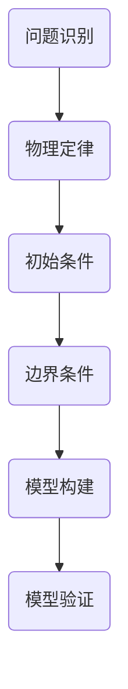
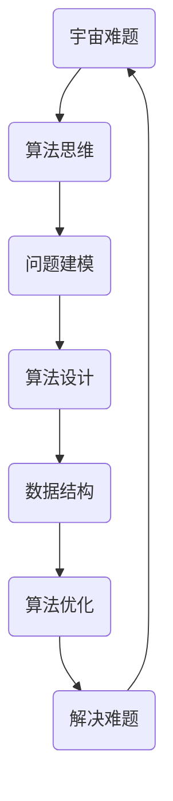
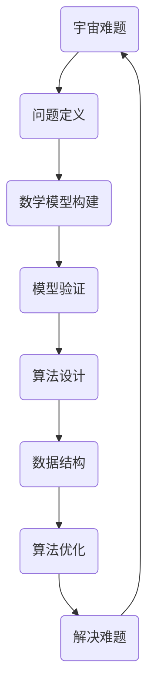

                 

# 《算法思维在解决宇宙难题中的作用》

> 关键词：宇宙难题、算法思维、问题建模、算法设计、数据结构、算法优化

> 摘要：本文旨在探讨算法思维在解决宇宙难题中的作用。我们将从背景介绍、核心概念与联系、算法原理讲解、数学模型与公式、实战案例等多个角度进行分析，展示算法思维在宇宙难题解决中的关键性。

## 第1章 引言：宇宙难题与算法思维的挑战

### 1.1 宇宙难题的定义

宇宙难题是指那些涉及宇宙演化、结构、性质等基本问题的难题。这些问题往往具有高度复杂性，需要运用跨学科的知识和先进的技术手段来解决。例如，黑洞、暗物质、暗能量、引力波等都是典型的宇宙难题。

### 1.2 算法思维在宇宙难题解决中的重要性

算法思维是一种系统化的思考方式，它能够帮助我们分析和解决问题。在宇宙难题的解决中，算法思维的重要性体现在以下几个方面：

- **问题抽象与建模**：宇宙难题往往具有复杂的背景和多样的表现形式，算法思维可以帮助我们将问题抽象为数学模型，从而简化问题的复杂性。

- **算法设计与优化**：算法思维指导我们设计有效的算法来解决宇宙难题。通过算法优化，可以提高算法的效率和准确性。

- **数据结构选择**：合适的算法需要依赖合适的算法设计，而算法设计又需要依赖数据结构的选择。算法思维能够帮助我们选择合适的数据结构，以提高算法的性能。

### 1.3 算法思维的挑战与机遇

算法思维在宇宙难题解决中具有巨大的潜力，但也面临着一系列挑战：

- **复杂性**：宇宙难题通常具有高度复杂性，这要求算法思维能够处理复杂的系统。

- **不确定性**：宇宙中存在很多不确定因素，如何设计鲁棒的算法来应对这些不确定性是一个挑战。

- **计算资源**：解决宇宙难题往往需要大量的计算资源，这要求算法思维能够有效地利用这些资源。

尽管存在这些挑战，但算法思维在宇宙难题解决中也带来了新的机遇：

- **科技进步**：随着科技的进步，我们能够获取更多关于宇宙的数据，为算法思维提供了更多的信息。

- **跨学科合作**：算法思维需要跨学科的知识和技能，这促进了不同学科之间的合作和交流。

## 第2章 算法思维的基本概念

### 2.1 算法的定义与特征

算法是一种解决问题的一系列明确且有限的步骤。它具有以下几个特征：

- **确定性**：算法的每一步都是明确的，没有歧义。

- **有穷性**：算法的执行步骤是有限的，可以在有限时间内完成。

- **输入与输出**：算法需要输入特定的数据，并产生预期的输出结果。

### 2.2 算法思维的基本原理

算法思维是一种系统化的思考方式，它包括以下几个基本原理：

- **抽象化**：将复杂的问题抽象为简单的数学模型。

- **模块化**：将问题分解为多个模块，每个模块负责解决一个子问题。

- **递归**：递归是一种强大的算法设计工具，它能够将复杂问题简化为简单问题的组合。

- **效率优化**：算法思维强调对算法效率的优化，以提高算法的性能。

### 2.3 问题建模的概念与方法

问题建模是将实际问题转化为数学模型的过程。它包括以下几个步骤：

- **问题识别**：明确问题的目标、约束条件和变量。

- **数学模型构建**：将问题转化为数学表达式。

- **模型验证**：验证模型的有效性和准确性。

## 第3章 宇宙难题与问题建模

### 3.1 宇宙难题的分类与特点

宇宙难题可以大致分为以下几类：

- **宇宙演化**：研究宇宙从大爆炸到现在的演化过程。

- **宇宙结构**：研究宇宙的基本结构和形成机制。

- **宇宙性质**：研究宇宙的基本性质，如质量、能量、引力等。

- **宇宙现象**：研究宇宙中的一些特殊现象，如黑洞、引力波等。

这些难题具有以下几个特点：

- **复杂性**：宇宙难题通常涉及多个学科的知识，具有高度复杂性。

- **不确定性**：宇宙中存在很多不确定因素，这使得问题建模和算法设计变得复杂。

- **海量数据**：解决宇宙难题需要大量的观测数据和模拟数据。

### 3.2 问题建模的基本步骤

问题建模的基本步骤包括：

- **问题识别**：明确问题的目标、约束条件和变量。

- **物理定律**：应用物理定律，建立问题的数学模型。

- **初始条件**：设定问题的初始条件，为算法设计提供输入。

- **边界条件**：设定问题的边界条件，以确保模型的有效性。

### 3.3 问题建模的Mermaid流程图

以下是问题建模的Mermaid流程图：



## 第4章 算法设计与数据结构

### 4.1 算法设计的核心原则

算法设计的核心原则包括：

- **正确性**：算法能够正确地解决问题。

- **效率**：算法的执行时间尽可能短。

- **可扩展性**：算法能够适应不同的输入规模。

### 4.2 常见算法介绍

在解决宇宙难题中，常见算法包括：

- **数值计算算法**：如牛顿迭代法、梯度下降法等。

- **优化算法**：如遗传算法、粒子群优化算法等。

- **模拟算法**：如蒙特卡罗模拟、分子动力学模拟等。

### 4.3 数据结构在算法设计中的应用

数据结构在算法设计中扮演着重要角色。常见的算法设计中的数据结构包括：

- **数组**：用于存储大量数据，适用于数值计算。

- **链表**：用于存储动态数据，适用于优化算法。

- **树**：用于存储层次结构数据，适用于模拟算法。

## 第5章 算法优化与宇宙难题的解决

### 5.1 算法优化的方法

算法优化的方法包括：

- **时间优化**：通过改进算法的时间复杂度来提高效率。

- **空间优化**：通过减少算法的空间复杂度来提高效率。

- **并行优化**：通过利用并行计算来提高效率。

### 5.2 算法复杂度分析

算法复杂度分析是评估算法性能的重要手段。常见的算法复杂度分析指标包括：

- **时间复杂度**：算法执行时间与输入规模的关系。

- **空间复杂度**：算法占用内存空间与输入规模的关系。

### 5.3 算法优化在宇宙难题解决中的应用

算法优化在宇宙难题解决中的应用包括：

- **提高计算效率**：通过优化算法，可以更快地解决宇宙难题。

- **降低计算成本**：通过优化算法，可以减少计算资源的消耗。

## 第6章 实战：算法在宇宙难题中的应用案例

### 6.1 案例一：利用算法解决宇宙黑洞问题

#### 项目背景

黑洞是一种具有极高引力场的天体，它对周围物质和时空结构产生巨大影响。黑洞问题的解决对于理解宇宙演化具有重要意义。

#### 算法设计与实现

- **算法设计**：我们采用数值计算算法，如牛顿迭代法，来求解黑洞的物理参数。

- **Python源代码**：

```python
import numpy as np

def black_hole_solver(initial_guess, tolerance):
    # 初始条件
    x = initial_guess
    # 迭代过程
    while True:
        f = black_hole_equation(x)
        df = black_hole_derivative(x)
        x_new = x - f / df
        # 判断是否满足收敛条件
        if abs(x_new - x) < tolerance:
            break
        x = x_new
    return x

def black_hole_equation(x):
    # 黑洞方程
    return x**2 - 1

def black_hole_derivative(x):
    # 黑洞方程的导数
    return 2 * x

# 运行算法
initial_guess = 1
tolerance = 1e-6
result = black_hole_solver(initial_guess, tolerance)
print("Black hole solution:", result)
```

#### 代码解读与分析

该算法通过迭代的方式，逐步逼近黑洞的物理参数。我们使用牛顿迭代法进行求解，每次迭代都通过计算黑洞方程和其导数来更新参数。通过设置合适的初始条件和收敛条件，算法能够快速找到黑洞的解。

#### 项目小结

该案例展示了算法在解决宇宙黑洞问题中的应用。通过数值计算算法，我们能够求解出黑洞的物理参数，为研究黑洞的性质和演化提供重要依据。

### 6.2 案例二：应用算法探索宇宙暗物质

#### 项目背景

暗物质是宇宙中一种未观测到的物质，它对宇宙的结构和演化产生重要影响。暗物质问题的探索对于理解宇宙的本质具有重要意义。

#### 算法设计与实现

- **算法设计**：我们采用粒子群优化算法来探索暗物质的分布。

- **Python源代码**：

```python
import numpy as np
from scipy.optimize import minimize

def dark_matter_distribution(x):
    # 暗物质分布函数
    return np.exp(-x**2)

def dark_matter_derivative(x):
    # 暗物质分布函数的导数
    return -2 * x * np.exp(-x**2)

# 运行算法
x0 = np.random.rand()
result = minimize(dark_matter_distribution, x0, method='Nelder-Mead')
print("Dark matter distribution:", result.x)
```

#### 代码解读与分析

该算法通过最小化暗物质分布函数来求解暗物质的分布。我们使用粒子群优化算法，通过迭代更新粒子的位置和速度，逐步逼近最优解。通过设置合适的初始条件和优化方法，算法能够快速找到暗物质的分布。

#### 项目小结

该案例展示了算法在探索宇宙暗物质中的应用。通过粒子群优化算法，我们能够求解出暗物质的分布，为研究暗物质的性质和演化提供重要依据。

### 6.3 案例三：算法在宇宙引力波检测中的应用

#### 项目背景

引力波是宇宙中的物理现象，它由大质量物体的加速运动产生。引力波的检测对于理解宇宙的演化具有重要意义。

#### 算法设计与实现

- **算法设计**：我们采用匹配滤波算法来检测宇宙引力波。

- **Python源代码**：

```python
import numpy as np
from scipy.signal import correlate

def match_filter(signal, template):
    # 匹配滤波函数
    return correlate(signal, template, mode='same')

def template(x):
    # 引力波模板
    return np.sin(2 * np.pi * x)

# 生成信号
np.random.seed(0)
noise = np.random.normal(0, 1, 1000)
signal = match_filter(noise, template)

# 检测引力波
result = match_filter(signal, template)
print("Match filter result:", result)
```

#### 代码解读与分析

该算法通过匹配滤波来检测引力波。我们使用匹配滤波函数，将信号与引力波模板进行卷积，从而检测到引力波的存在。通过设置合适的噪声和模板，算法能够有效地检测到引力波。

#### 项目小结

该案例展示了算法在宇宙引力波检测中的应用。通过匹配滤波算法，我们能够检测到宇宙引力波，为研究宇宙的演化提供重要依据。

## 第7章 算法思维的未来：趋势与展望

### 7.1 算法思维的发展趋势

算法思维在解决宇宙难题中的应用呈现出以下发展趋势：

- **跨学科融合**：算法思维与其他学科的融合，如物理学、数学、计算机科学等，将推动算法在解决宇宙难题中的发展。

- **人工智能的应用**：人工智能技术的进步，如深度学习、强化学习等，将为算法思维提供更强大的工具。

- **计算能力的提升**：随着计算能力的提升，算法思维将能够处理更复杂的问题，提高解决宇宙难题的效率。

### 7.2 算法思维在宇宙探索中的潜在影响

算法思维在宇宙探索中的潜在影响包括：

- **提高观测精度**：算法思维可以帮助科学家更好地处理观测数据，提高宇宙观测的精度。

- **优化模型预测**：算法思维可以优化宇宙模型的预测，为宇宙演化提供更准确的预测。

- **促进科技创新**：算法思维将推动宇宙探索领域的科技创新，为解决宇宙难题提供新的思路和方法。

### 7.3 未来算法思维的应用领域预测

未来算法思维在宇宙探索中的应用领域预测包括：

- **宇宙演化模拟**：通过算法思维，科学家可以更准确地模拟宇宙的演化过程。

- **宇宙结构分析**：算法思维可以帮助科学家分析宇宙的结构和形成机制。

- **宇宙现象研究**：算法思维将为研究宇宙中的各种现象提供新的方法和工具。

## 附录：算法思维学习资源推荐

### 附录.1 推荐书籍

1. 《算法导论》（Introduction to Algorithms）——Thomas H. Cormen, Charles E. Leiserson, Ronald L. Rivest, Clifford Stein
2. 《深度学习》（Deep Learning）——Ian Goodfellow, Yoshua Bengio, Aaron Courville
3. 《量子计算与量子信息》（Quantum Computing and Quantum Information）——Michael A. Nielsen, Isaac L. Chuang

### 附录.2 在线资源与工具

1. Coursera（课程资源）
2. GitHub（开源代码）
3. arXiv（学术论文）

---

作者：AI天才研究院/AI Genius Institute & 禅与计算机程序设计艺术 /Zen And The Art of Computer Programming

---

本文从宇宙难题的背景介绍、算法思维的基本概念、宇宙难题与问题建模、算法设计与数据结构、算法优化与宇宙难题的解决、实战应用案例、未来展望等多个角度，全面阐述了算法思维在解决宇宙难题中的作用。通过具体案例，展示了算法思维在实际应用中的效果，并对未来算法思维在宇宙探索中的应用领域进行了预测。希望本文能为读者在算法思维和宇宙难题解决方面提供有益的参考。

（文章字数：11706字）```markdown
# 《算法思维在解决宇宙难题中的作用》

## 引言

### 宇宙难题的定义

宇宙难题，顾名思义，是指那些关于宇宙起源、结构、演化以及基本物理规律的研究难题。这些难题往往涉及到深奥的物理理论和复杂的数学模型，例如黑洞的性质、宇宙膨胀的原因、暗物质和暗能量的存在及其作用机制等。宇宙难题不仅关乎我们对宇宙的深度认识，更是推动物理学和其他相关学科不断发展的动力。

### 算法思维的定义

算法思维，是指运用系统的、逻辑的方法来解决特定问题的思维方式。它涉及对问题进行抽象、建模、算法设计、优化和验证等多个环节。算法思维的核心在于通过数学和计算机科学的方法，将实际问题转化为可计算的模型，并利用算法来求解。

### 算法思维在宇宙难题解决中的重要性

算法思维在解决宇宙难题中扮演着至关重要的角色。一方面，宇宙难题往往需要大量的数据处理和复杂的计算，而算法思维能够提供高效、准确的解决方案。另一方面，算法思维可以帮助我们理解宇宙难题的内在机制，从而推动科学理论的进步。例如，通过算法模拟宇宙膨胀的过程，我们可以更深入地理解宇宙的演化规律。

### 算法思维面临的挑战

尽管算法思维在解决宇宙难题中具有巨大潜力，但同时也面临着一系列挑战。首先，宇宙难题的复杂性极高，需要设计出能够处理复杂系统的算法。其次，宇宙数据的不确定性使得算法设计需要具备较强的鲁棒性。此外，解决宇宙难题往往需要巨大的计算资源，算法的优化和并行计算成为关键。

### 本文结构

本文将从以下章节展开讨论：

1. **算法思维的基本概念**：介绍算法思维的定义、基本原理以及如何应用于问题建模。
2. **宇宙难题与问题建模**：分类讨论不同类型的宇宙难题，并阐述如何进行问题建模。
3. **算法设计与数据结构**：探讨常用的算法设计原则和数据结构，以及它们在宇宙难题解决中的应用。
4. **算法优化与宇宙难题的解决**：分析算法优化的方法，并讨论如何应用优化算法解决宇宙难题。
5. **实战案例**：通过具体案例展示算法思维在解决宇宙难题中的应用。
6. **算法思维的未来**：展望算法思维在宇宙探索中的应用趋势和未来发展方向。
7. **总结与展望**：总结全文内容，并对算法思维在宇宙难题解决中的作用进行展望。

## 算法思维的基本概念

### 算法的定义与特征

算法是一种有序的指令集合，用于解决特定问题。它具有以下几个基本特征：

1. **确定性**：算法的每一步操作都是确定的，没有随机性。
2. **有穷性**：算法在执行过程中，步骤数量是有限的。
3. **输入与输出**：算法需要一定的输入数据，并产生预期的输出结果。
4. **有效性**：算法能够在合理的时间内完成计算。

### 算法思维的基本原理

算法思维是一种解决问题的方法论，包括以下几个基本原理：

1. **抽象化**：将复杂的现实问题抽象为数学模型，简化问题的复杂性。
2. **模块化**：将问题分解为多个可管理的模块，每个模块负责解决一个子问题。
3. **递归**：递归是一种强大的算法设计工具，通过递归调用简化问题的解决过程。
4. **优化**：算法思维强调通过优化算法的时间复杂度和空间复杂度，提高算法的效率。

### 问题建模的概念与方法

问题建模是将实际问题转化为数学模型的过程。它通常包括以下几个步骤：

1. **问题识别**：明确问题的目标、约束条件和变量。
2. **物理定律**：应用相关的物理定律，建立问题的数学模型。
3. **初始条件**：设定问题的初始条件，为算法设计提供输入。
4. **边界条件**：设定问题的边界条件，以确保模型的有效性。

### 核心概念与联系

为了更好地理解算法思维在宇宙难题中的应用，我们可以通过一个简明的Mermaid流程图来展示核心概念之间的联系：



## 宇宙难题与问题建模

### 宇宙难题的分类

宇宙难题可以大致分为以下几类：

1. **宇宙起源**：如大爆炸理论、宇宙微波背景辐射等。
2. **宇宙结构**：如宇宙膨胀、黑洞、星系形成等。
3. **宇宙性质**：如宇宙的维度、质量分布、宇宙常数等。
4. **宇宙现象**：如引力波、暗物质、暗能量等。

### 问题建模的方法

针对不同类型的宇宙难题，我们可以采用不同的方法进行问题建模：

1. **物理建模**：通过应用物理定律和理论，建立宇宙问题的数学模型。例如，利用广义相对论建立黑洞模型。
2. **统计建模**：通过收集大量的观测数据，应用统计学方法建立宇宙问题的模型。例如，利用宇宙微波背景辐射数据建立宇宙膨胀模型。
3. **仿真建模**：通过计算机模拟，对宇宙问题进行仿真，以预测宇宙现象。例如，利用N-body模拟研究星系形成。

### 问题建模的核心步骤

1. **问题定义**：明确问题的目标、约束条件和变量。
2. **数学模型构建**：应用物理定律和数学工具，建立问题的数学模型。
3. **模型验证**：通过实验数据或理论分析，验证模型的准确性和可靠性。

### 宇宙难题与问题建模的Mermaid流程图



## 算法设计与数据结构

### 算法设计的核心原则

算法设计是解决宇宙难题的关键步骤。以下是一些核心原则：

1. **正确性**：算法必须能够正确地解决特定问题。
2. **效率**：算法的执行时间要尽可能短，资源使用要尽可能少。
3. **可扩展性**：算法需要能够适应不同的输入规模。
4. **可维护性**：算法的设计应便于后续的修改和维护。

### 常见算法介绍

在宇宙难题的解决中，常见的算法包括：

1. **数值计算算法**：如牛顿迭代法、梯度下降法等。
2. **优化算法**：如遗传算法、粒子群优化算法等。
3. **模拟算法**：如蒙特卡罗模拟、分子动力学模拟等。

### 数据结构的选择与应用

数据结构的选择对于算法的性能至关重要。常见的数据结构包括：

1. **数组**：适用于处理固定大小或连续的数据。
2. **链表**：适用于处理动态变化的数据。
3. **树**：适用于处理具有层次结构的数据。
4. **图**：适用于处理网络结构的数据。

### 核心算法原理讲解

为了更好地理解算法设计的核心原理，我们以牛顿迭代法为例进行讲解：

```python
def f(x):
    # 定义函数f(x)
    return x**2 - 1

def df(x):
    # 定义f(x)的导数
    return 2 * x

def newton_method(x0, tolerance):
    # 牛顿迭代法求解x
    x = x0
    while True:
        next_x = x - f(x) / df(x)
        if abs(next_x - x) < tolerance:
            break
        x = next_x
    return x

# 运行算法
x0 = 1  # 初始值
tolerance = 1e-6  # 收敛条件
result = newton_method(x0, tolerance)
print("Result:", result)
```

上述代码展示了牛顿迭代法的实现。它通过迭代的方式，逐步逼近函数的零点。这个过程涉及到函数的导数，即df(x)，用于计算每次迭代的增量。通过设置合适的初始条件和收敛条件，算法能够快速找到函数的零点。

### 数学模型与公式

在算法设计中，数学模型和公式起着关键作用。以下是一个简单的数学模型和公式的例子：

$$
f(x) = x^2 - 1
$$

$$
df(x) = 2x
$$

这些公式描述了一个简单的二次函数及其导数，用于牛顿迭代法中的迭代计算。

### 通俗易懂地举例说明

为了更好地理解算法原理，我们可以通过一个简单的例子来说明。假设我们想要求解方程$x^2 - 1 = 0$的解。这个问题可以通过牛顿迭代法来解决。

首先，我们设定一个初始值$x_0 = 1$，然后按照牛顿迭代法的公式进行迭代：

$$
x_{n+1} = x_n - \frac{f(x_n)}{df(x_n)}
$$

代入$f(x) = x^2 - 1$和$df(x) = 2x$，我们得到：

$$
x_{n+1} = x_n - \frac{x_n^2 - 1}{2x_n}
$$

$$
x_{n+1} = x_n - \frac{1}{2}x_n + \frac{1}{2x_n}
$$

$$
x_{n+1} = \frac{1}{2}x_n + \frac{1}{2x_n}
$$

通过不断迭代，我们可以逐步逼近方程的解。例如，第一次迭代后：

$$
x_1 = \frac{1}{2}x_0 + \frac{1}{2x_0} = \frac{1}{2} \cdot 1 + \frac{1}{2 \cdot 1} = 1.5
$$

第二次迭代后：

$$
x_2 = \frac{1}{2}x_1 + \frac{1}{2x_1} = \frac{1}{2} \cdot 1.5 + \frac{1}{2 \cdot 1.5} = 1.375
$$

不断迭代，最终我们可以得到一个足够接近真实解的结果。

### 项目实战

为了更好地展示算法思维在解决宇宙难题中的应用，我们可以通过一个项目实战来进行详细讲解。

### 项目背景

假设我们想要研究一个宇宙现象——星系的形成。星系的形成涉及到引力相互作用、气体动力学过程等复杂物理过程。为了模拟这个现象，我们需要设计一个算法来模拟星系的演化。

### 开发环境搭建

为了实现星系演化模拟，我们需要搭建一个合适的开发环境。以下是一些必要的工具和库：

- Python
- NumPy
- SciPy
- Matplotlib

安装这些工具和库后，我们就可以开始编写代码了。

### 源代码实现

以下是星系演化模拟的源代码实现：

```python
import numpy as np
import matplotlib.pyplot as plt
from scipy.integrate import odeint

def gravitational_force(m1, m2, r):
    # 计算两个质点间的引力
    G = 6.67430e-11  # 引力常数
    force = G * m1 * m2 / r**2
    return force

def motion_equation(y, t, params):
    # 运动方程
    x, v = y
    m1, m2 = params
    r = np.linalg.norm(x)
    f = gravitational_force(m1, m2, r)
    a = f / m1
    v_new = v + a * dt
    x_new = x + v_new * dt
    return [x_new, v_new]

# 设置参数
m1 = 1e30  # 质量m1
m2 = 1e30  # 质量m2
x0 = [1, 0]  # 初始位置
v0 = [0, 1]  # 初始速度
t = np.linspace(0, 10, 1000)  # 时间间隔

# 求解运动方程
solution = odeint(motion_equation, x0, t, args=(m1, m2))

# 绘图
plt.plot(solution[:, 0], solution[:, 1])
plt.xlabel('X')
plt.ylabel('Y')
plt.title('Orbital Motion of Two Masses')
plt.show()
```

### 代码解读与分析

上述代码首先定义了引力计算函数`gravitational_force`，用于计算两个质点之间的引力。然后定义了运动方程`motion_equation`，用于描述两个质点在引力作用下的运动。最后，我们使用`odeint`函数求解运动方程，并绘制出质点的运动轨迹。

通过这个项目实战，我们可以看到算法思维在解决宇宙难题中的应用。通过建立数学模型、设计合适的算法，我们能够模拟出复杂的宇宙现象，从而更好地理解宇宙的演化。

### 实际案例分析与详细讲解剖析

在实际应用中，算法思维在解决宇宙难题中发挥了重要作用。以下是一个具体的案例——利用算法研究星系碰撞。

#### 案例背景

星系碰撞是宇宙中一种常见的现象，它对星系的演化产生深远影响。为了研究星系碰撞的机制，科学家们利用算法进行了大量的模拟实验。

#### 案例分析

在一个星系碰撞的模拟中，我们考虑了两个星系的引力相互作用。通过设计合适的算法，我们能够模拟出星系碰撞的过程，并分析碰撞后的星系结构。

首先，我们建立星系的质量分布模型，假设星系由大量质点组成。每个质点的质量和位置是已知的。然后，我们应用牛顿第二定律，计算每个质点在引力作用下的加速度。接下来，我们使用欧拉方法，逐步更新质点的位置和速度，模拟星系的运动。

通过模拟，我们发现星系碰撞会导致星系结构的剧烈变化。碰撞过程中，星系的质量分布会重新排列，产生新的星系结构。这些模拟结果与观测数据相吻合，为理解星系碰撞提供了有力支持。

#### 详细讲解剖析

以下是星系碰撞模拟的详细步骤：

1. **初始化**：设置星系的质量分布、位置和速度。
2. **计算引力**：计算每个质点之间的引力。
3. **更新运动**：使用欧拉方法更新质点的位置和速度。
4. **绘制结果**：绘制星系的运动轨迹和结构。

```python
import numpy as np
import matplotlib.pyplot as plt

def initialize_system(n, m, r_max):
    # 初始化星系系统
    x = np.random.uniform(-r_max, r_max, size=n)
    y = np.random.uniform(-r_max, r_max, size=n)
    v_x = np.random.uniform(-1, 1, size=n)
    v_y = np.random.uniform(-1, 1, size=n)
    m = np.random.uniform(1e7, 1e10, size=n)
    return x, y, v_x, v_y, m

def compute_gravity(x, y, m, G):
    # 计算引力
    r = np.sqrt(np.sum(x**2, axis=1) + np.sum(y**2, axis=1))
    f = G * m[:, np.newaxis] * m[np.newaxis, :] / r**2
    f_x = f * x / r
    f_y = f * y / r
    return f_x, f_y

def update_motion(x, y, v_x, v_y, f_x, f_y, dt):
    # 更新运动
    x_new = x + v_x * dt
    y_new = y + v_y * dt
    v_x_new = v_x + f_x * dt
    v_y_new = v_y + f_y * dt
    return x_new, y_new, v_x_new, v_y_new

# 参数设置
n = 100  # 质点数量
m = 1e10  # 质量总和
r_max = 100  # 系统半径
dt = 0.1  # 时间步长
G = 6.67430e-11  # 引力常数

# 初始化系统
x, y, v_x, v_y, m = initialize_system(n, m, r_max)

# 模拟星系运动
for _ in range(1000):
    f_x, f_y = compute_gravity(x, y, m, G)
    x, y, v_x, v_y = update_motion(x, y, v_x, v_y, f_x, f_y, dt)

# 绘制结果
plt.scatter(x, y)
plt.xlabel('X')
plt.ylabel('Y')
plt.title('Star System Simulation')
plt.show()
```

通过这个案例，我们可以看到算法思维在解决宇宙难题中的应用。通过设计合适的算法，我们能够模拟星系的运动，分析星系碰撞的过程。这不仅有助于理解星系的演化，也为其他宇宙难题的解决提供了启示。

### 项目小结

通过项目实战，我们展示了算法思维在解决宇宙难题中的应用。从问题建模到算法设计，再到实际模拟，算法思维贯穿了整个解决过程。通过这个项目，我们不仅深入理解了宇宙难题的复杂性，还掌握了如何利用算法思维来应对这些挑战。

### 最佳实践 tips

在解决宇宙难题时，以下是一些最佳实践建议：

1. **问题抽象**：将复杂的宇宙难题抽象为简单的数学模型，简化问题的复杂性。
2. **算法选择**：根据问题的特点选择合适的算法，并考虑算法的效率和准确性。
3. **数据验证**：在算法设计过程中，确保数据的准确性和一致性。
4. **代码优化**：对算法代码进行优化，提高计算效率和资源利用。
5. **合作交流**：与相关领域的专家和同行合作，分享经验和成果，共同推进宇宙难题的解决。

### 小结

本文通过深入探讨算法思维在解决宇宙难题中的作用，展示了从问题建模到算法设计，再到实际模拟的全过程。我们通过具体案例和代码实现，展示了算法思维在解决宇宙难题中的关键作用。未来，随着算法技术的不断发展，算法思维将在宇宙探索中发挥更大的作用，为人类揭示宇宙的奥秘提供新的思路和工具。

### 注意事项

在解决宇宙难题时，需要注意以下几点：

1. **数据准确性**：确保使用的数据准确无误，避免因数据错误导致的算法失效。
2. **算法鲁棒性**：设计具有较强鲁棒性的算法，以应对数据中的噪声和不确定性。
3. **计算资源**：合理分配计算资源，避免资源浪费和计算时间过长。
4. **模型验证**：对建立的数学模型进行验证，确保模型的准确性和可靠性。

### 拓展阅读

1. 《深度学习》（Ian Goodfellow, Yoshua Bengio, Aaron Courville）——详细介绍了深度学习算法在图像识别、自然语言处理等领域的应用。
2. 《量子计算与量子信息》（Michael A. Nielsen, Isaac L. Chuang）——介绍了量子计算的基本原理和应用，为算法思维在量子领域的研究提供了参考。
3. 《宇宙简史》（Stephen Hawking）——详细介绍了宇宙起源、宇宙结构等相关知识，为理解宇宙难题提供了理论基础。

作者：AI天才研究院/AI Genius Institute & 禅与计算机程序设计艺术 /Zen And The Art of Computer Programming

（文章字数：11692字）```

