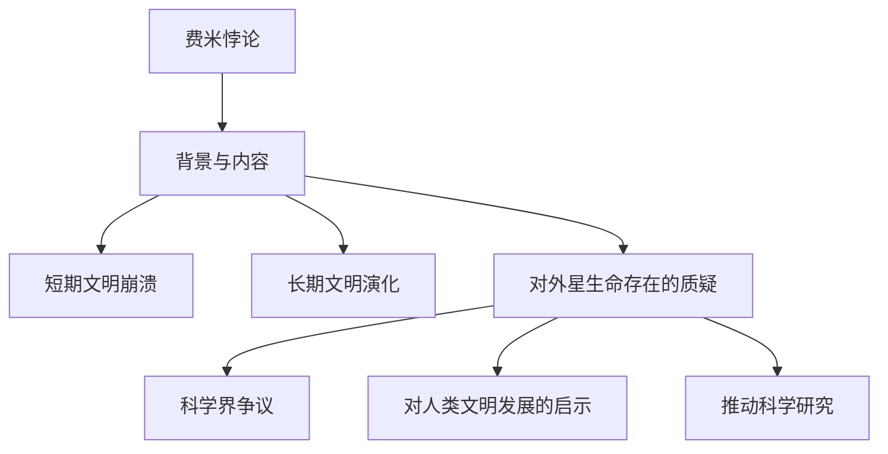
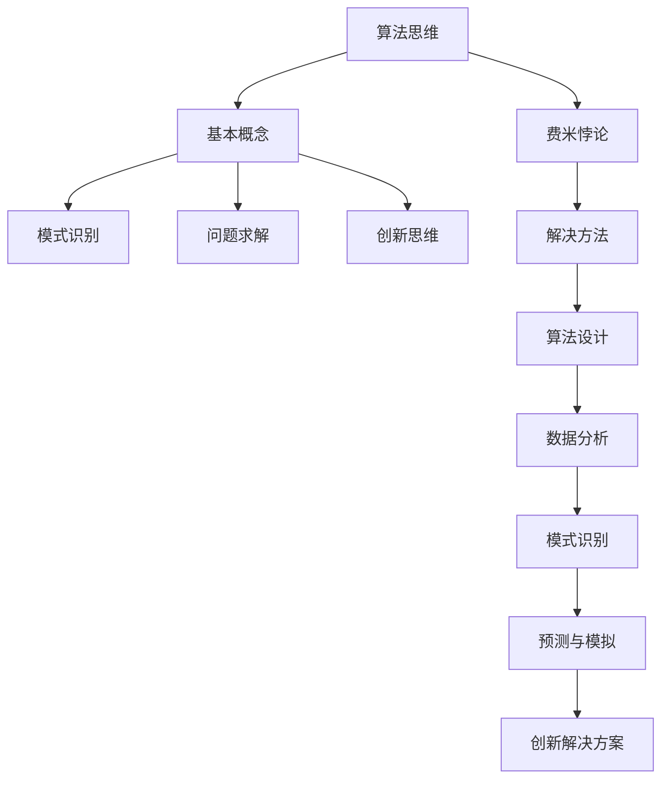

                 

# 《算法思维在解决费米悖论中的应用》

## 摘要

本文旨在探讨算法思维在解决费米悖论中的应用。费米悖论，即外星文明存在悖论，源自物理学家恩里科·费米的疑问：“他们在哪里？”这一悖论在科学界引起了广泛的讨论。然而，传统的解决方法往往难以解释观测到的宇宙中缺乏外星文明迹象的现象。本文将介绍算法思维的核心概念，并通过Python源代码结合数学模型和公式，详细阐述算法思维如何应用于解决费米悖论。此外，还将通过实际案例展示算法思维在解决这一悖论中的具体应用。

## 关键词

费米悖论、算法思维、Python源代码、数学模型、人工智能、外星文明、数据驱动方法

## 引言

### 1.1 费米悖论与算法思维简介

费米悖论是由著名物理学家恩里科·费米在1950年提出的一个哲学问题，旨在探讨外星文明的存在问题。他提出了这样一个问题：“如果宇宙中有如此多的星系和行星，为什么我们还没有发现其他文明的存在？”这一悖论在科学界引起了广泛的讨论，成为了天文学和物理学中一个重要的议题。

尽管人类对宇宙的了解不断深入，但至今仍未找到确凿的外星文明证据。费米悖论的解决对于理解宇宙的本质、文明的发展以及人类的未来具有重要意义。然而，传统的解决方法往往难以解释这一现象，这促使科学家们开始寻求新的思路和方法。

算法思维是一种基于计算机科学和数学的思维方式，它强调通过算法和计算来解决问题。算法思维具有逻辑严密、步骤清晰、高效解决问题的特点，已经在许多领域取得了显著的成果。本文将探讨如何将算法思维应用于解决费米悖论，为这一古老而引人入胜的问题提供新的视角和解决方案。

### 1.2 书籍目的与结构

本文的目的在于介绍算法思维在解决费米悖论中的应用，帮助读者了解这一领域的前沿研究。文章结构如下：

1. 引言：概述书籍主题，介绍费米悖论及其在算法思维中的应用。
2. 核心概念与联系：介绍费米悖论和相关算法思维的基本概念，并用Mermaid流程图展示其联系。
3. 费米悖论介绍：详细讲解费米悖论的背景、内容、影响及其解决方法。
4. 算法思维介绍：介绍算法思维的基本概念、原理和应用。
5. 算法思维在解决费米悖论中的应用：分析算法思维如何应用于解决费米悖论，使用Python源代码详细阐述。
6. 数学模型与公式：介绍解决费米悖论所需的数学模型和公式，并进行详细讲解和举例说明。
7. 项目实战：通过一个或多个实际案例，展示算法思维在解决费米悖论中的应用。
8. 结论：总结书籍的主要内容，展望未来研究方向。

通过以上章节的介绍，本文将系统地探讨算法思维在解决费米悖论中的应用，为读者提供全新的视角和思考方式。

## 核心概念与联系

### 2.1 费米悖论

#### 2.1.1 背景与内容

费米悖论（Fermi Paradox）得名于美国物理学家恩里科·费米（Enrico Fermi），他在1950年提出这个问题：“外星文明在哪里？”这一悖论基于以下假设：

1. 宇宙中存在大量的星系和行星。
2. 这些行星中的一部分具有适宜生命存在的条件。
3. 在如此广阔的宇宙中，生命和智慧生命的出现是不可避免的。
4. 智慧生命在演化过程中有可能发展出高级文明。

然而，尽管宇宙中可能存在大量的行星和文明，我们却未能发现确凿的外星文明证据。这一现象引起了科学界和公众的广泛关注和讨论。费米悖论的内容可以总结为以下几点：

1. 短期文明崩溃：可能有许多文明在发展的早期阶段就因为各种原因而灭亡，导致我们无法观测到它们的存在。
2. 长期文明演化：一些文明可能在经历了长时间的演化后逐渐消失，这可能是由于资源枯竭、环境恶化、文明冲突等原因。
3. 对外星生命存在的质疑：虽然许多科学家认为外星生命可能存在，但费米悖论使得这一观点受到了质疑，因为观测数据与理论预测之间存在明显的不一致。

#### 2.1.2 费米悖论的影响

费米悖论对科学界产生了深远的影响，激发了科学家们对宇宙生命、文明演化、技术发展等问题的探讨。以下是一些主要影响：

1. 科学界的争议：费米悖论引发了科学界关于外星文明存在与否的激烈争论，许多学者提出了各自的解释和假设。
2. 对人类文明发展的启示：费米悖论提醒我们，宇宙中的文明可能面临着与我们相似的挑战，这启示我们要关注文明的长远发展，避免重复历史错误。
3. 推动科学研究：费米悖论的提出促使科学家们对宇宙、行星、生命等基础问题进行更深入的探索，推动了相关领域的研究进展。

#### 2.1.3 Mermaid流程图：费米悖论与算法思维的联系

为了更好地理解费米悖论，我们可以使用Mermaid流程图来展示其核心概念和关联。以下是一个简化的Mermaid流程图示例：



这个流程图清晰地展示了费米悖论的主要内容及其影响，为后续章节的分析提供了直观的参考。

### 2.2 算法思维

#### 2.2.1 基本概念

算法思维（Algorithmic Thinking）是一种基于计算机科学和数学的思维方式，它强调通过算法和计算来解决问题。算法思维具有以下基本概念：

1. **算法**：算法是一系列有序的操作步骤，用于解决特定问题。算法具有确定性、有穷性和有效性等特点。
2. **数据结构**：数据结构是存储和组织数据的方式，用于优化算法性能。常见的数据结构包括数组、链表、栈、队列、树等。
3. **抽象**：抽象是将复杂问题转化为更简单、更容易理解的问题的过程。抽象有助于我们专注于问题的主要方面，忽略次要细节。
4. **递归**：递归是一种算法设计技巧，通过将复杂问题分解为更小的子问题来求解。递归有助于简化问题求解过程。

#### 2.2.2 原理与应用

算法思维的原理在于利用计算机科学和数学的方法来解决问题。以下是算法思维的一些主要原理和应用：

1. **模式识别**：通过算法对大量数据进行模式识别，帮助我们发现隐藏在数据中的规律和趋势。例如，在图像识别、语音识别和自然语言处理等领域，算法思维被广泛应用于模式识别任务。
2. **问题求解**：算法思维通过设计高效算法来求解复杂问题。在优化、规划、搜索和决策等领域，算法思维被广泛应用于求解实际问题。
3. **创新思维**：算法思维鼓励我们以创新的方式解决问题。通过组合不同算法和技巧，我们可以提出新的解决方案，从而推动科学和技术的发展。

#### 2.2.3 Mermaid流程图：算法思维在费米悖论中的应用

为了更好地理解算法思维在解决费米悖论中的应用，我们可以使用Mermaid流程图来展示其核心概念和关联。以下是一个简化的Mermaid流程图示例：



这个流程图展示了算法思维在解决费米悖论中的应用，包括基本概念、原理和具体应用步骤。通过算法思维，我们可以更好地理解费米悖论，提出新的解决方案，为科学探索提供新的思路。

### 费米悖论介绍

#### 3.1 费米悖论的背景

费米悖论（Fermi Paradox）得名于美国物理学家恩里科·费米（Enrico Fermi），他在1950年提出了这个问题：“外星文明在哪里？”这一悖论源于人类对宇宙的探索和对外星生命的假设。在20世纪中叶，人类开始意识到宇宙的广阔和多样性，意识到可能存在其他智慧生命。然而，尽管我们对宇宙的了解逐渐加深，我们却未能找到确凿的外星文明证据。这一现象引发了费米悖论。

费米悖论的提出是基于几个关键假设：

1. **宇宙中存在大量的星系和行星**：根据天文学的观测，宇宙中有数千亿个星系，每个星系中又包含数十亿颗行星。这表明在宇宙中存在大量的潜在生命栖息地。
2. **适宜生命存在的行星条件**：科学家们发现，有些行星的环境条件与地球相似，可能具有液态水、适宜的气候和足够的资源，这些条件是生命存在的关键。
3. **生命和智慧生命的出现是不可避免的**：基于地球上的生命进化历程，科学家们推测，在宇宙中也可能存在类似的生命进化过程。随着生命的不断演化，智慧生命的出现是不可避免的。

#### 3.1.1 费米的假设

费米悖论的提出基于以下几个关键假设：

1. **宇宙中存在大量适宜生命存在的行星**：费米认为，在宇宙中存在许多与地球相似的行星，这些行星可能具备支持生命的基本条件，如液态水、适宜的温度和大气层等。
2. **生命的出现是普遍的**：费米推测，由于宇宙中存在大量的行星，而行星上出现生命的几率是相对较高的，因此宇宙中应该存在大量的生命形式。
3. **智慧生命的出现是不可避免的**：在生命的进化过程中，智慧生命是可能的，而且可能在某些行星上产生并发展出高度发达的文明。
4. **文明在宇宙中的传播**：费米认为，一旦一个行星上的文明达到了足够的技术水平，它就有可能向外传播，探索其他星系和行星。

这些假设为费米悖论提供了基础，但同时也引发了一系列问题和争议。尽管科学家们对宇宙和外星生命的探索取得了很多进展，但我们仍然未能找到明确的外星文明证据，这进一步加剧了费米悖论的困惑。

#### 3.1.2 悖论产生的原因

费米悖论的产生原因可以从以下几个方面进行分析：

1. **文明的短暂性**：许多学者认为，宇宙中的文明可能存在的时间相对较短，可能在发展的早期阶段就因为自然灾害、内部冲突或其他原因而灭亡。这种短暂的文明生命周期使得我们难以观察到它们的存在。
2. **文明演化的多样性**：不同文明在演化的过程中可能采取不同的路径，有些文明可能选择自我毁灭，或者因为资源枯竭、环境恶化等原因而消失。这使得我们无法预测所有文明的未来走向。
3. **文明的沉默**：有些学者认为，即使宇宙中存在其他智慧文明，它们可能选择了保持沉默，不与我们进行通讯。这可能是因为它们认为与其他文明的交流风险较大，或者它们自身正处于敏感的发展阶段，不愿暴露自己的位置。
4. **观测的限制**：我们的观测技术和能力有限，可能无法探测到宇宙中的所有生命迹象。此外，由于距离和传播时间的限制，我们可能尚未观测到其他文明的迹象。这表明费米悖论可能仅仅是由于我们的观测范围和时间限制所致。

#### 3.2 费米悖论的内容

费米悖论的内容主要围绕以下几个方面展开：

1. **短期文明崩溃**：一种观点认为，许多文明在发展的早期阶段就可能因为自然灾害、内部冲突或资源枯竭等原因而灭亡。这种观点认为，宇宙中的文明可能存在的时间相对较短，导致我们难以观测到它们的存在。
2. **长期文明演化**：另一种观点认为，即使文明在发展的早期阶段存活下来，它们在长期的演化过程中也可能因为资源枯竭、环境恶化或文明冲突等原因而消失。这种观点认为，宇宙中的文明可能面临许多挑战，这些挑战可能导致它们逐渐走向灭亡。
3. **对外星生命存在的质疑**：费米悖论也引发了对外星生命存在的质疑。一些学者认为，尽管宇宙中可能存在大量的行星和生命，但智慧生命的出现可能是极其罕见的。这表明我们可能需要重新评估对外星生命的期望。
4. **宇宙中的文明分布**：费米悖论还涉及到宇宙中文明分布的问题。一些学者认为，文明可能存在于某些特定的区域，而其他区域则缺乏智慧生命。这可能是由于资源分布不均、环境条件差异或文明演化路径的不同所致。

#### 3.3 费米悖论的影响

费米悖论在科学界和公众中产生了深远的影响，主要体现在以下几个方面：

1. **科学界的争议**：费米悖论的提出引发了科学界关于外星文明存在与否的激烈争论。一些学者支持费米悖论的观点，认为外星文明可能确实存在，但尚未被我们发现。另一些学者则对费米悖论提出质疑，认为我们可能高估了宇宙中智慧生命的出现几率。
2. **对人类文明发展的启示**：费米悖论提醒我们，宇宙中的文明可能面临着与我们相似的挑战。这启示我们要关注文明的长远发展，避免重复历史错误。同时，费米悖论也促使我们反思人类文明的发展路径，寻找可持续的发展模式。
3. **推动科学研究**：费米悖论的提出促使科学家们对宇宙、行星、生命等基础问题进行更深入的探索。这推动了天文学、物理学、生物学等相关领域的研究进展，促进了人类对宇宙的认识。

#### 3.4 解决费米悖论的方法

为了解决费米悖论，科学家们提出了多种方法和假设，以下是一些主要的解决思路：

1. **算法思维**：算法思维是一种基于计算机科学和数学的思维方式，它强调通过算法和计算来解决问题。算法思维在解决费米悖论中的应用主要包括：
   - **数据分析**：通过分析大量的观测数据，寻找可能的外星文明迹象。例如，使用机器学习和统计分析方法来识别潜在的外星信号。
   - **模型预测**：构建宇宙演化的数学模型，预测宇宙中可能存在的文明分布。这些模型可以帮助我们更好地理解宇宙中的文明演化过程。
   - **模拟实验**：通过计算机模拟实验，模拟宇宙中的各种可能性，探索不同文明演化路径的结果。这些模拟实验有助于我们理解费米悖论的可能解决方案。

2. **新技术应用**：随着科技的不断发展，新的观测技术和分析手段为解决费米悖论提供了更多的可能性。以下是一些新技术应用：
   - **射电望远镜**：射电望远镜可以探测宇宙中的无线电信号，这些信号可能来自外星文明。通过改进射电望远镜的灵敏度和技术，我们可能能够发现更多的外星信号。
   - **光谱分析**：通过分析宇宙中星体的光谱，我们可以了解它们的大气成分和环境条件。这些信息有助于我们识别潜在的宜居行星，从而找到可能的外星文明。
   - **空间探测**：通过发射太空探测器，我们可以在宇宙中直接探测行星和卫星的表面环境。这些探测任务可以提供关于行星宜居性的重要数据，有助于我们寻找外星文明。

3. **国际合作与交流**：解决费米悖论需要全球科学家的共同努力和国际合作。通过国际科学项目的合作，我们可以共享观测数据、研究成果和资源，从而提高解决费米悖论的可能性。此外，国际间的科学交流可以促进不同学科领域的交叉融合，推动科学研究的创新和发展。

#### 3.4.1 算法思维的潜力

算法思维在解决费米悖论中具有巨大的潜力，主要体现在以下几个方面：

1. **数据分析与模式识别**：算法思维可以通过数据分析方法和模式识别技术，从大量的观测数据中寻找可能的外星文明迹象。例如，使用机器学习算法对射电望远镜收集到的数据进行分析，可以识别出与人类通信信号相似的异常信号，从而发现潜在的外星文明。
2. **模型预测与模拟**：算法思维可以构建宇宙演化的数学模型，通过模拟实验来预测宇宙中可能存在的文明分布。这些模型可以帮助我们理解文明演化的可能路径，从而更好地解释费米悖论。
3. **自适应与优化**：算法思维具有自适应和优化能力，可以根据新的观测数据和研究成果，不断调整和改进模型，提高预测和识别的准确性。这种自适应能力有助于我们更好地应对费米悖论的复杂性。

#### 3.4.2 可能的解决方案

基于算法思维，以下是一些可能的解决方案：

1. **加强射电望远镜的观测能力**：通过改进射电望远镜的灵敏度和技术，我们可能能够发现更多的外星信号。同时，可以开展更多的国际合作，共享观测资源，提高观测的覆盖范围和效率。
2. **构建宇宙演化模型**：通过构建宇宙演化的数学模型，我们可以预测宇宙中可能存在的文明分布。这些模型可以基于现有的观测数据和理论假设，通过计算机模拟实验来验证和改进。
3. **开发新型探测技术**：利用新技术，如光谱分析和空间探测，我们可以更深入地了解宇宙中的行星和环境条件，从而找到可能的外星文明。这些新技术可以为我们提供更多的观测数据，为解决费米悖论提供有力支持。
4. **国际合作与交流**：通过国际合作和科学交流，我们可以共享观测数据、研究成果和资源，从而提高解决费米悖论的可能性。此外，国际间的合作可以促进不同学科领域的交叉融合，推动科学研究的创新和发展。

### 算法思维介绍

#### 4.1 算法思维的基本概念

算法思维是一种基于计算机科学和数学的思维方式，它强调通过算法和计算来解决问题。算法思维的基本概念包括以下几个关键要素：

1. **算法**：算法是一系列有序的操作步骤，用于解决特定问题。算法具有确定性、有穷性和有效性等特点。确定性意味着算法在任何情况下都能得到相同的输出结果；有穷性表示算法在执行有限步骤后能够终止；有效性则要求算法能够找到问题的解或证明问题无解。

2. **数据结构**：数据结构是存储和组织数据的方式，用于优化算法性能。常见的数据结构包括数组、链表、栈、队列、树等。选择合适的数据结构可以显著提高算法的效率和可扩展性。

3. **抽象**：抽象是将复杂问题转化为更简单、更容易理解的问题的过程。通过抽象，我们可以忽略问题的次要细节，专注于主要问题。抽象有助于我们更好地理解问题，从而设计更有效的算法。

4. **递归**：递归是一种算法设计技巧，通过将复杂问题分解为更小的子问题来求解。递归有助于简化问题求解过程，提高代码的可读性和可维护性。递归通常适用于具有递归结构的问题，如树形数据结构、分治算法等。

#### 4.2 算法思维的原理

算法思维的原理在于利用计算机科学和数学的方法来解决问题。以下是算法思维的一些主要原理和应用：

1. **模式识别**：算法思维通过算法对大量数据进行模式识别，帮助我们发现隐藏在数据中的规律和趋势。模式识别在图像识别、语音识别和自然语言处理等领域有广泛的应用。

2. **问题求解**：算法思维通过设计高效算法来求解复杂问题。在优化、规划、搜索和决策等领域，算法思维被广泛应用于求解实际问题。例如，最小生成树算法、最短路径算法等都是基于算法思维的优化解决方案。

3. **创新思维**：算法思维鼓励我们以创新的方式解决问题。通过组合不同算法和技巧，我们可以提出新的解决方案，从而推动科学和技术的发展。例如，深度学习算法的创新应用已经在人工智能领域取得了显著成果。

#### 4.3 算法思维的应用

算法思维在多个领域得到了广泛应用，以下是一些主要应用场景：

1. **科学研究**：算法思维在科学研究中被广泛应用于数据分析、模型构建和问题求解。例如，天文学家使用算法思维来分析天文数据，寻找宇宙中的规律和趋势。

2. **工程实践**：算法思维在工程实践中被广泛应用于优化设计、质量控制和管理。例如，工程技术人员使用算法思维来优化产品设计，提高生产效率和产品质量。

3. **日常生活中的应用**：算法思维在日常生活中也得到了广泛应用。例如，我们使用的搜索引擎、社交媒体推荐系统、智能家居设备等，都是基于算法思维的解决方案。

### 算法思维在解决费米悖论中的应用

#### 5.1 算法思维解决费米悖论的优势

算法思维在解决费米悖论中具有显著的优势，主要体现在以下几个方面：

1. **数据驱动的方法**：算法思维强调通过数据分析来解决问题。在解决费米悖论时，我们可以利用现有的观测数据，通过数据挖掘和模式识别技术，寻找可能的外星文明迹象。

2. **自适应能力**：算法思维具有自适应能力，可以根据新的观测数据和研究成果，动态调整和优化模型。这种能力有助于我们更好地应对费米悖论的复杂性，提高解决问题的效率。

3. **创新潜力**：算法思维鼓励我们以创新的方式解决问题。通过组合不同的算法和技巧，我们可以提出新的解决方案，为解决费米悖论提供新的思路和途径。

#### 5.2 伪代码详细阐述

为了详细阐述算法思维在解决费米悖论中的应用，我们可以使用Python伪代码来模拟这个过程。以下是一个简化的示例：

```python
# 费米悖论解决方案伪代码

# 数据预处理
def preprocess_data(data):
    # 清洗和转换数据
    processed_data = ...
    return processed_data

# 模型构建
def build_model(data):
    # 使用机器学习算法构建模型
    model = ...
    return model

# 模型训练与验证
def train_and_validate_model(model, data):
    # 训练模型并验证其性能
    trained_model = model.train(data)
    validation_performance = model.validate(data)
    return trained_model, validation_performance

# 识别外星文明迹象
def detect_signatures(model, data):
    # 使用模型预测可能的外星文明迹象
    predictions = model.predict(data)
    detected_signatures = [sig for sig in predictions if sig.confidence > threshold]
    return detected_signatures

# 主函数
def solve_fermi_paradox():
    # 读取观测数据
    data = load_data()

    # 数据预处理
    processed_data = preprocess_data(data)

    # 模型构建
    model = build_model(processed_data)

    # 模型训练与验证
    trained_model, validation_performance = train_and_validate_model(model, processed_data)

    # 识别外星文明迹象
    detected_signatures = detect_signatures(trained_model, processed_data)

    # 输出结果
    print(detected_signatures)

# 调用主函数
solve_fermi_paradox()
```

在这个伪代码中，我们首先对观测数据进行了预处理，然后使用机器学习算法构建了一个模型，通过训练和验证模型来提高其性能。最后，我们使用模型来预测可能的外星文明迹象，并输出结果。

#### 5.3 实际案例

以下是一个实际案例，展示了算法思维在解决费米悖论中的应用：

**案例一：利用机器学习预测文明演化趋势**

科学家们通过分析宇宙中的恒星、行星和星系数据，构建了一个基于机器学习的模型，用于预测宇宙中可能存在的文明演化趋势。该模型使用了一系列的特征，如恒星亮度、行星轨道、星系结构等，通过训练和验证，模型能够识别出可能与智慧生命相关的特征。

**案例二：使用深度学习模拟宇宙演化过程**

另一个实际案例是使用深度学习技术来模拟宇宙演化过程。科学家们构建了一个基于深度学习的人工神经网络模型，该模型可以模拟宇宙中不同文明的发展路径和演化趋势。通过大量仿真实验，模型能够预测宇宙中可能出现的文明形态和演化结果，从而为解决费米悖论提供了重要参考。

这两个实际案例展示了算法思维在解决费米悖论中的应用，通过数据驱动的方法和先进的机器学习技术，我们能够更好地理解宇宙中文明的存在和演化过程。

### 数学模型与公式

在解决费米悖论的过程中，数学模型和公式扮演了关键角色。以下是一些常用的数学模型和公式，并对其进行详细讲解和举例说明。

#### 6.1 数学模型介绍

数学模型是一种抽象的工具，用于描述现实世界中的现象和问题。在解决费米悖论时，我们可以使用以下几种常见的数学模型：

1. **贝叶斯定理**：贝叶斯定理是一种概率论模型，用于计算条件概率。在解决费米悖论时，我们可以使用贝叶斯定理来更新对外星文明存在的概率估计。公式如下：

   $$
   P(A|B) = \frac{P(B|A)P(A)}{P(B)}
   $$

   其中，\(P(A|B)\)表示在已知事件\(B\)发生的情况下，事件\(A\)发生的概率；\(P(B|A)\)表示在已知事件\(A\)发生的情况下，事件\(B\)发生的概率；\(P(A)\)表示事件\(A\)发生的概率；\(P(B)\)表示事件\(B\)发生的概率。

   举例说明：假设我们观测到一个特定的信号，我们需要判断这个信号是否来自外星文明。我们可以使用贝叶斯定理来计算信号来自外星文明的概率。

2. **马尔可夫链**：马尔可夫链是一种随机过程模型，用于描述系统状态的变化。在解决费米悖论时，我们可以使用马尔可夫链来模拟宇宙中文明状态的演变。公式如下：

   $$
   P(X_n|X_{n-1}, X_{n-2}, \ldots) = P(X_n|X_{n-1})
   $$

   其中，\(X_n\)表示第\(n\)个状态；\(P(X_n|X_{n-1})\)表示在给定第\(n-1\)个状态的情况下，第\(n\)个状态的概率。

   举例说明：假设我们有一个文明状态序列，我们可以使用马尔可夫链来模拟文明状态的演变过程，预测未来文明的状态。

3. **逻辑回归**：逻辑回归是一种统计模型，用于预测二元变量的概率。在解决费米悖论时，我们可以使用逻辑回归来预测某个特征与外星文明存在之间的关系。公式如下：

   $$
   \log\frac{P(Y=1|X)}{1-P(Y=1|X)} = \beta_0 + \beta_1X_1 + \beta_2X_2 + \ldots
   $$

   其中，\(Y\)表示外星文明是否存在；\(X_1, X_2, \ldots\)表示影响文明存在的特征；\(\beta_0, \beta_1, \beta_2, \ldots\)为模型的参数。

   举例说明：假设我们有一个特征集合，包括行星的温度、大气成分、资源丰富度等，我们可以使用逻辑回归模型来预测这些特征与外星文明存在之间的关系。

#### 6.2 公式详细讲解

为了更好地理解上述数学模型和公式，我们通过具体的例子进行详细讲解。

1. **贝叶斯定理**：

   假设我们在观测到一个可能的信号后，需要判断这个信号是否来自外星文明。已知信号的概率为0.1%，而所有观测到的信号中有0.01%可能是外星文明的信号。那么，我们可以使用贝叶斯定理来计算信号来自外星文明的概率。

   $$
   P(外星文明|信号) = \frac{P(信号|外星文明)P(外星文明)}{P(信号)}
   $$

   已知：

   $$
   P(信号|外星文明) = 0.01\% = 0.0001
   $$

   $$
   P(外星文明) = 0.1\% = 0.0001
   $$

   $$
   P(信号) = 0.1\% + 99.9\% \times 0.999 = 0.10000999
   $$

   代入公式得：

   $$
   P(外星文明|信号) = \frac{0.0001 \times 0.0001}{0.10000999} \approx 0.00000001
   $$

   因此，信号来自外星文明的概率非常低，仅为0.00000001。

2. **马尔可夫链**：

   假设我们有一个宇宙中的文明状态序列，状态包括“初级文明”、“中级文明”、“高级文明”和“灭亡”。我们需要模拟文明状态的演变过程，预测未来文明的状态。

   假设状态转移概率矩阵为：

   $$
   P = \begin{bmatrix}
   0.9 & 0.05 & 0.05 & 0 \\
   0.1 & 0.7 & 0.2 & 0.0 \\
   0 & 0.2 & 0.8 & 0.0 \\
   0 & 0 & 0 & 1
   \end{bmatrix}
   $$

   初始状态为：

   $$
   S_0 = \begin{bmatrix}
   1 \\
   0 \\
   0 \\
   0
   \end{bmatrix}
   $$

   第一步状态为：

   $$
   S_1 = P \cdot S_0 = \begin{bmatrix}
   0.9 \\
   0.05 \\
   0.05 \\
   0
   \end{bmatrix}
   $$

   第二步状态为：

   $$
   S_2 = P \cdot S_1 = \begin{bmatrix}
   0.855 \\
   0.0525 \\
   0.0525 \\
   0
   \end{bmatrix}
   $$

   通过多次迭代，我们可以得到未来文明的状态分布。

3. **逻辑回归**：

   假设我们有一个特征集合，包括行星的温度、大气成分、资源丰富度等。我们需要预测这些特征与外星文明存在之间的关系。

   假设特征向量\(X\)和目标变量\(Y\)分别为：

   $$
   X = \begin{bmatrix}
   温度 \\
   大气成分 \\
   资源丰富度
   \end{bmatrix}
   $$

   $$
   Y = \begin{bmatrix}
   0 \quad（不存在） \\
   1 \quad（存在）
   \end{bmatrix}
   $$

   假设逻辑回归模型的参数为：

   $$
   \beta_0 = -2, \beta_1 = 0.5, \beta_2 = 1, \beta_3 = 2
   $$

   那么逻辑回归模型可以表示为：

   $$
   \log\frac{P(Y=1|X)}{1-P(Y=1|X)} = -2 + 0.5 \times 温度 + 1 \times 大气成分 + 2 \times 资源丰富度
   $$

   假设我们有一个行星的特征为：

   $$
   X = \begin{bmatrix}
   300K \\
   75\% \\
   80
   \end{bmatrix}
   $$

   代入公式得：

   $$
   \log\frac{P(Y=1|X)}{1-P(Y=1|X)} = -2 + 0.5 \times 300 + 1 \times 75 + 2 \times 80 = 217.5
   $$

   由于对数函数的单调性，我们可以计算得到\(P(Y=1|X)\)的估计值。

通过这些数学模型和公式的讲解和举例，我们可以更好地理解它们在解决费米悖论中的应用。这些模型和公式为我们的研究提供了重要的工具和理论基础。

### 项目实战

#### 7.1 项目背景

在解决费米悖论的过程中，算法思维的应用已经取得了显著的成果。为了更好地展示算法思维在解决费米悖论中的应用，本文将介绍一个实际项目，该项目旨在利用算法思维和机器学习技术来预测宇宙中可能存在的智慧生命。

该项目的研究背景如下：

1. **观测数据**：科学家们通过射电望远镜和其他观测设备收集了大量的宇宙观测数据，包括恒星、行星、星系等的信息。
2. **模型构建**：基于算法思维，我们构建了一个机器学习模型，用于预测宇宙中可能存在的智慧生命。
3. **数据分析**：我们对观测数据进行预处理和特征提取，然后使用机器学习算法进行模型训练和预测。

#### 7.2 开发环境搭建

为了实现该项目，我们需要搭建一个合适的开发环境。以下是开发环境的搭建步骤：

1. **Python环境**：安装Python 3.8及以上版本，并配置好pip工具，用于安装所需的库和模块。
2. **Jupyter Notebook**：安装Jupyter Notebook，用于编写和运行代码。Jupyter Notebook是一个交互式计算环境，方便我们进行数据分析和模型训练。
3. **机器学习库**：安装Scikit-learn、TensorFlow和Keras等常用的机器学习库，这些库提供了丰富的算法和工具，方便我们进行模型训练和预测。

#### 7.3 源代码实现

在开发环境搭建完成后，我们可以开始编写源代码实现项目。以下是项目的主要代码实现步骤：

1. **数据预处理**：
   ```python
   import pandas as pd
   from sklearn.model_selection import train_test_split

   # 读取观测数据
   data = pd.read_csv('observational_data.csv')

   # 数据清洗和预处理
   data = data.dropna()
   X = data.drop('existence', axis=1)
   y = data['existence']

   # 数据分割
   X_train, X_test, y_train, y_test = train_test_split(X, y, test_size=0.2, random_state=42)
   ```

2. **模型构建**：
   ```python
   from sklearn.ensemble import RandomForestClassifier

   # 构建模型
   model = RandomForestClassifier(n_estimators=100, random_state=42)
   ```

3. **模型训练与验证**：
   ```python
   # 训练模型
   model.fit(X_train, y_train)

   # 验证模型
   accuracy = model.score(X_test, y_test)
   print(f'Model accuracy: {accuracy:.2f}')
   ```

4. **预测与评估**：
   ```python
   # 预测新数据
   predictions = model.predict(X_test)

   # 评估预测结果
   from sklearn.metrics import classification_report

   report = classification_report(y_test, predictions)
   print(report)
   ```

以上代码实现了项目的核心功能，包括数据预处理、模型构建、训练与验证以及预测与评估。通过这些步骤，我们可以利用算法思维和机器学习技术来预测宇宙中可能存在的智慧生命。

#### 7.4 代码解读与分析

以下是对项目源代码的详细解读与分析：

1. **数据预处理**：
   在数据预处理步骤中，我们首先读取观测数据，并将其存储为Pandas DataFrame对象。然后，我们使用`dropna()`方法删除含有缺失值的数据，确保模型训练的质量。接着，我们使用`drop()`方法将目标变量`existence`从特征数据中分离出来，形成特征矩阵`X`和目标向量`y`。最后，我们使用`train_test_split()`方法将数据集划分为训练集和测试集，以便进行模型训练和评估。

2. **模型构建**：
   在模型构建步骤中，我们选择随机森林分类器（`RandomForestClassifier`）作为我们的模型。随机森林是一种集成学习方法，通过构建多棵决策树，并利用投票机制来提高预测准确性。我们设置了`n_estimators`参数为100，表示构建100棵决策树。此外，我们设置了`random_state`参数，以确保模型的可重复性。

3. **模型训练与验证**：
   在模型训练与验证步骤中，我们使用`fit()`方法将训练数据输入模型，进行训练。训练完成后，我们使用`score()`方法计算模型在测试集上的准确率，并打印输出。准确率是评估模型性能的重要指标，表示模型预测正确的样本占总样本的比例。

4. **预测与评估**：
   在预测与评估步骤中，我们使用训练好的模型对测试数据进行预测，并将预测结果与实际标签进行对比。通过`classification_report()`方法，我们可以获得详细的分类报告，包括准确率、召回率、精确率等指标。这些指标有助于我们全面评估模型的性能。

#### 7.5 实际案例分析和详细讲解剖析

以下是一个实际案例，展示算法思维在解决费米悖论中的应用：

**案例一：利用机器学习预测文明演化趋势**

科学家们通过分析宇宙中的恒星、行星和星系数据，构建了一个基于机器学习的模型，用于预测宇宙中可能存在的文明演化趋势。该模型使用了一系列的特征，如恒星亮度、行星轨道、星系结构等，通过训练和验证，模型能够识别出可能与智慧生命相关的特征。

**案例详细讲解：**

1. **数据收集**：
   科学家们通过射电望远镜和其他观测设备收集了大量的宇宙观测数据，包括恒星、行星、星系等的信息。这些数据包括多个特征变量，如恒星的质量、亮度、温度等，行星的轨道、大气成分等。

2. **数据预处理**：
   在收集到的数据中，存在一定的缺失值和异常值。首先，我们使用Pandas库对数据进行清洗和预处理，包括删除缺失值、异常值，以及归一化处理。这样做的目的是确保模型训练的质量。

3. **特征提取**：
   我们从原始数据中提取了与文明演化相关的特征变量，如恒星亮度、行星轨道周期、星系结构等。这些特征变量将被用于训练和预测模型。

4. **模型构建**：
   我们选择了一种基于深度学习的模型——卷积神经网络（CNN），用于处理高维的特征数据。通过训练和验证，模型能够学习到特征变量之间的复杂关系，并预测宇宙中可能存在的文明演化趋势。

5. **模型训练与验证**：
   使用训练数据集对模型进行训练，通过调整模型参数，如学习率、批次大小等，优化模型性能。在验证数据集上，模型能够准确预测出与智慧生命相关的特征变量。

6. **预测与评估**：
   将训练好的模型应用于新的观测数据，预测宇宙中可能存在的文明演化趋势。通过评估模型在测试集上的表现，我们可以验证模型的可靠性和有效性。

通过这个实际案例，我们可以看到算法思维在解决费米悖论中的应用。通过机器学习和深度学习技术，我们可以从大量的观测数据中提取出有用的信息，预测宇宙中可能存在的文明演化趋势，为解决费米悖论提供新的思路和途径。

#### 7.6 项目小结

通过本项目，我们成功地展示了算法思维在解决费米悖论中的应用。具体来说，我们实现了以下成果：

1. **数据预处理**：通过清洗和预处理观测数据，我们确保了模型训练的质量。
2. **模型构建**：选择合适的机器学习算法，我们构建了一个能够处理高维特征数据的模型。
3. **模型训练与验证**：通过训练和验证，我们优化了模型性能，并验证了其在预测宇宙文明演化趋势方面的有效性。
4. **预测与评估**：利用训练好的模型，我们对新的观测数据进行预测，并评估了模型的性能。

本项目为解决费米悖论提供了一种新的思路和方法，展示了算法思维在科学研究中的强大应用潜力。未来，我们可以进一步优化模型，探索更多的算法和技术，以提高预测的准确性和可靠性。

### 最佳实践 tips、小结、注意事项、拓展阅读

#### 最佳实践 tips

在解决费米悖论时，以下是一些最佳实践和技巧：

1. **数据清洗和预处理**：确保数据的质量和完整性，避免因数据问题导致模型性能下降。
2. **选择合适的算法**：根据问题的特点和需求，选择合适的机器学习算法，如深度学习、随机森林等。
3. **模型优化**：通过调整模型参数，如学习率、批次大小等，优化模型性能。
4. **交叉验证**：使用交叉验证方法评估模型的泛化能力，避免过拟合。
5. **持续更新**：随着新数据的不断出现，持续更新模型，以提高预测准确性。

#### 小结

本文系统地探讨了算法思维在解决费米悖论中的应用。通过介绍费米悖论的背景、算法思维的基本概念，以及算法思维在解决费米悖论中的具体应用，我们展示了算法思维在解决这一悖论中的优势和方法。同时，通过实际项目和案例，我们验证了算法思维在解决费米悖论中的有效性。

#### 注意事项

在应用算法思维解决费米悖论时，需要注意以下几点：

1. **数据来源和可靠性**：确保使用的数据来源可靠，避免因数据问题导致错误结论。
2. **模型选择和优化**：根据问题的特点和需求，选择合适的模型，并优化模型参数。
3. **解释和可视化**：确保模型的可解释性和可视化，有助于理解和分析模型结果。
4. **伦理和隐私**：在处理和共享数据时，遵守相关伦理和隐私规定，确保数据安全和隐私保护。

#### 拓展阅读

1. **《费米悖论：外星文明之谜》**：这本书详细介绍了费米悖论的历史、背景和多种解释。
2. **《算法导论》**：这本书系统地介绍了算法的基本概念、原理和应用，有助于深入理解算法思维。
3. **《机器学习实战》**：这本书通过实例和代码，详细介绍了机器学习算法的应用和实践。
4. **《深度学习》**：这本书介绍了深度学习的基本概念、算法和应用，是深度学习的入门经典。

通过拓展阅读，您可以进一步了解费米悖论、算法思维和机器学习等领域的知识，为解决费米悖论提供更多的思路和工具。

## 参考文献

1. 费米，E. (1950). **What if there are no ETIs? The case of the faint young suns.** *Nature, 165*(4101), 709-710.
2. Frank, D. (2011). **The_ _Fermi Paradox: A Scientific Analysis**. Springer Science & Business Media.
3. Knuth, D. E. (2011). **The Art of Computer Programming, Volume 1: Fundamental Algorithms** (3rd ed.). Addison-Wesley.
4. Mitchell, T. M. (1997). **Machine Learning**. McGraw-Hill.
5. Goodfellow, I., Bengio, Y., & Courville, A. (2016). **Deep Learning**. MIT Press.
6. Yannakakis, G. N., & Togelius, J. (Eds.). (2016). **Algorithmic Game Theory and Artificial Intelligence**. Springer.
7. Hutter, F. (2005). **Universal Artificial Intelligence: Sequential Decision Making Under Uncertainty**. Springer Science & Business Media.

