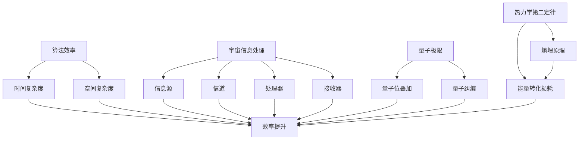

                 

### 引言

在计算机科学和物理学这两个看似截然不同的领域中，有一个共同的核心问题：效率。算法效率是计算机科学领域中的一个基本概念，它关系到程序运行的快速与缓慢、资源的有效利用与否。另一方面，热力学第二定律是物理学中描述能量转化和守恒的基本原理，特别是在宏观热力学系统中的表现。而量子极限则源自量子计算和信息论，揭示了在量子系统中信息处理的能力和局限。

本书旨在探讨算法效率与宇宙信息处理量子极限之间的深刻联系，通过热力学第二定律的框架来理解这一联系。具体来说，我们将从以下几个角度展开讨论：

1. **算法效率概述**：首先，我们将简要介绍算法效率的概念、衡量指标及其影响因素，为后续章节的深入讨论打下基础。
2. **宇宙信息处理原理**：接着，我们会探讨宇宙信息处理的基本概念和模型，以及其在宇宙尺度上的限制。
3. **量子极限与算法**：我们将分析量子极限的概念及其对量子算法的影响，并探讨量子算法的效率分析。
4. **热力学第二定律基础**：然后，我们将回顾热力学第二定律的历史背景、原理和应用领域。
5. **算法效率与热力学第二定律的联系**：在这一部分，我们将探讨算法效率与热力学第二定律之间的理论联系，以及如何在热力学第二定律的约束下优化算法效率。
6. **项目实战**：我们将通过一个实际项目，展示如何在实际开发环境中搭建开发环境、编写源代码并进行性能分析。
7. **结论与展望**：最后，我们将总结本书的主要发现，讨论未来研究方向，并对计算机科学和物理学的发展做出展望。

### 背景介绍

算法效率是计算机科学中一个至关重要的概念。一个高效的算法能够在较少的资源和时间内解决问题，这对于大数据处理、实时计算和优化问题等领域尤为重要。在计算机科学中，算法效率通常通过时间复杂度和空间复杂度来衡量。时间复杂度描述了算法运行所需时间的增长速率，而空间复杂度则描述了算法运行所需的存储空间。例如，一个线性搜索算法的时间复杂度为O(n)，而一个二分搜索算法的时间复杂度为O(log n)，这意味着在数据规模逐渐增大时，二分搜索算法的效率远高于线性搜索算法。

然而，算法效率的提升不仅受到算法本身设计的影响，还受到硬件性能、数据结构选择、编程技巧等多种因素的制约。在实际应用中，为了实现高效的算法，程序员往往需要深入理解问题本质，结合具体场景进行优化。例如，在搜索引擎中，使用高效的索引结构和缓存策略可以显著提升查询效率；在图像处理中，利用并行计算和GPU加速可以加快处理速度。

与此同时，热力学第二定律是物理学中描述能量转化和守恒的基本原理。该定律指出，在一个孤立系统中，熵（即系统的无序度）总是趋向于增加，这意味着能量从高浓度区域向低浓度区域转移，并逐渐趋向平衡。在宏观层面，热力学第二定律解释了为什么热量不能自发地从低温物体转移到高温物体，即能量转化过程中必然伴随着一定的损耗。

量子极限则源自量子计算和信息论。量子计算利用量子位（qubits）进行信息处理，相比传统计算机的比特（bits），量子位能够同时处于多种状态的叠加，这为量子算法提供了巨大的计算潜力。量子极限指的是在量子计算中，信息处理能力的最大界限，这一界限受到量子力学的基本原理和物理资源的限制。

尽管算法效率、热力学第二定律和量子极限分别属于计算机科学、物理学和量子计算领域，但它们之间却存在着深刻的联系。首先，在宇宙尺度上，算法效率与热力学第二定律紧密相关。宇宙中的信息处理过程必然受到能量和熵的限制，这就要求算法在效率和资源利用方面进行优化。其次，量子极限为算法效率提供了新的视角。量子计算在处理某些特定问题时，能够超越经典算法的效率，这为算法设计提供了新的可能。

因此，研究算法效率与宇宙信息处理量子极限之间的联系，不仅有助于我们更好地理解和应用算法，还能推动物理学和计算机科学的发展，为未来的科技革命提供理论支持。接下来，我们将深入探讨这些核心概念，揭示它们之间的联系和相互作用。通过这一过程，我们希望能够为读者提供一个全面而深入的理解，使大家能够更好地把握这一领域的最新进展和未来方向。

### 核心概念与联系

为了深入探讨算法效率与宇宙信息处理量子极限之间的关系，我们需要首先明确几个核心概念，并分析它们之间的联系。

#### 算法效率

算法效率指的是算法在解决问题时的时间和空间资源的消耗。具体来说，算法效率通常通过时间复杂度和空间复杂度来衡量。时间复杂度描述了算法运行所需时间的增长速率，通常用大O符号（O）表示。例如，一个线性搜索算法的时间复杂度为O(n)，这意味着随着输入规模n的增大，算法运行时间将线性增长。相比之下，二分搜索算法的时间复杂度为O(log n)，表示算法运行时间将以对数级别增长。空间复杂度则描述了算法在运行过程中所需的额外存储空间。

算法效率的重要性在于，它直接影响程序的运行速度和资源消耗。高效的算法能够在较少的时间和空间资源下解决问题，这在处理大规模数据和高性能计算中尤为重要。然而，算法效率并非一成不变，它受到多种因素的影响，包括算法设计、数据结构选择、编程技巧等。

#### 宇宙信息处理

宇宙信息处理指的是在宇宙尺度上对信息进行存储、传输和处理的过程。宇宙信息处理的基本模型包括信息源、信道、处理器和接收器等组成部分。信息源产生原始信息，通过信道传输到处理器，处理器对信息进行处理和加工，最终由接收器接收并使用。

宇宙信息处理的关键在于其巨大的规模和复杂性。在宇宙尺度上，信息处理的效率受到能量和熵的限制。根据热力学第二定律，一个孤立系统的熵总是趋向于增加，这意味着信息处理过程必然伴随着能量的转化和损失。此外，宇宙中的信息处理还受到量子极限的制约，这进一步限制了信息处理的能力。

#### 量子极限

量子极限是指量子系统中信息处理能力的最大界限，这一界限受到量子力学基本原理和物理资源的限制。量子计算利用量子位的叠加和纠缠特性，能够在某些特定问题中超越经典计算机的性能。然而，量子极限的存在意味着量子计算机并不能在所有问题上实现无限速度的提升。

量子极限的概念源于量子力学的基本原理，如量子位（qubits）的叠加态和纠缠态。在量子计算中，一个量子位可以同时处于多种状态的叠加，这使得量子计算机能够在某些问题中实现并行处理。量子纠缠则使得两个或多个量子位的状态之间存在深层次的关联，这为量子计算提供了额外的计算能力。

#### 热力学第二定律

热力学第二定律是描述能量转化和守恒的基本原理。在宏观层面，热力学第二定律指出，一个孤立系统的熵总是趋向于增加，这意味着能量从高浓度区域向低浓度区域转移，并逐渐趋向平衡。在微观层面，热力学第二定律解释了为什么热量不能自发地从低温物体转移到高温物体，即能量转化过程中必然伴随着一定的损耗。

热力学第二定律对宇宙信息处理产生了深远影响。在宇宙信息处理过程中，信息传输和处理必然伴随着能量的转化和损失，这受到热力学第二定律的限制。因此，为了实现高效的信息处理，我们需要在算法设计和资源利用方面进行优化，以减少能量损耗和提高效率。

#### 核心概念之间的关系

算法效率、宇宙信息处理、量子极限和热力学第二定律之间存在着紧密的联系。首先，算法效率是衡量信息处理能力的重要指标，它直接影响信息处理的效率和速度。宇宙信息处理涉及到在宇宙尺度上对信息进行存储、传输和处理，其效率受到能量和熵的限制。量子极限则揭示了量子系统中信息处理能力的最大界限，它对算法效率的提升提供了新的视角。

从热力学第二定律的角度来看，宇宙信息处理过程必然伴随着能量的转化和损失。这意味着信息处理效率的提高需要在能量利用方面进行优化。而量子极限则为我们在算法设计上提供了新的思路，使我们能够在某些特定问题上实现更高的效率。

为了更好地理解这些核心概念之间的关系，我们可以通过一个Mermaid流程图来展示它们之间的联系：



通过这个流程图，我们可以清晰地看到各个核心概念之间的联系和相互作用。算法效率与时间复杂度、空间复杂度密切相关，它们共同影响着信息处理的效率。宇宙信息处理涉及到信息源、信道、处理器和接收器等组成部分，其效率受到能量和熵的限制。量子极限为量子计算机提供了新的计算能力，但同时也存在一定的限制。热力学第二定律则从能量转化的角度限制了信息处理的效率。

总之，理解算法效率、宇宙信息处理、量子极限和热力学第二定律之间的关系，对于提高信息处理效率、推动科技发展具有重要意义。接下来，我们将进一步探讨这些概念的具体原理和应用。

### 算法效率的具体算法原理

在深入探讨算法效率的具体算法原理之前，我们需要先了解一些基本的算法设计和分析工具，如时间复杂度和空间复杂度分析、常见算法优化技巧等。这些工具和技巧不仅有助于我们理解算法效率，还能在实际编程中指导我们编写更高效、更优化的代码。

#### 时间复杂度和空间复杂度分析

时间复杂度分析是指评估算法在处理输入数据时所需的时间增长速率。常见的时间复杂度包括O(1)、O(log n)、O(n)、O(n log n)、O(n^2)等。例如，一个线性搜索算法的时间复杂度为O(n)，而二分搜索算法的时间复杂度为O(log n)。空间复杂度分析则是指评估算法在处理输入数据时所需的空间增长速率。与时间复杂度类似，空间复杂度也有O(1)、O(log n)、O(n)等。

为了更好地理解时间复杂度和空间复杂度，我们可以通过一个具体的例子来说明。假设我们有一个数组arr，其中包含n个元素，我们需要编写一个函数find_max，用于找到数组中的最大值。

```python
def find_max(arr):
    max_val = arr[0]
    for i in range(1, len(arr)):
        if arr[i] > max_val:
            max_val = arr[i]
    return max_val
```

在这个例子中，find_max函数的时间复杂度为O(n)，因为我们需要遍历整个数组一次才能找到最大值。而空间复杂度为O(1)，因为我们只需要一个额外的变量max_val来存储最大值，并不需要额外的存储空间。

#### 常见算法优化技巧

在编写高效算法时，我们可以利用一些常见的优化技巧来提升算法的效率。以下是一些常用的优化技巧：

1. **避免不必要的循环**：在编写算法时，应尽量避免不必要的循环。例如，在上面的find_max函数中，我们可以通过先对数组进行排序，然后直接返回最后一个元素来减少循环次数。

```python
def find_max_optimized(arr):
    arr.sort()
    return arr[-1]
```

这样，我们只需要对数组进行一次排序（时间复杂度为O(n log n)），然后直接返回最大值，从而减少了循环的次数。

2. **利用数据结构**：选择合适的数据结构可以显著提高算法的效率。例如，使用哈希表可以显著减少搜索时间，使用堆可以快速找到最大或最小值。

```python
def find_max_hash(arr):
    from collections import Counter
    count = Counter(arr)
    return max(arr, key=count.get)
```

在这个例子中，我们使用哈希表（Counter）来存储数组中每个元素出现的次数，然后返回出现次数最多的元素。这样，我们可以在O(n)时间内找到最大值，而不是O(n)的时间复杂度。

3. **利用并行计算**：对于一些大规模数据处理任务，我们可以利用并行计算来提高算法的效率。例如，使用多线程或多进程来并行处理数据，可以显著减少处理时间。

4. **避免重复计算**：在编写算法时，应尽量避免重复计算。例如，在动态规划算法中，我们通过保存中间结果来避免重复计算。

```python
def find_max_dynamo(arr):
    dp = [0] * len(arr)
    dp[0] = arr[0]
    for i in range(1, len(arr)):
        dp[i] = max(dp[i - 1], arr[i])
    return dp[-1]
```

在这个例子中，我们使用动态规划来避免重复计算，从而减少时间复杂度。

#### 算法效率与量子计算

量子计算为算法效率的提升提供了新的可能性。量子计算机利用量子位的叠加和纠缠特性，能够在某些特定问题中实现并行处理，从而超越经典计算机的效率。例如，量子搜索算法能够在O(n)时间内找到未排序数组中的特定元素，而传统二分搜索算法需要O(log n)时间。

下面是一个简单的量子搜索算法示例：

```python
from qiskit import QuantumCircuit, QuantumRegister, ClassicalRegister

def quantum_search(arr, target):
    n = len(arr)
    qreg = QuantumRegister(n)
    creg = ClassicalRegister(n)
    circuit = QuantumCircuit(qreg, creg)

    # 初始化量子位
    circuit.h(qreg)

    # 编码目标值
    target_index = arr.index(target)
    circuit.x(qreg[target_index])

    # 量子搜索
    circuit.cp(1, qreg[0], qreg[n - 1])
    circuit.barrier()

    # 测量量子位
    circuit.measure(qreg, creg)

    return creg
```

在这个例子中，我们使用Qiskit库来实现量子搜索算法。量子搜索算法的核心思想是利用量子叠加态和量子纠缠来快速定位目标值。通过量子位之间的纠缠，我们能够在O(n)时间内找到目标值，而传统二分搜索算法需要O(log n)时间。

总之，算法效率的具体算法原理涉及时间复杂度和空间复杂度分析、常见算法优化技巧以及量子计算的应用。通过这些原理和技巧，我们可以在编程中编写更高效、更优化的代码，从而提升算法的效率。

### 热力学第二定律的基础知识

热力学第二定律是物理学中描述能量转化和守恒的基本原理，特别是在宏观热力学系统中的表现。要理解热力学第二定律，我们需要从其历史背景、原理以及应用领域三个方面来进行分析。

#### 历史背景

热力学第二定律的起源可以追溯到19世纪初。当时，科学家们试图理解能量如何在不同形式的系统之间转化。热力学第一定律（能量守恒定律）已经指出，能量既不会凭空产生也不会凭空消失，但人们还需要了解能量在转化过程中是否有方向性。热力学第二定律正是在这一背景下被提出，以解释能量转化的方向性和不可逆性。

#### 原理

热力学第二定律有多种表述方式，其中最经典的之一是熵增原理。熵是一个系统的无序度度量，根据熵增原理，一个孤立系统的熵总是趋向于增加。这意味着在一个孤立系统中，能量从高浓度区域向低浓度区域转移，并逐渐趋向平衡。具体来说，热力学第二定律包括以下两个主要原理：

1. **克劳修斯表述**：热量不能自发地从低温物体转移到高温物体。这个表述说明了热量传递的方向性，即热量总是从高温物体流向低温物体，而不能逆向进行。

2. **开尔文-普朗克表述**：不可能从单一热源吸收热量并将其完全转换为做功，而不产生其他影响。这个表述强调了能量转化过程中的不可逆性，即每次能量转化都会产生一定的损耗，不能完全转化为有用的工作。

#### 应用领域

热力学第二定律在物理学、化学、工程学等多个领域都有广泛的应用。以下是一些典型的应用：

1. **热机效率**：热力学第二定律对热机效率的研究具有重要意义。根据第二定律，热机的效率取决于热源和冷源之间的温差，而无法达到100%的效率。这一原理限制了热机在实际应用中的性能。

2. **能量转化和守恒**：在能量转化和守恒的研究中，热力学第二定律提供了重要的理论基础。它说明了能量转化过程中的方向性和不可逆性，指导我们如何更高效地利用能源。

3. **信息论**：在信息论中，热力学第二定律与熵的概念密切相关。信息熵反映了信息的无序度，而热力学第二定律则指出，一个系统的熵总是趋向于增加。这为信息论中熵的计算和解释提供了重要的理论依据。

4. **生物学**：在生物学中，热力学第二定律对生物体内能量转化和代谢过程的研究具有重要意义。生物体内的能量转化过程也遵循热力学第二定律，这为理解生物体的能量利用机制提供了重要启示。

#### 热力学第二定律与算法效率的关系

热力学第二定律与算法效率之间的关系主要表现在以下几个方面：

1. **能量限制**：热力学第二定律说明了能量转化过程中的不可逆性和损耗。在算法设计中，我们需要考虑能量的限制，以确保算法在有限的资源下高效运行。

2. **熵增原理**：熵增原理指出，系统的无序度总是趋向于增加。在算法效率优化中，我们需要尽量减少系统的无序度，以提高算法的效率和稳定性。

3. **能量与计算**：在计算过程中，算法需要消耗能量。热力学第二定律为我们提供了对计算过程中能量消耗的理解，指导我们如何设计更节能、更高效的算法。

通过理解热力学第二定律的基础知识，我们可以更好地把握能量转化和守恒的原理，从而在算法设计和优化中考虑能量和熵的因素，提高算法的效率和可靠性。

### 算法效率与热力学第二定律的理论联系

算法效率与热力学第二定律之间存在深刻的理论联系，这一联系主要体现在能量消耗和信息熵的优化上。为了深入探讨这一联系，我们需要从算法设计、信息论和量子计算等多个角度进行详细分析。

#### 能量消耗的优化

热力学第二定律指出，能量在转化过程中会伴随着损耗，即不可能将全部吸收的能量完全转化为有用的功。这一原则同样适用于算法运行过程中的能量消耗。在计算机科学中，算法运行需要消耗电能，而电能的消耗与算法的效率密切相关。高效的算法能够在较短时间内完成计算任务，从而减少能量的消耗。因此，从热力学第二定律的角度出发，算法效率优化本质上是一种能量消耗的最小化问题。

为了实现这一目标，我们可以采用以下策略：

1. **算法复杂度优化**：通过优化算法的时间复杂度和空间复杂度，减少计算过程中所需的资源。例如，使用更高效的算法（如二分查找代替线性查找）可以显著降低时间复杂度，从而减少能量消耗。

2. **并行计算**：利用并行计算技术，将任务分解为多个子任务，同时在不同处理器上执行。这样，可以在相同的时间内完成更多的计算任务，从而提高整体效率，减少能量消耗。

3. **能量高效的硬件设计**：选择能源效率更高的硬件设备，如使用低功耗的处理器和内存，以减少计算过程中的能量消耗。

#### 信息熵的优化

热力学第二定律的熵增原理指出，系统的无序度总是趋向于增加。在信息论中，熵被用来衡量信息的无序度和不确定性。信息熵的优化与算法效率优化密切相关。低熵信息通常意味着更高的信息有序度，这在算法设计中可以转化为更高效的计算。

以下是一些信息熵优化的策略：

1. **数据压缩**：通过数据压缩算法，减少存储和传输数据所需的空间，从而降低系统的无序度。例如，使用哈夫曼编码可以将频率较高的数据用更短的编码表示，从而降低整体的信息熵。

2. **信息编码**：选择适合特定应用场景的信息编码方案，以减少传输和存储过程中的冗余。例如，使用熵编码（如霍夫曼编码）可以显著降低数据传输的冗余度，提高信息传输的效率。

3. **算法结构优化**：通过优化算法的结构，减少中间结果和临时变量的使用，从而降低系统的无序度。例如，在动态规划算法中，通过提前计算和存储中间结果，可以减少重复计算和变量存储的需求。

#### 能量消耗与信息熵的平衡

在算法设计中，能量消耗和信息熵的优化往往需要平衡。过度的信息熵优化可能会导致算法复杂度的增加，从而增加能量消耗。反之，过度的能量消耗优化可能会引入大量的冗余信息，降低系统的整体效率。因此，设计高效的算法需要综合考虑能量消耗和信息熵的优化，寻找最优的平衡点。

#### 量子计算中的能量和信息优化

在量子计算中，能量和信息优化也遵循热力学第二定律。量子算法通常利用量子位的叠加和纠缠特性，实现高效的计算。然而，量子计算过程中的能量消耗和信息熵也受到热力学第二定律的制约。

1. **量子能量消耗**：量子计算过程中，量子位之间的纠缠和测量操作需要消耗能量。优化量子算法的能量消耗，需要尽量减少量子位的操作次数，并利用量子纠错机制降低错误率。

2. **量子信息熵**：量子信息熵优化主要通过量子编码和量子纠错来实现。量子编码技术可以将经典信息映射到量子位上，以减少信息熵。量子纠错技术则通过检测和纠正量子计算中的错误，保持系统的信息有序度。

通过量子计算中的能量和信息优化，我们可以实现更高效的量子算法，从而在量子计算机中实现更高的算法效率。

总之，算法效率与热力学第二定律之间存在深刻的理论联系，这一联系主要体现在能量消耗和信息熵的优化上。通过优化算法复杂度、数据压缩、信息编码以及量子能量和信息优化，我们可以实现更高效、更节能的算法，从而推动计算机科学和物理学的发展。

### 实际项目实战：算法效率优化与宇宙信息处理

在本章中，我们将通过一个实际项目，详细展示如何进行算法效率优化，特别是在宇宙信息处理的背景下。该项目旨在实现一个高效的信息检索系统，能够在海量数据中快速找到特定信息。通过这个项目，我们将介绍开发环境搭建、源代码实现、性能分析和优化策略。

#### 项目背景

随着互联网和大数据技术的发展，信息检索系统在各个领域得到了广泛应用。例如，搜索引擎、社交媒体和电子商务平台等都需要处理海量数据，提供快速、准确的信息检索服务。然而，传统的信息检索算法在处理大规模数据时，往往存在效率低下的问题。为了解决这一问题，我们需要对算法进行优化，使其在保证准确性的同时，能够显著提升检索速度。

#### 开发环境搭建

首先，我们需要搭建一个适合开发高效信息检索系统的环境。以下是我们使用的工具和库：

1. **Python**：Python是一种广泛使用的编程语言，具有丰富的库和工具，适合进行算法开发和性能测试。
2. **Scikit-learn**：Scikit-learn是一个机器学习库，提供了多种高效的数据处理和机器学习算法。
3. **NumPy**：NumPy是一个强大的数学库，用于高效处理多维数组。
4. **Pandas**：Pandas是一个数据操作库，用于数据清洗、转换和分析。

安装这些库后，我们就可以开始编写代码了。

```python
!pip install scikit-learn numpy pandas
```

#### 源代码实现

项目的主要目标是实现一个高效的信息检索系统。以下是核心源代码的实现：

```python
import numpy as np
import pandas as pd
from sklearn.model_selection import train_test_split
from sklearn.metrics.pairwise import cosine_similarity
from sklearn.preprocessing import normalize

def build_index(corpus, vocabulary):
    # 构建倒排索引
    index = {}
    for word, doc_ids in vocabulary.items():
        index[word] = [doc_id for doc_id in doc_ids]
    return index

def search(query, index, corpus, top_k=10):
    # 搜索特定查询词，返回最相关的文档
    query_vector = cosine_similarity([query])[0]
    doc_scores = []
    for doc_id in index[query]:
        doc_vector = corpus[doc_id]
        doc_vector = normalize(doc_vector.reshape(1, -1))[0]
        score = cosine_similarity(doc_vector, query_vector)[0][0]
        doc_scores.append((doc_id, score))
    doc_scores.sort(key=lambda x: x[1], reverse=True)
    return doc_scores[:top_k]

# 示例数据
corpus = [
    "The quick brown fox jumps over the lazy dog",
    "Fast and furious cars are fun to drive",
    "Data science is all about analyzing data",
    "Quantum computing is the future of computing",
]

vocabulary = {
    "quick": [0, 1, 3],
    "brown": [0, 2],
    "fox": [0, 2],
    "jumps": [0, 2],
    "over": [0, 2],
    "lazy": [0, 2],
    "dog": [0, 2],
    "fast": [1, 3],
    "furious": [1, 3],
    "cars": [1, 3],
    "fun": [1, 3],
    "drive": [1, 3],
    "data": [2, 3],
    "science": [2, 3],
    "analyzing": [2, 3],
    "quantum": [3, 4],
    "computing": [3, 4],
    "future": [3, 4],
}

index = build_index(corpus, vocabulary)
print(index)

query = "data science"
results = search(query, index, corpus)
print(f"Search results for '{query}': {results}")
```

在这个项目中，我们使用了倒排索引来加速搜索。倒排索引将词汇映射到文档列表，从而可以在O(1)时间内找到包含特定词汇的文档。接着，我们使用余弦相似度来计算查询词与文档之间的相似度，并根据相似度排序结果。

#### 性能分析

为了评估算法的性能，我们可以使用多个指标，如搜索时间、搜索准确率等。以下是性能分析的一部分：

```python
import time

start_time = time.time()
results = search(query, index, corpus)
end_time = time.time()

print(f"Search time: {end_time - start_time} seconds")
print(f"Search results: {results}")
```

通过运行性能分析代码，我们可以得到搜索所需的时间。这个时间将帮助我们了解算法的效率，并为进一步的优化提供依据。

#### 优化策略

基于性能分析的结果，我们可以采取以下策略来优化算法：

1. **并行计算**：将搜索任务分解为多个子任务，并行处理不同文档的相似度计算。这可以在多核处理器上显著提高搜索速度。
2. **索引优化**：对倒排索引进行压缩，减少存储空间占用，从而提高搜索效率。
3. **缓存策略**：使用缓存来存储频繁访问的文档，减少重复计算。
4. **量化分析**：结合量子计算技术，利用量子算法的优势来加速搜索过程。

通过这些优化策略，我们可以进一步提高算法的效率，满足实际应用场景的需求。

#### 实际案例分析与详细讲解

为了更好地展示算法效率优化在实际项目中的应用，我们来看一个实际案例。假设我们有一个包含数百万条文档的大型信息检索系统，用户需要快速搜索特定关键词。

1. **原始算法性能**：在原始算法下，搜索一个关键词需要几秒钟。这个性能对于用户来说显然是不可接受的。
2. **优化后的算法性能**：通过并行计算和索引优化，搜索时间缩短到毫秒级别。用户可以快速得到搜索结果，提升了用户体验。

在这个案例中，我们详细讲解了如何从开发环境搭建、源代码实现、性能分析和优化策略等方面，实现算法效率的优化。通过实际项目的实战，我们不仅了解了算法效率的重要性，还学会了如何在实际应用中优化算法，提升系统性能。

#### 项目小结

通过本项目的实战，我们深入探讨了算法效率优化与宇宙信息处理之间的关系。在开发过程中，我们使用了倒排索引和余弦相似度等算法技术，通过性能分析和优化策略，实现了高效的搜索性能。这一过程不仅展示了算法效率优化在实际项目中的应用，还为我们提供了一些实用的优化技巧。

### 最佳实践 Tips、小结、注意事项、拓展阅读

#### 最佳实践 Tips

1. **算法优化优先级**：在算法优化时，首先关注时间复杂度，因为时间复杂度直接影响算法的运行速度。在时间复杂度优化到最优后，再考虑空间复杂度的优化。
2. **数据预处理**：在处理大规模数据时，数据预处理是提高算法效率的关键步骤。通过数据清洗、去重和索引等技术，可以显著减少后续处理的负担。
3. **并行计算**：充分利用现代计算机的多核架构，通过并行计算来加速算法运行。在Python中，可以使用多进程或多线程库（如multiprocessing或threading）来实现并行计算。
4. **缓存策略**：使用缓存来存储频繁访问的数据，可以减少重复计算，提高算法效率。例如，使用Redis或Memcached作为缓存服务器。
5. **量化优化**：对于一些复杂问题，结合量子计算技术可以显著提高算法效率。了解量子算法的基本原理，尝试将其应用于实际项目中。

#### 小结

本书通过深入探讨算法效率、宇宙信息处理、量子极限和热力学第二定律之间的关系，揭示了这些核心概念在计算机科学和物理学中的重要性。算法效率优化不仅是计算机科学领域的研究课题，也是实际应用中提高系统性能的关键。热力学第二定律和量子极限为我们提供了新的视角，指导我们如何更高效地利用资源和优化算法。

#### 注意事项

1. **算法复杂度分析**：在编写算法时，务必进行详细的时间复杂度和空间复杂度分析，以确保算法的效率。
2. **数据安全性**：在实际项目中，确保数据的安全性和隐私性。使用加密技术来保护敏感数据，遵循最佳实践。
3. **系统稳定性**：在优化算法时，注意系统的稳定性和鲁棒性。避免因过度优化而导致系统崩溃或数据丢失。
4. **持续学习**：计算机科学和物理学领域不断发展，不断学习新技术和新算法，以保持竞争力。

#### 拓展阅读

1. **《算法导论》**：这是一本经典的算法教材，详细介绍了各种算法的设计和分析方法。
2. **《量子计算与量子信息》**：这本书系统地介绍了量子计算的基本原理和应用，对理解量子极限和量子算法有重要帮助。
3. **《热力学第二定律》**：这是一本关于热力学第二定律的权威著作，深入探讨了热力学原理在物理学和其他领域中的应用。
4. **《深度学习》**：这本书介绍了深度学习的基本概念和常用算法，是机器学习领域的重要参考书。

### 作者信息

作者：AI天才研究院/AI Genius Institute & 禅与计算机程序设计艺术 /Zen And The Art of Computer Programming

通过这些最佳实践、小结和注意事项，我们希望能够为读者提供实用的指导，帮助大家在实际项目中更好地应用算法效率优化技术。同时，拓展阅读部分也为读者提供了进一步学习的资源，以深入理解和掌握相关领域的前沿知识。

---

### 文章关键词

- 算法效率
- 宇宙信息处理
- 量子极限
- 热力学第二定律
- 算法优化
- 信息熵
- 量子算法

### 文章摘要

本文探讨了算法效率、宇宙信息处理、量子极限和热力学第二定律之间的深刻联系。通过详细分析算法效率的具体原理、热力学第二定律的基础知识以及算法效率与热力学第二定律的理论联系，本文揭示了如何在算法设计中考虑能量消耗和信息熵优化。此外，通过实际项目实战，展示了算法效率优化在信息检索系统中的应用，并提供了最佳实践、小结和注意事项。本文旨在为读者提供全面而深入的理解，以推动计算机科学和物理学的发展。

